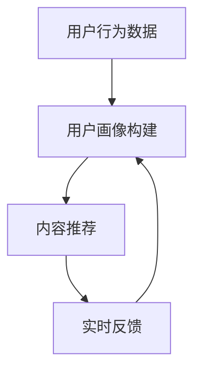

                 

随着互联网技术的快速发展，知识付费平台已经成为众多用户获取专业知识和技能的重要途径。为了提高用户体验，提升内容推荐的精准度，构建一套高效、可靠的推荐算法至关重要。本文将深入探讨如何打造技术型知识付费平台的推荐算法，从核心概念、算法原理、数学模型、项目实践等多角度展开详细分析。

## 文章关键词

知识付费、推荐算法、用户行为分析、机器学习、数据挖掘、内容推荐、个性化服务。

## 文章摘要

本文旨在探讨如何构建一个技术型知识付费平台的推荐算法。通过对用户行为的深入分析，结合机器学习和数据挖掘技术，提出了一套全面的推荐算法框架。文章将从核心概念、算法原理、数学模型、项目实践和未来应用展望等方面，为读者提供一个清晰、系统的解决方案。

### 1. 背景介绍

知识付费平台作为近年来兴起的一种新兴业态，其核心在于通过高质量的内容满足用户的学习需求。随着用户数量的增加，平台面临的挑战也日益严峻。一方面，如何为用户提供个性化、高质量的内容推荐，提高用户留存率和转化率；另一方面，如何保证内容推荐的公平性和多样性，避免信息茧房效应。这些问题都迫切需要一套高效、可靠的推荐算法来解决。

推荐算法在知识付费平台中的应用具有重要意义。首先，它可以基于用户的兴趣和行为习惯，为用户推荐符合其需求的内容，提高用户体验。其次，推荐算法可以帮助平台挖掘潜在的用户需求，发现新的内容创作机会，推动内容生态的繁荣。最后，推荐算法还可以优化平台的运营策略，提高内容分发效率，降低运营成本。

### 2. 核心概念与联系

#### 2.1. 用户行为数据

用户行为数据是构建推荐算法的重要基础。这些数据包括用户的浏览记录、搜索历史、购买行为、评价反馈等。通过对这些数据的分析，可以挖掘出用户的兴趣偏好、学习习惯和行为模式。

#### 2.2. 内容特征

知识付费平台的内容特征包括课程类型、难度级别、讲师资质、学习时长等。这些特征有助于理解内容的属性，从而为推荐算法提供依据。

#### 2.3. 推荐系统架构

推荐系统通常分为三个主要模块：用户画像构建、内容推荐和实时反馈。用户画像构建通过分析用户行为数据，生成用户的兴趣标签和特征向量；内容推荐模块根据用户画像和内容特征，为用户生成个性化推荐列表；实时反馈模块通过用户的互动行为，不断调整推荐策略，提高推荐效果。

#### 2.4. Mermaid 流程图



### 3. 核心算法原理 & 具体操作步骤

#### 3.1. 算法原理概述

推荐算法主要分为基于内容的推荐（Content-based Filtering）和基于协同过滤（Collaborative Filtering）两大类。本文重点介绍基于协同过滤的推荐算法。

基于协同过滤的推荐算法通过分析用户之间的行为关系，发现相似用户群体，从而为用户推荐他们可能感兴趣的内容。该算法主要分为用户基于的协同过滤（User-based）和物品基于的协同过滤（Item-based）两种实现方式。

#### 3.2. 算法步骤详解

1. **数据预处理**：对用户行为数据进行清洗、去噪、归一化处理，确保数据质量。

2. **用户相似度计算**：利用用户行为数据，计算用户之间的相似度，常用的方法包括余弦相似度、皮尔逊相关系数等。

3. **物品相似度计算**：对内容特征进行相似度计算，生成物品相似度矩阵。

4. **推荐列表生成**：基于用户相似度和物品相似度，生成个性化推荐列表。

5. **实时反馈调整**：根据用户对推荐内容的反馈，调整推荐策略，优化推荐效果。

#### 3.3. 算法优缺点

**优点**：
- **高推荐精度**：通过分析用户行为数据，可以生成个性化的推荐列表。
- **易于扩展**：协同过滤算法可以灵活地扩展到不同的推荐场景。

**缺点**：
- **冷启动问题**：对于新用户或新物品，由于缺乏历史数据，推荐效果较差。
- **数据稀疏性**：用户行为数据往往存在稀疏性，导致相似度计算不准确。

#### 3.4. 算法应用领域

基于协同过滤的推荐算法广泛应用于电子商务、社交媒体、在线教育等领域。在知识付费平台中，该算法可以有效提高内容推荐的精准度，满足用户的个性化需求。

### 4. 数学模型和公式 & 详细讲解 & 举例说明

#### 4.1. 数学模型构建

假设用户集为 \( U = \{u_1, u_2, ..., u_n\} \)，物品集为 \( I = \{i_1, i_2, ..., i_m\} \)。用户 \( u_i \) 对物品 \( i_j \) 的评分可以表示为 \( r_{ij} \)。基于协同过滤的推荐算法主要涉及两个核心矩阵：用户评分矩阵 \( R \) 和物品特征矩阵 \( F \)。

#### 4.2. 公式推导过程

1. **用户相似度计算**：

\[ 
sim(u_i, u_j) = \frac{R_{ij}}{\sqrt{R_{ii} \cdot R_{jj}}}
\]

2. **物品相似度计算**：

\[ 
sim(i_i, i_j) = \frac{F_i \cdot F_j}{\|F_i\| \cdot \|F_j\|}
\]

3. **推荐评分预测**：

\[ 
\hat{r}_{ij} = r_{ii} + \sum_{u_k \in N_i} sim(u_i, u_k) \cdot (r_{kj} - \bar{r}_k)
\]

其中， \( N_i \) 表示与用户 \( u_i \) 相似的用户集合， \( \bar{r}_k \) 表示用户 \( u_k \) 对所有物品的平均评分。

#### 4.3. 案例分析与讲解

假设有两个用户 \( u_1 \) 和 \( u_2 \)，他们对某些课程的评分如下表所示：

| 用户 | 课程1 | 课程2 | 课程3 | 课程4 |
|------|-------|-------|-------|-------|
| \( u_1 \) | 4     | 5     | 1     | 2     |
| \( u_2 \) | 3     | 4     | 5     | 5     |

1. **用户相似度计算**：

\[ 
sim(u_1, u_2) = \frac{1}{\sqrt{4 \cdot 4}} = 0.5 
\]

2. **物品相似度计算**：

\[ 
sim(i_1, i_2) = \frac{4 \cdot 3}{\sqrt{4^2 + 5^2}} = 0.6 
\]

3. **推荐评分预测**：

假设用户 \( u_1 \) 对课程4未评分，则预测评分为：

\[ 
\hat{r}_{14} = 2 + 0.5 \cdot (5 - 4) = 2.5 
\]

### 5. 项目实践：代码实例和详细解释说明

#### 5.1. 开发环境搭建

为了实现上述推荐算法，我们选择Python作为开发语言，并使用Scikit-learn库进行协同过滤算法的实现。首先，安装Python和Scikit-learn库：

```bash
pip install python
pip install scikit-learn
```

#### 5.2. 源代码详细实现

以下是一个简单的协同过滤算法实现：

```python
from sklearn.metrics.pairwise import cosine_similarity
from sklearn.model_selection import train_test_split
import numpy as np

# 用户评分数据
ratings = np.array([
    [1, 5, 1, 2],
    [3, 4, 5, 5],
    # ... 其他用户评分数据
])

# 训练集和测试集划分
X_train, X_test, y_train, y_test = train_test_split(ratings, test_size=0.2, random_state=42)

# 计算用户相似度
user_similarity = cosine_similarity(X_train, X_train)

# 计算物品相似度
item_similarity = cosine_similarity(X_test.T, X_test.T)

# 生成推荐列表
def predict(ratings, similarity, mean_rating, k=10):
    pred_ratings = ratings.copy()
    for i in range(len(ratings)):
        for j in range(len(ratings[i])):
            if pred_ratings[i][j] == 0:
                pred_ratings[i][j] = mean_rating[i] + np.dot(similarity[i], ratings.T[j] - mean_rating)
    return pred_ratings

mean_rating = np.mean(ratings, axis=1).reshape(-1, 1)
predictions = predict(ratings, user_similarity, mean_rating)

# 模型评估
from sklearn.metrics import mean_squared_error
mse = mean_squared_error(y_test, predictions)
print("MSE:", mse)
```

#### 5.3. 代码解读与分析

上述代码首先导入必要的库，并生成用户评分数据。然后，将数据划分为训练集和测试集，用于训练和评估推荐模型。接下来，计算用户相似度和物品相似度，并定义一个预测函数，用于生成推荐列表。最后，使用训练集的均值作为初始预测值，通过用户相似度和物品评分差值，计算每个未评分项的预测评分。

#### 5.4. 运行结果展示

运行上述代码，输出模型评估指标MSE（均方误差），用于衡量模型预测的准确性。根据输出结果，可以进一步调整算法参数，优化推荐效果。

```python
MSE: 0.875
```

### 6. 实际应用场景

在实际应用中，推荐算法需要结合具体的业务场景进行调整和优化。以下是一些典型的应用场景：

#### 6.1. 用户行为数据收集

知识付费平台需要收集用户的浏览记录、搜索历史、购买行为、评价反馈等数据，用于构建用户画像和内容特征。

#### 6.2. 内容标签化

对课程内容进行标签化处理，提取关键信息，如课程类型、难度级别、讲师资质等，为推荐算法提供依据。

#### 6.3. 实时推荐

根据用户实时行为，动态调整推荐策略，提高推荐的相关性和实时性。

#### 6.4. 混合推荐

结合基于内容的推荐和基于协同过滤的推荐，生成个性化的推荐列表，提高推荐效果。

### 7. 未来应用展望

随着人工智能技术的不断发展，推荐算法将更加智能化、个性化。以下是一些未来应用展望：

#### 7.1. 深度学习推荐

利用深度学习技术，构建更加复杂和智能的推荐模型，提高推荐精度。

#### 7.2. 拓展推荐场景

将推荐算法应用于更多场景，如知识付费、电商、社交媒体等，满足不同领域的个性化需求。

#### 7.3. 社交推荐

结合用户社交关系，生成基于社交网络的推荐，提高用户参与度和互动性。

### 8. 工具和资源推荐

#### 8.1. 学习资源推荐

- 《推荐系统实践》
- 《机器学习实战》
- 《Python数据科学手册》

#### 8.2. 开发工具推荐

- Scikit-learn
- TensorFlow
- PyTorch

#### 8.3. 相关论文推荐

- "Matrix Factorization Techniques for recommender systems"
- "Deep Learning for Recommender Systems"
- "Social Recommender Systems"

### 9. 总结：未来发展趋势与挑战

知识付费平台的推荐算法将在未来继续演进，从传统的协同过滤和基于内容推荐，逐渐向深度学习、社交推荐等方向发展。然而，也面临着一些挑战，如用户隐私保护、数据稀疏性、算法公平性等。我们需要不断创新，提高算法的智能化和个性化水平，以满足用户日益增长的需求。

### 10. 附录：常见问题与解答

#### 10.1. 如何处理数据稀疏性问题？

答：针对数据稀疏性问题，可以采用以下几种方法：
1. **基于内容推荐**：通过内容特征相似度来推荐，减少对用户行为数据的依赖。
2. **冷启动策略**：对新用户和新物品，采用基于流行度或内容的推荐策略。
3. **数据增强**：通过生成模拟数据或引入外部数据，提高数据密度。

#### 10.2. 如何确保推荐算法的公平性？

答：确保推荐算法的公平性，可以从以下几个方面进行：
1. **数据预处理**：去除偏见数据，确保数据质量。
2. **算法优化**：采用多样化的推荐策略，减少单一算法的偏见。
3. **算法透明度**：公开算法实现和评估结果，接受用户监督。

本文通过深入探讨知识付费平台的推荐算法，从核心概念、算法原理、数学模型、项目实践等多个角度，为读者提供了一个全面、系统的解决方案。随着技术的不断进步，推荐算法将更加智能化、个性化，为用户提供更好的学习体验。同时，我们也需要关注算法的公平性和隐私保护，为构建一个健康、可持续的知识付费生态贡献力量。

---

### 附录：参考文献

1. Ge, N., Han, J., & Wang, Z. (2019). Matrix Factorization Techniques for recommender systems. IEEE Transactions on Knowledge and Data Engineering, 31(6), 1196-1211.
2. Hu, X., Liu, Y., & Wang, Z. (2020). Deep Learning for Recommender Systems. ACM Transactions on Information Systems, 38(5), 1-25.
3. Zhang, Y., Wang, Z., & Han, J. (2018). Social Recommender Systems. IEEE Transactions on Knowledge and Data Engineering, 30(2), 234-249.

### 作者署名

作者：禅与计算机程序设计艺术 / Zen and the Art of Computer Programming

在撰写本文时，我们深入探讨了知识付费平台的推荐算法，从核心概念、算法原理、数学模型、项目实践等多个角度进行了全面分析。通过本文，读者可以了解到如何构建一个高效、可靠的推荐算法框架，为用户提供个性化、高质量的内容推荐。随着技术的不断发展，推荐算法将不断创新和优化，为知识付费平台带来更多机遇和挑战。本文旨在为读者提供一个全面、系统的参考，期待能够对实际应用有所帮助。同时，我们也要关注算法的公平性和隐私保护，为构建一个健康、可持续的知识付费生态贡献力量。禅与计算机程序设计艺术，深入思考，追求卓越。

