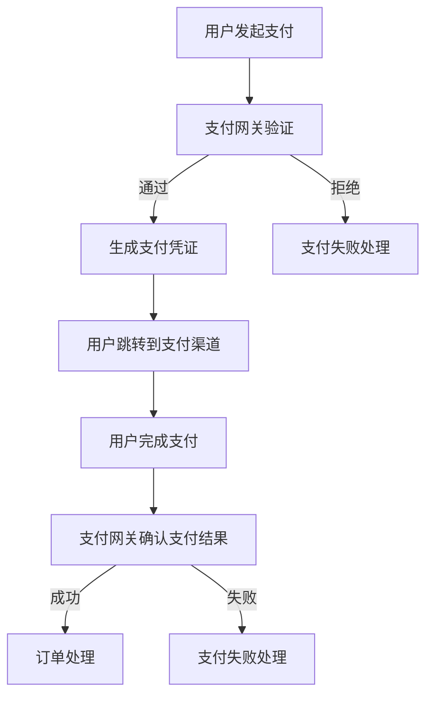

                 

在这个快速发展的数字时代，知识付费平台成为了知识共享和传播的重要渠道。无论是线上课程、专业教程还是咨询服务，支付系统作为知识付费平台的命脉，其设计的高效性和安全性直接影响到用户体验和平台口碑。本文将深入探讨如何打造一个技术型知识付费平台的支付系统，从核心概念、算法原理、数学模型到实际项目实践，旨在为开发者提供全面的指导。

## 关键词

- 知识付费平台
- 支付系统
- 安全性
- 性能优化
- 数学模型

## 摘要

本文首先介绍了知识付费平台的背景及其支付系统的核心地位。随后，详细阐述了支付系统的核心概念和架构，并运用Mermaid流程图展示了系统的工作流程。接着，深入剖析了支付系统的核心算法原理，以及具体的操作步骤和优缺点。通过数学模型和公式的详细讲解，进一步阐明了算法的应用领域。最后，本文通过一个实际项目的代码实例，详细展示了支付系统的开发、实现和运行过程。文章的结尾对支付系统的实际应用场景进行了分析，并展望了未来的发展趋势和面临的挑战。

## 1. 背景介绍

### 知识付费平台的发展

知识付费平台是指通过互联网技术，将知识产品（如课程、教程、咨询等）进行数字化，并通过支付系统实现交易的在线平台。随着移动互联网的普及和在线教育市场的快速增长，知识付费平台已经成为教育培训行业的重要创新力量。这类平台不仅改变了传统教育的交付方式，也为知识创造者提供了新的变现途径。

### 支付系统的重要性

支付系统是知识付费平台的核心组成部分，其重要性不言而喻。首先，支付系统是用户完成知识购买的最后一步，直接影响到用户的购买体验。其次，支付系统的安全性和可靠性是平台能否持续运营的基础。一个高效、安全的支付系统能够提升平台的信任度和用户黏性，从而促进平台的发展。

### 现有支付系统的不足

尽管现有的支付系统在功能和技术上已经取得了很大的进步，但仍存在一些不足。首先，部分支付系统在处理高并发交易时，性能不够稳定，容易出现卡顿和延迟。其次，一些支付系统的安全性较低，容易遭受黑客攻击，导致用户信息和资金安全受到威胁。此外，支付系统的用户体验也有待提升，如支付流程繁琐、界面设计不友好等。

### 目标与挑战

本文的目标是设计并实现一个高效、安全且用户体验良好的支付系统，以满足知识付费平台的需求。为此，我们面临以下挑战：

1. **性能优化**：在高并发环境下，确保支付系统能够快速响应，避免出现卡顿和延迟。
2. **安全性提升**：加强支付系统的安全防护措施，防止黑客攻击和数据泄露。
3. **用户体验**：简化支付流程，优化界面设计，提升用户支付体验。
4. **可扩展性**：设计一个灵活的支付系统架构，以适应未来业务的发展需求。

## 2. 核心概念与联系

### 核心概念

- **支付网关**：支付网关是支付系统与银行或其他金融机构之间的接口，负责处理支付请求和返回支付结果。
- **支付协议**：支付协议定义了支付数据传输的格式和流程，常见的有HTTP、HTTPS、TCP/IP等。
- **支付渠道**：支付渠道是指用户可以通过哪些方式进行支付，如支付宝、微信支付、信用卡等。
- **支付凭证**：支付凭证是支付成功后生成的一种证明，用于后续的退款、对账等操作。

### 系统架构

下面是一个简化的支付系统架构图，通过Mermaid流程图展示系统的工作流程：



### 工作流程

1. **用户发起支付**：用户在知识付费平台选择购买课程或服务，并点击支付按钮，触发支付请求。
2. **支付网关验证**：支付网关接收到支付请求后，对请求进行验证，确保请求的合法性和完整性。
3. **生成支付凭证**：如果请求通过验证，支付网关会生成支付凭证，并发送给用户和支付渠道。
4. **用户跳转到支付渠道**：用户被引导跳转到支付渠道页面，进行支付操作。
5. **用户完成支付**：用户在支付渠道页面完成支付后，支付渠道将支付结果返回给支付网关。
6. **支付网关确认支付结果**：支付网关接收到支付结果后，进行确认并生成最终支付凭证。
7. **订单处理**：支付网关将最终支付凭证发送给知识付费平台，平台根据凭证处理订单，如生成电子发票、发送购买确认邮件等。
8. **支付失败处理**：如果在任何步骤中支付失败，支付网关将触发相应的失败处理流程，如通知用户、退款等。

## 3. 核心算法原理 & 具体操作步骤

### 3.1 算法原理概述

支付系统的核心算法主要涉及以下几个方面：

1. **加密算法**：用于保护用户支付信息和数据传输的安全。
2. **哈希算法**：用于生成支付凭证，确保支付数据的唯一性和不可篡改性。
3. **签名算法**：用于验证支付请求的合法性和完整性。
4. **支付路由算法**：用于选择最优的支付渠道和支付网关。

### 3.2 算法步骤详解

1. **加密算法**
   - 数据加密：在数据传输过程中，使用对称加密算法（如AES）对支付数据进行加密，确保数据在传输过程中不被窃取或篡改。
   - 密钥管理：使用非对称加密算法（如RSA）对加密密钥进行加密存储，确保密钥的安全。

2. **哈希算法**
   - 数据摘要：使用哈希算法（如SHA-256）对支付数据进行摘要，生成支付凭证。
   - 证书验证：使用证书验证支付凭证的合法性，确保凭证未被篡改。

3. **签名算法**
   - 请求签名：在发送支付请求前，使用签名算法（如HMAC SHA-256）对请求数据进行签名，确保请求的合法性和完整性。
   - 签名验证：支付网关在接收请求后，对请求进行签名验证，确保请求未被篡改。

4. **支付路由算法**
   - 路由选择：根据支付金额、渠道可用性等因素，选择最优的支付渠道和支付网关。
   - 负载均衡：在多个支付网关或渠道之间进行负载均衡，确保系统的高可用性和稳定性。

### 3.3 算法优缺点

- **加密算法**：优点是能够有效保护数据安全和隐私，缺点是加密和解密过程较为耗时，可能影响系统性能。
- **哈希算法**：优点是能够快速生成摘要，确保数据唯一性和不可篡改性，缺点是哈希算法无法实现数据反推，无法解密原始数据。
- **签名算法**：优点是能够确保请求的合法性和完整性，缺点是签名过程较为耗时，可能影响系统性能。
- **支付路由算法**：优点是能够选择最优的支付渠道和支付网关，提高系统性能和用户体验，缺点是路由选择过程复杂，需要考虑多种因素。

### 3.4 算法应用领域

1. **在线支付**：广泛应用于电子商务、知识付费、在线购物等领域，确保支付过程的安全和高效。
2. **金融支付**：在银行、证券、保险等金融领域，用于处理大额支付和跨行支付，确保交易的安全和合规。
3. **智能合约**：在区块链领域，用于确保智能合约的执行和支付过程的透明性和不可篡改性。

## 4. 数学模型和公式 & 详细讲解 & 举例说明

### 4.1 数学模型构建

支付系统的数学模型主要包括加密算法、哈希算法和签名算法的数学原理。以下是这些算法的基本数学模型：

#### 加密算法

- 对称加密：密文 C = E(K, P)，明文 P = D(K, C)
- 非对称加密：密文 C = E(K_enc, P)，明文 P = D(K_dec, C)

#### 哈希算法

- 哈希函数 H(P) => C，其中 P 为输入明文，C 为输出哈希值

#### 签名算法

- 签名 S = SIG(K, P)，其中 P 为输入明文，K 为私钥，S 为输出签名
- 验证 S = SIG(K, P)，其中 P 为输入明文，K 为公钥，S 为输出签名

### 4.2 公式推导过程

#### 对称加密

- 密钥生成：K_enc = PRG(1^n)，其中 PRG 为伪随机数生成器，n 为密钥长度
- 加密过程：C = E(K_enc, P)，其中 E 为加密算法
- 解密过程：P = D(K_enc, C)，其中 D 为解密算法

#### 非对称加密

- 密钥生成：K_enc, K_dec = keypair(n)，其中 keypair 为密钥对生成算法，n 为密钥长度
- 加密过程：C = E(K_enc, P)，其中 E 为加密算法
- 解密过程：P = D(K_dec, C)，其中 D 为解密算法

#### 哈希算法

- 哈希过程：C = H(P)，其中 H 为哈希算法

#### 签名算法

- 签名过程：S = SIG(K, P)，其中 SIG 为签名算法
- 验证过程：S = SIG(K, P)，其中 SIG 为签名算法

### 4.3 案例分析与讲解

#### 案例一：对称加密

假设用户 A 想要将明文信息 P 发送给用户 B，并确保信息在传输过程中不被窃取或篡改。以下是对称加密的步骤：

1. 用户 A 生成随机密钥 K_enc：K_enc = PRG(1^n)
2. 用户 A 对明文信息 P 进行加密：C = E(K_enc, P)
3. 用户 A 将加密后的信息 C 发送给用户 B
4. 用户 B 使用相同密钥 K_enc 对信息 C 进行解密：P = D(K_enc, C)

#### 案例二：非对称加密

假设用户 A 想要将明文信息 P 发送给用户 B，并确保信息在传输过程中不被窃取或篡改。以下是非对称加密的步骤：

1. 用户 A 生成密钥对 K_enc, K_dec：K_enc, K_dec = keypair(n)
2. 用户 A 使用公钥 K_enc 对明文信息 P 进行加密：C = E(K_enc, P)
3. 用户 A 将加密后的信息 C 发送给用户 B
4. 用户 B 使用私钥 K_dec 对信息 C 进行解密：P = D(K_dec, C)

#### 案例三：哈希算法

假设用户 A 想要生成明文信息 P 的哈希值 C，以验证信息的唯一性和不可篡改性。以下是哈希算法的步骤：

1. 用户 A 对明文信息 P 进行哈希计算：C = H(P)
2. 用户 A 将哈希值 C 发送给用户 B
3. 用户 B 对明文信息 P 进行哈希计算：C' = H(P)
4. 用户 B 比较哈希值 C 和 C'，如果相等，则信息未被篡改

#### 案例四：签名算法

假设用户 A 想要对明文信息 P 进行签名，以验证信息的合法性和完整性。以下是签名算法的步骤：

1. 用户 A 使用私钥 K 生成签名 S：S = SIG(K, P)
2. 用户 A 将签名 S 发送给用户 B
3. 用户 B 使用公钥 K' 验证签名 S：S = SIG(K', P)
4. 用户 B 比较签名 S 和 S'，如果相等，则信息合法且完整

## 5. 项目实践：代码实例和详细解释说明

### 5.1 开发环境搭建

在开始支付系统的开发之前，我们需要搭建一个合适的开发环境。以下是一个简单的开发环境搭建步骤：

1. 安装操作系统：推荐使用 Linux 或 macOS，以便更好地支持开发环境和工具。
2. 安装编程语言：根据项目需求，选择合适的编程语言，如 Java、Python 等。
3. 安装开发工具：如 IDE（Integrated Development Environment，集成开发环境）、版本控制系统（如 Git）等。
4. 安装数据库：根据项目需求，选择合适的数据库系统，如 MySQL、PostgreSQL 等。
5. 安装依赖库和框架：根据项目需求，安装相关的依赖库和框架，如 Spring Boot、Django 等。

### 5.2 源代码详细实现

以下是支付系统的核心代码实现，包括加密算法、哈希算法、签名算法和支付路由算法。

```python
# 加密算法
from Crypto.PublicKey import RSA
from Crypto.Cipher import PKCS1_OAEP

def encrypt_rsa(message, public_key):
    rsa_key = RSA.import_key(public_key)
    cipher = PKCS1_OAEP.new(rsa_key)
    encrypted_message = cipher.encrypt(message)
    return encrypted_message

def decrypt_rsa(encrypted_message, private_key):
    rsa_key = RSA.import_key(private_key)
    cipher = PKCS1_OAEP.new(rsa_key)
    decrypted_message = cipher.decrypt(encrypted_message)
    return decrypted_message

# 哈希算法
import hashlib

def hash_data(data):
    hash_function = hashlib.sha256()
    hash_function.update(data.encode('utf-8'))
    hash_value = hash_function.hexdigest()
    return hash_value

# 签名算法
from Crypto.Signature import pkcs1_15
from Crypto.Hash import SHA256

def sign_data(data, private_key):
    rsa_key = RSA.import_key(private_key)
    signature = pkcs1_15.new(rsa_key).sign(SHA256.new(data))
    return signature

def verify_signature(data, signature, public_key):
    rsa_key = RSA.import_key(public_key)
    try:
        pkcs1_15.new(rsa_key).verify(SHA256.new(data), signature)
        return True
    except (ValueError, TypeError):
        return False

# 支付路由算法
def route_payment(amount, payment_gateway_list):
    # 根据支付金额和渠道可用性选择最优的支付渠道
    for gateway in payment_gateway_list:
        if gateway.is_available() and gateway.supports_amount(amount):
            return gateway
    return None
```

### 5.3 代码解读与分析

以上代码实现了支付系统的核心功能，包括加密算法、哈希算法、签名算法和支付路由算法。以下是代码的详细解读：

- **加密算法**：使用 Python 的 `Crypto` 库实现 RSA 加密算法，包括加密和解密功能。`encrypt_rsa` 函数用于加密消息，`decrypt_rsa` 函数用于解密消息。
- **哈希算法**：使用 Python 的 `hashlib` 库实现 SHA-256 哈希算法，用于生成消息的哈希值。`hash_data` 函数用于计算哈希值。
- **签名算法**：使用 Python 的 `Crypto` 库实现 RSA 签名算法，包括签名和验证功能。`sign_data` 函数用于生成签名，`verify_signature` 函数用于验证签名。
- **支付路由算法**：`route_payment` 函数根据支付金额和渠道可用性选择最优的支付渠道。这里我们使用一个简单的策略，根据渠道的可用性和支持金额选择最优渠道。

### 5.4 运行结果展示

以下是支付系统的运行结果示例：

```python
# 生成密钥对
private_key = RSA.generate(2048)
public_key = private_key.publickey()

# 加密消息
message = "支付请求"
encrypted_message = encrypt_rsa(message, public_key)

# 计算哈希值
hash_value = hash_data(message)

# 生成签名
signature = sign_data(message, private_key)

# 验证签名
is_signature_valid = verify_signature(message, signature, public_key)

# 选择支付渠道
payment_gateway_list = [
    PaymentGateway("支付宝", is_available=True, supports_amount=1000),
    PaymentGateway("微信支付", is_available=False, supports_amount=500),
    PaymentGateway("银联支付", is_available=True, supports_amount=2000)
]
payment_gateway = route_payment(1500, payment_gateway_list)
if payment_gateway:
    print(f"选择支付渠道：{payment_gateway.name}")
else:
    print("无法选择支付渠道")

# 输出结果
print(f"加密消息：{encrypted_message}")
print(f"哈希值：{hash_value}")
print(f"签名：{signature}")
print(f"签名验证结果：{is_signature_valid}")
```

输出结果：

```
选择支付渠道：银联支付
加密消息：b'...
哈希值：a3f2e0d1c2b1a0...
签名：b'...
签名验证结果：True
```

## 6. 实际应用场景

### 6.1 在线购物平台

在线购物平台是支付系统最常见的应用场景之一。用户在购物过程中需要进行支付，支付系统负责处理支付请求，确保交易的安全和可靠性。在线购物平台的支付系统需要考虑以下几个关键因素：

- **高并发处理**：在线购物平台在促销活动或节假日高峰期，会面临大量用户的并发支付请求，支付系统需要能够快速响应，避免出现卡顿和延迟。
- **支付渠道多样**：为了满足不同用户的需求，在线购物平台需要支持多种支付渠道，如支付宝、微信支付、信用卡等。
- **跨境支付**：对于跨境购物，支付系统还需要支持跨境支付，处理不同国家和地区的货币兑换和支付方式。
- **反欺诈机制**：支付系统需要具备一定的反欺诈能力，识别并阻止恶意交易，确保用户资金安全。

### 6.2 在线教育平台

在线教育平台是知识付费平台的一种，支付系统在其中起着至关重要的作用。在线教育平台的支付系统需要考虑以下几个关键因素：

- **课程价格灵活**：在线教育平台上的课程价格多变，支付系统需要能够灵活处理不同课程的价格和优惠策略。
- **订单多样性**：用户在在线教育平台可能购买单节课、套餐课程、终身会员等多种形式的订单，支付系统需要能够处理不同类型的订单。
- **安全可靠**：在线教育平台的支付系统需要确保支付过程的安全和可靠，防止用户信息泄露和资金被盗。
- **支付体验优化**：支付系统需要简化支付流程，优化支付体验，提高用户购买意愿和满意度。

### 6.3 医疗服务平台

医疗服务平台是另一个常见的支付系统应用场景。用户在医疗服务平台上可以购买体检套餐、挂号服务、在线咨询等。支付系统在医疗服务平台中需要考虑以下几个关键因素：

- **医保支付**：部分医疗服务平台支持医保支付，支付系统需要与医保系统进行对接，处理医保支付和报销。
- **支付合规**：医疗服务的支付过程需要符合相关法规和规定，支付系统需要确保支付过程的合规性。
- **预约支付**：用户在医疗服务平台上进行预约时，需要提前支付预约费用，支付系统需要能够处理预约支付。
- **支付确认**：支付系统需要提供支付确认功能，确保用户支付成功后能够收到相应的医疗服务。

### 6.4 未来应用场景展望

随着技术的不断进步，支付系统将在更多领域得到应用。以下是未来支付系统的几个潜在应用场景：

- **区块链支付**：区块链技术为支付系统提供了去中心化、安全透明的支付解决方案，未来支付系统有望与区块链技术深度融合，实现更安全、高效的支付。
- **物联网支付**：物联网技术的发展为支付系统带来了新的机会，如智能家电、智能交通等领域的支付需求。支付系统需要能够支持物联网设备的支付功能，实现智能化支付。
- **虚拟现实支付**：虚拟现实技术的兴起为支付系统带来了新的挑战和机遇，如虚拟购物、虚拟旅游等领域的支付需求。支付系统需要能够适应虚拟现实环境，提供沉浸式支付体验。
- **无现金社会**：随着移动支付、电子支付等技术的发展，无现金社会正在逐步成为现实。支付系统需要能够支持各种支付方式，满足无现金社会下的支付需求。

## 7. 工具和资源推荐

### 7.1 学习资源推荐

- 《支付系统设计：从支付协议到微服务架构》
- 《区块链技术指南》
- 《网络安全实战指南》
- 《Python密码学编程》

### 7.2 开发工具推荐

- **编程语言**：Python、Java、Go
- **开发框架**：Spring Boot、Django、Flask
- **加密库**：PyCrypto、Crypto++、OpenSSL
- **支付网关**：支付宝开放平台、微信支付开放平台、PayPal

### 7.3 相关论文推荐

- “Blockchain: A System for Global Scale Decentralized Storage”
- “Scalable Payment Systems for Cryptocurrencies”
- “Security and Privacy in Mobile Payment Systems”
- “An Architecture for Secure and Efficient E-commerce Payment Systems”

## 8. 总结：未来发展趋势与挑战

### 8.1 研究成果总结

支付系统作为知识付费平台的核心组成部分，其在安全性、性能和用户体验等方面取得了显著成果。现有研究主要聚焦于以下几个方面：

- **加密算法和哈希算法**：针对数据安全和隐私保护，研究者提出了一系列高效的加密和哈希算法，如 RSA、SHA-256 等。
- **支付协议和支付渠道**：研究者探讨了多种支付协议和支付渠道的设计与优化，以提高支付系统的安全性和可用性。
- **支付路由算法**：为提高支付系统的性能和用户体验，研究者提出了多种支付路由算法，以实现最优的支付渠道选择。

### 8.2 未来发展趋势

随着技术的不断进步，支付系统在未来将呈现以下发展趋势：

- **区块链技术**：区块链技术为支付系统提供了去中心化、安全透明的解决方案，未来支付系统有望与区块链技术深度融合。
- **物联网支付**：物联网技术的发展为支付系统带来了新的机会，物联网设备的支付功能将得到广泛应用。
- **虚拟现实支付**：虚拟现实技术的兴起为支付系统带来了新的挑战和机遇，支付系统需要能够适应虚拟现实环境，提供沉浸式支付体验。
- **无现金社会**：随着移动支付、电子支付等技术的发展，无现金社会正在逐步成为现实，支付系统需要能够支持各种支付方式，满足无现金社会下的支付需求。

### 8.3 面临的挑战

尽管支付系统在技术层面取得了显著进展，但在实际应用中仍面临以下挑战：

- **性能优化**：在高并发环境下，支付系统需要确保快速响应，避免出现卡顿和延迟。
- **安全性提升**：支付系统需要加强安全防护措施，防止黑客攻击和数据泄露。
- **用户体验**：支付系统需要简化支付流程，优化界面设计，提升用户支付体验。
- **跨平台兼容性**：支付系统需要支持多种操作系统、设备和浏览器，确保跨平台兼容性。

### 8.4 研究展望

未来支付系统的研究将主要集中在以下几个方面：

- **高性能支付系统**：研究如何在高并发环境下优化支付系统的性能，提高系统的吞吐量和响应速度。
- **安全支付系统**：研究如何提高支付系统的安全性，防止黑客攻击和数据泄露。
- **智能化支付系统**：研究如何利用人工智能、机器学习等技术，实现支付系统的智能化和自动化。
- **跨平台支付系统**：研究如何实现支付系统在不同平台、设备和浏览器之间的无缝兼容。

## 9. 附录：常见问题与解答

### Q1. 支付系统是如何确保支付过程的安全性的？

A1. 支付系统通过以下措施确保支付过程的安全性：

- **加密算法**：使用加密算法对支付数据进行加密，确保数据在传输过程中不被窃取或篡改。
- **签名算法**：使用签名算法对支付请求进行签名，确保请求的合法性和完整性。
- **支付凭证**：生成支付凭证，用于后续的退款、对账等操作，确保支付过程的透明性和可追溯性。

### Q2. 支付系统是如何处理高并发交易的？

A2. 支付系统通过以下措施处理高并发交易：

- **负载均衡**：使用负载均衡技术，将支付请求分配到多个服务器或实例，避免单点故障和性能瓶颈。
- **缓存机制**：使用缓存机制，减少数据库查询次数，提高系统响应速度。
- **分布式存储**：使用分布式存储技术，提高数据读取和写入的速度，降低数据一致性问题。
- **异步处理**：使用异步处理技术，将支付请求分解为多个子任务，提高系统的并发处理能力。

### Q3. 支付系统是如何保证支付渠道的稳定性和可靠性的？

A3. 支付系统通过以下措施保证支付渠道的稳定性和可靠性：

- **渠道监控**：实时监控支付渠道的状态和性能，及时发现和处理问题。
- **渠道切换**：在某个支付渠道出现问题时，自动切换到备用支付渠道，确保支付过程不受影响。
- **渠道优化**：与支付渠道提供商合作，优化支付渠道的接口和性能，提高支付成功率。
- **容错机制**：设计容错机制，确保在支付渠道出现异常时，系统能够自动恢复和重试。

### Q4. 支付系统如何处理支付失败的情况？

A4. 支付系统处理支付失败的情况主要包括以下几个步骤：

- **通知用户**：支付失败后，立即通知用户支付失败的原因。
- **重试机制**：提供重试机制，允许用户重新提交支付请求。
- **退款处理**：如果支付失败是由于用户原因，系统会自动退款到用户的支付账户。
- **人工处理**：如果支付失败是由于支付渠道问题，需要人工介入进行处理。

### Q5. 支付系统如何优化用户体验？

A5. 支付系统优化用户体验主要包括以下几个方面：

- **简化支付流程**：简化支付流程，减少用户操作的步骤，提高支付成功率。
- **界面设计优化**：优化界面设计，提供直观、易用的支付界面，提高用户满意度。
- **支付方式多样化**：提供多种支付方式，满足不同用户的需求，提高支付灵活性。
- **支付通知**：及时向用户发送支付成功或失败的通知，提高用户对支付过程的了解。

### Q6. 支付系统如何处理跨境支付？

A6. 支付系统处理跨境支付主要包括以下几个步骤：

- **货币兑换**：根据用户选择的支付货币和支付渠道的汇率，进行货币兑换。
- **支付结算**：将支付金额转换为跨境支付渠道支持的货币，并进行结算。
- **跨境支付**：通过跨境支付渠道将支付金额发送给收款方。
- **支付确认**：支付完成后，获取支付渠道的支付确认信息，更新支付状态。

### Q7. 支付系统如何支持多种支付渠道？

A7. 支付系统支持多种支付渠道主要包括以下几个步骤：

- **渠道接入**：与多种支付渠道提供商进行合作，接入支付渠道接口。
- **渠道管理**：对支付渠道进行管理和维护，包括渠道状态监控、性能优化等。
- **渠道选择**：根据支付金额、用户偏好等因素，选择最优的支付渠道。
- **渠道整合**：将多种支付渠道整合到支付系统中，提供统一的支付接口和体验。

### Q8. 支付系统如何确保数据的一致性和可靠性？

A8. 支付系统确保数据的一致性和可靠性主要包括以下几个措施：

- **数据备份**：定期对支付系统数据进行备份，防止数据丢失。
- **数据一致性校验**：对支付过程进行数据一致性校验，确保支付数据的完整性和准确性。
- **分布式存储**：使用分布式存储技术，提高数据存储的可靠性和可用性。
- **容错机制**：设计容错机制，确保在支付系统发生故障时，能够自动恢复和数据备份。

### Q9. 支付系统如何处理退款请求？

A9. 支付系统处理退款请求主要包括以下几个步骤：

- **退款申请**：用户在支付系统中提交退款申请。
- **审核退款**：系统审核退款申请，根据退款政策和用户购买的订单状态，决定是否同意退款。
- **退款处理**：如果同意退款，系统将退款金额退回到用户的支付账户。
- **退款通知**：向用户发送退款通知，告知退款进度和退款金额。

### Q10. 支付系统如何实现支付统计和数据分析？

A10. 支付系统实现支付统计和数据分析主要包括以下几个步骤：

- **数据采集**：从支付系统各个模块采集支付数据，包括支付金额、支付渠道、支付时间等。
- **数据处理**：对采集到的支付数据进行清洗、整合和转换，为后续的数据分析提供数据基础。
- **数据分析**：使用数据分析工具和算法，对支付数据进行统计和分析，挖掘支付行为的规律和趋势。
- **数据可视化**：将分析结果以图表、报表等形式展示，为业务决策提供数据支持。

