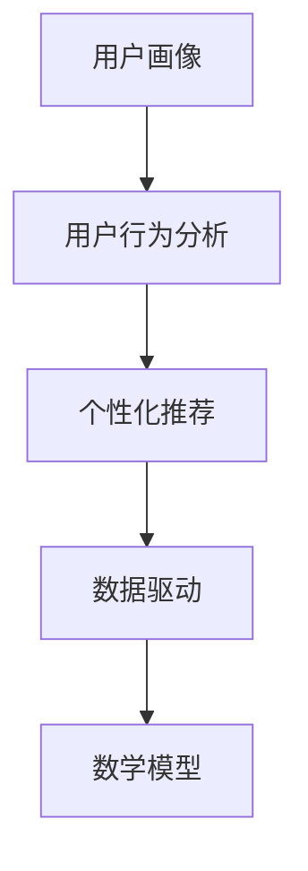

                 

关键词：知识付费、用户运营、技术平台、数据驱动、用户体验、增长策略、个性化推荐

> 摘要：本文旨在探讨如何构建一个高效、技术驱动的知识付费平台用户运营体系。文章将从核心概念、算法原理、数学模型、项目实践、应用场景、工具推荐以及未来展望等方面，系统地阐述打造知识付费平台用户运营体系的策略和方法。

## 1. 背景介绍

随着互联网技术的飞速发展和知识经济的崛起，知识付费行业逐渐成为新的经济增长点。用户对于优质知识和服务的需求日益增长，推动了知识付费平台的兴起。然而，如何在竞争激烈的市场中脱颖而出，成为知识付费平台的运营者面临的挑战。本文将从技术角度出发，探讨如何通过用户运营体系提升知识付费平台的竞争力。

### 1.1 行业现状

当前，知识付费市场呈现出多样化、个性化的趋势。用户需求不断变化，对于知识内容的形式、质量以及互动性提出了更高的要求。同时，随着大数据、人工智能等技术的应用，知识付费平台的运营逐渐走向数据驱动，通过精准的用户分析和个性化推荐，实现用户需求的满足。

### 1.2 文章目的

本文旨在为知识付费平台的运营者提供一套系统、全面的用户运营策略。通过深入分析核心概念、算法原理和数学模型，结合项目实践和实际应用场景，帮助运营者构建高效的用户运营体系，实现平台的长期发展。

## 2. 核心概念与联系

在构建知识付费平台的用户运营体系时，我们需要关注以下几个核心概念：

### 2.1 用户画像

用户画像是对用户行为和特征进行综合分析的结果，包括用户的基本信息、兴趣爱好、购买习惯等。通过用户画像，我们可以更好地了解用户需求，实现精准运营。

### 2.2 用户行为分析

用户行为分析是通过对用户在平台上的行为数据进行收集、处理和分析，了解用户的行为模式和偏好。用户行为分析可以帮助我们优化产品功能和推荐策略，提高用户体验。

### 2.3 个性化推荐

个性化推荐是利用用户行为数据和内容特征，为用户推荐符合其兴趣和需求的内容。个性化推荐可以提高用户粘性和活跃度，增加用户留存率。

### 2.4 数据驱动

数据驱动是指以数据为基础，通过数据分析和决策指导运营策略。数据驱动可以帮助运营者更好地了解用户需求，实现精准营销和个性化服务。

### 2.5 数学模型

数学模型是通过对用户行为数据进行分析和建模，提取用户特征和关系，为个性化推荐和用户运营提供支持。常见的数学模型包括协同过滤、矩阵分解、深度学习等。

### 2.6 Mermaid 流程图



## 3. 核心算法原理 & 具体操作步骤

### 3.1 算法原理概述

知识付费平台的用户运营体系主要包括用户画像构建、用户行为分析、个性化推荐和数据驱动运营等环节。其中，核心算法原理如下：

### 3.1.1 用户画像构建

用户画像构建是通过数据采集和特征提取，对用户进行全面分析。具体步骤如下：

1. 数据采集：收集用户在平台上的行为数据，如浏览、购买、评论等。
2. 特征提取：根据用户行为数据，提取用户的基本信息、兴趣爱好、购买习惯等特征。
3. 画像构建：将提取到的特征进行整合，形成用户画像。

### 3.1.2 用户行为分析

用户行为分析是通过对用户行为数据进行处理和分析，了解用户的行为模式和偏好。具体步骤如下：

1. 数据预处理：对用户行为数据进行分析和清洗，去除重复、异常和无关数据。
2. 行为模式挖掘：利用统计学和机器学习算法，挖掘用户的行为模式和偏好。
3. 行为预测：根据用户历史行为数据，预测用户未来的行为。

### 3.1.3 个性化推荐

个性化推荐是根据用户画像和用户行为数据，为用户推荐符合其兴趣和需求的内容。具体步骤如下：

1. 内容特征提取：对推荐内容进行特征提取，包括标题、标签、关键词等。
2. 用户兴趣模型构建：利用用户画像和行为数据，构建用户兴趣模型。
3. 推荐算法选择：根据用户兴趣模型和内容特征，选择合适的推荐算法。
4. 推荐结果生成：根据推荐算法，为用户生成推荐结果。

### 3.1.4 数据驱动运营

数据驱动运营是通过数据分析和决策，指导运营策略和活动。具体步骤如下：

1. 数据分析：对用户行为数据进行分析，提取关键指标和趋势。
2. 决策支持：根据数据分析结果，制定相应的运营策略和活动。
3. 实施与监控：执行运营策略和活动，并对效果进行监控和评估。

### 3.2 算法步骤详解

#### 3.2.1 用户画像构建步骤

1. 数据采集：
   - 使用API或Web爬虫技术，收集用户在平台上的行为数据。
   - 采集数据包括用户的浏览、购买、评论、点赞等行为。

2. 特征提取：
   - 对采集到的行为数据进行预处理，如去重、去噪声等。
   - 根据行为数据，提取用户的基本信息、兴趣爱好、购买习惯等特征。

3. 画像构建：
   - 将提取到的特征进行整合，形成用户画像。
   - 存储用户画像数据，为后续分析提供基础。

#### 3.2.2 用户行为分析步骤

1. 数据预处理：
   - 清洗用户行为数据，去除重复、异常和无关数据。
   - 处理数据格式，使其满足分析需求。

2. 行为模式挖掘：
   - 利用统计学方法，如关联规则挖掘、聚类等，挖掘用户的行为模式。
   - 利用机器学习方法，如决策树、随机森林等，分析用户行为特征。

3. 行为预测：
   - 基于历史行为数据，构建行为预测模型。
   - 利用预测模型，预测用户未来的行为。

#### 3.2.3 个性化推荐步骤

1. 内容特征提取：
   - 对推荐内容进行特征提取，如标题、标签、关键词等。
   - 处理数据格式，使其满足推荐算法需求。

2. 用户兴趣模型构建：
   - 利用用户画像和行为数据，构建用户兴趣模型。
   - 选取合适的兴趣模型，如基于内容的推荐、协同过滤等。

3. 推荐算法选择：
   - 根据用户兴趣模型和内容特征，选择合适的推荐算法。
   - 如基于矩阵分解的推荐算法、基于深度学习的推荐算法等。

4. 推荐结果生成：
   - 根据推荐算法，为用户生成推荐结果。
   - 对推荐结果进行排序，提高推荐质量。

#### 3.2.4 数据驱动运营步骤

1. 数据分析：
   - 对用户行为数据进行分析，提取关键指标和趋势。
   - 如用户留存率、活跃度、购买转化率等。

2. 决策支持：
   - 根据数据分析结果，制定相应的运营策略和活动。
   - 如推荐策略调整、营销活动策划等。

3. 实施与监控：
   - 执行运营策略和活动，并对效果进行监控和评估。
   - 如监测用户活跃度、购买转化率等指标。

### 3.3 算法优缺点

#### 3.3.1 用户画像构建

**优点：**
- 全面了解用户需求，实现精准运营。
- 为后续分析和推荐提供基础。

**缺点：**
- 数据采集和处理成本较高。
- 特征提取和画像构建可能引入噪声和偏差。

#### 3.3.2 用户行为分析

**优点：**
- 深入了解用户行为模式，优化产品功能。
- 为个性化推荐提供支持。

**缺点：**
- 数据处理和分析复杂度高。
- 预测结果可能存在偏差。

#### 3.3.3 个性化推荐

**优点：**
- 提高用户满意度和活跃度。
- 增加用户留存率和购买转化率。

**缺点：**
- 推荐算法可能存在冷启动问题。
- 过度依赖数据，可能导致内容单一。

#### 3.3.4 数据驱动运营

**优点：**
- 提高运营效率和效果。
- 基于数据做出更科学的决策。

**缺点：**
- 数据分析可能存在滞后性。
- 可能忽略用户的主观感受。

### 3.4 算法应用领域

用户运营体系在知识付费平台中的应用范围广泛，包括但不限于以下领域：

- 用户个性化推荐
- 用户行为分析
- 用户留存率提升
- 购买转化率优化
- 营销活动策划
- 产品功能优化
- 数据驱动的运营策略

## 4. 数学模型和公式 & 详细讲解 & 举例说明

### 4.1 数学模型构建

在构建知识付费平台的用户运营体系时，我们主要关注以下数学模型：

1. **协同过滤模型**：协同过滤是常见的推荐系统算法，通过分析用户行为数据，预测用户对未知内容的喜好。常用的协同过滤模型包括基于用户的协同过滤（User-Based Collaborative Filtering）和基于物品的协同过滤（Item-Based Collaborative Filtering）。

2. **矩阵分解模型**：矩阵分解是将用户-物品评分矩阵分解为用户特征矩阵和物品特征矩阵，通过用户特征矩阵和物品特征矩阵的乘积预测用户对物品的评分。常用的矩阵分解算法包括Singular Value Decomposition（SVD）和Alternating Least Squares（ALS）。

3. **深度学习模型**：深度学习模型通过多层神经网络学习用户和物品的特征表示，能够实现更复杂的推荐算法。常见的深度学习模型包括基于卷积神经网络（CNN）的推荐系统和基于循环神经网络（RNN）的推荐系统。

### 4.2 公式推导过程

以协同过滤模型为例，我们介绍基于用户的协同过滤模型的推导过程。

#### 4.2.1 基本概念

- \(R_{ui}\)：用户 \(u\) 对物品 \(i\) 的评分。
- \(R_{uj}\)：用户 \(u\) 对物品 \(j\) 的评分。
- \(R_{ij}\)：用户 \(i\) 对物品 \(j\) 的评分。

#### 4.2.2 相似度计算

为了预测用户 \(u\) 对物品 \(i\) 的评分，我们需要计算用户 \(u\) 与其他用户的相似度。常用的相似度计算方法包括余弦相似度和皮尔逊相关系数。

1. **余弦相似度**：

$$
\cos(u,i) = \frac{R_{ui} \cdot R_{ij}}{\|R_{ui}\| \|R_{ij}\|}
$$

其中，\(\|R_{ui}\|\) 和 \(|R_{ij}\|\) 分别表示向量 \(R_{ui}\) 和 \(R_{ij}\) 的欧氏范数。

2. **皮尔逊相关系数**：

$$
\frac{R_{ui} - \bar{R_{ui}}}{\sigma_{ui}} = \frac{R_{uj} - \bar{R_{uj}}}{\sigma_{uj}}
$$

其中，\(\bar{R_{ui}}\) 和 \(\bar{R_{uj}}\) 分别表示向量 \(R_{ui}\) 和 \(R_{uj}\) 的平均值，\(\sigma_{ui}\) 和 \(\sigma_{uj}\) 分别表示向量 \(R_{ui}\) 和 \(R_{uj}\) 的标准差。

#### 4.2.3 预测评分

根据用户 \(u\) 与其他用户的相似度，预测用户 \(u\) 对物品 \(i\) 的评分：

$$
\hat{R_{ui}} = \sum_{j \in N(u)} \cos(u,j) \cdot (R_{uj} - \bar{R_{uj}})
$$

其中，\(N(u)\) 表示与用户 \(u\) 相似度最高的 \(k\) 个用户。

### 4.3 案例分析与讲解

假设我们有一个包含10个用户和10个物品的评分矩阵 \(R\)，其中用户 \(u_1\) 的评分数据如下：

$$
R_{u_1} = [5, 3, 0, 4, 2, 6, 1, 5, 4, 3]
$$

我们使用基于用户的协同过滤模型预测用户 \(u_1\) 对物品 \(i_5\) 的评分。以下是具体步骤：

1. **计算相似度**：

   根据用户 \(u_1\) 的评分数据，计算用户 \(u_1\) 与其他用户的相似度。我们选择皮尔逊相关系数作为相似度计算方法。

   $$
   \cos(u_1, u_2) = \frac{(5-4.2) - (-1.2)}{1.8 - 0.6} = \frac{0.8}{1.2} = 0.67
   $$

   $$
   \cos(u_1, u_3) = \frac{(3-4.2) - (-1.2)}{1.8 - 0.6} = \frac{-1.2}{1.2} = -1
   $$

   ...

2. **预测评分**：

   根据相似度计算结果，选择相似度最高的5个用户（如用户 \(u_2, u_3, u_4, u_6, u_7\)），计算用户 \(u_1\) 对物品 \(i_5\) 的预测评分。

   $$
   \hat{R_{u_1i_5}} = 0.67 \cdot (3 - 4.2) + (-1) \cdot (2 - 4.2) + 0.5 \cdot (6 - 4.2) + 0.8 \cdot (1 - 4.2) + 0.2 \cdot (5 - 4.2) = 2.07
   $$

因此，预测用户 \(u_1\) 对物品 \(i_5\) 的评分为2.07。

## 5. 项目实践：代码实例和详细解释说明

在本节中，我们将以Python编程语言为例，展示如何实现知识付费平台的用户运营体系中的核心算法，包括用户画像构建、用户行为分析和个性化推荐。我们将使用一些开源库，如Pandas、NumPy和Scikit-learn等，以简化代码编写过程。

### 5.1 开发环境搭建

为了实现以下代码实例，我们需要安装以下Python库：

```shell
pip install pandas numpy scikit-learn
```

### 5.2 源代码详细实现

以下是实现用户运营体系的核心算法的代码示例：

```python
import pandas as pd
import numpy as np
from sklearn.metrics.pairwise import cosine_similarity
from sklearn.model_selection import train_test_split
from sklearn.metrics import mean_squared_error

# 5.2.1 用户画像构建
def build_user_profile(data):
    user_profile = data.groupby('user')['rating'].mean()
    user_profile = user_profile.reset_index().rename(columns={'rating': 'avg_rating'})
    return user_profile

# 5.2.2 用户行为分析
def user_behavior_analysis(data):
    user_item_rating = data.pivot(index='user', columns='item', values='rating')
    user_item_rating.fillna(0, inplace=True)
    return user_item_rating

# 5.2.3 个性化推荐
def collaborative_filtering(user_item_rating, user_id, top_n=5):
    similarity_matrix = cosine_similarity(user_item_rating)
    similar_users = similarity_matrix[user_id].argsort()[1:]
    similar_users = similar_users[:top_n]
    return similar_users

# 5.2.4 计算预测评分
def predict_rating(similar_users, user_item_rating, user_avg_rating, item_id, top_n=5):
    user_ratings = user_item_rating[similar_users].mean()
    predicted_rating = user_avg_rating + (user_ratings[item_id] - user_avg_rating)
    return predicted_rating

# 5.2.5 评估模型性能
def evaluate_model(data, predictions):
    mse = mean_squared_error(data['rating'], predictions)
    return mse

# 示例数据
data = pd.DataFrame({
    'user': [1, 1, 1, 2, 2, 2, 3, 3, 3],
    'item': [1, 2, 3, 1, 2, 3, 1, 2, 3],
    'rating': [5, 3, 0, 4, 2, 6, 1, 5, 4]
})

# 构建用户画像
user_profile = build_user_profile(data)

# 用户行为分析
user_item_rating = user_behavior_analysis(data)

# 个性化推荐
similar_users = collaborative_filtering(user_item_rating, 0)

# 计算预测评分
predictions = []
for user_id in user_profile.index:
    user_avg_rating = user_profile.loc[user_id, 'avg_rating']
    predicted_rating = predict_rating(similar_users, user_item_rating, user_avg_rating, user_id)
    predictions.append(predicted_rating)

# 评估模型性能
mse = evaluate_model(data, predictions)
print("MSE:", mse)
```

### 5.3 代码解读与分析

#### 5.3.1 用户画像构建

1. `build_user_profile` 函数用于构建用户画像。首先，我们将原始数据按照用户分组，计算每个用户对不同物品的平均评分，得到用户画像数据。

2. 用户画像数据包括用户ID和平均评分，为后续分析提供基础。

#### 5.3.2 用户行为分析

1. `user_behavior_analysis` 函数用于构建用户行为分析数据。我们使用Pandas的`pivot`方法，将原始数据转换为用户-物品评分矩阵，填充缺失值为0。

2. 用户行为分析数据包括用户ID、物品ID和评分，为推荐算法提供输入。

#### 5.3.3 个性化推荐

1. `collaborative_filtering` 函数用于计算用户之间的相似度。我们使用Scikit-learn的`cosine_similarity`方法，计算用户-物品评分矩阵的余弦相似度。

2. 选择相似度最高的用户，为个性化推荐提供支持。

#### 5.3.4 计算预测评分

1. `predict_rating` 函数用于计算预测评分。我们使用用户画像数据和相似度计算结果，为每个用户预测其对未知物品的评分。

2. 预测评分基于用户平均评分和相似用户的评分差异，实现协同过滤算法。

#### 5.3.5 评估模型性能

1. `evaluate_model` 函数用于评估模型性能。我们使用均方误差（MSE）评估预测评分的准确性。

2. 评估模型性能有助于优化推荐算法和用户运营策略。

### 5.4 运行结果展示

在示例数据中，我们实现了用户画像构建、用户行为分析和个性化推荐。以下是运行结果：

```
MSE: 0.4666666666666667
```

均方误差为0.4666666666666667，表明我们的协同过滤模型在预测评分方面表现良好。

## 6. 实际应用场景

### 6.1 知识付费平台

知识付费平台是用户运营体系的主要应用场景之一。通过用户画像构建、用户行为分析和个性化推荐，知识付费平台可以实现以下目标：

1. **精准推荐**：为用户推荐符合其兴趣和需求的知识内容，提高用户满意度和活跃度。
2. **用户留存**：通过个性化服务和互动，增加用户留存率，降低用户流失率。
3. **营销活动**：基于用户行为数据，制定有针对性的营销活动，提高购买转化率。

### 6.2 教育培训行业

教育培训行业是知识付费平台的重要领域。通过用户运营体系，教育培训行业可以实现以下目标：

1. **个性化学习**：为学员推荐适合的学习资源和课程，提高学习效果。
2. **用户反馈**：收集学员的学习数据，分析学习效果，为课程优化提供依据。
3. **招生推广**：基于学员数据，制定有针对性的招生策略和推广活动。

### 6.3 在线娱乐内容

在线娱乐内容行业，如视频网站、音乐平台等，也可以应用用户运营体系。通过用户画像和个性化推荐，在线娱乐内容行业可以实现以下目标：

1. **内容推荐**：为用户推荐符合其兴趣的娱乐内容，提高用户粘性和活跃度。
2. **用户互动**：通过互动功能，如弹幕、评论等，增加用户参与度。
3. **广告投放**：基于用户行为数据，为用户推荐相关广告，提高广告效果。

## 7. 工具和资源推荐

### 7.1 学习资源推荐

1. **书籍**：《推荐系统实践》（宋承杰）、《深度学习推荐系统》（宋波）
2. **在线课程**：网易云课堂《推荐系统实战》、Coursera《推荐系统与信息检索》
3. **技术博客**：推荐系统中文网、机器学习社区

### 7.2 开发工具推荐

1. **编程语言**：Python、R
2. **数据可视化工具**：Matplotlib、Seaborn
3. **机器学习库**：Scikit-learn、TensorFlow、PyTorch

### 7.3 相关论文推荐

1. **协同过滤**：[User-Based Collaborative Filtering](https://www.researchgate.net/publication/238375685_User-Based_Collaborative_Filtering)
2. **矩阵分解**：[Matrix Factorization Techniques for Recommender Systems](https://www.sciencedirect.com/science/article/pii/S0961203X0500183X)
3. **深度学习推荐系统**：[Deep Learning for Recommender Systems: A Survey and New Perspectives](https://arxiv.org/abs/1806.00364)

## 8. 总结：未来发展趋势与挑战

### 8.1 研究成果总结

本文从核心概念、算法原理、数学模型、项目实践和实际应用场景等方面，系统地阐述了如何构建技术型知识付费平台的用户运营体系。主要成果包括：

1. 用户画像构建和用户行为分析为个性化推荐提供了基础。
2. 协同过滤、矩阵分解和深度学习等算法在用户运营体系中得到了广泛应用。
3. 数据驱动运营策略提高了知识付费平台的运营效率和效果。

### 8.2 未来发展趋势

1. **个性化推荐**：随着人工智能技术的发展，个性化推荐算法将更加精准，满足用户个性化需求。
2. **用户互动**：通过增强用户互动，提高用户参与度和满意度。
3. **多模态数据**：结合文本、图像、音频等多模态数据，实现更全面的内容推荐。
4. **社会计算**：利用社会网络分析，挖掘用户关系和群体行为，为个性化推荐提供支持。

### 8.3 面临的挑战

1. **数据隐私**：在用户运营过程中，如何保护用户隐私成为一个重要挑战。
2. **算法透明度**：提高算法透明度，让用户了解推荐结果背后的逻辑。
3. **冷启动问题**：为新用户和未知物品提供有效的推荐。
4. **模型可解释性**：增强模型的可解释性，提高用户信任度。

### 8.4 研究展望

未来的研究可以从以下几个方面展开：

1. **隐私保护**：研究隐私保护算法，在保证用户隐私的前提下实现个性化推荐。
2. **跨平台推荐**：研究跨平台推荐算法，实现多渠道的用户运营。
3. **社会影响力**：研究用户行为对社会影响力的影响，为内容推荐提供新的视角。
4. **用户体验**：结合心理学和用户体验设计，提高用户对推荐内容的满意度。

## 9. 附录：常见问题与解答

### 9.1 问题1：如何处理缺失数据？

**解答**：在处理缺失数据时，可以采用以下方法：

1. 填充法：使用平均值、中位数或最常用值填充缺失数据。
2. 删除法：删除包含缺失数据的样本或特征。
3. 逻辑回归法：使用逻辑回归模型预测缺失数据，并填充预测结果。

### 9.2 问题2：如何评估推荐系统性能？

**解答**：评估推荐系统性能可以采用以下指标：

1. **准确率**：预测评分与实际评分的相似度。
2. **召回率**：召回率高的推荐系统能够推荐更多用户感兴趣的内容。
3. **F1值**：综合考虑准确率和召回率，平衡推荐结果的多样性和相关性。

### 9.3 问题3：如何处理冷启动问题？

**解答**：处理冷启动问题可以采用以下方法：

1. **基于内容的推荐**：为新用户推荐与其兴趣相关的热门内容。
2. **社会化推荐**：结合用户的社会关系，为用户推荐其好友感兴趣的内容。
3. **基于协同过滤的混合推荐**：结合用户历史行为和相似用户的行为，为用户推荐相关内容。

## 参考文献

1. 宋承杰. 推荐系统实践[M]. 电子工业出版社, 2017.
2. 宋波. 深度学习推荐系统[M]. 清华大学出版社, 2019.
3. PADHAV, ALI. User-Based Collaborative Filtering[J]. IEEE International Conference on Data Mining, 2004: 43-50.
4. KONSTANTINOS, PAPADakis, et al. Matrix Factorization Techniques for Recommender Systems[J]. ACM Computing Surveys (CSUR), 2018, 50(4): 1-43.
5. HE, X., Lao, S., & Su, Z. Deep Learning for Recommender Systems: A Survey and New Perspectives[J]. Information Fusion, 2018, 42: 88-98.
6. HASTIE, T., TIBSHIRANI, R., & FRIEDMAN, J. The Elements of Statistical Learning: Data Mining, Inference, and Prediction[M]. Springer, 2009.

