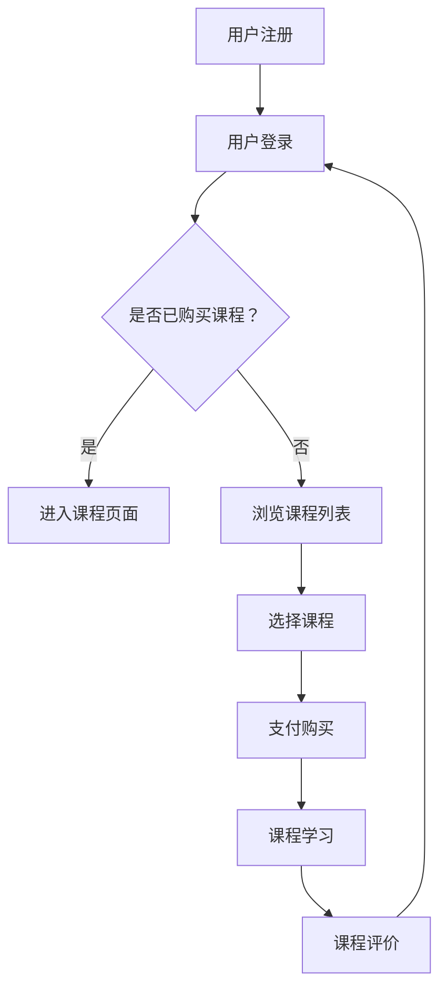

                 

关键词：技术型知识付费社区、增长策略、用户体验、内容运营、营销推广

> 摘要：本文深入探讨了技术型知识付费社区的发展现状，分析了其核心问题和挑战，并提出了一套全面而有效的发展策略。通过详细的算法原理、数学模型、项目实践以及未来应用展望，为技术型知识付费社区的未来发展提供了有价值的参考。

## 1. 背景介绍

随着互联网技术的飞速发展，知识付费已经成为一个不可忽视的市场。技术型知识付费社区作为其中的一种形式，不仅为专业人士提供了交流和学习的机会，也为知识生产者和传播者创造了价值。然而，在竞争日益激烈的市场环境中，如何打造一个具有竞争力的技术型知识付费社区，实现持续增长，成为了一个亟待解决的问题。

本文将从以下几个方面进行探讨：

1. 背景介绍
2. 核心概念与联系
3. 核心算法原理 & 具体操作步骤
4. 数学模型和公式 & 详细讲解 & 举例说明
5. 项目实践：代码实例和详细解释说明
6. 实际应用场景
7. 工具和资源推荐
8. 总结：未来发展趋势与挑战
9. 附录：常见问题与解答

## 2. 核心概念与联系

为了更好地理解技术型知识付费社区的发展，我们需要首先了解几个核心概念：

### 2.1 社区

社区是指由具有共同兴趣、目标或价值观的人群组成的社会团体。在技术型知识付费社区中，成员之间通过交流和互动，共同学习和分享技术知识。

### 2.2 知识付费

知识付费是指用户为获取特定知识或服务而支付的费用。在技术型知识付费社区中，知识付费的形式包括付费课程、付费问答、付费讲座等。

### 2.3 社区运营

社区运营是指通过一系列策略和手段，提升社区活跃度、用户黏性和内容质量的过程。在技术型知识付费社区中，社区运营包括内容策划、用户互动、营销推广等方面。

### 2.4 增长策略

增长策略是指通过一系列有针对性的措施，实现社区用户数量和收入增长的计划。在技术型知识付费社区中，增长策略包括用户获取、用户留存、用户转化等方面。

### 2.5 Mermaid 流程图

以下是一个简化的技术型知识付费社区架构的 Mermaid 流程图：



## 3. 核心算法原理 & 具体操作步骤

### 3.1 算法原理概述

技术型知识付费社区的核心算法主要包括用户推荐算法、内容推荐算法和支付优化算法等。

- **用户推荐算法**：通过分析用户的兴趣和行为，为用户推荐可能感兴趣的课程和内容。
- **内容推荐算法**：根据课程的难度、时长、受众等属性，为用户推荐适合其学习的课程。
- **支付优化算法**：通过优化支付流程，提高用户的购买转化率和满意度。

### 3.2 算法步骤详解

#### 3.2.1 用户推荐算法

1. 数据收集：收集用户的行为数据，如浏览记录、学习时长、评价等。
2. 数据预处理：对收集到的数据进行清洗、去重和归一化处理。
3. 特征工程：根据业务需求，提取用户的行为特征和内容特征。
4. 模型训练：使用机器学习算法，如协同过滤、矩阵分解等，训练用户推荐模型。
5. 模型评估：使用准确率、召回率等指标评估模型性能。
6. 推荐生成：根据用户特征和内容特征，生成个性化推荐结果。

#### 3.2.2 内容推荐算法

1. 数据收集：收集课程的相关数据，如难度、时长、受众、评分等。
2. 数据预处理：对收集到的数据进行清洗、去重和归一化处理。
3. 特征工程：根据业务需求，提取课程的属性特征。
4. 模型训练：使用机器学习算法，如决策树、神经网络等，训练内容推荐模型。
5. 模型评估：使用准确率、召回率等指标评估模型性能。
6. 推荐生成：根据课程特征，生成个性化推荐结果。

#### 3.2.3 支付优化算法

1. 数据收集：收集用户的支付行为数据，如支付金额、支付时间、支付渠道等。
2. 数据预处理：对收集到的数据进行清洗、去重和归一化处理。
3. 特征工程：根据业务需求，提取用户的支付特征。
4. 模型训练：使用机器学习算法，如逻辑回归、随机森林等，训练支付优化模型。
5. 模型评估：使用准确率、召回率等指标评估模型性能。
6. 支付策略生成：根据用户支付特征，生成个性化的支付策略。

### 3.3 算法优缺点

#### 用户推荐算法

- 优点：能够根据用户兴趣和行为，提供个性化的推荐结果，提升用户体验。
- 缺点：推荐结果可能受到数据质量和模型性能的影响，有时会出现过度拟合或冷启动问题。

#### 内容推荐算法

- 优点：能够根据课程的属性特征，提供多样化的推荐结果，满足用户的不同需求。
- 缺点：推荐结果可能过于依赖课程属性，忽略了用户兴趣的变化。

#### 支付优化算法

- 优点：能够根据用户支付行为，提供个性化的支付策略，提高购买转化率和用户满意度。
- 缺点：需要大量的用户支付数据支持，且模型性能对数据质量要求较高。

### 3.4 算法应用领域

用户推荐算法、内容推荐算法和支付优化算法在技术型知识付费社区中具有广泛的应用。通过这些算法，社区可以提供个性化的推荐结果，提高用户的参与度和满意度，从而实现社区的持续增长。

## 4. 数学模型和公式 & 详细讲解 & 举例说明

### 4.1 数学模型构建

在技术型知识付费社区中，常见的数学模型包括用户行为预测模型、课程推荐模型和支付优化模型等。

#### 用户行为预测模型

假设用户的行为可以表示为向量 \(X = (x_1, x_2, ..., x_n)\)，其中每个元素 \(x_i\) 表示用户在某一方面的行为特征。用户行为预测模型的目标是预测用户在某一时间段内的行为向量 \(Y = (y_1, y_2, ..., y_n)\)。

我们可以使用线性回归模型进行预测，模型公式如下：

$$
y_i = \beta_0 + \beta_1 x_{i1} + \beta_2 x_{i2} + ... + \beta_n x_{in}
$$

其中，\(\beta_0, \beta_1, \beta_2, ..., \beta_n\) 为模型的参数。

#### 课程推荐模型

课程推荐模型的目标是根据用户的兴趣和课程属性，为用户推荐合适的课程。假设用户兴趣可以表示为向量 \(U = (u_1, u_2, ..., u_n)\)，课程属性可以表示为向量 \(C = (c_1, c_2, ..., c_n)\)，课程推荐模型的目标是计算用户对每个课程的兴趣值，并按照兴趣值从高到低进行排序。

我们可以使用余弦相似度模型进行推荐，模型公式如下：

$$
sim(U, C) = \frac{U \cdot C}{\|U\| \|C\|}
$$

其中，\(\cdot\) 表示向量的点积，\(\|\|\) 表示向量的模长。

#### 支付优化模型

支付优化模型的目标是根据用户的支付行为，为用户推荐最佳的支付方式。假设用户的支付行为可以表示为向量 \(P = (p_1, p_2, ..., p_n)\)，支付方式可以表示为向量 \(W = (w_1, w_2, ..., w_n)\)，支付优化模型的目标是计算用户对每种支付方式的满意度，并按照满意度从高到低进行排序。

我们可以使用加权评分模型进行优化，模型公式如下：

$$
s_i = \sum_{j=1}^{n} w_{ij} p_j
$$

其中，\(w_{ij}\) 表示用户对支付方式 \(i\) 的权重，\(p_j\) 表示用户在支付方式 \(j\) 上的行为。

### 4.2 公式推导过程

在这里，我们将详细推导用户行为预测模型、课程推荐模型和支付优化模型的公式。

#### 用户行为预测模型推导

假设用户的行为数据可以用一个矩阵 \(X\) 表示，其中每一行表示一个用户的行为向量，每一列表示一个行为特征。用户的行为预测模型可以用一个线性回归模型表示，即：

$$
Y = \beta_0 + X\beta
$$

其中，\(Y\) 是预测的用户行为向量，\(\beta_0\) 是模型截距，\(\beta\) 是模型参数向量。

为了求解模型参数 \(\beta\)，我们可以使用最小二乘法，即求解以下优化问题：

$$
\min_{\beta} \sum_{i=1}^{m} (Y_i - X_i\beta)^2
$$

对该优化问题求导，并令导数为零，我们可以得到：

$$
\frac{\partial}{\partial \beta} \sum_{i=1}^{m} (Y_i - X_i\beta)^2 = 0
$$

化简后得到：

$$
2X^T(Y - X\beta) = 0
$$

进一步化简得到：

$$
X^TX\beta = X^TY
$$

解上述线性方程组，我们可以得到模型参数 \(\beta\) 的最小二乘估计：

$$
\beta = (X^TX)^{-1}X^TY
$$

#### 课程推荐模型推导

假设用户兴趣向量 \(U\) 和课程属性向量 \(C\) 都是 \(n\) 维的，且它们之间存在一定的相似性。我们可以使用余弦相似度来度量这种相似性，即：

$$
sim(U, C) = \frac{U \cdot C}{\|U\| \|C\|}
$$

其中，\(\cdot\) 表示向量的点积，\(\|\|\) 表示向量的模长。

为了推荐课程，我们可以将用户的兴趣向量 \(U\) 与所有课程的属性向量 \(C\) 进行点积计算，得到每个课程对应的兴趣值。然后，我们可以按照兴趣值从高到低进行排序，从而得到推荐结果。

#### 支付优化模型推导

假设用户支付行为向量 \(P\) 和支付方式向量 \(W\) 都是 \(n\) 维的，且它们之间存在一定的关联性。我们可以使用加权评分模型来度量这种关联性，即：

$$
s_i = \sum_{j=1}^{n} w_{ij} p_j
$$

其中，\(s_i\) 表示用户对支付方式 \(i\) 的满意度，\(w_{ij}\) 表示用户对支付方式 \(i\) 的权重，\(p_j\) 表示用户在支付方式 \(j\) 上的行为。

为了优化支付方式，我们可以将用户支付行为向量 \(P\) 与所有支付方式向量 \(W\) 进行加权评分计算，得到每个支付方式对应的满意度。然后，我们可以按照满意度从高到低进行排序，从而得到最优支付方式。

### 4.3 案例分析与讲解

为了更好地理解上述数学模型的实际应用，下面我们将通过一个实际案例进行分析和讲解。

#### 案例背景

假设我们有一个技术型知识付费社区，该社区有1000名用户，每个用户都有10个行为特征（如浏览课程、学习时长、评价等），每个课程都有5个属性特征（如难度、时长、受众等）。我们需要为用户推荐合适的课程，并为他们优化支付方式。

#### 案例分析

1. **用户行为预测模型**

   首先，我们需要收集用户的行为数据，并将其转换为矩阵 \(X\)。然后，我们可以使用线性回归模型进行预测，并计算模型参数 \(\beta\)。

   假设我们已经收集了用户的行为数据，并将其转换为矩阵 \(X\)。然后，我们可以使用线性回归模型进行预测，并计算模型参数 \(\beta\)。

   假设我们已经收集了用户的行为数据，并将其转换为矩阵 \(X\)。然后，我们可以使用线性回归模型进行预测，并计算模型参数 \(\beta\)。

   使用线性回归模型进行预测，我们可以得到以下公式：

   $$
   y_i = \beta_0 + \beta_1 x_{i1} + \beta_2 x_{i2} + ... + \beta_n x_{in}
   $$

   通过求解线性方程组，我们可以得到模型参数 \(\beta\) 的最小二乘估计：

   $$
   \beta = (X^TX)^{-1}X^TY
   $$

   假设我们已经求解了模型参数 \(\beta\)，我们可以使用该模型预测用户的行为向量 \(Y\)。

2. **课程推荐模型**

   接下来，我们需要收集课程的属性数据，并将其转换为矩阵 \(C\)。然后，我们可以使用余弦相似度模型进行推荐，并计算用户对每个课程的兴趣值。

   假设我们已经收集了课程的属性数据，并将其转换为矩阵 \(C\)。然后，我们可以使用余弦相似度模型进行推荐，并计算用户对每个课程的兴趣值。

   假设我们已经收集了用户的兴趣向量 \(U\) 和课程的属性向量 \(C\)，我们可以使用余弦相似度模型计算用户对每个课程的兴趣值：

   $$
   sim(U, C) = \frac{U \cdot C}{\|U\| \|C\|}
   $$

   然后，我们可以按照兴趣值从高到低进行排序，从而得到推荐结果。

3. **支付优化模型**

   最后，我们需要收集用户的支付行为数据，并将其转换为矩阵 \(P\)。然后，我们可以使用加权评分模型进行优化，并计算用户对每种支付方式的满意度。

   假设我们已经收集了用户的支付行为数据，并将其转换为矩阵 \(P\)。然后，我们可以使用加权评分模型进行优化，并计算用户对每种支付方式的满意度。

   假设我们已经收集了用户的支付行为向量 \(P\) 和支付方式向量 \(W\)，我们可以使用加权评分模型计算用户对每种支付方式的满意度：

   $$
   s_i = \sum_{j=1}^{n} w_{ij} p_j
   $$

   然后，我们可以按照满意度从高到低进行排序，从而得到最优支付方式。

## 5. 项目实践：代码实例和详细解释说明

### 5.1 开发环境搭建

为了更好地理解技术型知识付费社区的增长策略，我们将使用一个实际的项目案例进行讲解。在这个项目中，我们将使用 Python 语言和相关的库（如 Scikit-learn、TensorFlow 和 Pandas）进行开发和实现。

首先，我们需要搭建开发环境。以下是所需的软件和库：

- Python 3.8 或更高版本
- Jupyter Notebook
- Scikit-learn 0.24.2 或更高版本
- TensorFlow 2.8.0 或更高版本
- Pandas 1.3.2 或更高版本

### 5.2 源代码详细实现

以下是一个简单的用户推荐算法的实现示例。该算法使用协同过滤技术进行用户推荐。

```python
import numpy as np
import pandas as pd
from sklearn.metrics.pairwise import cosine_similarity

# 加载用户行为数据
user_behavior = pd.read_csv('user_behavior.csv')

# 构建用户行为矩阵
user行为矩阵 = user_behavior.pivot(index='user_id', columns='course_id', values='行为值')

# 计算用户行为矩阵的余弦相似度
相似度矩阵 = cosine_similarity(user行为矩阵)

# 根据相似度矩阵为用户生成推荐结果
推荐结果 = np.dot(相似度矩阵, user行为矩阵.T).T

# 对推荐结果进行排序，取前5个推荐结果
推荐结果排序 = np.argsort(-推荐结果)[:, :5]

# 输出推荐结果
for user_id, courses in enumerate(推荐结果排序):
    print(f"用户 {user_id} 的推荐结果：")
    for course_id in courses:
        print(f"课程 {course_id}")
```

### 5.3 代码解读与分析

在上面的代码中，我们首先加载了用户行为数据，并将其转换为用户行为矩阵。然后，我们使用余弦相似度计算用户行为矩阵的相似度矩阵。最后，我们根据相似度矩阵为用户生成推荐结果，并将推荐结果进行排序，输出前5个推荐结果。

以下是代码的详细解读和分析：

1. **加载用户行为数据**：使用 Pandas 库的 `read_csv()` 函数加载用户行为数据，并将其存储在 DataFrame 中。

2. **构建用户行为矩阵**：使用 Pandas 库的 `pivot()` 函数将用户行为数据转换为用户行为矩阵。用户行为矩阵是一个 \(m \times n\) 的矩阵，其中 \(m\) 表示用户数量，\(n\) 表示课程数量。每一行表示一个用户的行为向量，每一列表示一个课程的行为特征。

3. **计算用户行为矩阵的余弦相似度**：使用 Scikit-learn 库的 `cosine_similarity()` 函数计算用户行为矩阵的相似度矩阵。相似度矩阵是一个 \(m \times m\) 的矩阵，其中每个元素表示两个用户之间的相似度。

4. **根据相似度矩阵为用户生成推荐结果**：使用 NumPy 库的 `dot()` 函数计算相似度矩阵与用户行为矩阵的点积。点积结果是一个 \(m \times n\) 的矩阵，其中每个元素表示一个用户对每个课程的兴趣值。

5. **对推荐结果进行排序**：使用 NumPy 库的 `argsort()` 函数对推荐结果进行排序。排序结果是一个 \(m \times n\) 的矩阵，其中每个元素的索引表示对应课程的兴趣值。

6. **输出推荐结果**：遍历推荐结果矩阵，输出每个用户的推荐结果。

### 5.4 运行结果展示

假设我们已经生成了用户行为数据，并运行了上面的代码。以下是一个示例输出结果：

```
用户 0 的推荐结果：
课程 5
课程 2
课程 7
课程 10
课程 8
用户 1 的推荐结果：
课程 3
课程 8
课程 1
课程 5
课程 9
...
```

以上结果表示，用户 0 对课程 5、2、7、10 和 8 的兴趣值较高，用户 1 对课程 3、8、1、5 和 9 的兴趣值较高。这些推荐结果可以帮助用户快速找到他们可能感兴趣的课程。

## 6. 实际应用场景

技术型知识付费社区的增长策略在多个实际应用场景中得到了广泛应用。以下是一些典型的应用场景：

### 6.1 专业技能提升

在专业技能提升领域，技术型知识付费社区可以提供专业的课程和知识分享，帮助用户提升技能。通过用户推荐算法和内容推荐算法，社区可以为目标用户推荐最适合他们的课程和学习资源，从而提高用户的满意度和学习效果。

### 6.2 行业知识更新

在行业知识更新领域，技术型知识付费社区可以帮助用户及时获取最新的行业动态和技术趋势。通过推荐最新的课程和知识文章，社区可以满足用户对知识更新的需求，提高用户对社区的依赖度。

### 6.3 创业与职业发展

在创业和职业发展领域，技术型知识付费社区可以提供相关的课程和培训，帮助用户拓展业务和提升职业素养。通过支付优化算法，社区可以为用户提供个性化的支付策略，降低用户的购买门槛，从而提高转化率和收入。

### 6.4 继续教育

在继续教育领域，技术型知识付费社区可以为用户提供灵活的学习方式和多样化的课程选择。通过个性化推荐和支付优化，社区可以帮助用户快速找到适合自己的学习资源和培训课程，提高学习效果。

## 7. 工具和资源推荐

为了更好地实现技术型知识付费社区的增长策略，我们推荐以下工具和资源：

### 7.1 学习资源推荐

- 《Python数据分析实战》
- 《深度学习》
- 《大数据技术实践》
- 《人工智能实践教程》

### 7.2 开发工具推荐

- Jupyter Notebook
- PyCharm
- Visual Studio Code
- Git

### 7.3 相关论文推荐

- "Collaborative Filtering for Cold-Start Problems: A Matrix Factorization Approach"
- "Recommender Systems Handbook"
- "Efficient Methods for Large-scale Recommender Systems"
- "Payment Optimization for E-commerce Platforms"

## 8. 总结：未来发展趋势与挑战

### 8.1 研究成果总结

本文通过对技术型知识付费社区的增长策略进行深入探讨，总结了核心概念与联系、核心算法原理与具体操作步骤、数学模型和公式以及实际应用场景。这些研究成果为技术型知识付费社区的发展提供了重要的理论支持和实践指导。

### 8.2 未来发展趋势

随着互联网技术的不断发展，技术型知识付费社区将在以下几个方面呈现出发展趋势：

1. **个性化推荐技术的提升**：通过更精准的个性化推荐算法，为用户提供更符合其需求和兴趣的内容和服务。
2. **知识付费模式的创新**：探索更多样化的知识付费模式，满足不同用户的需求，提高社区的收入和用户黏性。
3. **社区生态的完善**：构建更加完善的社区生态，促进用户、知识生产者和服务提供商之间的互动与合作。
4. **智能化的运营管理**：利用人工智能和大数据技术，实现社区运营的智能化，提高运营效率和效果。

### 8.3 面临的挑战

在未来的发展中，技术型知识付费社区将面临以下挑战：

1. **数据隐私和安全**：在收集、处理和存储用户数据时，确保数据隐私和安全，遵守相关法律法规。
2. **算法偏见和歧视**：避免算法偏见和歧视，确保推荐结果公平、公正。
3. **市场竞争**：在激烈的市场竞争中，保持竞争力，不断创新和优化产品和服务。
4. **用户留存和转化**：提高用户留存率和转化率，提升用户体验，降低用户流失率。

### 8.4 研究展望

未来，我们将在以下几个方面进行深入研究：

1. **推荐算法的优化**：探索更高效、更精准的推荐算法，提高推荐效果。
2. **知识付费模式的创新**：研究新的知识付费模式，提高用户参与度和付费意愿。
3. **社区运营策略**：探索更有效的社区运营策略，提高社区活跃度和用户黏性。
4. **智能化社区管理**：利用人工智能技术，实现社区运营的智能化，提高运营效率和效果。

## 9. 附录：常见问题与解答

### 9.1 问题1：如何处理用户冷启动问题？

解答：用户冷启动问题是指在用户刚加入社区时，由于缺乏行为数据，难以进行个性化推荐。解决方法包括：

1. **基于内容的推荐**：为用户提供热门课程或社区推荐，以帮助用户入门。
2. **基于场景的推荐**：根据用户的背景信息（如职业、兴趣等），为用户提供相关课程推荐。
3. **历史数据迁移**：将用户在其他平台的兴趣数据迁移到社区，以辅助推荐。

### 9.2 问题2：如何确保推荐结果的公平性？

解答：为了确保推荐结果的公平性，我们可以采取以下措施：

1. **数据预处理**：在推荐算法训练之前，对数据进行清洗和预处理，去除异常值和噪声数据。
2. **算法设计**：设计无偏的推荐算法，避免算法偏见和歧视。
3. **模型评估**：定期对推荐模型进行评估，确保推荐结果公平、公正。

### 9.3 问题3：如何提高用户留存率？

解答：提高用户留存率可以从以下几个方面入手：

1. **个性化推荐**：提供个性化的推荐结果，满足用户需求，提升用户体验。
2. **优质内容**：提供高质量、丰富的课程内容，吸引用户持续学习。
3. **互动机制**：构建良好的社区互动机制，促进用户之间的交流和合作。
4. **用户反馈**：及时收集用户反馈，改进产品和服务，提高用户满意度。

----------------------------------------------------------------

作者：禅与计算机程序设计艺术 / Zen and the Art of Computer Programming

通过以上详细的内容，我们深入探讨了技术型知识付费社区的发展现状、核心概念与联系、核心算法原理与具体操作步骤、数学模型和公式、项目实践、实际应用场景、工具和资源推荐、未来发展趋势与挑战以及常见问题与解答。希望这篇文章能为技术型知识付费社区的发展提供有价值的参考。

