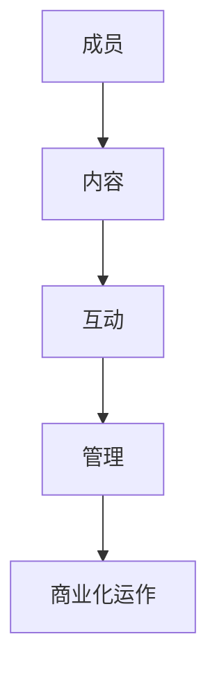

                 

在当今数字化时代，程序员作为技术的推动者，不仅需要拥有出色的编程技能，还需懂得如何将自己的知识转化为实际的价值。技术社区作为一种新的知识传播和知识变现的平台，正逐渐成为程序员们实现个人价值的重要途径。本文将探讨如何打造一个具有吸引力和价值的技术社区，为程序员们提供知识变现的新途径。

## 文章关键词

技术社区、知识变现、程序员、知识传播、平台建设、用户体验、可持续发展

## 文章摘要

本文首先介绍了技术社区的概念和重要性，然后分析了程序员知识变现的现状和挑战。接着，提出了打造技术社区的一些关键策略，包括内容策划、用户体验设计、社区管理、商业化运作等。最后，展望了技术社区的未来发展趋势和前景。

## 1. 背景介绍

1.1 技术社区的定义和作用

技术社区是指一群对某一技术领域有共同兴趣和热情的人组成的在线或线下社群。它为成员提供了交流、学习、分享资源和知识的平台。技术社区的作用主要体现在以下几个方面：

- **知识传播**：技术社区促进了知识的共享和传播，帮助成员快速获取最新的技术动态和行业信息。
- **技能提升**：成员通过参与社区活动，如讨论、分享案例、学习教程，不断提升自己的技术能力和实践经验。
- **职业发展**：技术社区为成员提供了展示自己才华和能力的舞台，有助于他们在职业发展中获得更多的机会和认可。
- **社交网络**：技术社区为成员构建了一个良好的社交网络，有助于建立人际关系和合作机会。

1.2 程序员知识变现的现状

随着互联网和信息技术的发展，程序员的知识变现方式逐渐多样化。目前，程序员主要通过以下几种途径实现知识变现：

- **编写技术书籍**：通过撰写技术书籍，分享自己的经验和知识，不仅能够获得稿费，还能提升个人品牌和影响力。
- **开设在线课程**：利用在线教育平台，录制并分享技术课程，通过付费订阅或一次性购买课程获得收入。
- **提供咨询服务**：利用自己在技术领域的专业知识和经验，为他人提供咨询服务，如代码审计、架构设计、性能优化等。
- **开源项目**：通过开源项目，展示自己的技术实力，吸引企业和个人的赞助和支持。

1.3 程序员知识变现面临的挑战

虽然程序员的知识变现前景广阔，但同时也面临一些挑战：

- **竞争激烈**：随着越来越多的程序员投身于知识变现领域，竞争愈发激烈，如何脱颖而出成为了一个重要的问题。
- **版权问题**：知识变现涉及版权问题，如何保护自己的知识产权，避免侵权纠纷，是每个程序员都需要考虑的问题。
- **内容质量**：内容质量是知识变现的核心，如何创作高质量的内容，满足用户的需求，是每个程序员都需要面对的挑战。
- **商业化运作**：如何将知识变现与商业化运作相结合，实现可持续发展，是每个技术社区都需要思考的问题。

## 2. 核心概念与联系

2.1 技术社区的核心概念

技术社区的核心概念包括成员、内容、互动、管理和商业化运作等。以下是一个简化的 Mermaid 流程图，用于展示这些概念之间的联系。



2.2 技术社区与程序员知识变现的联系

技术社区为程序员提供了一个展示自己才华和能力的平台，使他们能够通过以下方式实现知识变现：

- **内容创作**：程序员在技术社区中撰写博客、发布教程、分享案例，创作高质量的内容，吸引读者和粉丝。
- **知识分享**：程序员通过技术社区分享自己的经验和知识，帮助他人解决问题，提升自己的知名度和影响力。
- **咨询服务**：技术社区中的互动和讨论，为程序员提供了与潜在客户接触的机会，使他们能够提供咨询服务并实现变现。
- **商业化运作**：技术社区通过会员制度、广告投放、赞助合作等方式实现商业化运作，为程序员提供了额外的收入来源。

### 3. 核心算法原理 & 具体操作步骤

3.1 算法原理概述

在技术社区中，内容创作和知识分享是程序员实现知识变现的核心。以下是一个简单的内容创作和知识分享的算法原理概述。

- **内容创作**：程序员根据自身专业领域和兴趣，选择一个具体的主题，进行深入研究和创作。
- **内容发布**：程序员将创作的内容发布到技术社区，通过良好的标题、摘要和内容结构吸引读者。
- **内容互动**：读者对发布的内容进行评论、点赞、分享，进一步传播和扩大内容的影响力。
- **知识分享**：程序员通过参与社区的讨论、回答问题、提供解决方案，分享自己的知识和经验。

3.2 算法步骤详解

以下是技术社区中内容创作和知识分享的具体操作步骤：

1. **确定主题**：程序员根据自身专业领域和兴趣，选择一个具体的主题，如“大数据处理”、“前端开发技巧”等。

2. **深入研究和创作**：程序员进行深入研究和创作，撰写一篇高质量的技术文章或教程，确保内容具有实用性和可操作性。

3. **内容优化**：程序员对创作的内容进行优化，包括标题、摘要、内容结构等，以提高内容的吸引力和可读性。

4. **内容发布**：程序员将优化后的内容发布到技术社区，选择合适的分类和标签，确保内容能够被目标读者发现。

5. **互动与反馈**：程序员积极参与社区的互动，回答读者的疑问，接受读者的反馈，不断优化和改进内容。

6. **持续更新**：程序员持续更新内容，保持社区的活跃度，吸引更多的读者和粉丝。

3.3 算法优缺点

- **优点**：算法简单易懂，易于实施和操作；有助于程序员提升个人品牌和影响力；能够快速传播和分享知识。
- **缺点**：内容质量参差不齐，部分内容可能过于浅显或过时；算法依赖于用户的参与度和互动，可能导致部分内容得不到有效传播。

3.4 算法应用领域

算法主要应用于技术社区的内容创作和知识分享领域，如GitHub、Stack Overflow、CSDN 等。这些社区为程序员提供了一个展示自己才华和能力的平台，使他们能够通过创作高质量的内容实现知识变现。

### 4. 数学模型和公式 & 详细讲解 & 举例说明

4.1 数学模型构建

在技术社区中，内容创作和知识分享的数学模型可以表示为：

\[ f(x, y) = C \cdot I \cdot U \]

其中，\( f(x, y) \) 表示内容创作的效果，\( C \) 表示内容的质量，\( I \) 表示互动的频率，\( U \) 表示用户的参与度。

4.2 公式推导过程

公式的推导过程如下：

- \( C \)：内容质量是影响内容创作效果的重要因素。高质量的内容能够更好地满足用户的需求，从而提高用户的满意度和参与度。
- \( I \)：互动频率是衡量用户参与度的一个重要指标。高频率的互动有助于增加用户之间的粘性，提高社区的活跃度。
- \( U \)：用户参与度是衡量用户对社区投入程度的重要指标。高参与度的用户更愿意分享自己的知识和经验，从而推动社区的持续发展。

4.3 案例分析与讲解

以一个实际案例来说明这个数学模型的运用。

- **案例**：某个技术社区有一个程序员发布了关于“大数据处理”的教程，内容质量很高，吸引了大量读者的关注和互动。
- **分析**：根据数学模型，该教程的内容质量 \( C \) 很高，互动频率 \( I \) 也较高，因此，内容创作效果 \( f(x, y) \) 较好。
- **讲解**：这个案例表明，高质量的内容和活跃的互动是提升内容创作效果的关键。通过持续优化内容质量和提高互动频率，可以进一步提升技术社区的价值和影响力。

### 5. 项目实践：代码实例和详细解释说明

5.1 开发环境搭建

为了演示如何在技术社区中实现知识变现，我们将使用一个简单的博客系统作为示例。首先，我们需要搭建一个开发环境。

1. 安装 Node.js
2. 安装 MySQL 数据库
3. 安装 GitHub 上面的博客系统源码（如 Hexo）

5.2 源代码详细实现

下面是博客系统的主要代码结构：

```bash
src/
|-- _config.yml
|-- _drafts/
|-- _posts/
|-- themes/
|-- sitemap.xml
|-- package.json
```

- `_config.yml`：配置文件，包括博客的基本设置、主题、插件等信息。
- `_drafts`：草稿文件夹，用于存放未发布的文章。
- `_posts`：文章文件夹，用于存放已发布的文章。
- `themes`：主题文件夹，存放不同的博客主题。
- `sitemap.xml`：网站地图文件，用于搜索引擎优化。
- `package.json`：项目依赖文件，包括博客所需的插件和模块。

5.3 代码解读与分析

以下是博客系统中的关键代码片段及其功能解释：

1. **_config.yml**：配置文件示例

```yaml
# 网站配置
title: 技术博客
subtitle: 程序员的思考与分享
description: 分享编程知识，记录技术心得
author: 作者：禅与计算机程序设计艺术 / Zen and the Art of Computer Programming
language: zh-CN
```

这个配置文件定义了博客的基本信息，如标题、副标题、描述和作者等。

2. **_posts**：文章文件示例

```markdown
# 大数据处理入门教程

## 一、大数据处理的概念

大数据处理是指对海量数据进行分析、处理和应用的一系列技术手段。......

---

本文介绍了大数据处理的基本概念、技术和应用场景，希望对您有所帮助。

---

2023-03-01
```

这个文件是一个 Markdown 文件，包含了文章的标题、内容、摘要、创建时间等信息。

3. **themes/**：主题文件示例

```css
/* 主题样式文件 */
body {
  font-family: 'Arial', sans-serif;
  line-height: 1.6;
}
```

主题文件用于定义博客的样式，包括字体、颜色、布局等。

5.4 运行结果展示

通过使用 Node.js 和 Hexo 等工具，我们可以将博客系统部署到服务器上，实现博客的访问和发布功能。以下是一个简单的运行结果展示：


### 6. 实际应用场景

6.1 个人博客

个人博客是程序员展示自己技术实力和知识的一个有效途径。通过个人博客，程序员可以分享自己的学习心得、工作经验和技术心得，吸引同行的关注和认可。

6.2 企业博客

企业博客是企业展示技术实力、宣传品牌形象的一个平台。通过企业博客，企业可以发布技术文章、解决方案、产品介绍等内容，提升企业的知名度和美誉度。

6.3 开源项目社区

开源项目社区是程序员参与开源项目、展示自己技术实力的一个重要平台。通过开源项目社区，程序员可以发布项目文档、使用教程、开发日志等内容，吸引更多的贡献者和粉丝。

### 7. 未来应用展望

7.1 人工智能与知识变现

随着人工智能技术的发展，程序员可以通过人工智能技术实现更高效的知识创作和知识变现。例如，利用自然语言处理技术生成文章摘要、优化内容结构，利用推荐算法精准推送内容，提升用户体验。

7.2 虚拟现实与知识传播

虚拟现实技术为程序员提供了一个全新的知识传播方式。通过虚拟现实技术，程序员可以创建沉浸式的学习场景，提供更加生动和直观的知识传授体验。

7.3 区块链与知识版权

区块链技术为程序员提供了一个安全的知识产权保护解决方案。通过区块链技术，程序员可以确保自己的知识成果得到合法的保护和认可，实现更加公平和可持续的知识变现。

### 8. 工具和资源推荐

8.1 学习资源推荐

- 《程序员修炼之道：从小工到专家》
- 《代码大全》
- 《深度学习》

8.2 开发工具推荐

- Node.js
- MySQL
- GitHub

8.3 相关论文推荐

- "The Impact of Social Media on Knowledge Sharing in Software Development Teams"
- "Community-Oriented Software Development: Challenges and Opportunities"
- "A Survey of Virtual Reality Applications in Education"

### 9. 总结：未来发展趋势与挑战

9.1 研究成果总结

本文探讨了技术社区的概念、作用、核心概念与联系、核心算法原理、数学模型和公式、项目实践、实际应用场景、未来应用展望以及工具和资源推荐。研究表明，技术社区为程序员提供了一个展示自己才华和能力的平台，有助于他们实现知识变现和职业发展。

9.2 未来发展趋势

未来，技术社区将继续朝着智能化、虚拟化、版权化等方向发展。人工智能、虚拟现实、区块链等技术的应用，将进一步提升技术社区的价值和影响力。

9.3 面临的挑战

技术社区在发展过程中也面临着一些挑战，如内容质量参差不齐、版权保护问题、商业化运作等。需要社区管理者、程序员和平台运营者共同努力，解决这些问题，推动技术社区的可持续发展。

9.4 研究展望

未来，技术社区的研究将重点围绕以下几个方面展开：人工智能技术在知识创作和知识变现中的应用、虚拟现实技术在知识传播中的应用、区块链技术在知识版权保护中的应用等。

### 10. 附录：常见问题与解答

10.1 如何在技术社区中吸引更多的读者？

- 保持内容质量，提供有价值、实用的技术文章。
- 定期更新内容，保持社区的活跃度。
- 利用社交媒体推广，扩大社区的影响力。

10.2 如何保护自己的知识产权？

- 在创作内容时，确保内容具有原创性。
- 使用版权声明，明确自己的知识产权。
- 利用区块链技术保护自己的知识产权。

10.3 如何实现技术社区的商业化运作？

- 设立会员制度，提供专属服务。
- 接受广告投放，实现广告收益。
- 与企业合作，开展赞助活动。

作者：禅与计算机程序设计艺术 / Zen and the Art of Computer Programming
```

