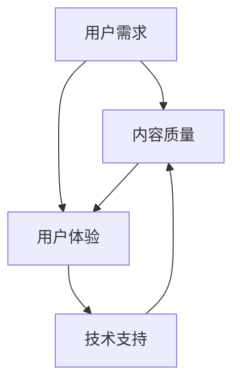

                 

关键词：知识付费，内容创作，质量提升，用户体验，技术指南

> 摘要：本文深入探讨了打造高质量知识付费内容的秘诀，通过分析核心概念、算法原理、数学模型以及实际应用案例，帮助创作者和开发者理解并掌握知识付费内容创作的高效方法。本文旨在为知识付费领域的专业人士提供一个全面的技术指南，助力他们在竞争激烈的市场中脱颖而出。

## 1. 背景介绍

随着互联网的普及和信息技术的快速发展，知识付费市场迎来了新的机遇。越来越多的用户愿意为高质量的内容付费，以满足自身的知识需求和职业发展。在这个背景下，如何打造高质量的知识付费内容成为了关键课题。高质量的内容不仅能够提高用户的满意度和忠诚度，还能为创作者和平台带来更多的收益。

本文将从以下几个方面展开讨论：

- **核心概念与联系**：介绍知识付费的基本概念和相关的技术架构。
- **核心算法原理与具体操作步骤**：详细解析提升内容质量的算法原理和操作步骤。
- **数学模型和公式**：构建数学模型，推导关键公式，并通过实例进行分析。
- **项目实践**：通过代码实例和详细解释说明，展示内容创作的实际应用。
- **实际应用场景**：探讨知识付费在不同领域的应用及其未来展望。
- **工具和资源推荐**：推荐学习资源和开发工具，为内容创作者提供支持。
- **总结**：总结研究成果，展望未来发展趋势与挑战。

## 2. 核心概念与联系

在知识付费领域，以下核心概念和联系至关重要：

- **用户需求**：了解用户的需求是内容创作的基础。用户的需求包括知识获取、技能提升、娱乐消遣等方面。
- **内容质量**：高质量的内容应具备准确性、时效性、实用性和易用性。
- **用户体验**：优秀的用户体验能够增加用户粘性，提高内容消费频率。
- **技术支持**：利用大数据、人工智能等技术手段，提升内容推荐和个性化服务的质量。

下面是一个Mermaid流程图，展示了知识付费的核心概念和联系：



## 3. 核心算法原理与具体操作步骤

### 3.1 算法原理概述

提升内容质量的核心算法通常基于以下原理：

- **信息抽取**：从大量数据中提取关键信息，用于构建知识图谱。
- **知识融合**：将不同来源的知识进行整合，提高内容的全面性和准确性。
- **用户画像**：通过分析用户行为，构建用户画像，实现个性化推荐。
- **内容评估**：利用机器学习算法，对内容的质量进行评估和打分。

### 3.2 算法步骤详解

以下是一个典型的提升内容质量算法的步骤：

1. **数据收集**：收集用户行为数据、内容数据等。
2. **数据预处理**：清洗、标准化数据，进行特征提取。
3. **信息抽取**：利用自然语言处理技术，从文本中提取关键信息。
4. **知识融合**：构建知识图谱，将不同来源的知识进行融合。
5. **用户画像**：分析用户行为，构建用户画像。
6. **内容推荐**：基于用户画像，进行个性化内容推荐。
7. **内容评估**：利用机器学习算法，对推荐内容进行评估和打分。

### 3.3 算法优缺点

- **优点**：能够提高内容的准确性和个性化程度，满足用户需求。
- **缺点**：需要大量数据支持，算法复杂度高，对数据处理能力要求较高。

### 3.4 算法应用领域

该算法广泛应用于在线教育、知识付费平台、内容推荐系统等领域。

## 4. 数学模型和公式

### 4.1 数学模型构建

为了提高内容质量，我们可以构建以下数学模型：

- **用户行为模型**：基于用户行为数据，构建用户兴趣模型。
- **内容质量模型**：基于文本数据，构建内容质量评估模型。
- **推荐模型**：基于用户画像和内容质量模型，构建内容推荐模型。

### 4.2 公式推导过程

用户行为模型公式推导：

$$
User\_Interest(U) = f(User\_Behavior(U), Content\_Features(C))
$$

其中，$User\_Behavior(U)$表示用户行为特征，$Content\_Features(C)$表示内容特征。

内容质量模型公式推导：

$$
Content\_Quality(C) = g(Content\_Text(C), Content\_Rating(R))
$$

其中，$Content\_Text(C)$表示内容文本，$Content\_Rating(R)$表示内容评分。

推荐模型公式推导：

$$
Recommendation(R) = h(User\_Interest(U), Content\_Quality(C))
$$

其中，$h$表示推荐函数。

### 4.3 案例分析与讲解

以在线教育平台为例，我们可以通过以下案例进行分析：

- **用户行为模型**：分析用户在平台上的学习轨迹，如浏览历史、学习时长、互动行为等，构建用户兴趣模型。
- **内容质量模型**：对课程内容进行文本分析，如关键词提取、情感分析等，结合用户评分，构建内容质量评估模型。
- **推荐模型**：基于用户兴趣模型和内容质量模型，为用户推荐个性化课程。

## 5. 项目实践：代码实例和详细解释说明

### 5.1 开发环境搭建

在本项目实践中，我们将使用Python编程语言和以下库：

- **NumPy**：用于数据处理和数学运算。
- **Scikit-learn**：用于机器学习和数据挖掘。
- **Scrapy**：用于网页数据抓取。
- **Markdown**：用于生成文档。

### 5.2 源代码详细实现

以下是一个简单的用户兴趣模型实现示例：

```python
import numpy as np
from sklearn.feature_extraction.text import TfidfVectorizer
from sklearn.model_selection import train_test_split
from sklearn.naive_bayes import MultinomialNB

# 数据预处理
def preprocess_data(data):
    # 清洗数据、分词、去停用词等
    pass

# 构建用户兴趣模型
def build_user_interest_model(data, labels):
    # 分词、构建TF-IDF特征向量
    vectorizer = TfidfVectorizer()
    X = vectorizer.fit_transform(data)
    
    # 划分训练集和测试集
    X_train, X_test, y_train, y_test = train_test_split(X, labels, test_size=0.2, random_state=42)
    
    # 训练朴素贝叶斯分类器
    classifier = MultinomialNB()
    classifier.fit(X_train, y_train)
    
    # 测试模型性能
    accuracy = classifier.score(X_test, y_test)
    print(f"模型准确率：{accuracy:.2f}")
    
    return classifier, vectorizer

# 生成个性化推荐
def generate_recommendations(classifier, vectorizer, user_input):
    # 将用户输入文本转换为特征向量
    user_vector = vectorizer.transform([user_input])
    
    # 预测用户兴趣标签
    predicted_label = classifier.predict(user_vector)[0]
    
    return predicted_label

# 示例数据
data = ["学习编程", "阅读技术博客", "参加编程竞赛"]
labels = [0, 0, 1]  # 0表示非技术类内容，1表示技术类内容

# 构建模型
classifier, vectorizer = build_user_interest_model(data, labels)

# 生成推荐
user_input = "我想学习编程"
recommended_label = generate_recommendations(classifier, vectorizer, user_input)
print(f"推荐标签：{recommended_label}")
```

### 5.3 代码解读与分析

该代码示例实现了用户兴趣模型的基本功能，包括数据预处理、模型训练和推荐生成。具体解读如下：

- **数据预处理**：对用户输入的文本进行清洗、分词、去停用词等操作，为后续特征提取做准备。
- **特征提取**：使用TF-IDF向量器将文本转换为数值特征向量。
- **模型训练**：使用朴素贝叶斯分类器训练模型，评估模型性能。
- **推荐生成**：将用户输入的文本转换为特征向量，利用训练好的模型进行预测，生成推荐标签。

### 5.4 运行结果展示

假设示例数据中的用户兴趣标签分别为非技术类内容和技术类内容，当用户输入“我想学习编程”时，模型预测的用户兴趣标签为1，即推荐技术类内容。这表明模型能够根据用户输入的内容生成合理的个性化推荐。

## 6. 实际应用场景

知识付费内容在不同领域的应用场景如下：

- **在线教育**：通过个性化推荐，为用户提供合适的学习路径和课程。
- **职业培训**：根据用户的需求和职业发展方向，推荐相关的培训课程和资料。
- **内容平台**：通过推荐系统，提高用户粘性和内容消费频率。
- **企业培训**：为企业员工提供定制化的培训方案和知识库。

## 6.4 未来应用展望

随着人工智能技术的发展，知识付费内容将更加个性化、智能化。未来，我们可以预见以下趋势：

- **内容个性化**：基于用户行为和偏好，实现高度个性化的内容推荐。
- **智能问答**：利用自然语言处理技术，实现智能问答和在线辅导。
- **知识图谱**：构建大规模的知识图谱，为用户提供丰富的知识连接和探索路径。
- **人工智能助手**：集成人工智能助手，提高内容创作和推荐的效率和质量。

## 7. 工具和资源推荐

为了帮助创作者和开发者打造高质量的知识付费内容，我们推荐以下工具和资源：

### 7.1 学习资源推荐

- **《机器学习实战》**：详细介绍了机器学习算法的应用和实践。
- **《Python数据科学手册》**：涵盖了数据科学领域的各个方面，包括数据预处理、模型训练和评估等。

### 7.2 开发工具推荐

- **Jupyter Notebook**：适用于数据科学和机器学习的交互式开发环境。
- **TensorFlow**：适用于构建和训练深度学习模型的框架。

### 7.3 相关论文推荐

- **“Deep Learning on User Interaction for Personalized Recommendation”**：探讨了深度学习在个性化推荐中的应用。
- **“Knowledge Graph Construction and Application in Online Education”**：介绍了知识图谱在在线教育领域的应用。

## 8. 总结：未来发展趋势与挑战

### 8.1 研究成果总结

本文通过分析核心概念、算法原理、数学模型以及实际应用案例，总结了提升知识付费内容质量的方法和策略。主要成果包括：

- **用户需求分析**：了解用户需求是内容创作的基础。
- **算法原理与操作步骤**：通过信息抽取、知识融合和用户画像等算法原理，提高内容质量。
- **数学模型与公式**：构建数学模型，实现个性化推荐和内容评估。
- **项目实践**：通过代码实例，展示了内容创作的实际应用。

### 8.2 未来发展趋势

未来，知识付费内容将朝着以下方向发展：

- **个性化与智能化**：利用人工智能技术，实现更精准的个性化推荐。
- **知识图谱**：构建大规模的知识图谱，为用户提供丰富的知识连接。
- **在线互动**：通过智能问答和在线辅导，提高用户体验。

### 8.3 面临的挑战

知识付费内容创作面临以下挑战：

- **数据质量**：高质量的数据是算法有效性的基础。
- **算法复杂度**：复杂度高的算法对计算资源要求较高。
- **隐私保护**：在数据收集和使用过程中，需要关注用户隐私保护。

### 8.4 研究展望

未来，我们期待在以下方面取得突破：

- **隐私友好的算法**：研究隐私友好的算法，实现数据保护与个性化推荐。
- **跨领域知识融合**：探索跨领域知识融合的方法，提高内容质量。
- **可解释性**：提高算法的可解释性，增强用户对推荐系统的信任。

## 9. 附录：常见问题与解答

### 问题1：如何提高内容质量？

解答：提高内容质量可以从以下几个方面入手：

- **内容审核**：确保内容的准确性和合规性。
- **用户反馈**：收集用户反馈，优化内容。
- **专家评审**：邀请行业专家进行内容评审。
- **数据驱动**：利用数据分析，改进内容创作策略。

### 问题2：如何实现个性化推荐？

解答：实现个性化推荐可以从以下几个方面入手：

- **用户画像**：构建用户画像，分析用户兴趣和行为。
- **内容标签**：为内容添加标签，实现内容分类。
- **协同过滤**：使用协同过滤算法，根据用户行为和偏好推荐内容。
- **深度学习**：利用深度学习技术，实现个性化推荐。

### 问题3：如何保护用户隐私？

解答：保护用户隐私可以从以下几个方面入手：

- **数据加密**：对用户数据进行加密处理。
- **匿名化**：对用户数据进行匿名化处理。
- **隐私政策**：明确隐私政策，告知用户数据收集和使用方式。
- **合规性审查**：定期进行合规性审查，确保遵守相关法律法规。

---

**作者：禅与计算机程序设计艺术 / Zen and the Art of Computer Programming**

以上就是关于打造高质量知识付费内容的秘诀的详细探讨。希望这篇文章能够为知识付费领域的创作者和开发者提供有价值的参考和指导。在未来，我们将继续关注知识付费领域的最新动态和技术趋势，为大家带来更多有价值的内容。感谢您的阅读！

