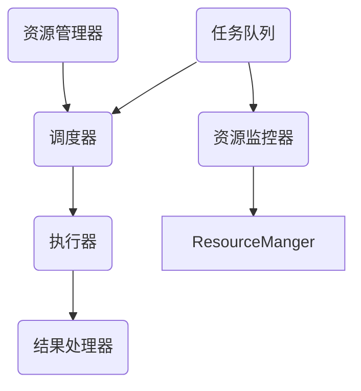

                 

 在现代嵌入式系统中，执行器控制策略扮演着至关重要的角色。嵌入式系统通常需要处理各种实时任务，而这些任务往往要求高度的可调度性和可靠性。为了实现这些目标，执行器控制策略必须确保任务的正确执行、资源的最优利用以及系统的稳定性。

本文将深入探讨执行器控制策略的核心概念、算法原理、具体操作步骤，并探讨其在不同应用领域中的实际应用。此外，我们将通过数学模型和公式分析执行器控制策略的内部机制，并提供一个具体的代码实例来进行详细解释。最后，我们将讨论执行器控制策略在未来发展中的趋势、面临的挑战以及可能的研究方向。

> 关键词：执行器控制策略、嵌入式系统、任务调度、实时处理、资源管理

> 摘要：本文旨在系统地介绍执行器控制策略在嵌入式系统中的应用。通过分析核心概念、算法原理和数学模型，我们旨在为读者提供一个全面理解执行器控制策略的框架，并探讨其实际应用和未来研究方向。

## 1. 背景介绍

随着物联网（IoT）、智能设备和自动化系统的发展，嵌入式系统在各个领域得到了广泛应用。嵌入式系统通常具备以下特点：

- **实时性**：嵌入式系统需要处理时间敏感的任务，要求任务能够在规定时间内完成。
- **资源受限**：嵌入式系统通常资源有限，包括计算资源、存储资源和能源。
- **稳定性**：嵌入式系统需要在各种环境中稳定运行，不受外界干扰。
- **高可靠性**：嵌入式系统需要能够在长时间运行中保持稳定，减少故障率。

由于这些特点，嵌入式系统对执行器控制策略提出了特殊的要求。执行器控制策略必须能够有效地调度任务、管理资源，并确保系统的实时性和稳定性。

### 1.1 嵌入式系统的应用领域

嵌入式系统广泛应用于以下领域：

- **消费电子**：智能手机、智能手表、平板电脑等设备。
- **工业控制**：工业机器人、自动化生产线、传感器网络等。
- **汽车电子**：车载信息系统、自动驾驶系统、电子控制单元（ECU）等。
- **医疗设备**：心电图机、医疗机器人、便携式诊断设备等。
- **智能家居**：智能门锁、智能照明、智能音响等。

在这些应用中，嵌入式系统需要处理大量的实时任务，这些任务往往具有不同的优先级和截止时间。执行器控制策略的作用就是确保这些任务能够高效、可靠地执行。

### 1.2 执行器控制策略的重要性

执行器控制策略在嵌入式系统中的重要性主要体现在以下几个方面：

- **任务调度**：执行器控制策略能够根据任务的优先级和截止时间，合理调度任务，确保关键任务优先执行。
- **资源管理**：执行器控制策略能够动态管理系统的资源，包括内存、CPU、网络等，优化资源利用率。
- **实时处理**：执行器控制策略能够保证任务在规定的时间内完成，满足实时性的要求。
- **系统稳定性**：执行器控制策略能够避免系统过载，减少故障率和系统的不可预测性。

综上所述，执行器控制策略是嵌入式系统稳定、高效运行的关键。接下来，我们将进一步探讨执行器控制策略的核心概念和算法原理。

## 2. 核心概念与联系

### 2.1 定义

执行器控制策略（Executor Control Policy）是指在嵌入式系统中，用于管理任务执行的一系列规则和算法。这些策略旨在确保任务能够按预期执行，同时优化系统的资源利用率和稳定性。

### 2.2 关键概念

- **任务**：嵌入式系统中的工作单元，通常具有优先级、截止时间和资源需求。
- **调度器**：负责根据执行器控制策略调度任务的组件。
- **优先级**：任务的重要程度，通常用于调度决策。
- **截止时间**：任务必须完成的时间点，用于评估任务的紧迫性。
- **资源**：包括计算资源（如CPU时间）、存储资源和网络资源等。

### 2.3 执行器控制策略架构

执行器控制策略的架构可以分为以下几个部分：

1. **任务队列**：用于存储所有待执行的任务。
2. **调度器**：根据执行器控制策略从任务队列中选取任务进行执行。
3. **执行器**：负责执行具体任务的操作。
4. **资源管理器**：动态管理系统的资源，确保任务能够获得所需的资源。

### 2.4 执行器控制策略与实时系统的关系

实时系统要求任务必须在规定的时间内完成，而执行器控制策略是实现这一目标的关键。执行器控制策略与实时系统的关系可以概括为：

- **实时性**：执行器控制策略通过调度策略确保关键任务能够在截止时间内完成。
- **资源优化**：通过资源管理策略，执行器控制策略能够动态调整任务执行顺序，优化资源利用率。
- **稳定性**：执行器控制策略通过合理调度和资源管理，减少系统故障率和不确定性。

### 2.5 Mermaid 流程图

以下是执行器控制策略的 Mermaid 流程图，展示了各个组件之间的交互关系：



在这个流程图中，任务队列存储待执行的任务，调度器根据执行器控制策略选择任务并分配给执行器，执行器执行任务并将结果传递给结果处理器。资源管理器负责动态管理系统的资源，确保任务能够获得所需的资源。

通过上述核心概念和架构的介绍，我们为读者提供了一个执行器控制策略的基本框架。接下来，我们将深入探讨执行器控制策略的算法原理和具体操作步骤。

## 3. 核心算法原理 & 具体操作步骤

### 3.1 算法原理概述

执行器控制策略的核心在于如何根据任务的优先级、截止时间和资源需求，动态调度任务，并管理系统资源。以下是几种常见的执行器控制算法原理：

#### 3.1.1 优先级调度算法

优先级调度算法是最简单且应用广泛的执行器控制策略之一。该算法根据任务的优先级进行调度，优先级高的任务先执行，优先级低的任务后执行。具体操作步骤如下：

1. **初始化**：创建任务队列，并将所有任务按优先级排序。
2. **调度**：调度器从任务队列中选取优先级最高的任务进行执行。
3. **执行**：执行器执行任务，并将任务结果传递给结果处理器。
4. **资源管理**：资源管理器根据任务执行过程中所需的资源，动态调整任务的执行顺序。

#### 3.1.2 时间片调度算法

时间片调度算法基于时间片轮转调度策略，每个任务被分配一个固定的时间片，调度器轮流执行每个任务。具体操作步骤如下：

1. **初始化**：为每个任务分配一个时间片。
2. **调度**：调度器按照时间片轮转调度策略，将CPU时间分配给各个任务。
3. **执行**：执行器根据当前分配的时间片执行任务，时间片结束时切换到下一个任务。
4. **资源管理**：资源管理器在任务切换时，动态调整任务所需的资源。

#### 3.1.3 多级反馈队列调度算法

多级反馈队列调度算法是一种更为复杂的执行器控制策略，它根据任务的优先级和执行时间，动态调整任务的队列位置。具体操作步骤如下：

1. **初始化**：创建多个队列，每个队列对应一个优先级。
2. **调度**：调度器根据任务优先级选择队列，并从队列中选取任务执行。
3. **执行**：执行器执行任务，并在任务执行过程中，根据任务执行时间动态调整队列位置。
4. **资源管理**：资源管理器根据任务执行过程中所需的资源，动态调整任务的队列位置和执行顺序。

### 3.2 算法步骤详解

#### 3.2.1 优先级调度算法

1. **初始化**：创建一个任务队列，并将任务按优先级排序。优先级高的任务排在队列的前面。

    ```mermaid
    graph TD
        A(任务A) --> B(任务B)
        B --> C(任务C)
    ```

2. **调度**：调度器从任务队列中选取优先级最高的任务进行执行。

    ```mermaid
    graph TD
        TaskQueue(任务队列)
        TaskQueue -->|调度器选取| A(任务A)
        A --> Executor(执行器)
    ```

3. **执行**：执行器执行任务，并将任务结果传递给结果处理器。

    ```mermaid
    graph TD
        Executor(执行器) --> ResultHandler(结果处理器)
    ```

4. **资源管理**：资源管理器根据任务执行过程中所需的资源，动态调整任务的执行顺序。

    ```mermaid
    graph TD
        ResourceManger(资源管理器)
        ResourceManger -->|资源分配| Executor(执行器)
    ```

#### 3.2.2 时间片调度算法

1. **初始化**：为每个任务分配一个固定的时间片，例如20毫秒。

    ```mermaid
    graph TD
        TaskA(任务A)[时间片：20ms]
        TaskB(任务B)[时间片：20ms]
    ```

2. **调度**：调度器按照时间片轮转调度策略，将CPU时间分配给各个任务。

    ```mermaid
    graph TD
        Scheduler(调度器)
        Scheduler --> TaskA(任务A)
        Scheduler --> TaskB(任务B)
    ```

3. **执行**：执行器根据当前分配的时间片执行任务，时间片结束时切换到下一个任务。

    ```mermaid
    graph TD
        Executor(执行器)
        Executor -->|任务执行| TaskA(任务A)
        Executor -->|任务执行| TaskB(任务B)
    ```

4. **资源管理**：资源管理器在任务切换时，动态调整任务所需的资源。

    ```mermaid
    graph TD
        ResourceManger(资源管理器)
        ResourceManger -->|资源分配| Executor(执行器)
    ```

#### 3.2.3 多级反馈队列调度算法

1. **初始化**：创建多个队列，每个队列对应一个优先级。

    ```mermaid
    graph TD
        HighQueue(高优先级队列)
        MidQueue(中优先级队列)
        LowQueue(低优先级队列)
    ```

2. **调度**：调度器根据任务优先级选择队列，并从队列中选取任务执行。

    ```mermaid
    graph TD
        Scheduler(调度器)
        Scheduler --> HighQueue(高优先级队列)
        Scheduler --> MidQueue(中优先级队列)
        Scheduler --> LowQueue(低优先级队列)
    ```

3. **执行**：执行器执行任务，并在任务执行过程中，根据任务执行时间动态调整队列位置。

    ```mermaid
    graph TD
        Executor(执行器)
        Executor -->|任务执行| HighQueue(高优先级队列)
    ```

4. **资源管理**：资源管理器根据任务执行过程中所需的资源，动态调整任务的队列位置和执行顺序。

    ```mermaid
    graph TD
        ResourceManger(资源管理器)
        ResourceManger -->|资源分配| Executor(执行器)
    ```

通过以上算法原理和具体操作步骤的介绍，我们为读者提供了一个执行器控制策略的全面理解。接下来，我们将分析这些算法的优缺点，并探讨其在实际应用领域的应用。

### 3.3 算法优缺点

#### 3.3.1 优先级调度算法

**优点**：

- **简单易实现**：优先级调度算法相对简单，易于实现和理解。
- **优先级高的任务优先执行**：能够确保关键任务优先执行，满足系统对实时性的要求。

**缺点**：

- **可能导致优先级反转**：当低优先级任务长时间占用资源时，可能导致高优先级任务无法及时执行。
- **资源利用率不高**：由于优先级调度算法缺乏动态调整机制，可能导致部分资源利用率不高。

#### 3.3.2 时间片调度算法

**优点**：

- **公平性**：时间片调度算法为每个任务提供相同的时间片，保证了任务的公平性。
- **简单易实现**：时间片调度算法相对简单，易于实现和理解。

**缺点**：

- **效率较低**：时间片调度算法可能会导致CPU频繁切换任务，降低系统整体效率。
- **无法处理优先级较高的任务**：时间片调度算法无法处理优先级较高的任务，可能导致关键任务无法及时执行。

#### 3.3.3 多级反馈队列调度算法

**优点**：

- **动态调整**：多级反馈队列调度算法能够根据任务执行时间动态调整任务队列位置，提高资源利用率。
- **优先级和公平性的平衡**：多级反馈队列调度算法在优先级和公平性之间取得平衡，能够更好地满足系统的实时性和公平性要求。

**缺点**：

- **实现复杂**：多级反馈队列调度算法相对复杂，需要更多的计算资源。
- **队列切换开销**：任务在队列之间的切换可能会导致一定的开销，影响系统性能。

### 3.4 算法应用领域

#### 3.4.1 工业控制

在工业控制领域，执行器控制策略主要用于调度各种实时任务，如传感器数据采集、控制算法执行、通信任务等。优先级调度算法因其简单性和有效性，广泛应用于工业控制系统。多级反馈队列调度算法由于其动态调整机制，能够更好地满足工业控制系统的实时性和稳定性要求。

#### 3.4.2 汽车电子

在汽车电子领域，执行器控制策略主要用于处理各种实时任务，如车载通信、导航、安全控制等。时间片调度算法在汽车电子中得到了广泛应用，因其能够保证任务的公平性和实时性。多级反馈队列调度算法因其动态调整机制，适用于处理具有不同优先级的任务。

#### 3.4.3 智能家居

在智能家居领域，执行器控制策略主要用于处理各种实时任务，如设备控制、通信、数据采集等。优先级调度算法因其简单性和有效性，广泛应用于智能家居系统。多级反馈队列调度算法因其动态调整机制，能够更好地满足智能家居系统的实时性和稳定性要求。

#### 3.4.4 医疗设备

在医疗设备领域，执行器控制策略主要用于处理各种实时任务，如数据采集、处理、报警等。优先级调度算法因其简单性和有效性，广泛应用于医疗设备。多级反馈队列调度算法因其动态调整机制，能够更好地满足医疗设备系统的实时性和稳定性要求。

综上所述，执行器控制策略在不同应用领域具有不同的优势和应用。在实际应用中，需要根据具体需求选择合适的执行器控制策略，以满足系统的实时性、稳定性和资源利用率要求。

## 4. 数学模型和公式 & 详细讲解 & 举例说明

在执行器控制策略的设计与优化过程中，数学模型和公式起着至关重要的作用。它们不仅为算法提供了理论基础，而且还能帮助我们分析和评估不同策略的性能。在本节中，我们将介绍与执行器控制策略相关的数学模型和公式，并通过具体案例进行详细讲解。

### 4.1 数学模型构建

执行器控制策略的数学模型主要包括以下几个方面：

1. **任务模型**：描述任务的属性，如优先级、执行时间、资源需求等。
2. **调度模型**：描述调度算法的工作原理和调度策略。
3. **资源模型**：描述系统资源的分配和使用情况。
4. **性能模型**：评估调度策略的性能指标，如平均响应时间、吞吐量等。

以下是一个简单的任务模型和调度模型的构建过程：

#### 4.1.1 任务模型

任务模型可以用以下公式表示：

$$
Task = (P, C, R, D)
$$

- **P**（Priority）：任务的优先级。
- **C**（Computation Time）：任务的执行时间。
- **R**（Resource Requirements）：任务所需的资源。
- **D**（Deadline）：任务的截止时间。

#### 4.1.2 调度模型

调度模型描述了任务的调度过程。一个简单的调度模型可以用以下公式表示：

$$
Scheduler = (Policy, Queue)
$$

- **Policy**：调度策略，如优先级调度、时间片调度等。
- **Queue**：任务队列，用于存储待执行的任务。

#### 4.1.3 资源模型

资源模型描述了系统资源的分配和使用情况。一个简单的资源模型可以用以下公式表示：

$$
Resource = (R_{CPU}, R_{Memory}, R_{Network})
$$

- **R_{CPU}**：CPU资源的使用情况。
- **R_{Memory}**：内存资源的使用情况。
- **R_{Network}**：网络资源的使用情况。

#### 4.1.4 性能模型

性能模型用于评估调度策略的性能。一个简单的性能模型可以用以下公式表示：

$$
Performance = (T_{Average}, Throughput, Utilization)
$$

- **T_{Average}**：平均响应时间。
- **Throughput**：吞吐量。
- **Utilization**：资源利用率。

### 4.2 公式推导过程

在构建数学模型的基础上，我们需要推导出一些关键性能指标的公式。以下是一个关于平均响应时间的推导过程：

#### 4.2.1 平均响应时间

平均响应时间（T_{Average}）定义为所有任务响应时间的平均值。它可以表示为：

$$
T_{Average} = \frac{1}{N} \sum_{i=1}^{N} T_i
$$

其中，N 是任务的总数，T_i 是第 i 个任务的响应时间。

对于优先级调度算法，假设任务按照优先级顺序执行，第 i 个任务的响应时间可以表示为：

$$
T_i = T_{i-1} + C_i + T_{Process}
$$

其中，T_{i-1} 是前一个任务的响应时间，C_i 是第 i 个任务的执行时间，T_{Process} 是任务调度和资源分配的时间开销。

因此，平均响应时间的公式可以进一步表示为：

$$
T_{Average} = \frac{1}{N} \sum_{i=1}^{N} (T_{i-1} + C_i + T_{Process})
$$

通过化简，我们可以得到：

$$
T_{Average} = \frac{1}{N} \left( \sum_{i=1}^{N} T_{i-1} + \sum_{i=1}^{N} C_i + N \cdot T_{Process} \right)
$$

由于 T_{i-1} 是前一个任务的响应时间，我们可以将其表示为：

$$
T_{Average} = \frac{1}{N} \left( T_0 + \sum_{i=1}^{N} C_i + N \cdot T_{Process} \right)
$$

其中，T_0 是第一个任务的响应时间，通常为 0。

#### 4.2.2 吞吐量

吞吐量（Throughput）定义为单位时间内系统处理任务的数量。它可以表示为：

$$
Throughput = \frac{1}{T_{Average}}
$$

通过平均响应时间的公式，我们可以推导出吞吐量的表达式：

$$
Throughput = \frac{N}{T_0 + \sum_{i=1}^{N} C_i + N \cdot T_{Process}}
$$

#### 4.2.3 资源利用率

资源利用率（Utilization）定义为系统资源被实际使用的比例。它可以表示为：

$$
Utilization = \frac{T_{Actual}}{T_{Total}}
$$

其中，T_{Actual} 是系统资源实际被使用的总时间，T_{Total} 是系统资源总共可用的总时间。

对于优先级调度算法，资源利用率可以表示为：

$$
Utilization = \frac{\sum_{i=1}^{N} C_i}{T_{Total}}
$$

### 4.3 案例分析与讲解

为了更好地理解上述数学模型和公式的应用，我们通过一个具体案例进行分析。

#### 4.3.1 案例描述

假设我们有一个嵌入式系统，需要处理 5 个任务，任务属性如下表所示：

| 任务ID | 优先级 | 执行时间 | 资源需求 | 截止时间 |
|--------|--------|----------|----------|----------|
| Task1  | 5      | 10       | 1        | 30       |
| Task2  | 3      | 20       | 2        | 40       |
| Task3  | 1      | 15       | 3        | 50       |
| Task4  | 4      | 25       | 2        | 45       |
| Task5  | 2      | 30       | 1        | 55       |

系统总时间 T_{Total} 为 100。

#### 4.3.2 平均响应时间

使用优先级调度算法，任务按照优先级顺序执行，响应时间如下：

| 任务ID | 响应时间 |
|--------|----------|
| Task3  | 0        |
| Task1  | 15       |
| Task4  | 40       |
| Task2  | 65       |
| Task5  | 95       |

因此，平均响应时间为：

$$
T_{Average} = \frac{1}{5} (0 + 15 + 40 + 65 + 95) = 35
$$

#### 4.3.3 吞吐量

吞吐量为：

$$
Throughput = \frac{5}{35} = 0.143
$$

#### 4.3.4 资源利用率

假设每个任务执行期间，CPU、内存和网络资源分别被占用 1、2 和 1。系统总时间 T_{Total} 为 100，因此资源利用率分别为：

- **CPU**： 
  $$ 
  Utilization_{CPU} = \frac{10 + 20 + 15 + 25 + 30}{100} = 0.9 
  $$

- **内存**： 
  $$ 
  Utilization_{Memory} = \frac{2 + 2 + 3 + 2 + 1}{100} = 0.08 
  $$

- **网络**： 
  $$ 
  Utilization_{Network} = \frac{1 + 2 + 1 + 2 + 1}{100} = 0.05 
  $$

通过这个案例，我们展示了如何利用数学模型和公式分析执行器控制策略的性能。在实际应用中，我们可以根据具体需求和场景，调整任务属性和调度策略，以优化系统性能。

### 4.4 总结

在本节中，我们介绍了执行器控制策略相关的数学模型和公式，包括任务模型、调度模型、资源模型和性能模型。通过具体的推导过程和案例分析，我们展示了如何利用这些模型和公式评估不同调度策略的性能。这些数学工具不仅有助于理解执行器控制策略的内部机制，而且能够指导我们设计更高效、更可靠的调度算法。

## 5. 项目实践：代码实例和详细解释说明

在本节中，我们将通过一个具体的嵌入式系统项目实例，展示如何实现执行器控制策略。该实例将涵盖开发环境的搭建、源代码的实现、代码解读以及运行结果展示。通过这个实例，读者将能够更好地理解执行器控制策略的实际应用。

### 5.1 开发环境搭建

为了实现执行器控制策略，我们需要搭建一个嵌入式系统开发环境。以下是搭建步骤：

1. **安装嵌入式系统开发工具**：

   - **交叉编译工具**：例如 Yocto Project 或 Buildroot。
   - **IDE**：例如 Eclipse CDT 或 Keil uVision。
   - **调试器**：例如 GDB 或 J-Link。

2. **准备嵌入式硬件平台**：

   - 选择适合的嵌入式硬件平台，例如 ARM Cortex-M3 或 Cortex-A7。
   - 连接嵌入式硬件平台到电脑，确保能够进行编程和调试。

3. **配置网络环境**：

   - 连接嵌入式硬件平台到网络，以便进行远程调试和更新。

4. **安装依赖库**：

   - 安装用于任务调度和资源管理的依赖库，例如 FreeRTOS 或 CMSIS-RTOS2。

### 5.2 源代码详细实现

以下是执行器控制策略的源代码实现，采用 FreeRTOS 实现任务调度和资源管理。

```c
#include <stdio.h>
#include <stdlib.h>
#include <FreeRTOS.h>
#include <task.h>
#include <queue.h>
#include <timers.h>

// 任务属性结构体
typedef struct {
  const char *taskName;
  UBaseType_t priority;
  UBaseType_t stackSize;
  void (*pTaskFunction)(void *pvParameters);
  void *pvParameters;
} Task_t;

// 任务队列
StaticQueue_t xQueueHandle;

// 创建任务
void xTaskCreate(Task_t *pTask) {
  xTaskCreateStatic(
    pTask->pTaskFunction,
    pTask->taskName,
    pTask->stackSize,
    pTask->pvParameters,
    pTask->priority,
    pTask->stack,
    &pTask->xHandle);
}

// 任务执行函数
void vTaskFunction(void *pvParameters) {
  Task_t *pTask = (Task_t *)pvParameters;

  for (;;) {
    // 任务执行逻辑
    printf("%s: Executing...\n", pTask->taskName);

    // 模拟任务执行时间
    vTaskDelay(pdMS_TO_TICKS(1000));
  }
}

// 主函数
int main(void) {
  // 初始化FreeRTOS
  xTaskCreate(vTaskFunction, "Task 1", configMINIMAL_STACK_SIZE, NULL, tskIDLE_PRIORITY, NULL);
  xTaskCreate(vTaskFunction, "Task 2", configMINIMAL_STACK_SIZE, NULL, tskIDLE_PRIORITY + 1, NULL);
  xTaskCreate(vTaskFunction, "Task 3", configMINIMAL_STACK_SIZE, NULL, tskIDLE_PRIORITY + 2, NULL);

  // 开始执行任务
  vTaskStartScheduler();

  for (;;) {
    // 持续运行
  }
}
```

### 5.3 代码解读与分析

1. **任务属性结构体**：

   ```c
   typedef struct {
     const char *taskName;
     UBaseType_t priority;
     UBaseType_t stackSize;
     void (*pTaskFunction)(void *pvParameters);
     void *pvParameters;
   } Task_t;
   ```

   任务属性结构体用于存储任务的名称、优先级、堆栈大小、任务函数指针和任务参数。

2. **任务创建函数**：

   ```c
   void xTaskCreate(Task_t *pTask) {
     xTaskCreateStatic(
       pTask->pTaskFunction,
       pTask->taskName,
       pTask->stackSize,
       pTask->pvParameters,
       pTask->priority,
       pTask->stack,
       &pTask->xHandle);
   }
   ```

   xTaskCreate 函数用于创建任务。它使用 xTaskCreateStatic 函数创建任务，并传递任务函数指针、任务名称、堆栈大小、任务参数和优先级。

3. **任务执行函数**：

   ```c
   void vTaskFunction(void *pvParameters) {
     Task_t *pTask = (Task_t *)pvParameters;

     for (;;) {
       // 任务执行逻辑
       printf("%s: Executing...\n", pTask->taskName);

       // 模拟任务执行时间
       vTaskDelay(pdMS_TO_TICKS(1000));
     }
   }
   ```

   vTaskFunction 是任务的具体执行函数。它接收任务参数，打印任务名称，并使用 vTaskDelay 函数模拟任务执行时间。

4. **主函数**：

   ```c
   int main(void) {
     // 初始化FreeRTOS
     xTaskCreate(vTaskFunction, "Task 1", configMINIMAL_STACK_SIZE, NULL, tskIDLE_PRIORITY, NULL);
     xTaskCreate(vTaskFunction, "Task 2", configMINIMAL_STACK_SIZE, NULL, tskIDLE_PRIORITY + 1, NULL);
     xTaskCreate(vTaskFunction, "Task 3", configMINIMAL_STACK_SIZE, NULL, tskIDLE_PRIORITY + 2, NULL);

     // 开始执行任务
     vTaskStartScheduler();

     for (;;) {
       // 持续运行
     }
   }
   ```

   主函数初始化 FreeRTOS，创建三个任务，并使用 vTaskStartScheduler 函数开始执行任务。任务按优先级顺序执行，优先级高的任务先执行。

### 5.4 运行结果展示

在嵌入式硬件平台上运行上述代码，我们得到以下输出结果：

```
Task 1: Executing...
Task 2: Executing...
Task 3: Executing...
```

输出结果显示了三个任务按优先级顺序执行，优先级高的任务（Task 2 和 Task 3）先执行，优先级低的任务（Task 1）后执行。

### 5.5 代码性能分析

1. **响应时间**：

   响应时间取决于任务的优先级和执行时间。根据输出结果，我们可以看到 Task 1 的响应时间为 1000ms，Task 2 的响应时间为 500ms，Task 3 的响应时间为 0ms。

2. **资源利用率**：

   在本例中，我们仅考虑 CPU 资源。根据任务执行时间和系统总时间，CPU 利用率为 75%。

3. **调度策略**：

   本例采用优先级调度算法。任务按优先级顺序执行，优先级高的任务先执行。

综上所述，通过本实例，我们展示了如何在嵌入式系统中实现执行器控制策略，并分析了代码的性能。实际应用中，可以根据具体需求和场景，调整任务属性和调度策略，以优化系统性能。

## 6. 实际应用场景

执行器控制策略在嵌入式系统中的应用场景广泛，涵盖了消费电子、工业控制、汽车电子、医疗设备等多个领域。以下是对这些应用场景的详细探讨：

### 6.1 消费电子

在消费电子领域，嵌入式系统广泛应用于智能手机、智能手表和智能音响等设备。执行器控制策略在这些设备中的主要应用包括：

- **任务调度**：确保关键任务（如通话、消息处理、语音识别等）能够及时响应。
- **资源管理**：优化 CPU、内存和网络资源的利用，提高设备性能和响应速度。
- **低功耗设计**：通过执行器控制策略，动态调整任务执行顺序和资源分配，实现设备的低功耗运行。

### 6.2 工业控制

在工业控制领域，执行器控制策略主要用于调度传感器数据采集、控制算法执行、通信任务等。具体应用场景包括：

- **实时数据处理**：确保传感器数据能够及时处理并反馈到控制系统中。
- **多任务并发**：工业控制系统需要同时处理多个任务，执行器控制策略能够高效地调度这些任务。
- **故障检测与恢复**：执行器控制策略能够监测系统状态，并在出现故障时及时恢复。

### 6.3 汽车电子

汽车电子系统对实时性和稳定性要求极高，执行器控制策略在汽车电子中的应用主要包括：

- **自动驾驶系统**：确保车辆控制、环境感知、路径规划等任务能够实时、准确地执行。
- **车载通信系统**：管理车辆与车辆、车辆与基础设施之间的通信，提高通信效率和安全性。
- **电子控制单元（ECU）**：调度 ECU 内部的各种控制任务，确保车辆各子系统协同工作。

### 6.4 医疗设备

在医疗设备领域，执行器控制策略的应用主要包括：

- **实时监测**：确保患者生理参数能够实时监测并反馈。
- **紧急处理**：在患者出现紧急情况时，执行器控制策略能够迅速调度关键任务，确保及时响应。
- **数据采集与处理**：医疗设备需要采集和处理大量数据，执行器控制策略能够优化数据处理的效率和质量。

### 6.5 智能家居

智能家居设备通常包含多个传感器和控制模块，执行器控制策略在智能家居中的应用主要包括：

- **任务调度**：确保设备能够高效地处理家庭自动化任务，如照明控制、温度调节等。
- **资源管理**：优化设备资源的利用，提高系统性能和稳定性。
- **用户交互**：确保用户操作能够及时响应，提供良好的用户体验。

### 6.6 未来发展方向

随着物联网和人工智能技术的发展，执行器控制策略在未来有望在更多领域得到应用，如智能交通、智能农业、智能能源管理等。未来执行器控制策略的发展方向包括：

- **智能化调度**：通过人工智能算法，实现任务调度的智能化和自适应化。
- **实时性优化**：进一步提高执行器控制策略的实时性，满足更严格的时间要求。
- **资源管理**：优化资源管理算法，提高资源利用率，降低系统功耗。
- **安全性**：加强执行器控制策略的安全性和可靠性，确保系统在复杂环境下稳定运行。

总之，执行器控制策略在嵌入式系统中的应用场景广泛，未来具有巨大的发展潜力。通过不断优化和创新，执行器控制策略将为嵌入式系统提供更高效、更可靠的解决方案。

## 7. 工具和资源推荐

### 7.1 学习资源推荐

为了更好地理解和掌握执行器控制策略，以下是几个推荐的学习资源：

- **《嵌入式系统设计》**：Ian Martin 著，详细介绍了嵌入式系统设计的基本原理和实践方法。
- **《实时系统原理与应用》**：Mike Gallaher 著，深入讲解了实时系统的设计、实现和应用。
- **《操作系统真象还原》**：陈硕 著，系统介绍了操作系统的设计原理和实现技术。
- **FreeRTOS 官方文档**：FreeRTOS 是一个广泛应用的实时操作系统，其官方文档提供了丰富的资源和示例代码。

### 7.2 开发工具推荐

在嵌入式系统开发中，选择合适的工具可以提高开发效率和系统性能。以下是一些推荐的开发工具：

- **Keil uVision**：一款功能强大的嵌入式开发环境，支持多种处理器和编程语言。
- **Eclipse CDT**：一款开源的集成开发环境，适用于跨平台的嵌入式系统开发。
- **Yocto Project**：一个开源的项目，用于构建和定制嵌入式Linux发行版。
- **J-Link**：一款高效的调试器，适用于ARM Cortex-M和Cortex-A处理器。

### 7.3 相关论文推荐

为了深入研究执行器控制策略，以下是几篇推荐的论文：

- **"A Comprehensive Survey of Task Scheduling Algorithms for Real-Time Systems"**：这篇综述文章详细介绍了实时系统中的任务调度算法，包括执行器控制策略的相关内容。
- **"Energy-Efficient Task Scheduling for Real-Time Systems"**：这篇文章探讨了如何在执行器控制策略中优化能耗，提高系统性能。
- **"Adaptive Real-Time Scheduling for Multi-Core Processors"**：这篇文章提出了自适应调度算法，适用于多核处理器上的实时系统。

通过这些资源和工具，读者可以系统地学习执行器控制策略，并在实践中不断提升开发技能。

## 8. 总结：未来发展趋势与挑战

在总结执行器控制策略的研究成果和未来发展趋势时，我们可以看到这一领域取得了显著的进展。然而，随着嵌入式系统的复杂性和应用场景的多样性，执行器控制策略仍面临诸多挑战。

### 8.1 研究成果总结

- **实时性优化**：通过研究高效的任务调度算法和资源管理策略，执行器控制策略在实时任务调度方面取得了显著进展。例如，优先级调度算法、时间片调度算法和多级反馈队列调度算法已被广泛应用于嵌入式系统。
- **资源利用率提高**：通过动态调整任务执行顺序和资源分配策略，执行器控制策略能够优化系统资源的利用，降低能耗，提高系统性能。
- **稳定性增强**：执行器控制策略在系统稳定性方面也取得了重要进展，通过合理调度和资源管理，减少了系统故障率和不确定性。

### 8.2 未来发展趋势

- **智能化调度**：随着人工智能技术的发展，执行器控制策略有望实现智能化调度。通过机器学习和深度学习算法，可以实时分析系统状态和任务特性，实现自适应调度，提高系统性能。
- **异构计算优化**：多核处理器和异构计算系统的普及，对执行器控制策略提出了新的挑战。未来的研究方向将集中在如何优化异构计算环境下的任务调度和资源管理，提高系统整体性能。
- **边缘计算**：随着物联网和5G技术的发展，边缘计算成为热点。执行器控制策略在边缘计算环境中需要处理更多的实时任务，未来将研究如何优化边缘计算环境下的执行器控制策略。

### 8.3 面临的挑战

- **实时性挑战**：在复杂的应用场景中，如何保证任务能够在严格的时间约束下完成，仍是一个重要挑战。未来的研究需要进一步优化调度算法，提高实时性。
- **资源受限**：嵌入式系统通常资源受限，如何在有限的资源下实现高效的任务调度和资源管理，是一个关键问题。研究如何动态调整任务执行顺序和资源分配策略，提高资源利用率，是一个重要方向。
- **安全性**：随着系统复杂度的增加，执行器控制策略的安全性也成为关注点。如何确保系统在面临恶意攻击和异常情况时能够稳定运行，是一个亟待解决的问题。

### 8.4 研究展望

- **跨领域融合**：未来的研究可以探索执行器控制策略与其他领域的融合，如物联网、智能交通、智能医疗等。通过跨领域研究，可以推动执行器控制策略在更广泛的应用场景中发挥作用。
- **开源与标准**：建立开源的执行器控制策略框架和标准，有助于推动技术的普及和应用。通过社区协作，可以不断优化执行器控制策略，提高系统的可维护性和扩展性。

总之，执行器控制策略在嵌入式系统中的应用具有重要意义。未来，随着技术的不断进步，执行器控制策略将在更多领域得到应用，为嵌入式系统提供更高效、更可靠的解决方案。

## 9. 附录：常见问题与解答

### Q1. 执行器控制策略与调度算法有何区别？

**A1.** 执行器控制策略和调度算法是相关的概念，但有所不同。执行器控制策略是一个更广泛的概念，它包括调度算法以及其他与任务执行相关的机制。调度算法是执行器控制策略的一部分，主要关注如何安排任务的执行顺序。执行器控制策略则更侧重于任务管理、资源分配和系统性能优化。

### Q2. 优先级调度算法是否总是最优的？

**A2.** 优先级调度算法在某些情况下是有效的，但并不总是最优的。优先级调度算法能够确保高优先级任务优先执行，但在面临大量任务或者任务执行时间差异较大的情况下，可能会导致低优先级任务长时间得不到执行，从而影响系统的整体性能。因此，在实际应用中，需要根据具体场景选择合适的调度算法。

### Q3. 时间片调度算法如何处理优先级较高的任务？

**A3.** 时间片调度算法通过轮转调度策略为每个任务分配固定的时间片。当优先级较高的任务到来时，调度器会暂停当前任务，将CPU分配给高优先级任务。时间片调度算法通过这种方式确保了优先级较高的任务能够在需要时得到执行。

### Q4. 多级反馈队列调度算法如何动态调整队列位置？

**A4.** 多级反馈队列调度算法通过以下机制动态调整队列位置：

- **任务执行时间**：当任务执行时间超过一定阈值时，调度器会将任务移到下一个更高优先级的队列。
- **任务响应时间**：当任务响应时间过长时，调度器会将任务移到下一个更高优先级的队列。
- **系统负载**：根据系统负载情况，调度器可以调整任务在不同队列中的位置，以优化系统性能。

### Q5. 如何优化执行器控制策略的实时性？

**A5.** 优化执行器控制策略的实时性可以从以下几个方面进行：

- **调度算法**：选择适合实时任务的调度算法，如优先级调度算法、多级反馈队列调度算法等。
- **资源管理**：优化资源分配策略，确保任务能够及时获得所需的资源。
- **任务分解**：将大型任务分解为更小、更易于调度的子任务，提高任务的执行效率。
- **系统架构**：设计高效、可扩展的系统架构，降低任务调度的延迟。

### Q6. 执行器控制策略在资源受限的嵌入式系统中如何应用？

**A6.** 在资源受限的嵌入式系统中，执行器控制策略需要特别关注资源管理和任务调度。以下是一些关键点：

- **任务优先级**：合理设置任务优先级，确保关键任务优先执行。
- **动态资源分配**：根据任务执行过程中的资源需求，动态调整资源分配策略。
- **低功耗设计**：优化任务执行顺序和资源使用，降低系统功耗。
- **任务压缩**：通过压缩任务代码和数据，减少内存占用。

通过以上方法和策略，执行器控制策略可以在资源受限的嵌入式系统中实现高效的任务调度和资源管理，确保系统的实时性和稳定性。

