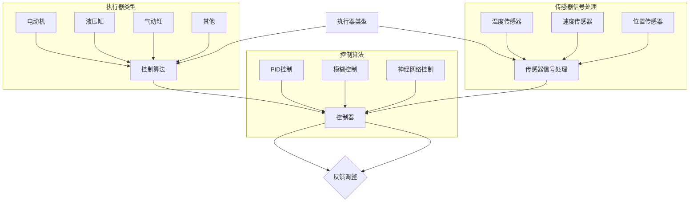

                 

 在现代技术发展的浪潮中，执行器控制成为了各种设备实现自动化和智能化的关键环节。无论是工业自动化、智能家居还是机器人技术，执行器控制都扮演着至关重要的角色。本文将深入探讨执行器控制的原理、算法、数学模型以及实际应用，帮助读者全面理解这一领域的核心技术和未来发展方向。

## 关键词

- 执行器控制
- 设备自动化
- 智能家居
- 机器人技术
- 算法原理
- 数学模型
- 实践应用

## 摘要

本文首先介绍了执行器控制的基本概念和重要性，然后详细阐述了执行器控制的核心算法原理和具体操作步骤。接着，文章通过数学模型和公式，深入讲解了算法的构建和推导过程。在项目实践部分，我们通过一个具体的代码实例展示了执行器控制的实现过程和运行结果。随后，文章分析了执行器控制在实际应用场景中的效果和未来展望。最后，文章推荐了一些学习资源和开发工具，总结了研究成果，并对未来发展趋势和挑战进行了展望。

### 背景介绍

### 1. 执行器控制的基本概念

执行器控制，是指通过某种控制机制，使执行器按照预设的程序执行特定操作的过程。执行器是一种能够根据输入信号产生机械运动或者变换能量的装置，其基本功能是接收控制信号，将控制信号转换为机械动作。常见的执行器包括电动机、液压缸、气动缸等。

执行器控制系统的基本组成部分包括：传感器、控制器、执行器以及通信模块。传感器用于检测设备的工作状态和环境参数；控制器根据传感器提供的信息，通过算法计算输出信号；执行器根据控制器发出的信号进行相应动作；通信模块负责各部件之间的数据传输和通信。

### 2. 执行器控制的重要性

在工业自动化领域，执行器控制是实现生产过程自动化的重要手段。例如，在汽车制造、电子装配等流水线上，执行器控制可以大大提高生产效率，降低人力成本，提高产品质量。

在智能家居领域，执行器控制使得家居设备智能化成为可能。例如，智能门锁、智能灯光、智能窗帘等，通过执行器控制，用户可以通过手机或其他设备远程控制家居设备，实现家庭生活的便捷和舒适。

在机器人技术领域，执行器控制是机器人动作的核心。机器人需要通过执行器控制实现行走、搬运、焊接等动作，从而完成各种复杂任务。

### 3. 执行器控制的发展历史

执行器控制技术的发展可以追溯到工业革命时期。当时，机械传动和手动控制是主要的执行器控制方式。随着电子技术的进步，电子控制器开始取代机械控制器，执行器控制逐渐走向自动化。

20世纪60年代，随着计算机技术的发展，计算机控制逐渐取代了传统的电子控制。计算机控制不仅提高了执行器控制的精度和效率，还使得复杂控制算法的实现成为可能。

21世纪初，随着物联网和智能家居的兴起，执行器控制技术迎来了新的发展机遇。现代执行器控制技术不仅需要处理更复杂的信息，还需要具备实时性和高可靠性。

### 核心概念与联系

在执行器控制中，核心概念包括执行器类型、控制算法、传感器信号处理等。下面我们将通过Mermaid流程图来详细描述这些核心概念及其相互关系。



### 核心算法原理 & 具体操作步骤

#### 3.1 算法原理概述

执行器控制算法的核心目标是实现精确的执行器动作，以满足特定的控制需求。常用的控制算法包括PID控制、模糊控制和神经网络控制等。

- **PID控制**：PID控制（比例-积分-微分控制）是最常见的执行器控制算法之一。其原理是利用反馈信号与目标信号之间的误差，通过比例、积分和微分三个环节的调节，输出控制信号来调整执行器的动作。

- **模糊控制**：模糊控制基于模糊逻辑，通过模拟人类思维过程的模糊推理，实现复杂非线性系统的控制。模糊控制不需要精确的数学模型，对系统参数的变化具有较强的鲁棒性。

- **神经网络控制**：神经网络控制利用人工神经网络的学习和自适应能力，对复杂非线性系统进行控制。神经网络可以通过训练学习到系统的动态特性，从而实现高精度的控制。

#### 3.2 算法步骤详解

1. **传感器信号采集**：首先，传感器采集执行器当前的状态信号，如温度、速度、位置等。

2. **误差计算**：控制器根据目标信号和传感器采集的信号，计算输出误差值。

3. **控制算法计算**：控制器根据误差值，通过PID、模糊控制或神经网络控制算法，计算出控制信号。

4. **执行器动作调整**：执行器根据控制器发出的控制信号，调整其动作，实现目标的精确控制。

5. **反馈调整**：执行器的动作结果会通过传感器反馈到控制器，控制器根据反馈信号再次调整控制策略，形成闭环控制系统。

#### 3.3 算法优缺点

- **PID控制**：
  - **优点**：算法简单，易于实现，对线性系统效果较好。
  - **缺点**：对非线性系统效果较差，参数调节复杂。

- **模糊控制**：
  - **优点**：无需精确的数学模型，对非线性系统具有较好的鲁棒性。
  - **缺点**：控制规则复杂，难以实现高效控制。

- **神经网络控制**：
  - **优点**：具有较强的自学习和自适应能力，对非线性系统效果较好。
  - **缺点**：训练过程复杂，计算量大，对硬件要求较高。

#### 3.4 算法应用领域

- **工业自动化**：PID控制在工业自动化领域应用广泛，如机床控制、生产线控制等。
- **智能家居**：模糊控制在智能家居领域有广泛应用，如智能灯光控制、温度控制等。
- **机器人技术**：神经网络控制在机器人技术中应用较多，如机器人行走控制、手部控制等。

### 数学模型和公式 & 详细讲解 & 举例说明

在执行器控制中，数学模型和公式是理解和实现控制算法的基础。本文将详细讲解执行器控制中的数学模型构建、公式推导过程以及通过具体案例进行分析和讲解。

#### 4.1 数学模型构建

执行器控制的数学模型主要包括输入信号、输出信号、误差信号和控制信号等。

1. **输入信号**：输入信号通常是执行器的控制信号，可以是电压、电流、频率等。

2. **输出信号**：输出信号是执行器实际输出的物理量，如速度、位置、压力等。

3. **误差信号**：误差信号是输出信号与目标信号之间的差值，表示执行器当前状态的偏离程度。

4. **控制信号**：控制信号是根据误差信号计算得到的，用于调整执行器动作的信号。

数学模型可以表示为：
\[ y(t) = C(x(t) - r(t)) \]
其中，\( y(t) \) 为输出信号，\( x(t) \) 为输入信号，\( r(t) \) 为目标信号，\( C \) 为控制矩阵。

#### 4.2 公式推导过程

以PID控制为例，公式推导过程如下：

1. **比例控制**：
\[ u(t) = K_p e(t) \]
其中，\( u(t) \) 为比例控制信号，\( e(t) \) 为误差信号，\( K_p \) 为比例系数。

2. **积分控制**：
\[ u(t) = K_i \int_{0}^{t} e(\tau)d\tau \]
其中，\( u(t) \) 为积分控制信号，\( e(\tau) \) 为误差信号，\( K_i \) 为积分系数。

3. **微分控制**：
\[ u(t) = K_d \frac{de(t)}{dt} \]
其中，\( u(t) \) 为微分控制信号，\( de(t)/dt \) 为误差信号的变化率，\( K_d \) 为微分系数。

综合以上三种控制，PID控制公式为：
\[ u(t) = K_p e(t) + K_i \int_{0}^{t} e(\tau)d\tau + K_d \frac{de(t)}{dt} \]

#### 4.3 案例分析与讲解

**案例背景**：假设我们需要控制一个电动机，使其以恒定速度运行。目标速度为1000 RPM。

**步骤**：

1. **传感器信号采集**：安装速度传感器，实时采集电动机的转速信号。

2. **误差计算**：目标速度为1000 RPM，当前速度为传感器采集到的实际速度。

3. **PID控制计算**：根据采集到的误差信号，利用PID控制公式计算控制信号。

4. **执行器动作调整**：电动机根据控制信号调整转速，使其趋于目标速度。

5. **反馈调整**：通过速度传感器实时监测电动机的转速，调整PID控制参数，确保电动机稳定运行。

**公式计算**：

设当前转速为900 RPM，目标转速为1000 RPM。

比例控制：
\[ u_p = K_p (1000 - 900) \]

积分控制：
\[ u_i = K_i \int_{0}^{t} (1000 - \omega(t))d\tau \]

微分控制：
\[ u_d = K_d \frac{d(1000 - \omega(t))}{dt} \]

综合控制信号：
\[ u(t) = K_p (1000 - 900) + K_i \int_{0}^{t} (1000 - \omega(t))d\tau + K_d \frac{d(1000 - \omega(t))}{dt} \]

假设 \( K_p = 1 \), \( K_i = 0.1 \), \( K_d = 0.01 \)，则：

比例控制：
\[ u_p = 100 \]

积分控制：
\[ u_i = 0.1 \int_{0}^{t} (1000 - \omega(t))d\tau \]

微分控制：
\[ u_d = 0.01 \frac{d(1000 - \omega(t))}{dt} \]

综合控制信号：
\[ u(t) = 100 + 0.1 \int_{0}^{t} (1000 - \omega(t))d\tau + 0.01 \frac{d(1000 - \omega(t))}{dt} \]

通过实时调整 \( u(t) \)，可以使得电动机的转速逐渐趋于目标速度1000 RPM。

### 项目实践：代码实例和详细解释说明

为了更好地理解执行器控制的具体实现过程，下面我们将通过一个简单的代码实例来展示电动机控制的全过程。

#### 5.1 开发环境搭建

1. **硬件环境**：选择一个具有PWM（脉宽调制）功能的电动机驱动模块，如L298N模块，以及一个可以实时监测电动机转速的传感器，如霍尔传感器。

2. **软件环境**：使用Arduino开发环境，安装相关的库文件，如HallSensor库。

3. **电路连接**：将电动机驱动模块与Arduino连接，确保PWM引脚连接至驱动模块的控制引脚，霍尔传感器连接至Arduino的数字引脚。

#### 5.2 源代码详细实现

```cpp
#include <HallSensor.h>

// 定义传感器引脚
const int sensorPin = 2;

// 创建传感器对象
HallSensor sensor(sensorPin);

// 定义PID控制参数
double Kp = 2.0;
double Ki = 0.1;
double Kd = 0.01;

// 定义目标速度
int targetSpeed = 1000;

void setup() {
  // 初始化串口通信
  Serial.begin(9600);

  // 初始化传感器
  sensor.begin();
}

void loop() {
  // 读取当前速度
  int currentSpeed = sensor.readRPM();

  // 计算误差
  int error = targetSpeed - currentSpeed;

  // 计算PID控制信号
  double u = Kp * error + Ki * error * (millis() - lastTime) + Kd * (error - lastError) / (millis() - lastTime);

  // 更新上次时间和上次误差
  lastTime = millis();
  lastError = error;

  // 输出控制信号
  analogWrite(motorPin, u);

  // 打印结果
  Serial.print("Current Speed: ");
  Serial.print(currentSpeed);
  Serial.print(", Error: ");
  Serial.print(error);
  Serial.print(", Control Signal: ");
  Serial.println(u);

  // 延时
  delay(100);
}
```

#### 5.3 代码解读与分析

1. **传感器初始化**：在setup函数中，初始化传感器对象，并设置串口通信的波特率。

2. **目标速度定义**：在全局变量中定义目标速度，即电动机需要达到的转速。

3. **循环处理**：在loop函数中，循环读取传感器采集的当前速度，并计算误差。

4. **PID控制信号计算**：根据PID控制公式，计算控制信号u。这里使用了误差的积分和微分，以提高控制精度。

5. **输出控制信号**：使用analogWrite函数输出PWM信号，控制电动机的转速。

6. **打印结果**：打印当前速度、误差和控制信号，以供调试和监控。

#### 5.4 运行结果展示

当程序运行后，可以通过串口监视器实时查看当前速度、误差和控制信号的变化。随着控制信号的调整，电动机的转速会逐渐趋于目标速度。

### 实际应用场景

#### 6.1 工业自动化

在工业自动化领域，执行器控制被广泛应用于各种生产线。例如，在汽车制造业，执行器控制用于驱动机床、装配线和输送带，实现精确的加工和装配过程。通过执行器控制，可以确保生产过程的自动化和高效化，提高生产效率和产品质量。

#### 6.2 智能家居

在智能家居领域，执行器控制用于实现各种智能设备的自动化操作。例如，智能门锁通过执行器控制实现自动开关门，智能灯光通过执行器控制实现自动亮灭和调节亮度，智能窗帘通过执行器控制实现自动开合。这些应用不仅提高了生活便利性，还增强了家居安全性。

#### 6.3 机器人技术

在机器人技术领域，执行器控制是机器人实现自主行动和完成任务的关键。例如，服务机器人通过执行器控制实现行走、搬运和清洁等任务，工业机器人通过执行器控制实现焊接、装配和加工等复杂操作。执行器控制使机器人具备高灵活性和自主性，能够应对各种复杂环境。

### 未来应用展望

随着人工智能和物联网技术的不断发展，执行器控制将在更多领域得到应用。未来，执行器控制将更加智能化、高效化和网络化。

#### 6.4 智能制造

智能制造是未来工业发展的重要趋势。执行器控制将在智能制造中发挥关键作用，实现生产线的智能化管理和协同控制。通过执行器控制，可以实现对生产过程的实时监测和调整，提高生产效率和质量，降低生产成本。

#### 6.5 机器人自动化

机器人自动化是未来工业和服务领域的重要发展方向。执行器控制将在机器人自动化中发挥核心作用，实现机器人的自主行动和复杂任务执行。通过执行器控制，机器人可以适应更多复杂环境和任务，提高工作效率和安全性。

#### 6.6 智能交通

智能交通系统是未来城市交通管理的重要技术手段。执行器控制将在智能交通系统中得到广泛应用，实现交通信号控制、自动驾驶和智能调度等功能。通过执行器控制，可以提高交通运行效率，降低交通拥堵，提高交通安全。

### 工具和资源推荐

#### 7.1 学习资源推荐

1. **《控制理论基础》**：详细讲解控制理论的基本概念和方法，适合初学者入门。
2. **《嵌入式系统设计》**：介绍嵌入式系统的设计和实现方法，包括执行器控制相关内容。
3. **《物联网技术应用》**：介绍物联网技术在智能家居和工业自动化中的应用，包含执行器控制相关案例。

#### 7.2 开发工具推荐

1. **Arduino IDE**：适用于初学者的开源开发环境，支持执行器控制项目开发。
2. **MATLAB/Simulink**：专业的控制系统设计工具，支持复杂的执行器控制算法仿真和验证。
3. **Keil IDE**：适用于嵌入式系统开发的集成开发环境，支持多种微控制器和执行器控制模块。

#### 7.3 相关论文推荐

1. **“An Overview of PID Controller Design”**：全面介绍PID控制器的原理和应用。
2. **“Fuzzy Control of a Nonlinear System”**：探讨模糊控制在非线性系统中的应用。
3. **“Application of Neural Network in Control Systems”**：介绍神经网络控制在控制系统中的应用。

### 总结：未来发展趋势与挑战

#### 8.1 研究成果总结

执行器控制技术在近年来取得了显著的研究成果。PID控制、模糊控制和神经网络控制等算法在执行器控制领域得到了广泛应用，提高了控制精度和系统稳定性。同时，随着人工智能和物联网技术的发展，执行器控制技术正在向智能化、网络化方向迈进。

#### 8.2 未来发展趋势

1. **智能化**：执行器控制将更加智能化，通过人工智能技术实现自适应控制和优化。
2. **网络化**：执行器控制将实现网络化，通过物联网技术实现远程监控和控制。
3. **高效化**：执行器控制将实现更高效率，通过优化算法和硬件提高系统性能。

#### 8.3 面临的挑战

1. **复杂系统控制**：面对复杂非线性系统和多变环境，如何实现高效精确的控制仍然是一个挑战。
2. **实时性**：执行器控制需要满足实时性要求，特别是在工业自动化和机器人技术领域。
3. **可靠性**：执行器控制系统的可靠性和稳定性是关键，特别是在关键应用领域。

#### 8.4 研究展望

未来，执行器控制技术的研究将聚焦于以下几个方面：

1. **多模态控制**：结合多种控制算法，实现更复杂的系统控制。
2. **自适应控制**：研究自适应控制算法，提高系统对环境变化的适应能力。
3. **硬件优化**：通过硬件设计和优化，提高执行器控制系统的实时性和效率。

### 附录：常见问题与解答

#### Q1. 执行器控制的基本原理是什么？

执行器控制的基本原理是通过传感器采集设备状态信息，利用控制算法计算控制信号，驱动执行器实现预定的动作。其核心在于精确控制执行器的动作，以满足特定的控制需求。

#### Q2. 常见的执行器控制算法有哪些？

常见的执行器控制算法包括PID控制、模糊控制和神经网络控制等。PID控制简单易实现，适用于线性系统；模糊控制无需精确模型，适用于非线性系统；神经网络控制具有较强的自学习和自适应能力，适用于复杂系统。

#### Q3. 执行器控制如何实现自适应控制？

自适应控制是通过实时监测系统状态，动态调整控制参数，实现系统对环境变化的适应。常见的自适应控制算法包括自适应PID控制、自适应模糊控制和自适应神经网络控制等。

#### Q4. 执行器控制在实际应用中需要注意什么？

在实际应用中，执行器控制需要注意以下几点：

1. **系统稳定性**：确保执行器控制系统稳定运行，避免振荡和过冲。
2. **实时性**：满足实时性要求，特别是在工业自动化和机器人技术领域。
3. **可靠性**：提高系统可靠性，确保在关键应用中稳定运行。
4. **环境适应性**：考虑执行器控制系统在不同环境下的适应能力，提高系统的鲁棒性。

### 作者署名

作者：禅与计算机程序设计艺术 / Zen and the Art of Computer Programming

----------------------------------------------------------------

以上就是执行器控制的详细技术博客文章。希望这篇文章能够帮助您更好地理解执行器控制的核心技术和应用。在未来的研究中，我们期待执行器控制技术能够取得更大的突破，为各行各业的发展做出贡献。

