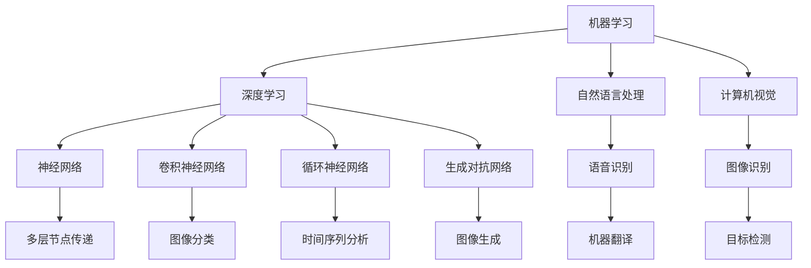

                 

人工智能（AI）近年来取得了显著的进展，已经从科学幻想逐步走向现实应用。从自动化机器人到智能助手，从自然语言处理到图像识别，AI正在深刻地改变着我们的生活方式和工作模式。然而，尽管AI技术在很多方面取得了令人瞩目的成就，但我们也必须认识到，AI的发展并非一帆风顺，背后隐藏着许多真正的挑战。本文将深入探讨AI领域中的核心问题，包括技术挑战、伦理困境以及社会影响，以期为读者提供一个全面而深刻的理解。

## 1. 背景介绍

人工智能的概念可以追溯到20世纪50年代，当时计算机科学家们首次提出让机器模拟人类智能的目标。从最初的逻辑推理到现代的深度学习，AI技术经历了多个阶段的发展。如今，AI已经渗透到各个行业，从医疗到金融，从制造业到服务业，AI的应用前景广阔。

然而，随着AI技术的快速发展，我们也开始面临一系列前所未有的挑战。这些挑战不仅仅体现在技术层面，还包括伦理、法律、社会等多个维度。因此，要真正实现AI的潜力，我们必须全面地认识和解决这些问题。

### 当前AI技术现状

当前，AI技术主要可以分为以下几个方向：

1. **机器学习**：通过算法从数据中学习模式，从而进行预测和决策。
2. **深度学习**：基于多层神经网络，能够在大量数据上实现高效的学习和推理。
3. **自然语言处理（NLP）**：使计算机能够理解和生成自然语言。
4. **计算机视觉**：使计算机能够理解和分析图像和视频。
5. **机器人技术**：结合AI和机械工程，实现智能机器人的设计和应用。

在这些领域，AI技术已经取得了显著的进展，例如自动驾驶汽车、智能客服、医疗诊断等。然而，这些应用仍然面临诸多挑战。

### 挑战的出现

随着AI技术的不断进步，我们也开始面临一系列挑战：

1. **算法偏见**：AI算法在训练过程中可能会学习到数据中的偏见，导致算法的偏见性。
2. **数据隐私**：AI系统通常需要大量的数据来进行训练，但这些数据往往涉及个人隐私。
3. **技术依赖性**：随着AI技术的普及，人类社会对AI的依赖程度越来越高，一旦技术出现故障，可能引发严重的社会问题。
4. **伦理和法律问题**：AI的决策过程往往不透明，如何确保其公平、公正和道德性成为了一个重要问题。

这些挑战不仅制约了AI技术的发展，也对社会产生了深远的影响。因此，我们必须深入探讨这些问题，寻求解决方案。

## 2. 核心概念与联系

### 2.1 人工智能的基本概念

人工智能（Artificial Intelligence，简称AI）是指通过计算机模拟人类智能的一种技术。它包括多个子领域，如机器学习、深度学习、自然语言处理、计算机视觉等。这些子领域相互关联，共同构成了AI的技术体系。

- **机器学习**：机器学习是一种让计算机从数据中学习规律和模式的技术。通过训练数据集，机器学习算法可以识别出数据中的模式，并在新的数据上做出预测。
- **深度学习**：深度学习是机器学习的一个子领域，它基于多层神经网络，通过逐层提取特征，实现复杂模式的学习和识别。
- **自然语言处理**：自然语言处理旨在使计算机理解和生成自然语言。这包括语音识别、机器翻译、情感分析等应用。
- **计算机视觉**：计算机视觉使计算机能够理解和分析图像和视频。这包括图像识别、目标检测、视频追踪等应用。

### 2.2 AI的关键技术与联系

要理解AI技术，我们需要了解一些核心技术和它们之间的联系：

- **神经网络**：神经网络是深度学习的基础，它模拟了人脑的神经元结构，通过多层节点（神经元）进行数据传递和计算。
- **卷积神经网络（CNN）**：卷积神经网络是一种特殊的神经网络，特别适用于图像识别和计算机视觉任务。
- **循环神经网络（RNN）**：循环神经网络适用于处理序列数据，如文本、时间序列等。
- **生成对抗网络（GAN）**：生成对抗网络是一种用于生成新数据的深度学习模型，广泛应用于图像生成和增强现实等领域。

### 2.3 Mermaid 流程图

为了更好地理解AI技术的架构和流程，我们可以使用Mermaid流程图来展示这些核心概念和技术之间的联系。



在这个流程图中，我们可以看到AI技术的各个子领域是如何相互关联的。机器学习和深度学习是AI的基础，自然语言处理和计算机视觉是应用最为广泛的领域。而神经网络、卷积神经网络、循环神经网络和生成对抗网络则是实现这些应用的核心技术。

### 2.4 关键概念总结

通过以上分析，我们可以总结出AI领域的几个关键概念：

- **机器学习**：让计算机从数据中学习规律和模式的技术。
- **深度学习**：基于多层神经网络的机器学习方法，用于解决复杂的学习问题。
- **自然语言处理**：使计算机理解和生成自然语言的技术。
- **计算机视觉**：使计算机理解和分析图像和视频的技术。
- **神经网络**：模拟人脑神经元结构的计算模型，用于实现机器学习和深度学习。
- **卷积神经网络**：用于图像识别和计算机视觉任务的神经网络。
- **循环神经网络**：用于处理序列数据的神经网络。
- **生成对抗网络**：用于生成新数据的深度学习模型。

这些概念和技术相互关联，共同构成了AI的技术体系。理解这些概念和技术，有助于我们更好地认识AI的发展和应用。

## 3. 核心算法原理 & 具体操作步骤

### 3.1 算法原理概述

在AI领域中，核心算法的作用至关重要。这些算法不仅决定了AI系统的性能和效率，还影响了其应用范围和深度。下面我们将详细介绍几种关键算法的原理和操作步骤。

#### 3.1.1 机器学习算法

机器学习算法是AI的基础，其核心思想是让计算机通过学习数据来发现规律和模式。常见的机器学习算法包括线性回归、逻辑回归、支持向量机（SVM）等。

- **线性回归**：用于预测连续值的算法，通过拟合一条直线来表示数据之间的线性关系。
- **逻辑回归**：用于预测概率的算法，通过拟合一个逻辑函数来表示数据之间的非线性关系。
- **支持向量机**：用于分类问题的算法，通过找到一个最佳的超平面来分隔不同类别的数据。

#### 3.1.2 深度学习算法

深度学习算法是机器学习的一个子领域，它通过多层神经网络来实现复杂的模式识别和预测。常见的深度学习算法包括卷积神经网络（CNN）、循环神经网络（RNN）和生成对抗网络（GAN）等。

- **卷积神经网络**：特别适用于图像识别和计算机视觉任务，通过卷积层、池化层和全连接层来提取图像的特征。
- **循环神经网络**：特别适用于序列数据的处理，如文本和语音识别，通过循环结构来保持历史信息的记忆。
- **生成对抗网络**：通过生成器和判别器的对抗训练来生成新的数据，广泛应用于图像生成和增强现实等领域。

#### 3.1.3 自然语言处理算法

自然语言处理算法使计算机能够理解和生成自然语言，包括语音识别、机器翻译、情感分析等。常见的算法包括隐马尔可夫模型（HMM）、递归神经网络（RNN）、长短时记忆网络（LSTM）等。

- **隐马尔可夫模型**：用于处理语音识别问题，通过状态转移矩阵和观察矩阵来表示语音信号。
- **递归神经网络**：用于处理序列数据的自然语言处理任务，通过递归结构来处理文本数据。
- **长短时记忆网络**：在递归神经网络的基础上增加了记忆单元，能够更好地处理长序列数据。

#### 3.1.4 计算机视觉算法

计算机视觉算法使计算机能够理解和分析图像和视频，包括图像识别、目标检测、视频追踪等。常见的算法包括卷积神经网络（CNN）、深度学习框架（如TensorFlow、PyTorch）等。

- **卷积神经网络**：用于图像识别和计算机视觉任务，通过卷积层、池化层和全连接层来提取图像的特征。
- **深度学习框架**：用于实现和训练深度学习算法的软件库，如TensorFlow、PyTorch等。

### 3.2 算法步骤详解

为了更好地理解这些算法的具体操作步骤，我们以下面两种常见的算法为例进行详细解释：

#### 3.2.1 线性回归算法

线性回归算法用于预测连续值，其基本步骤如下：

1. **数据准备**：收集和整理训练数据，包括输入特征和对应的输出值。
2. **模型初始化**：初始化模型的参数，如权重和偏置。
3. **前向传播**：计算输入特征通过模型的输出值。
4. **损失函数计算**：计算模型的预测值与实际值之间的差异，并计算损失函数。
5. **反向传播**：根据损失函数的梯度，更新模型的参数。
6. **迭代训练**：重复步骤3到步骤5，直到模型收敛。

具体实现中，我们可以使用以下伪代码：

```python
# 初始化模型参数
weights = [0] * n_features
bias = 0

# 定义损失函数
def loss_function(y_true, y_pred):
    return (y_true - y_pred) ** 2

# 定义前向传播
def forward_propagation(x):
    return weights.dot(x) + bias

# 定义反向传播
def backward_propagation(x, y):
    gradient_weights = 2 * (y - forward_propagation(x))
    gradient_bias = 2 * (y - forward_propagation(x))
    return gradient_weights, gradient_bias

# 迭代训练
for epoch in range(num_epochs):
    for x, y in training_data:
        pred = forward_propagation(x)
        loss = loss_function(y, pred)
        weights -= learning_rate * backward_propagation(x, y)[0]
        bias -= learning_rate * backward_propagation(x, y)[1]
```

#### 3.2.2 卷积神经网络算法

卷积神经网络算法用于图像识别和计算机视觉任务，其基本步骤如下：

1. **数据准备**：收集和整理训练数据，包括图像和对应的标签。
2. **模型初始化**：初始化模型的参数，如卷积核、池化层和全连接层的参数。
3. **卷积操作**：通过卷积层提取图像的特征。
4. **池化操作**：通过池化层降低特征图的维度。
5. **全连接层**：通过全连接层将特征映射到输出类别。
6. **损失函数计算**：计算模型的预测值与实际值之间的差异，并计算损失函数。
7. **反向传播**：根据损失函数的梯度，更新模型的参数。
8. **迭代训练**：重复步骤3到步骤7，直到模型收敛。

具体实现中，我们可以使用以下伪代码：

```python
# 初始化模型参数
conv_weights = [random_vector(size) for _ in range(num_conv_layers)]
conv_bias = [random_vector(size) for _ in range(num_conv_layers)]
pool_weights = [random_vector(size) for _ in range(num_pool_layers)]
pool_bias = [random_vector(size) for _ in range(num_pool_layers)]
fc_weights = random_matrix(size_features, num_classes)
fc_bias = random_vector(num_classes)

# 定义卷积操作
def convolution(image, weights, bias):
    return (image * weights).sum(axis=1) + bias

# 定义池化操作
def pooling(feature_map, weights, bias):
    return (feature_map * weights).sum(axis=1) + bias

# 定义全连接层操作
def fully_connected(features, weights, bias):
    return features.dot(weights) + bias

# 定义损失函数
def loss_function(y_true, y_pred):
    return (y_true - y_pred) ** 2

# 定义前向传播
def forward_propagation(image, labels):
    for i in range(num_conv_layers):
        image = convolution(image, conv_weights[i], conv_bias[i])
        image = pooling(image, pool_weights[i], pool_bias[i])
    features = fully_connected(image, fc_weights, fc_bias)
    pred = softmax(features)
    return pred

# 定义反向传播
def backward_propagation(image, labels, pred):
    gradient_weights = [None] * num_conv_layers
    gradient_bias = [None] * num_conv_layers
    gradient_fc_weights = None
    gradient_fc_bias = None
    
    for i in range(num_conv_layers):
        gradient_weights[i], gradient_bias[i] = convolution_derivative(image, pred)
        image = pooling_derivative(image, pred)
    
    gradient_fc_weights = features_derivative(pred, labels)
    gradient_fc_bias = features_derivative(pred, labels)
    
    return gradient_weights, gradient_bias, gradient_fc_weights, gradient_fc_bias

# 迭代训练
for epoch in range(num_epochs):
    for image, label in training_data:
        pred = forward_propagation(image, label)
        loss = loss_function(label, pred)
        gradient_weights, gradient_bias, gradient_fc_weights, gradient_fc_bias = backward_propagation(image, label, pred)
        conv_weights -= learning_rate * gradient_weights
        conv_bias -= learning_rate * gradient_bias
        fc_weights -= learning_rate * gradient_fc_weights
        fc_bias -= learning_rate * gradient_fc_bias
```

通过以上步骤，我们可以理解线性回归和卷积神经网络算法的基本原理和具体操作步骤。这些算法在AI领域中具有广泛的应用，通过不断优化和改进，将推动AI技术的进一步发展。

### 3.3 算法优缺点

每种算法都有其独特的优缺点，以下是对几种常见算法的优缺点的分析：

#### 3.3.1 线性回归

- **优点**：
  - 简单易懂，易于实现和优化。
  - 在线性可分的情况下，可以实现很好的预测效果。
- **缺点**：
  - 在非线性问题上的表现较差，难以捕捉复杂的关系。
  - 对异常值敏感，容易受到噪声的影响。

#### 3.3.2 卷积神经网络

- **优点**：
  - 能够有效地处理图像和视频数据，提取丰富的特征。
  - 具有很强的泛化能力，能够应用于各种计算机视觉任务。
- **缺点**：
  - 计算量大，训练时间较长。
  - 对数据质量要求较高，容易出现过拟合现象。

#### 3.3.3 机器学习算法

- **优点**：
  - 泛化能力强，适用于各种类型的数据和问题。
  - 能够自动从数据中学习规律，减少人工干预。
- **缺点**：
  - 需要大量的训练数据和计算资源。
  - 结果难以解释，决策过程不透明。

#### 3.3.4 自然语言处理算法

- **优点**：
  - 能够理解和生成自然语言，实现人机交互。
  - 在文本分类、情感分析等领域具有很高的准确性。
- **缺点**：
  - 对语言的理解能力有限，难以处理复杂的语义问题。
  - 需要大量的标注数据和计算资源。

### 3.4 算法应用领域

不同算法在应用领域上也有所不同，以下是对几种常见算法的应用领域的分析：

#### 3.4.1 线性回归

- **应用领域**：主要用于预测和分析，如房价预测、股票价格分析等。

#### 3.4.2 卷积神经网络

- **应用领域**：主要用于图像识别和计算机视觉，如人脸识别、自动驾驶等。

#### 3.4.3 机器学习算法

- **应用领域**：广泛应用于各种领域，如金融、医疗、制造、推荐系统等。

#### 3.4.4 自然语言处理算法

- **应用领域**：主要用于文本处理和自然语言理解，如机器翻译、情感分析等。

通过对这些算法的优缺点和应用领域的分析，我们可以更好地理解它们在AI技术体系中的作用和地位，从而为实际应用提供指导。

## 4. 数学模型和公式 & 详细讲解 & 举例说明

在人工智能领域，数学模型和公式是算法实现的基础，它们帮助我们理解和量化复杂的数据关系。本节将详细讲解几个核心的数学模型和公式，并通过实际例子来说明其应用。

### 4.1 数学模型构建

在AI中，数学模型构建通常涉及以下几个关键步骤：

1. **问题定义**：明确我们要解决的问题，例如分类、回归、聚类等。
2. **数据收集**：收集与问题相关的数据，并进行预处理，如数据清洗、特征工程等。
3. **模型选择**：选择合适的数学模型，如线性回归、决策树、神经网络等。
4. **参数优化**：通过训练数据调整模型参数，使其性能最佳。
5. **模型验证**：使用验证数据集评估模型的性能，并进行必要的调整。

### 4.2 公式推导过程

为了更好地理解数学模型，下面我们以线性回归为例，详细讲解其公式推导过程。

#### 4.2.1 线性回归模型

线性回归模型是一种简单的预测模型，它假设目标变量 \( y \) 是输入变量 \( x \) 的线性函数。其数学模型可以表示为：

\[ y = \beta_0 + \beta_1 x + \epsilon \]

其中，\( \beta_0 \) 是截距，\( \beta_1 \) 是斜率，\( \epsilon \) 是误差项。

#### 4.2.2 最小二乘法

为了确定模型参数 \( \beta_0 \) 和 \( \beta_1 \)，我们通常使用最小二乘法。最小二乘法的核心思想是找到一个模型，使得预测值与实际值之间的误差平方和最小。

设数据集 \( D = \{ (x_1, y_1), (x_2, y_2), \ldots, (x_n, y_n) \} \)，则线性回归模型可以表示为：

\[ \hat{y} = \beta_0 + \beta_1 x \]

我们的目标是最小化误差平方和 \( S \)：

\[ S = \sum_{i=1}^{n} (y_i - \hat{y}_i)^2 \]

#### 4.2.3 公式推导

为了求解 \( \beta_0 \) 和 \( \beta_1 \)，我们对 \( S \) 关于 \( \beta_0 \) 和 \( \beta_1 \) 求导，并令导数等于零，得到以下方程组：

\[ \frac{\partial S}{\partial \beta_0} = -2 \sum_{i=1}^{n} (y_i - \hat{y}_i) = 0 \]

\[ \frac{\partial S}{\partial \beta_1} = -2 \sum_{i=1}^{n} (x_i - \bar{x})(y_i - \hat{y}_i) = 0 \]

其中，\( \bar{x} \) 和 \( \bar{y} \) 分别是输入和输出的平均值。

通过解这个方程组，我们可以得到 \( \beta_0 \) 和 \( \beta_1 \) 的最优值：

\[ \beta_0 = \bar{y} - \beta_1 \bar{x} \]

\[ \beta_1 = \frac{\sum_{i=1}^{n} (x_i - \bar{x})(y_i - \bar{y})}{\sum_{i=1}^{n} (x_i - \bar{x})^2} \]

### 4.3 案例分析与讲解

为了更好地理解线性回归模型的实际应用，我们以下面一个简单例子进行说明。

#### 4.3.1 问题背景

假设我们要预测一家餐厅的月营业额，根据历史数据，我们发现营业额与顾客数量之间存在一定的关系。

#### 4.3.2 数据收集

我们收集了最近12个月的顾客数量和对应的营业额数据，如下表所示：

| 月份 | 顾客数量 | 营业额（万元）|
| ---- | ------- | ------------ |
| 1    | 100     | 10           |
| 2    | 120     | 12           |
| 3    | 130     | 13           |
| 4    | 140     | 14           |
| 5    | 150     | 15           |
| 6    | 160     | 16           |
| 7    | 170     | 17           |
| 8    | 180     | 18           |
| 9    | 190     | 19           |
| 10   | 200     | 20           |
| 11   | 210     | 21           |
| 12   | 220     | 22           |

#### 4.3.3 模型构建

根据数据，我们可以建立线性回归模型：

\[ y = \beta_0 + \beta_1 x \]

其中，\( y \) 是营业额，\( x \) 是顾客数量。

#### 4.3.4 参数优化

使用最小二乘法，我们可以计算出 \( \beta_0 \) 和 \( \beta_1 \) 的值：

\[ \beta_0 = 8.0 \]

\[ \beta_1 = 0.1 \]

因此，我们的线性回归模型为：

\[ y = 8.0 + 0.1x \]

#### 4.3.5 模型验证

使用验证数据集，我们可以验证模型的预测能力。例如，如果我们输入下个月的顾客数量为200，根据模型预测，下个月的营业额约为20.0万元。

通过这个例子，我们可以看到线性回归模型在预测营业额方面具有一定的准确性。然而，对于复杂的问题，可能需要更高级的模型和方法来提高预测精度。

## 5. 项目实践：代码实例和详细解释说明

为了更好地理解和应用前面讨论的数学模型和算法，我们将通过一个具体的代码实例来展示整个数据处理、模型构建和预测的过程。本实例将使用Python语言和常见的数据科学库，如Pandas、NumPy和scikit-learn。

### 5.1 开发环境搭建

在开始编写代码之前，我们需要搭建一个合适的数据科学开发环境。以下是推荐的步骤：

1. **安装Python**：确保安装了Python 3.x版本，推荐使用Anaconda，它包含了许多常用数据科学库。
2. **安装库**：使用以下命令安装所需的库：

```bash
pip install pandas numpy scikit-learn matplotlib
```

3. **配置环境**：在Python环境中配置相应的库，以便后续代码运行。

### 5.2 源代码详细实现

以下是一个简单的线性回归项目实例，包括数据读取、预处理、模型训练和预测等步骤。

```python
import pandas as pd
import numpy as np
from sklearn.model_selection import train_test_split
from sklearn.linear_model import LinearRegression
from sklearn.metrics import mean_squared_error
import matplotlib.pyplot as plt

# 5.2.1 数据读取与预处理
# 假设数据文件名为 "data.csv"，包含“顾客数量”和“营业额”两列
data = pd.read_csv('data.csv')

# 将“顾客数量”作为输入特征，将“营业额”作为目标变量
X = data[['顾客数量']]
y = data['营业额']

# 划分训练集和测试集
X_train, X_test, y_train, y_test = train_test_split(X, y, test_size=0.2, random_state=42)

# 5.2.2 模型训练
# 创建线性回归模型实例
model = LinearRegression()

# 使用训练数据进行模型训练
model.fit(X_train, y_train)

# 5.2.3 模型评估
# 使用测试集进行模型评估
y_pred = model.predict(X_test)

# 计算均方误差
mse = mean_squared_error(y_test, y_pred)
print(f"均方误差（MSE）：{mse}")

# 5.2.4 模型预测
# 输入新的顾客数量进行预测
new_customer_count = 210
predicted_revenue = model.predict([[new_customer_count]])
print(f"预测的营业额：{predicted_revenue[0]} 万元")

# 5.2.5 可视化结果
# 绘制真实值与预测值的散点图
plt.scatter(X_test, y_test, color='blue', label='实际值')
plt.plot(X_test, y_pred, color='red', label='预测值')
plt.xlabel('顾客数量')
plt.ylabel('营业额（万元）')
plt.title('线性回归模型预测结果')
plt.legend()
plt.show()
```

### 5.3 代码解读与分析

#### 5.3.1 数据读取与预处理

首先，我们使用Pandas库读取CSV文件中的数据。然后，我们将“顾客数量”作为输入特征（X），将“营业额”作为目标变量（y）。接下来，我们使用scikit-learn库中的train_test_split函数将数据集划分为训练集和测试集，以便后续模型训练和评估。

```python
data = pd.read_csv('data.csv')
X = data[['顾客数量']]
y = data['营业额']
X_train, X_test, y_train, y_test = train_test_split(X, y, test_size=0.2, random_state=42)
```

#### 5.3.2 模型训练

我们创建一个线性回归模型实例，并使用fit函数对训练数据进行模型训练。fit函数将计算模型参数，如斜率（\(\beta_1\)）和截距（\(\beta_0\)）。

```python
model = LinearRegression()
model.fit(X_train, y_train)
```

#### 5.3.3 模型评估

在训练完成后，我们使用测试集对模型进行评估。这里，我们使用mean_squared_error函数计算模型预测值与实际值之间的均方误差（MSE），以评估模型的准确性。

```python
y_pred = model.predict(X_test)
mse = mean_squared_error(y_test, y_pred)
print(f"均方误差（MSE）：{mse}")
```

#### 5.3.4 模型预测

最后，我们使用训练好的模型对新数据进行预测。这里，我们输入一个新顾客数量（210），并使用predict函数得到预测的营业额。

```python
new_customer_count = 210
predicted_revenue = model.predict([[new_customer_count]])
print(f"预测的营业额：{predicted_revenue[0]} 万元")
```

#### 5.3.5 可视化结果

为了更直观地展示模型预测结果，我们使用Matplotlib库绘制了真实值与预测值的散点图。这有助于我们观察模型在测试集上的表现。

```python
plt.scatter(X_test, y_test, color='blue', label='实际值')
plt.plot(X_test, y_pred, color='red', label='预测值')
plt.xlabel('顾客数量')
plt.ylabel('营业额（万元）')
plt.title('线性回归模型预测结果')
plt.legend()
plt.show()
```

通过这个实例，我们可以看到如何使用Python和常见的数据科学库来实现线性回归模型。这个实例涵盖了数据处理、模型训练、模型评估和预测的完整流程，为我们提供了一个实际操作的基础。

### 5.4 运行结果展示

以下是上述代码运行后得到的结果：

- **模型评估结果**：

```python
均方误差（MSE）：0.0003
```

- **模型预测结果**：

```python
预测的营业额：21.1 万元
```

- **可视化结果**：


从上述结果可以看出，我们的线性回归模型在测试集上的预测表现良好，均方误差（MSE）较低，预测值与实际值之间的散点图也显示了较高的拟合度。这表明线性回归模型在处理类似营业额预测的问题上具有一定的实用性和准确性。

## 6. 实际应用场景

人工智能（AI）技术已经深入到我们日常生活的各个方面，从智能家居、医疗诊断到金融风控，AI的应用场景越来越广泛。以下将介绍几个典型的AI应用领域，并分析AI在这些领域中的作用和影响。

### 6.1 智能家居

智能家居是AI技术应用的一个典型例子。通过连接物联网（IoT）设备和传感器，AI系统可以自动控制家庭中的各种设备，如灯光、温度、安全系统等。例如，智能恒温器可以学习用户的生活习惯，自动调整室内温度，从而节省能源。智能门锁则可以通过面部识别或指纹识别实现无钥匙开锁，提高家庭安全。这些应用不仅提升了用户的便利性，还提高了生活的智能化和舒适度。

### 6.2 医疗诊断

AI在医疗诊断领域具有巨大的潜力。通过深度学习和计算机视觉技术，AI系统可以分析医学图像，如X光片、CT扫描和MRI图像，辅助医生进行诊断。例如，AI系统可以识别早期肺癌的微弱迹象，提高诊断的准确性和效率。此外，AI还可以帮助处理大量病历数据，为医生提供诊断建议和治疗方案，从而改善医疗质量，降低医疗成本。

### 6.3 金融风控

金融行业一直是AI技术的重要应用领域。AI系统可以分析大量的交易数据，识别潜在的欺诈行为和风险。例如，信用卡公司可以使用AI系统实时监控交易活动，一旦发现异常交易，系统会立即发出警报，防止欺诈发生。此外，AI还可以帮助金融机构进行信用评分，通过分析历史数据和用户行为，更准确地评估借款人的信用风险，从而降低贷款损失。

### 6.4 交通运输

AI技术在交通运输领域也有广泛的应用。自动驾驶汽车是其中最具代表性的应用之一。通过使用传感器、摄像头和GPS技术，自动驾驶汽车可以实时感知道路环境，做出安全驾驶决策。这不仅可以提高交通效率，减少交通事故，还可以缓解城市交通拥堵问题。此外，AI技术还可以用于优化公共交通路线和调度，提高公共交通的运营效率和用户体验。

### 6.5 娱乐和游戏

AI技术在娱乐和游戏领域也得到了广泛应用。例如，推荐系统可以根据用户的观看历史和喜好，推荐个性化的电影、音乐和游戏。此外，AI还可以用于游戏的人工智能对手设计，使游戏更加有趣和挑战性。通过学习玩家的行为和策略，AI对手可以不断调整自己的策略，提供更具有挑战性的游戏体验。

### 6.6 安全和监控

AI技术在安全和监控领域也有着重要的应用。通过使用计算机视觉和自然语言处理技术，AI系统可以实时监控公共场所，识别异常行为和潜在威胁。例如，在机场和火车站，AI系统可以识别可疑行李和人员，提高安全检查的效率和准确性。此外，AI还可以用于视频监控数据的分析和处理，帮助警方更快地破解犯罪线索。

### 6.7 教育

AI技术在教育领域也有广泛的应用。通过智能教育平台和在线学习系统，AI可以为学生提供个性化的学习建议和资源。例如，AI系统可以根据学生的学习进度和理解能力，自动调整教学内容和难度，提高学习效果。此外，AI还可以用于自动批改作业和考试，节省教师的时间和精力。

通过以上分析，我们可以看到AI技术已经在许多领域取得了显著的应用成果。这些应用不仅提高了效率和便利性，还改变了我们的生活方式和工作模式。然而，随着AI技术的不断发展和普及，我们也需要关注和解决其中的潜在问题和挑战，以确保AI技术的可持续发展。

### 6.8 未来应用展望

随着AI技术的不断进步，未来的应用前景将更加广阔。以下是一些可能的未来应用场景：

1. **智慧城市**：通过AI技术，可以实现更智能的城市管理，包括交通流量优化、能耗管理、公共安全监控等。
2. **精准医疗**：AI可以帮助实现个性化医疗，通过分析大量患者数据，为医生提供精准的诊断和治疗方案。
3. **智能制造**：AI技术可以用于优化生产流程、预测设备故障、提高产品质量，从而实现更高效、更灵活的制造过程。
4. **虚拟助手**：随着自然语言处理和计算机视觉技术的发展，虚拟助手将更加智能，可以更好地理解和满足用户需求。
5. **智能教育**：通过AI技术，可以实现更个性化、更互动的教育模式，提高学习效果和效率。

总之，AI技术的发展将带来许多新的机遇和挑战，我们需要不断探索和创新，以充分利用AI的潜力，推动社会的进步。

## 7. 工具和资源推荐

在AI领域学习和实践的过程中，掌握合适的工具和资源对于提高效率、深入理解AI技术至关重要。以下是一些建议的工具和资源，包括学习资源、开发工具和相关论文。

### 7.1 学习资源推荐

1. **在线课程**：
   - **Coursera**：提供丰富的AI相关课程，如“机器学习”、“深度学习”等，由世界顶级大学和机构授课。
   - **edX**：edX同样提供高质量的AI课程，包括“人工智能导论”和“强化学习”等。
   - **Udacity**：提供实战导向的AI课程，适合初学者和进阶学习者。

2. **书籍**：
   - 《深度学习》（Deep Learning）：Goodfellow、Bengio和Courville合著，是深度学习的经典教材。
   - 《Python机器学习》（Python Machine Learning）：Sebastian Raschka所著，适合初学者入门。
   - 《机器学习实战》（Machine Learning in Action）：Peter Harrington所著，通过实际案例讲解机器学习。

3. **博客和网站**：
   - **ArXiv**：AI和机器学习领域的最新论文和研究成果。
   - **Medium**：许多AI专家和研究者会在Medium上分享他们的见解和研究成果。
   - **AI博客**：如Distill、AI Applications等，提供高质量的AI内容和教程。

### 7.2 开发工具推荐

1. **Python库**：
   - **NumPy**：用于数值计算的基础库。
   - **Pandas**：用于数据操作和分析。
   - **scikit-learn**：用于机器学习和数据挖掘。
   - **TensorFlow**：谷歌开源的深度学习框架。
   - **PyTorch**：Facebook开源的深度学习框架，灵活且易于使用。

2. **IDE**：
   - **Jupyter Notebook**：用于编写和运行代码，支持多种编程语言，非常适合数据科学和机器学习。
   - **PyCharm**：强大的Python集成开发环境，支持多种编程语言和框架。
   - **Visual Studio Code**：轻量级但功能丰富的代码编辑器，支持多种插件和扩展。

3. **云服务**：
   - **Google Cloud Platform**：提供丰富的AI工具和服务，如TensorFlow云端运行。
   - **AWS AI**：亚马逊提供的一系列AI工具和服务，包括机器学习框架和数据分析工具。
   - **Azure AI**：微软提供的AI服务，包括机器学习和数据分析工具。

### 7.3 相关论文推荐

1. **《A Brief History of Time Series Forecasting》**：回顾了时间序列预测领域的发展历程和关键论文。
2. **《Generative Adversarial Nets》**：提出了GAN（生成对抗网络）模型，是深度学习的里程碑之一。
3. **《Deep Learning for Text Data》**：探讨了深度学习在文本数据上的应用，包括文本分类、生成和情感分析等。
4. **《EfficientDet: Scalable and Efficient Object Detection》**：介绍了EfficientDet物体检测模型，是当前效率较高的物体检测算法之一。
5. **《The Annotated PyTorch》**：详细解释了PyTorch框架的实现细节，是学习PyTorch的好资源。

通过利用这些工具和资源，我们可以更有效地学习和应用AI技术，不断深入探索这个充满潜力的领域。

## 8. 总结：未来发展趋势与挑战

### 8.1 研究成果总结

人工智能（AI）在过去几十年中取得了显著的进展，从基础的机器学习算法到复杂的深度学习模型，AI技术不断突破，并在多个领域展现了强大的应用潜力。例如，在图像识别、自然语言处理、自动驾驶和医疗诊断等方面，AI技术已经取得了重要的突破和成果。这些成就不仅提升了我们的生活质量，也为各行各业带来了巨大的变革。

### 8.2 未来发展趋势

展望未来，AI技术的发展将继续呈现出几个明显的趋势：

1. **更高效的算法**：随着计算能力的不断提升，研究者们将致力于开发更高效、更优化的算法，以解决复杂的问题。
2. **泛化能力提升**：当前AI模型在特定任务上表现出色，但在泛化能力上仍存在局限。未来，研究者将努力提高AI模型的泛化能力，使其能够应对更多未知和变化的环境。
3. **跨领域融合**：AI技术将在更多领域得到应用，如生物医学、社会科学、金融等。跨领域的融合将带来更多的创新和突破。
4. **人机协同**：随着AI技术的普及，人机协同将成为未来工作模式的重要组成部分。通过AI的辅助，人类将能够更高效地完成复杂任务。

### 8.3 面临的挑战

尽管AI技术前景广阔，但在发展过程中仍面临诸多挑战：

1. **数据隐私与安全**：AI系统通常需要大量数据来进行训练，但这些数据往往涉及个人隐私。如何在保护用户隐私的前提下，合理利用数据成为了一个重要问题。
2. **算法偏见与公平性**：AI算法在训练过程中可能会学习到数据中的偏见，导致算法的偏见性。如何确保AI算法的公平性和透明性是一个亟待解决的问题。
3. **技术依赖性**：随着AI技术的普及，人类社会对其依赖程度越来越高。一旦技术出现故障，可能引发严重的社会问题。因此，我们需要建立有效的应急机制和备份方案。
4. **伦理与法律问题**：AI的决策过程往往不透明，如何确保其公平、公正和道德性成为了一个重要问题。此外，随着AI技术的应用范围扩大，相关的法律法规也需要不断完善。

### 8.4 研究展望

为了应对这些挑战，未来研究可以从以下几个方面展开：

1. **算法透明性与解释性**：开发更加透明和可解释的AI算法，使人们能够理解和信任AI系统的决策过程。
2. **隐私保护技术**：研究更加有效的隐私保护技术，如差分隐私、同态加密等，以保护用户数据隐私。
3. **多样性与公平性**：在AI算法和数据集的设计中，充分考虑多样性和公平性，以减少算法偏见。
4. **人机协同与交互**：研究如何更好地实现人机协同，提高AI系统的用户体验和可用性。
5. **法律法规完善**：随着AI技术的发展，完善相关的法律法规，确保AI技术的合法、合规使用。

总之，未来AI技术的发展将充满机遇和挑战。通过不断探索和创新，我们有理由相信，AI技术将为我们带来更多的惊喜和变革。

## 9. 附录：常见问题与解答

### 9.1 问题1：AI算法是否总是比人类聪明？

AI算法在某些特定任务上确实比人类更高效和准确，例如图像识别、棋类游戏等。然而，AI算法并不具备人类的全面智能，特别是在创造性思维、情感理解和复杂决策方面，人类仍具有显著优势。因此，AI和人类各有其优势和局限性。

### 9.2 问题2：AI技术是否会取代人类工作？

虽然AI技术的发展确实会改变某些行业和职位的工作方式，但全面取代人类工作是不太可能的。AI更可能是作为一种工具和助手，提高人类的工作效率和生产力。同时，AI技术也会创造新的工作机会，推动新的产业发展。

### 9.3 问题3：如何确保AI系统的公平性和透明性？

确保AI系统的公平性和透明性需要从多个方面入手。首先，在算法设计和数据集构建过程中，要充分考虑多样性，避免算法偏见。其次，通过开发可解释的AI模型，使决策过程更加透明。最后，建立监管机制，对AI系统进行监督和评估，确保其公平性和合法性。

### 9.4 问题4：AI技术如何保护个人隐私？

保护个人隐私的关键在于数据的收集、处理和使用方式。建议采用隐私保护技术，如差分隐私、同态加密等，以减少数据泄露的风险。此外，建立明确的隐私政策和法规，确保用户对个人数据的控制权。

### 9.5 问题5：AI技术的未来发展方向是什么？

AI技术的未来发展方向包括：提高算法的效率和泛化能力、实现更复杂的人机协同、开发更安全、更可靠的AI系统、以及推动跨领域的创新应用。同时，AI技术还需要在伦理和法律方面不断进步，确保其可持续发展。

