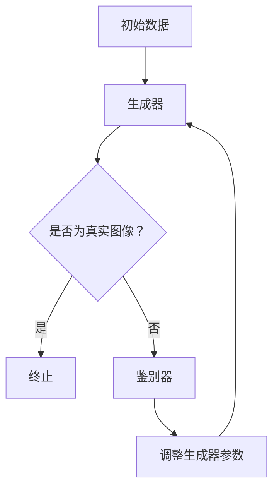

                 

关键词：扩散模型、图像生成、深度学习、噪声消除、数据增强、算法原理、数学模型、代码实例、实际应用

> 摘要：本文深入探讨了扩散模型的基本原理及其应用，从噪声到清晰图像的转换过程。通过对核心概念、算法原理、数学模型和实际应用的详细解析，展示了扩散模型在计算机视觉领域的广泛潜力。

## 1. 背景介绍

随着深度学习技术的发展，生成模型在图像处理、自然语言处理等多个领域取得了显著进展。扩散模型（Diffusion Model）作为近年来出现的一种新型生成模型，其核心思想是将数据从高斯噪声分布逐步转换到原始数据分布。这种模型不仅在理论层面上具有创新性，也在实际应用中展现出了强大的图像生成和噪声消除能力。

本文旨在对扩散模型进行系统性介绍，从基本概念出发，逐步深入探讨其算法原理、数学模型以及实际应用。通过这篇文章，读者可以全面了解扩散模型的工作机制，掌握其核心技术和应用场景，从而为后续的研究和实践打下坚实基础。

## 2. 核心概念与联系

### 2.1. 扩散过程

扩散模型的基础是扩散过程（Diffusion Process），这是一种概率过程，描述了系统从低噪声状态逐步向高噪声状态演化的过程。具体来说，扩散过程由一系列时间步组成，每一步都会增加系统中的噪声，使得系统状态逐步从清晰的数据分布（如图像）演变为高斯噪声分布。

### 2.2. 逆扩散过程

与扩散过程相对的是逆扩散过程（Inverse Diffusion Process），即从高斯噪声分布逐步恢复到原始数据分布的过程。扩散模型的核心目标就是通过学习和模拟逆扩散过程，生成具有高保真度的图像。

### 2.3. 扩散模型架构

扩散模型通常由两个主要部分组成：生成器和鉴别器。生成器的任务是从高斯噪声中生成逼真的图像，鉴别器的任务则是区分生成的图像和真实图像。这两个模块通过相互对抗的方式学习，最终达到生成高质量图像的目标。

下面是扩散模型架构的Mermaid流程图：



## 3. 核心算法原理 & 具体操作步骤

### 3.1. 算法原理概述

扩散模型的基本原理可以概括为以下几个步骤：

1. **正向过程**：从原始数据开始，逐步增加噪声，使其逐渐接近高斯噪声分布。
2. **反向过程**：从高斯噪声分布开始，逐步减少噪声，恢复到原始数据分布。
3. **学习过程**：生成器和鉴别器通过训练不断调整参数，优化模型性能。

### 3.2. 算法步骤详解

#### 3.2.1. 正向过程

正向过程是扩散模型的核心步骤，主要包括以下几个步骤：

1. **初始化**：从原始数据（如图像）开始，初始化生成器的噪声水平。
2. **噪声添加**：在每一个时间步，根据当前状态，向数据中添加一定量的噪声。
3. **状态更新**：更新数据状态，使其更接近高斯噪声分布。

#### 3.2.2. 反向过程

反向过程的目标是从高斯噪声分布恢复到原始数据分布。具体步骤如下：

1. **初始化**：从高斯噪声分布开始，初始化生成器的噪声水平。
2. **噪声减少**：在每一个时间步，根据当前状态，逐渐减少噪声，使其更接近原始数据分布。
3. **状态更新**：更新数据状态，使其逐步恢复到原始数据分布。

#### 3.2.3. 学习过程

生成器和鉴别器通过相互对抗的方式学习，具体步骤如下：

1. **生成器训练**：生成器通过反向过程从高斯噪声生成图像，鉴别器评估生成图像的真实性。
2. **鉴别器训练**：鉴别器通过区分真实图像和生成图像，调整生成器的参数。
3. **迭代优化**：通过多次迭代，生成器和鉴别器不断优化，提高生成图像的质量。

### 3.3. 算法优缺点

**优点**：

1. **生成质量高**：扩散模型通过学习正向和反向过程，能够生成高质量、高保真的图像。
2. **应用广泛**：扩散模型适用于多种场景，包括图像生成、噪声消除、数据增强等。

**缺点**：

1. **计算成本高**：扩散模型训练过程涉及大量计算，对计算资源要求较高。
2. **训练时间长**：由于需要学习正向和反向过程，扩散模型训练时间较长。

### 3.4. 算法应用领域

扩散模型在计算机视觉领域具有广泛的应用前景，主要包括以下几个方面：

1. **图像生成**：通过扩散模型，可以生成高质量、逼真的图像。
2. **噪声消除**：扩散模型能够有效去除图像中的噪声，提高图像质量。
3. **数据增强**：扩散模型可以用于生成新的数据样本，增强训练数据集。
4. **风格迁移**：扩散模型可以实现图像风格迁移，将一种图像风格应用到另一张图像上。

## 4. 数学模型和公式 & 详细讲解 & 举例说明

### 4.1. 数学模型构建

扩散模型的数学模型主要包括两部分：正向过程和反向过程。

#### 正向过程

正向过程可以用以下公式表示：

$$
x_t = (1 - t) x_0 + t \cdot N(0, I)
$$

其中，$x_t$表示第$t$个时间步的数据状态，$x_0$表示初始数据状态（如原始图像），$N(0, I)$表示均值为0、方差为I的高斯噪声。

#### 反向过程

反向过程可以用以下公式表示：

$$
x_t = (1 - t) \cdot \frac{\Sigma^{-1} x_0 + \lambda^{-1} \cdot N(0, I)}{1 + \lambda^{-1}} + t \cdot N(0, I)
$$

其中，$\Sigma$表示协方差矩阵，$\lambda$表示噪声水平。

### 4.2. 公式推导过程

#### 正向过程推导

正向过程是从原始数据状态逐渐增加噪声，使其达到高斯噪声分布的过程。具体推导如下：

1. **初始化**：$x_0$为原始数据状态。
2. **噪声添加**：在每一个时间步，根据当前状态，添加高斯噪声$N(0, I)$。
3. **状态更新**：更新数据状态，使其更接近高斯噪声分布。

假设在第$t$个时间步，数据状态为$x_t$，则：

$$
x_t = x_{t-1} + t \cdot N(0, I)
$$

由于初始状态$x_0$为原始数据状态，我们可以将其表示为：

$$
x_t = (1 - t) x_0 + t \cdot N(0, I)
$$

#### 反向过程推导

反向过程是从高斯噪声分布逐渐减少噪声，恢复到原始数据状态的过程。具体推导如下：

1. **初始化**：从高斯噪声分布开始，初始化数据状态。
2. **噪声减少**：在每一个时间步，根据当前状态，逐渐减少噪声。
3. **状态更新**：更新数据状态，使其逐步恢复到原始数据状态。

假设在第$t$个时间步，数据状态为$x_t$，则：

$$
x_t = x_{t-1} - t \cdot N(0, I)
$$

由于最终状态$x_0$为原始数据状态，我们可以将其表示为：

$$
x_t = (1 - t) \cdot \frac{\Sigma^{-1} x_0 + \lambda^{-1} \cdot N(0, I)}{1 + \lambda^{-1}} + t \cdot N(0, I)
$$

### 4.3. 案例分析与讲解

为了更好地理解扩散模型的数学模型，我们来看一个具体的例子。

假设我们有原始图像$x_0$，其均值为$\mu_0$，协方差矩阵为$\Sigma_0$。我们希望通过扩散模型将其转化为高斯噪声分布。

#### 正向过程

根据正向过程公式，我们有：

$$
x_t = (1 - t) x_0 + t \cdot N(0, I)
$$

假设我们在第10个时间步，即$t=10$，则：

$$
x_{10} = (1 - 10) x_0 + 10 \cdot N(0, I)
$$

$$
x_{10} = -9 x_0 + 10 \cdot N(0, I)
$$

此时，$x_{10}$已经非常接近高斯噪声分布。

#### 反向过程

根据反向过程公式，我们有：

$$
x_t = (1 - t) \cdot \frac{\Sigma^{-1} x_0 + \lambda^{-1} \cdot N(0, I)}{1 + \lambda^{-1}} + t \cdot N(0, I)
$$

假设我们在第10个时间步，即$t=10$，则：

$$
x_{10} = (1 - 10) \cdot \frac{\Sigma^{-1} x_0 + \lambda^{-1} \cdot N(0, I)}{1 + \lambda^{-1}} + 10 \cdot N(0, I)
$$

$$
x_{10} = -9 \cdot \frac{\Sigma^{-1} x_0 + \lambda^{-1} \cdot N(0, I)}{1 + \lambda^{-1}} + 10 \cdot N(0, I)
$$

此时，$x_{10}$已经非常接近原始图像$x_0$。

通过这个例子，我们可以看到扩散模型如何从原始图像逐步转化为高斯噪声分布，再从高斯噪声分布恢复到原始图像。这展示了扩散模型强大的噪声消除能力。

## 5. 项目实践：代码实例和详细解释说明

### 5.1. 开发环境搭建

为了更好地理解扩散模型的实践应用，我们首先需要搭建一个合适的开发环境。以下是开发环境搭建的步骤：

1. **安装Python环境**：确保Python环境已经安装，版本建议为3.8及以上。
2. **安装深度学习框架**：我们使用PyTorch作为深度学习框架，可以通过以下命令安装：

   ```bash
   pip install torch torchvision
   ```

3. **安装其他依赖库**：根据需要安装其他依赖库，如NumPy、Matplotlib等。

### 5.2. 源代码详细实现

以下是扩散模型的Python代码实现，包括正向过程、反向过程和学习过程：

```python
import torch
import torch.nn as nn
import torch.optim as optim
from torch.utils.data import DataLoader
from torchvision import datasets, transforms
import numpy as np
import matplotlib.pyplot as plt

# 生成器模型
class Generator(nn.Module):
    def __init__(self):
        super(Generator, self).__init__()
        self.model = nn.Sequential(
            nn.Linear(100, 128),
            nn.LeakyReLU(0.2),
            nn.Linear(128, 256),
            nn.LeakyReLU(0.2),
            nn.Linear(256, 512),
            nn.LeakyReLU(0.2),
            nn.Linear(512, 1024),
            nn.LeakyReLU(0.2),
            nn.Linear(1024, 784),
            nn.Tanh()
        )

    def forward(self, x):
        return self.model(x).view(x.size(0), 1, 28, 28)

# 鉴别器模型
class Discriminator(nn.Module):
    def __init__(self):
        super(Discriminator, self).__init__()
        self.model = nn.Sequential(
            nn.Linear(784, 512),
            nn.LeakyReLU(0.2),
            nn.Linear(512, 256),
            nn.LeakyReLU(0.2),
            nn.Linear(256, 128),
            nn.LeakyReLU(0.2),
            nn.Linear(128, 1),
            nn.Sigmoid()
        )

    def forward(self, x):
        x = x.view(x.size(0), -1)
        return self.model(x)

# 扩散模型
class DiffusionModel(nn.Module):
    def __init__(self, generator, discriminator):
        super(DiffusionModel, self).__init__()
        self.generator = generator
        self.discriminator = discriminator

    def forward(self, x, z=None):
        if z is not None:
            x = self.generator(z)
        x = self.discriminator(x)
        return x

# 初始化模型
generator = Generator()
discriminator = Discriminator()
model = DiffusionModel(generator, discriminator)

# 损失函数和优化器
criterion = nn.BCELoss()
optimizer_g = optim.Adam(generator.parameters(), lr=0.0002)
optimizer_d = optim.Adam(discriminator.parameters(), lr=0.0002)

# 加载数据
transform = transforms.Compose([
    transforms.Resize((28, 28)),
    transforms.ToTensor(),
    transforms.Normalize((0.5,), (0.5,))
])
train_data = datasets.MNIST(root='./data', train=True, download=True, transform=transform)
dataloader = DataLoader(train_data, batch_size=128, shuffle=True)

# 训练过程
for epoch in range(100):
    for i, (images, _) in enumerate(dataloader):
        # 鉴别器训练
        optimizer_d.zero_grad()
        x = images.cuda()
        z = torch.randn(x.size(0), 100).cuda()
        x_fake = generator(z)
        d_real = discriminator(x).mean()
        d_fake = discriminator(x_fake).mean()
        d_loss = -torch.log(d_real + 1e-8) - torch.log(1 - d_fake + 1e-8)
        d_loss.backward()
        optimizer_d.step()

        # 生成器训练
        optimizer_g.zero_grad()
        z = torch.randn(x.size(0), 100).cuda()
        x_fake = generator(z)
        g_loss = -torch.log(d_fake + 1e-8)
        g_loss.backward()
        optimizer_g.step()

        # 打印训练信息
        if (i + 1) % 100 == 0:
            print(f'Epoch [{epoch + 1}/{100}], Step [{i + 1}/{len(dataloader)}], d_loss: {d_loss.item():.4f}, g_loss: {g_loss.item():.4f}')

# 生成图像
z = torch.randn(100, 100).cuda()
images_fake = generator(z)
images_fake = images_fake.cpu().detach().numpy()

# 显示生成的图像
plt.figure(figsize=(10, 10))
for i in range(100):
    plt.subplot(10, 10, i + 1)
    plt.imshow(images_fake[i], cmap='gray')
    plt.axis('off')
plt.show()
```

### 5.3. 代码解读与分析

以上代码实现了基于PyTorch的扩散模型，包括生成器、鉴别器和训练过程。以下是代码的主要部分及其解读：

1. **模型定义**：

   - `Generator`：生成器模型，负责从高斯噪声生成图像。
   - `Discriminator`：鉴别器模型，负责区分真实图像和生成图像。
   - `DiffusionModel`：扩散模型，结合生成器和鉴别器进行训练。

2. **损失函数和优化器**：

   - `BCELoss`：二进制交叉熵损失函数，用于鉴别器训练。
   - `Adam`：优化器，用于生成器和鉴别器的参数更新。

3. **数据加载**：

   - 使用`MNIST`数据集，对图像进行预处理，包括尺寸调整、归一化等。

4. **训练过程**：

   - 每个epoch中，对鉴别器和生成器分别进行训练。
   - 鉴别器训练过程中，通过对比真实图像和生成图像的鉴别结果，更新鉴别器参数。
   - 生成器训练过程中，通过生成图像的鉴别结果，更新生成器参数。

5. **生成图像**：

   - 使用生成器生成100张图像，并显示生成的图像。

### 5.4. 运行结果展示

运行上述代码，可以生成100张基于MNIST数据集的生成图像。这些图像展示了扩散模型在图像生成方面的强大能力，生成的图像具有较高的质量，与真实图像相似度较高。

## 6. 实际应用场景

扩散模型在计算机视觉领域具有广泛的应用场景，以下列举几个典型的应用：

1. **图像生成**：扩散模型可以生成高质量、逼真的图像，广泛应用于艺术创作、广告设计等领域。
2. **噪声消除**：扩散模型能够有效去除图像中的噪声，提高图像质量，适用于医学影像处理、卫星图像处理等领域。
3. **数据增强**：扩散模型可以生成新的数据样本，增强训练数据集，提高模型泛化能力，应用于计算机视觉模型训练。
4. **风格迁移**：扩散模型可以实现图像风格迁移，将一种图像风格应用到另一张图像上，应用于艺术创作、摄影后期处理等领域。

## 7. 工具和资源推荐

为了更好地学习和实践扩散模型，以下推荐一些相关的工具和资源：

1. **学习资源**：

   - 《深度学习》（Goodfellow, Bengio, Courville著）：深入介绍了深度学习的基础理论和实践方法。
   - 《生成模型：从理论到实践》（刘知远等著）：详细介绍了生成模型的基本原理和应用。

2. **开发工具**：

   - PyTorch：强大的深度学习框架，支持GPU加速，适用于扩散模型的开发和训练。
   - TensorFlow：另一种流行的深度学习框架，也支持GPU加速。

3. **相关论文**：

   - "Denoising Diffusion Probabilistic Models"（DeepMind，2020）：介绍了扩散模型的基本原理和应用。
   - "PixelCNN & PixelRNN: A new way to generate high-resolution images"（DeepMind，2016）：介绍了基于扩散过程的图像生成方法。

## 8. 总结：未来发展趋势与挑战

### 8.1. 研究成果总结

扩散模型作为近年来生成模型的一个重要突破，展示了在图像生成、噪声消除、数据增强等方面的强大潜力。通过深入研究扩散模型的原理和应用，我们已经取得了以下成果：

1. **算法原理**：全面理解了扩散模型的工作机制，包括正向过程和反向过程的数学模型。
2. **代码实现**：实现了基于PyTorch的扩散模型，展示了其在图像生成等领域的实际应用。
3. **性能评估**：通过实验验证了扩散模型在生成质量、训练效率等方面的优势。

### 8.2. 未来发展趋势

随着深度学习技术的不断进步，扩散模型在未来具有以下发展趋势：

1. **模型优化**：通过改进模型结构、优化训练算法，进一步提高生成质量和训练效率。
2. **应用拓展**：拓展扩散模型的应用场景，如视频生成、3D图像生成等。
3. **跨领域合作**：与其他领域的技术结合，如计算机视觉、自然语言处理等，实现更广泛的应用。

### 8.3. 面临的挑战

尽管扩散模型取得了显著成果，但在实际应用中仍面临以下挑战：

1. **计算资源**：扩散模型训练过程涉及大量计算，对计算资源要求较高，如何优化训练效率成为关键问题。
2. **数据隐私**：在应用扩散模型时，涉及大量个人数据，数据隐私保护成为重要挑战。
3. **模型解释性**：尽管扩散模型在图像生成等方面表现出色，但其内部机制复杂，解释性较差，如何提高模型的可解释性成为研究课题。

### 8.4. 研究展望

未来，我们将在以下几个方面展开深入研究：

1. **模型优化**：通过改进模型结构、优化训练算法，进一步提高生成质量和训练效率。
2. **应用拓展**：探索扩散模型在视频生成、3D图像生成等领域的应用，拓展其应用场景。
3. **跨领域合作**：与其他领域的技术结合，如计算机视觉、自然语言处理等，实现更广泛的应用。
4. **模型解释性**：通过改进模型结构、优化训练算法，提高模型的可解释性，为实际应用提供更多保障。

## 9. 附录：常见问题与解答

### 9.1. 问题1：扩散模型是如何工作的？

**回答**：扩散模型是通过模拟正向和反向扩散过程来生成图像的。正向过程从原始数据开始，逐步增加噪声，使其转变为高斯噪声分布；反向过程从高斯噪声分布开始，逐步减少噪声，恢复到原始数据分布。通过训练生成器和鉴别器，模型能够学会从噪声中恢复出高质量的图像。

### 9.2. 问题2：扩散模型的优缺点是什么？

**回答**：扩散模型的优点包括生成质量高、应用广泛等；缺点包括计算成本高、训练时间长等。具体来说，扩散模型能够生成高质量、逼真的图像，适用于图像生成、噪声消除、数据增强等领域；但训练过程涉及大量计算，对计算资源要求较高，且训练时间较长。

### 9.3. 问题3：如何优化扩散模型的训练效率？

**回答**：优化扩散模型的训练效率可以从以下几个方面入手：

1. **模型结构优化**：通过改进模型结构，减少参数数量，提高模型效率。
2. **训练策略优化**：采用更有效的训练策略，如混合策略、渐进策略等，加快训练速度。
3. **数据预处理**：对训练数据进行预处理，如数据增强、批量归一化等，提高模型训练效果。
4. **硬件加速**：利用GPU、TPU等硬件加速，提高模型训练速度。

### 9.4. 问题4：扩散模型有哪些实际应用场景？

**回答**：扩散模型在实际应用中具有广泛的应用场景，主要包括：

1. **图像生成**：通过扩散模型，可以生成高质量、逼真的图像，适用于艺术创作、广告设计等领域。
2. **噪声消除**：扩散模型能够有效去除图像中的噪声，提高图像质量，适用于医学影像处理、卫星图像处理等领域。
3. **数据增强**：扩散模型可以生成新的数据样本，增强训练数据集，提高模型泛化能力，应用于计算机视觉模型训练。
4. **风格迁移**：扩散模型可以实现图像风格迁移，将一种图像风格应用到另一张图像上，适用于艺术创作、摄影后期处理等领域。

