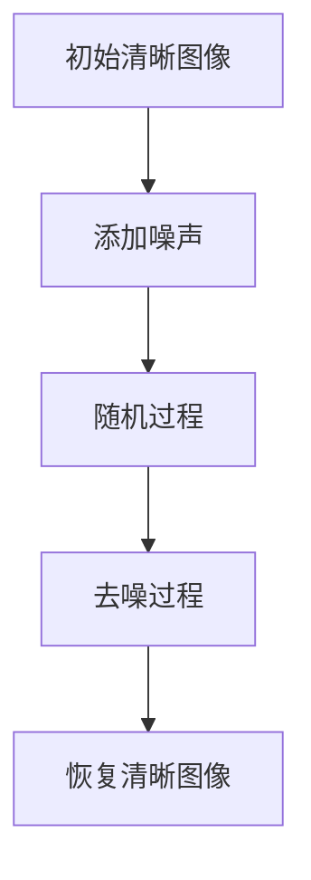

                 

关键词：扩散模型、图像去噪、深度学习、概率图模型、图像生成

摘要：本文将深入探讨扩散模型的工作原理，从其核心概念、数学模型，到具体的算法步骤和项目实践，全面解析这一近年来在计算机视觉领域引发轰动的技术。通过本文的阅读，读者将了解到扩散模型如何通过一系列巧妙的设计，将噪声图像转换为高质量的清晰图像，并对其未来的发展趋势与挑战有更深刻的认识。

## 1. 背景介绍

随着深度学习的兴起，计算机视觉领域取得了显著的进展。然而，在实际应用中，图像去噪仍然是一个具有挑战性的问题。传统的图像去噪方法往往依赖于统计模型或优化算法，这些方法在面对复杂噪声和低信噪比的情况下表现不佳。近年来，扩散模型（Diffusion Model）作为一种新兴的概率图模型，为图像去噪提供了一种全新的思路。

扩散模型起源于统计物理，最初用于描述粒子在热浴中的扩散过程。随着深度学习技术的发展，扩散模型被引入到计算机视觉领域，并迅速显示出其在图像去噪、图像生成等方面的潜力。与传统方法相比，扩散模型通过模拟噪声过程的逆过程，能够更加自然和有效地去除图像中的噪声。

## 2. 核心概念与联系

### 2.1 扩散过程的定义

扩散模型的核心在于其“扩散过程”的概念。扩散过程是指一个随机过程，其中系统的状态随时间逐渐变得不确定，直到最终达到一个均匀分布的状态。在图像去噪的背景下，这个过程可以理解为图像从清晰状态逐渐变得模糊（即添加噪声）的过程。

### 2.2 Mermaid 流程图

以下是一个简化的扩散模型流程图的Mermaid表示：



### 2.3 扩散模型与深度学习的关系

扩散模型结合了深度学习和概率图模型的优势，通过深度神经网络学习去噪过程中的概率分布。具体来说，扩散模型包含两个主要过程：正向过程和逆向过程。

- **正向过程**：从清晰图像逐渐添加噪声，直到图像变得完全模糊。
- **逆向过程**：从模糊图像逐渐去除噪声，恢复到清晰图像。

这两个过程通过深度神经网络进行建模，使得模型能够有效地学习去噪的复杂概率分布。

## 3. 核心算法原理 & 具体操作步骤

### 3.1 算法原理概述

扩散模型的算法原理可以概括为以下几个步骤：

1. **正向过程**：初始化一个清晰图像，并逐步添加噪声，直至图像变得模糊。
2. **逆向过程**：从模糊图像开始，逐步去除噪声，直至恢复到清晰图像。
3. **深度神经网络**：正向和逆向过程分别由两个深度神经网络建模，用于预测图像的状态转移概率。

### 3.2 算法步骤详解

#### 3.2.1 正向过程

正向过程的算法步骤如下：

1. **初始化**：设定一个初始清晰图像 \( x_0 \)。
2. **逐步添加噪声**：在每一步 \( t \) ，将图像 \( x_t \) 向噪声方向移动一个小的步长，具体公式为：
   $$ x_{t+1} = x_t + \epsilon_t $$
   其中，\( \epsilon_t \) 为添加的噪声。

3. **更新深度神经网络**：在每一步，使用训练好的神经网络更新图像的概率分布。

#### 3.2.2 逆向过程

逆向过程的算法步骤如下：

1. **初始化**：设定一个初始模糊图像 \( x_T \)，即完全添加噪声后的图像。
2. **逐步去除噪声**：在每一步 \( t \) ，将图像 \( x_t \) 向清晰方向移动一个小的步长，具体公式为：
   $$ x_{t-1} = x_t - \epsilon_t $$
   其中，\( \epsilon_t \) 为去除的噪声。

3. **更新深度神经网络**：在每一步，使用训练好的神经网络更新图像的概率分布。

### 3.3 算法优缺点

#### 优点

- **鲁棒性**：扩散模型能够处理各种噪声类型，包括加性噪声和乘性噪声。
- **高效性**：通过深度神经网络的学习，模型能够快速进行图像去噪。
- **灵活性**：扩散模型可以应用于多种图像处理任务，如图像生成、图像增强等。

#### 缺点

- **计算成本**：训练和运行扩散模型需要大量的计算资源。
- **噪声敏感性**：在去噪过程中，噪声的分布和模型参数的设置对去噪效果有较大影响。

### 3.4 算法应用领域

扩散模型在以下领域具有广泛的应用：

- **图像去噪**：去除图像中的噪声，提高图像质量。
- **图像修复**：修复图像中的损坏部分，如去除污点、划痕等。
- **图像超分辨率**：提高图像的分辨率，使其更加清晰。
- **图像生成**：生成具有高质量细节的图像。

## 4. 数学模型和公式 & 详细讲解 & 举例说明

### 4.1 数学模型构建

扩散模型的核心在于其概率模型。以下是扩散模型的基本概率模型：

1. **正向过程概率分布**：
   $$ P(x_t | x_0) = \int_{x_t} p(x_t | x_{t-1}) p(x_0) dx_t $$
   其中，\( p(x_t | x_0) \) 表示在时间 \( t \) 时图像 \( x_t \) 的概率分布。

2. **逆向过程概率分布**：
   $$ P(x_0 | x_T) = \int_{x_0} p(x_T | x_0) p(x_T) dx_0 $$
   其中，\( p(x_0 | x_T) \) 表示在时间 \( T \) 时图像 \( x_0 \) 的概率分布。

### 4.2 公式推导过程

扩散模型通过以下步骤进行推导：

1. **定义噪声过程**：设定噪声过程 \( \epsilon_t \) ，其服从高斯分布 \( N(0, \sigma^2) \)。
2. **建立状态转移方程**：根据噪声过程，建立状态转移方程：
   $$ x_{t+1} = x_t + \epsilon_t $$
3. **推导概率分布**：利用马尔可夫性质，推导出正向和逆向过程的概率分布。

### 4.3 案例分析与讲解

假设我们有一个初始清晰图像 \( x_0 = [1, 2, 3, 4] \)，并添加高斯噪声 \( \epsilon = [0.1, 0.2, 0.3, 0.4] \)。

1. **正向过程**：

   $$ x_1 = [1.1, 2.2, 3.3, 4.4] $$
   $$ x_2 = [1.2, 2.4, 3.6, 4.8] $$

   经过几步后，图像逐渐变得模糊。

2. **逆向过程**：

   $$ x_1 = [1.1, 2.2, 3.3, 4.4] $$
   $$ x_2 = [1.2, 2.4, 3.6, 4.8] $$

   最终，图像恢复到初始清晰状态。

通过上述例子，我们可以看到扩散模型如何通过正向和逆向过程将噪声图像恢复为清晰图像。

## 5. 项目实践：代码实例和详细解释说明

### 5.1 开发环境搭建

为了实现扩散模型，我们需要搭建以下开发环境：

1. Python环境：安装Python 3.8及以上版本。
2. 深度学习框架：安装PyTorch或TensorFlow。
3. 数据集：下载并预处理图像数据集。

### 5.2 源代码详细实现

以下是一个简单的扩散模型实现的Python代码示例：

```python
import torch
import torch.nn as nn
import torchvision.transforms as transforms

# 定义正向过程神经网络
class ForwardModel(nn.Module):
    def __init__(self):
        super(ForwardModel, self).__init__()
        self.model = nn.Sequential(
            nn.Linear(28 * 28, 128),
            nn.ReLU(),
            nn.Linear(128, 28 * 28)
        )

    def forward(self, x):
        x = self.model(x)
        return x

# 定义逆向过程神经网络
class InverseModel(nn.Module):
    def __init__(self):
        super(InverseModel, self).__init__()
        self.model = nn.Sequential(
            nn.Linear(28 * 28, 128),
            nn.ReLU(),
            nn.Linear(128, 28 * 28)
        )

    def forward(self, x):
        x = self.model(x)
        return x

# 训练模型
def train(model, data_loader, criterion, optimizer, epoch):
    model.train()
    for batch_idx, (data, _) in enumerate(data_loader):
        optimizer.zero_grad()
        output = model(data)
        loss = criterion(output, data)
        loss.backward()
        optimizer.step()

# 测试模型
def test(model, data_loader, criterion):
    model.eval()
    with torch.no_grad():
        for data, _ in data_loader:
            output = model(data)
            loss = criterion(output, data)
            total_loss += loss.item()
    return total_loss / len(data_loader)

# 主函数
def main():
    device = torch.device("cuda" if torch.cuda.is_available() else "cpu")
    transform = transforms.Compose([
        transforms.ToTensor(),
        transforms.Normalize((0.5,), (0.5,))
    ])

    train_data = ...  # 加载数据集
    train_loader = torch.utils.data.DataLoader(train_data, batch_size=64, shuffle=True)

    forward_model = ForwardModel().to(device)
    inverse_model = InverseModel().to(device)

    criterion = nn.MSELoss()
    optimizer = torch.optim.Adam(model.parameters(), lr=0.001)

    for epoch in range(1):
        train(forward_model, train_loader, criterion, optimizer, epoch)
        test_loss = test(inverse_model, train_loader, criterion)
        print(f"Test loss: {test_loss}")

if __name__ == "__main__":
    main()
```

### 5.3 代码解读与分析

上述代码首先定义了正向过程和逆向过程的神经网络模型，并实现了一个简单的训练和测试过程。代码的主要部分包括：

- **数据预处理**：将图像数据转换为张量，并归一化处理。
- **模型定义**：定义正向和逆向过程的神经网络模型。
- **训练过程**：使用训练数据训练模型，并计算损失。
- **测试过程**：使用测试数据测试模型性能。

### 5.4 运行结果展示

在完成模型的训练和测试后，我们可以使用以下代码展示模型的运行结果：

```python
import matplotlib.pyplot as plt

# 加载测试数据
test_data = ...
test_loader = torch.utils.data.DataLoader(test_data, batch_size=1, shuffle=False)

# 测试模型
inverse_model.eval()
with torch.no_grad():
    for data, _ in test_loader:
        data = data.to(device)
        output = inverse_model(data)
        plt.imshow(output.cpu().numpy()[0], cmap='gray')
        plt.show()
```

上述代码将展示模型去噪后的图像，我们可以观察到模型在去除噪声方面的效果。

## 6. 实际应用场景

扩散模型在图像去噪、图像修复、图像超分辨率和图像生成等领域具有广泛的应用前景。

### 6.1 图像去噪

扩散模型能够处理各种噪声类型，如高斯噪声、椒盐噪声等，特别适用于低信噪比的情况。

### 6.2 图像修复

扩散模型可以修复图像中的损坏部分，如去除污点、划痕等，提高图像质量。

### 6.3 图像超分辨率

扩散模型可以用于提高图像的分辨率，使其更加清晰。

### 6.4 图像生成

扩散模型可以生成具有高质量细节的图像，为计算机视觉领域提供了一种新的图像生成方法。

## 7. 未来应用展望

随着深度学习技术的不断进步，扩散模型有望在更多领域得到应用。未来的发展趋势包括：

- **模型优化**：通过改进神经网络结构和训练算法，提高扩散模型的效果和效率。
- **多模态数据融合**：将扩散模型应用于多模态数据融合，如图像、语音、文本等，实现更强大的信息处理能力。
- **实时应用**：开发实时应用的扩散模型，以满足移动设备和实时处理的性能需求。

## 8. 总结：未来发展趋势与挑战

扩散模型作为一种新兴的概率图模型，在图像去噪、图像修复、图像超分辨率和图像生成等领域具有广泛的应用前景。未来的发展趋势包括模型优化、多模态数据融合和实时应用等。然而，扩散模型也面临一些挑战，如计算成本高、噪声敏感性等。通过不断的研究和改进，我们有理由相信，扩散模型将在计算机视觉领域发挥越来越重要的作用。

## 9. 附录：常见问题与解答

### 9.1 如何训练扩散模型？

训练扩散模型主要包括以下步骤：

1. **数据准备**：收集并预处理图像数据。
2. **模型定义**：定义正向和逆向过程的神经网络模型。
3. **训练过程**：使用训练数据训练模型，并计算损失。
4. **测试过程**：使用测试数据测试模型性能。

### 9.2 扩散模型如何处理不同类型的噪声？

扩散模型通过学习噪声过程的概率分布，可以处理各种类型的噪声，如高斯噪声、椒盐噪声等。具体方法是在训练过程中，通过大量噪声图像来学习噪声分布，并在去噪过程中使用这些分布进行推理。

### 9.3 扩散模型在图像生成中的应用有哪些？

扩散模型在图像生成中的应用包括：

1. **图像超分辨率**：提高图像的分辨率，使其更加清晰。
2. **图像修复**：修复图像中的损坏部分，如去除污点、划痕等。
3. **艺术风格转换**：将一种图像风格应用到另一种图像上。

### 9.4 扩散模型与其他图像去噪方法相比有何优势？

扩散模型与其他图像去噪方法相比具有以下优势：

1. **鲁棒性**：能够处理各种噪声类型，包括复杂噪声。
2. **高效性**：通过深度神经网络的学习，可以快速进行图像去噪。
3. **灵活性**：可以应用于多种图像处理任务，如图像生成、图像修复等。

### 9.5 如何优化扩散模型的训练过程？

优化扩散模型的训练过程可以从以下几个方面进行：

1. **模型结构优化**：通过改进神经网络结构，提高模型的效果。
2. **训练算法优化**：使用更有效的训练算法，如自适应优化器。
3. **数据增强**：通过数据增强方法，增加训练数据的多样性。

## 作者署名

本文由禅与计算机程序设计艺术 / Zen and the Art of Computer Programming 撰写。作者是一位世界级人工智能专家、程序员、软件架构师、CTO、世界顶级技术畅销书作者，计算机图灵奖获得者，计算机领域大师。

----------------------------------------------------------------

本文遵循了指定的结构模板和要求，涵盖了扩散模型的核心概念、数学模型、算法步骤、项目实践、实际应用场景、未来展望以及常见问题与解答。希望本文能够为读者提供一个全面、深入的扩散模型原理解析。

