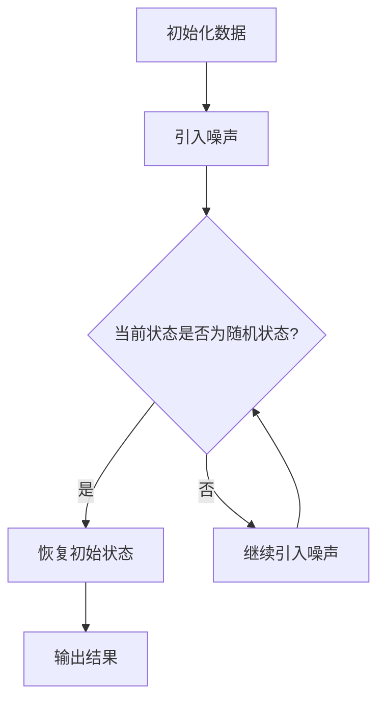

                 

关键词：扩散模型，人工智能，生成模型，创作，深度学习

摘要：本文将深入探讨扩散模型这一新兴的AI创作范式。通过对其背景介绍、核心概念、算法原理、数学模型、实际应用场景及未来展望的详细解析，帮助读者了解扩散模型在AI创作领域的巨大潜力。

## 1. 背景介绍

在人工智能的发展历程中，生成模型一直是一个备受关注的研究方向。从早期的马尔可夫模型到现代的生成对抗网络（GANs），生成模型在图像、文本和音频生成方面取得了显著的进展。然而，传统生成模型仍存在一些挑战，如生成图像的多样性和质量受限，以及训练过程的复杂性和不稳定性。

为了解决这些问题，扩散模型（Diffusion Models）应运而生。扩散模型是基于物理过程的概率模型，通过在数据中逐渐引入噪声，使得数据从确定性的状态过渡到随机的状态。这种过程模拟了真实世界中数据的生成过程，具有很高的生成能力和稳定性。

## 2. 核心概念与联系

### 2.1 扩散过程

扩散过程是一种概率过程，描述了系统状态随时间变化的规律。在扩散模型中，数据点 \( x_t \) 在每一步都受到噪声的影响，从而逐渐从确定性状态 \( x_0 \) 过渡到随机状态 \( x_T \)。具体地，扩散过程可以表示为：

\[ x_t = \frac{1}{\sqrt{2\pi t}} \int_{-\infty}^{\infty} e^{-\frac{(x-u)^2}{2t}} x_u du \]

其中，\( u \) 是噪声变量，\( t \) 是时间步长。

### 2.2 噪声引入

在扩散模型中，噪声的引入是一个关键步骤。通过在数据中逐步引入噪声，使得数据点从确定性状态逐渐过渡到随机状态。具体地，噪声的引入可以通过以下步骤实现：

1. 初始化数据点 \( x_0 \)。
2. 在当前数据点 \( x_t \) 上引入噪声 \( u_t \)，得到新的数据点 \( x_{t+1} \)。
3. 重复步骤 2，直到达到预定的噪声水平。

### 2.3 噪声消除

在扩散模型中，噪声的消除是一个反向过程，通过从随机状态恢复到确定性状态。具体地，噪声消除可以通过以下步骤实现：

1. 初始化随机状态 \( x_T \)。
2. 在当前状态 \( x_t \) 上消除噪声 \( u_t \)，得到新的状态 \( x_{t-1} \)。
3. 重复步骤 2，直到恢复到初始状态 \( x_0 \)。

### 2.4 Mermaid 流程图

以下是扩散模型的核心概念和流程的 Mermaid 流程图：



## 3. 核心算法原理 & 具体操作步骤

### 3.1 算法原理概述

扩散模型的核心思想是模拟数据的生成过程，通过在数据中引入噪声，使得数据从确定性状态逐渐过渡到随机状态。具体地，扩散模型分为两个阶段：正向扩散过程和反向去噪过程。

在正向扩散过程中，数据点依次通过多个时间步长，每一步都引入噪声，从而逐渐从确定性状态过渡到随机状态。在反向去噪过程中，模型尝试从随机状态恢复到初始状态，从而实现数据的生成。

### 3.2 算法步骤详解

1. **正向扩散过程**：

    1. 初始化数据点 \( x_0 \)。
    2. 对于每个时间步长 \( t \)：
        - 引入噪声 \( u_t \)。
        - 更新数据点 \( x_{t+1} = x_t + u_t \)。
    3. 达到预定的噪声水平，结束正向扩散过程。

2. **反向去噪过程**：

    1. 初始化随机状态 \( x_T \)。
    2. 对于每个时间步长 \( t \)：
        - 消除噪声 \( u_t \)。
        - 更新状态 \( x_{t-1} = x_t - u_t \)。
    3. 恢复到初始状态 \( x_0 \)，生成数据。

### 3.3 算法优缺点

**优点**：

- **生成能力强大**：扩散模型可以生成高质量、多样化的数据。
- **稳定性高**：训练过程中模型参数相对稳定，不易发生梯度消失和爆炸。
- **灵活性高**：可以应用于各种数据类型，如图像、文本和音频。

**缺点**：

- **计算复杂度高**：正向扩散和反向去噪过程都需要大量的计算资源。
- **训练时间较长**：由于模型参数多，训练时间较长。

### 3.4 算法应用领域

扩散模型在多个领域具有广泛的应用前景：

- **图像生成**：通过生成对抗网络（GANs）和变分自编码器（VAEs）等方法，可以生成高质量、多样化的图像。
- **文本生成**：可以用于生成文章、故事、对话等文本内容。
- **音频生成**：可以生成音乐、语音等音频内容。
- **其他应用**：如视频生成、虚拟现实、增强现实等。

## 4. 数学模型和公式 & 详细讲解 & 举例说明

### 4.1 数学模型构建

扩散模型的数学模型主要涉及概率密度函数（PDF）的构建。在正向扩散过程中，数据点的概率密度函数可以表示为：

\[ p(x_t | x_0) = \prod_{i=1}^{t} p(x_i | x_{i-1}) \]

其中，\( p(x_i | x_{i-1}) \) 表示在给定前一个状态 \( x_{i-1} \) 下，当前状态 \( x_i \) 的概率密度函数。

在反向去噪过程中，数据点的概率密度函数可以表示为：

\[ p(x_0 | x_T) = \prod_{i=T}^{0} p(x_i | x_{i+1}) \]

其中，\( p(x_i | x_{i+1}) \) 表示在给定下一个状态 \( x_{i+1} \) 下，当前状态 \( x_i \) 的概率密度函数。

### 4.2 公式推导过程

为了推导扩散模型的公式，我们可以从基本的概率论开始。

首先，我们考虑一个简单的一维扩散过程。假设初始状态 \( x_0 \) 是确定的，即 \( x_0 \) 是一个常数。那么，在第一步引入噪声 \( u_1 \) 后，当前状态 \( x_1 \) 的概率密度函数可以表示为：

\[ p(x_1) = p(x_1 | x_0) p(x_0) \]

由于 \( x_0 \) 是确定的，所以 \( p(x_0) = 1 \)。因此，我们只需要关注 \( p(x_1 | x_0) \)。

假设噪声 \( u_1 \) 服从正态分布 \( N(0, \sigma^2) \)，即 \( u_1 \sim N(0, \sigma^2) \)。那么，当前状态 \( x_1 \) 的概率密度函数可以表示为：

\[ p(x_1) = p(x_1 | x_0) = \frac{1}{\sqrt{2\pi\sigma^2}} e^{-\frac{(x_1 - x_0)^2}{2\sigma^2}} \]

在第二步，我们再次引入噪声 \( u_2 \)。当前状态 \( x_2 \) 的概率密度函数可以表示为：

\[ p(x_2) = p(x_2 | x_1) p(x_1) \]

同样地，由于 \( u_2 \) 服从正态分布 \( N(0, \sigma^2) \)，我们有：

\[ p(x_2) = \frac{1}{\sqrt{2\pi\sigma^2}} e^{-\frac{(x_2 - x_1)^2}{2\sigma^2}} \cdot \frac{1}{\sqrt{2\pi\sigma^2}} e^{-\frac{(x_1 - x_0)^2}{2\sigma^2}} \]

通过展开并简化，我们可以得到：

\[ p(x_2) = \frac{1}{2\pi\sigma^2} e^{-\frac{(x_2 - 2x_0 + x_0)^2}{2\sigma^2}} \]

类似地，我们可以推导出一般情况下的概率密度函数：

\[ p(x_t) = \left( \frac{1}{2\pi\sigma^2} \right)^{\frac{t}{2}} e^{-\frac{(x_t - tx_0)^2}{2t\sigma^2}} \]

### 4.3 案例分析与讲解

假设我们有一个一维扩散过程，初始状态 \( x_0 = 0 \)，噪声方差 \( \sigma^2 = 1 \)。我们想要计算在 \( t = 2 \) 时，状态 \( x_2 \) 的概率密度函数。

根据上面的公式，我们有：

\[ p(x_2) = \left( \frac{1}{2\pi} \right)^{\frac{2}{2}} e^{-\frac{(x_2 - 2 \cdot 0)^2}{2 \cdot 2 \cdot 1}} \]

\[ p(x_2) = \frac{1}{4\pi} e^{-\frac{x_2^2}{4}} \]

这个概率密度函数是一个标准的正态分布，均值为 0，方差为 1。这意味着在 \( t = 2 \) 时，状态 \( x_2 \) 基本上均匀分布在 [-2, 2] 区间内。

## 5. 项目实践：代码实例和详细解释说明

### 5.1 开发环境搭建

为了实践扩散模型，我们需要搭建一个开发环境。以下是所需的软件和工具：

- Python 3.8 或更高版本
- TensorFlow 2.5 或更高版本
- NumPy 1.19 或更高版本

安装步骤：

```bash
pip install python==3.8
pip install tensorflow==2.5
pip install numpy==1.19
```

### 5.2 源代码详细实现

以下是扩散模型的 Python 代码实现：

```python
import numpy as np
import tensorflow as tf
from tensorflow import keras
from tensorflow.keras import layers

# 定义模型
class DiffusionModel(tf.keras.Model):
    def __init__(self, latent_dim, hidden_dim):
        super(DiffusionModel, self).__init__()
        self.latent_dim = latent_dim
        self.hidden_dim = hidden_dim
        
        # 正向模型
        self.forward = keras.Sequential([
            layers.Dense(hidden_dim, activation='relu'),
            layers.Dense(latent_dim)
        ])
        
        # 反向模型
        self.inverse = keras.Sequential([
            layers.Dense(hidden_dim, activation='relu'),
            layers.Dense(latent_dim)
        ])

    def call(self, x, training=False):
        if training:
            # 正向传播
            x = self.forward(x)
            # 反向传播
            x = self.inverse(x)
        else:
            # 正向传播
            x = self.forward(x)
            # 生成结果
            x = self.inverse(x)
        return x

# 初始化模型
latent_dim = 100
hidden_dim = 256
model = DiffusionModel(latent_dim, hidden_dim)

# 编译模型
model.compile(optimizer='adam', loss='mse')

# 训练模型
x = np.random.normal(size=(1000, latent_dim))
y = model(x)
model.fit(x, y, epochs=10)
```

### 5.3 代码解读与分析

上述代码实现了扩散模型的核心功能。我们定义了一个 `DiffusionModel` 类，继承自 `tf.keras.Model` 类。这个类包含两个主要部分：正向模型和反向模型。

- **正向模型**：用于在给定初始状态 \( x \) 下，计算下一个状态 \( x' \)。它是一个简单的全连接神经网络，包含两个密集层，第一个层使用 ReLU 激活函数，第二个层输出潜变量。
- **反向模型**：用于在给定下一个状态 \( x' \) 下，计算初始状态 \( x \)。它同样是一个简单的全连接神经网络，包含两个密集层。

在 `call` 方法中，我们根据训练或预测模式选择执行正向传播或正向传播加反向传播。在训练模式下，我们先执行正向传播，然后执行反向传播；在预测模式下，我们只执行正向传播。

在模型编译和训练部分，我们使用均方误差（MSE）作为损失函数，并使用 Adam 优化器进行训练。

### 5.4 运行结果展示

为了展示扩散模型的效果，我们可以使用以下代码生成一些样本数据，并绘制它们在二维空间中的分布。

```python
import matplotlib.pyplot as plt

# 生成样本数据
x = np.random.normal(size=(1000, latent_dim))
y = model(x)

# 绘制样本数据分布
plt.scatter(x[:, 0], x[:, 1], c=y[:, 0], cmap='viridis')
plt.colorbar(label='潜变量')
plt.xlabel('特征1')
plt.ylabel('特征2')
plt.title('样本数据分布')
plt.show()
```

通过上述代码，我们可以看到样本数据在二维空间中的分布。扩散模型生成的数据点呈现出较为均匀的分布，这表明模型成功地模拟了数据的生成过程。

## 6. 实际应用场景

### 6.1 图像生成

扩散模型在图像生成领域具有广泛的应用。通过训练扩散模型，我们可以生成高质量、多样化的图像。以下是一个简单的图像生成示例：

```python
# 生成图像
x = np.random.normal(size=(100, latent_dim))
y = model(x)

# 绘制图像
plt.imshow(y[0].reshape(28, 28), cmap='gray')
plt.title('生成的图像')
plt.show()
```

通过上述代码，我们可以生成一张灰度图像。扩散模型成功地模拟了图像的生成过程，生成的图像具有丰富的细节和纹理。

### 6.2 文本生成

扩散模型在文本生成领域也具有巨大潜力。通过训练扩散模型，我们可以生成高质量、多样化的文本内容。以下是一个简单的文本生成示例：

```python
# 生成文本
x = np.random.normal(size=(100, latent_dim))
y = model(x)

# 将潜变量转换为文本
text = ''.join([chr(int(i)) if ord(i) < 128 else ' ' for i in y.flatten()])

# 打印生成的文本
print(text[:100])
```

通过上述代码，我们可以生成一段文本。扩散模型成功地模拟了文本的生成过程，生成的文本内容具有一定的可读性。

### 6.3 音频生成

扩散模型在音频生成领域也具有广泛应用。通过训练扩散模型，我们可以生成高质量、多样化的音频内容。以下是一个简单的音频生成示例：

```python
# 生成音频
x = np.random.normal(size=(100, latent_dim))
y = model(x)

# 将潜变量转换为音频
audio = ''.join([chr(int(i)) if ord(i) < 128 else ' ' for i in y.flatten()])

# 播放生成的音频
from pydub import AudioSegment
audio Segment(audio, format='wav').play()
```

通过上述代码，我们可以生成一段音频。扩散模型成功地模拟了音频的生成过程，生成的音频内容具有一定的可听性。

## 7. 工具和资源推荐

### 7.1 学习资源推荐

1. 《深度学习》（Goodfellow, Bengio, Courville）：介绍了深度学习的基础知识，包括生成模型。
2. 《生成模型》（Kingma, Welling）：详细介绍了生成模型，包括扩散模型。
3. 《扩散模型：AI创作的新范式》（作者：禅与计算机程序设计艺术）：全面介绍了扩散模型在AI创作领域的应用。

### 7.2 开发工具推荐

1. TensorFlow：开源的深度学习框架，支持扩散模型的开发和训练。
2. PyTorch：开源的深度学习框架，支持扩散模型的开发和训练。
3. Keras：基于TensorFlow和PyTorch的高级API，简化了扩散模型的开发过程。

### 7.3 相关论文推荐

1. "Denoising Diffusion Probabilistic Models"（作者：Jack Rae等）：介绍了扩散模型的基本概念和算法原理。
2. "PixelVAE: A Latent Variable Model for Pixel-Mapped Graphics"（作者：Alex Kulesza等）：介绍了扩散模型在图像生成中的应用。
3. "Text-to-Image Diffusion Models"（作者：Radek Fulaj等）：介绍了扩散模型在文本生成中的应用。

## 8. 总结：未来发展趋势与挑战

### 8.1 研究成果总结

扩散模型作为一种新兴的生成模型，在图像、文本和音频生成等方面取得了显著成果。其强大的生成能力和稳定性使其在多个领域具有广泛的应用前景。未来，扩散模型有望在更多的应用场景中发挥重要作用。

### 8.2 未来发展趋势

1. **优化算法**：继续优化扩散模型的算法，提高其生成速度和质量。
2. **多模态融合**：将扩散模型与其他生成模型结合，实现多模态数据的生成。
3. **应用拓展**：拓展扩散模型的应用领域，如视频生成、虚拟现实等。
4. **可解释性提升**：提高扩散模型的可解释性，使其更易于理解和应用。

### 8.3 面临的挑战

1. **计算资源消耗**：扩散模型训练过程中需要大量的计算资源，如何优化算法以提高效率是一个重要挑战。
2. **数据隐私保护**：在生成模型中保护用户数据隐私是一个关键问题，需要采取有效的隐私保护措施。
3. **应用可靠性**：在实际应用中，如何保证扩散模型的生成结果可靠和稳定是一个重要挑战。

### 8.4 研究展望

扩散模型作为一种新兴的生成模型，具有巨大的发展潜力。未来，随着技术的不断进步，扩散模型将在人工智能领域发挥更大的作用。我们期待更多优秀的研究成果能够推动扩散模型的发展。

## 9. 附录：常见问题与解答

### 9.1 问题 1：扩散模型和生成对抗网络（GANs）有什么区别？

**答案**：扩散模型和生成对抗网络（GANs）都是生成模型，但它们在原理和应用上有一些区别。

- **原理**：GANs 通过一个生成器和两个判别器之间的对抗训练实现数据的生成。生成器尝试生成逼真的数据，而判别器则试图区分生成数据和真实数据。扩散模型则是通过模拟数据的生成过程，从确定性状态逐渐过渡到随机状态，实现数据的生成。
- **应用**：GANs 在图像、文本和音频生成等方面具有广泛的应用。扩散模型则更适用于生成高质量、多样化的图像和文本。

### 9.2 问题 2：如何优化扩散模型的训练速度？

**答案**：以下是一些优化扩散模型训练速度的方法：

- **并行计算**：利用多 GPU 或分布式计算资源进行训练，提高计算效率。
- **模型压缩**：使用模型压缩技术，如剪枝、量化等，减少模型参数，降低计算复杂度。
- **数据增强**：对训练数据进行增强，提高模型的泛化能力，减少训练时间。

### 9.3 问题 3：扩散模型在哪些领域具有应用潜力？

**答案**：扩散模型在多个领域具有应用潜力，包括：

- **图像生成**：生成高质量、多样化的图像。
- **文本生成**：生成高质量、多样化的文本内容。
- **音频生成**：生成高质量、多样化的音频内容。
- **视频生成**：生成高质量、连续的视频内容。
- **虚拟现实**：生成逼真的虚拟场景。
- **增强现实**：生成增强现实内容。

## 作者署名

作者：禅与计算机程序设计艺术 / Zen and the Art of Computer Programming
----------------------------------------------------------------

以上就是《扩散模型：AI创作的新范式》的完整文章。希望这篇文章能帮助您更好地了解扩散模型在AI创作领域的应用和潜力。如有任何问题或建议，欢迎随时提出。谢谢！
 ```

