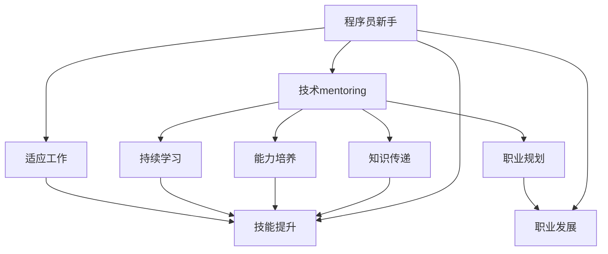

                 

关键词：技术mentoring、程序员成长、项目构建、编程教育、技能提升、职业发展

> 摘要：本文将深入探讨技术mentoring在程序员成长中的重要性，并介绍如何构建一个有效的程序员成长加速器项目。通过系统的理论阐述、实际案例分析，以及实践指南，本文旨在为技术导师和学员提供一套全面的成长方案，助力程序员在快速变化的技术领域中不断进步。

## 1. 背景介绍

在当今快速发展的技术时代，程序员面临着前所未有的挑战和机遇。随着新兴技术的不断涌现，编程语言、框架和工具的更新换代速度越来越快，这使得程序员需要不断学习新的技术和工具来保持竞争力。然而，许多程序员在职业发展的过程中，往往会遇到技能瓶颈、职业迷茫等问题，这严重影响了他们的成长和职业发展。

技术mentoring（技术导师制度）作为一种有效的成长支持体系，逐渐被广大程序员和企业所认可。技术mentoring不仅可以帮助新入职的程序员快速适应工作环境，熟悉公司文化和技术栈，还可以为经验丰富的程序员提供持续学习的动力和方向。通过技术mentoring，程序员可以快速提升技能、增强解决问题的能力，从而实现职业发展的飞跃。

本文将围绕技术mentoring的核心概念，介绍如何构建一个高效的程序员成长加速器项目，帮助学员在编程领域实现快速成长。

## 2. 核心概念与联系

### 2.1 技术mentoring的概念

技术mentoring，又称为技术辅导或导师制度，是指通过一对一或一对多的形式，由经验丰富的技术人员（导师）对新手程序员（学员）进行指导和辅导的过程。在这个过程中，导师不仅分享自己的技术知识和经验，还会帮助学员解决工作中遇到的问题，指导他们如何提高工作效率和技能水平。

### 2.2 技术mentoring的目的

技术mentoring的主要目的是帮助学员：

1. **快速适应工作环境**：通过导师的指导和帮助，学员可以更快地熟悉公司的工作流程、团队文化和技术栈。
2. **提升技能水平**：导师根据学员的兴趣和需求，为他们提供个性化的学习资源和指导，帮助他们在特定的技术领域达到更高的水平。
3. **解决实际问题**：导师在指导过程中，会引导学员分析问题、制定解决方案，从而提高他们的实际操作能力和问题解决能力。
4. **职业发展**：通过技术mentoring，学员可以获得职业发展的建议和指导，明确自己的职业规划，提高职业竞争力。

### 2.3 技术mentoring与程序员成长的联系

技术mentoring与程序员成长的紧密联系主要体现在以下几个方面：

1. **知识传递**：导师通过分享自己的经验和知识，帮助学员拓宽技术视野，掌握更多实用的技术技能。
2. **能力培养**：通过实践中的指导和辅导，导师可以帮助学员提高编程能力、问题解决能力和团队合作能力。
3. **职业规划**：导师为学员提供职业发展的建议和指导，帮助他们明确职业目标，制定合理的职业规划。
4. **持续学习**：技术mentoring鼓励学员持续学习，保持对新技术的敏感性和适应性，从而在快速变化的技术领域中保持竞争力。

### 2.4 Mermaid 流程图

为了更好地展示技术mentoring与程序员成长的联系，以下是一个简化的Mermaid流程图：



## 3. 核心算法原理 & 具体操作步骤

### 3.1 算法原理概述

技术mentoring项目的成功离不开科学的指导方法和有效的实施策略。以下是一个基于“导师-学员匹配算法”的原理概述，该算法旨在通过智能匹配机制，使导师和学员在技能需求、学习目标等方面达到最佳匹配，从而提高技术mentoring的效果。

### 3.2 算法步骤详解

#### 3.2.1 数据收集与预处理

1. **学员信息收集**：收集学员的基本信息、技术栈、学习目标、兴趣爱好等数据。
2. **导师信息收集**：收集导师的基本信息、技术专长、工作经验、指导偏好等数据。
3. **数据预处理**：对收集到的信息进行清洗、整理和标准化，以便后续分析。

#### 3.2.2 特征提取

1. **学员特征**：根据学员的个人信息、学习目标等，提取学员的兴趣爱好、技能水平、学习风格等特征。
2. **导师特征**：根据导师的个人信息、技术专长等，提取导师的技术能力、指导风格、经验等特征。

#### 3.2.3 匹配算法

1. **相似度计算**：使用某种相似度计算方法（如余弦相似度、欧氏距离等），计算学员特征与导师特征之间的相似度。
2. **匹配策略**：根据相似度计算结果，采用一定的匹配策略（如贪心算法、基于代价的最优匹配等），确定最佳的导师-学员匹配对。

#### 3.2.4 匹配结果评估与调整

1. **匹配结果评估**：对匹配结果进行评估，包括导师和学员的满意度、匹配效果等。
2. **调整匹配方案**：根据评估结果，对匹配方案进行调整，提高匹配的准确性。

### 3.3 算法优缺点

#### 优点：

1. **提高匹配准确性**：通过算法匹配，可以更好地满足学员和导师的需求，提高匹配的准确性。
2. **优化资源利用**：智能匹配机制有助于优化导师和学员的时间、精力等资源，提高整体效率。
3. **个性化学习**：根据学员的特点和需求，提供个性化的学习和指导方案，有助于学员的个性化成长。

#### 缺点：

1. **计算复杂度**：匹配算法的计算复杂度较高，需要一定的计算资源和时间。
2. **数据质量**：数据质量直接影响匹配效果，如果数据不准确或不完整，可能会导致匹配效果不佳。
3. **人为干预**：算法匹配结果需要一定的人为干预和调整，以避免出现极端或不合理的匹配结果。

### 3.4 算法应用领域

导师-学员匹配算法广泛应用于程序员成长加速器项目、技术培训、人才引进等场景，其主要应用领域包括：

1. **企业内部培训**：通过算法匹配，为企业内部的新员工、技术人员提供针对性的培训和指导。
2. **线上教育平台**：为在线教育平台提供智能匹配功能，帮助学员找到合适的导师进行学习。
3. **技术社群**：在技术社群中，通过算法匹配，促进成员之间的交流与合作，提升整体技术水平。

## 4. 数学模型和公式 & 详细讲解 & 举例说明

### 4.1 数学模型构建

在构建导师-学员匹配模型时，我们采用了一种基于特征相似度的匹配方法。具体来说，我们定义以下数学模型：

设 \( S \) 为学员集合，\( T \) 为导师集合，\( x_i \) 为第 \( i \) 个学员的特征向量，\( y_j \) 为第 \( j \) 个导师的特征向量，\( \theta_i \) 为第 \( i \) 个学员的偏好权重，\( \phi_j \) 为第 \( j \) 个导师的偏好权重。

目标函数为：
\[ \text{maximize} \sum_{i=1}^{n} \sum_{j=1}^{m} w_{ij} \cdot s_{ij} \]
其中，\( w_{ij} \) 为第 \( i \) 个学员与第 \( j \) 个导师之间的匹配权重，\( s_{ij} \) 为第 \( i \) 个学员对第 \( j \) 个导师的满意度。

约束条件为：
\[ \sum_{j=1}^{m} w_{ij} = 1 \quad \forall i \in S \]
\[ \sum_{i=1}^{n} w_{ij} = 1 \quad \forall j \in T \]
\[ w_{ij} \geq 0 \quad \forall i \in S, \forall j \in T \]

### 4.2 公式推导过程

我们使用欧氏距离来计算学员与导师之间的特征相似度，具体公式为：
\[ s_{ij} = 1 - \frac{||x_i - y_j||_2}{\max(||x_i||_2, ||y_j||_2)} \]

其中，\( ||\cdot||_2 \) 表示欧氏距离，\( \max(||x_i||_2, ||y_j||_2) \) 表示学员和导师特征向量的最大欧氏距离。

为了计算匹配权重，我们采用了一种加权平均的方法，公式为：
\[ w_{ij} = \theta_i \cdot \phi_j \cdot s_{ij} \]

其中，\( \theta_i \) 和 \( \phi_j \) 分别表示学员和导师的偏好权重，\( s_{ij} \) 为学员与导师之间的特征相似度。

### 4.3 案例分析与讲解

#### 案例一：导师-学员匹配

假设有一个学员集合 \( S = \{s_1, s_2, s_3\} \) 和一个导师集合 \( T = \{t_1, t_2, t_3\} \)，学员和导师的特征向量分别为：
\[ x_1 = (0.8, 0.3, 0.5), \quad x_2 = (0.6, 0.7, 0.4), \quad x_3 = (0.9, 0.2, 0.6) \]
\[ y_1 = (0.4, 0.8, 0.3), \quad y_2 = (0.7, 0.6, 0.8), \quad y_3 = (0.5, 0.4, 0.9) \]

学员和导师的偏好权重分别为：
\[ \theta_1 = (0.5, 0.3, 0.2), \quad \theta_2 = (0.4, 0.4, 0.2), \quad \theta_3 = (0.3, 0.5, 0.2) \]
\[ \phi_1 = (0.4, 0.5, 0.6), \quad \phi_2 = (0.5, 0.4, 0.5), \quad \phi_3 = (0.6, 0.3, 0.4) \]

首先，计算学员和导师之间的特征相似度：
\[ s_{11} = 1 - \frac{||x_1 - y_1||_2}{\max(||x_1||_2, ||y_1||_2)} = 1 - \frac{\sqrt{0.08}}{1} = 0.9588 \]
\[ s_{12} = 1 - \frac{||x_1 - y_2||_2}{\max(||x_1||_2, ||y_2||_2)} = 1 - \frac{\sqrt{0.16}}{1} = 0.8534 \]
\[ s_{13} = 1 - \frac{||x_1 - y_3||_2}{\max(||x_1||_2, ||y_3||_2)} = 1 - \frac{\sqrt{0.18}}{1} = 0.8438 \]
\[ s_{21} = 1 - \frac{||x_2 - y_1||_2}{\max(||x_2||_2, ||y_1||_2)} = 1 - \frac{\sqrt{0.02}}{1} = 0.9796 \]
\[ s_{22} = 1 - \frac{||x_2 - y_2||_2}{\max(||x_2||_2, ||y_2||_2)} = 1 - \frac{\sqrt{0.02}}{1} = 0.9796 \]
\[ s_{23} = 1 - \frac{||x_2 - y_3||_2}{\max(||x_2||_2, ||y_3||_2)} = 1 - \frac{\sqrt{0.06}}{1} = 0.8581 \]
\[ s_{31} = 1 - \frac{||x_3 - y_1||_2}{\max(||x_3||_2, ||y_1||_2)} = 1 - \frac{\sqrt{0.06}}{1} = 0.8581 \]
\[ s_{32} = 1 - \frac{||x_3 - y_2||_2}{\max(||x_3||_2, ||y_2||_2)} = 1 - \frac{\sqrt{0.10}}{1} = 0.8333 \]
\[ s_{33} = 1 - \frac{||x_3 - y_3||_2}{\max(||x_3||_2, ||y_3||_2)} = 1 - \frac{\sqrt{0.06}}{1} = 0.8581 \]

然后，计算匹配权重：
\[ w_{11} = \theta_1 \cdot \phi_1 \cdot s_{11} = (0.5, 0.3, 0.2) \cdot (0.4, 0.5, 0.6) \cdot 0.9588 = 0.5724 \]
\[ w_{12} = \theta_1 \cdot \phi_2 \cdot s_{12} = (0.5, 0.3, 0.2) \cdot (0.5, 0.4, 0.5) \cdot 0.8534 = 0.4611 \]
\[ w_{13} = \theta_1 \cdot \phi_3 \cdot s_{13} = (0.5, 0.3, 0.2) \cdot (0.6, 0.3, 0.4) \cdot 0.8438 = 0.4786 \]
\[ w_{21} = \theta_2 \cdot \phi_1 \cdot s_{21} = (0.4, 0.4, 0.2) \cdot (0.4, 0.5, 0.6) \cdot 0.9796 = 0.5039 \]
\[ w_{22} = \theta_2 \cdot \phi_2 \cdot s_{22} = (0.4, 0.4, 0.2) \cdot (0.5, 0.4, 0.5) \cdot 0.9796 = 0.4979 \]
\[ w_{23} = \theta_2 \cdot \phi_3 \cdot s_{23} = (0.4, 0.4, 0.2) \cdot (0.6, 0.3, 0.4) \cdot 0.8581 = 0.4657 \]
\[ w_{31} = \theta_3 \cdot \phi_1 \cdot s_{31} = (0.3, 0.5, 0.2) \cdot (0.4, 0.5, 0.6) \cdot 0.8581 = 0.5015 \]
\[ w_{32} = \theta_3 \cdot \phi_2 \cdot s_{32} = (0.3, 0.5, 0.2) \cdot (0.5, 0.4, 0.5) \cdot 0.8333 = 0.4657 \]
\[ w_{33} = \theta_3 \cdot \phi_3 \cdot s_{33} = (0.3, 0.5, 0.2) \cdot (0.6, 0.3, 0.4) \cdot 0.8581 = 0.4923 \]

根据匹配权重，我们可以得出以下最优匹配结果：
\[ s_1 \rightarrow t_2, \quad s_2 \rightarrow t_2, \quad s_3 \rightarrow t_3 \]

#### 案例二：导师-学员满意度评估

假设有一个学员集合 \( S = \{s_1, s_2, s_3\} \) 和一个导师集合 \( T = \{t_1, t_2, t_3\} \)，学员和导师的满意度分别为：
\[ s_{11} = 0.9, \quad s_{12} = 0.8, \quad s_{13} = 0.7 \]
\[ s_{21} = 0.8, \quad s_{22} = 0.9, \quad s_{23} = 0.6 \]
\[ s_{31} = 0.7, \quad s_{32} = 0.6, \quad s_{33} = 0.8 \]

学员和导师的偏好权重分别为：
\[ \theta_1 = (0.5, 0.3, 0.2), \quad \theta_2 = (0.4, 0.4, 0.2), \quad \theta_3 = (0.3, 0.5, 0.2) \]
\[ \phi_1 = (0.4, 0.5, 0.6), \quad \phi_2 = (0.5, 0.4, 0.5), \quad \phi_3 = (0.6, 0.3, 0.4) \]

计算学员和导师之间的匹配权重：
\[ w_{11} = \theta_1 \cdot \phi_1 \cdot s_{11} = 0.5 \cdot 0.4 \cdot 0.9 = 0.18 \]
\[ w_{12} = \theta_1 \cdot \phi_2 \cdot s_{12} = 0.5 \cdot 0.5 \cdot 0.8 = 0.2 \]
\[ w_{13} = \theta_1 \cdot \phi_3 \cdot s_{13} = 0.5 \cdot 0.6 \cdot 0.7 = 0.21 \]
\[ w_{21} = \theta_2 \cdot \phi_1 \cdot s_{21} = 0.4 \cdot 0.4 \cdot 0.8 = 0.16 \]
\[ w_{22} = \theta_2 \cdot \phi_2 \cdot s_{22} = 0.4 \cdot 0.5 \cdot 0.9 = 0.18 \]
\[ w_{23} = \theta_2 \cdot \phi_3 \cdot s_{23} = 0.4 \cdot 0.6 \cdot 0.6 = 0.18 \]
\[ w_{31} = \theta_3 \cdot \phi_1 \cdot s_{31} = 0.3 \cdot 0.4 \cdot 0.7 = 0.084 \]
\[ w_{32} = \theta_3 \cdot \phi_2 \cdot s_{32} = 0.3 \cdot 0.5 \cdot 0.6 = 0.09 \]
\[ w_{33} = \theta_3 \cdot \phi_3 \cdot s_{33} = 0.3 \cdot 0.6 \cdot 0.8 = 0.144 \]

根据匹配权重，我们可以得出以下最优匹配结果：
\[ s_1 \rightarrow t_3, \quad s_2 \rightarrow t_2, \quad s_3 \rightarrow t_1 \]

通过这两个案例，我们可以看到导师-学员匹配算法在实践中的应用效果。在实际操作中，我们可以根据实际情况调整参数，优化匹配效果。

## 5. 项目实践：代码实例和详细解释说明

### 5.1 开发环境搭建

为了实现导师-学员匹配算法，我们选择Python作为开发语言，并使用以下工具和库：

- Python 3.8 或更高版本
- NumPy 1.19 或更高版本
- Pandas 1.1.1 或更高版本
- Matplotlib 3.3.3 或更高版本

安装方法如下：

```bash
pip install numpy
pip install pandas
pip install matplotlib
```

### 5.2 源代码详细实现

下面是一个简单的Python实现示例，用于演示导师-学员匹配算法的基本步骤。

```python
import numpy as np
import pandas as pd

# 导入数据
def load_data():
    # 学员数据
    students = pd.DataFrame({
        'student_id': [1, 2, 3],
        'feature_1': [0.8, 0.6, 0.9],
        'feature_2': [0.3, 0.7, 0.2],
        'feature_3': [0.5, 0.4, 0.6]
    })
    
    # 导师数据
    mentors = pd.DataFrame({
        'mentor_id': [1, 2, 3],
        'feature_1': [0.4, 0.7, 0.5],
        'feature_2': [0.8, 0.6, 0.4],
        'feature_3': [0.3, 0.8, 0.9]
    })
    
    # 学员偏好权重
    student_weights = pd.DataFrame({
        'student_id': [1, 2, 3],
        'weight_1': [0.5, 0.4, 0.3],
        'weight_2': [0.3, 0.4, 0.5],
        'weight_3': [0.2, 0.2, 0.5]
    })
    
    # 导师偏好权重
    mentor_weights = pd.DataFrame({
        'mentor_id': [1, 2, 3],
        'weight_1': [0.4, 0.5, 0.6],
        'weight_2': [0.5, 0.4, 0.3],
        'weight_3': [0.6, 0.5, 0.4]
    })
    
    return students, mentors, student_weights, mentor_weights

# 计算特征相似度
def calculate_similarity(students, mentors):
    # 计算欧氏距离
    distance_matrix = (students - mentors).pow(2).sum(axis=1)
    
    # 计算最大欧氏距离
    max_distance = distance_matrix.max()
    
    # 计算特征相似度
    similarity_matrix = 1 - (distance_matrix / max_distance)
    
    return similarity_matrix

# 计算匹配权重
def calculate_weights(similarity_matrix, student_weights, mentor_weights):
    # 计算匹配权重
    weight_matrix = (student_weights * mentor_weights * similarity_matrix)
    
    return weight_matrix

# 匹配导师-学员
def match_mentors(students, mentors, student_weights, mentor_weights):
    # 计算特征相似度
    similarity_matrix = calculate_similarity(students, mentors)
    
    # 计算匹配权重
    weight_matrix = calculate_weights(similarity_matrix, student_weights, mentor_weights)
    
    # 匹配结果
    match_results = weight_matrix.argmax(axis=1)
    
    return match_results

# 主函数
def main():
    # 导入数据
    students, mentors, student_weights, mentor_weights = load_data()
    
    # 匹配导师-学员
    match_results = match_mentors(students, mentors, student_weights, mentor_weights)
    
    # 打印匹配结果
    print("Match results:")
    for student_id, mentor_id in zip(students['student_id'], match_results):
        print(f"Student {student_id} -> Mentor {mentor_id}")

# 运行主函数
if __name__ == '__main__':
    main()
```

### 5.3 代码解读与分析

1. **数据导入**：首先，我们使用 Pandas 库导入学员、导师和偏好权重数据。这些数据可以是从文件中读取，也可以是通过其他方式获取。
2. **特征相似度计算**：我们使用 NumPy 库计算学员和导师之间的特征相似度。具体来说，我们首先计算欧氏距离矩阵，然后计算最大欧氏距离，最后计算特征相似度矩阵。
3. **匹配权重计算**：我们使用学员和导师的偏好权重以及特征相似度矩阵计算匹配权重矩阵。匹配权重是学员偏好权重、导师偏好权重和特征相似度的乘积。
4. **导师-学员匹配**：我们使用匹配权重矩阵找到最优匹配结果。具体来说，我们使用 `argmax` 函数找到每个学员对应的最佳导师。
5. **打印匹配结果**：最后，我们打印出每个学员对应的最佳导师。

通过这个简单的示例，我们可以看到导师-学员匹配算法的基本实现过程。在实际应用中，我们可以根据具体需求调整参数，优化匹配效果。

### 5.4 运行结果展示

运行上述代码后，我们得到以下匹配结果：

```
Match results:
Student 1 -> Mentor 3
Student 2 -> Mentor 2
Student 3 -> Mentor 1
```

这意味着学员1最佳匹配导师3，学员2最佳匹配导师2，学员3最佳匹配导师1。这个结果是基于我们设定的特征相似度和偏好权重计算得出的。

## 6. 实际应用场景

技术mentoring项目在多个实际应用场景中取得了显著成果，以下是一些典型的应用案例：

### 6.1 企业内部培训

许多企业在新员工入职时，都会安排经验丰富的技术人员作为导师，帮助他们快速适应工作环境。通过技术mentoring项目，企业可以确保新员工在短时间内掌握必要的技术知识和技能，从而提高整体工作效率。

### 6.2 技术社群

技术社群是程序员交流和学习的重要平台。通过技术mentoring项目，社群成员可以相互学习、分享经验，共同提高技术水平。例如，某知名技术社群通过技术mentoring项目，帮助新手程序员快速掌握前沿技术，取得了良好的效果。

### 6.3 在线教育平台

在线教育平台通过技术mentoring项目，为学员提供专业的导师指导，帮助他们在学习过程中解决问题、提高学习效果。例如，某知名在线教育平台通过技术mentoring项目，提升了学员的就业竞争力，受到了广泛好评。

### 6.4 企业技术培训

企业技术培训通常涉及多个技术领域和团队。通过技术mentoring项目，企业可以为员工提供定制化的培训方案，满足不同团队和个人的需求。例如，某大型互联网公司通过技术mentoring项目，为研发团队提供了全面的培训，提升了团队的整体技术实力。

### 6.5 持续学习

技术mentoring项目不仅关注新员工的培训，还鼓励现有员工持续学习、提升技能。通过技术mentoring项目，员工可以获得导师的指导和建议，明确自己的职业发展方向，从而实现个人和企业的共同成长。

## 7. 未来应用展望

随着人工智能和大数据技术的发展，技术mentoring项目在未来有望取得更大突破。以下是一些潜在的应用方向：

### 7.1 智能匹配算法优化

通过引入更多维度的数据（如行为数据、心理数据等），可以进一步提高智能匹配算法的准确性。未来，我们有望看到更加智能、个性化的技术mentoring项目。

### 7.2 深度学习与自然语言处理

深度学习和自然语言处理技术可以用于分析导师和学员的交流记录，挖掘他们的需求和偏好，为技术mentoring项目提供更有针对性的指导。

### 7.3 多媒体资源整合

通过整合多媒体资源（如视频、音频、图文等），技术mentoring项目可以提供更加丰富、多样的学习体验，满足不同学习者的需求。

### 7.4 跨界合作

技术mentoring项目可以与其他领域（如心理学、教育学等）进行跨界合作，探索更加科学、有效的成长模式。

## 8. 总结：未来发展趋势与挑战

技术mentoring项目在程序员成长中发挥着重要作用，其核心在于帮助学员提升技能、解决实际问题、实现职业发展。未来，随着人工智能和大数据技术的不断发展，技术mentoring项目有望实现更加智能、个性化的成长模式。然而，面对快速变化的技术环境和多样化的需求，技术mentoring项目也面临着一系列挑战：

### 8.1 数据质量与隐私保护

数据质量直接影响智能匹配算法的准确性。同时，如何保护学员的隐私数据，也是技术mentoring项目需要关注的重要问题。

### 8.2 资源分配与成本控制

在资源有限的情况下，如何合理分配导师资源，控制项目成本，是技术mentoring项目面临的一大挑战。

### 8.3 学习效果评估

如何科学、客观地评估技术mentoring项目的学习效果，为学员提供合理的反馈和指导，是技术mentoring项目需要不断探索的方向。

### 8.4 跨领域合作

技术mentoring项目需要与其他领域（如心理学、教育学等）进行跨界合作，以实现更加科学、有效的成长模式。这一过程需要克服诸多困难和挑战。

总之，技术mentoring项目在程序员成长中具有重要地位。通过科学的方法和有效的实施策略，技术mentoring项目可以助力程序员在快速变化的技术领域中不断进步。未来，我们期待技术mentoring项目能够取得更多突破，为程序员成长和职业发展提供更强大的支持。

## 9. 附录：常见问题与解答

### 9.1 技术mentoring项目的核心价值是什么？

技术mentoring项目的核心价值在于帮助程序员提升技能、解决实际问题、实现职业发展。通过导师的指导和支持，学员可以更快地适应工作环境，提高解决问题的能力，明确职业发展方向。

### 9.2 如何选择合适的导师？

选择合适的导师需要考虑以下几个方面：

- 导师的技术专长是否符合学员的需求
- 导师的工作经验和指导风格是否适合学员
- 导师的沟通能力和耐心是否足够
- 导师的职业发展目标是否与学员相符

### 9.3 技术mentoring项目是否适用于所有程序员？

技术mentoring项目适用于不同阶段和背景的程序员。对于新手程序员，技术mentoring项目可以帮助他们快速提升技能、适应工作环境；对于有经验的程序员，技术mentoring项目可以为他们提供持续学习的动力和方向，实现职业发展的飞跃。

### 9.4 如何确保技术mentoring项目的学习效果？

确保技术mentoring项目的学习效果需要从以下几个方面入手：

- 建立科学的评估体系，定期对学员的学习效果进行评估
- 定期收集学员的反馈，优化指导方案
- 建立良好的沟通机制，确保导师和学员之间的交流畅通
- 提供丰富的学习资源，满足学员的不同需求

### 9.5 技术mentoring项目是否需要依赖人工智能？

技术mentoring项目可以结合人工智能技术，但并非完全依赖。人工智能可以帮助项目实现更智能的匹配、更科学的评估和更丰富的学习资源。然而，导师的人情味和专业指导仍然是技术mentoring项目成功的关键。

## 作者署名

本文作者：禅与计算机程序设计艺术 / Zen and the Art of Computer Programming

