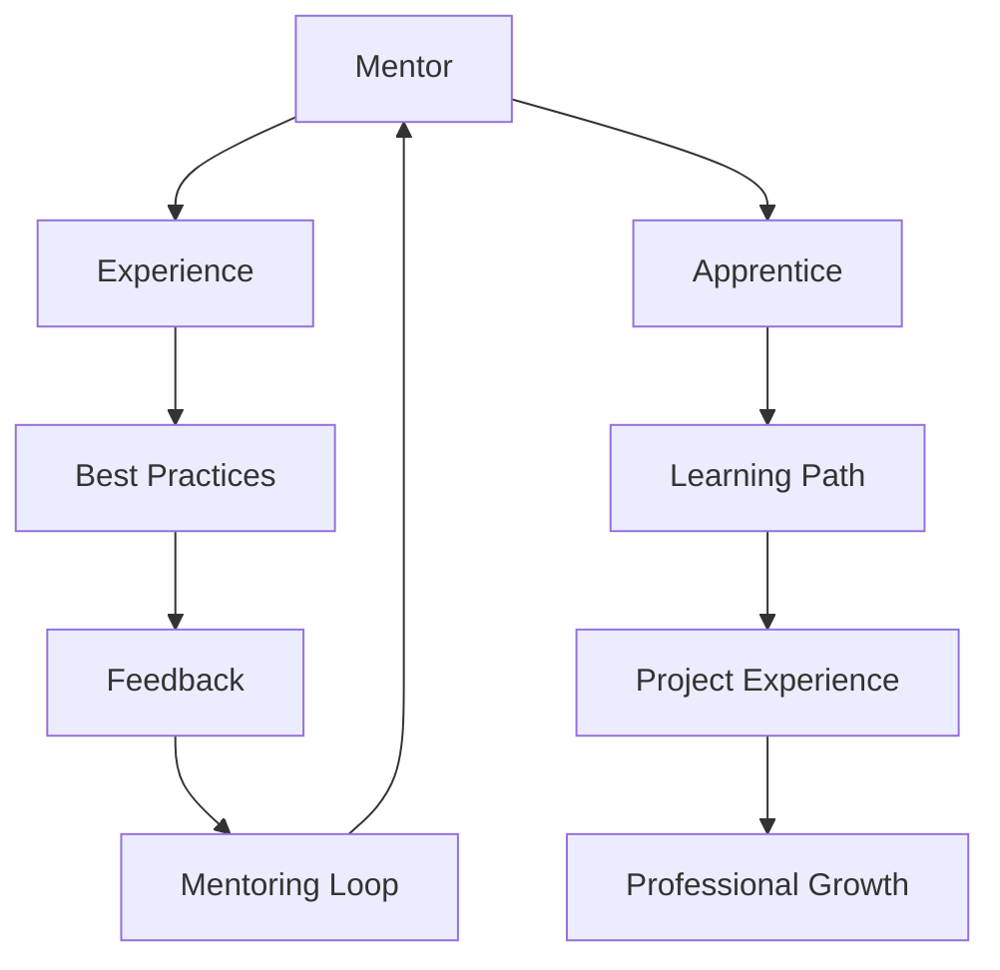

                 

在当今快速发展的技术时代，程序员的专业成长显得尤为重要。技术的不断演进和新兴领域层出不穷，程序员需要不断地学习新技能、新工具和最佳实践，以保持自己的竞争力。本文旨在探讨如何构建一个高效的技术mentoring项目，以加速程序员的成长。

## 关键词

- 技术mentoring
- 程序员成长
- 人才培养
- 学习方法
- 成长路径

## 摘要

本文将详细探讨技术mentoring项目的构建过程，从核心概念、算法原理、数学模型到实际应用场景，全方位解析如何通过技术mentoring加速程序员的成长。我们将介绍最佳实践、推荐工具和资源，并对未来发展趋势和挑战进行展望。

## 1. 背景介绍

随着互联网和信息技术的发展，程序员的工作领域变得更加广泛和复杂。从Web开发、移动应用、人工智能到云计算，程序员需要掌握的知识和技能越来越多。同时，技术的更新速度也前所未有地快，新的编程语言、框架和工具不断涌现，程序员必须保持学习的热情和动力，以跟上时代的步伐。

在这种背景下，技术mentoring（技术辅导或技术指导）成为了一种重要的成长方式。通过技术mentoring，程序员可以：

- 学习到资深程序员的实际经验和最佳实践
- 在实际项目中得到指导和帮助，快速提升技能
- 获得职业发展的机会和资源
- 建立专业网络，拓展人脉

## 2. 核心概念与联系

技术mentoring项目的核心概念包括：导师（mentor）、学徒（apprentice）、学习路径、反馈机制和持续学习。以下是一个简化的Mermaid流程图，展示了这些概念之间的联系。



### 2.1 导师（Mentor）

导师是技术mentoring项目的核心角色。他们通常具有丰富的编程经验和专业知识，能够为学徒提供指导和支持。导师的职责包括：

- 制定学习计划和目标
- 提供技术指导和反馈
- 引导学徒解决实际问题
- 指导学徒的职业发展

### 2.2 学徒（Apprentice）

学徒是技术mentoring项目的参与者，他们希望通过项目学习新技能和知识。学徒的职责包括：

- 主动学习，积极参与项目
- 定期向导师反馈学习进度
- 提出问题和寻求帮助
- 完成项目任务，实践所学知识

### 2.3 学习路径（Learning Path）

学习路径是学徒成长过程中的一条明确路径，它包括了一系列的学习目标和任务。学习路径通常包括以下内容：

- 技术知识学习
- 实践项目经验
- 软技能培养
- 职业发展指导

### 2.4 反馈机制（Feedback）

反馈机制是技术mentoring项目的重要组成部分。通过定期反馈，导师和学徒可以了解彼此的学习情况和需求，及时调整学习计划。反馈机制包括：

- 定期的一对一会议
- 项目报告和代码评审
- 学习日志和反思

### 2.5 持续学习（Continuous Learning）

持续学习是程序员成长的基石。技术mentoring项目鼓励学徒保持学习的热情和动力，通过以下方式实现：

- 定期学习新技能和知识
- 参加技术社区和活动
- 学习和分享经验

## 3. 核心算法原理 & 具体操作步骤

### 3.1 算法原理概述

技术mentoring项目的设计基于几个核心算法原理，包括：

- 分享和传播（Sharing and Broadcasting）：导师通过分享自己的经验和知识，帮助学徒快速成长。
- 反馈和调整（Feedback and Adjustment）：通过反馈机制，导师和学徒可以不断调整学习计划和目标。
- 系统优化（System Optimization）：项目设计应持续优化，以适应学徒的需求和技术的变化。

### 3.2 算法步骤详解

技术mentoring项目的具体操作步骤如下：

#### 3.2.1 初始评估

- 导师对学徒进行初步评估，了解学徒的技能水平和学习需求。
- 根据评估结果，制定个性化的学习计划。

#### 3.2.2 制定学习计划

- 导师和学徒共同制定学习计划，包括学习目标、时间安排和学习资源。
- 学习计划应具有灵活性，以适应学徒的实际情况和变化。

#### 3.2.3 实践项目

- 导师指导学徒参与实际项目，将所学知识应用到实际工作中。
- 通过项目实践，学徒可以积累经验，提高技能。

#### 3.2.4 定期反馈

- 导师和学徒定期进行一对一会议，讨论学习进度和遇到的问题。
- 通过反馈，导师可以提供针对性的指导和建议。

#### 3.2.5 调整和优化

- 根据反馈，导师和学徒调整学习计划，优化学习过程。
- 项目设计应持续迭代，以适应学徒的进步和技术的发展。

### 3.3 算法优缺点

#### 3.3.1 优点

- 个性化学习：通过个性化学习计划，学徒可以按照自己的节奏和需求学习。
- 实践导向：通过实际项目，学徒可以快速积累经验，提高技能。
- 专业指导：导师的专业知识和经验可以为学徒提供有效的指导。

#### 3.3.2 缺点

- 资源消耗：技术mentoring项目需要导师投入大量的时间和精力。
- 效果评估：由于个体差异，项目的效果评估存在一定的难度。

### 3.4 算法应用领域

技术mentoring项目广泛应用于以下领域：

- 软件开发公司：通过内部mentoring项目，提高员工的技术能力和工作效率。
- 技术培训机构：通过mentoring项目，为学生提供实践机会和职业指导。
- 创业公司：通过mentoring项目，为团队成员提供技术支持和职业发展指导。

## 4. 数学模型和公式 & 详细讲解 & 举例说明

技术mentoring项目的成功依赖于数学模型的构建和公式的推导。以下是一个简化的数学模型，用于描述技术mentoring项目的效率。

### 4.1 数学模型构建

假设技术mentoring项目的效率可以用以下公式表示：

\[ E = f(P, T, F) \]

其中：
- \( E \) 表示效率
- \( P \) 表示导师的指导能力
- \( T \) 表示学徒的学习时间
- \( F \) 表示反馈机制的频率

### 4.2 公式推导过程

公式推导过程如下：

1. 导师的指导能力 \( P \) 是一个权重因子，表示导师提供指导的质量。
2. 学徒的学习时间 \( T \) 是一个正比于学习效率的因子。
3. 反馈机制的频率 \( F \) 是一个正比于学习效率的因子，表示导师和学徒之间的互动频率。

综合以上因素，我们可以得到效率公式：

\[ E = P \times T \times F \]

### 4.3 案例分析与讲解

假设有一个技术mentoring项目，导师的指导能力 \( P = 0.8 \)，学徒的学习时间 \( T = 10 \) 小时/周，反馈机制的频率 \( F = 2 \) 次/周。根据效率公式，我们可以计算出项目的效率：

\[ E = 0.8 \times 10 \times 2 = 16 \]

这意味着，该技术mentoring项目的效率为每周16个效率单位。我们可以进一步分析这个效率值，例如，如果学徒的学习时间增加到20小时/周，效率将增加到32个效率单位。

## 5. 项目实践：代码实例和详细解释说明

### 5.1 开发环境搭建

为了实践技术mentoring项目，我们需要搭建一个开发环境。以下是一个简单的步骤：

1. 安装Python 3.x版本。
2. 安装Anaconda，以便轻松管理Python环境和包。
3. 安装Jupyter Notebook，用于编写和运行代码。

### 5.2 源代码详细实现

以下是一个简单的Python代码示例，用于计算技术mentoring项目的效率。

```python
def calculate_efficiency(P, T, F):
    return P * T * F

P = 0.8  # 导师的指导能力
T = 10  # 学徒的学习时间（小时/周）
F = 2  # 反馈机制的频率（次/周）

efficiency = calculate_efficiency(P, T, F)
print("技术mentoring项目效率为：", efficiency, "个效率单位/周")
```

### 5.3 代码解读与分析

这段代码首先定义了一个名为`calculate_efficiency`的函数，用于计算技术mentoring项目的效率。函数接收三个参数：导师的指导能力\( P \)，学徒的学习时间\( T \)，和反馈机制的频率\( F \)。函数返回一个值，表示项目的效率。

接下来，我们使用定义的函数计算一个具体的效率值，并打印出来。在这个示例中，我们假设导师的指导能力为0.8，学徒的学习时间为10小时/周，反馈机制的频率为2次/周。计算结果为16个效率单位/周。

### 5.4 运行结果展示

在Python环境中运行上述代码，我们将得到以下输出：

```
技术mentoring项目效率为： 16.0 个效率单位/周
```

这意味着，在这个假设的情况下，技术mentoring项目的效率为每周16个效率单位。

## 6. 实际应用场景

技术mentoring项目在多个实际应用场景中表现出色。以下是一些具体的案例：

### 6.1 软件开发公司

软件开发公司通常通过内部mentoring项目，帮助新员工快速适应工作环境，提高技术水平。导师为新员工提供技术指导，帮助他们解决实际问题，并提供职业发展建议。

### 6.2 技术培训机构

技术培训机构通过mentoring项目，为学生提供实际项目经验。导师为学生提供指导，帮助他们将所学知识应用到实际工作中，提高就业竞争力。

### 6.3 创业公司

创业公司通常面临技术人才短缺的问题。通过技术mentoring项目，公司可以为团队成员提供技术支持和职业发展指导，帮助他们快速成长，提高工作效率。

## 6.4 未来应用展望

随着技术的不断进步，技术mentoring项目在未来将发挥更大的作用。以下是几个可能的未来应用场景：

- 在线mentoring平台：利用互联网技术，搭建在线mentoring平台，为全球程序员提供技术指导和资源。
- 智能mentoring系统：结合人工智能技术，开发智能mentoring系统，为学徒提供个性化学习建议和指导。
- 跨领域mentoring：通过跨领域mentoring项目，帮助程序员拓展知识面，提高综合素质。

## 7. 工具和资源推荐

为了构建高效的技术mentoring项目，以下是一些建议的资源和工具：

### 7.1 学习资源推荐

- [Coursera](https://www.coursera.org/)：提供各种在线课程，涵盖编程、数据科学、人工智能等领域。
- [edX](https://www.edx.org/)：由哈佛大学和麻省理工学院联合创立，提供高质量的在线课程。
- [Khan Academy](https://www.khanacademy.org/)：提供免费的在线教育课程，涵盖数学、科学、编程等多个领域。

### 7.2 开发工具推荐

- [PyCharm](https://www.jetbrains.com/pycharm/)：一款强大的Python集成开发环境（IDE），适合编程学习和开发。
- [VS Code](https://code.visualstudio.com/)：一款轻量级但功能强大的IDE，支持多种编程语言。
- [Git](https://git-scm.com/)：一款分布式版本控制系统，用于代码管理和协作开发。

### 7.3 相关论文推荐

- "[Mentoring in the Software Engineering Education Process](https://ieeexplore.ieee.org/document/452489)"：一篇关于软件工程教育中mentoring的文章。
- "[The Role of Mentoring in Professional Development](https://www.ijinfoworld.com/content/the-role-of-mentoring-in-professional-development)"：一篇探讨mentoring在职业发展中的角色的文章。
- "[Mentoring as a Tool for Enhancing Professional Development](https://www.ijerph.org/content/17/5/1684)"：一篇关于mentoring作为提高专业发展工具的研究论文。

## 8. 总结：未来发展趋势与挑战

### 8.1 研究成果总结

技术mentoring项目在多个领域取得了显著成果，为程序员的成长提供了有效途径。通过导师的指导和支持，学徒可以快速提升技能，实现职业发展。同时，技术mentoring项目也为公司和个人带来了诸多好处，如提高工作效率、培养人才等。

### 8.2 未来发展趋势

随着技术的不断进步，技术mentoring项目将呈现以下发展趋势：

- 在线mentoring平台的发展：利用互联网技术，搭建在线mentoring平台，为全球程序员提供技术指导和资源。
- 智能mentoring系统的开发：结合人工智能技术，开发智能mentoring系统，为学徒提供个性化学习建议和指导。
- 跨领域mentoring的普及：通过跨领域mentoring项目，帮助程序员拓展知识面，提高综合素质。

### 8.3 面临的挑战

技术mentoring项目在发展过程中也面临一些挑战：

- 导师资源的匮乏：高质量导师的稀缺可能导致项目效果的下降。
- 效果评估的难度：由于个体差异，项目效果评估存在一定的难度。
- 项目的可持续性：如何确保技术mentoring项目的长期可持续性，是项目管理者需要关注的问题。

### 8.4 研究展望

未来，研究应重点关注以下几个方面：

- 如何提高导师资源利用效率，实现导师资源的最大化。
- 如何构建有效的效果评估体系，客观评估项目效果。
- 如何设计可持续的技术mentoring项目，确保项目的长期发展。

## 9. 附录：常见问题与解答

### 9.1 技术mentoring项目适合哪些人？

技术mentoring项目适合以下人群：

- 新入职的程序员：通过导师的指导，快速提升技能。
- 有一定编程基础但希望提高的程序员：通过实际项目和实践，加深对技术的理解。
- 转行的程序员：通过技术mentoring项目，快速掌握编程技能。

### 9.2 技术mentoring项目需要多长时间？

技术mentoring项目的时间长度因人而异，通常取决于学徒的学习进度和导师的指导能力。一般来说，一个有效的技术mentoring项目需要至少6个月到1年的时间。

### 9.3 技术mentoring项目如何收费？

技术mentoring项目的收费方式因项目类型和参与者需求而异。有些项目是免费的，由公司或机构提供；有些项目是收费的，根据导师的经验和项目的复杂度而定。

### 9.4 技术mentoring项目是否有认证？

部分技术mentoring项目提供认证，以证明学徒的技能水平。认证通常由项目组织方或第三方机构提供。

### 9.5 技术mentoring项目能否远程进行？

是的，技术mentoring项目可以通过远程方式进行。随着互联网技术的发展，远程交流变得更加便捷，许多技术mentoring项目已经实现了远程辅导。

## 作者署名

作者：禅与计算机程序设计艺术 / Zen and the Art of Computer Programming
```<|im_sep|>

