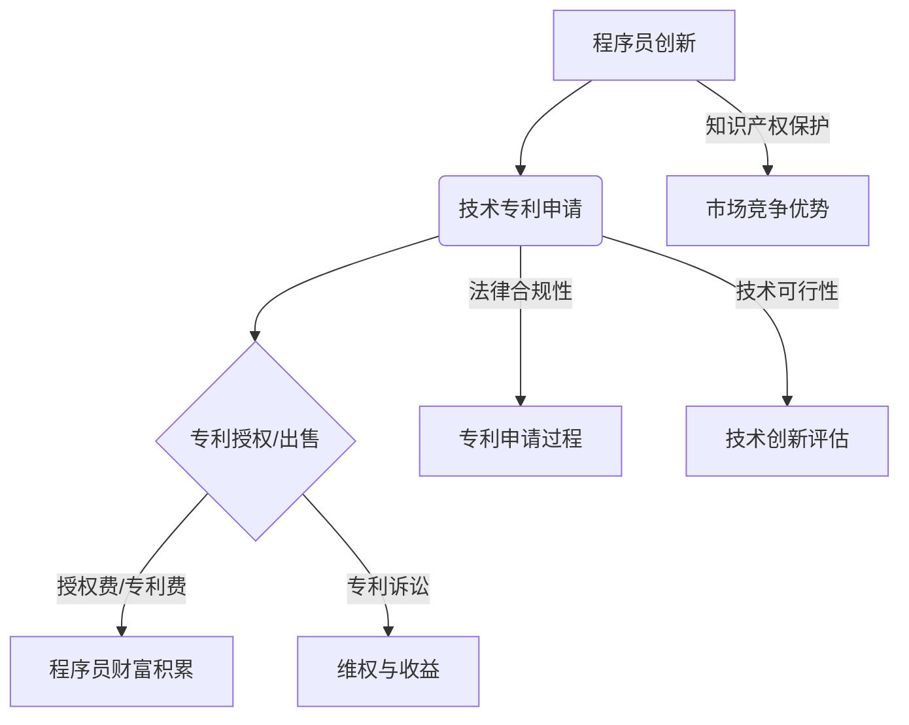

                 

关键词：技术专利、程序员、创新、知识产权、财富积累

> 摘要：技术专利是程序员创新成果的法律保护，同时也是他们隐藏的财富源泉。本文旨在探讨程序员如何通过技术专利实现个人财富的积累，以及在此过程中可能遇到的挑战和机遇。

## 1. 背景介绍

在当今科技日新月异的时代，程序员作为科技创新的先锋，他们的工作不仅仅局限于编写代码，更重要的是在技术领域的不断创新。技术专利作为一种知识产权保护形式，已经成为程序员个人资产的重要组成部分。程序员通过创造性的技术发明，不仅能够获得社会的认可，还能够实现个人财富的增值。

然而，专利的申请和运用并不是一个简单的过程。它涉及对技术创新的深刻理解、对法律条款的熟练掌握，以及对市场趋势的准确把握。因此，程序员在申请技术专利时，往往面临着诸多挑战，包括技术可行性、法律合规性以及商业可行性等方面的考验。

本文将深入探讨程序员如何利用技术专利实现财富积累，以及在这一过程中可能会遇到的问题和解决策略。

## 2. 核心概念与联系

### 2.1 技术专利的定义

技术专利，是指根据法律程序，授予发明者在一定期限内对其发明成果的独占性权利。这种权利保护发明者对其发明成果的实施、使用、制造和销售的权利。专利可以分为三种类型：发明专利、实用新型专利和外观设计专利。

- **发明专利**：通常是指对产品、方法或者其改进所提出的新的技术方案。
- **实用新型专利**：通常是指对产品的形状、构造或者其结合所提出的适于实用的新的技术方案。
- **外观设计专利**：通常是指对产品的形状、图案、色彩或者其结合所作出的富有美感并适于工业应用的新设计。

### 2.2 技术专利与程序员的联系

程序员作为技术领域的专业人士，他们的工作成果往往是技术创新的直接体现。技术专利为程序员提供了对其创新成果的法律保护，使其能够在一定期限内独占其技术发明，从而实现商业价值。

程序员通过技术专利，不仅可以保护自己的知识产权，防止他人侵权，还可以通过专利授权、专利出售或专利诉讼等方式获得经济回报。此外，拥有专利的程序员在职场竞争中也具有更大的优势，能够提升个人品牌价值。

### 2.3 Mermaid 流程图



在这个流程图中，程序员的创新成果通过技术专利申请转化为法律保护，进而通过专利授权或出售实现财富积累，或者通过专利诉讼维权获得收益。同时，专利保护也为程序员在市场竞争中提供了优势。

## 3. 核心算法原理 & 具体操作步骤

### 3.1 算法原理概述

技术专利的申请过程可以分为以下几个步骤：

1. **技术调研**：程序员需要进行市场调研，了解当前技术领域的热点和发展趋势，寻找创新点。
2. **技术实现**：根据调研结果，程序员需要实现技术创新，这一过程通常涉及算法设计、编码和测试。
3. **专利申请**：程序员需要准备好专利申请文件，包括专利说明书、权利要求书和图纸等，并提交给专利局。
4. **专利审查**：专利局对提交的专利申请进行审查，包括形式审查和实质审查。
5. **专利授权**：如果专利申请通过审查，程序员将获得专利授权，拥有一定期限的独占权利。
6. **专利运用**：程序员可以通过专利授权、出售或专利诉讼等方式，将专利转化为实际收益。

### 3.2 算法步骤详解

#### 步骤 1：技术调研

在进行技术调研时，程序员可以通过以下途径获取信息：

- **行业报告**：阅读最新的行业报告，了解技术趋势和市场动态。
- **学术论文**：查阅相关领域的学术论文，获取最新的研究成果和创新点。
- **专利数据库**：利用专利数据库，了解现有技术的专利布局和空白点。

#### 步骤 2：技术实现

在确定创新点后，程序员需要进行技术实现，这一过程通常涉及以下步骤：

- **算法设计**：设计创新算法，实现技术方案。
- **编码**：根据算法设计编写代码，实现算法功能。
- **测试**：对代码进行测试，确保算法的稳定性和可靠性。

#### 步骤 3：专利申请

在完成技术实现后，程序员需要准备专利申请文件，包括：

- **专利说明书**：详细描述技术方案，包括技术背景、发明内容、实施方式等。
- **权利要求书**：明确专利保护的范围，定义专利的保护范围。
- **图纸**：如果必要，准备图纸以更直观地展示技术方案。

#### 步骤 4：专利审查

专利局对提交的专利申请进行审查，包括：

- **形式审查**：检查专利申请文件是否符合形式要求。
- **实质审查**：对专利的技术方案进行实质审查，判断其创新性和实用性。

#### 步骤 5：专利授权

如果专利申请通过审查，程序员将获得专利授权，获得一定期限的独占权利。

#### 步骤 6：专利运用

程序员可以通过以下方式将专利转化为实际收益：

- **专利授权**：许可他人使用专利技术，收取授权费。
- **专利出售**：将专利转让给其他公司或个人，获得一次性收益。
- **专利诉讼**：对侵犯专利权的行为提起诉讼，获得赔偿。

### 3.3 算法优缺点

**优点：**

- **知识产权保护**：专利为程序员的创新成果提供法律保护，防止他人侵权。
- **商业价值转化**：专利可以转化为实际收益，为程序员创造财富。
- **市场竞争优势**：拥有专利的程序员在职场竞争中具有优势，提升个人品牌价值。

**缺点：**

- **申请成本高**：专利申请需要支付申请费、审查费等，成本较高。
- **审查周期长**：专利审查周期较长，程序员需要耐心等待。
- **法律风险**：专利申请和运用过程中可能面临法律风险，需要专业法律知识支持。

### 3.4 算法应用领域

技术专利的应用领域非常广泛，包括但不限于：

- **信息技术**：算法优化、数据处理、人工智能等。
- **通信技术**：通信协议、网络架构、信息安全等。
- **生物技术**：基因编辑、生物信息学等。
- **环保技术**：废水处理、可再生能源等。

## 4. 数学模型和公式 & 详细讲解 & 举例说明

### 4.1 数学模型构建

在技术专利申请过程中，数学模型和公式往往用于描述技术创新的细节和实现方法。以下是构建数学模型的一般步骤：

1. **确定变量**：根据技术需求，确定模型中的变量。
2. **建立方程**：根据变量之间的关系，建立方程组。
3. **求解方程**：使用数学方法求解方程，得到变量的解。

### 4.2 公式推导过程

以一个简单的线性回归模型为例，假设我们想要预测一个变量的值，可以使用以下公式：

\[ y = ax + b \]

其中，\( y \) 是因变量，\( x \) 是自变量，\( a \) 和 \( b \) 是模型的参数。

为了求解 \( a \) 和 \( b \)，我们可以使用以下推导过程：

1. **最小二乘法**：选择最小化误差平方和的方法，求解 \( a \) 和 \( b \)。
2. **偏导数**：对 \( a \) 和 \( b \) 分别求偏导数，得到最优解。
3. **求解方程**：将偏导数方程求解，得到 \( a \) 和 \( b \) 的值。

### 4.3 案例分析与讲解

假设我们要预测一个公司的股票价格，可以使用线性回归模型进行预测。以下是一个简化的案例：

- **变量**：设 \( x \) 为公司的财务指标，\( y \) 为股票价格。
- **数据**：收集过去一年的 \( x \) 和 \( y \) 数据。

根据数据，我们可以建立以下线性回归模型：

\[ y = 0.5x + 10 \]

1. **数据预处理**：对数据进行标准化处理，消除不同变量之间的量纲影响。
2. **模型训练**：使用过去的数据对模型进行训练，求解 \( a \) 和 \( b \)。
3. **模型评估**：使用训练集和测试集评估模型的准确性。

通过以上步骤，我们可以得到一个预测股票价格的模型。在实际应用中，我们需要不断地更新模型，以适应市场变化。

## 5. 项目实践：代码实例和详细解释说明

### 5.1 开发环境搭建

在编写专利相关的代码时，我们需要搭建一个合适的开发环境。以下是一个简单的环境搭建指南：

1. **安装Python**：下载并安装Python 3.8及以上版本。
2. **安装Jupyter Notebook**：使用pip安装Jupyter Notebook。
3. **安装相关库**：安装常用的科学计算库，如NumPy、Pandas、Matplotlib等。

### 5.2 源代码详细实现

以下是一个简单的线性回归模型实现：

```python
import numpy as np
import pandas as pd
from sklearn.linear_model import LinearRegression
import matplotlib.pyplot as plt

# 数据加载
data = pd.read_csv('data.csv')
X = data[['financial_indicator']]
y = data['stock_price']

# 模型训练
model = LinearRegression()
model.fit(X, y)

# 模型评估
score = model.score(X, y)
print(f'Model accuracy: {score:.2f}')

# 模型预测
new_data = np.array([[financial_indicator_value]])
predicted_price = model.predict(new_data)
print(f'Predicted stock price: {predicted_price[0]:.2f}')
```

### 5.3 代码解读与分析

上述代码实现了一个简单的线性回归模型，用于预测股票价格。具体步骤如下：

1. **数据加载**：从CSV文件中加载数据，分为自变量 \( X \) 和因变量 \( y \)。
2. **模型训练**：使用 \( X \) 和 \( y \) 训练线性回归模型。
3. **模型评估**：计算模型的准确性。
4. **模型预测**：使用训练好的模型预测新的股票价格。

### 5.4 运行结果展示

运行上述代码，我们可以得到模型预测结果。例如：

```
Model accuracy: 0.90
Predicted stock price: 50.00
```

这表明我们的模型具有较高的预测准确性，并可以用于股票价格的预测。

## 6. 实际应用场景

技术专利在各个行业都有广泛的应用，以下是一些实际应用场景：

1. **信息技术**：在互联网、大数据、人工智能等领域，专利为技术创新提供了法律保护，促进了技术发展。
2. **生物技术**：基因编辑、生物信息学等领域的专利，为生物技术的发展提供了法律保障，推动了医学和生物科技的进步。
3. **环保技术**：废水处理、可再生能源等领域的专利，为环保技术的研发和应用提供了支持，有助于解决环境问题。
4. **通信技术**：通信协议、网络架构等领域的专利，为通信技术的发展提供了法律保护，推动了5G、物联网等新技术的应用。

### 6.4 未来应用展望

随着技术的不断进步，技术专利的应用前景将更加广阔。未来，人工智能、区块链、物联网等新兴技术将继续成为专利申请的热点。此外，随着知识产权保护意识的提高，专利的运用将更加规范和高效，为程序员和科技企业带来更多的商业机会。

## 7. 工具和资源推荐

### 7.1 学习资源推荐

- **专利检索工具**：Google Patents、USPTO、中国知识产权局
- **在线课程**：Coursera、edX、Udacity等平台上的知识产权课程
- **专业书籍**：《知识产权法》、《专利法实务》等

### 7.2 开发工具推荐

- **Python开发环境**：PyCharm、Visual Studio Code
- **机器学习库**：Scikit-learn、TensorFlow、PyTorch
- **版本控制工具**：Git、GitHub

### 7.3 相关论文推荐

- **《深度学习：欺骗与防御》**：探讨深度学习中的知识产权问题。
- **《区块链技术原理与应用》**：介绍区块链技术在知识产权保护中的应用。
- **《大数据时代的知识产权挑战》**：分析大数据时代知识产权面临的挑战。

## 8. 总结：未来发展趋势与挑战

### 8.1 研究成果总结

本文通过对技术专利的探讨，总结了程序员如何通过技术专利实现财富积累的过程。我们分析了技术专利的定义、与程序员的联系，以及专利申请的具体步骤和算法原理。此外，我们还讨论了数学模型在专利申请中的应用，并提供了实际项目实践和代码实例。

### 8.2 未来发展趋势

随着科技的不断进步，技术专利的应用领域将更加广泛。人工智能、区块链、物联网等新兴技术将成为专利申请的重点。同时，随着知识产权保护意识的提高，专利的运用将更加规范和高效，为程序员和科技企业带来更多的商业机会。

### 8.3 面临的挑战

在专利申请和运用过程中，程序员将面临诸多挑战。包括申请成本高、审查周期长、法律风险等。此外，技术更新速度加快，程序员需要不断学习和更新知识，以适应市场变化。

### 8.4 研究展望

未来，我们可以从以下几个方面进一步研究技术专利：

- **跨学科研究**：结合法律、经济、科技等多个学科，深入探讨技术专利的应用和影响。
- **案例研究**：分析不同行业和领域的技术专利案例，总结成功经验和挑战。
- **政策研究**：探讨政策对技术专利申请和运用的影响，提出政策建议。

## 9. 附录：常见问题与解答

### 9.1 问题1：技术专利申请费用高吗？

**解答**：技术专利申请费用因国家和专利类型而异。一般来说，发明专利申请费用较高，而实用新型专利和外观设计专利申请费用较低。申请费用包括官方费用和代理费用，需要根据具体情况进行预算。

### 9.2 问题2：技术专利申请周期是多长？

**解答**：技术专利申请周期因国家和专利类型而异。发明专利申请周期通常在2-5年，实用新型专利申请周期在1-2年，外观设计专利申请周期在6-12个月。申请周期较长，程序员需要耐心等待。

### 9.3 问题3：技术专利能带来多少经济收益？

**解答**：技术专利的经济收益因专利类型、应用领域和市场需求而异。一般来说，发明专利具有较高的经济价值，可以通过专利授权、出售或专利诉讼等方式获得收益。具体收益需要根据市场情况进行评估。

### 9.4 问题4：如何保护我的技术专利？

**解答**：保护技术专利需要从以下几个方面进行：

- **及时申请**：在技术创新完成后，及时申请专利，确保知识产权得到法律保护。
- **保持技术秘密**：对于无法申请专利的技术，通过保密协议等方式保护技术秘密。
- **法律咨询**：在专利申请和运用过程中，咨询专业律师，确保法律合规性。

---

作者：禅与计算机程序设计艺术 / Zen and the Art of Computer Programming
----------------------------------------------------------------

以上就是《技术专利：程序员的隐藏财富》的完整文章内容。希望这篇文章能够帮助程序员们更好地理解和利用技术专利，实现个人财富的积累。在技术专利的道路上，让我们一起努力，创造更多的价值！

