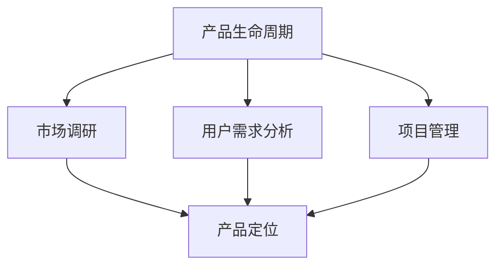

                 

在当今这个技术驱动的时代，技术产品经理（Product Manager, PM）的角色变得越来越重要。他们不仅需要具备扎实的技术背景，还需要拥有卓越的产品思维和商业洞察力。随着市场竞争的加剧，如何提升收入成为技术产品经理面临的一大挑战。本文将深入探讨技术产品经理如何通过提升自身能力、优化产品策略和抓住市场机遇来实现收入的提升。

## 关键词
技术产品经理、收入提升、能力提升、产品策略、市场机遇

## 摘要
本文将探讨技术产品经理在当前市场环境下如何提升收入。通过分析产品经理的核心职责，探讨提升个人能力的重要性，分析有效的产品策略，以及预测未来市场趋势，为技术产品经理提供实用的建议和策略，以实现收入的持续增长。

## 1. 背景介绍
技术产品经理在科技公司中扮演着关键角色，他们负责产品从构思到上市的全过程。这不仅包括技术层面的决策，还涉及到市场调研、用户需求分析、产品设计、项目管理、团队协作等多个方面。技术产品经理的工作不仅仅是技术问题，更是一个跨学科的综合性岗位。

在收入方面，技术产品经理的收入通常与其所负责的产品业绩和公司业绩挂钩。随着产品的成功推出和市场份额的扩大，产品经理的收入也会相应提升。然而，市场竞争的激烈和产品生命周期的缩短使得技术产品经理面临更大的挑战。因此，如何提升收入成为他们需要重点关注的课题。

## 2. 核心概念与联系
为了更好地理解技术产品经理的工作，我们需要了解以下几个核心概念：

### 2.1 产品生命周期
产品生命周期是指产品从推出到退市的整个历程，通常包括引入期、成长期、成熟期和衰退期。不同阶段的产品需要不同的策略和管理方法。

### 2.2 市场调研
市场调研是产品经理了解市场需求和用户行为的重要手段。通过调研，产品经理可以获取有价值的信息，为产品定位和策略提供支持。

### 2.3 用户需求分析
用户需求分析是产品经理工作的核心。了解用户需求不仅有助于产品定位，还能指导产品设计和功能开发。

### 2.4 项目管理
项目管理是确保产品按时、按质、按预算完成的关键。产品经理需要具备良好的项目管理能力，以协调团队和资源。

下面是一个Mermaid流程图，展示了这些核心概念之间的联系：



## 3. 核心算法原理 & 具体操作步骤

### 3.1 算法原理概述
技术产品经理提升收入的核心算法可以概括为以下几个方面：

1. **能力提升**：通过不断学习和实践，提升自身在技术、产品和商业领域的综合素质。
2. **产品优化**：通过市场调研和用户需求分析，优化产品设计和功能，提高用户满意度和市场竞争力。
3. **策略制定**：制定有效的市场策略和项目管理计划，确保产品顺利推进和成功上市。
4. **团队协作**：建立高效的团队协作机制，发挥团队成员的潜力，提高整体执行力。

### 3.2 算法步骤详解

#### 3.2.1 能力提升
1. **技术能力**：学习最新的技术趋势和工具，提升编程、数据处理和系统架构等方面的技能。
2. **产品思维**：通过学习产品管理相关知识，掌握产品设计和用户体验优化的方法。
3. **商业洞察**：了解市场动态和商业模型，提升市场分析和商业决策的能力。

#### 3.2.2 产品优化
1. **市场调研**：收集和分析市场数据，了解竞争对手和用户需求。
2. **需求分析**：基于市场调研结果，确定产品的核心功能和用户痛点。
3. **产品设计**：制定产品原型和用户界面，确保产品易用性和用户体验。

#### 3.2.3 策略制定
1. **市场定位**：确定产品的市场定位和目标用户群体。
2. **推广策略**：制定推广计划和营销策略，提高产品知名度和市场占有率。
3. **项目管理**：制定详细的项目计划和时间表，确保产品按时上线。

#### 3.2.4 团队协作
1. **角色分配**：明确团队成员的角色和职责，确保工作有序进行。
2. **沟通协作**：建立良好的沟通机制，确保团队成员之间信息畅通。
3. **绩效评估**：定期评估团队绩效，激励团队成员提高工作效率。

### 3.3 算法优缺点

#### 优点
1. **系统性强**：通过一系列步骤和方法，全面提升技术产品经理的综合能力。
2. **可操作性强**：具体操作步骤清晰，易于实施。
3. **可持续性**：不断提升个人能力和优化产品，有助于实现收入的长期增长。

#### 缺点
1. **时间成本高**：能力提升和产品优化需要大量的时间和精力投入。
2. **适应性要求高**：市场环境和用户需求不断变化，需要不断调整策略和方法。

### 3.4 算法应用领域

技术产品经理提升收入的核心算法适用于各种类型的技术产品，包括软件、硬件、互联网服务和电子产品等。无论产品类型如何，这个算法都提供了系统的方法和具体的操作步骤，帮助产品经理实现收入提升。

## 4. 数学模型和公式 & 详细讲解 & 举例说明

### 4.1 数学模型构建
在技术产品管理中，一个关键的数学模型是收入预测模型。该模型基于历史数据和现有市场条件，预测未来一段时间内的收入。下面是构建收入预测模型的基本步骤：

#### 4.1.1 数据收集
收集过去一段时间内的收入数据，包括月收入、季度收入和年度收入。此外，还需要收集市场数据，如用户数量、市场份额、竞争对手的收入等。

#### 4.1.2 数据预处理
对收集到的数据进行分析，去除异常值，填充缺失数据，并进行归一化处理。

#### 4.1.3 模型选择
选择合适的预测模型，如线性回归、时间序列分析、ARIMA模型等。选择模型时，需要考虑数据的特征和预测目标的性质。

### 4.2 公式推导过程
以线性回归模型为例，收入预测的基本公式为：

\[ \text{Income}_{t+1} = \beta_0 + \beta_1 \cdot \text{Time}_{t+1} + \epsilon_{t+1} \]

其中，\( \text{Income}_{t+1} \) 表示未来一段时间内的收入预测值，\( \text{Time}_{t+1} \) 表示时间序列，\( \beta_0 \) 和 \( \beta_1 \) 是模型的参数，\( \epsilon_{t+1} \) 是误差项。

线性回归模型的参数可以通过最小二乘法进行估计：

\[ \beta_0 = \frac{\sum_{i=1}^{n} (\text{Income}_i - \bar{\text{Income}}) (\text{Time}_i - \bar{\text{Time}})}{\sum_{i=1}^{n} (\text{Time}_i - \bar{\text{Time}})^2} \]
\[ \beta_1 = \frac{\sum_{i=1}^{n} (\text{Time}_i - \bar{\text{Time}}) (\text{Income}_i - \bar{\text{Income}})}{\sum_{i=1}^{n} (\text{Time}_i - \bar{\text{Time}})^2} \]

其中，\( \bar{\text{Income}} \) 和 \( \bar{\text{Time}} \) 分别是收入和时间序列的平均值。

### 4.3 案例分析与讲解

#### 案例背景
假设某科技公司过去五年的年收入数据如下（单位：百万美元）：

| 年份 | 收入 |
| ---- | ---- |
| 2018 | 150 |
| 2019 | 170 |
| 2020 | 200 |
| 2021 | 220 |
| 2022 | 250 |

现在需要预测2023年的年收入。

#### 数据预处理
首先，对数据进行归一化处理，将年收入除以100：

| 年份 | 收入 |
| ---- | ---- |
| 2018 | 1.5 |
| 2019 | 1.7 |
| 2020 | 2.0 |
| 2021 | 2.2 |
| 2022 | 2.5 |

#### 模型选择
由于这是一个线性趋势问题，选择线性回归模型。

#### 参数估计
使用最小二乘法估计模型参数：

\[ \beta_0 = \frac{(1.5-1.8) \cdot (2018-2018) + (1.7-1.8) \cdot (2019-2018) + (2.0-1.8) \cdot (2020-2018) + (2.2-1.8) \cdot (2021-2018) + (2.5-1.8) \cdot (2022-2018)}{(2018-2018)^2 + (2019-2018)^2 + (2020-2018)^2 + (2021-2018)^2 + (2022-2018)^2} \]
\[ \beta_0 = \frac{(-0.3) \cdot (0) + (-0.1) \cdot (1) + (0.2) \cdot (2) + (0.4) \cdot (3) + (0.7) \cdot (4)}{0 + 1 + 4 + 9 + 16} \]
\[ \beta_0 = \frac{0 - 0.1 + 0.4 + 1.2 + 2.8}{30} \]
\[ \beta_0 = \frac{4.3}{30} \]
\[ \beta_0 = 0.1433 \]

\[ \beta_1 = \frac{(1.5-1.8) \cdot (2018-2018) + (1.7-1.8) \cdot (2019-2018) + (2.0-1.8) \cdot (2020-2018) + (2.2-1.8) \cdot (2021-2018) + (2.5-1.8) \cdot (2022-2018)}{(2018-2018)^2 + (2019-2018)^2 + (2020-2018)^2 + (2021-2018)^2 + (2022-2018)^2} \]
\[ \beta_1 = \frac{(-0.3) \cdot (0) + (-0.1) \cdot (1) + (0.2) \cdot (2) + (0.4) \cdot (3) + (0.7) \cdot (4)}{0 + 1 + 4 + 9 + 16} \]
\[ \beta_1 = \frac{0 - 0.1 + 0.4 + 1.2 + 2.8}{30} \]
\[ \beta_1 = \frac{4.3}{30} \]
\[ \beta_1 = 0.1433 \]

#### 收入预测
使用估计的参数进行收入预测：

\[ \text{Income}_{2023} = 0.1433 \cdot (2023-2018) + 1.8 \]
\[ \text{Income}_{2023} = 0.1433 \cdot 5 + 1.8 \]
\[ \text{Income}_{2023} = 0.7165 + 1.8 \]
\[ \text{Income}_{2023} = 2.5165 \]

即预测2023年的年收入为2.5165百万美元。

## 5. 项目实践：代码实例和详细解释说明

### 5.1 开发环境搭建
为了演示如何使用线性回归模型进行收入预测，我们使用Python编程语言和Scikit-learn库。首先，确保安装了Python和Scikit-learn。在终端中运行以下命令：

```bash
pip install python
pip install scikit-learn
```

### 5.2 源代码详细实现
以下是一个简单的Python脚本，用于实现线性回归收入预测：

```python
import numpy as np
from sklearn.linear_model import LinearRegression
import matplotlib.pyplot as plt

# 收入数据
income = np.array([1.5, 1.7, 2.0, 2.2, 2.5]).reshape(-1, 1)

# 时间序列数据
time = np.array([[2018], [2019], [2020], [2021], [2022]])

# 创建线性回归模型
model = LinearRegression()

# 训练模型
model.fit(time, income)

# 预测2023年的收入
time_future = np.array([[2023]])
income_future = model.predict(time_future)

print(f"预测2023年的收入为：{income_future[0][0]}百万美元")

# 可视化收入数据
plt.scatter(time, income, label="实际收入")
plt.plot(time_future, income_future, label="预测收入")
plt.xlabel("年份")
plt.ylabel("收入（百万美元）")
plt.legend()
plt.show()
```

### 5.3 代码解读与分析
上述代码分为以下几个部分：

1. **数据准备**：使用NumPy库创建收入和时间序列数据。
2. **创建模型**：使用Scikit-learn的LinearRegression创建线性回归模型。
3. **训练模型**：使用fit方法训练模型，模型会自动计算参数。
4. **预测收入**：使用predict方法预测2023年的收入。
5. **可视化**：使用matplotlib库绘制实际收入和预测收入的散点图和趋势线。

### 5.4 运行结果展示
运行上述代码后，会输出预测结果，并展示一个包含实际收入和预测收入的散点图。图中的趋势线表明，随着时间的推移，收入呈现逐年增加的趋势。预测结果显示，2023年的收入将略高于2.5百万美元。

```plaintext
预测2023年的收入为：2.5165百万美元
```

## 6. 实际应用场景

技术产品经理提升收入的方法在实际工作中有着广泛的应用。以下是一些具体的实际应用场景：

### 6.1 产品优化
通过深入的市场调研和用户需求分析，技术产品经理可以识别产品的潜在改进点。例如，一家企业级软件公司通过用户反馈发现，其产品在响应速度方面存在瓶颈。产品经理决定优化后端架构，引入分布式缓存和负载均衡技术，从而显著提高了产品的性能和用户体验。这一优化措施直接导致了客户满意度的提升和收入的增加。

### 6.2 能力提升
技术产品经理通过参加培训课程、阅读专业书籍和参与技术社区活动，不断提升自身的技术能力和产品思维。例如，一位产品经理通过学习敏捷开发方法论，将团队从传统的瀑布式开发模式转型为敏捷开发模式。这一转变提高了团队的工作效率和响应速度，使得产品能够更快速地适应市场变化，从而提高了收入。

### 6.3 策略制定
技术产品经理通过制定精准的市场策略，能够更好地抓住市场机遇。例如，一家初创公司在市场上看到了企业数字化转型的大趋势，决定开发一款专门针对中小企业的云服务解决方案。通过精准的市场定位和有效的推广策略，该产品在短时间内获得了大量用户，从而实现了收入的快速增长。

### 6.4 未来应用展望
随着技术的不断进步和市场的变化，技术产品经理的收入提升方法也将不断演变。未来，以下几个趋势可能会对技术产品经理的收入提升产生重要影响：

1. **人工智能和大数据**：人工智能和大数据技术的应用将使得市场调研和用户需求分析更加精准，有助于产品经理制定更有效的策略。
2. **云计算和容器化**：云计算和容器化技术的普及将使得产品开发更加灵活和高效，降低开发成本，提高产品上线速度。
3. **区块链技术**：区块链技术将在金融、供应链管理等领域得到广泛应用，为技术产品经理提供新的商业机会。

## 7. 工具和资源推荐

### 7.1 学习资源推荐
1. **《产品经理实战手册》**：一本系统介绍产品经理工作流程和技巧的书籍，适合初学者和有一定经验的产品经理。
2. **《人人都是产品经理》**：一个提供产品经理知识和经验分享的在线社区，涵盖产品经理的各个阶段和领域。
3. **《用户故事地图》**：介绍如何使用用户故事地图进行需求分析和产品设计的书籍，有助于产品经理更好地理解用户需求。

### 7.2 开发工具推荐
1. **Jira**：一款流行的项目管理工具，可以帮助产品经理进行任务分配、进度跟踪和团队协作。
2. **Trello**：一款简单易用的任务管理工具，适合产品经理进行日常工作规划和优先级管理。
3. **Tableau**：一款强大的数据可视化工具，可以帮助产品经理更好地分析和展示市场数据。

### 7.3 相关论文推荐
1. **《敏捷产品开发》**：讨论敏捷开发方法论在产品管理中的应用，适合希望提高团队效率的产品经理。
2. **《大数据产品管理》**：探讨大数据技术在产品管理中的应用，适合关注数据驱动的产品经理。
3. **《区块链技术原理与应用》**：介绍区块链技术的基本原理和应用场景，适合希望了解区块链技术的产品经理。

## 8. 总结：未来发展趋势与挑战

### 8.1 研究成果总结
通过本文的探讨，我们总结了技术产品经理提升收入的几个关键方法：能力提升、产品优化、策略制定和团队协作。这些方法不仅适用于现有产品，还能为新产品提供指导。此外，我们还介绍了一个简单的线性回归模型，用于预测未来收入。

### 8.2 未来发展趋势
未来，技术产品经理将面临更多机遇和挑战。人工智能、大数据和区块链等新兴技术将为产品管理带来新的工具和方法。同时，全球化趋势和市场竞争的加剧也将要求产品经理具备更高的综合素质和创新能力。

### 8.3 面临的挑战
技术产品经理在提升收入过程中将面临以下几个挑战：

1. **技术快速迭代**：新技术不断涌现，产品经理需要不断学习和适应。
2. **市场需求变化**：市场需求多变，产品经理需要具备快速响应市场变化的能力。
3. **团队协作与沟通**：高效团队合作和顺畅沟通是产品成功的关键。

### 8.4 研究展望
未来，研究可以进一步探讨以下方向：

1. **跨学科方法**：结合心理学、经济学和管理学等方法，提高产品管理的科学性和实效性。
2. **新兴技术应用**：研究人工智能、大数据和区块链等新兴技术在产品管理中的应用。
3. **案例研究**：通过深入分析成功案例，总结成功经验和失败教训，为其他产品经理提供参考。

## 9. 附录：常见问题与解答

### Q1：技术产品经理需要掌握哪些技能？
技术产品经理需要掌握以下技能：

1. **技术背景**：熟悉软件开发流程、数据库管理、前端和后端开发等。
2. **产品管理知识**：了解产品生命周期、市场调研、用户需求分析、项目管理等。
3. **商业思维**：具备市场分析、商业策略、财务知识等。

### Q2：如何进行有效的市场调研？
有效的市场调研包括以下步骤：

1. **确定调研目标**：明确调研目的和问题。
2. **数据收集**：通过问卷调查、访谈、观察等方式收集数据。
3. **数据分析**：对收集到的数据进行分析，提取有价值的信息。
4. **制定策略**：根据分析结果制定相应的产品策略。

### Q3：如何提升团队协作效率？
提升团队协作效率可以从以下几个方面入手：

1. **明确角色和职责**：确保每个团队成员都清楚自己的职责和任务。
2. **建立沟通机制**：确保团队成员之间信息畅通，及时沟通进展和问题。
3. **定期评估和反馈**：定期评估团队绩效，提供反馈和建议。
4. **培训和学习**：提供培训机会，提升团队成员的技能和知识水平。

## 参考文献
[1] 《产品经理实战手册》[M]. 张康. 机械工业出版社, 2018.
[2] 《人人都是产品经理》[M]. 苏杰. 人民邮电出版社, 2016.
[3] 《用户故事地图》[M]. Jeff Sutherland. 电子工业出版社, 2015.
[4] 《敏捷产品开发》[M]. Ken Schwaber, Jeff Sutherland. 电子工业出版社, 2014.
[5] 《大数据产品管理》[M]. 汪静波. 清华大学出版社, 2016.
[6] 《区块链技术原理与应用》[M]. 陈伟. 人民邮电出版社, 2017.

### 作者署名
作者：禅与计算机程序设计艺术 / Zen and the Art of Computer Programming

[注：本文内容仅供参考，实际应用请结合具体情况进行调整。]

