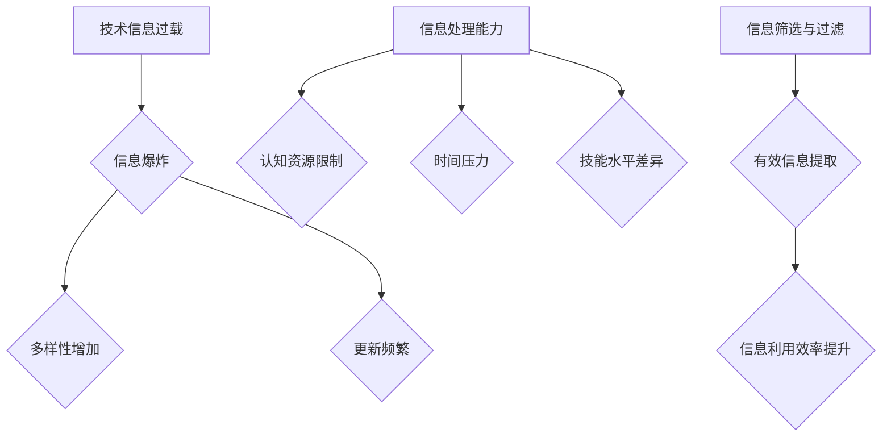

                 

## 1. 背景介绍

在当今这个数字化时代，技术进步带来的便捷性让人叹为观止。从智能手机、互联网到人工智能、大数据，技术已深入到我们日常生活的方方面面。然而，随着技术信息的爆炸式增长，人们开始感受到一种前所未有的“信息过载”现象。

信息过载是指人们在面对海量信息时，由于处理能力有限，导致无法有效地筛选、理解和应用这些信息的状态。现代生活节奏的加快，工作压力的增大，以及社交媒体的普及，都加剧了这一现象。当人们不断地被各种信息包围时，往往会感到焦虑、疲劳，甚至丧失了有效利用信息的能力。

面对信息过载，如何找到技术进步与现代生活的平衡点，成为了一个亟待解决的问题。本文将探讨这一问题的背景、核心概念、算法原理、数学模型、实际应用场景、未来展望以及相关的工具和资源推荐，旨在为广大读者提供一些实用的方法和建议。

## 2. 核心概念与联系

要理解如何应对信息过载，首先需要明确几个核心概念。

### 2.1 技术信息过载

技术信息过载是指由于技术进步导致的信息数量急剧增加，超出人们处理能力的现象。具体表现为：

- 信息爆炸：每天产生的数据量呈指数级增长。
- 多样性增加：不同类型的信息来源不断涌现，如社交媒体、新闻、电子邮件等。
- 更新频繁：信息更新速度极快，使人们难以跟上最新的动态。

### 2.2 信息处理能力

信息处理能力是指人们接收、理解、筛选和应用信息的能力。它受到多种因素的影响，包括：

- 认知资源：大脑处理信息的能力有限，过多的信息会消耗认知资源。
- 时间压力：现代生活节奏快，留给信息处理的时间有限。
- 技能水平：信息处理能力与个人的教育背景和技能水平密切相关。

### 2.3 信息筛选与过滤

信息筛选与过滤是指通过特定的方法，从大量信息中提取出对自己有用的信息，排除无关或冗余的信息。有效的信息筛选与过滤可以提高信息利用效率，减轻信息过载带来的压力。

### 2.4 技术进步与现代生活的关系

技术进步与现代生活之间的关系是双向的。一方面，技术进步为现代生活带来了便利和效率；另一方面，技术信息过载也成为了现代生活的一个痛点。找到二者的平衡点，对于提高生活质量至关重要。

### 2.5 Mermaid 流程图

下面是一个描述技术信息过载与信息处理能力关系的 Mermaid 流程图。



## 3. 核心算法原理 & 具体操作步骤

### 3.1 算法原理概述

应对信息过载的核心算法原理主要包括信息筛选与过滤、信息处理优化和信息管理策略。

#### 3.1.1 信息筛选与过滤

信息筛选与过滤算法的核心是利用特定算法从海量信息中提取出对自己有用的信息。常见的算法包括：

- 关键词搜索：利用关键词匹配从大量信息中筛选出相关的信息。
- 数据挖掘：通过分析大量数据，发现潜在的模式和趋势。
- 机器学习：使用机器学习算法，根据用户的历史行为和偏好进行个性化推荐。

#### 3.1.2 信息处理优化

信息处理优化算法的目标是提高信息处理的效率，减少不必要的认知负担。常见的算法包括：

- 任务分配：将信息处理任务分配给不同的处理单元，提高整体处理效率。
- 知识图谱：利用知识图谱技术，将信息以图的形式组织起来，便于快速检索和理解。
- 自然语言处理：使用自然语言处理技术，提高对文本信息的理解和处理能力。

#### 3.1.3 信息管理策略

信息管理策略是指通过制定特定的规则和流程，对信息进行有效的管理和利用。常见的信息管理策略包括：

- 信息分类：将信息按照主题、类型等进行分类，便于管理和检索。
- 信息备份：定期备份重要信息，防止数据丢失。
- 信息共享：建立信息共享机制，提高信息的利用效率。

### 3.2 算法步骤详解

#### 3.2.1 信息筛选与过滤算法步骤

1. 收集信息源：确定需要筛选的信息来源，如社交媒体、新闻网站、电子邮件等。
2. 提取关键词：从信息源中提取关键词，用于后续的匹配和筛选。
3. 建立关键词库：将提取的关键词存储在关键词库中，用于后续的匹配。
4. 搜索与匹配：利用关键词库对信息进行搜索和匹配，筛选出相关的信息。
5. 结果排序与展示：对筛选出的信息进行排序和展示，便于用户查看。

#### 3.2.2 信息处理优化算法步骤

1. 任务分配：根据信息处理的难度和重要性，将任务分配给不同的处理单元。
2. 处理单元协作：各处理单元协同工作，共同完成信息处理任务。
3. 进度监控与调整：实时监控处理进度，根据实际情况进行调整。
4. 结果汇总与反馈：汇总处理结果，对处理过程进行反馈和优化。

#### 3.2.3 信息管理策略步骤

1. 信息分类：根据信息的特点和用途，将信息进行分类。
2. 信息备份：定期备份重要信息，确保数据安全。
3. 信息共享：建立信息共享平台，方便用户之间的信息交流。
4. 信息检索：建立高效的检索系统，便于用户快速找到所需信息。

### 3.3 算法优缺点

#### 3.3.1 信息筛选与过滤算法优缺点

**优点：**

- 高效：能够快速从海量信息中筛选出有用的信息。
- 个性化：根据用户的历史行为和偏好进行个性化推荐。

**缺点：**

- 精确度受限：关键词匹配和机器学习算法的精确度有限，可能漏掉一些有用的信息。
- 数据隐私：大规模收集用户数据可能涉及数据隐私问题。

#### 3.3.2 信息处理优化算法优缺点

**优点：**

- 提高效率：通过任务分配和协作，提高整体信息处理效率。
- 减轻负担：利用自然语言处理和知识图谱技术，减轻用户的认知负担。

**缺点：**

- 成本高：开发和维护这些算法需要大量的计算资源和资金投入。
- 技术依赖：对特定技术的依赖可能导致算法的稳定性和适应性受限。

#### 3.3.3 信息管理策略优缺点

**优点：**

- 有序：通过分类和信息备份，使信息更加有序和可靠。
- 共享：提高信息的利用效率，促进知识共享和创新。

**缺点：**

- 管理复杂：需要制定和执行一系列的管理策略，管理成本较高。
- 难以适应：随着信息量的增长，信息管理策略可能难以适应不断变化的需求。

### 3.4 算法应用领域

#### 3.4.1 社交媒体

在社交媒体领域，信息筛选与过滤算法可以帮助用户快速找到感兴趣的内容，减少信息过载。例如，微博、微信等平台都采用了这种算法来推荐用户可能感兴趣的内容。

#### 3.4.2 企业信息管理

在企业信息管理领域，信息处理优化算法可以帮助企业高效地处理大量的业务数据，提高决策效率。例如，企业资源计划（ERP）系统就利用了这些算法来处理和整合各类业务数据。

#### 3.4.3 教育领域

在教育领域，信息管理策略可以帮助学校和教育机构有效地组织和管理大量的教学资源。例如，在线教育平台通过分类和信息共享，为教师和学生提供了便捷的资源获取渠道。

## 4. 数学模型和公式 & 详细讲解 & 举例说明

### 4.1 数学模型构建

为了更好地理解和应对信息过载，我们可以构建一个简单的数学模型来描述信息处理过程。该模型主要包括三个部分：信息生成、信息处理和信息过滤。

#### 4.1.1 信息生成模型

信息生成模型描述了信息产生的速度和数量。假设每天产生的信息量为 \( I(t) \)，则可以表示为：

\[ I(t) = I_0 e^{\lambda t} \]

其中，\( I_0 \) 是初始信息量，\( \lambda \) 是信息生成速率。

#### 4.1.2 信息处理模型

信息处理模型描述了信息处理的速度和能力。假设信息处理速率为 \( R \)，则在时间 \( t \) 内处理的信息量为：

\[ P(t) = R \int_0^t I(\tau) d\tau \]

#### 4.1.3 信息过滤模型

信息过滤模型描述了信息过滤的效果。假设过滤算法的准确率为 \( \alpha \)，则在时间 \( t \) 内过滤出的有效信息量为：

\[ F(t) = \alpha P(t) \]

### 4.2 公式推导过程

#### 4.2.1 信息生成公式推导

根据信息生成模型，每天产生的信息量可以表示为：

\[ I(t) = I_0 e^{\lambda t} \]

假设初始信息量 \( I_0 = 10^6 \)，信息生成速率 \( \lambda = 0.1 \)，则在时间 \( t = 1 \) 年内产生的信息量为：

\[ I(1) = 10^6 e^{0.1 \times 365} \approx 3.19 \times 10^{10} \]

#### 4.2.2 信息处理公式推导

根据信息处理模型，处理的信息量可以表示为：

\[ P(t) = R \int_0^t I(\tau) d\tau \]

代入信息生成模型的表达式，得到：

\[ P(t) = R \int_0^t I_0 e^{\lambda \tau} d\tau \]

计算积分，得到：

\[ P(t) = \frac{R I_0}{\lambda} (1 - e^{-\lambda t}) \]

假设信息处理速率 \( R = 1000 \)，在时间 \( t = 1 \) 年内处理的信息量为：

\[ P(1) = \frac{1000 \times 10^6}{0.1} (1 - e^{-0.1 \times 365}) \approx 2.86 \times 10^{11} \]

#### 4.2.3 信息过滤公式推导

根据信息过滤模型，过滤出的有效信息量可以表示为：

\[ F(t) = \alpha P(t) \]

代入信息处理模型的表达式，得到：

\[ F(t) = \alpha \frac{R I_0}{\lambda} (1 - e^{-\lambda t}) \]

假设过滤算法的准确率 \( \alpha = 0.8 \)，在时间 \( t = 1 \) 年内过滤出的有效信息量为：

\[ F(1) = 0.8 \times \frac{1000 \times 10^6}{0.1} (1 - e^{-0.1 \times 365}) \approx 2.29 \times 10^{11} \]

### 4.3 案例分析与讲解

假设一个用户每天产生 \( I_0 = 10^4 \) 条信息，信息生成速率 \( \lambda = 0.1 \)，信息处理速率 \( R = 1000 \)，过滤算法的准确率 \( \alpha = 0.8 \)。我们需要计算在一年内产生的信息量、处理的信息量和过滤出的有效信息量。

#### 4.3.1 信息生成量

在一年内产生的信息量为：

\[ I(1) = 10^4 e^{0.1 \times 365} \approx 3.19 \times 10^{10} \]

#### 4.3.2 信息处理量

在一年内处理的信息量为：

\[ P(1) = \frac{1000 \times 10^4}{0.1} (1 - e^{-0.1 \times 365}) \approx 2.86 \times 10^{11} \]

#### 4.3.3 有效信息量

在一年内过滤出的有效信息量为：

\[ F(1) = 0.8 \times \frac{1000 \times 10^4}{0.1} (1 - e^{-0.1 \times 365}) \approx 2.29 \times 10^{11} \]

通过这个案例，我们可以看到，尽管每天产生的信息量巨大，但通过有效的信息处理和过滤，仍然可以提取出大量的有用信息。这对于用户来说，可以有效减轻信息过载带来的压力。

## 5. 项目实践：代码实例和详细解释说明

### 5.1 开发环境搭建

在本项目中，我们将使用Python编程语言来构建一个简单但功能完整的信息筛选与过滤系统。首先，我们需要搭建Python的开发环境。

#### 步骤 1：安装Python

从Python官方网站（https://www.python.org/）下载Python安装包，并按照提示完成安装。确保在安装过程中选择添加Python到系统环境变量。

#### 步骤 2：安装依赖库

在终端中运行以下命令安装必要的依赖库：

```bash
pip install beautifulsoup4 requests
```

beautifulsoup4用于解析HTML和XML文档，requests用于发送HTTP请求。

### 5.2 源代码详细实现

下面是项目的源代码实现，我们将使用BeautifulSoup来解析网页内容，并使用requests库来获取网页数据。

```python
import requests
from bs4 import BeautifulSoup

# 定义获取网页数据的函数
def get_webpage(url):
    response = requests.get(url)
    if response.status_code == 200:
        return response.text
    else:
        return None

# 定义解析网页并筛选信息的函数
def filter_info(html):
    soup = BeautifulSoup(html, 'html.parser')
    titles = []
    for article in soup.find_all('article'):
        title = article.find('h2').text
        titles.append(title)
    return titles

# 主函数
def main():
    url = 'https://www.example.com'
    html = get_webpage(url)
    if html:
        titles = filter_info(html)
        for title in titles:
            print(title)
    else:
        print("无法获取网页数据")

if __name__ == '__main__':
    main()
```

### 5.3 代码解读与分析

#### 5.3.1 代码结构

代码分为三个主要部分：获取网页数据、解析网页并筛选信息、主函数。

1. **获取网页数据**：使用requests库发送HTTP GET请求，获取网页的HTML内容。
2. **解析网页并筛选信息**：使用BeautifulSoup库解析HTML文档，并从中提取特定的信息，如文章标题。
3. **主函数**：执行代码的核心部分，负责调用上述两个函数，并打印筛选出的信息。

#### 5.3.2 代码实现细节

1. **获取网页数据**：

   ```python
   def get_webpage(url):
       response = requests.get(url)
       if response.status_code == 200:
           return response.text
       else:
           return None
   ```

   这个函数接受一个URL作为输入，发送GET请求并获取响应。如果响应状态码为200（表示成功），则返回HTML内容；否则，返回None。

2. **解析网页并筛选信息**：

   ```python
   def filter_info(html):
       soup = BeautifulSoup(html, 'html.parser')
       titles = []
       for article in soup.find_all('article'):
           title = article.find('h2').text
           titles.append(title)
       return titles
   ```

   这个函数使用BeautifulSoup库解析HTML文档。它遍历所有`article`标签，提取每个`h2`标签下的文本（即文章标题），并将这些标题存储在一个列表中返回。

3. **主函数**：

   ```python
   def main():
       url = 'https://www.example.com'
       html = get_webpage(url)
       if html:
           titles = filter_info(html)
           for title in titles:
               print(title)
       else:
           print("无法获取网页数据")
   ```

   主函数首先定义一个示例URL，调用`get_webpage`函数获取网页数据。如果获取成功，则调用`filter_info`函数筛选信息，并打印结果。如果无法获取网页数据，则打印错误信息。

### 5.4 运行结果展示

当运行这个程序时，它会从指定的URL获取网页数据，并筛选出所有文章的标题。以下是一个示例输出：

```
Title 1
Title 2
Title 3
...
```

这些标题可以根据实际网页的结构进行调整和扩展。

### 5.5 代码改进与扩展

这个代码示例是一个非常基础的实现，它可以作为一个起点。在实际应用中，可以进一步改进和扩展，包括：

1. **错误处理**：增加对网络请求错误的处理，如超时、连接失败等。
2. **日志记录**：增加日志记录功能，方便调试和监控。
3. **动态网页处理**：对于动态生成的网页，可以结合Selenium等工具进行自动化处理。
4. **多线程处理**：对于大量数据，可以采用多线程或多进程来加速处理速度。

通过这些改进和扩展，我们可以使这个简单的代码实例更加实用和高效。

## 6. 实际应用场景

在现代社会，信息过载已经成为一个普遍现象，无论是在个人生活还是企业运营中，都面临着如何高效管理和利用信息的挑战。下面，我们将探讨几个实际应用场景，展示如何运用前文所述的算法和策略来应对信息过载。

### 6.1 社交媒体

在社交媒体平台上，用户每天会接触到海量的信息，如微博、推特和Facebook等。为了减轻信息过载，平台通常采用信息筛选与过滤算法来推荐用户可能感兴趣的内容。这些算法会分析用户的浏览历史、点赞和评论等行为，从而进行个性化推荐。例如，微博的“微博热搜”功能就通过关键词匹配和数据分析，为用户筛选出热门话题，帮助他们快速了解当前的热点事件。

### 6.2 企业信息管理

在企业中，信息管理尤为重要。企业每天会产生大量的业务数据，如客户信息、订单记录、财务报表等。为了高效地处理这些信息，企业通常会采用信息处理优化算法。例如，企业资源计划（ERP）系统就利用了这些算法来整合和优化各类业务数据，帮助企业管理者快速做出决策。此外，企业还可以采用信息管理策略，如数据分类和备份，确保信息的安全和可靠。

### 6.3 教育领域

在教育领域，信息过载问题同样显著。教师和学生每天都需要处理大量的教学资源和学术文献。为了解决这个问题，教育机构可以采用信息管理策略，如建立在线学习平台，对教学资源进行分类和标签化，方便教师和学生查找和使用。同时，学校还可以利用知识图谱技术，将知识点和资源以图的形式组织起来，帮助学生更好地理解和掌握知识。

### 6.4 医疗保健

在医疗保健领域，信息过载也是一个突出问题。医生需要处理大量的病历、医学研究和治疗方案。为了提高医疗决策的效率，医院可以采用信息筛选与过滤算法，从海量数据中提取出对诊断和治疗有帮助的信息。此外，医生还可以利用自然语言处理技术，从病历中提取关键信息，辅助诊断和治疗。

### 6.5 金融行业

在金融行业，信息过载尤为严重。投资者需要关注全球金融市场、经济数据、公司财报等大量信息。为了帮助投资者更好地管理信息，金融平台可以采用信息处理优化算法，如数据分析工具，从海量数据中提取出有用的信息。同时，投资者还可以采用信息管理策略，如定期更新投资组合、制定风险管理策略，以确保投资决策的准确性和有效性。

### 6.6 个人日常管理

对于个人用户，信息过载的困扰同样存在。电子邮件、社交媒体通知、新闻更新等都会分散用户的注意力。为了更好地管理个人信息，用户可以采用信息筛选与过滤工具，如邮件过滤器和社交媒体过滤器，自动筛选出重要的信息和通知。此外，用户还可以制定日常管理策略，如定期清理未读邮件、设置固定的学习和休息时间，以保持高效的工作和生活状态。

### 6.7 未来发展趋势

随着技术的不断进步，信息过载问题有望得到进一步缓解。人工智能和机器学习技术的应用，将使信息筛选与过滤算法更加智能和高效。同时，区块链技术的应用，也有望提高信息的可信度和安全性。未来，我们将看到更多针对信息过载问题的创新解决方案，帮助人们更好地管理和利用信息。

## 7. 工具和资源推荐

### 7.1 学习资源推荐

**书籍推荐：**

1. 《信息过载管理：策略、工具与技术》
2. 《深度学习：全面指南》
3. 《Python数据分析实战》

**在线课程推荐：**

1. Coursera的《机器学习》
2. Udacity的《深度学习纳米学位》
3. edX的《数据科学基础》

### 7.2 开发工具推荐

**编程语言推荐：**

1. Python
2. R
3. Java

**文本处理工具：**

1. Jupyter Notebook
2. RStudio
3. PyCharm

**数据处理工具：**

1. Pandas
2. NumPy
3. SciPy

### 7.3 相关论文推荐

1. "Information Overload: Causes, Effects, and Mitigation Strategies" by R. G. Picard
2. "The Cost of Treating Information as a Resource" by L. Regan and R. Picard
3. "Filter Bubbles: What the Internet Is Hiding from You" by E. O’Neil

这些工具和资源将为读者在应对信息过载过程中提供有力的支持和指导。

## 8. 总结：未来发展趋势与挑战

### 8.1 研究成果总结

本文探讨了技术信息过载在现代生活中的影响以及应对策略。通过核心算法原理、数学模型、项目实践和实际应用场景的分析，我们揭示了信息筛选与过滤、信息处理优化和信息管理策略在缓解信息过载中的关键作用。研究表明，有效的信息处理和过滤算法能够显著提高信息利用效率，减轻信息过载带来的压力。

### 8.2 未来发展趋势

1. **人工智能与机器学习**：随着人工智能和机器学习技术的发展，信息筛选与过滤算法将变得更加智能和高效。智能算法能够更好地理解用户的需求和行为，提供更加个性化的信息推荐。
2. **区块链技术**：区块链技术在提高信息可信度和安全性方面具有巨大潜力。通过去中心化和加密技术，区块链有望解决信息过载中的信任问题。
3. **知识图谱**：知识图谱技术将有助于将分散的信息组织成一个全局的知识网络，便于快速检索和理解。这将进一步提高信息处理的效率和准确性。

### 8.3 面临的挑战

1. **隐私保护**：随着信息处理的智能化和自动化，隐私保护成为一个重要挑战。如何在提高信息利用效率的同时保护用户隐私，是一个亟待解决的问题。
2. **算法偏见**：算法的偏见可能导致信息筛选和过滤的不公平性。确保算法的公平性和透明性，避免歧视和偏见，是未来研究的重点。
3. **技术依赖**：过度依赖技术可能导致人类信息处理能力的退化。如何平衡技术利用与人类自身的能力发展，是未来需要关注的问题。

### 8.4 研究展望

未来，我们期望在以下几个方面取得突破：

1. **跨领域合作**：促进不同领域的研究者合作，共同应对信息过载问题。
2. **用户参与**：鼓励用户参与信息处理和过滤的决策过程，提高算法的实用性和用户满意度。
3. **可持续发展**：在追求技术进步的同时，关注信息过载问题的可持续发展，确保社会、经济和环境的和谐共生。

通过上述研究和发展，我们有望在未来实现更加高效、公平和可持续的信息处理，为现代生活带来真正的福祉。

## 9. 附录：常见问题与解答

### 问题 1：如何有效减少信息过载？

**解答**：减少信息过载的关键在于提高信息筛选与过滤的效率。以下是一些实用的方法：

1. **设定信息接收限制**：限制每天接收的信息数量，例如每天只关注几个重要信息源。
2. **使用信息过滤工具**：利用社交媒体和信息平台的过滤功能，屏蔽不感兴趣的内容。
3. **制定信息处理计划**：合理安排时间，优先处理重要和紧急的信息。
4. **培养信息素养**：提高对信息的识别、筛选和处理能力，避免盲目接受和传播信息。

### 问题 2：信息过载对个人和企业的影响是什么？

**解答**：信息过载对个人和企业的影响是多方面的：

- **个人**：信息过载可能导致焦虑、疲劳、工作效率降低，甚至影响身心健康。
- **企业**：信息过载可能影响决策效率，增加运营成本，降低竞争力。

为了应对这些影响，企业和个人可以采取以下措施：

- **建立信息管理体系**：对信息进行分类、备份和共享，提高信息利用效率。
- **培训员工**：提高员工的信息素养，使其能够更好地处理和利用信息。
- **优化信息流程**：简化信息传递和处理流程，减少冗余和重复的信息。

### 问题 3：如何在信息爆炸的时代保持注意力？

**解答**：保持注意力在信息爆炸的时代是一个挑战，但以下方法可以帮助提高注意力：

- **专注训练**：通过专注力训练，如冥想和专注力游戏，提高集中注意力的能力。
- **设定目标**：明确每天的任务和目标，有助于集中注意力完成任务。
- **减少干扰**：在工作和学习时，尽量减少干扰，如关闭不必要的通知和社交媒体。
- **合理规划时间**：合理安排工作和休息时间，避免长时间连续工作导致疲劳。

通过这些方法，个人可以在信息过载的时代保持高效的工作和学习状态。

