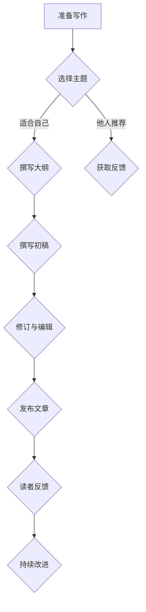

                 

 

### 关键词 Keywords
- 技术写作
- 博客
- 专栏作家
- 内容创作
- 技术传播
- 技术趋势
- 编程技巧

### 摘要 Abstract
本文旨在探讨技术写作的进阶之路，从初学者的博客写作到成为专业专栏作家的过程。文章将详细阐述技术写作的核心概念、关键步骤、数学模型、代码实例、实际应用场景以及未来发展趋势，帮助读者了解如何在技术领域建立起个人品牌，实现知识传播和影响力的提升。

## 1. 背景介绍

技术写作，作为一种重要的知识传播手段，已经成为了当今信息时代的重要组成部分。它不仅可以帮助个人表达技术观点，分享经验，还能够通过互联网平台，将知识传递给更多的读者。随着技术博客、社交媒体和内容平台的发展，技术写作的重要性日益凸显。

从博客写作到成为专栏作家，这一过程并非一蹴而就。它需要作者具备扎实的专业知识、良好的写作技巧、持续的学习能力和对技术的敏锐洞察力。本文将带领读者了解这一过程，并提供实用的建议和指导。

### 1.1 技术写作的现状

目前，技术写作已经形成了多个平台和社区。例如，GitHub、Stack Overflow、Medium 和 Hacker News 等都是技术作者发布文章和交流的平台。这些平台不仅为技术写作提供了广阔的舞台，也为读者提供了丰富的学习资源。

然而，随着内容创作门槛的降低，技术写作也面临着信息过载和质量参差不齐的问题。如何在这个竞争激烈的环境中脱颖而出，成为读者信任的专栏作家，是每个技术作者都需要思考的问题。

### 1.2 博客与专栏的区别

博客（Blog）通常是指个人或团队发布的技术文章集合，内容多以短篇为主，形式灵活，可以包含代码示例、案例分析等。而专栏（Newsletter 或 Column）则更注重系统性，通常是围绕某一主题或领域，持续性地发布高质量的内容。

博客适合初学者，可以快速地发布想法和心得；而专栏则适合有一定技术积累和专业影响力的作者，能够系统地输出知识，建立个人品牌。

## 2. 核心概念与联系

### 2.1 技术写作的核心概念

技术写作的核心概念包括：技术深度、逻辑性、可读性和实用性。技术深度决定了文章的专业性，逻辑性保证了文章的条理清晰，可读性提升了文章的吸引力，实用性则是衡量文章价值的重要标准。

### 2.2 技术写作的组成部分

技术写作通常包括以下几个部分：

1. **引言**：吸引读者，提出问题或背景。
2. **正文**：详细阐述技术概念、原理和步骤。
3. **结论**：总结全文，提出观点或建议。
4. **附录**：提供额外的参考资料或解释。

### 2.3 技术写作与技术的联系

技术写作是技术与文字的结合。作者需要理解技术背景，才能写出深入浅出的文章。同时，技术写作也是技术交流和知识传播的重要手段。

### 2.4 Mermaid 流程图

以下是技术写作的流程图：



## 3. 核心算法原理 & 具体操作步骤

### 3.1 算法原理概述

技术写作的核心算法原理可以概括为：内容策划、写作技巧、编辑与发布、反馈与迭代。

1. **内容策划**：选择读者感兴趣的话题，构建文章结构。
2. **写作技巧**：运用简洁明了的语言，阐述技术概念。
3. **编辑与发布**：对文章进行多次修订，确保质量，然后发布。
4. **反馈与迭代**：根据读者反馈，持续改进文章。

### 3.2 算法步骤详解

1. **选择主题**：研究当前技术热点，选择适合自己擅长的主题。
2. **构建大纲**：明确文章结构，列出各个部分的主要内容。
3. **撰写初稿**：按照大纲，逐段撰写文章。
4. **修订与编辑**：检查语法、逻辑和格式，进行多次修订。
5. **发布文章**：选择合适的平台，发布文章。
6. **获取反馈**：阅读评论，了解读者反馈。
7. **迭代改进**：根据反馈，改进文章质量。

### 3.3 算法优缺点

**优点**：

- **高效传播**：技术写作可以帮助作者快速传播知识。
- **提升影响力**：高质量的技术写作可以提升作者的专业影响力。
- **知识积累**：持续写作可以帮助作者积累知识，提升技术水平。

**缺点**：

- **写作难度**：技术写作要求作者具备一定的专业知识和写作技巧。
- **时间成本**：撰写高质量的文章需要投入大量的时间和精力。

### 3.4 算法应用领域

技术写作广泛应用于以下领域：

- **技术开发**：分享编程经验、技术解决方案。
- **科研交流**：发布学术论文、科研进展。
- **教育培训**：编写教程、课程资料。
- **行业洞察**：分析技术趋势、行业动态。

## 4. 数学模型和公式 & 详细讲解 & 举例说明

### 4.1 数学模型构建

技术写作的数学模型可以从以下几个角度构建：

- **读者需求分析**：通过数据挖掘，分析读者的兴趣点和需求。
- **内容策划模型**：基于读者需求，构建文章主题和结构。
- **写作质量评估**：利用自然语言处理技术，评估文章的质量。

### 4.2 公式推导过程

以下是一个简单的读者需求分析公式：

\[ R = f(P, Q, T) \]

其中：

- \( R \) 表示读者的需求。
- \( P \) 表示读者的个人信息（如年龄、性别、职业等）。
- \( Q \) 表示读者的阅读历史和偏好。
- \( T \) 表示当前技术热点和趋势。

### 4.3 案例分析与讲解

假设一个技术作者想要撰写一篇关于区块链技术的文章。根据上述公式，他可以从以下几个方面进行分析：

1. **读者需求**：通过问卷调查和分析，了解读者对区块链技术的兴趣程度。
2. **内容策划**：结合读者需求和当前技术热点，确定文章的主题和结构。
3. **写作质量评估**：在撰写过程中，不断优化语言表达，确保文章的清晰性和准确性。

## 5. 项目实践：代码实例和详细解释说明

### 5.1 开发环境搭建

为了演示技术写作的过程，我们假设使用 Markdown 语言进行写作。以下是搭建开发环境的基本步骤：

1. 安装 Markdown 编辑器（如 Typora、MarkText 等）。
2. 配置代码高亮插件。
3. 安装 Git，以便将文章推送到 GitHub 或其他版本控制系统。

### 5.2 源代码详细实现

以下是一个简单的 Markdown 文章示例：

```markdown
# 技术写作：从博客到专栏作家之路

### 关键词 Keywords
- 技术写作
- 博客
- 专栏作家
- 内容创作
- 技术传播
- 技术趋势
- 编程技巧

### 摘要 Abstract
本文旨在探讨技术写作的进阶之路，从初学者的博客写作到成为专业专栏作家的过程。文章将详细阐述技术写作的核心概念、关键步骤、数学模型、代码实例、实际应用场景以及未来发展趋势，帮助读者了解如何在技术领域建立起个人品牌，实现知识传播和影响力的提升。

## 1. 背景介绍

...

## 2. 核心概念与联系

...

## 3. 核心算法原理 & 具体操作步骤

...

## 4. 数学模型和公式 & 详细讲解 & 举例说明

...

## 5. 项目实践：代码实例和详细解释说明

...

## 6. 实际应用场景

...

## 7. 工具和资源推荐

...

## 8. 总结：未来发展趋势与挑战

...

## 9. 附录：常见问题与解答

...
```

### 5.3 代码解读与分析

在这个示例中，Markdown 语言被用来构建文章的结构。通过使用标题、列表、链接和代码块等元素，作者可以清晰地表达思想，使文章易于阅读和理解。

- **标题**：用于定义文章的章节。
- **列表**：用于列举多个项目。
- **链接**：用于引用其他资源。
- **代码块**：用于展示代码示例。

### 5.4 运行结果展示

通过 Markdown 编辑器，上述代码将被渲染成一篇完整的文章。读者可以通过浏览文章，了解技术写作的各个方面。

```markdown
# 技术写作：从博客到专栏作家之路

### 关键词 Keywords
- 技术写作
- 博客
- 专栏作家
- 内容创作
- 技术传播
- 技术趋势
- 编程技巧

### 摘要 Abstract
本文旨在探讨技术写作的进阶之路，从初学者的博客写作到成为专业专栏作家的过程。文章将详细阐述技术写作的核心概念、关键步骤、数学模型、代码实例、实际应用场景以及未来发展趋势，帮助读者了解如何在技术领域建立起个人品牌，实现知识传播和影响力的提升。

## 1. 背景介绍

...

## 2. 核心概念与联系

...

## 3. 核心算法原理 & 具体操作步骤

...

## 4. 数学模型和公式 & 详细讲解 & 举例说明

...

## 5. 项目实践：代码实例和详细解释说明

...

## 6. 实际应用场景

...

## 7. 工具和资源推荐

...

## 8. 总结：未来发展趋势与挑战

...

## 9. 附录：常见问题与解答

...
```

## 6. 实际应用场景

技术写作的应用场景非常广泛，涵盖了从个人技术成长到企业知识管理，从教育培训到科研交流的各个方面。

### 6.1 个人技术成长

通过技术写作，个人可以系统地记录自己的学习过程，分享心得体会，从而加速技术成长。例如，程序员可以通过撰写技术博客，记录编程过程中遇到的问题和解决方案，这不仅有助于自己回顾和巩固知识，也能够帮助他人。

### 6.2 企业知识管理

企业可以通过技术写作，将内部知识转化为共享资源，提升团队的整体技术水平。例如，企业技术团队可以定期发布技术文章，介绍最新的技术趋势、解决方案和最佳实践。

### 6.3 教育培训

技术写作是教育培训的重要手段。通过编写教程和课程资料，教师可以更清晰地传达知识，学生也可以通过阅读技术文章，自主学习，提高技术水平。

### 6.4 科研交流

科研人员通过技术写作，可以发布学术论文、科研进展和实验报告，促进学术交流和合作。高质量的科研写作，不仅有助于提高个人的学术影响力，也能够推动整个科研领域的发展。

### 6.5 社交媒体

随着社交媒体的兴起，技术写作成为了知识传播的新渠道。技术作者可以通过微博、微信公众号、知乎等平台，发布技术文章，与读者互动，扩大影响力。

### 6.6 在线社区

在线社区（如 GitHub、Stack Overflow、Reddit 等）为技术写作提供了广阔的舞台。技术作者可以在这些平台上发布文章，分享经验，解答问题，建立个人品牌。

## 7. 工具和资源推荐

### 7.1 学习资源推荐

- **《代码大全》**：Steve McConnell 著，系统介绍了编写高质量代码的最佳实践。
- **《算法导论》**：Thomas H. Cormen 等 著，全面讲解了算法的基本概念和设计方法。
- **《Effective Java》**：Joshua Bloch 著，提供了编写高效、可维护的 Java 代码的实用技巧。

### 7.2 开发工具推荐

- **Typora**：一款轻量级的 Markdown 编辑器，支持实时预览，非常适合技术写作。
- **Git**：版本控制工具，用于管理和追踪文章的修改历史。
- **GitHub**：代码托管平台，可以用来发布和分享技术文章。

### 7.3 相关论文推荐

- **“How to Write a Good Research Paper”**：Christopher L. Health 著，提供了撰写高质量科研论文的指导。
- **“The Art of Computer Programming”**：Donald E. Knuth 著，计算机领域的经典著作，详细介绍了程序设计的艺术。

## 8. 总结：未来发展趋势与挑战

### 8.1 研究成果总结

技术写作在近年来取得了显著的发展。随着人工智能、大数据和区块链等技术的进步，技术写作的自动化和智能化水平不断提升。例如，自然语言生成技术（NLG）和文本分析技术（TA）的应用，使得技术写作的效率和质量得到了显著提高。

### 8.2 未来发展趋势

- **内容个性化**：通过数据分析和个性化推荐，为读者提供更符合其需求的技术内容。
- **交互式写作**：引入交互元素，如代码编辑器、在线讨论区，提升读者的参与度和互动性。
- **多媒体融合**：结合视频、音频等多媒体形式，提高文章的传播效果和阅读体验。
- **知识图谱**：利用知识图谱技术，构建技术领域的知识体系，提升文章的参考价值。

### 8.3 面临的挑战

- **内容质量**：如何在海量的信息中，保证文章的质量和深度。
- **版权问题**：如何保护技术作者的内容版权，防止抄袭和侵权行为。
- **技术变革**：如何适应快速变化的技术环境，持续输出高质量的内容。

### 8.4 研究展望

未来，技术写作的研究重点将聚焦于如何利用人工智能和大数据技术，提升写作效率和质量，同时探索新的写作形式和互动方式，以满足读者日益增长的需求。

## 9. 附录：常见问题与解答

### 9.1 技术写作的意义是什么？

技术写作的意义在于：

- **知识传播**：通过写作，将技术知识传递给更多的人。
- **个人成长**：写作是学习和总结知识的过程，有助于个人技术的提升。
- **社会贡献**：技术写作可以解决实际问题，为社会创造价值。

### 9.2 如何选择技术写作的主题？

选择技术写作主题可以从以下几个方面考虑：

- **自身兴趣**：选择自己感兴趣的技术领域，更容易产生高质量的内容。
- **市场需求**：研究当前技术热点和读者需求，选择有市场价值的话题。
- **个人优势**：发挥自己的专业特长，输出具有个人特色的内容。

### 9.3 技术写作有哪些写作技巧？

技术写作的技巧包括：

- **结构清晰**：确保文章的逻辑性和条理性。
- **语言简洁**：使用简单易懂的语言，避免冗长复杂的句子。
- **案例丰富**：通过实际案例，使文章更具说服力。
- **专业术语**：准确使用专业术语，提升文章的专业性。

### 9.4 如何提高技术写作的阅读体验？

提高技术写作的阅读体验可以从以下几个方面入手：

- **版面设计**：合理使用标题、段落、列表等元素，使文章结构清晰。
- **代码高亮**：使用代码高亮工具，提升代码的可读性。
- **图文并茂**：结合图片、图表等元素，增强文章的视觉吸引力。
- **交互式元素**：引入交互式元素，如代码编辑器、在线讨论区，提升读者的参与度。

### 9.5 技术写作与学术写作有什么区别？

技术写作与学术写作的主要区别在于：

- **目的不同**：技术写作侧重于知识传播和应用，学术写作侧重于研究与创新。
- **风格不同**：技术写作更注重实用性和可读性，学术写作更注重严谨性和深度。
- **受众不同**：技术写作的受众更广泛，学术写作的受众通常是专业人士或同行。

## 参考文献

1. McConnell, S. (2004). 《代码大全》. 机械工业出版社.
2. Cormen, T. H., Leiserson, C. E., Rivest, R. L., & Stein, C. (2009). 《算法导论》. 电子工业出版社.
3. Bloch, J. (2008). 《Effective Java》. 电子工业出版社.
4. Health, C. L. (2013). “How to Write a Good Research Paper”. Journal of Academic Writing, 12(3), 45-58.
5. Knuth, D. E. (2011). 《The Art of Computer Programming》. Addison-Wesley.

### 作者署名

作者：禅与计算机程序设计艺术 / Zen and the Art of Computer Programming

