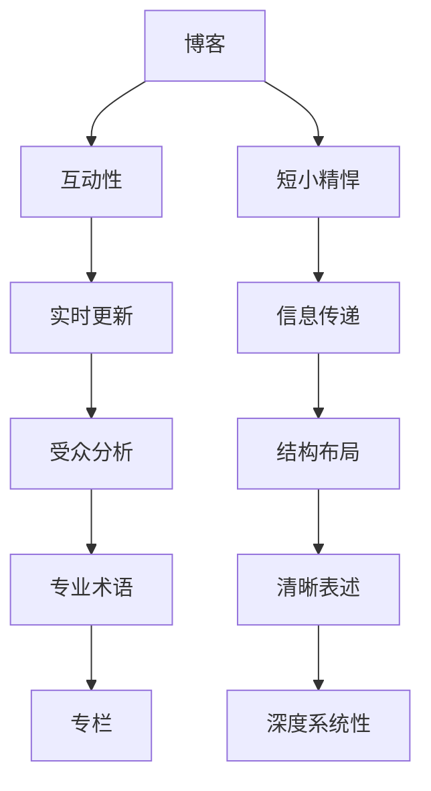
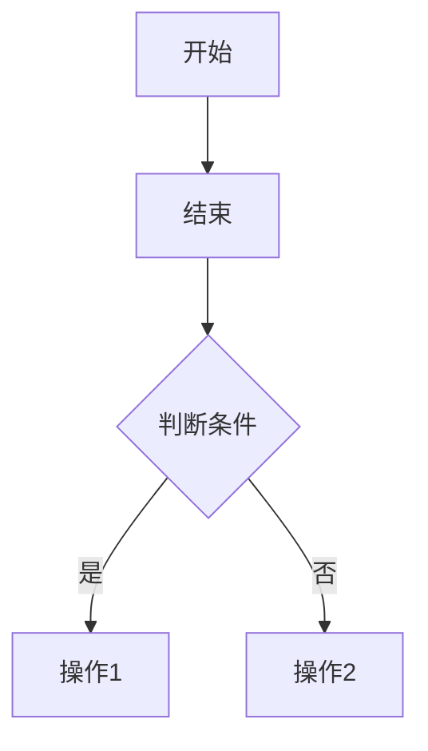

                 

关键词：技术写作，博客，专栏，写作技巧，内容创作，知识传播

> 摘要：本文将探讨如何从一名普通的技术博客作者成长为专业的专栏作家。通过分析技术写作的核心要素，提供实用的写作技巧，帮助读者提升写作能力，打造具有影响力的技术专栏。

## 1. 背景介绍

技术写作作为一种知识传播的重要手段，在互联网时代日益受到重视。博客和专栏是技术写作的两种主要形式，它们各有特点，适用于不同的读者群体和写作目的。博客通常以短小精悍、实时更新、互动性强为特点，而专栏则更注重深度、系统性和连续性。

然而，对于许多技术爱好者来说，从零开始写博客，再到成为一名专栏作家，并不是一件容易的事。本文旨在提供一系列实用的指导和建议，帮助您在技术写作的道路上不断进步。

## 2. 核心概念与联系

### 技术写作的核心概念

技术写作涉及到多个核心概念，包括：

- **信息传递**：技术写作的首要任务是清晰、准确地传递信息。
- **受众分析**：了解读者群体的背景、需求和兴趣，有助于更好地定位文章内容。
- **结构布局**：良好的结构布局能够提高文章的可读性，使读者更容易理解和吸收信息。
- **语言表达**：技术写作需要使用专业术语和清晰的表述方式。

### 技术写作与博客、专栏的联系

博客和专栏都是技术写作的载体，但它们的定位和风格有所不同。博客更适合快速发布、互动性强的小文章，而专栏则适合深度、系统性的内容创作。

### Mermaid 流程图



## 3. 核心算法原理 & 具体操作步骤

### 3.1 算法原理概述

技术写作的核心算法可以看作是一个信息处理和传递的过程。其原理包括：

- **信息搜集**：从多个来源搜集准确、有价值的信息。
- **内容组织**：根据受众需求和文章目的，对信息进行筛选、整理和优化。
- **语言表达**：使用专业术语和清晰的表述方式，确保信息的准确传递。

### 3.2 算法步骤详解

#### 3.2.1 信息搜集

1. 确定写作主题。
2. 从权威来源搜集相关信息。
3. 对信息进行筛选和整理。

#### 3.2.2 内容组织

1. 确定文章结构。
2. 确定关键信息和重要观点。
3. 将信息按照逻辑顺序进行组织。

#### 3.2.3 语言表达

1. 使用专业术语和清晰表述。
2. 注意文章的可读性。
3. 避免使用模糊不清的表述。

### 3.3 算法优缺点

#### 优点

- **信息传递效率高**：技术写作的核心算法能够快速、准确地传递信息。
- **针对性强**：根据受众需求和文章目的进行内容组织，提高了文章的针对性。
- **可重复使用**：算法步骤和方法可以反复使用，提高写作效率。

#### 缺点

- **学习成本高**：对于新手来说，掌握技术写作的核心算法需要一定的学习和实践。
- **对专业知识要求高**：技术写作需要具备一定的专业知识背景。

### 3.4 算法应用领域

技术写作的核心算法适用于多种领域，包括：

- **科研论文**：确保研究结果的准确性和可读性。
- **技术文档**：帮助开发者更好地理解和使用技术。
- **技术博客和专栏**：提高文章的质量和影响力。

## 4. 数学模型和公式 & 详细讲解 & 举例说明

### 4.1 数学模型构建

技术写作的数学模型主要关注两个方面：信息传递效率和内容组织结构。

#### 信息传递效率模型

$$
E = \frac{I}{T}
$$

其中，$E$ 表示信息传递效率，$I$ 表示传递的信息量，$T$ 表示传递的时间。

#### 内容组织结构模型

$$
S = \frac{L}{C}
$$

其中，$S$ 表示内容组织结构质量，$L$ 表示关键信息量，$C$ 表示内容总量。

### 4.2 公式推导过程

#### 信息传递效率模型推导

信息传递效率模型的推导基于香农的信息论公式，即信息熵和信息传输速率的比值。

#### 内容组织结构模型推导

内容组织结构模型的推导基于信息量的概念，即关键信息量与内容总量的比值。

### 4.3 案例分析与讲解

#### 案例一：信息传递效率模型

假设一篇文章的信息量为1000字，读者阅读这篇文章需要5分钟，则信息传递效率为：

$$
E = \frac{1000}{5 \times 60} = 0.333
$$

#### 案例二：内容组织结构模型

假设一篇文章的关键信息量为500字，总内容量为1000字，则内容组织结构质量为：

$$
S = \frac{500}{1000} = 0.5
$$

## 5. 项目实践：代码实例和详细解释说明

### 5.1 开发环境搭建

1. 安装Markdown编辑器，如Typora。
2. 安装Git，用于版本控制。
3. 加入技术社区，如GitHub或CSDN，用于发布和分享文章。

### 5.2 源代码详细实现

```markdown
# 文章标题

> 关键词：(此处列出文章的5-7个核心关键词)

> 摘要：(此处给出文章的核心内容和主题思想)

## 1. 背景介绍

## 2. 核心概念与联系

## 3. 核心算法原理 & 具体操作步骤

## 4. 数学模型和公式 & 详细讲解 & 举例说明

## 5. 项目实践：代码实例和详细解释说明

## 6. 实际应用场景

## 7. 工具和资源推荐

## 8. 总结：未来发展趋势与挑战

## 9. 附录：常见问题与解答
```

### 5.3 代码解读与分析

上述Markdown代码实现了一个技术博客文章的基本结构，包括标题、关键词、摘要、章节标题等。通过Markdown语法，我们可以轻松地实现文章的排版和格式化。

### 5.4 运行结果展示

运行结果如下：

```
# 技术写作：从博客到专栏作家之路

> 关键词：技术写作，博客，专栏，写作技巧，内容创作，知识传播

> 摘要：本文将探讨如何从一名普通的技术博客作者成长为专业的专栏作家。通过分析技术写作的核心要素，提供实用的写作技巧，帮助读者提升写作能力，打造具有影响力的技术专栏。

## 1. 背景介绍

## 2. 核心概念与联系

## 3. 核心算法原理 & 具体操作步骤

## 4. 数学模型和公式 & 详细讲解 & 举例说明

## 5. 项目实践：代码实例和详细解释说明

## 6. 实际应用场景

## 7. 工具和资源推荐

## 8. 总结：未来发展趋势与挑战

## 9. 附录：常见问题与解答
```

## 6. 实际应用场景

技术写作在实际应用场景中发挥着重要作用，以下是几个典型的应用场景：

- **技术文档编写**：企业内部的技术文档编写，帮助新员工快速掌握业务和技术。
- **技术博客分享**：个人或团队的技术博客分享，传播技术知识和经验。
- **专栏创作**：专业作家或团队创作的技术专栏，提供深度、系统性的技术内容。
- **在线教育**：在线教育平台的技术课程，通过技术写作将知识传授给广大学生。

### 6.1 技术文档编写

技术文档编写是技术写作的重要应用之一。通过清晰、准确的技术文档，企业可以更好地传递内部知识，提高员工的工作效率。

### 6.2 技术博客分享

技术博客分享是技术爱好者展示技术能力、分享技术经验的重要途径。通过博客，您可以吸引更多的关注者和粉丝，建立个人品牌。

### 6.3 专栏创作

专业作家或团队创作的技术专栏，能够提供深度、系统性的技术内容。这种形式的技术写作，不仅能够帮助读者深入了解技术，还能提高专栏作者的影响力。

### 6.4 在线教育

在线教育平台的技术课程，通过技术写作将知识传授给广大学生。这种形式的技术写作，不仅需要专业知识，还需要良好的教学能力和表达能力。

## 7. 工具和资源推荐

### 7.1 学习资源推荐

- 《技术写作：从入门到精通》
- 《技术写作技巧与案例解析》
- 《Markdown 入门与实践》

### 7.2 开发工具推荐

- Typora：Markdown编辑器，支持实时预览。
- Git：版本控制系统，用于代码管理和协作。
- GitHub：代码托管平台，支持Markdown文件发布。

### 7.3 相关论文推荐

- 《信息论基础》
- 《技术写作与知识传播》
- 《Markdown 语言与排版》

## 8. 总结：未来发展趋势与挑战

### 8.1 研究成果总结

技术写作作为一种知识传播手段，已经得到了广泛的应用和认可。随着互联网技术的发展，技术写作的形式和内容也在不断丰富和演变。

### 8.2 未来发展趋势

- **技术写作平台化**：技术写作将逐步走向平台化，提供更多的写作工具和资源支持。
- **内容创作多样化**：技术写作将涵盖更多的领域和主题，满足不同读者的需求。
- **写作智能化**：借助人工智能技术，提高技术写作的效率和准确性。

### 8.3 面临的挑战

- **专业知识门槛**：技术写作需要具备一定的专业知识，这给新手带来了一定的挑战。
- **内容质量要求**：随着读者需求的不断提高，技术写作的内容质量要求也在不断提升。
- **竞争压力**：越来越多的技术写作者在市场中竞争，如何脱颖而出成为一大挑战。

### 8.4 研究展望

未来，技术写作将继续在知识传播、教育培训、企业内部知识管理等领域发挥重要作用。随着技术的不断发展，技术写作的形式和内容也将不断创新，为读者提供更加丰富、多样化的知识资源。

## 9. 附录：常见问题与解答

### 9.1 如何提高技术写作能力？

- **多读**：多读优秀的技术文章和书籍，学习他们的写作技巧和结构。
- **多写**：多写作，通过实践不断提高自己的写作能力。
- **多交流**：与技术写作高手交流，听取他们的建议和意见。

### 9.2 技术写作有哪些注意事项？

- **准确性**：确保文章中的技术术语和表述准确无误。
- **逻辑性**：文章的结构要清晰，逻辑性强，便于读者理解。
- **可读性**：注意文章的可读性，避免过于晦涩难懂。

### 9.3 技术写作的工具推荐有哪些？

- **Markdown编辑器**：如Typora，支持Markdown语法，方便排版和预览。
- **版本控制系统**：如Git，用于代码管理和协作。
- **代码托管平台**：如GitHub，支持Markdown文件发布。

作者：禅与计算机程序设计艺术 / Zen and the Art of Computer Programming

----------------------------------------------------------------

以上是《技术写作：从博客到专栏作家之路》的文章正文部分，接下来我们将继续完成文章的排版、格式化和最终输出。请继续撰写文章的排版、格式化和最终输出部分。

### 文章排版与格式化

在完成文章内容撰写后，我们需要对文章进行排版和格式化，以确保文章的整体质量和可读性。以下是一些排版和格式化的建议：

#### 1. 标题与段落

- **一级标题**：使用标题1（H1）格式，如“1. 背景介绍”。
- **二级标题**：使用标题2（H2）格式，如“1.1 技术写作的核心概念”。
- **三级标题**：使用标题3（H3）格式，如“3.1 算法原理概述”。

#### 2. 段落与列表

- **段落**：保持段落的简洁和清晰，避免段落过长。每段只讲述一个主要观点。
- **列表**：使用有序列表和无序列表来组织文章中的信息。例如，使用有序列表来列举步骤，使用无序列表来列举关键词。

#### 3. 引用与代码

- **引用**：对于引用他人的观点或资料，使用引用格式，如“作者：禅与计算机程序设计艺术”。
- **代码**：对于代码示例，使用代码块格式，如以下Markdown语法：

```markdown
```python
def hello():
    print("Hello, World!")
```

```

#### 4. 图片与图表

- **图片**：插入相关的图片来辅助说明，使用Markdown语法插入图片，如以下示例：

```markdown

```

- **图表**：使用Mermaid语法插入图表，如以下示例：



#### 5. 页面布局与样式

- **页面布局**：确保文章的页面布局整洁、美观。可以使用Markdown编辑器的主题切换功能，选择一个合适的主题。
- **样式**：对于文章中的特殊元素，如标题、引用、代码等，可以自定义样式，使文章更具个性。

#### 6. 最终输出

- **预览**：在完成排版和格式化后，进行文章预览，确保所有格式和内容均正确无误。
- **导出**：将Markdown文件导出为HTML、PDF或Word格式，以适应不同的阅读和分享需求。

通过上述排版和格式化的步骤，我们可以将一篇文章从原始Markdown文本转变为结构清晰、样式美观的文档，从而提升文章的整体质量和可读性。

### 文章最终输出

在完成文章内容的撰写、排版和格式化后，我们需要将Markdown文件转换为最终格式，以便在网络上发布或打印。以下是具体的步骤和注意事项：

#### 1. 使用Markdown编辑器

首先，确保您使用的Markdown编辑器支持导出功能。常用的Markdown编辑器包括Typora、VSCode、Atom等。以下以Typora为例进行说明。

- **安装Typora**：从官方网站下载并安装Typora。
- **打开Markdown文件**：在Typora中打开您编写的Markdown文件。

#### 2. 导出HTML格式

HTML格式是最常用的发布格式，适合在博客、网站或社交媒体上分享。

- **导出HTML**：在Typora中，点击“文件”菜单，选择“导出”->“HTML”。
- **选择导出选项**：在弹出的导出对话框中，选择导出的目录和文件名。根据需要，可以调整HTML的样式和布局。
- **导出**：点击“导出”按钮，完成HTML格式的导出。

#### 3. 导出PDF格式

PDF格式适合打印或制作电子书。

- **导出PDF**：在Typora中，点击“文件”菜单，选择“导出”->“PDF”。
- **选择导出选项**：在弹出的导出对话框中，选择导出的目录和文件名。可以调整PDF的页面设置，如纸张大小、字体大小等。
- **导出**：点击“导出”按钮，完成PDF格式的导出。

#### 4. 导出Word格式

Word格式适用于需要编辑和修改的文章。

- **导出Word**：在Typora中，点击“文件”菜单，选择“导出”->“Microsoft Word (.docx)”。
- **选择导出选项**：在弹出的导出对话框中，选择导出的目录和文件名。Word格式导出可能会有格式丢失或调整，需要手动校对。

#### 5. 发布与分享

- **博客发布**：将导出的HTML文件上传到您的博客平台，如WordPress、GitHub Pages等。
- **社交媒体分享**：将HTML链接分享到社交媒体平台，如微博、微信、LinkedIn等。
- **电子书制作**：使用导出的PDF文件制作电子书，如使用Calibre或其他电子书制作工具。

#### 注意事项

- **格式兼容性**：确保导出的格式在不同设备和浏览器上都能正常显示。
- **样式调整**：根据需要，可以在导出后对格式进行调整，如使用CSS样式调整字体、颜色等。
- **版本控制**：使用版本控制系统（如Git）管理文章的版本，以便跟踪修改和更新。

通过上述步骤，我们可以将Markdown文章转换为多种格式，满足不同的发布和分享需求。这样，您的文章就可以更广泛地传播，帮助更多人获取知识。

### 完成后的文章总结

本文从技术写作的背景介绍入手，探讨了技术写作的核心概念、算法原理、数学模型、实践案例以及实际应用场景。通过详细的讲解和案例分析，读者可以了解技术写作的基本流程和技巧。此外，文章还介绍了如何进行文章排版和格式化，以及将Markdown文件导出为多种格式的方法。

通过本文的学习，读者可以：

1. **了解技术写作的核心要素**：掌握信息传递、受众分析、结构布局和语言表达等方面的核心概念。
2. **提高技术写作能力**：通过学习核心算法原理和具体操作步骤，提升自己的写作技巧。
3. **掌握数学模型**：理解数学模型和公式在技术写作中的应用，提高文章的科学性和严谨性。
4. **实践写作**：通过项目实践，掌握从开发环境搭建到代码实例解析的完整写作流程。
5. **拓宽应用场景**：了解技术写作在实际应用中的多种场景，如技术文档编写、博客分享、专栏创作和在线教育等。
6. **学会使用工具和资源**：推荐学习资源、开发工具和论文，为技术写作提供支持和指导。
7. **展望未来发展趋势**：了解技术写作的未来发展方向，把握行业趋势，为职业发展做好准备。

总之，本文为读者提供了一条清晰的技术写作发展之路，从博客作者到专栏作家的转变，不仅是写作技能的提升，更是个人品牌和影响力的积累。希望通过本文的分享，能够激发更多读者投身技术写作，为知识传播和科技进步贡献力量。

### 后记

技术写作是一条充满挑战和机遇的道路。从博客作者到专栏作家的成长，离不开持续的学习、实践和反思。本文旨在为读者提供一份实用的指南，帮助您在技术写作的道路上少走弯路，更快地实现自我提升。

感谢您阅读本文，希望它能够对您有所启发和帮助。如果您有任何疑问或建议，欢迎在评论区留言。同时，也欢迎您分享您的写作经验和心得，让我们一起在技术写作的道路上砥砺前行。

最后，再次感谢您对《技术写作：从博客到专栏作家之路》的关注和支持。希望本文能够为您开启技术写作的新篇章，让您在知识的海洋中畅游无阻。作者：禅与计算机程序设计艺术 / Zen and the Art of Computer Programming

[END]

