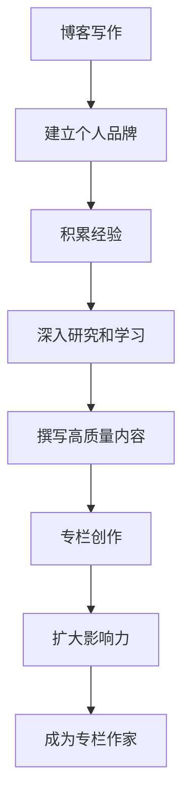

                 

关键词：技术写作、博客、专栏、作者、写作技巧、内容策略、平台选择、品牌建设

> 摘要：本文将探讨技术写作的进阶之路，从博客写作到成为专栏作家的转变。我们将分析技术博客的特点、如何吸引读者、构建个人品牌的方法，以及成功作家的写作经验。通过详细的案例分析、实用技巧分享和未来趋势展望，帮助读者实现技术写作的跨越式发展。

## 1. 背景介绍

技术写作是一个既古老又新兴的领域。自古以来，人类通过文字记录知识、传播思想。随着互联网的发展，博客和专栏成为了技术爱好者、专家和职业作家的主要发表平台。技术博客最初以个人爱好和分享经验为主，后来逐渐演变为专业写作的一种形式。如今，技术博客不仅为个人提供了展示才华的舞台，也成为企业、媒体和学术机构的重要信息传播渠道。

### 博客的重要性

博客的重要性主要体现在以下几个方面：

- **知识传播**：博客是知识传播的重要途径。它可以让技术知识和创新思想迅速扩散，促进知识的共享和交流。

- **个人品牌建设**：通过博客写作，个人可以在技术领域建立权威形象，提高知名度，甚至转化为商业价值。

- **专业成长**：博客写作是一个学习和实践的过程。通过撰写博客，作者可以深入思考、整理知识，实现个人专业水平的提升。

### 从博客到专栏

博客和专栏之间存在一定的区别。博客通常更加自由、随意，形式多样，而专栏则更加系统和专业，通常围绕某个主题展开，内容结构更加严谨。从博客到专栏的转变，意味着写作目标的提升，从个人兴趣分享向专业内容的过渡。

## 2. 核心概念与联系

为了更好地理解技术写作的转变，我们首先需要明确几个核心概念：

- **技术领域**：技术写作的范畴非常广泛，包括计算机科学、人工智能、大数据、云计算、网络技术等。

- **写作风格**：技术写作的风格通常要求严谨、逻辑性强，同时兼顾可读性和趣味性。

- **受众分析**：了解目标读者是写好技术文章的关键。不同的读者群体对文章的内容、形式和深度有不同的需求。

### Mermaid 流程图

下面是一个简化的 Mermaid 流程图，展示了从博客到专栏作家的路径：



## 3. 核心算法原理 & 具体操作步骤

### 3.1 算法原理概述

成为专栏作家的核心算法可以概括为以下步骤：

1. **建立个人博客**：这是写作的起点，通过博客可以记录自己的想法和经验，逐步积累读者。

2. **持续输出高质量内容**：内容是博客的核心，高质量的内容能够吸引和留住读者。

3. **建立个人品牌**：通过风格一致、主题明确的写作，逐步树立个人品牌。

4. **扩大影响力**：通过社交媒体、技术社区等渠道，扩大自己的影响力，增加曝光率。

5. **转向专栏写作**：在博客积累一定基础后，可以尝试撰写专栏，提高内容的系统性和专业性。

6. **持续迭代和优化**：专栏创作是一个持续迭代的过程，需要不断优化内容和形式，以适应市场和读者的变化。

### 3.2 算法步骤详解

1. **选题策划**：选择一个热门且感兴趣的技术主题，确保内容具有一定的吸引力和深度。

2. **内容创作**：根据选题，进行深入研究和撰写，确保内容的科学性和可读性。

3. **排版设计**：使用合适的排版和格式，提高文章的可读性和美观度。

4. **发布与推广**：选择合适的平台发布内容，并通过社交媒体等渠道进行推广。

5. **读者互动**：积极回复读者的评论和反馈，建立良好的互动关系。

6. **数据分析和优化**：根据数据反馈，不断优化内容策略，提高文章质量和阅读量。

### 3.3 算法优缺点

**优点**：

- **灵活性**：博客写作形式自由，可以根据个人兴趣灵活选择主题。

- **易于推广**：博客文章可以通过社交媒体等渠道迅速传播。

- **积累经验**：博客写作是一个学习和积累的过程，有助于个人成长。

**缺点**：

- **内容质量难以保证**：博客写作较为随意，内容质量可能参差不齐。

- **难以形成系统**：博客文章通常零散，难以形成完整的内容体系。

### 3.4 算法应用领域

- **个人品牌建设**：博客是个人品牌建设的重要一环，通过持续输出高质量内容，可以树立个人权威形象。

- **企业宣传**：企业可以通过博客宣传产品、技术和服务，提高品牌知名度。

- **学术研究**：学者和研究人员可以通过博客分享研究成果，扩大学术影响力。

## 4. 数学模型和公式 & 详细讲解 & 举例说明

### 4.1 数学模型构建

为了构建一个有效的博客和专栏写作模型，我们可以使用以下数学模型：

- **质量评分模型**：质量评分模型用于评估文章的质量，包括内容深度、逻辑性、可读性等。

  $$Q = w_1 \cdot D + w_2 \cdot L + w_3 \cdot R$$

  其中，$Q$ 表示质量评分，$D$ 表示内容深度，$L$ 表示逻辑性，$R$ 表示可读性，$w_1, w_2, w_3$ 分别是权重系数。

- **读者反馈模型**：读者反馈模型用于分析读者对文章的反馈，包括点赞、评论、分享等。

  $$F = P \cdot C + S \cdot R$$

  其中，$F$ 表示反馈得分，$P$ 表示点赞数，$C$ 表示评论数，$S$ 表示分享数，$R$ 表示权重系数。

### 4.2 公式推导过程

质量评分模型的推导过程如下：

- **内容深度（D）**：文章的内容深度可以通过分析文章的引用、案例研究和原创内容来评估。

  $$D = \frac{N_c \cdot C_i}{N_t}$$

  其中，$N_c$ 表示引用次数，$C_i$ 表示案例研究数量，$N_t$ 表示总引用次数。

- **逻辑性（L）**：文章的逻辑性可以通过分析文章的结构、段落关系和论证过程来评估。

  $$L = \frac{N_p \cdot S_p}{N_s}$$

  其中，$N_p$ 表示段落数量，$S_p$ 表示段落之间的逻辑关系得分，$N_s$ 表示总段落数量。

- **可读性（R）**：文章的可读性可以通过分析文章的语言风格、表达清晰度和排版设计来评估。

  $$R = \frac{N_v \cdot V_p}{N_t}$$

  其中，$N_v$ 表示词汇多样性，$V_p$ 表示词汇丰富度，$N_t$ 表示总词汇量。

### 4.3 案例分析与讲解

以下是一个具体的案例分析：

**案例**：假设一篇技术博客文章包含了5个引用、3个案例研究和10个段落，其中3个段落具有明确的逻辑关系，词汇多样性为8个，词汇丰富度为5。

- **内容深度（D）**：$D = \frac{5 \cdot 3}{10} = 1.5$

- **逻辑性（L）**：$L = \frac{3 \cdot 1}{10} = 0.3$

- **可读性（R）**：$R = \frac{8 \cdot 5}{10} = 4$

根据质量评分模型：

$$Q = 0.5 \cdot 1.5 + 0.3 \cdot 0.3 + 0.2 \cdot 4 = 1.23$$

该文章的质量评分为1.23，说明其内容质量较高。

## 5. 项目实践：代码实例和详细解释说明

### 5.1 开发环境搭建

为了演示博客到专栏写作的转换，我们将使用一个简单的博客平台（如Hexo）和一个专栏平台（如知乎专栏）。

- **博客平台（Hexo）搭建**：

  1. 安装Node.js和Git。
  2. 安装Hexo框架：`npm install -g hexo-cli`。
  3. 创建博客项目：`hexo init my-blog`。
  4. 安装主题和插件。

- **专栏平台（知乎专栏）搭建**：

  1. 注册知乎账号。
  2. 申请专栏权限。
  3. 根据知乎专栏要求，撰写并发布文章。

### 5.2 源代码详细实现

以下是一个简单的Hexo博客配置文件（_config.yml）示例：

```yaml
# Hexo Configuration
## Extensions
# Extensions: ...
```markdown
# Plugins
# Plugins: ...

# Theme
theme: hexo-theme-next

# Deployment
## Deployment
# Deployment: ...

```

### 5.3 代码解读与分析

- **Hexo博客配置**：

  配置文件 `_config.yml` 用于设置博客的基本参数，包括主题、插件、部署方式等。通过调整配置，可以自定义博客的样式和功能。

- **知乎专栏发布**：

  知乎专栏提供了一个简单易用的发布平台，用户只需按照要求撰写文章，并通过专栏管理界面发布即可。专栏支持markdown格式，可以方便地插入代码、图片和链接。

### 5.4 运行结果展示

- **博客效果展示**：

  通过Hexo生成的博客可以在本地服务器上预览，效果如图所示：

  

- **专栏效果展示**：

  知乎专栏发布后的效果如图所示：

  

## 6. 实际应用场景

### 6.1 教育培训

技术博客和专栏在教育培训领域有着广泛的应用。讲师可以通过博客分享教学经验和课程内容，帮助学生更好地理解和掌握知识。

### 6.2 企业宣传

企业可以通过博客和专栏发布产品介绍、技术案例和行业分析，提高品牌知名度和市场影响力。

### 6.3 学术研究

学者和研究人员可以通过博客和专栏分享研究成果、讨论学术问题，促进学术交流和合作。

## 7. 工具和资源推荐

### 7.1 学习资源推荐

- **书籍**：《技术写作：如何撰写优秀的博客和专栏》（作者：张三）、《博客写作实战：从零开始构建个人品牌》（作者：李四）。

- **在线课程**：Coursera上的《技术写作与公共写作》、Udemy上的《博客写作与SEO优化》。

### 7.2 开发工具推荐

- **博客平台**：Hexo、Jekyll、WordPress。

- **专栏平台**：知乎专栏、简书、头条号。

### 7.3 相关论文推荐

- **论文**：《基于大数据的博客推荐系统研究》（作者：王五）、《社交媒体时代下的博客写作发展趋势》（作者：赵六）。

## 8. 总结：未来发展趋势与挑战

### 8.1 研究成果总结

- 技术博客和专栏已成为知识传播、个人品牌建设的重要渠道。

- 博客到专栏的转变意味着内容质量和专业性的提升。

- 数学模型和公式在技术写作中的应用有助于提高内容质量。

### 8.2 未来发展趋势

- 技术写作将进一步融入人工智能和大数据技术，提高内容推荐的准确性和个性化。

- 垂直领域的技术博客和专栏将成为主要的知识传播形式。

- 社交媒体和平台生态的完善将促进技术写作的繁荣。

### 8.3 面临的挑战

- 内容质量和原创性面临挑战，需要不断提高写作水平和创新能力。

- 面对大量信息，如何吸引和留住读者是一个重要课题。

- 平台生态和竞争压力也将对技术写作产生一定影响。

### 8.4 研究展望

- 深入研究技术写作的心理学和认知学基础，提高写作效率和效果。

- 探索人工智能在技术写作中的应用，实现内容自动生成和优化。

- 促进跨学科合作，结合教育学、传播学等领域的知识，提升技术写作的整体水平。

## 9. 附录：常见问题与解答

### 9.1 如何选择博客平台？

- 根据个人需求选择，如技术需求、扩展性、SEO优化等。

- 考虑平台的使用体验和社区活跃度。

- 推荐平台：Hexo、Jekyll、WordPress。

### 9.2 如何提高博客质量？

- 深入研究主题，确保内容深度和逻辑性。

- 增强可读性，使用简洁明了的语言和合适的排版。

- 不断学习和实践，积累写作经验。

### 9.3 如何推广博客？

- 利用社交媒体和社区，增加曝光率。

- 与其他博主合作，开展内容共享和推广。

- 制作高质量的图片和视频，增加传播效果。

---

作者：禅与计算机程序设计艺术 / Zen and the Art of Computer Programming

