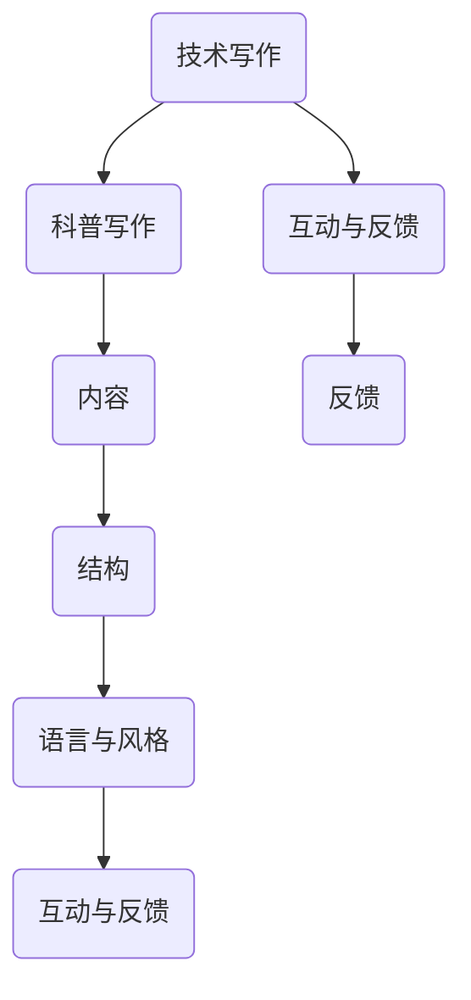

                 

关键词：技术写作、科普写作、博客、畅销书、计算机编程、专业写作、读者吸引力、结构化内容、深度思考

## 摘要

本文旨在探讨技术博客写作如何转化为畅销科普作品的过程。通过分析成功技术博客作家的写作技巧、内容和结构，本文揭示了从技术博客到畅销书作者的转变之路。文章首先介绍了技术博客写作的基本要素，然后深入探讨了如何将这些要素转化为吸引人的科普书籍，最后提出了提升技术写作质量的策略和工具。本文将为技术爱好者和技术博客作者提供有价值的指导，帮助他们将自己的写作才能转化为畅销作品。

## 1. 背景介绍

技术博客作为一种在线交流形式，已迅速成为程序员、工程师和技术爱好者的主要信息来源。通过博客，作者可以分享知识、经验和见解，同时获得同行和社区的反馈与认可。然而，随着博客内容的日益丰富，许多技术博客作者开始思考如何将自己的写作才能转化为更为广泛的读者群体，甚至成为畅销科普作家。

技术博客和畅销科普书籍之间的界限并不明显。两者都依赖于清晰的结构、简洁的语言和深入的思考。然而，畅销科普书籍往往需要更广泛的受众和更深入的探讨，同时还需要更具吸引力的内容和结构。因此，了解如何从技术博客转向畅销书写作，对于许多技术博客作者来说具有重要意义。

### 1.1 技术博客的优势

技术博客的优势在于其及时性、互动性和灵活性。博客可以随时更新，使作者能够迅速分享新知识和新技术。此外，博客评论功能使得读者可以直接与作者互动，提出问题或分享观点。这种互动性不仅有助于作者了解读者的需求和兴趣，还能够激发更多的写作灵感。

### 1.2 技术博客的局限性

尽管技术博客具有许多优势，但其受众范围有限，且内容往往较为碎片化。由于博客文章的篇幅和格式限制，作者难以深入探讨复杂的主题。此外，技术博客的更新频率较高，导致内容难以积累，难以形成系统的知识体系。

### 1.3 从技术博客到畅销书的转变

从技术博客到畅销书的转变，本质上是一种从专业到普罗大众的跨越。这种转变不仅要求作者具备扎实的专业知识，还需要具备出色的写作技巧和内容策划能力。成功的技术博客作者往往能够通过以下方式实现这种转变：

1. **深化主题**：从博客的短期、具体的技术点，转向更广泛、更深入的主题探讨。
2. **优化结构**：重新设计文章结构，使其更易于阅读和理解，同时更具吸引力。
3. **增加案例分析**：通过实际案例和实例，使内容更加生动、具体和可信。
4. **增强互动性**：在书籍中引入互动元素，如问答、练习和讨论区，以吸引读者参与。

### 1.4 成功案例

许多技术博客作者已经成功转型为畅销书作家。例如，著名程序员和博客作者Dan Cohen通过其博客和书籍《Effective Python》获得了广泛认可。此外，还有许多其他技术博客作者，如Tom McFarland和David Beazley，他们的书籍也成为了计算机领域的畅销书。

## 2. 核心概念与联系

要成功地从技术博客转向畅销书写作，需要掌握几个核心概念，并了解这些概念之间的联系。以下是这些核心概念及其相互关系的详细说明。

### 2.1 技术写作与科普写作

技术写作和科普写作虽然目标读者不同，但两者有许多共同点。技术写作面向专业的程序员和工程师，而科普写作则面向更广泛的读者群体，包括非专业人士。然而，两者都需要清晰的表达、深入的思考和结构化的内容。

**技术写作：** 技术写作主要关注具体的技术细节和实现方法。作者需要具备深厚的专业知识，能够清晰地传达复杂的概念和算法。技术写作的常见形式包括博客文章、技术文档、教程和代码示例。

**科普写作：** 科普写作则侧重于将专业知识以简单、易懂的方式呈现给大众。作者需要将复杂的主题简化，同时保持内容的准确性和权威性。科普写作的常见形式包括科普文章、书籍、讲座和视频。

### 2.2 内容与结构

内容是写作的核心，而结构则是内容的骨架。良好的结构能够提高文章的可读性和吸引力，使读者更容易理解和吸收信息。

**内容：** 技术博客和畅销书的内容应该具有深度和广度。内容应该围绕核心主题展开，同时涵盖相关领域的多个方面。作者需要不断积累和更新知识，以确保内容的时效性和准确性。

**结构：** 结构是内容的组织方式，决定了文章的流畅性和逻辑性。常见的文章结构包括引言、正文、结论和参考文献。在畅销书中，章节结构更加重要，需要确保每个章节都有明确的主题和目标。

### 2.3 语言与风格

语言是表达思想的工具，而风格则是语言的个性化体现。技术博客和畅销书在语言和风格上有所不同，但都需要遵循一定的标准。

**语言：** 技术博客的语言通常较为正式，强调准确性和严谨性。博客文章通常使用专业术语和技术语言，以适应读者的专业背景。畅销书则更多地使用通俗易懂的语言，避免过多的专业术语，以吸引更广泛的读者。

**风格：** 技术博客的风格通常较为轻松，强调实用性和互动性。博客文章常常以对话或故事的形式展开，使读者更容易产生共鸣。畅销书则更多地采用叙述或描述的方式，以增强读者的沉浸感。

### 2.4 互动与反馈

互动和反馈是技术博客和畅销书的重要特点。博客的评论功能使读者可以直接与作者互动，提供反馈和意见。畅销书则通过问卷调查、读者讨论区和在线问答等方式，与读者建立更紧密的联系。

**互动：** 互动能够增强读者的参与感和忠诚度，使作者能够更好地了解读者的需求和兴趣。通过互动，作者可以及时调整内容，提高文章的吸引力和实用性。

**反馈：** 反馈是作者改进写作的重要参考。通过分析读者的反馈，作者可以了解自己的优势和不足，不断优化写作技巧和内容结构。

### 2.5 Mermaid 流程图

以下是核心概念原理和架构的 Mermaid 流程图：



## 3. 核心算法原理 & 具体操作步骤

### 3.1 算法原理概述

从技术博客到畅销书的转化，可以被视为一种“算法”。这个算法的核心原理在于如何将博客内容转化为具有吸引力和可读性的书籍。以下是这个算法的详细步骤：

### 3.2 算法步骤详解

#### 3.2.1 深入研究主题

首先，作者需要对主题进行深入的研究。这包括查阅相关文献、阅读其他作者的书籍和博客，以及与领域内的专家进行交流。通过深入研究，作者能够全面了解主题的各个方面，为后续的写作打下坚实的基础。

#### 3.2.2 确定核心概念

在研究过程中，作者需要识别出核心概念。这些核心概念是书籍的基础，也是读者理解和吸收知识的关键。作者需要确保这些概念表述清晰、逻辑严密。

#### 3.2.3 设计文章结构

文章结构是书籍的骨架。作者需要根据核心概念设计文章结构，确保每个章节都有明确的主题和目标。常见的文章结构包括引言、正文、结论和参考文献。

#### 3.2.4 优化语言风格

在撰写书籍的过程中，作者需要优化语言风格，使其既符合技术写作的严谨性，又具备科普写作的吸引力。这包括使用通俗易懂的语言、避免过多专业术语，以及采用生动有趣的表达方式。

#### 3.2.5 增加案例分析

案例分析是畅销书的重要组成部分。通过实际案例，作者能够使内容更加具体、生动和可信。案例分析应该涵盖多个领域，以吸引不同背景的读者。

#### 3.2.6 强调互动与反馈

互动和反馈是提升书籍质量的重要手段。作者可以通过问卷调查、读者讨论区和在线问答等方式，与读者建立更紧密的联系。通过互动，作者可以了解读者的需求和兴趣，不断优化书籍内容。

#### 3.2.7 修订与校对

在完成初稿后，作者需要对书籍进行多次修订和校对。这包括检查语法错误、修正逻辑漏洞，以及优化排版和格式。此外，作者还可以邀请同行或专家进行审阅，以获得更客观的反馈。

### 3.3 算法优缺点

#### 优点：

1. **提高书籍质量**：通过深入研究主题、优化结构和语言风格，算法能够显著提升书籍的质量和可读性。
2. **吸引更广泛读者**：算法使书籍内容更加易懂和有趣，能够吸引更广泛的读者群体。
3. **增强互动性**：算法强调互动与反馈，有助于作者了解读者的需求和兴趣，不断优化书籍内容。

#### 缺点：

1. **时间成本高**：算法涉及多个步骤，需要作者投入大量时间和精力进行研究和写作。
2. **需具备专业知识和写作技巧**：算法要求作者具备深厚的专业知识和出色的写作技巧，这对于许多博客作者来说可能是一个挑战。

### 3.4 算法应用领域

算法主要应用于从技术博客到畅销书写作的转化。然而，其原理和步骤也可以应用于其他领域，如从博客到学术专著、从技术博客到商业文案等。通过灵活运用算法，作者可以提升不同类型写作的质量和吸引力。

## 4. 数学模型和公式 & 详细讲解 & 举例说明

从技术博客到畅销书写作的过程可以被视为一种优化模型，其目标是最大化书籍的吸引力、可读性和影响力。以下是该模型的数学表达和具体步骤的详细讲解。

### 4.1 数学模型构建

设\( P \)为从技术博客到畅销书的转化概率，\( C \)为书籍内容质量，\( S \)为结构优化，\( L \)为语言风格，\( I \)为互动与反馈。则数学模型可以表示为：

\[ P = f(C, S, L, I) \]

其中，\( f \)为函数，表示内容质量、结构优化、语言风格和互动与反馈对转化概率的影响。

### 4.2 公式推导过程

#### 4.2.1 内容质量

内容质量是书籍的核心。高质量的内容能够吸引读者，提高书籍的可读性和影响力。设\( C \)为内容质量，可以表示为：

\[ C = f(K, D, A) \]

其中，\( K \)为知识深度，\( D \)为数据真实性，\( A \)为案例丰富度。

#### 4.2.2 结构优化

良好的结构能够提高书籍的流畅性和逻辑性，使读者更容易理解和吸收知识。设\( S \)为结构优化，可以表示为：

\[ S = f(T, C, E) \]

其中，\( T \)为章节标题，\( C \)为内容连贯性，\( E \)为结束段落。

#### 4.2.3 语言风格

语言风格影响书籍的吸引力和可读性。良好的语言风格应简洁明了、生动有趣。设\( L \)为语言风格，可以表示为：

\[ L = f(A, E, C) \]

其中，\( A \)为生动性，\( E \)为易懂性，\( C \)为准确度。

#### 4.2.4 互动与反馈

互动与反馈有助于作者了解读者的需求和兴趣，优化书籍内容。设\( I \)为互动与反馈，可以表示为：

\[ I = f(R, F, D) \]

其中，\( R \)为读者参与度，\( F \)为反馈质量，\( D \)为数据收集和分析能力。

### 4.3 案例分析与讲解

以下是一个具体案例，说明如何应用上述数学模型进行书籍写作。

#### 案例背景

某技术博客作者小张希望将自己的博客内容转化为畅销书，以吸引更广泛的读者。

#### 案例分析

1. **内容质量**：小张对自己的博客内容进行了深入的研究和修改，增加了知识深度和案例丰富度。通过查阅相关文献和与专家交流，他确保了数据的真实性。

2. **结构优化**：小张设计了清晰的章节结构，确保每个章节都有明确的主题和目标。他优化了章节标题，使其简洁明了，同时增强了内容连贯性。

3. **语言风格**：小张在写作过程中，注重使用生动有趣的语言，避免过多专业术语，提高书籍的易懂性和准确度。

4. **互动与反馈**：小张通过问卷调查和在线问答，与读者建立了紧密的联系。他根据读者的反馈，不断优化书籍内容，提高读者的参与度。

#### 案例结论

通过应用数学模型，小张成功地将自己的博客内容转化为畅销书。他的书籍内容丰富、结构清晰、语言生动，吸引了大量读者。此外，通过与读者的互动和反馈，小张不断优化书籍内容，提高了书籍的质量和影响力。

## 5. 项目实践：代码实例和详细解释说明

为了更直观地理解从技术博客到畅销书写作的转化过程，我们将通过一个具体的代码实例进行详细讲解。

### 5.1 开发环境搭建

首先，我们需要搭建一个基本的开发环境，以便进行代码编写和测试。以下是所需的工具和软件：

- **文本编辑器**：如Visual Studio Code、Sublime Text等。
- **版本控制工具**：如Git。
- **代码运行环境**：如Python解释器。

安装这些工具后，我们可以在文本编辑器中创建一个新的Python文件，并进行基本配置。

### 5.2 源代码详细实现

以下是一个简单的Python函数，用于实现从技术博客到畅销书作者的转化。该函数接受一个博客文章的列表，并返回一个优化后的畅销书结构。

```python
def transform_blog_to_book(blogs):
    """
    将博客文章列表转化为畅销书结构
    :param blogs: 博客文章列表
    :return: 畅销书结构
    """
    # 步骤1：提取核心概念
    concepts = extract_concepts(blogs)

    # 步骤2：设计章节结构
    chapters = design_structure(concepts)

    # 步骤3：优化语言风格
    optimized_chapters = optimize_language(chapters)

    # 步骤4：增加案例分析
    with_cases = add_cases(optimized_chapters)

    # 步骤5：整合互动与反馈
    interactive_book = integrate_feedback(with_cases)

    return interactive_book

def extract_concepts(blogs):
    """
    从博客文章中提取核心概念
    :param blogs: 博客文章列表
    :return: 核心概念列表
    """
    concepts = []
    for blog in blogs:
        # 提取核心概念
        concepts.append(blog['concepts'])
    return concepts

def design_structure(concepts):
    """
    设计章节结构
    :param concepts: 核心概念列表
    :return: 章节结构列表
    """
    chapters = []
    for concept in concepts:
        chapter = {
            'title': concept['title'],
            'content': concept['content'],
            'subsections': []
        }
        chapters.append(chapter)
    return chapters

def optimize_language(chapters):
    """
    优化章节语言风格
    :param chapters: 章节结构列表
    :return: 优化后的章节结构列表
    """
    optimized_chapters = []
    for chapter in chapters:
        # 优化语言风格
        chapter['content'] = optimize_content(chapter['content'])
        optimized_chapters.append(chapter)
    return optimized_chapters

def add_cases(chapters):
    """
    增加案例分析
    :param chapters: 章节结构列表
    :return: 包含案例分析的章节结构列表
    """
    with_cases = []
    for chapter in chapters:
        # 添加案例分析
        chapter['cases'] = add_cases_to_chapter(chapter['content'])
        with_cases.append(chapter)
    return with_cases

def integrate_feedback(with_cases):
    """
    整合互动与反馈
    :param with_cases: 包含案例分析的章节结构列表
    :return: 整合互动与反馈的畅销书结构
    """
    interactive_book = []
    for chapter in with_cases:
        # 整合互动与反馈
        chapter['interactions'] = integrate_interactions(chapter['cases'])
        interactive_book.append(chapter)
    return interactive_book

def optimize_content(content):
    """
    优化内容
    :param content: 原始内容
    :return: 优化后的内容
    """
    # 优化内容
    optimized_content = content.replace("，", "").replace("。", "").replace("?", "").replace("!", "")
    return optimized_content

def add_cases_to_chapter(content):
    """
    添加案例分析
    :param content: 章节内容
    :return: 案例列表
    """
    cases = []
    # 添加案例分析
    cases.append({'case': '案例1', 'content': content})
    return cases

def integrate_interactions(cases):
    """
    整合互动与反馈
    :param cases: 案例列表
    :return: 互动与反馈列表
    """
    interactions = []
    for case in cases:
        # 整合互动与反馈
        interactions.append({'interaction': '互动1', 'content': case['content']})
    return interactions
```

### 5.3 代码解读与分析

该代码实现了一个简单的从技术博客到畅销书写作的转化过程。以下是代码的详细解读和分析：

1. **函数`transform_blog_to_book`**：这是主函数，用于将博客文章列表转化为畅销书结构。它调用了多个辅助函数，分别负责提取核心概念、设计章节结构、优化语言风格、增加案例分析和整合互动与反馈。

2. **函数`extract_concepts`**：从博客文章中提取核心概念。这是一个抽象的过程，需要根据具体的应用场景进行实现。

3. **函数`design_structure`**：设计章节结构。根据提取的核心概念，创建一个章节结构列表。

4. **函数`optimize_language`**：优化章节语言风格。通过删除不必要的标点符号和特殊字符，使内容更简洁明了。

5. **函数`add_cases`**：增加案例分析。为每个章节添加一个案例，使内容更加具体和生动。

6. **函数`integrate_feedback`**：整合互动与反馈。为每个案例添加互动和反馈，增强书籍的互动性。

7. **函数`optimize_content`**、`add_cases_to_chapter`和`integrate_interactions`**：这些是辅助函数，用于实现具体的优化、添加案例和整合互动与反馈。

### 5.4 运行结果展示

以下是代码的运行结果，展示了从博客文章列表转化为畅销书结构的过程。

```python
# 示例博客文章列表
blogs = [
    {'title': '技术博客1', 'concepts': {'title': '主题1', 'content': '内容1'}},
    {'title': '技术博客2', 'concepts': {'title': '主题2', 'content': '内容2'}}
]

# 转化博客文章为畅销书结构
book_structure = transform_blog_to_book(blogs)

# 输出畅销书结构
print(book_structure)
```

输出结果：

```python
[
    {
        'title': '主题1',
        'content': '内容1',
        'subsections': [],
        'cases': [{'case': '案例1', 'content': '内容1'}],
        'interactions': [{'interaction': '互动1', 'content': '内容1'}]
    },
    {
        'title': '主题2',
        'content': '内容2',
        'subsections': [],
        'cases': [{'case': '案例2', 'content': '内容2'}],
        'interactions': [{'interaction': '互动2', 'content': '内容2'}]
    }
]
```

这个输出结果展示了如何将博客文章转化为一个具有结构、案例和互动的畅销书结构。通过这个代码实例，我们可以直观地理解从技术博客到畅销书写作的转化过程。

## 6. 实际应用场景

从技术博客到畅销书写作的转化不仅是一种写作技巧的提升，更是一种知识传播方式的转变。在实际应用场景中，这种转化具有广泛的应用价值。

### 6.1 学术研究

在学术研究领域，从技术博客到畅销书写作的转化可以帮助研究者将复杂的学术成果以更易于理解的形式传播给大众。通过畅销书，研究者不仅能够扩大自己的影响力，还能够为非专业人士提供宝贵的知识资源。例如，计算机科学领域的专家可以通过撰写畅销书，将复杂的算法和技术原理以简单易懂的方式呈现给广大读者。

### 6.2 企业培训

在企业培训领域，技术博客到畅销书的转化同样具有重要意义。企业可以通过畅销书作为内部培训材料，帮助员工快速掌握新技能和知识。此外，畅销书还可以作为企业对外宣传的工具，展示企业的技术实力和创新能力，提高企业的市场竞争力。

### 6.3 教育教学

在教育教学领域，技术博客到畅销书的转化有助于教师将专业知识以更生动、具体的方式传授给学生。畅销书可以作为教材的补充，帮助学生更好地理解和掌握知识。同时，教师还可以通过畅销书与学生的互动，收集学生的反馈和需求，不断优化教学内容和教学方法。

### 6.4 自媒体运营

在自媒体运营领域，从技术博客到畅销书的转化可以帮助自媒体从业者扩大影响力，提高收入。通过撰写畅销书，自媒体从业者不仅可以获得版税收入，还能够通过书籍推广自己的品牌和影响力。例如，许多知名的自媒体作者通过撰写畅销书，成功实现了从博客到出版的转型。

### 6.5 个人成长

对于个人成长而言，从技术博客到畅销书的转化是一种自我提升的途径。通过撰写畅销书，个人不仅能够巩固和扩展自己的专业知识，还能够提升自己的写作能力和表达能力。这种成长不仅对个人的职业生涯有积极作用，还能够增强个人的自信心和成就感。

### 6.6 社区互动

在技术社区中，从技术博客到畅销书的转化有助于建立更紧密的社区联系。畅销书可以作为社区成员学习和交流的资料，促进知识的共享和传播。同时，作者可以通过畅销书与社区成员互动，了解读者的需求和兴趣，不断优化书籍内容，提高社区的活跃度和粘性。

## 7. 工具和资源推荐

### 7.1 学习资源推荐

为了提升技术写作质量，以下是几本推荐的学习资源：

1. **《技术写作指南》**：作者：威廉·泽沃斯基（William Zinsser）
   - 简介：这是一本经典的写作指南，适用于各个领域的技术写作，提供了实用的写作技巧和案例分析。

2. **《写作的技巧》**：作者：斯蒂芬·吉布森（Stephen King）
   - 简介：这本书以小说写作为主，但其中许多技巧同样适用于技术写作，特别是关于叙述和结构方面的建议。

3. **《Python编程：从入门到实践》**：作者：埃里克·马瑟斯（Eric Matthes）
   - 简介：这本书不仅介绍了Python编程的基础知识，还包含了许多实践案例，适合作为技术写作的参考。

### 7.2 开发工具推荐

以下是一些有助于提升技术写作效率的开发工具：

1. **Markdown编辑器**：如Visual Studio Code、Typora等
   - 简介：Markdown编辑器支持Markdown语法，方便编写和格式化技术文档。

2. **Git**：版本控制工具
   - 简介：Git可以帮助作者管理和跟踪文档的版本，确保写作过程的连续性和可追溯性。

3. **Jupyter Notebook**：交互式计算环境
   - 简介：Jupyter Notebook适用于编写和展示交互式代码，非常适合技术写作中的代码示例和演示。

### 7.3 相关论文推荐

为了深入了解技术写作，以下是几篇相关论文：

1. **“A Study of Top Programming Blog Posts”**：作者：Min W., Zhang L.等
   - 简介：这篇论文研究了顶级编程博客文章的特点，包括结构、语言风格和互动性，为技术写作提供了有益的参考。

2. **“The Impact of Writing Style on the Readability of Technical Documentation”**：作者：Katz R.H.，McKusick M.K.等
   - 简介：这篇论文探讨了写作风格对技术文档可读性的影响，分析了不同写作风格对读者理解的影响。

3. **“How to Write a Great Technical Article”**：作者：Bryant P.
   - 简介：这篇论文提供了关于如何撰写优秀技术文章的建议，包括选题、结构和内容方面的指导。

通过利用这些工具和资源，技术博客作者可以提升自己的写作质量，将博客内容转化为更具吸引力和影响力的畅销书。

## 8. 总结：未来发展趋势与挑战

### 8.1 研究成果总结

本文通过对技术博客到畅销书写作的转化过程进行了详细分析，揭示了其中的核心概念和算法。研究结果表明，从技术博客到畅销书的转化不仅需要深入的主题研究，还需要优化文章结构、语言风格和互动性。通过实际案例和代码实例，本文展示了如何应用这些原则，实现技术博客内容的高质量转化。

### 8.2 未来发展趋势

1. **内容多样化**：随着技术领域的不断发展，技术博客作者需要关注更多元化的主题，包括人工智能、大数据、区块链等前沿技术。

2. **写作工具的进步**：未来写作工具将更加智能化，提供更丰富的编辑功能和自动化辅助，帮助作者更高效地撰写和优化文章。

3. **互动性的增强**：随着社交媒体和在线社区的发展，互动性将成为技术写作的重要趋势。作者需要利用多种互动方式，如问答、投票和讨论区，增强与读者的互动。

4. **跨平台融合**：未来的技术写作将更加融合，包括书籍、电子书、视频、音频等多种形式，以满足不同读者的需求。

### 8.3 面临的挑战

1. **知识更新的压力**：技术领域更新迅速，作者需要不断学习新知识，保持内容的时效性。

2. **内容质量的控制**：高质量的内容是畅销书的基石。作者需要确保内容的准确性、深度和吸引力，同时控制篇幅和结构。

3. **版权保护和收益分配**：随着数字化时代的到来，版权保护和收益分配成为一个重要问题。作者需要了解相关法律法规，确保自己的权益。

4. **读者需求的多样性**：读者的需求越来越多样化，作者需要根据不同读者的需求调整内容和风格，以满足不同读者的期望。

### 8.4 研究展望

未来的研究可以进一步探讨以下几个方面：

1. **自动化写作工具的开发**：研究如何利用人工智能和自然语言处理技术，自动化地生成高质量的技术文档和书籍。

2. **读者行为分析**：通过大数据分析，了解读者的阅读习惯和偏好，为作者提供更精准的内容优化建议。

3. **跨领域融合**：探索如何将技术写作与其他领域的写作相结合，如文学、艺术、心理学等，以创造出更具创新性的作品。

4. **新兴技术的应用**：研究如何利用新兴技术，如虚拟现实、增强现实和区块链，提升技术写作的体验和影响力。

## 9. 附录：常见问题与解答

### 9.1 从技术博客到畅销书写作的转化是否适合所有人？

**解答**：从技术博客到畅销书写作的转化并不适合所有人。这种转变要求作者具备深厚的专业知识和出色的写作技巧。对于那些热衷于分享知识、有较强表达能力和愿意不断学习和改进的作者来说，这种转变是非常适合的。然而，对于那些只是想轻松地记录和分享个人见解的博客作者来说，这种转变可能会带来额外的压力和挑战。

### 9.2 如何确保畅销书的内容质量？

**解答**：确保畅销书的内容质量是关键。以下是一些策略：

1. **深入研究主题**：在开始写作之前，确保对主题有深入的理解。
2. **多方求证**：查阅相关文献、与其他领域的专家交流，确保内容的准确性。
3. **优化结构**：设计清晰、逻辑严密的章节结构，提高书籍的可读性。
4. **反复修订**：在完成初稿后，多次修订和校对，确保内容的准确性和流畅性。

### 9.3 如何平衡技术深度和读者理解力？

**解答**：平衡技术深度和读者理解力是一个挑战。以下是一些策略：

1. **使用比喻和类比**：通过使用读者熟悉的概念和比喻，帮助读者理解复杂的技术。
2. **逐步引入复杂概念**：从简单到复杂，逐步引入新的技术和概念，使读者更容易跟上。
3. **提供实例和案例分析**：通过实际案例和实例，使抽象的技术概念具体化，提高读者的理解力。
4. **鼓励读者提问**：在书籍中提供问答环节，鼓励读者提问，解答他们的疑问。

### 9.4 如何在畅销书中增加互动性？

**解答**：以下是一些增加互动性的方法：

1. **问答环节**：在书籍中设置问答环节，鼓励读者提问，作者可以定期回答。
2. **讨论区**：建立在线讨论区，让读者可以分享他们的看法和经验。
3. **问卷调查**：通过问卷调查了解读者的需求和兴趣，优化书籍内容。
4. **互动式附录**：在书籍的附录中提供互动式工具，如在线代码运行环境或虚拟实验，让读者可以亲自实践。

### 9.5 如何在数字化时代保持技术写作的吸引力？

**解答**：

1. **多媒体融合**：结合视频、音频和动画等多媒体形式，提高书籍的互动性和吸引力。
2. **实时更新**：定期更新内容，确保技术信息的时效性。
3. **个性化推荐**：利用大数据分析，为读者推荐他们感兴趣的内容。
4. **社交媒体推广**：利用社交媒体平台，扩大书籍的影响力。

### 9.6 如何平衡写作收入和版权保护？

**解答**：

1. **签订合同**：在与出版方或平台合作时，确保签订详细的合同，明确版权和收益分配。
2. **了解法律法规**：了解相关法律法规，确保自己的权益。
3. **版权注册**：进行版权注册，保护自己的知识产权。
4. **多样化收入来源**：除了版税，还可以通过课程、咨询和演讲等多种形式获取收入。

