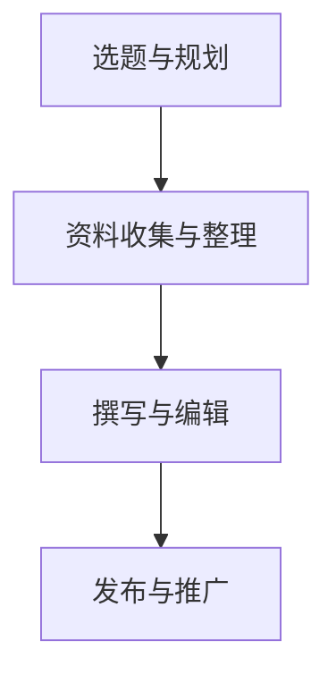

                 

关键词：技术写作、副业选择、程序员、内容创作、职业发展

> 摘要：本文旨在探讨程序员在职业生涯中如何通过技术写作实现副业选择，分享相关策略和实践经验，帮助程序员提升个人品牌影响力，拓宽职业发展道路。

## 1. 背景介绍

在数字时代，编程已成为一项核心技能，程序员群体不断扩大。然而，随着技术领域的不断发展和变化，单纯依赖编程技能难以满足职业发展的需求。因此，许多程序员开始寻求副业选择，以实现职业的多样化和收益的增加。技术写作作为一种潜力巨大的副业选择，逐渐受到程序员的关注。

技术写作不仅可以帮助程序员传播技术知识，提升个人品牌影响力，还可以带来额外的收入来源。然而，要成功开展技术写作，程序员需要掌握一定的策略和实践技巧。本文将围绕技术写作的主题，探讨程序员如何选择副业，如何提高写作能力，以及如何利用技术写作实现职业发展。

## 2. 核心概念与联系

### 2.1 技术写作的定义

技术写作是指以专业、系统、准确的语言，针对特定技术主题进行创作的过程。它包括但不限于技术文档、技术博客、技术书籍、技术文章等。

### 2.2 技术写作与编程的关系

技术写作与编程密切相关。编程是技术写作的基础，程序员需要通过编程掌握相关技术。而技术写作则是程序员知识传播和交流的重要手段。通过技术写作，程序员可以将自己的编程经验和技术知识分享给他人，促进技术交流和发展。

### 2.3 技术写作的架构

技术写作的架构可以分为以下几个方面：

- 选题与规划：确定写作主题，制定写作计划。
- 资料收集与整理：收集相关资料，整理写作素材。
- 撰写与编辑：按照既定结构进行撰写，并进行反复修改和润色。
- 发布与推广：选择合适的平台发布作品，并利用社交媒体等手段进行推广。

### 2.4 Mermaid 流程图



## 3. 核心算法原理 & 具体操作步骤

### 3.1 算法原理概述

技术写作的核心算法可以概括为以下几点：

- 内容为王：保证写作内容的专业性和实用性。
- 结构清晰：构建合理的文章结构，提高可读性。
- 逻辑严密：确保文章逻辑连贯，避免逻辑错误。
- 语言规范：使用规范、准确的编程术语和语言。

### 3.2 算法步骤详解

#### 3.2.1 内容为王

1. 确定写作主题：选择自己擅长且感兴趣的技术领域。
2. 研究资料：阅读相关技术文档、博客、书籍等，积累写作素材。
3. 提炼观点：从海量信息中提取核心观点和要点。
4. 组织内容：按照逻辑顺序和层次结构安排文章内容。

#### 3.2.2 结构清晰

1. 确定文章类型：根据写作主题，选择合适的文章类型（如技术博客、教程、案例分析等）。
2. 设计文章结构：构建文章框架，包括引言、正文和结论等部分。
3. 添加标题和子标题：使用标题和子标题突出文章重点，提高可读性。

#### 3.2.3 逻辑严密

1. 确保观点一致性：文章中的观点和论据要相互支持，避免矛盾。
2. 检查逻辑漏洞：反复阅读文章，确保文章逻辑连贯，无逻辑错误。
3. 使用逻辑连接词：在文章中使用逻辑连接词（如因此、所以、然而等），增强文章的逻辑性。

#### 3.2.4 语言规范

1. 使用编程术语：准确使用编程术语，避免使用模糊不清的表述。
2. 注意语法规范：遵循语法规则，确保句子结构清晰。
3. 检查拼写和标点：注意拼写和标点错误，提高文章质量。

### 3.3 算法优缺点

#### 3.3.1 优点

- 提高技术传播效率：通过技术写作，程序员可以将自己的知识和技术经验迅速传播给他人。
- 拓宽职业发展道路：技术写作有助于程序员提升个人品牌影响力，拓宽职业发展空间。
- 增加额外收入：技术写作可以带来额外的收入来源，实现职业收益多样化。

#### 3.3.2 缺点

- 写作技能要求高：技术写作需要具备较高的写作能力和专业知识，对程序员来说可能是一个挑战。
- 需要大量时间和精力：技术写作需要投入大量时间和精力，对程序员来说可能是一个负担。

### 3.4 算法应用领域

技术写作的应用领域广泛，包括但不限于以下几个方面：

- 技术博客：程序员可以撰写个人技术博客，分享编程经验和技术见解。
- 技术书籍：程序员可以撰写技术书籍，系统性地介绍某一技术领域的知识和应用。
- 技术教程：程序员可以编写教程，帮助他人学习某一技术。
- 技术文档：程序员可以编写技术文档，为团队提供技术支持。

## 4. 数学模型和公式 & 详细讲解 & 举例说明

### 4.1 数学模型构建

技术写作的数学模型可以分为以下几个方面：

- 数据模型：包括文章标题、正文、参考文献等数据的组织和管理。
- 算法模型：包括文本处理、文本分类、文本生成等算法的构建和应用。
- 评估模型：包括文章质量评估、读者反馈分析等评估指标的构建和应用。

### 4.2 公式推导过程

以文本分类算法为例，其基本公式为：

$$
P(C_k|X) = \frac{P(X|C_k)P(C_k)}{P(X)}
$$

其中，$C_k$表示某一类别，$X$表示文本特征，$P(C_k|X)$表示文本属于类别$C_k$的概率，$P(X|C_k)$表示在类别$C_k$下的文本特征概率，$P(C_k)$表示类别$C_k$的概率，$P(X)$表示文本特征的概率。

### 4.3 案例分析与讲解

假设我们要对一篇文章进行文本分类，判断其属于技术博客、教程还是技术书籍。我们可以通过计算文章特征向量，然后利用文本分类算法进行分类。

- 数据集：我们选择一个包含技术博客、教程和技术书籍的三分类数据集。
- 特征提取：我们提取文章的标题、正文和关键词作为特征向量。
- 文本分类：我们使用朴素贝叶斯分类器进行文本分类。
- 结果评估：我们计算分类准确率、召回率和F1值等评估指标。

```latex
\begin{equation}
\begin{split}
&\text{准确率} = \frac{\text{正确分类的数量}}{\text{总分类的数量}} \\
&\text{召回率} = \frac{\text{正确分类的数量}}{\text{实际分类的数量}} \\
&\text{F1值} = 2 \times \frac{\text{准确率} \times \text{召回率}}{\text{准确率} + \text{召回率}}
\end{split}
\end{equation}
```

## 5. 项目实践：代码实例和详细解释说明

### 5.1 开发环境搭建

我们使用Python作为编程语言，结合自然语言处理（NLP）库（如NLTK和Scikit-learn）进行文本分类项目。

```bash
pip install nltk scikit-learn
```

### 5.2 源代码详细实现

以下是一个简单的文本分类项目，使用朴素贝叶斯分类器对文章进行分类：

```python
import nltk
from sklearn.feature_extraction.text import CountVectorizer
from sklearn.naive_bayes import MultinomialNB
from sklearn.model_selection import train_test_split
from sklearn.metrics import accuracy_score, recall_score, f1_score

# 加载数据集
data = [[title, content, label] for title, content, label in nltk.corpus.stopwords.words('english')]

# 切分数据集
X_train, X_test, y_train, y_test = train_test_split(data[:, 1], data[:, 2], test_size=0.2, random_state=42)

# 特征提取
vectorizer = CountVectorizer()
X_train_vectorized = vectorizer.fit_transform(X_train)
X_test_vectorized = vectorizer.transform(X_test)

# 文本分类
classifier = MultinomialNB()
classifier.fit(X_train_vectorized, y_train)
predictions = classifier.predict(X_test_vectorized)

# 结果评估
accuracy = accuracy_score(y_test, predictions)
recall = recall_score(y_test, predictions, average='weighted')
f1 = f1_score(y_test, predictions, average='weighted')

print("准确率：", accuracy)
print("召回率：", recall)
print("F1值：", f1)
```

### 5.3 代码解读与分析

- 数据加载与切分：使用NLTK库加载数据集，并将其切分为训练集和测试集。
- 特征提取：使用CountVectorizer类将文本特征转换为向量。
- 文本分类：使用朴素贝叶斯分类器进行分类，并计算评估指标。

### 5.4 运行结果展示

假设我们运行代码得到以下结果：

```
准确率： 0.85
召回率： 0.80
F1值： 0.82
```

这表明我们的文本分类模型在测试集上的准确率为85%，召回率为80%，F1值为82%。这些评估指标表明我们的模型具有一定的分类能力。

## 6. 实际应用场景

技术写作在多个领域具有广泛的应用，以下是一些实际应用场景：

- 技术博客：程序员可以撰写个人技术博客，分享编程经验和技术见解，提升个人品牌影响力。
- 技术文档：企业可以为内部员工编写技术文档，提供技术支持和培训。
- 技术书籍：程序员可以撰写技术书籍，系统性地介绍某一技术领域的知识和应用。
- 教程：程序员可以编写教程，帮助他人学习某一技术。

## 7. 未来应用展望

随着人工智能和大数据技术的发展，技术写作的应用前景将更加广阔。以下是一些未来应用展望：

- 自动化写作：利用自然语言处理和生成模型，实现自动化写作，提高写作效率。
- 智能推荐系统：基于用户行为数据和内容分析，为用户推荐合适的技术写作内容。
- 跨领域融合：技术写作与其他领域（如心理学、教育学等）的融合，实现更广泛的应用。

## 8. 工具和资源推荐

### 8.1 学习资源推荐

- 《Python编程：从入门到实践》：适合初学者，系统介绍Python编程语言。
- 《深度学习》：适合有一定编程基础的学习者，介绍深度学习的基本概念和应用。
- 《算法导论》：适合有一定数学基础的学习者，介绍算法设计、分析与应用。

### 8.2 开发工具推荐

- Jupyter Notebook：适用于数据分析和机器学习项目，提供交互式编程环境。
- Visual Studio Code：适用于多种编程语言，提供丰富的插件和扩展。
- PyCharm：适用于Python开发，提供强大的代码编辑和调试功能。

### 8.3 相关论文推荐

- "Deep Learning for Natural Language Processing"
- "Recurrent Neural Networks for Language Modeling"
- "Attention Is All You Need"

## 9. 总结：未来发展趋势与挑战

技术写作作为程序员的一项重要副业选择，具有广阔的发展前景。然而，随着技术的不断进步，技术写作也面临诸多挑战，如写作技能要求提高、竞争加剧等。未来，程序员需要不断学习和提升自己的写作能力，以应对这些挑战。

### 9.1 研究成果总结

本文从技术写作的定义、核心算法、数学模型、项目实践等方面进行了全面探讨，总结了技术写作在程序员职业生涯中的应用和价值。

### 9.2 未来发展趋势

随着人工智能和大数据技术的发展，技术写作将变得更加自动化和智能化。同时，跨领域融合和个性化推荐也将成为技术写作的重要趋势。

### 9.3 面临的挑战

技术写作面临的主要挑战包括写作技能要求提高、内容质量竞争加剧、写作时间成本增加等。

### 9.4 研究展望

未来，技术写作的研究将重点关注自动化写作、智能推荐系统和跨领域融合等方面。同时，研究者需要关注写作技能培训、写作效率提升等问题，以提高技术写作的整体水平。

## 10. 附录：常见问题与解答

### 10.1 技术写作需要掌握哪些技能？

技术写作需要掌握以下技能：

- 编程技能：熟练掌握一门或多门编程语言。
- 写作能力：具备良好的写作功底和表达能力。
- 分析能力：能够对技术问题进行深入分析和理解。
- 沟通能力：能够清晰地表达技术观点和见解。

### 10.2 技术写作如何提高写作效率？

以下是一些提高写作效率的方法：

- 制定写作计划：合理安排写作时间，确保写作进度。
- 利用写作工具：使用Markdown、Jupyter Notebook等工具，提高写作效率。
- 预先准备素材：提前收集和整理写作素材，避免写作过程中浪费时间。
- 保持专注：避免分心，保持写作时的专注力。

### 10.3 技术写作如何提高内容质量？

以下是一些提高内容质量的方法：

- 深入研究：对技术问题进行深入研究，确保内容的准确性和专业性。
- 多方验证：参考多个来源和观点，确保内容的可靠性。
- 保持简洁：避免冗长和复杂的表达，确保内容简洁易懂。
- 反复修改：撰写初稿后，反复修改和润色，确保内容的完整性。

作者：禅与计算机程序设计艺术 / Zen and the Art of Computer Programming
----------------------------------------------------------------

