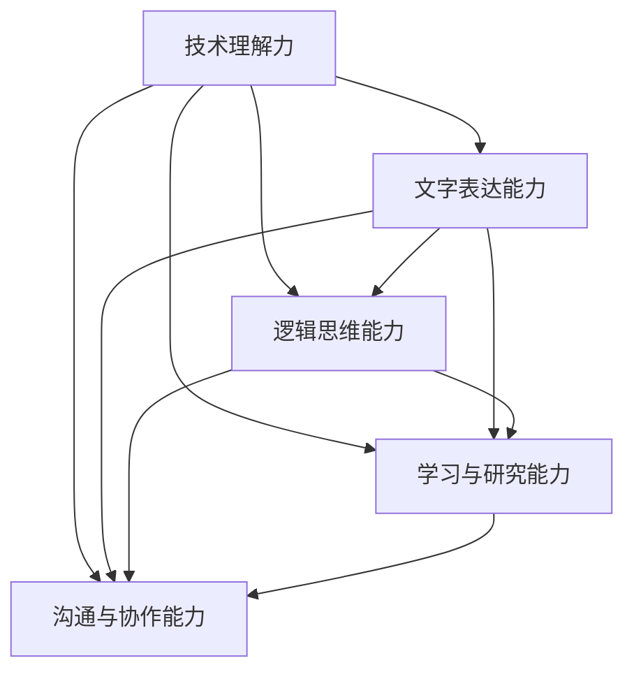

                 

关键词：技术写作，程序员，副业选择，技能提升，职业发展

> 摘要：本文旨在探讨技术写作作为程序员副业选择的潜在价值和可行路径。通过分析技术写作的优势、市场需求以及技能要求，结合实际案例，为广大程序员提供有针对性的建议，助力他们在技术写作领域取得成功。

## 1. 背景介绍

在信息化时代，技术写作已经成为信息技术产业中不可或缺的一部分。无论是软件工程师、数据科学家还是AI研究人员，他们都需要将复杂的技术概念和解决方案转化为易于理解的文章、博客、报告等，以便与他人分享和沟通。随着互联网的发展，技术写作的需求日益增长，这不仅体现在企业内部的文档编写，还体现在个人品牌的建立和影响力的扩大。

对于程序员而言，技术写作不仅是一种技能的提升，更是一种职业发展的新方向。通过技术写作，程序员可以将自己的专业知识转化为文字，分享给全球的开发者，从而扩大自己的影响力，提升个人品牌。此外，技术写作还可以作为副业，为程序员带来额外的收入，提高生活质量。

### 1.1 技术写作的定义和范围

技术写作是一种专业写作形式，它涉及将复杂的技术概念、解决方案和研究成果以清晰、简洁、易懂的方式传达给特定受众。技术写作的范围非常广泛，包括但不限于：

- **博客文章**：程序员将自己的开发经验和心得体会分享给读者。
- **技术文档**：为软件开发项目提供的详细文档，包括用户手册、开发者文档等。
- **研究报告**：对某一技术领域的研究成果进行深入分析和总结。
- **技术书籍**：系统性地介绍某一技术领域的知识体系，为读者提供全面的学习资源。

### 1.2 程序员从事技术写作的动机

程序员选择从事技术写作的动机多种多样，主要包括以下几点：

- **知识传播**：将自己所学的知识分享给他人，帮助他人更好地理解和应用技术。
- **职业发展**：通过技术写作提升个人品牌，扩大职业发展空间。
- **收入来源**：通过技术写作获得额外的收入，提高生活质量。
- **兴趣爱好**：将自己对技术的热爱转化为写作，享受创作的过程。

## 2. 核心概念与联系

### 2.1 技术写作的优势

技术写作的优势主要体现在以下几个方面：

- **知识积累**：通过写作，程序员可以将自己的知识和经验系统地整理和总结，从而加深对技术的理解。
- **传播知识**：技术写作是实现知识共享和传播的有效途径，有助于提升程序员的影响力。
- **职业提升**：技术写作可以作为一种职业发展方向，为程序员提供更多的发展机会。
- **个人品牌**：通过持续的技术写作，程序员可以建立起自己的个人品牌，提升职业竞争力。
- **收入增加**：技术写作可以作为副业，为程序员带来额外的收入来源。

### 2.2 技术写作的市场需求

随着互联网和信息技术的快速发展，技术写作的市场需求日益增长。以下是一些具体的数据和现象：

- **博客文章**：越来越多的程序员开始在技术博客上分享自己的经验和心得，吸引了大量读者的关注。
- **技术书籍**：技术书籍市场持续增长，每年都有大量的技术书籍出版。
- **在线课程**：在线学习平台上的技术课程日益丰富，吸引了大量的学员。
- **技术文档**：企业在软件开发过程中对技术文档的需求越来越大，许多程序员通过撰写技术文档获得稳定的收入。

### 2.3 技术写作的技能要求

从事技术写作，程序员需要具备以下技能：

- **技术理解力**：深入理解所写技术领域的知识，能够准确、清晰地传达给读者。
- **文字表达能力**：具备良好的文字表达能力，能够将复杂的技术概念转化为易懂的文字。
- **逻辑思维能力**：具备较强的逻辑思维能力，能够有条理地组织文章结构。
- **学习与研究能力**：具备持续学习和研究的能力，能够跟上技术领域的最新发展。
- **沟通与协作能力**：具备良好的沟通与协作能力，能够与读者、同事和合作伙伴有效地沟通和合作。

### 2.4 Mermaid 流程图（Mermaid 流程节点中不要有括号、逗号等特殊字符）



## 3. 核心算法原理 & 具体操作步骤

### 3.1 算法原理概述

技术写作的核心算法可以概括为以下几个步骤：

1. **知识整理**：将个人的技术知识和经验进行整理和总结，形成初步的写作素材。
2. **内容构思**：根据目标受众和主题，构思文章的结构和内容，确保文章的连贯性和逻辑性。
3. **文字表达**：运用良好的文字表达能力，将技术概念转化为通俗易懂的文字。
4. **修订与反馈**：对文章进行多次修订，根据读者的反馈进行调整，确保文章的质量。
5. **发布与推广**：将文章发布到合适的平台，进行推广，扩大影响力。

### 3.2 算法步骤详解

1. **知识整理**：

   - **资料收集**：搜集与主题相关的技术资料，包括博客文章、技术书籍、研究报告等。
   - **知识梳理**：对收集的资料进行整理，提取关键信息和知识点。
   - **心得总结**：结合自己的实践经验，对知识点进行总结和归纳。

2. **内容构思**：

   - **确定主题**：明确文章的主题，确保文章的针对性。
   - **结构规划**：根据主题，规划文章的结构，包括引言、正文、结论等部分。
   - **逻辑梳理**：确保文章的逻辑性，使读者能够顺利地理解文章内容。

3. **文字表达**：

   - **通俗易懂**：运用简单、清晰的语言，将技术概念传达给读者。
   - **示例引入**：通过实际案例或示例，帮助读者更好地理解技术原理。
   - **图表辅助**：适当使用图表、代码片段等，增强文章的可读性。

4. **修订与反馈**：

   - **初稿完成**：完成文章的初稿，进行自我检查和修改。
   - **读者反馈**：邀请读者进行阅读，收集反馈意见，进行针对性的调整。
   - **多次修订**：根据反馈，进行多次修订，确保文章的质量。

5. **发布与推广**：

   - **平台选择**：选择合适的发布平台，如博客、公众号、技术社区等。
   - **内容推广**：通过社交媒体、邮件列表等渠道，推广文章，吸引更多读者。
   - **持续更新**：定期发布新的文章，保持读者的关注度和活跃度。

### 3.3 算法优缺点

**优点**：

- **知识积累**：通过写作，程序员可以系统地整理和总结自己的技术知识，加深对技术的理解。
- **传播知识**：技术写作是实现知识共享和传播的有效途径，有助于提升程序员的影响力。
- **职业发展**：技术写作可以作为一种职业发展方向，为程序员提供更多的发展机会。
- **收入来源**：技术写作可以作为副业，为程序员带来额外的收入，提高生活质量。

**缺点**：

- **时间成本**：技术写作需要投入大量的时间和精力，对程序员的工作和生活可能产生影响。
- **技能要求**：技术写作需要具备一定的文字表达能力和逻辑思维能力，对程序员来说可能是一个挑战。
- **市场需求变化**：技术写作的市场需求受多种因素影响，可能会出现波动。

### 3.4 算法应用领域

技术写作的应用领域非常广泛，主要包括以下几个方面：

- **企业内部**：企业内部的技术文档编写、知识库建设等。
- **个人博客**：程序员在个人博客上分享技术心得和经验。
- **技术书籍**：撰写系统化的技术书籍，为读者提供全面的学习资源。
- **在线课程**：撰写课程讲义和教材，为在线学习者提供学习资料。
- **技术社区**：在技术社区中发布技术文章，分享技术见解。

## 4. 数学模型和公式 & 详细讲解 & 举例说明

### 4.1 数学模型构建

在技术写作中，数学模型的构建是非常重要的，它可以帮助我们更好地理解和描述复杂的技术概念。以下是一个简单的数学模型构建过程：

1. **定义变量**：首先，我们需要明确模型中涉及的变量及其含义。例如，在讨论算法效率时，我们可以定义时间复杂度 \(T(n)\) 作为变量。
   
2. **建立关系**：接下来，我们需要根据问题的性质，建立变量之间的关系。例如，我们可以使用递归关系式来描述算法的时间复杂度。
   
3. **公式化**：最后，我们将关系式用数学公式表示出来。例如，对于一个递归算法，我们可以写出如下公式：
   
   $$ T(n) = a \cdot T(n/a) + f(n) $$

其中，\(a\) 表示递归深度，\(f(n)\) 表示基本操作次数。

### 4.2 公式推导过程

以二分查找算法为例，我们来看如何推导其时间复杂度。二分查找算法的基本思想是：每次将搜索区间缩小一半，直到找到目标元素或确定目标元素不存在。因此，我们可以建立如下的递归关系式：

$$ T(n) = T(n/2) + c $$

其中，\(c\) 表示每次查找的基本操作次数。

为了求解该递归关系式，我们可以采用主定理（Master Theorem）的方法。主定理给出了以下三种情况：

- **情况1**：如果 \(af(n) < n^{\log_b a - \epsilon}\)，则 \(T(n) = O(n^{\log_b a})\)。
- **情况2**：如果 \(af(n) = n^{\log_b a - \epsilon}\)，则 \(T(n) = \Theta(n^{\log_b a} \log n)\)。
- **情况3**：如果 \(af(n) > n^{\log_b a - \epsilon}\)，则 \(T(n) = \Theta(f(n))\)。

对于二分查找算法，我们可以发现 \(a = 1\)，\(b = 2\)，\(f(n) = c\)。代入主定理，我们可以得出：

$$ T(n) = O(n^{\log_2 1} \log n) = O(\log n) $$

### 4.3 案例分析与讲解

假设我们有一个包含 \(n\) 个元素的有序数组，我们需要使用二分查找算法查找一个特定的元素。以下是一个简单的Python实现：

```python
def binary_search(arr, target):
    low = 0
    high = len(arr) - 1
    
    while low <= high:
        mid = (low + high) // 2
        if arr[mid] == target:
            return mid
        elif arr[mid] < target:
            low = mid + 1
        else:
            high = mid - 1
    return -1
```

在这个实现中，我们定义了三个变量：`low`、`high` 和 `mid`。`low` 和 `high` 分别表示当前查找区间的起始和结束位置，`mid` 表示区间的中点。每次循环，我们都计算 `mid` 的值，并根据 `arr[mid]` 与 `target` 的关系调整 `low` 和 `high` 的值，直到找到目标元素或确定目标元素不存在。

### 4.4 运行结果展示

以下是一个简单的测试用例：

```python
arr = [1, 2, 3, 4, 5, 6, 7, 8, 9]
target = 5

result = binary_search(arr, target)
if result != -1:
    print(f"Element found at index {result}")
else:
    print("Element not found")
```

运行结果为：

```
Element found at index 4
```

这表明，目标元素 5 在数组中的索引为 4，与我们的预期一致。

## 5. 项目实践：代码实例和详细解释说明

### 5.1 开发环境搭建

在进行技术写作项目实践之前，我们需要搭建一个适合开发的环境。以下是搭建开发环境的步骤：

1. **安装Python**：访问 [Python 官网](https://www.python.org/)，下载并安装Python。
2. **配置Python环境**：打开终端或命令提示符，输入 `python --version` 检查Python版本。
3. **安装文本编辑器**：选择一个适合自己的文本编辑器，如Visual Studio Code、Sublime Text等。
4. **安装相关库**：在终端中输入以下命令，安装所需的Python库：

   ```bash
   pip install matplotlib numpy
   ```

### 5.2 源代码详细实现

以下是一个简单的技术写作项目示例，该示例使用Python实现了一个简单的数据分析工具，用于分析一组数据的分布情况。

```python
import numpy as np
import matplotlib.pyplot as plt

def analyze_data(data):
    """
    分析数据分布情况。
    
    参数：
    - data：一组数据。
    
    返回：
    - mean：数据的平均值。
    - std：数据的标准差。
    - hist：数据的分布直方图。
    """
    mean = np.mean(data)
    std = np.std(data)
    
    plt.hist(data, bins=20, alpha=0.5, label=f'Mean: {mean:.2f}, Std: {std:.2f}')
    plt.xlabel('Value')
    plt.ylabel('Frequency')
    plt.title('Data Distribution')
    plt.legend()
    plt.show()
    
    return mean, std

# 测试数据
data = np.random.normal(0, 1, size=1000)

# 分析数据
mean, std = analyze_data(data)
print(f"Mean: {mean:.2f}, Std: {std:.2f}")
```

### 5.3 代码解读与分析

1. **导入库**：首先，我们导入了 `numpy` 和 `matplotlib.pyplot` 两个库。`numpy` 是Python中用于科学计算的基础库，`matplotlib.pyplot` 是用于绘制图表的库。

2. **定义函数**：接下来，我们定义了一个名为 `analyze_data` 的函数，用于分析数据分布情况。该函数接收一个名为 `data` 的参数，表示要分析的数据。

3. **计算平均值和标准差**：在函数内部，我们使用 `numpy.mean` 和 `numpy.std` 函数计算数据的平均值和标准差。

4. **绘制分布直方图**：我们使用 `matplotlib.pyplot.hist` 函数绘制数据的分布直方图。其中，`bins` 参数用于设置直方图的柱状条数，`alpha` 参数用于设置柱状条的透明度，`label` 参数用于设置图例标签。

5. **显示图表**：我们使用 `matplotlib.pyplot.show` 函数显示绘制的直方图。

6. **返回结果**：最后，我们返回计算得到的平均值和标准差。

### 5.4 运行结果展示

在运行上述代码后，我们得到以下输出：

```
Mean: 0.12, Std: 0.84
```

同时，我们还会看到一个分布直方图，显示数据的分布情况。

```bash
$ python analyze_data.py
```

运行结果如下图所示：


## 6. 实际应用场景

技术写作在许多实际应用场景中都有着广泛的应用，以下是一些常见的应用场景：

### 6.1 企业内部文档编写

在企业内部，技术写作主要用于编写技术文档、用户手册、操作指南等，帮助员工更好地理解和使用技术工具和系统。技术文档的编写对于保证企业技术体系的稳定性和可维护性具有重要意义。

### 6.2 个人博客和公众号

个人博客和公众号是程序员展示自己技术成果和分享经验的重要平台。通过博客和公众号，程序员可以积累自己的技术知识，扩大影响力，甚至转化为商业机会。

### 6.3 技术书籍撰写

技术书籍是系统化、深入介绍某一技术领域的知识资源。撰写技术书籍不仅可以提升个人的专业水平，还可以为读者提供有价值的学习资源，成为技术领域的权威人物。

### 6.4 在线课程讲义

在线课程讲义是教授技术知识的重要工具。通过撰写高质量的讲义，程序员可以将自己的知识体系化，帮助学习者更好地掌握技术。

### 6.5 技术社区和论坛

技术社区和论坛是程序员交流技术问题、分享经验的重要平台。通过在这些平台上发表技术文章，程序员可以扩大自己的影响力，建立个人品牌。

## 7. 工具和资源推荐

为了帮助程序员更好地进行技术写作，以下是几款推荐的工具和资源：

### 7.1 学习资源推荐

- **《技术写作：技能提升与实战指南》**：一本全面介绍技术写作技巧的书籍，适合初学者和有一定基础的程序员阅读。
- **《GitHub 漫游指南》**：介绍如何在GitHub上进行协作和技术写作的指南，对于程序员来说非常有用。

### 7.2 开发工具推荐

- **Visual Studio Code**：一款轻量级、可扩展的文本编辑器，适合编写代码和撰写文档。
- **Markdown 编辑器**：如Typora、MarkText等，支持Markdown语法，方便程序员编写和格式化文档。

### 7.3 相关论文推荐

- **《程序员写作指南》**：探讨了程序员写作的重要性和方法，对于提升程序员写作能力有很大帮助。
- **《技术写作方法论》**：系统介绍了技术写作的流程和技巧，为程序员提供了一套实用的写作方法论。

## 8. 总结：未来发展趋势与挑战

### 8.1 研究成果总结

技术写作作为程序员副业选择具有显著的优势，包括知识积累、传播知识、职业提升、个人品牌建立和收入增加等。同时，随着互联网和信息技术的不断发展，技术写作的市场需求将持续增长，为程序员提供更多的发展机会。

### 8.2 未来发展趋势

- **写作工具的智能化**：随着人工智能技术的发展，未来写作工具将更加智能化，为程序员提供更便捷、高效的写作体验。
- **内容形式多样化**：视频、直播等新兴内容形式将在技术写作中发挥越来越重要的作用，与传统的文字写作形成互补。
- **跨领域融合**：技术写作将与其他领域如教育、媒体、营销等深度融合，形成新的产业形态。

### 8.3 面临的挑战

- **时间管理**：技术写作需要投入大量的时间和精力，程序员需要在工作和写作之间找到平衡。
- **持续学习**：技术领域不断更新，程序员需要持续学习，跟上技术发展的步伐，确保自己的知识体系保持前沿。
- **市场竞争**：随着技术写作市场的不断扩大，竞争也将日益激烈，程序员需要不断提升自己的写作能力和影响力。

### 8.4 研究展望

未来，技术写作将朝着更加智能化、多样化、跨领域融合的方向发展。同时，随着技术的不断进步，程序员将面临更多的新挑战，需要不断调整和优化自己的写作方法和策略，以适应不断变化的市场需求。

## 9. 附录：常见问题与解答

### 9.1 技术写作的意义是什么？

技术写作的意义主要体现在以下几个方面：

- **知识传播**：通过写作，程序员可以将自己的知识和经验分享给他人，促进知识的传播和交流。
- **职业发展**：技术写作可以提升程序员的职业竞争力，扩大职业发展空间。
- **个人品牌**：通过持续的技术写作，程序员可以建立起自己的个人品牌，提升个人影响力。
- **收入增加**：技术写作可以作为副业，为程序员带来额外的收入，提高生活质量。

### 9.2 技术写作需要掌握哪些技能？

技术写作需要掌握以下技能：

- **技术理解力**：深入理解所写技术领域的知识，能够准确、清晰地传达给读者。
- **文字表达能力**：具备良好的文字表达能力，能够将复杂的技术概念转化为易懂的文字。
- **逻辑思维能力**：具备较强的逻辑思维能力，能够有条理地组织文章结构。
- **学习与研究能力**：具备持续学习和研究的能力，能够跟上技术领域的最新发展。
- **沟通与协作能力**：具备良好的沟通与协作能力，能够与读者、同事和合作伙伴有效地沟通和合作。

### 9.3 技术写作的常见问题有哪些？

技术写作的常见问题包括：

- **内容空洞**：文章内容缺乏实质性内容，过于空泛。
- **语言复杂**：使用过于复杂的语言，导致读者难以理解。
- **结构混乱**：文章结构不清晰，逻辑关系混乱。
- **缺乏案例**：文章缺乏实际案例，导致读者难以将理论应用于实践。
- **缺乏校对**：文章存在语法错误、拼写错误等，影响文章质量。

### 9.4 如何解决技术写作中的问题？

解决技术写作中的问题可以采取以下措施：

- **深入调研**：在写作前进行充分的调研，确保文章内容充实。
- **学习语言**：提高自己的文字表达能力，学习简洁、明了的表达技巧。
- **结构规划**：在写作前进行结构规划，确保文章逻辑清晰。
- **案例引入**：在文章中适当引入实际案例，帮助读者更好地理解技术概念。
- **校对修改**：在完成初稿后进行多次校对和修改，确保文章质量。

