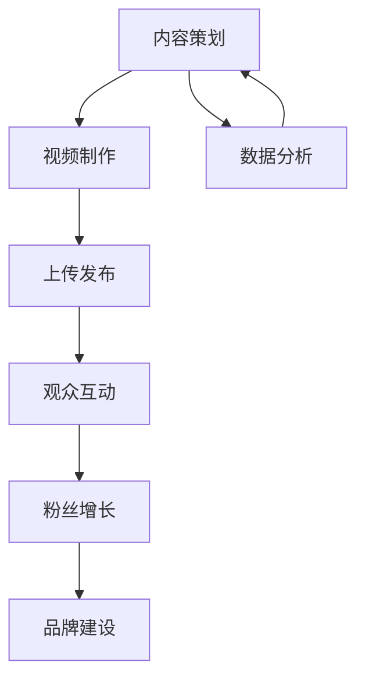

                 

关键词：技术类YouTube频道，内容策略，增长方法，社交媒体营销，粉丝互动，视频制作技巧

## 摘要

随着互联网技术的飞速发展，视频内容营销成为了一种越来越受欢迎的传播方式。特别是在技术领域，通过YouTube频道分享专业知识和实践经验，不仅能够提升个人品牌价值，还能吸引大量忠实粉丝。本文将深入探讨如何打造一个百万粉丝级别的技术类YouTube频道，包括内容策略、增长方法、视频制作技巧等关键要素。

## 1. 背景介绍

### YouTube的崛起与影响力

YouTube作为全球最大的视频分享平台，拥有超过20亿的月活跃用户。它已经成为一个强大的内容生态系统，吸引了无数创作者和观众。在技术领域，YouTube为专业技术人员提供了一个展示才华、分享知识和建立个人品牌的绝佳平台。

### 技术类YouTube频道的魅力

技术类YouTube频道不仅能够提供有价值的信息，还能解决观众的实际问题。这些频道通常包含以下内容：

- 技术教程：教授编程语言、框架、工具等。
- 项目实战：展示软件项目的开发过程。
- 行业动态：报道最新技术趋势和热点。
- 深度解析：探讨技术原理和未来发展。

### 目标与挑战

我们的目标是打造一个百万粉丝级别的技术类YouTube频道。为了实现这一目标，我们需要面对以下几个挑战：

- 竞争激烈：技术领域的创作者众多，如何脱颖而出是一个重要问题。
- 内容质量：保持高质量、有价值的内容输出是长期发展的基础。
- 观众互动：与观众建立良好的互动关系，提升粉丝黏性。

## 2. 核心概念与联系

### Mermaid 流程图



### 核心概念解释

- **内容策划**：确定频道的定位、目标受众和内容方向。
- **视频制作**：包括剧本编写、拍摄、剪辑和后期制作。
- **上传发布**：选择合适的时间点，将视频上传到YouTube。
- **观众互动**：通过评论、弹幕、直播等方式与观众互动。
- **粉丝增长**：通过各种手段吸引新观众，增加频道订阅数。
- **品牌建设**：提升个人或团队的知名度，建立品牌形象。
- **数据分析**：分析观众行为，优化内容策略和制作流程。

## 3. 核心算法原理 & 具体操作步骤

### 3.1 算法原理概述

打造一个成功的YouTube频道，关键在于以下算法原理：

- **内容创新**：不断探索新的内容形式，满足观众需求。
- **精准定位**：明确频道定位，吸引目标受众。
- **持续优化**：根据观众反馈和数据分析，不断改进内容。

### 3.2 算法步骤详解

1. **内容策划**：
   - **定位分析**：研究目标受众，确定频道主题。
   - **内容规划**：制定内容发布计划，确保内容多样化。
   - **创意构思**：寻找独特、有吸引力的内容点。

2. **视频制作**：
   - **剧本编写**：明确视频结构和核心内容。
   - **拍摄**：选择合适的拍摄设备和场景。
   - **剪辑**：剪辑出流畅、连贯的视频。

3. **上传发布**：
   - **时间选择**：根据YouTube算法，选择最佳发布时间。
   - **标题和描述**：撰写吸引人的标题和描述，提高视频曝光率。

4. **观众互动**：
   - **评论管理**：积极回复评论，建立良好互动。
   - **弹幕互动**：使用弹幕工具，增加观众参与感。
   - **直播互动**：定期举办直播，与观众实时互动。

5. **粉丝增长**：
   - **推广渠道**：利用社交媒体、博客等渠道宣传频道。
   - **合作共赢**：与其他创作者合作，互相推广。
   - **活动激励**：举办活动，鼓励观众参与。

6. **品牌建设**：
   - **形象设计**：统一频道形象，提高品牌辨识度。
   - **内容输出**：保持高质量、专业的内容输出。
   - **口碑传播**：通过观众口碑，扩大品牌影响力。

### 3.3 算法优缺点

**优点**：
- **高互动性**：通过视频和直播，与观众建立深度互动。
- **广泛的传播**：YouTube作为全球最大的视频平台，具有极大的传播潜力。
- **多样化的内容形式**：可以结合文字、图片、音频等多种形式，丰富内容表现。

**缺点**：
- **竞争激烈**：技术领域创作者众多，如何脱颖而出是一个挑战。
- **内容制作成本高**：视频制作需要投入大量时间和精力。
- **版权风险**：需要注意避免侵权问题，确保内容合法合规。

### 3.4 算法应用领域

**技术类YouTube频道**：
- **编程教程**：教授编程语言、框架、工具等。
- **项目实战**：展示软件项目的开发过程。
- **行业动态**：报道最新技术趋势和热点。
- **深度解析**：探讨技术原理和未来发展。

**其他领域**：
- **美食制作**：分享美食制作技巧和烹饪经验。
- **旅游攻略**：介绍旅行目的地和旅游攻略。
- **健身教学**：教授健身方法和技巧。

## 4. 数学模型和公式 & 详细讲解 & 举例说明

### 4.1 数学模型构建

在打造技术类YouTube频道的算法中，可以使用以下数学模型来分析粉丝增长：

- **线性回归模型**：用于预测粉丝增长趋势。
- **逻辑回归模型**：用于预测观众互动率。

### 4.2 公式推导过程

**线性回归模型**：

\[ y = ax + b \]

其中，\( y \) 表示粉丝增长数量，\( x \) 表示时间，\( a \) 和 \( b \) 是常数。

**逻辑回归模型**：

\[ P = \frac{1}{1 + e^{-z}} \]

其中，\( P \) 表示观众互动率，\( z \) 是自变量。

### 4.3 案例分析与讲解

**案例**：一个技术类YouTube频道的粉丝增长情况如下：

- 第1个月：粉丝增长1000人。
- 第2个月：粉丝增长2000人。
- 第3个月：粉丝增长3000人。

**分析**：

使用线性回归模型进行预测，可以得到以下公式：

\[ y = 333.33x + 666.67 \]

**预测**：

第4个月的粉丝增长预测为：

\[ y = 333.33 \times 4 + 666.67 = 1666.67 \]

**案例**：一个技术类YouTube频道的观众互动率如下：

- 第1个月：互动率10%。
- 第2个月：互动率15%。
- 第3个月：互动率20%。

**分析**：

使用逻辑回归模型进行预测，可以得到以下公式：

\[ P = \frac{1}{1 + e^{-1.5}} \approx 0.741 \]

**预测**：

第4个月的观众互动率预测为：

\[ P = \frac{1}{1 + e^{-1.5}} \approx 0.741 \]

## 5. 项目实践：代码实例和详细解释说明

### 5.1 开发环境搭建

为了制作和发布技术类YouTube视频，我们需要以下开发环境：

- **操作系统**：Windows、macOS 或 Linux。
- **视频编辑软件**：Adobe Premiere Pro、Final Cut Pro 或 Shotcut。
- **编程环境**：Visual Studio Code、Eclipse 或 IntelliJ IDEA。

### 5.2 源代码详细实现

以下是一个简单的Python脚本，用于生成视频播放列表：

```python
import os

# 定义视频文件列表
video_files = ["video1.mp4", "video2.mp4", "video3.mp4"]

# 生成播放列表
playlist = f"<!DOCTYPE html><html><head><title>Video Playlist</title></head><body><ul>"

for file in video_files:
    playlist += f"<li><video width='320' height='240' controls><source src='{file}' type='video/mp4'></video></li>"

playlist += "</ul></body></html>"

# 保存播放列表到本地
with open("playlist.html", "w", encoding="utf-8") as f:
    f.write(playlist)

print("播放列表生成完成！")
```

### 5.3 代码解读与分析

**代码解读**：

1. **导入模块**：引入`os`模块用于文件操作。
2. **定义视频文件列表**：定义一个包含多个视频文件名的列表。
3. **生成播放列表**：使用HTML格式生成一个播放列表页面，包含所有视频文件的链接。
4. **保存播放列表到本地**：将生成的HTML内容写入一个名为`playlist.html`的文件。

**分析**：

该代码主要用于生成一个视频播放列表，方便用户在一个页面内浏览和播放多个视频。通过简单的HTML结构，我们可以实现视频的自动播放和控件显示。

### 5.4 运行结果展示

运行上述Python脚本后，会在当前目录生成一个名为`playlist.html`的文件。双击打开该文件，即可在浏览器中看到生成的播放列表页面，其中包含了指定的所有视频文件。用户可以点击视频进行播放，控制按钮用于播放、暂停、快进等操作。

```html
<!DOCTYPE html><html><head><title>Video Playlist</title></head><body><ul><li><video width='320' height='240' controls><source src='video1.mp4' type='video/mp4'></video></li><li><video width='320' height='240' controls><source src='video2.mp4' type='video/mp4'></video></li><li><video width='320' height='240' controls><source src='video3.mp4' type='video/mp4'></video></li></ul></body></html>
```

## 6. 实际应用场景

### 6.1 技术教程

技术类YouTube频道最常见的应用场景之一是教授编程语言、框架、工具等技术知识。例如，一个Python编程教程频道可以提供Python基础教程、高级教程、项目实战等内容，帮助观众掌握Python编程技能。

### 6.2 项目实战

项目实战视频可以让观众了解软件项目的开发过程，学习实际操作技巧。例如，一个开源项目频道可以分享项目的开发日志、开发流程、代码解读等内容，让观众深入了解项目的实现细节。

### 6.3 行业动态

行业动态视频可以报道最新的技术趋势和热点事件，帮助观众了解技术领域的最新动态。例如，一个人工智能频道可以分享人工智能的最新研究进展、应用案例、行业分析等内容。

### 6.4 深度解析

深度解析视频可以探讨技术原理和未来发展，提供有深度的见解和分析。例如，一个区块链频道可以解析区块链技术的原理、应用场景、未来发展趋势等内容，为观众提供有价值的信息。

## 7. 工具和资源推荐

### 7.1 学习资源推荐

- **在线课程**：Coursera、Udemy、edX等平台提供了丰富的编程和IT相关课程。
- **技术博客**：GitHub、Medium等平台上有许多技术大牛分享的优质内容。
- **编程书籍**：《代码大全》、《设计模式》等经典编程书籍。

### 7.2 开发工具推荐

- **视频编辑软件**：Adobe Premiere Pro、Final Cut Pro、Shotcut等。
- **编程工具**：Visual Studio Code、Eclipse、IntelliJ IDEA等。
- **YouTube工具**：YouTube Studio、TubeBuddy等用于频道管理和优化的工具。

### 7.3 相关论文推荐

- **人工智能**：《深度学习》（Ian Goodfellow著）。
- **区块链**：《区块链：从数字货币到信用社会》（唐煜著）。
- **云计算**：《云计算：概念、架构与实践》（刘江著）。

## 8. 总结：未来发展趋势与挑战

### 8.1 研究成果总结

通过本文的探讨，我们总结了打造一个百万粉丝级别的技术类YouTube频道的核心要素，包括内容策划、视频制作、观众互动、粉丝增长和品牌建设等。同时，我们分析了相关数学模型，并提供了实际项目实践的代码实例。

### 8.2 未来发展趋势

- **视频内容多样化**：未来技术类YouTube频道将更加注重内容的多样化，结合图文、音频、直播等多种形式。
- **个性化推荐**：随着AI技术的发展，YouTube等平台将实现更加精准的内容推荐，提高用户满意度。
- **跨平台互动**：未来技术类YouTube频道将与社交媒体、博客等平台实现更紧密的互动，扩大影响力。

### 8.3 面临的挑战

- **内容同质化**：随着竞争加剧，如何提供独特、有价值的内容将成为一个挑战。
- **版权风险**：在创作过程中，需要注意避免侵权问题，确保内容合法合规。
- **技术门槛**：视频制作和数据分析等技术要求较高，需要不断学习和提升技能。

### 8.4 研究展望

未来，技术类YouTube频道的发展将更加依赖于创新和高质量的内容。创作者需要紧跟技术发展趋势，持续提升自身专业能力，以应对不断变化的挑战。同时，跨平台、跨领域的合作将成为重要趋势，共同推动技术类YouTube频道的繁荣发展。

## 9. 附录：常见问题与解答

### 9.1 如何选择频道主题？

选择频道主题时，应考虑以下几个方面：

- **兴趣和专长**：选择自己感兴趣且具备专长的领域，更容易产出高质量内容。
- **市场需求**：研究目标受众，选择市场需求较大的领域。
- **竞争程度**：分析同类频道，评估竞争程度，避免过于拥挤的领域。

### 9.2 如何提高视频播放量？

以下是一些提高视频播放量的方法：

- **优化标题和描述**：使用吸引人的标题和描述，提高视频曝光率。
- **使用关键字**：在视频标题、描述和标签中合理使用关键字，便于搜索引擎抓取。
- **定期发布**：保持定期发布视频，建立观众期待。
- **互动与推广**：积极与观众互动，利用社交媒体和其他渠道推广视频。

### 9.3 如何管理粉丝互动？

管理粉丝互动时，可以采取以下措施：

- **及时回复**：尽快回复观众的评论和私信，展示诚意和专业性。
- **倾听反馈**：关注观众反馈，了解观众需求和意见，持续改进内容。
- **建立社群**：在YouTube以外建立社群，如微信群、QQ群等，加强与粉丝的联系。
- **举办活动**：定期举办线上或线下活动，增加粉丝互动和参与度。

### 9.4 如何避免版权风险？

为了避免版权风险，应采取以下措施：

- **使用原创内容**：尽量使用原创内容，避免侵犯他人版权。
- **版权声明**：在视频中使用“版权声明”标志，告知观众版权信息。
- **版权监控**：定期检查视频内容，防止侵权行为。
- **合法引用**：在必要情况下，合理引用他人作品，注明来源。

---

### 作者署名

本文作者：禅与计算机程序设计艺术 / Zen and the Art of Computer Programming

