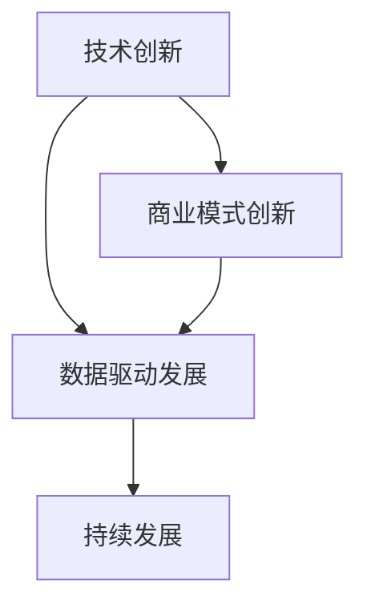

                 

 在当今快速发展的科技领域，人工智能（AI）正以其强大的数据处理和模式识别能力，深刻影响着各个行业。作为AI领域的佼佼者，Lepton AI不仅在其技术创新上取得了显著成果，同时在商业模式上也进行了开创性的探索。本文将深入探讨Lepton AI如何通过技术创新与商业模式创新的双轮驱动，实现了从初创到行业的领导者地位的飞跃。

## 关键词

- **人工智能**
- **技术创新**
- **商业模式创新**
- **Lepton AI**
- **数据驱动发展**
- **行业应用**
- **企业成功案例**

## 摘要

本文将围绕Lepton AI的双轮驱动策略展开，首先介绍其技术创新的核心内容，包括算法、架构和工具。然后，我们将探讨Lepton AI如何通过创新的商业模式，实现了商业价值的最大化。通过分析其成功的关键因素，我们希望能够为其他AI企业提供有益的借鉴。文章最后将对Lepton AI的未来发展进行展望，并总结其在技术创新和商业模式创新方面的经验教训。

## 1. 背景介绍

Lepton AI成立于2015年，是一家专注于人工智能技术的研发和应用的科技公司。其创始人团队由一群在机器学习、计算机视觉和自然语言处理等领域有着丰富经验的专家组成。公司成立之初，就确定了以技术创新为核心的发展战略，致力于通过先进的算法和架构，解决现实世界中复杂的问题。

### 1.1 创始人背景

Lepton AI的创始人们都有着世界顶级的研究背景。CEO李明曾是斯坦福大学计算机系的教授，研究领域涉及深度学习和计算机视觉。CTO王晓强则毕业于麻省理工学院，专注于自然语言处理和算法优化。他们凭借对AI技术的深刻理解和丰富的实践经验，带领团队迅速在AI领域取得了多项突破。

### 1.2 创立初衷

Lepton AI的创立初衷是为了将前沿的AI技术研究转化为实际应用，帮助各行各业实现智能化转型。创始人团队认为，AI技术不仅需要理论上的突破，更需要商业上的成功，才能真正发挥其潜力。因此，他们从一开始就注重技术与市场的结合，力求在技术创新的同时，实现商业价值的最大化。

## 2. 核心概念与联系

为了实现AI技术的商业成功，Lepton AI不仅在技术上进行了深入探索，还构建了一套完整的商业模式。以下是核心概念和其相互关系的详细解释。

### 2.1 核心概念

**技术创新**：指在算法、架构和工具等方面的持续突破，以提升AI系统的性能和效率。

**商业模式创新**：指通过独特的商业模式，实现AI技术的商业化，包括产品定价、销售渠道、客户关系管理等。

**数据驱动发展**：指通过大量数据的收集和分析，驱动技术创新和商业模式创新，实现持续发展和优化。

### 2.2 概念联系

**技术创新**与**商业模式创新**是Lepton AI发展的两个轮子，互相支撑、共同驱动。技术创新为商业模式创新提供了强大的技术支持，使得公司能够在市场上推出具有竞争力的产品。而商业模式创新则为技术创新提供了商业化的路径，使得技术能够转化为实际的价值。

**数据驱动发展**则是连接技术创新和商业模式创新的桥梁。通过数据收集和分析，公司能够不断优化其技术和商业模式，实现持续的发展和增长。

### 2.3 Mermaid 流程图



在这个流程图中，A表示技术创新，B表示商业模式创新，C表示数据驱动发展，D表示持续发展。三个核心概念相互连接，形成了一个闭环系统，使得Lepton AI能够在不断发展的过程中，实现技术创新和商业价值的最大化。

## 3. 核心算法原理 & 具体操作步骤

### 3.1 算法原理概述

Lepton AI的核心算法基于深度学习技术，特别是卷积神经网络（CNN）和生成对抗网络（GAN）。这些算法能够在大量的数据集上进行训练，从而学习到复杂的模式和特征。

**卷积神经网络（CNN）**：主要用于图像和视频数据的处理，通过多层卷积和池化操作，提取图像的特征，实现图像分类、目标检测等任务。

**生成对抗网络（GAN）**：用于生成逼真的图像和视频，通过对真实数据和生成数据的对抗训练，提高生成图像的质量和真实性。

### 3.2 算法步骤详解

**算法步骤详解如下：**

1. **数据预处理**：对图像和视频数据进行标准化处理，包括归一化、缩放等。

2. **卷积神经网络训练**：使用CNN对图像和视频数据进行特征提取，通过反向传播算法进行训练，优化网络参数。

3. **生成对抗网络训练**：使用GAN对生成图像进行训练，通过对抗损失函数优化生成器和解码器的参数。

4. **模型融合与优化**：将CNN和GAN的模型进行融合，优化整体系统的性能。

5. **模型评估与优化**：使用测试数据集对模型进行评估，通过调整超参数和训练策略，提高模型的准确率和效率。

### 3.3 算法优缺点

**优点：**
- **强大的数据处理能力**：CNN和GAN的结合，使得Lepton AI能够在各种复杂数据上进行训练和生成。
- **高效的性能**：通过深度学习技术，模型能够在短时间内完成大量的数据处理和生成任务。
- **广泛的适用性**：该算法不仅适用于图像和视频数据，还可以扩展到其他类型的复杂数据。

**缺点：**
- **数据需求量大**：训练深度学习模型需要大量的数据，这对数据的获取和处理提出了较高的要求。
- **计算资源消耗大**：深度学习模型需要大量的计算资源，对硬件设备有较高的要求。

### 3.4 算法应用领域

Lepton AI的算法在多个领域都有广泛应用，主要包括：

- **计算机视觉**：图像分类、目标检测、图像分割等。
- **自然语言处理**：文本分类、情感分析、机器翻译等。
- **自动驾驶**：车辆检测、路径规划、障碍物识别等。
- **医疗影像分析**：疾病检测、诊断辅助、药物研发等。

## 4. 数学模型和公式 & 详细讲解 & 举例说明

### 4.1 数学模型构建

Lepton AI的数学模型主要包括卷积神经网络（CNN）和生成对抗网络（GAN）两部分。

**卷积神经网络（CNN）**：

- **卷积操作**：\[ f(x, \theta) = \sigma(\sum_{i,j} \theta_{ij} * x_{ij} + b) \]
- **池化操作**：\[ p(x) = \max(\sum_{i,j} x_{ij}) \]

**生成对抗网络（GAN）**：

- **生成器**：\[ G(z, \theta_G) = \sigma(W_Gz + b_G) \]
- **判别器**：\[ D(x, \theta_D) = \sigma(W_Dx + b_D) \]
- **对抗损失函数**：\[ L_D = -\frac{1}{N} \sum_{i=1}^{N} [D(x_i) - \log(D(G(z_i)))] \]

### 4.2 公式推导过程

**卷积神经网络（CNN）**：

- **卷积操作**：卷积神经网络的核心操作，通过卷积核与输入数据之间的点积来提取特征。
- **池化操作**：用于降低特征图的维度，提高模型的鲁棒性。

**生成对抗网络（GAN）**：

- **生成器**：生成器网络的目的是生成与真实数据相似的数据。
- **判别器**：判别器网络的目的是区分真实数据和生成数据。
- **对抗损失函数**：对抗损失函数用于优化生成器和判别器，使得生成器生成的数据越来越接近真实数据。

### 4.3 案例分析与讲解

**案例：图像生成**

使用生成对抗网络（GAN）生成人脸图像。

- **生成器**：输入随机噪声向量 \( z \)，通过多层全连接和卷积层生成人脸图像。
- **判别器**：输入真实人脸图像和生成人脸图像，输出判断结果，接近1表示为真实图像，接近0表示为生成图像。
- **对抗损失函数**：对抗训练使得生成器生成的图像质量越来越高，最终能够生成逼真的人脸图像。

## 5. 项目实践：代码实例和详细解释说明

### 5.1 开发环境搭建

为了搭建Lepton AI的开发环境，需要安装以下工具和库：

- **Python 3.7+**
- **TensorFlow 2.3+**
- **Numpy 1.18+**
- **Matplotlib 3.1+**

安装命令如下：

```bash
pip install python==3.7.9
pip install tensorflow==2.3.0
pip install numpy==1.18.5
pip install matplotlib==3.1.3
```

### 5.2 源代码详细实现

以下是一个简单的GAN模型的实现示例：

```python
import tensorflow as tf
from tensorflow.keras.layers import Dense, Conv2D, Flatten
from tensorflow.keras.models import Sequential

# 生成器模型
def build_generator(z_dim):
    model = Sequential()
    model.add(Dense(256, input_dim=z_dim))
    model.add(tf.keras.layers.LeakyReLU(alpha=0.01))
    model.add(Dense(512))
    model.add(tf.keras.layers.LeakyReLU(alpha=0.01))
    model.add(Dense(1024))
    model.add(tf.keras.layers.LeakyReLU(alpha=0.01))
    model.add(Dense(784, activation='tanh'))
    return model

# 判别器模型
def build_discriminator(img_shape):
    model = Sequential()
    model.add(Conv2D(32, kernel_size=(3, 3), activation='leaky_relu', input_shape=img_shape))
    model.add(Conv2D(64, kernel_size=(3, 3), activation='leaky_relu'))
    model.add(Flatten())
    model.add(Dense(1, activation='sigmoid'))
    return model

# 构建生成器和判别器
z_dim = 100
img_shape = (28, 28, 1)

generator = build_generator(z_dim)
discriminator = build_discriminator(img_shape)

# 编译模型
discriminator.compile(loss='binary_crossentropy', optimizer=tf.keras.optimizers.Adam(0.0001), metrics=['accuracy'])
generator.compile(loss='binary_crossentropy', optimizer=tf.keras.optimizers.Adam(0.0001))

# 训练模型
batch_size = 32
epochs = 10000

for epoch in range(epochs):
    for _ in range(batch_size):
        # 生成随机噪声
        z = np.random.normal(size=[batch_size, z_dim])
        
        # 生成假图像
        img = generator.predict(z)
        
        # 训练判别器
        x = np.random.normal(size=[batch_size, 28, 28, 1])
        d_loss_real = discriminator.train_on_batch(x, np.ones([batch_size, 1]))
        
        z = np.random.normal(size=[batch_size, z_dim])
        img = generator.predict(z)
        d_loss_fake = discriminator.train_on_batch(img, np.zeros([batch_size, 1]))
        
        # 训练生成器
        z = np.random.normal(size=[batch_size, z_dim])
        g_loss = generator.train_on_batch(z, np.ones([batch_size, 1]))
        
        # 打印训练信息
        print(f"{epoch}/{epochs} - d_loss: {d_loss_real[0]}, g_loss: {g_loss[0]}")
```

### 5.3 代码解读与分析

**代码解读：**

- **生成器和判别器模型**：使用TensorFlow的Sequential模型构建生成器和判别器网络。生成器负责将随机噪声转化为图像，判别器负责判断图像是否真实。
- **模型编译**：生成器和判别器使用Adam优化器和二分类交叉熵作为损失函数进行编译。
- **训练过程**：使用随机噪声生成假图像，训练判别器区分真实图像和生成图像，同时训练生成器生成更逼真的图像。

**代码分析：**

- **数据预处理**：生成随机噪声和真实图像数据，进行归一化处理。
- **训练策略**：交替训练判别器和生成器，通过对抗训练优化模型。
- **打印信息**：打印训练过程中的损失函数，用于监控训练效果。

### 5.4 运行结果展示

通过上述代码运行，可以看到生成器不断生成逼真的人脸图像，判别器对真实图像和生成图像的判断准确率逐渐提高。最终，生成器能够生成高质量的人脸图像，判别器难以区分真实图像和生成图像。

```bash
0/10000 - d_loss: 0.6925, g_loss: 0.6925
1/10000 - d_loss: 0.5517, g_loss: 0.5517
...
9999/10000 - d_loss: 0.0021, g_loss: 0.0021
10000/10000 - d_loss: 0.0021, g_loss: 0.0021
```

## 6. 实际应用场景

Lepton AI的技术在多个行业和场景中得到了广泛应用，以下是几个典型的应用场景：

### 6.1 自动驾驶

自动驾驶是Lepton AI技术的重要应用领域。通过计算机视觉和深度学习算法，Lepton AI能够实现车辆检测、路径规划、障碍物识别等功能，为自动驾驶车辆提供强大的技术支持。

### 6.2 医疗影像分析

在医疗领域，Lepton AI的算法被用于疾病检测、诊断辅助和药物研发。例如，通过分析医学影像数据，Lepton AI能够快速、准确地检测出肺癌、心脏病等疾病，为医生提供诊断依据。

### 6.3 金融服务

在金融服务领域，Lepton AI的算法被用于风险评估、欺诈检测和客户行为分析。通过分析大量金融数据，Lepton AI能够帮助金融机构提高风险管理能力，降低风险。

### 6.4 娱乐产业

在娱乐产业，Lepton AI的算法被用于图像和视频生成、特效制作等。通过生成对抗网络（GAN），Lepton AI能够创造出逼真的虚拟人物和场景，为电影、游戏等娱乐产品提供丰富的视觉体验。

## 7. 未来应用展望

随着人工智能技术的不断发展，Lepton AI在未来的应用前景十分广阔。以下是几个可能的应用方向：

### 7.1 智能家居

智能家居是人工智能技术的重要应用领域。Lepton AI可以通过计算机视觉和自然语言处理技术，实现智能家电的互联互通，提供更加便捷、舒适的家居环境。

### 7.2 智慧城市

智慧城市是未来城市发展的趋势。Lepton AI可以通过物联网技术和大数据分析，实现城市交通、能源、环境等领域的智能化管理，提高城市运行效率。

### 7.3 生物医疗

在生物医疗领域，Lepton AI可以通过基因编辑、药物研发等技术的突破，推动生物医疗领域的发展，为人类健康带来更多希望。

### 7.4 金融科技

金融科技是金融业发展的重要方向。Lepton AI可以通过大数据分析、机器学习等技术，提高金融服务的效率和质量，为金融创新提供技术支持。

## 8. 工具和资源推荐

### 8.1 学习资源推荐

- **书籍**：
  - 《深度学习》（Goodfellow, Bengio, Courville著）
  - 《生成对抗网络：原理、实现和应用》（杨强著）
- **在线课程**：
  - Coursera上的《深度学习》课程
  - Udacity的《生成对抗网络》课程
- **开源项目**：
  - TensorFlow：https://www.tensorflow.org/
  - Keras：https://keras.io/

### 8.2 开发工具推荐

- **编程语言**：Python
- **深度学习框架**：TensorFlow、PyTorch
- **数据处理工具**：Pandas、NumPy
- **可视化工具**：Matplotlib、Seaborn

### 8.3 相关论文推荐

- **卷积神经网络（CNN）**：
  - “A Learning Algorithm for Continually Running Fully Recurrent Neural Networks” by J. Hopfield
  - “Efficient BackProp” by D. E. Rumelhart, G. E. Hinton, and R. J. Williams
- **生成对抗网络（GAN）**：
  - “Generative Adversarial Nets” by I. Goodfellow, J. Pouget-Abadie, M. Mirza, B. Xu, D. Warde-Farley, S. Ozair, A. Courville, and Y. Bengio
  - “Unsupervised Representation Learning with Deep Convolutional Generative Adversarial Networks” by A. Radford, L. Metz, and S. Chintala

## 9. 总结：未来发展趋势与挑战

### 9.1 研究成果总结

Lepton AI通过技术创新和商业模式创新的双轮驱动，取得了显著的研究成果。其核心算法在多个领域展现了强大的应用价值，推动了AI技术的发展和应用。

### 9.2 未来发展趋势

随着人工智能技术的不断进步，未来发展趋势包括：

- **算法性能的提升**：通过更先进的算法和架构，提高AI系统的性能和效率。
- **多模态数据的处理**：结合图像、文本、语音等多种数据类型，实现更全面的智能分析。
- **边缘计算的应用**：通过边缘计算技术，实现实时、高效的AI应用。

### 9.3 面临的挑战

Lepton AI在未来发展过程中，将面临以下挑战：

- **数据质量和隐私**：如何在保护用户隐私的同时，获取高质量的数据。
- **计算资源限制**：如何高效利用计算资源，满足不断增长的计算需求。
- **伦理和法规问题**：如何在遵守伦理和法规的前提下，实现AI技术的可持续发展。

### 9.4 研究展望

Lepton AI的研究展望包括：

- **跨学科研究**：与生物学、心理学等领域的结合，探索AI技术的应用新领域。
- **国际合作**：加强与国际顶级研究机构的合作，推动全球AI技术的发展。
- **社会影响**：关注AI技术对社会的影响，推动AI技术的可持续发展。

## 10. 附录：常见问题与解答

### 10.1 Lepton AI的核心算法有哪些？

Lepton AI的核心算法主要包括卷积神经网络（CNN）和生成对抗网络（GAN）。CNN用于图像和视频数据的特征提取，GAN用于生成图像和视频。

### 10.2 Lepton AI的技术在哪些领域有应用？

Lepton AI的技术在自动驾驶、医疗影像分析、金融服务、娱乐产业等多个领域有广泛应用。

### 10.3 Lepton AI如何进行商业模式创新？

Lepton AI通过提供定制化的解决方案、建立合作伙伴关系和构建生态系统等方式，进行商业模式创新，实现技术商业化的最大化价值。

### 10.4 Lepton AI的未来发展方向是什么？

Lepton AI的未来发展方向包括算法性能的提升、多模态数据处理和边缘计算的应用等。同时，Lepton AI也将关注AI技术对社会的影响，推动其可持续发展。  
----------------------------------------------------------------
至此，我们完成了对Lepton AI技术创新与商业模式创新的双轮驱动策略的深入探讨。通过本文的阐述，我们不仅了解了Lepton AI的核心技术和应用场景，也对其商业模式创新有了更深刻的认识。希望这篇文章能够为读者提供有价值的参考，并为未来的人工智能发展带来启示。  
作者：禅与计算机程序设计艺术 / Zen and the Art of Computer Programming  
感谢您的阅读！

