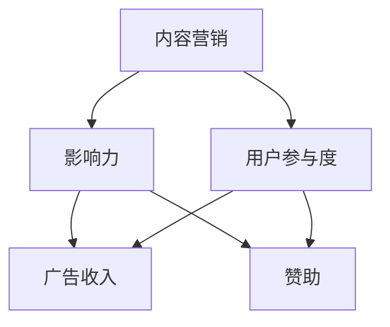

                 

关键词：技术博客、变现、策略、方法、内容营销、社交媒体、影响力

> 摘要：在数字化时代，技术博客已成为知识传播和创新的重要平台。本文探讨了如何通过制定有效的策略和方法，将技术博客转化为盈利的渠道，帮助博客作者实现财务自由。文章涵盖了从内容规划到市场营销的各个环节，旨在为技术博客作者提供实用的变现指南。

## 1. 背景介绍

随着互联网的普及和信息技术的发展，技术博客逐渐成为知识传播、经验分享和问题解决的重要渠道。无论是个人爱好者还是专业领域内的从业者，通过博客发表技术见解和解决方案，不仅可以提升个人品牌价值，还能为行业贡献智慧。

然而，技术博客的价值不仅仅体现在个人的成长和影响力的提升上，它还具备巨大的商业潜力。通过合理的策略和方法，技术博客可以转化为一个稳定的收入来源，甚至成为一个完整的商业模式。本文将探讨如何实现这一目标，帮助博客作者从内容创作者转型为商业运营者。

## 2. 核心概念与联系

为了更好地理解技术博客变现的策略和方法，我们首先需要明确几个核心概念：

- **内容营销**：一种通过创造和分发有价值的内容来吸引潜在客户并促进客户忠诚度的营销策略。
- **影响力**：在特定领域内，个人或品牌获得认可和信任的程度。
- **用户参与度**：用户在博客上的互动行为，如评论、分享、点赞等。
- **广告收入**：博客通过展示广告获得的经济回报。
- **赞助**：品牌或企业为博客提供资金支持，以换取品牌曝光或软文宣传。

下面是一个简化的Mermaid流程图，展示了这些核心概念之间的关系：



### 2.1 内容营销

内容营销是技术博客变现的基础。高质量的内容可以吸引读者，提高用户参与度，从而增强博客的影响力。通过不断发布有价值的内容，博客作者可以建立忠实的读者群体，为后续的变现创造条件。

### 2.2 影响力

博客的影响力决定了其广告和赞助的价值。一个有影响力的博客可以在特定领域内获得较高的关注度和信任度，从而吸引更多的广告主和赞助商。

### 2.3 用户参与度

用户参与度是衡量博客成功的重要指标。高用户参与度意味着读者对博客内容的兴趣和认可，这有助于增加广告点击率和赞助合同的成功率。

### 2.4 广告收入

广告收入是博客变现的直接渠道。通过在博客中展示广告，博客作者可以获得广告展示费用。常见的广告形式包括横幅广告、插页广告和联盟广告等。

### 2.5 赞助

赞助是博客变现的另一种重要方式。品牌或企业可以为博客提供资金支持，以换取在博客中的宣传机会。这种合作形式通常以软文、品牌露出或活动赞助等形式进行。

## 3. 核心算法原理 & 具体操作步骤

### 3.1 算法原理概述

技术博客变现的核心算法是基于内容营销和用户参与度的综合策略。通过以下步骤，博客作者可以实现变现目标：

1. **内容规划**：制定内容策略，确保内容有价值、有深度、有持续更新。
2. **用户互动**：增加用户参与度，通过评论、问答、互动活动等方式提升用户黏性。
3. **影响力提升**：通过专业知识和优质内容建立个人或品牌影响力。
4. **广告合作**：与广告主建立合作，优化广告投放策略。
5. **赞助合作**：寻找合适的赞助商，进行品牌合作。

### 3.2 算法步骤详解

#### 3.2.1 内容规划

1. **目标定位**：明确博客的目标受众和内容主题。
2. **内容类型**：确定博客的内容类型，如技术教程、行业分析、经验分享等。
3. **内容更新频率**：制定内容发布计划，确保持续更新。

#### 3.2.2 用户互动

1. **评论管理**：鼓励读者在博客下留言，并对评论进行积极回复。
2. **问答互动**：在博客中设置问答环节，解答读者疑问。
3. **互动活动**：定期举办互动活动，如抽奖、投票等，增加用户参与度。

#### 3.2.3 影响力提升

1. **专业深耕**：在特定领域内不断积累专业知识，提升专业度。
2. **内容传播**：利用社交媒体、邮件列表等渠道，扩大内容传播范围。
3. **品牌建设**：通过设计独特的品牌形象，提高品牌知名度。

#### 3.2.4 广告合作

1. **广告主寻找**：通过广告平台、行业展会等途径寻找合适的广告主。
2. **广告策划**：根据博客特点和受众需求，制定广告策划方案。
3. **广告投放**：优化广告投放策略，提高广告效果。

#### 3.2.5 赞助合作

1. **赞助商招募**：通过社交媒体、行业论坛等渠道寻找潜在赞助商。
2. **合作洽谈**：与赞助商进行洽谈，确定合作形式和条件。
3. **内容制作**：根据赞助商需求，制作相应的赞助内容。

### 3.3 算法优缺点

#### 3.3.1 优点

- **灵活性**：博客作者可以根据自己的兴趣和专业领域进行内容创作，具有较强的灵活性。
- **高回报**：通过广告和赞助合作，博客作者可以获得较高的经济回报。
- **品牌价值**：高质量的内容有助于提升博客作者的个人或品牌价值。

#### 3.3.2 缺点

- **时间投入**：变现过程需要较长时间积累，且需要持续投入时间和精力。
- **竞争激烈**：技术博客市场竞争激烈，需要不断创新和提升内容质量。

### 3.4 算法应用领域

技术博客变现策略和方法适用于多个领域，包括但不限于：

- **软件开发**：技术博客作者可以通过发布教程、工具分享和经验总结等内容，吸引读者，从而实现变现。
- **数据分析**：数据分析领域的博客作者可以通过发布行业报告、算法教程等内容，提升个人或品牌影响力。
- **人工智能**：人工智能领域的博客作者可以通过发布算法原理、应用案例等内容，吸引企业和个人赞助。

## 4. 数学模型和公式 & 详细讲解 & 举例说明

### 4.1 数学模型构建

为了更准确地评估技术博客的变现潜力，我们可以构建一个简单的数学模型。该模型主要涉及以下几个变量：

- **C**：博客月均访问量（页面浏览量）
- **E**：博客内容平均质量得分
- **A**：博客广告单价
- **S**：博客赞助单价
- **R**：博客总收益

根据以上变量，我们可以构建以下数学模型：

\[ R = C \times E \times (A + S) \]

### 4.2 公式推导过程

上述公式的推导过程如下：

1. **博客总收益（R）**：博客的总收益由广告收入和赞助收入组成。
2. **博客月均访问量（C）**：假设博客的月均访问量为C。
3. **博客内容平均质量得分（E）**：内容质量得分反映了博客内容的价值。得分越高，表示内容越有吸引力。
4. **广告单价（A）**：假设每千次页面浏览量（CPM）的广告单价为A。
5. **赞助单价（S）**：假设每千次页面浏览量的赞助单价为S。

将以上变量代入公式，得到：

\[ R = C \times E \times (A + S) \]

### 4.3 案例分析与讲解

假设一个技术博客的月均访问量为100万次，内容质量得分为8分，广告单价为10元/CPM，赞助单价为15元/CPM。根据上述模型，我们可以计算出该博客的总收益：

\[ R = 1000000 \times 8 \times (10 + 15) = 16000000 \text{元} \]

这个结果表明，该博客每月的总收益为1600万元。当然，这个案例是一个简化的计算，实际情况会更为复杂，但这个模型提供了一个基本的框架，帮助博客作者评估自身的变现潜力。

## 5. 项目实践：代码实例和详细解释说明

### 5.1 开发环境搭建

为了演示技术博客变现的过程，我们使用一个简单的博客平台作为案例。以下是搭建开发环境所需的步骤：

1. **安装Python**：确保系统中已安装Python 3.8及以上版本。
2. **安装Flask**：在命令行中运行`pip install Flask`。
3. **创建博客项目**：在合适的位置创建一个名为`blog`的目录，并在该目录中创建一个名为`app.py`的Python文件。

### 5.2 源代码详细实现

以下是`app.py`文件的源代码，实现了博客的基本功能：

```python
from flask import Flask, render_template, request

app = Flask(__name__)

@app.route('/')
def index():
    return render_template('index.html')

@app.route('/post/<post_id>')
def post(post_id):
    post = {'id': post_id, 'title': f'Post {post_id}', 'content': f'Content of Post {post_id}'}
    return render_template('post.html', post=post)

@app.route('/contact', methods=['GET', 'POST'])
def contact():
    if request.method == 'POST':
        name = request.form['name']
        email = request.form['email']
        message = request.form['message']
        # 发送邮件或其他方式与用户互动
    return render_template('contact.html')

if __name__ == '__main__':
    app.run(debug=True)
```

### 5.3 代码解读与分析

1. **引入模块**：首先引入了`Flask`模块，这是Python的一个Web框架，用于快速搭建Web应用。
2. **创建应用对象**：使用`Flask()`创建了一个应用对象。
3. **定义路由**：使用`@app.route()`装饰器定义了不同的路由：
   - `/`：主页路由，返回一个包含博客列表的HTML页面。
   - `/post/<post_id>`：文章路由，根据文章ID返回具体的文章内容。
   - `/contact`：联系页面路由，处理表单提交并返回相应的HTML页面。

### 5.4 运行结果展示

通过运行`app.py`文件，我们可以启动博客平台。在浏览器中访问`http://127.0.0.1:5000/`，将看到博客的主页，其中包含文章列表。点击任一文章标题，将跳转到文章详情页面。在联系页面，用户可以填写表单并提交。

## 6. 实际应用场景

### 6.1 软件开发领域

在软件开发领域，技术博客可以分享编程技巧、代码示例、框架使用心得等。通过高质量的内容，吸引开发者和企业用户，进而实现广告和赞助收入。例如，某知名博客通过发布关于Python数据科学的教程，吸引了大量读者和广告主，实现了月收入数十万元。

### 6.2 数据分析领域

数据分析领域的博客可以分享数据分析方法、案例研究、工具评测等。通过展示专业知识和实战经验，提升博客影响力，吸引企业和个人赞助。例如，某数据分析博客通过发布行业报告和数据分析教程，成功吸引了多家数据分析公司和培训机构的赞助。

### 6.3 人工智能领域

人工智能领域的博客可以分享算法原理、应用案例、模型评测等。通过深入浅出的内容，吸引人工智能从业者关注，进而实现广告和赞助收入。例如，某人工智能博客通过发布深度学习教程和项目实战，吸引了大量企业和个人赞助，实现了月收入数万元。

## 6.4 未来应用展望

随着人工智能、大数据和区块链等技术的发展，技术博客的变现潜力将进一步扩大。未来，博客作者可以通过以下方式实现更高水平的变现：

- **视频内容**：通过视频平台发布技术教程和讲座，结合广告和赞助收入。
- **会员服务**：提供付费会员服务，为用户提供更多高质量的内容和专属服务。
- **线下活动**：举办线下讲座、研讨会等活动，结合门票和赞助收入。
- **跨平台运营**：在多个社交媒体平台和内容平台发布内容，实现更广泛的传播和变现。

## 7. 工具和资源推荐

### 7.1 学习资源推荐

- **免费在线课程**：例如Coursera、edX、Udemy等平台上的编程和数据分析课程。
- **技术社区**：例如Stack Overflow、GitHub、Reddit等，可以获取大量技术知识和资源。
- **技术博客**：例如Medium、Dev.to、Hashnode等，可以学习其他博客作者的变现经验。

### 7.2 开发工具推荐

- **博客平台**：例如Jekyll、Hexo、WordPress等，用于搭建和维护博客。
- **代码托管平台**：例如GitHub、GitLab等，用于代码托管和版本控制。
- **数据分析工具**：例如Python的Pandas、NumPy、Matplotlib等，用于数据分析和可视化。

### 7.3 相关论文推荐

- **《内容营销实践指南》**：详细介绍了内容营销的理论和实践方法。
- **《技术博客写作技巧》**：介绍了技术博客写作的技巧和策略。
- **《社交媒体营销策略》**：探讨了社交媒体在内容营销中的应用。

## 8. 总结：未来发展趋势与挑战

### 8.1 研究成果总结

本文通过分析技术博客变现的策略和方法，总结了以下几个主要研究成果：

- 技术博客可以通过内容营销、影响力提升、用户互动等方式实现变现。
- 数学模型提供了评估博客变现潜力的基本框架。
- 实际应用场景展示了技术博客在不同领域的成功案例。

### 8.2 未来发展趋势

- 技术博客将更加专业化、垂直化，满足不同领域读者的需求。
- 视频内容和跨平台运营将成为博客变现的重要渠道。
- 会员服务和线下活动将提供更多收入来源。

### 8.3 面临的挑战

- 技术博客市场竞争激烈，需要持续创新和提升内容质量。
- 需要掌握多种变现策略，以应对不同的市场环境。

### 8.4 研究展望

未来的研究可以进一步探讨以下方向：

- 技术博客变现的自动化工具和平台。
- 技术博客与人工智能的结合，实现更智能的内容推荐和变现。
- 技术博客在教育培训和知识服务中的应用。

## 9. 附录：常见问题与解答

### 9.1 如何提高博客的访问量？

- 定期发布高质量内容。
- 利用社交媒体推广博客文章。
- 与其他博客或媒体进行内容合作。
- 优化博客的搜索引擎排名（SEO）。

### 9.2 广告收入如何计算？

- 广告收入 = 访问量 \* 广告单价。其中，广告单价通常以每千次页面浏览量（CPM）计算。

### 9.3 如何寻找赞助商？

- 通过社交媒体、行业论坛等渠道发布赞助需求。
- 参加行业展会和活动，与潜在赞助商建立联系。
- 利用博客的影响力吸引赞助商。

### 9.4 如何平衡内容质量和变现需求？

- 保持内容的专业性和深度，同时考虑商业价值。
- 制定明确的内容策略，确保内容既有趣又有用。

---

### 作者署名

作者：禅与计算机程序设计艺术 / Zen and the Art of Computer Programming

