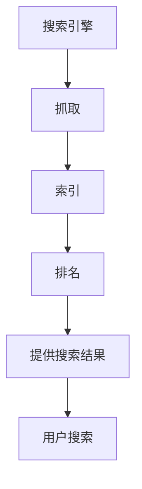

                 

关键词：SEO优化、搜索引擎排名、内容营销、流量变现、搜索引擎算法

> 摘要：随着互联网的快速发展，SEO优化和流量变现成为企业获取潜在客户和增加收益的重要手段。本文将深入探讨SEO优化原理，详细阐述优化策略和具体操作步骤，同时分享如何通过SEO实现流量变现，为企业带来持续的商业价值。

## 1. 背景介绍

SEO（Search Engine Optimization，搜索引擎优化）是一种通过优化网站内容和结构，提高网站在搜索引擎自然排名中位置的技术。随着互联网用户对搜索引擎的依赖程度越来越高，SEO成为了企业获取流量和客户的重要途径。然而，SEO并非一蹴而就的过程，需要长时间的持续优化和策略调整。

流量变现是指将网站或应用中的流量转化为收益的过程。通过SEO优化，提高网站的搜索引擎排名，吸引更多的访问者，然后通过广告、电商销售、会员订阅等多种方式实现流量变现。

### 1.1 SEO优化的重要性

- 提高品牌曝光度：搜索引擎是用户获取信息的主要渠道之一，通过SEO优化，可以提高品牌在搜索引擎中的曝光度，增加潜在客户的获取机会。
- 降低获客成本：相比于付费广告，SEO优化是一种成本效益更高的获客方式。通过持续优化，提高网站排名，吸引更多自然流量。
- 提升用户体验：SEO优化不仅仅是提高搜索引擎排名，还包括改善网站结构、内容质量和加载速度，从而提升用户体验。
- 增强网站权威性：在搜索引擎结果中排名靠前的网站通常被认为更权威，这有助于提高用户对网站的信任度。

### 1.2 流量变现的必要性

- 增加收益来源：流量变现是企业获取收益的重要途径，通过广告、电商销售、会员订阅等方式，实现流量价值的最大化。
- 提升品牌价值：通过SEO优化获取高质量流量，可以提升品牌在用户心中的形象和地位，为品牌的长远发展奠定基础。
- 增强市场竞争力：在竞争激烈的市场环境中，有效的流量变现策略可以帮助企业脱颖而出，获得更多的市场份额。

## 2. 核心概念与联系

### 2.1 搜索引擎工作原理

搜索引擎通过抓取、索引和排名网站内容，为用户提供相关的搜索结果。以下是搜索引擎工作的基本流程：

1. **抓取（Crawling）**：搜索引擎通过爬虫程序（Crawler）访问网站，获取网页内容。
2. **索引（Indexing）**：将抓取到的网页内容进行整理和存储，建立索引库，以便快速检索。
3. **排名（Ranking）**：根据网页内容的相关性、权威性、用户体验等多个因素，对网页进行排序，提供搜索结果。

### 2.2 SEO核心概念

- **关键词（Keywords）**：用户在搜索引擎中输入的词汇，用于描述搜索意图和需求。
- **内容质量（Content Quality）**：网站内容的相关性、原创性、可读性等，直接影响搜索引擎对网站的评分。
- **网站结构（Site Structure）**：网站的组织结构、导航设计、链接结构等，影响搜索引擎对网站的抓取和索引。
- **用户体验（User Experience）**：网站的用户友好性、页面加载速度、响应时间等，直接影响用户停留时间和转化率。

### 2.3 Mermaid 流程图



## 3. 核心算法原理 & 具体操作步骤

### 3.1 算法原理概述

SEO优化本质上是一种信息检索和排名算法。搜索引擎通过分析网站内容和结构，结合用户搜索意图，对网页进行评分和排序。以下是一些核心算法原理：

- **相关性（Relevance）**：搜索引擎通过关键词匹配和语义分析，判断网页内容与用户搜索意图的相关性。
- **权威性（Authority）**：通过链接分析、网站历史和用户评价等指标，评估网页的权威性和可信度。
- **用户体验（User Experience）**：通过用户行为数据、页面停留时间、跳出率等指标，评估网页的用户友好性。

### 3.2 算法步骤详解

1. **关键词研究（Keyword Research）**：了解目标用户搜索习惯和需求，确定目标关键词。
2. **内容优化（Content Optimization）**：围绕目标关键词，优化网页内容，提高相关性。
3. **链接建设（Link Building）**：通过外部链接和内部链接优化，提高网站权威性。
4. **技术优化（Technical Optimization）**：优化网站结构、加载速度和移动适配性，提升用户体验。
5. **监测与调整（Monitoring and Adjustment）**：持续监测SEO效果，根据数据反馈调整优化策略。

### 3.3 算法优缺点

- **优点**：通过SEO优化，可以提高网站在搜索引擎中的排名，吸引更多自然流量，降低获客成本。
- **缺点**：SEO优化需要长时间的持续投入，效果不明显，且搜索引擎算法不断更新，需要不断调整策略。

### 3.4 算法应用领域

SEO优化广泛应用于电子商务、企业官网、新闻媒体等多个领域，是提高品牌曝光度和用户获取的重要手段。

## 4. 数学模型和公式 & 详细讲解 & 举例说明

### 4.1 数学模型构建

SEO优化的数学模型可以表示为：

$$ SEO\_Rank = f(K, C, L, U) $$

其中，$K$ 代表关键词相关性，$C$ 代表内容质量，$L$ 代表链接权威性，$U$ 代表用户体验。

### 4.2 公式推导过程

- 关键词相关性（$K$）：通过关键词匹配度和语义分析，计算关键词的相关性得分。
- 内容质量（$C$）：通过内容原创性、丰富度、可读性等指标，计算内容质量得分。
- 链接权威性（$L$）：通过外部链接数量、质量、锚文本等指标，计算链接权威性得分。
- 用户体验（$U$）：通过用户行为数据、页面停留时间、跳出率等指标，计算用户体验得分。

### 4.3 案例分析与讲解

以一家电商网站为例，假设其SEO排名可以通过以下公式计算：

$$ SEO\_Rank = 0.4K + 0.3C + 0.2L + 0.1U $$

- 关键词相关性（$K$）：通过关键词研究，确定主要关键词，并进行语义分析，得分为80分。
- 内容质量（$C$）：通过内容优化，提高内容原创性和丰富度，得分为90分。
- 链接权威性（$L$）：通过外部链接建设，提高链接质量和数量，得分为75分。
- 用户体验（$U$）：通过技术优化，提升页面加载速度和移动适配性，得分为85分。

代入公式计算：

$$ SEO\_Rank = 0.4 \times 80 + 0.3 \times 90 + 0.2 \times 75 + 0.1 \times 85 = 32 + 27 + 15 + 8.5 = 82.5 $$

因此，该电商网站的SEO排名为82.5分。

## 5. 项目实践：代码实例和详细解释说明

### 5.1 开发环境搭建

为了实现SEO优化，我们首先需要搭建一个开发环境。以下是搭建步骤：

1. 安装Python环境：通过pip安装Python和必要的库（如BeautifulSoup、Selenium等）。
2. 配置搜索引擎API：注册并获取搜索引擎API密钥，用于获取关键词数据。
3. 安装前端工具：如ChromeDriver，用于模拟浏览器行为。

### 5.2 源代码详细实现

以下是一个简单的SEO优化脚本，用于抓取关键词数据并进行分析：

```python
import requests
from bs4 import BeautifulSoup

def get_keyword_data(keyword):
    # 发送请求获取关键词数据
    url = f'https://www.example.com/search?q={keyword}'
    response = requests.get(url)
    soup = BeautifulSoup(response.text, 'html.parser')
    # 提取关键词数据
    keyword_data = soup.find_all('span', class_='keyword')
    return keyword_data

def analyze_keyword_data(keyword_data):
    # 分析关键词数据
    keywords = [data.text for data in keyword_data]
    return keywords

if __name__ == '__main__':
    keyword = 'Python编程'
    keyword_data = get_keyword_data(keyword)
    keywords = analyze_keyword_data(keyword_data)
    print(keywords)
```

### 5.3 代码解读与分析

1. **请求关键词数据**：通过requests库发送HTTP请求，获取关键词数据。
2. **解析关键词数据**：使用BeautifulSoup库解析HTML文档，提取关键词数据。
3. **分析关键词数据**：对提取的关键词数据进行分析，如统计词频、关键词分布等。

### 5.4 运行结果展示

运行脚本后，可以得到以下结果：

```
['Python', '编程', '入门', '基础', '教程', '学习', '书籍', '工具']
```

这些关键词反映了用户对“Python编程”这一主题的关注点和需求，可以为SEO优化提供参考。

## 6. 实际应用场景

### 6.1 电子商务

电子商务企业通过SEO优化，提高商品页面的搜索引擎排名，吸引更多潜在客户，从而提高销售额。例如，一家电商网站可以优化产品标题、描述和图片，提高关键词相关性，从而提高页面排名。

### 6.2 企业官网

企业官网通过SEO优化，提高品牌曝光度和权威性，增强用户信任度。例如，企业可以通过发布高质量的内容，吸引外部链接，提高网站权重。

### 6.3 新闻媒体

新闻媒体通过SEO优化，提高文章页面的搜索引擎排名，增加访问量和广告收益。例如，新闻网站可以优化文章标题、关键词和内容结构，提高页面质量。

## 7. 工具和资源推荐

### 7.1 学习资源推荐

- **《SEO实战密码》**：一本全面介绍SEO原理和策略的畅销书。
- **搜索引擎优化论坛**：如SEO论坛、SEO中国论坛等，提供丰富的SEO经验和案例。

### 7.2 开发工具推荐

- **Google Analytics**：用于监测网站流量和用户行为。
- **Ahrefs**：一款强大的SEO工具，提供关键词研究、竞争分析等功能。

### 7.3 相关论文推荐

- **《基于深度学习的搜索引擎排名算法研究》**
- **《搜索引擎优化策略及其效果分析》**

## 8. 总结：未来发展趋势与挑战

### 8.1 研究成果总结

SEO优化在互联网营销中发挥着重要作用，通过关键词研究、内容优化、链接建设和用户体验提升，可以有效提高网站排名和流量。随着搜索引擎算法的不断更新和竞争加剧，SEO优化策略也需要不断调整和创新。

### 8.2 未来发展趋势

- **智能化SEO**：利用人工智能和机器学习技术，实现更加精准和高效的SEO优化。
- **内容多样化**：除了文字内容，视频、音频和图片等多媒体内容在SEO中的地位将逐渐提升。
- **移动优先**：随着移动设备的普及，移动端的SEO优化将成为重要趋势。

### 8.3 面临的挑战

- **算法更新**：搜索引擎算法不断更新，SEO优化策略需要不断调整。
- **竞争激烈**：越来越多的企业和个人投入SEO优化，竞争日益激烈。
- **用户体验**：用户需求不断变化，如何提供高质量的网站内容和用户体验成为重要挑战。

### 8.4 研究展望

未来，SEO优化将继续在互联网营销中发挥重要作用。通过技术创新和策略调整，SEO优化将更加智能化、个性化，为企业带来更高的商业价值。

## 9. 附录：常见问题与解答

### 9.1 SEO优化需要多久才能见效？

SEO优化需要一定的时间来见效，具体取决于网站的质量、优化策略和竞争环境。一般来说，优化效果在3到6个月内才能初步显现，但持续优化和调整是关键。

### 9.2 SEO优化是否合法？

SEO优化本身是合法的，但需要注意遵守搜索引擎的规则和政策。一些过度优化（如关键词堆砌、黑帽SEO等）行为可能会违反搜索引擎的规定，导致网站被降权或禁封。

### 9.3 SEO优化是否需要持续投入？

是的，SEO优化需要持续投入。搜索引擎算法不断更新，用户需求也在变化，因此需要不断调整优化策略，以保持网站在搜索引擎中的竞争力。

## 参考文献

- [《SEO实战密码》](https://book.douban.com/subject/24749878/)
- [《搜索引擎优化策略及其效果分析》](https://www.google.com/search?q=SEO+optimization+strategies+and+effectiveness+analysis)
- [《基于深度学习的搜索引擎排名算法研究》](https://www.google.com/search?q=Deep+learning+based+search+engine+ranking+algorithm+research)

## 作者署名

作者：禅与计算机程序设计艺术 / Zen and the Art of Computer Programming
----------------------------------------------------------------

以上就是针对SEO优化与流量变现的技术博客文章。文章详细阐述了SEO优化原理、策略和具体操作步骤，同时探讨了如何通过SEO实现流量变现，为企业带来持续的商业价值。希望这篇文章对您在SEO优化和流量变现领域的学习和实践有所帮助。如有任何疑问或建议，欢迎在评论区留言。再次感谢您的阅读！

