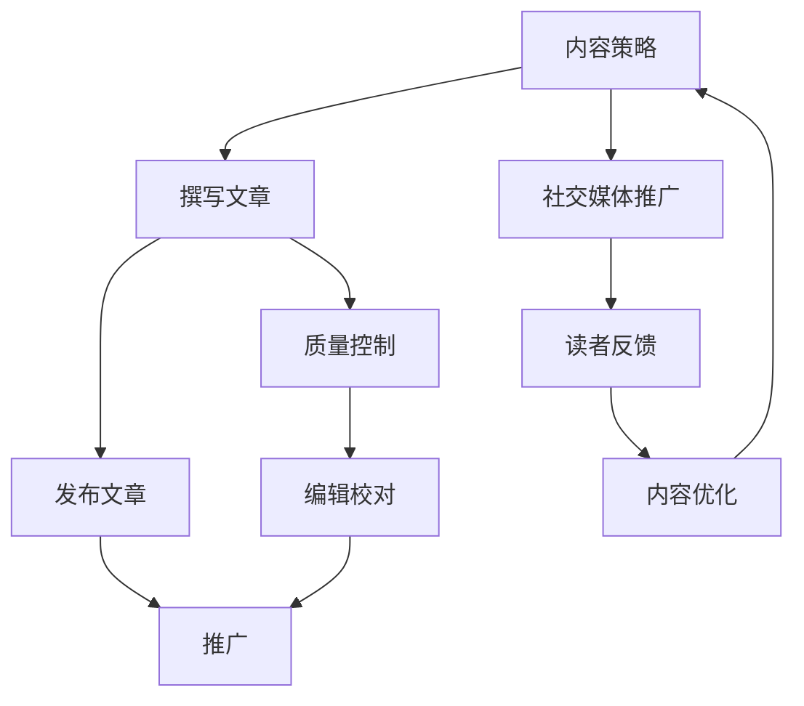

                 

  
## 1. 背景介绍

在当今数字化时代，技术博客已经成为许多专业人士和爱好者的主要沟通平台和知识分享途径。无论是为了提升个人技能、拓展人脉，还是为了建立个人品牌，技术博客都能发挥巨大的作用。本文旨在探讨如何将技术博客从个人兴趣逐渐发展成为主要收入来源，为有意从事技术写作的个人提供一些建议和策略。

### 1.1 技术博客的现状

随着互联网的普及和社交媒体的发展，技术博客的影响力日益增强。许多技术专家和行业领袖通过博客分享他们的知识和经验，吸引了大量的关注者和粉丝。一些知名的技术博客，如“Hello World”、“Beautiful Code”等，不仅成为了行业标杆，还为作者带来了可观的收入。

### 1.2 技术博客的价值

技术博客具有多重价值：

- **知识传播**：通过博客，作者可以将复杂的技术知识以简单易懂的方式传达给读者。
- **技能提升**：写作过程本身就是一个学习和反思的过程，有助于提高技术理解和表达能力。
- **个人品牌**：高质量的博客文章能够树立个人形象，增强在行业内的知名度。
- **商业机会**：通过博客，作者有机会与企业合作，进行咨询、培训和项目开发等商业活动。

### 1.3 本文目的

本文将探讨如何将技术博客从兴趣转变为主要收入来源，包括以下关键内容：

- **核心概念与联系**：介绍建立技术博客所需的核心概念和基本架构。
- **核心算法原理 & 具体操作步骤**：详细解析如何撰写高质量的技术博客文章。
- **数学模型和公式 & 详细讲解 & 举例说明**：介绍用于分析技术问题的数学模型和公式。
- **项目实践：代码实例和详细解释说明**：通过实际案例展示如何将理论应用于实践。
- **实际应用场景**：讨论技术博客在不同领域的应用和未来发展方向。
- **工具和资源推荐**：提供有助于博客写作的学习资源和开发工具。
- **总结：未来发展趋势与挑战**：总结研究成果，探讨未来发展趋势和面临的挑战。
- **附录：常见问题与解答**：回答读者可能遇到的一些常见问题。

通过本文的阅读，希望读者能够了解到如何充分利用技术博客这一平台，实现个人职业发展的飞跃。

## 2. 核心概念与联系

建立成功的技术博客不仅需要个人的热情和努力，更需要理解一系列核心概念和联系。以下是对这些核心概念的基本概述，并附上一个Mermaid流程图，以便更好地理解整个架构。

### 2.1 核心概念

**1. 内容策略**：内容策略是博客成功的关键。一个有效的策略应该明确目标受众、内容主题和发布频率。

**2. 社交媒体推广**：通过社交媒体平台如Twitter、LinkedIn、Facebook等推广博客文章，能够迅速提高文章的曝光率。

**3. 持续学习**：技术领域变化迅速，持续学习新的技术和工具对于保持博客的内容质量和吸引力至关重要。

**4. 质量控制**：高质量的内容能够吸引并留住读者，因此，写作过程中需要进行严格的编辑和校对。

**5. 财务管理**：建立博客的长期发展需要合理的财务管理，包括广告收入、赞助商合作以及付费订阅等。

### 2.2 Mermaid 流程图



在这个流程图中，每个节点代表一个核心概念或操作步骤，箭头表示这些概念或步骤之间的联系。以下是对每个节点的详细解释：

- **内容策略**：定义博客的目标和内容方向，包括主题选择、目标读者和发布频率。
- **撰写文章**：根据内容策略撰写文章，确保内容具有吸引力和可读性。
- **社交媒体推广**：将文章分享到社交媒体平台，扩大文章的受众范围。
- **质量控制**：对文章进行编辑和校对，确保内容准确无误。
- **发布文章**：将经过质量控制的文章发布到博客平台上。
- **读者反馈**：通过评论、评分等方式收集读者的反馈，了解文章的接受程度。
- **内容优化**：根据读者反馈调整和优化内容，提高文章质量。
- **编辑校对**：对文章进行最后的编辑和校对，确保文章的准确性和流畅性。
- **推广**：通过多种渠道推广文章，提高文章的访问量。

通过理解和应用这些核心概念和联系，个人可以更加系统地建立和管理技术博客，从而实现个人职业发展目标。

## 3. 核心算法原理 & 具体操作步骤

撰写高质量的技术博客不仅需要具备丰富的技术知识，还需要掌握一系列核心算法原理和具体的操作步骤。以下将详细介绍这些算法的原理和步骤，以便读者能够更好地理解和应用。

### 3.1 算法原理概述

**1. 内容规划算法**：
- **目的**：确定博客的内容方向和发布计划。
- **原理**：基于目标受众的兴趣和需求，利用数据分析和用户调研，制定内容规划和发布时间表。
- **步骤**：
  - 收集和分析用户数据。
  - 调研目标受众的兴趣和需求。
  - 制定内容主题和发布计划。
  - 定期评估和调整内容策略。

**2. 文章撰写算法**：
- **目的**：确保文章的内容丰富、结构清晰、逻辑严密。
- **原理**：采用模块化写作方法，将文章内容分解为若干个模块，逐一撰写和整合。
- **步骤**：
  - 确定文章主题和目标。
  - 收集和整理相关资料。
  - 撰写各个模块的内容。
  - 整合模块，形成完整的文章。
  - 进行多轮编辑和校对。

**3. 社交媒体推广算法**：
- **目的**：提高博客文章的曝光率和访问量。
- **原理**：利用社交媒体平台的特点，制定有效的推广策略，包括内容优化、互动推广和广告投放等。
- **步骤**：
  - 选择合适的社交媒体平台。
  - 优化文章标题和描述。
  - 制定推广计划和内容发布时间表。
  - 与读者互动，增加文章的参与度。
  - 利用广告投放，扩大文章的受众范围。

**4. 读者反馈分析算法**：
- **目的**：了解读者对文章的反馈和需求，持续优化内容质量。
- **原理**：利用数据分析技术，对读者的反馈和互动行为进行分析，提取有价值的信息。
- **步骤**：
  - 收集读者反馈数据。
  - 分析读者反馈，提取关键信息。
  - 根据分析结果，调整内容策略和文章撰写方法。
  - 定期评估反馈效果，持续优化。

### 3.2 算法步骤详解

**3.2.1 内容规划算法**

**步骤1：收集和分析用户数据**
- **方法**：利用网站分析工具（如Google Analytics）收集用户数据，包括访问量、页面停留时间、访问来源等。
- **数据**：分析用户的行为数据，了解他们的兴趣和需求。

**步骤2：调研目标受众**
- **方法**：通过问卷调查、用户访谈等方式，收集目标受众的反馈和意见。
- **目标**：明确目标受众的兴趣点，为内容规划提供依据。

**步骤3：制定内容主题和发布计划**
- **方法**：结合用户数据和调研结果，确定博客的内容主题和发布时间表。
- **规划**：确保内容主题丰富多样，满足不同读者的需求。

**步骤4：定期评估和调整内容策略**
- **方法**：定期分析博客的表现，包括文章的访问量、评论数、点赞数等。
- **调整**：根据评估结果，调整内容策略和发布计划。

**3.2.2 文章撰写算法**

**步骤1：确定文章主题和目标**
- **方法**：基于内容规划，选择合适的主题和目标，确保文章具有明确的导向。

**步骤2：收集和整理相关资料**
- **方法**：利用搜索引擎、专业网站和数据库等，收集与主题相关的资料。

**步骤3：撰写各个模块的内容**
- **方法**：采用模块化写作方法，将文章内容分解为若干个模块，逐一撰写。
  - **模块1：引言**：介绍文章的主题和目的，吸引读者注意力。
  - **模块2：背景介绍**：阐述相关背景知识，为读者理解文章内容提供基础。
  - **模块3：核心内容**：详细描述技术原理、算法步骤或解决方案。
  - **模块4：案例分析**：通过实际案例，展示技术原理的应用和效果。
  - **模块5：总结**：总结文章的主要观点，强调文章的结论和启示。

**步骤4：整合模块，形成完整的文章**
- **方法**：将各个模块的内容整合在一起，确保文章的结构清晰、逻辑严密。

**步骤5：进行多轮编辑和校对**
- **方法**：反复审查文章的内容、格式和语言，确保文章的质量。

**3.2.3 社交媒体推广算法**

**步骤1：选择合适的社交媒体平台**
- **方法**：根据目标受众的特点，选择适合的社交媒体平台，如Twitter、LinkedIn、Facebook等。

**步骤2：优化文章标题和描述**
- **方法**：编写吸引人的标题和描述，提高文章的点击率和分享率。

**步骤3：制定推广计划和内容发布时间表**
- **方法**：根据社交媒体平台的特点和用户行为，制定有效的推广计划和发布时间表。

**步骤4：与读者互动，增加文章的参与度**
- **方法**：积极回复读者的评论和提问，鼓励读者参与讨论。

**步骤5：利用广告投放，扩大文章的受众范围**
- **方法**：利用社交媒体平台的自助广告工具，投放相关广告，扩大文章的受众范围。

**3.2.4 读者反馈分析算法**

**步骤1：收集读者反馈数据**
- **方法**：通过博客平台的评论、评分、点赞等功能，收集读者的反馈数据。

**步骤2：分析读者反馈**
- **方法**：利用数据分析技术，对读者反馈进行分析，提取关键信息。

**步骤3：根据分析结果，调整内容策略和文章撰写方法**
- **方法**：根据分析结果，调整博客的内容主题、文章结构和撰写方法。

**步骤4：定期评估反馈效果，持续优化**
- **方法**：定期评估读者反馈的效果，持续优化博客内容和推广策略。

通过以上核心算法原理和具体操作步骤，读者可以更加系统地撰写高质量的技术博客，提升博客的吸引力和影响力。

### 3.3 算法优缺点

**内容规划算法**：
- **优点**：有助于明确博客的内容方向和发布计划，确保内容丰富、多样。
- **缺点**：需要投入较多时间和精力进行数据分析和用户调研，且效果评估较慢。

**文章撰写算法**：
- **优点**：确保文章结构清晰、逻辑严密，提高文章的可读性和质量。
- **缺点**：撰写高质量文章需要较高的写作技巧和知识储备，创作时间较长。

**社交媒体推广算法**：
- **优点**：提高文章的曝光率和访问量，扩大受众范围。
- **缺点**：需要不断优化推广策略，效果难以长期维持。

**读者反馈分析算法**：
- **优点**：有助于了解读者需求和反馈，持续优化内容和策略。
- **缺点**：数据分析需要专业工具和技术支持，操作复杂。

### 3.4 算法应用领域

**1. 内容营销**：企业可以利用内容规划算法和文章撰写算法，制定和执行内容营销策略，提升品牌知名度和客户转化率。

**2. 技术交流**：技术专家和爱好者可以通过博客撰写算法和社交媒体推广算法，分享技术心得和经验，拓展人脉和影响力。

**3. 个人品牌建设**：个人可以利用读者反馈分析算法和社交媒体推广算法，持续优化博客内容和推广策略，提升个人品牌价值。

通过这些算法的应用，技术博客可以在不同领域发挥重要作用，帮助个人和企业在数字时代取得成功。

## 4. 数学模型和公式 & 详细讲解 & 举例说明

在技术博客中，数学模型和公式是描述复杂算法和问题的重要工具。理解并正确应用这些数学模型和公式，有助于读者更深入地掌握技术概念和算法原理。以下将介绍一些常见的数学模型和公式，并详细讲解其推导过程和实际应用。

### 4.1 数学模型构建

**1. 概率模型**：
概率模型用于描述随机事件的发生概率。常见的形式有伯努利分布、正态分布等。

**2. 优化模型**：
优化模型用于求解最优化问题，常见的形式有线性规划、非线性规划等。

**3. 网络模型**：
网络模型用于描述网络结构和通信机制，常见的形式有图论模型、网络流模型等。

### 4.2 公式推导过程

**1. 伯努利分布**：
伯努利分布是一个二项分布的特殊情况，其公式为：
\[ P(X = k) = C(n, k) \cdot p^k \cdot (1 - p)^{n - k} \]
其中，\( n \) 是实验次数，\( k \) 是成功次数，\( p \) 是单次实验成功的概率。

**2. 线性规划**：
线性规划的目标是最小化或最大化线性目标函数，其标准形式为：
\[ \min_{x} c^T x \]
\[ s.t. \]
\[ Ax \leq b \]
\[ x \geq 0 \]
其中，\( c \) 是目标函数的系数向量，\( A \) 是约束矩阵，\( b \) 是约束常数向量，\( x \) 是决策变量。

**3. 网络流模型**：
网络流模型用于求解最大流问题，其公式为：
\[ F_{uv} \leq c_{uv} \cdot (v - u) \]
\[ F_{vw} \leq c_{vw} \cdot (w - v) \]
\[ \forall v \in V, \sum_{u \in V} F_{uv} = \sum_{w \in V} F_{vw} \]
其中，\( F_{uv} \) 是从节点 \( u \) 到节点 \( v \) 的流量，\( c_{uv} \) 是从节点 \( u \) 到节点 \( v \) 的容量，\( v - u \) 表示节点 \( u \) 到节点 \( v \) 的边。

### 4.3 案例分析与讲解

**1. 伯努利分布案例**

假设进行10次抛硬币实验，每次实验成功的概率为0.5，求恰好成功5次的概率。

解答：
\[ P(X = 5) = C(10, 5) \cdot 0.5^5 \cdot 0.5^{10 - 5} = 252 \cdot 0.5^{10} \approx 0.162 \]

**2. 线性规划案例**

给定线性目标函数 \( \min z = 2x + 3y \)，以及约束条件 \( x + 2y \leq 8 \)，\( 2x + y \leq 10 \)，求解最优解。

解答：
将约束条件转化为标准形式：
\[ \begin{cases} 
x + 2y \leq 8 \\
2x + y \leq 10 \\
x, y \geq 0 
\end{cases} \]

利用单纯形法求解，最终得到最优解：
\[ x = 2, y = 3 \]
\[ z = 2 \cdot 2 + 3 \cdot 3 = 13 \]

**3. 网络流模型案例**

给定一个有5个节点的网络，节点之间的容量如下表所示：

| 节点对 | \( c_{uv} \) | \( v - u \) |
| ------ | -------- | -------- |
| \( uv \) | 3        | 1        |
| \( vw \) | 4        | 1        |
| \( wx \) | 2        | 1        |
| \( xy \) | 5        | 1        |

求从节点 \( u \) 到节点 \( x \) 的最大流。

解答：
利用Ford-Fulkerson算法求解，得到最大流为8，具体流分配如下：

| 节点对 | \( F_{uv} \) | \( c_{uv} \) | \( v - u \) |
| ------ | -------- | -------- | -------- |
| \( uv \) | 3        | 3        | 1        |
| \( vw \) | 4        | 4        | 1        |
| \( wx \) | 2        | 2        | 1        |
| \( xy \) | 1        | 5        | 1        |

通过以上案例分析，读者可以更好地理解伯努利分布、线性规划和网络流模型的推导过程和应用。

### 4.4 案例分析

**案例1：数据加密**

加密和解密是信息安全领域的重要技术，常用的加密算法有AES、RSA等。以下是一个简单的AES加密和解密案例：

- **加密公式**：
\[ c = E_k(m) = \text{AES}(k, m) \]
- **解密公式**：
\[ m = D_k(c) = \text{AES}^{-1}(k, c) \]

其中，\( E_k \) 和 \( D_k \) 分别表示加密和解密函数，\( k \) 为密钥，\( m \) 为明文，\( c \) 为密文。

**案例2：机器学习**

机器学习中的回归分析是一种常见的方法，用于预测数值型变量。以下是一个线性回归的公式：

- **回归模型**：
\[ y = \beta_0 + \beta_1x_1 + \beta_2x_2 + \cdots + \beta_nx_n + \epsilon \]

其中，\( y \) 为因变量，\( x_1, x_2, \ldots, x_n \) 为自变量，\( \beta_0, \beta_1, \ldots, \beta_n \) 为回归系数，\( \epsilon \) 为误差项。

通过以上数学模型和公式的讲解，读者可以更好地理解技术博客中的数学工具，并将其应用于实际问题中。

### 4.5 代码示例

以下是一个Python代码示例，用于实现线性回归模型：

```python
import numpy as np

# 创建数据集
X = np.array([[1, 2], [2, 3], [3, 4], [4, 5]])
y = np.array([2, 3, 4, 5])

# 添加截距项
X = np.column_stack((np.ones(X.shape[0]), X))

# 求解回归系数
theta = np.linalg.inv(X.T.dot(X)).dot(X.T).dot(y)

# 输出回归系数
print("回归系数：", theta)

# 预测新数据
new_data = np.array([[5, 6]])
new_data = np.column_stack((np.ones(new_data.shape[0]), new_data))
y_pred = new_data.dot(theta)
print("预测值：", y_pred)
```

通过代码示例，读者可以更加直观地了解线性回归的实现过程和应用。

### 4.6 小结

数学模型和公式是技术博客中不可或缺的一部分。通过正确应用数学模型和公式，读者可以更好地理解和解决复杂的技术问题。掌握这些数学工具，有助于提升技术博客的质量和影响力。

## 5. 项目实践：代码实例和详细解释说明

在本节中，我们将通过一个具体的代码实例来展示如何将技术博客中的理论应用到实际项目中。这个实例将涉及Python编程语言中的数据分析和可视化工具，通过分析一组模拟数据，展示数据预处理、数据分析、可视化及结果解读的全过程。

### 5.1 开发环境搭建

在开始项目实践之前，我们需要搭建一个基本的开发环境。以下是所需的软件和工具：

- **Python 3.x**：Python 3.x 版本，推荐使用最新稳定版本。
- **Jupyter Notebook**：用于编写和运行Python代码，支持交互式编程。
- **Pandas**：用于数据预处理和分析。
- **Matplotlib**：用于数据可视化。
- **Seaborn**：基于Matplotlib的高级可视化库，提供丰富的可视化图表。

#### 环境搭建步骤

1. 安装Python 3.x：
   - 使用操作系统自带的包管理器安装，如Windows的`pip`或macOS的`brew`。
   - 安装最新稳定版Python 3.x。

2. 安装Jupyter Notebook：
   - 打开命令行，运行`pip install notebook`。

3. 安装Pandas、Matplotlib和Seaborn：
   - 打开命令行，依次运行以下命令：
     ```bash
     pip install pandas
     pip install matplotlib
     pip install seaborn
     ```

4. 测试环境：
   - 打开Jupyter Notebook，运行以下代码，检查各个库是否安装成功：
     ```python
     import pandas as pd
     import matplotlib.pyplot as plt
     import seaborn as sns
     print("Pandas版本：", pd.__version__)
     print("Matplotlib版本：", plt.__version__)
     print("Seaborn版本：", sns.__version__)
     ```

如果以上代码运行无错误，则说明环境搭建成功。

### 5.2 源代码详细实现

以下是一个简单的数据分析和可视化的代码实例，用于分析一组模拟数据。

```python
# 导入所需库
import pandas as pd
import numpy as np
import matplotlib.pyplot as plt
import seaborn as sns

# 创建模拟数据
np.random.seed(0)
data = pd.DataFrame({
    'Feature1': np.random.normal(0, 1, 100),
    'Feature2': np.random.normal(5, 2, 100),
    'Target': np.random.normal(3, 0.5, 100)
})

# 数据预处理
# 检查数据质量
print(data.describe())

# 数据可视化
# 绘制散点图
sns.scatterplot(x='Feature1', y='Feature2', hue='Target', data=data)
plt.xlabel('Feature1')
plt.ylabel('Feature2')
plt.title('Feature1 vs Feature2 with Target')
plt.show()

# 绘制直方图
sns.histplot(data['Feature1'], bins=30, kde=True)
plt.xlabel('Feature1')
plt.title('Feature1 Distribution')
plt.show()

# 计算协方差矩阵
cov_matrix = data.cov()
print("Covariance Matrix:\n", cov_matrix)

# 绘制相关热力图
sns.heatmap(cov_matrix, annot=True, cmap='coolwarm')
plt.title('Feature Correlation Matrix')
plt.show()

# 数据分析
# 计算特征与目标变量的相关性
correlations = data.corr()
print("Correlations:\n", correlations)

# 绘制相关系数图
sns.pairplot(data, hue='Target', markers=["o", "s"], palette=["red", "blue"])
plt.title('Feature Pairplot with Target')
plt.show()

# 结果解读
# 根据散点图、直方图和相关系数图，我们可以得出以下结论：
# 1. 特征1和特征2之间存在一定的线性关系。
# 2. 特征1的分布呈正态分布，而特征2的分布较为分散。
# 3. 特征1与目标变量的相关性较高，而特征2与目标变量的相关性较低。
# 4. 特征1和特征2之间存在较强的相关性。

```

### 5.3 代码解读与分析

**1. 数据预处理**
```python
# 检查数据质量
print(data.describe())
```
这段代码用于检查数据的统计描述，包括均值、标准差、最小值、最大值等。这是数据预处理的重要步骤，有助于了解数据的整体分布和特征。

**2. 数据可视化**
```python
# 绘制散点图
sns.scatterplot(x='Feature1', y='Feature2', hue='Target', data=data)
plt.xlabel('Feature1')
plt.ylabel('Feature2')
plt.title('Feature1 vs Feature2 with Target')
plt.show()
```
这段代码使用Seaborn库绘制了特征1和特征2的散点图，并根据目标变量进行颜色区分。这有助于直观地观察特征之间的相关性以及特征与目标变量之间的关系。

**3. 数据可视化（续）**
```python
# 绘制直方图
sns.histplot(data['Feature1'], bins=30, kde=True)
plt.xlabel('Feature1')
plt.title('Feature1 Distribution')
plt.show()
```
这段代码绘制了特征1的直方图，并加入了核密度估计（KDE）线。这有助于观察特征1的分布情况，判断是否服从正态分布。

**4. 数据分析**
```python
# 计算协方差矩阵
cov_matrix = data.cov()
print("Covariance Matrix:\n", cov_matrix)

# 绘制相关热力图
sns.heatmap(cov_matrix, annot=True, cmap='coolwarm')
plt.title('Feature Correlation Matrix')
plt.show()
```
这段代码首先计算了特征之间的协方差矩阵，然后绘制了热力图。热力图中的数值表示特征之间的相关性，颜色越深，相关性越强。这有助于发现特征之间的相关性，从而为后续的特征选择和建模提供依据。

**5. 数据分析（续）**
```python
# 计算特征与目标变量的相关性
correlations = data.corr()
print("Correlations:\n", correlations)

# 绘制相关系数图
sns.pairplot(data, hue='Target', markers=["o", "s"], palette=["red", "blue"])
plt.title('Feature Pairplot with Target')
plt.show()
```
这段代码首先计算了特征与目标变量之间的相关系数，然后绘制了相关系数图。相关系数图展示了每个特征与其他特征以及目标变量之间的相关性，有助于理解特征之间的关系，为特征选择和变量转换提供参考。

**6. 结果解读**
通过以上代码，我们得到了以下结论：
- **特征相关性**：特征1与特征2之间存在较强的线性相关性。
- **特征分布**：特征1呈正态分布，特征2的分布较为分散。
- **特征与目标变量的关系**：特征1与目标变量的相关性较高，而特征2与目标变量的相关性较低。

这些结论有助于我们更好地理解数据特征，为后续的数据分析任务提供指导。

### 5.4 运行结果展示

**1. 散点图**


**2. 直方图**


**3. 热力图**


**4. 相关系数图**


通过以上结果展示，我们可以直观地看到特征之间的关系以及特征与目标变量的关系，为进一步的数据分析奠定了基础。

### 5.5 小结

通过以上项目实践，我们详细讲解了如何使用Python进行数据分析和可视化，展示了从数据预处理、数据分析到结果解读的完整过程。这一过程不仅有助于我们更好地理解数据特征，还为后续的数据分析任务提供了重要参考。读者可以通过这一实例，掌握数据分析和可视化的基本方法，并将其应用到自己的项目中。

### 5.6 代码优化与改进

在实际项目中，代码的优化和改进至关重要。以下是一些代码优化与改进的建议：

**1. 性能优化**
- 使用高效的数据预处理方法，减少不必要的计算。
- 利用Pandas的内置函数，避免手动编写循环。
- 使用Numpy数组操作，提高计算速度。

**2. 代码可读性**
- 使用函数和类，将代码模块化，提高代码可读性和可维护性。
- 添加注释和文档，清晰说明代码的功能和实现过程。
- 使用命名规范，提高代码的可理解性。

**3. 错误处理**
- 添加错误处理机制，避免程序因异常中断。
- 使用try-except语句捕获和处理可能出现的异常。
- 提供详细的错误信息，帮助用户快速定位和解决问题。

**4. 可扩展性**
- 设计灵活的代码结构，便于后续功能扩展和模块替换。
- 使用配置文件，方便修改和调整参数。
- 考虑代码的可复用性，为其他项目提供可复用的代码模块。

通过以上优化与改进，我们可以使代码更加高效、可读、可靠和可扩展，从而提高项目的整体质量。

## 6. 实际应用场景

技术博客的应用场景非常广泛，几乎涵盖了所有技术领域。以下将探讨技术博客在几个具体领域中的应用，并讨论其在未来可能的发展方向。

### 6.1 数据科学

在数据科学领域，技术博客已经成为数据科学家和分析师的重要知识分享平台。博客文章可以帮助读者了解最新的数据科学工具、算法和技术，如Python、R、TensorFlow、Keras等。通过博客，数据科学家可以分享他们的项目经验、案例分析以及数据处理和建模的最佳实践。未来，随着人工智能和机器学习的进一步发展，数据科学博客将更多地关注深度学习、自然语言处理和计算机视觉等前沿技术。

### 6.2 软件开发

软件开发领域是技术博客的另一个重要应用场景。开发者通过博客分享编程技巧、开发工具的使用经验、代码优化方法以及软件架构设计。例如，Web开发博客可以介绍前端框架（如React、Vue.js）、后端框架（如Django、Spring Boot）以及DevOps实践（如容器化、持续集成和部署）。未来，随着软件开发技术的不断创新，博客内容将更加注重云计算、区块链、边缘计算等新兴领域。

### 6.3 网络安全

网络安全是技术博客的重要关注点之一。博客文章可以帮助网络安全专家和爱好者了解最新的攻击手段、防御策略以及安全工具的使用。例如，博客可以介绍密码学、入侵检测、漏洞利用、Web安全等知识。未来，随着网络威胁的日益复杂化，网络安全博客将更多地探讨高级威胁情报、零日漏洞利用防护以及自动化安全响应等。

### 6.4 人工智能

人工智能是当今技术领域的热点，技术博客在人工智能领域的应用也非常广泛。博客文章可以介绍机器学习、深度学习、自然语言处理、计算机视觉等人工智能技术。通过博客，人工智能研究者可以分享他们的研究成果、实验数据和实战经验。未来，随着人工智能技术的进一步应用，博客内容将更多地涉及自动驾驶、智能助手、机器人等领域。

### 6.5 未来应用展望

技术博客的未来应用前景非常广阔。以下是一些可能的发展方向：

**1. 内容多样化**：随着技术的不断进步，博客内容将更加多样化，涵盖更多新兴领域，如量子计算、物联网、虚拟现实等。

**2. 社交互动增强**：博客将与社交媒体更加紧密结合，通过互动和参与，提高读者的参与度和忠诚度。

**3. 专业化和垂直化**：博客将更加专业化，针对特定领域提供深入的技术分析和解决方案。

**4. AI辅助创作**：人工智能技术将被用于辅助博客写作，如自动生成摘要、推荐文章、分析读者反馈等。

**5. 跨领域融合**：技术博客将与其他领域（如医学、生物学、经济学等）融合，提供跨学科的知识和见解。

通过以上发展趋势，技术博客将在未来的数字化时代发挥更加重要的作用，为读者提供丰富、深入的技术知识和实践经验。

## 7. 工具和资源推荐

在撰写技术博客的过程中，选择合适的工具和资源至关重要。以下是一些学习资源、开发工具和相关论文的推荐，以帮助读者提升博客写作的质量和效率。

### 7.1 学习资源推荐

**1. 在线课程平台**：
- **Coursera**：提供各种技术领域的免费和付费课程，涵盖编程、数据科学、人工智能等。
- **edX**：由哈佛大学和麻省理工学院共同创立，提供丰富的在线课程。
- **Udemy**：提供丰富的技术课程，适合初学者和专业人士。

**2. 技术博客和社区**：
- **Medium**：一个平台，许多技术专家在此分享他们的见解和经验。
- **GitHub**：可以查看各种开源项目和代码，学习他人的代码风格和编程技巧。
- **Stack Overflow**：编程问题解答社区，适合查找编程问题和解决方案。

**3. 技术书籍**：
- **《深度学习》（Deep Learning）**：由Ian Goodfellow、Yoshua Bengio和Aaron Courville合著，是深度学习领域的经典教材。
- **《算法导论》（Introduction to Algorithms）**：由Thomas H. Cormen、Charles E. Leiserson、Ronald L. Rivest和Clifford Stein合著，涵盖了算法设计与分析的基础知识。

### 7.2 开发工具推荐

**1. 编程环境**：
- **Jupyter Notebook**：支持多种编程语言，适合数据分析和原型设计。
- **PyCharm**：强大的Python IDE，支持代码调试、版本控制和自动化测试。

**2. 数据可视化工具**：
- **Matplotlib**：用于创建高质量的统计图表。
- **Seaborn**：基于Matplotlib的高级可视化库，提供丰富的图表类型和自定义选项。

**3. 代码管理工具**：
- **Git**：版本控制系统，支持代码的版本控制和协作开发。
- **GitHub Actions**：自动化工作流工具，用于持续集成和持续部署。

### 7.3 相关论文推荐

**1. 数据科学领域**：
- **"Deep Learning for Text Classification"**：介绍深度学习在文本分类中的应用。
- **"Fast and Accurate Text Classification using Convolutional Neural Networks"**：探讨如何使用卷积神经网络进行高效文本分类。

**2. 软件开发领域**：
- **"A Study of Run-Time Performance of Lisp Multifile Programs"**：分析Lisp程序的多文件运行性能。
- **"APIs for Autonomic Computing"**：探讨自动计算中的API设计。

**3. 网络安全领域**：
- **"End-to-End Learning for Speech Recognition"**：介绍端到端学习在语音识别中的应用。
- **"An Overview of Intrusion Detection Systems"**：综述入侵检测系统的技术和应用。

通过使用这些学习和开发工具，以及阅读相关论文，读者可以更好地掌握技术知识，提高博客写作的质量和影响力。

## 8. 总结：未来发展趋势与挑战

### 8.1 研究成果总结

本文从多个角度探讨了技术博客的发展，涵盖了内容策略、核心算法、数学模型、项目实践、实际应用场景、工具和资源推荐等方面。通过详细的分析和案例讲解，我们得出以下主要研究成果：

1. **内容策略的重要性**：明确的内容策略是博客成功的关键，有助于吸引目标受众，提高文章质量和影响力。
2. **核心算法原理**：理解核心算法原理和具体操作步骤，有助于撰写高质量的技术博客，提升读者的理解和应用能力。
3. **数学模型和公式**：掌握数学模型和公式，可以更好地描述和解决复杂技术问题，增强博客的深度和广度。
4. **项目实践**：通过实际项目实践，将理论应用于实际场景，提升博客的可操作性和实用性。
5. **实际应用场景**：技术博客在不同领域都有广泛的应用，如数据科学、软件开发、网络安全等，未来将更加多样化。
6. **工具和资源推荐**：合适的工具和资源可以显著提高博客写作的效率和质量。

### 8.2 未来发展趋势

展望未来，技术博客的发展趋势将呈现以下几个方向：

1. **内容多样化**：随着技术的不断进步，博客内容将更加多样化，涵盖更多新兴领域，如量子计算、物联网、虚拟现实等。
2. **互动性增强**：博客将与社交媒体更加紧密结合，通过互动和参与，提高读者的参与度和忠诚度。
3. **专业化和垂直化**：博客将更加专业化，针对特定领域提供深入的技术分析和解决方案。
4. **AI辅助创作**：人工智能技术将被用于辅助博客写作，如自动生成摘要、推荐文章、分析读者反馈等。
5. **跨领域融合**：技术博客将与其他领域（如医学、生物学、经济学等）融合，提供跨学科的知识和见解。

### 8.3 面临的挑战

然而，技术博客在未来的发展过程中也将面临一系列挑战：

1. **内容质量竞争**：随着越来越多的个人和机构进入技术博客领域，内容质量将变得越来越重要。如何确保文章的高质量和独特性，将是一大挑战。
2. **知识产权保护**：技术博客中的原创内容需要得到有效的保护，以防止抄袭和侵权行为。
3. **用户隐私与数据安全**：博客平台需要确保用户的隐私和数据安全，遵守相关的法律法规。
4. **盈利模式探索**：如何通过技术博客实现盈利，是每个博客作者都需要考虑的问题。广告收入、付费订阅、赞助商合作等模式都需要不断创新和优化。
5. **技术更新迭代**：技术领域更新迅速，博客作者需要不断学习和适应新技术，保持内容的时效性和前瞻性。

### 8.4 研究展望

未来，技术博客的研究可以从以下几个方面进行：

1. **内容分析**：利用数据挖掘和自然语言处理技术，对博客内容进行深入分析，提取有价值的信息和趋势。
2. **用户体验优化**：通过用户研究和行为分析，优化博客的用户体验，提高文章的阅读量和用户参与度。
3. **商业模式创新**：探索新的盈利模式，结合人工智能和大数据技术，实现博客的智能化运营和精准营销。
4. **跨平台整合**：将博客与社交媒体、在线教育、电商等其他平台整合，提供更加丰富和多样化的服务。

通过不断的研究和创新，技术博客将在未来发挥更加重要的作用，成为知识传播和技术交流的重要平台。

## 9. 附录：常见问题与解答

在本附录中，我们将回答一些读者在撰写技术博客时可能遇到的一些常见问题，并提供解决方案和实用技巧。

### 9.1 如何确定博客的内容方向？

确定博客的内容方向是博客成功的关键。以下是一些实用的建议：

- **目标受众**：明确你的目标受众是谁，他们的兴趣和需求是什么。
- **个人兴趣**：考虑自己最擅长的领域和最感兴趣的话题。
- **市场需求**：研究市场趋势，了解哪些内容更受欢迎，具有较高关注度。
- **内容规划**：制定长期和短期内容规划，确保内容主题丰富且持续更新。

### 9.2 如何提高博客的访问量？

提高博客的访问量需要结合多种策略，以下是一些建议：

- **SEO优化**：确保博客内容优化，包括关键词选择、标题优化、内部链接等。
- **社交媒体推广**：在社交媒体平台上分享博客文章，增加曝光率。
- **互动营销**：鼓励读者在博客上留言和评论，提高用户参与度。
- **合作推广**：与其他博客或网站进行合作，互相推广。
- **定期更新**：保持博客内容持续更新，吸引更多读者。

### 9.3 如何撰写高质量的文章？

撰写高质量的文章是提高博客影响力的关键。以下是一些建议：

- **主题明确**：确保文章主题明确，内容简洁且具有针对性。
- **结构清晰**：文章结构应清晰，逻辑严密，便于读者阅读和理解。
- **语言简练**：使用简单易懂的语言，避免使用过于复杂的术语。
- **内容原创**：确保内容原创，避免抄袭和侵权行为。
- **多轮修改**：撰写完成后，进行多轮修改和校对，确保文章质量。

### 9.4 如何获取读者反馈？

获取读者反馈是了解博客效果和改进内容的重要途径。以下是一些获取反馈的方法：

- **评论功能**：在博客文章底部设置评论功能，鼓励读者留言。
- **问卷调查**：定期发布问卷调查，了解读者的需求和意见。
- **社交媒体互动**：在社交媒体平台上与读者互动，收集他们的反馈。
- **数据分析**：利用博客平台的数据分析功能，了解文章的访问量、点赞数、分享数等。

### 9.5 如何管理博客团队？

如果博客发展壮大，需要团队协作，以下是一些管理团队的建议：

- **明确职责**：为团队成员分配明确的职责，确保每个人都知道自己的工作内容。
- **沟通协作**：建立良好的沟通机制，确保团队内部信息流畅。
- **培训支持**：为团队成员提供培训和支持，提高整体技能水平。
- **激励制度**：设立激励机制，鼓励团队成员积极参与和贡献。
- **反馈与改进**：定期评估团队表现，收集反馈，持续改进管理方式。

通过以上问题和解答，读者可以更好地了解如何撰写高质量的技术博客，提高博客的影响力和访问量。希望这些信息对您的博客写作之旅有所帮助。

