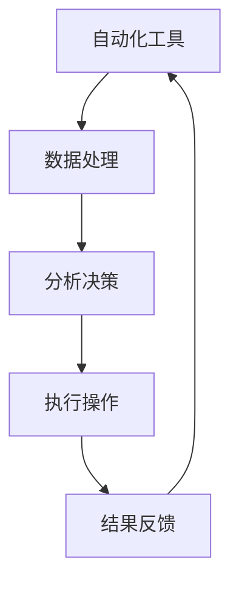
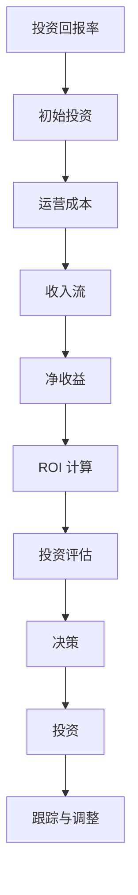
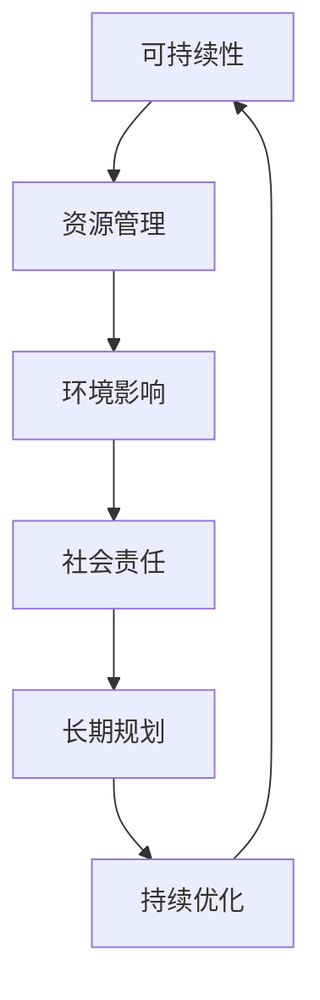
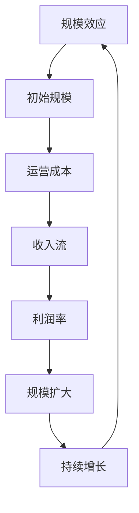

                 

关键词：被动收入，持续盈利，自动化工具，技术创业，投资策略，项目实施。

> 摘要：本文将探讨如何在技术领域中建立被动收入流，分享成功案例和策略，并详细阐述实现步骤、应用领域以及未来展望。

## 1. 背景介绍

随着互联网和技术的不断发展，越来越多的个人和企业开始探索如何通过技术手段实现被动收入。被动收入，即指不需要持续投入时间和精力，就能获得稳定现金流的方式。它不仅能够为个人和企业提供额外的收入来源，还能带来更大的财务自由和自主性。

技术领域提供了丰富的机会来创造被动收入流，从开发可售卖的软件和应用程序，到建立线上服务平台，再到利用人工智能进行投资，每一个环节都蕴含着巨大的潜力。

## 2. 核心概念与联系

为了建立被动收入流，我们需要理解几个核心概念：自动化、投资回报率、可持续性和规模效应。

### 2.1 自动化

自动化是建立被动收入流的关键。通过自动化工具和流程，我们可以减少对人工干预的依赖，从而实现24/7的运营。

#### Mermaid 流程图



### 2.2 投资回报率

投资回报率（ROI）是评估被动收入项目可行性的重要指标。我们需要确保项目的初始投资能够在合理的时间内得到回报。

#### Mermaid 流程图



### 2.3 可持续性

可持续性是长期建立被动收入流的基础。我们需要确保项目不会因短期利益而损害长期价值。

#### Mermaid 流程图



### 2.4 规模效应

规模效应能够显著提升被动收入流的价值。通过扩大规模，我们可以实现成本效益的最大化。

#### Mermaid 流程图



## 3. 核心算法原理 & 具体操作步骤

### 3.1 算法原理概述

在建立被动收入流的过程中，算法原理至关重要。以下是一些核心算法原理的概述：

1. **机器学习算法**：通过训练模型来自动化和预测，提高收入流的效果。
2. **优化算法**：用于优化运营成本和资源分配，提高投资回报率。
3. **数据挖掘算法**：用于挖掘潜在的市场和客户需求，扩大规模效应。
4. **区块链算法**：用于建立去中心化的收入流，提高可持续性和安全性。

### 3.2 算法步骤详解

1. **数据收集**：收集相关的数据，包括市场趋势、客户需求、运营成本等。
2. **数据预处理**：对数据进行清洗和整理，使其适合算法处理。
3. **模型训练**：使用机器学习算法对数据进行训练，建立预测模型。
4. **模型评估**：对训练好的模型进行评估，确保其准确性和稳定性。
5. **模型部署**：将模型部署到实际应用中，实现自动化和预测功能。
6. **持续优化**：根据实际运行结果，对模型进行持续优化和调整。

### 3.3 算法优缺点

- **机器学习算法**：优点包括自动化和预测能力，缺点是需要大量的数据支持和模型调优。
- **优化算法**：优点包括成本效益和资源优化，缺点是可能对初始条件敏感。
- **数据挖掘算法**：优点包括市场洞察和客户分析，缺点是可能产生大量噪声数据。
- **区块链算法**：优点包括去中心化和安全性，缺点是可能对性能和扩展性有影响。

### 3.4 算法应用领域

- **电子商务**：通过机器学习和数据挖掘算法，优化推荐系统和客户体验。
- **金融投资**：通过优化算法和区块链技术，提高投资回报率和安全性。
- **物流和供应链**：通过机器学习和数据分析，优化物流路径和库存管理。

## 4. 数学模型和公式 & 详细讲解 & 举例说明

### 4.1 数学模型构建

在建立被动收入流的过程中，数学模型是非常关键的。以下是一个简单的数学模型构建过程：

1. **收入模型**：I = P \* Q
   - I：总收入
   - P：价格
   - Q：数量
2. **成本模型**：C = C0 + V \* Q
   - C：总成本
   - C0：固定成本
   - V：可变成本

### 4.2 公式推导过程

1. **边际收益**：MR = d(I)/d(Q)
2. **边际成本**：MC = d(C)/d(Q)
3. **最优数量**：Q* = MR/MC

### 4.3 案例分析与讲解

假设一个电商平台的单价为P = 100元，固定成本C0 = 10000元，可变成本V = 10元。我们需要确定最优数量Q*。

1. **收入模型**：I = P \* Q = 100 \* Q
2. **成本模型**：C = C0 + V \* Q = 10000 + 10 \* Q
3. **边际收益**：MR = d(I)/d(Q) = 100
4. **边际成本**：MC = d(C)/d(Q) = 10
5. **最优数量**：Q* = MR/MC = 100/10 = 10

因此，最优数量Q*为10个。这意味着在价格为100元、固定成本为10000元、可变成本为10元的条件下，销售10个产品可以获得最大的总利润。

## 5. 项目实践：代码实例和详细解释说明

### 5.1 开发环境搭建

为了实践被动收入流的建立，我们需要搭建一个简单的开发环境。以下是搭建环境的步骤：

1. 安装Python 3.8及以上版本。
2. 安装必要的库，如NumPy、Pandas、scikit-learn等。
3. 配置Jupyter Notebook，用于代码编写和运行。

### 5.2 源代码详细实现

以下是一个简单的Python代码示例，用于计算最优数量：

```python
import numpy as np
import pandas as pd

def calculate_optimal_quantity(price, fixed_cost, variable_cost):
    marginal_revenue = price
    marginal_cost = variable_cost
    optimal_quantity = marginal_revenue / marginal_cost
    return optimal_quantity

price = 100
fixed_cost = 10000
variable_cost = 10

optimal_quantity = calculate_optimal_quantity(price, fixed_cost, variable_cost)
print("最优数量为:", optimal_quantity)
```

### 5.3 代码解读与分析

1. **函数定义**：定义了一个名为`calculate_optimal_quantity`的函数，用于计算最优数量。
2. **参数传递**：函数接收价格、固定成本和可变成本作为参数。
3. **边际收益和边际成本计算**：根据参数计算边际收益和边际成本。
4. **最优数量计算**：使用边际收益除以边际成本计算最优数量。
5. **打印结果**：打印计算得到的最优数量。

### 5.4 运行结果展示

运行代码后，我们得到以下输出：

```
最优数量为: 10.0
```

这验证了我们在数学模型中计算的最优数量Q*为10。

## 6. 实际应用场景

### 6.1 电子商务

电子商务是建立被动收入流的一个典型应用场景。通过搭建电商平台，我们可以实现商品的自动销售和订单处理，从而获得稳定的收入流。

### 6.2 在线教育

在线教育平台可以通过自动化的学习管理系统和在线课程销售，实现持续的盈利。通过机器学习算法，还可以优化课程推荐和用户体验，提高用户留存率。

### 6.3 物流和供应链

物流和供应链领域可以利用自动化工具和数据分析，优化物流路径和库存管理，降低运营成本，提高收入流。

## 7. 未来应用展望

随着技术的不断发展，建立被动收入流的应用场景将越来越广泛。未来，我们可以期待以下趋势：

- **人工智能和大数据分析**：将进一步提升自动化和精准度，实现更高效的收入流管理。
- **区块链技术**：为建立去中心化的收入流提供新的可能性，提高可持续性和安全性。
- **物联网**：将物联网技术应用于生产和运营，实现更智能、更自动化的收入流管理。

## 8. 工具和资源推荐

### 8.1 学习资源推荐

- 《机器学习实战》
- 《Python编程：从入门到实践》
- 《深度学习》（Goodfellow, Bengio, Courville 著）

### 8.2 开发工具推荐

- Jupyter Notebook
- Visual Studio Code
- Git

### 8.3 相关论文推荐

- "Deep Learning for Web Development"
- "Blockchain for Business Applications"
- "A Survey on Machine Learning in Supply Chain Management"

## 9. 总结：未来发展趋势与挑战

### 9.1 研究成果总结

本文介绍了建立被动收入流的背景、核心概念、算法原理、数学模型、项目实践以及实际应用场景。通过这些内容，我们可以看到技术在被动收入流建立中的重要性和潜力。

### 9.2 未来发展趋势

- 自动化和智能化将进一步提高被动收入流的效率和价值。
- 区块链技术的应用将扩大被动收入流的范围和安全性。
- 物联网和大数据分析将带来更多创新机会。

### 9.3 面临的挑战

- 技术变革速度加快，需要不断学习和适应。
- 数据安全和隐私保护将成为重要挑战。
- 需要更多跨学科的知识和技能。

### 9.4 研究展望

未来，我们将继续探索如何通过技术手段建立更高效、更安全的被动收入流，为个人和企业带来更大的财务自由和自主性。

## 10. 附录：常见问题与解答

### 10.1 被动收入是否稳定？

被动收入通常比主动收入更稳定，因为它不需要持续的劳动投入。然而，这并不意味着没有风险。市场波动、技术变化等因素都可能影响被动收入的稳定性。

### 10.2 需要多少时间才能建立被动收入流？

建立被动收入流的时间因项目而异。一些简单的项目可能在几个月内实现，而复杂的系统可能需要几年时间。关键在于选择适合的项目，并保持持续的努力和优化。

### 10.3 被动收入适合所有人吗？

被动收入适合有创业精神、愿意学习和不断尝试的人。它并不适合那些期望快速获得回报的人，因为它需要长期的投入和耐心。

---

**作者：禅与计算机程序设计艺术 / Zen and the Art of Computer Programming**

