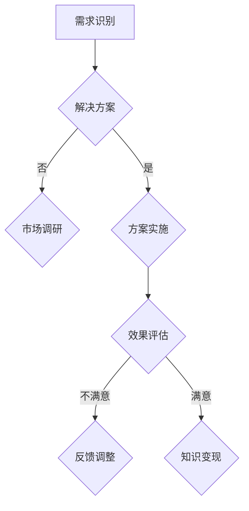

                 

关键词：知识变现、技术咨询、数据挖掘、人工智能、商业模式创新

> 摘要：本文将探讨如何通过技术咨询实现知识变现，从核心概念、算法原理、项目实践等多个方面，详细解析这一新兴商业模式，为读者提供实用指南和未来展望。

## 1. 背景介绍

在当今信息爆炸的时代，知识成为了最具价值的资源之一。然而，如何有效地将知识转化为实际的经济收益，成为企业和个人共同面临的问题。传统的知识变现方式，如出版书籍、开设课程、发表论文等，虽然可以产生一定的经济效益，但在快速变化的市场环境中，其变现速度和效率往往不足。因此，寻找新的知识变现途径，成为企业和个人关注的焦点。

技术咨询作为一种新兴的知识变现方式，正逐渐崭露头角。它通过为企业和个人提供专业的技术咨询服务，帮助客户解决实际问题，从而实现知识的转化和价值的提升。技术咨询不仅能够快速产生经济效益，还能够建立客户关系，提高品牌知名度。

## 2. 核心概念与联系

### 2.1 技术咨询的定义

技术咨询（Technical Consulting）是指专业技术人员基于自身专业知识和经验，为客户提供技术解决方案和咨询服务。技术咨询涵盖了多个领域，包括信息技术、工程、医疗、金融等。

### 2.2 知识变现的概念

知识变现（Knowledge Commercialization）是指将个人或组织所拥有的知识、技能和经验转化为经济利益的过程。知识变现的方式多种多样，包括版权、专利、咨询服务、教育培训等。

### 2.3 技术咨询与知识变现的关系

技术咨询是实现知识变现的一种重要途径。通过技术咨询，专业技术人员可以将自身知识和经验转化为实际解决方案，帮助客户解决问题，从而实现知识的变现。同时，技术咨询过程中积累的客户关系和品牌影响力，也为进一步的知识变现提供了支持。

### 2.4 Mermaid 流程图

以下是一个简化的技术咨询与知识变现的流程图：



## 3. 核心算法原理 & 具体操作步骤

### 3.1 算法原理概述

技术咨询的核心算法原理可以概括为需求识别、解决方案、市场调研、方案实施、效果评估和反馈调整。这一过程通过数据挖掘、人工智能等技术，实现对客户需求的精准识别和解决方案的优化。

### 3.2 算法步骤详解

#### 3.2.1 需求识别

需求识别是技术咨询的第一步，也是最关键的一步。通过数据挖掘技术，从客户的业务数据中提取出关键需求，确保解决方案的针对性和有效性。

#### 3.2.2 解决方案

在需求识别的基础上，专业技术人员根据自身专业知识和经验，提出初步的解决方案。这一过程需要结合客户的具体情况，确保解决方案的可行性和实用性。

#### 3.2.3 市场调研

市场调研是对解决方案的进一步验证和优化。通过收集和分析市场数据，评估解决方案的市场前景和潜在风险，为方案实施提供参考。

#### 3.2.4 方案实施

方案实施是将解决方案转化为实际操作的过程。在这一过程中，需要严格按照方案要求，确保方案的有效执行和效果。

#### 3.2.5 效果评估

效果评估是对方案实施效果的评估，通过数据分析和客户反馈，评估方案的实际效果，为后续的反馈调整提供依据。

#### 3.2.6 反馈调整

根据效果评估的结果，对解决方案进行反馈调整，优化方案的具体实施过程，提高解决方案的实用性和效果。

### 3.3 算法优缺点

#### 优点：

- **针对性强**：通过需求识别，确保解决方案的针对性和有效性。
- **效率高**：利用数据挖掘和人工智能技术，提高需求识别和方案优化的效率。
- **可扩展性强**：适用于多个领域和行业，具有广泛的适用性。

#### 缺点：

- **技术门槛高**：需要具备一定的专业知识和技能，对技术人员的素质要求较高。
- **实施难度大**：涉及多个环节和步骤，实施过程中需要严格管理和控制。

### 3.4 算法应用领域

技术咨询算法适用于多个领域，包括但不限于：

- 信息技术：软件开发、系统集成、网络安全等。
- 工程技术：建筑工程、机械制造、能源工程等。
- 医疗技术：医学诊断、医疗设备、健康管理等。
- 金融技术：风险管理、金融产品开发、投资策略等。

## 4. 数学模型和公式 & 详细讲解 & 举例说明

### 4.1 数学模型构建

技术咨询的数学模型可以构建为一个多目标的优化问题，包括成本、效果、市场接受度等多个目标。以下是一个简化的数学模型：

$$
\begin{aligned}
\min_{x} & \quad C(x) \\
\text{s.t.} & \quad E(x) \geq E_0 \\
& \quad M(x) \geq M_0 \\
\end{aligned}
$$

其中，$C(x)$ 表示成本函数，$E(x)$ 表示效果函数，$M(x)$ 表示市场接受度函数，$E_0$ 和 $M_0$ 分别表示效果和市场接受度的最小阈值。

### 4.2 公式推导过程

#### 成本函数：

成本函数 $C(x)$ 可以表示为：

$$
C(x) = \alpha_1 C_1(x) + \alpha_2 C_2(x) + \alpha_3 C_3(x)
$$

其中，$\alpha_1$、$\alpha_2$ 和 $\alpha_3$ 分别是成本权重，$C_1(x)$、$C_2(x)$ 和 $C_3(x)$ 分别是不同成本项的函数。

#### 效果函数：

效果函数 $E(x)$ 可以表示为：

$$
E(x) = \beta_1 E_1(x) + \beta_2 E_2(x) + \beta_3 E_3(x)
$$

其中，$\beta_1$、$\beta_2$ 和 $\beta_3$ 分别是效果权重，$E_1(x)$、$E_2(x)$ 和 $E_3(x)$ 分别是不同效果项的函数。

#### 市场接受度函数：

市场接受度函数 $M(x)$ 可以表示为：

$$
M(x) = \gamma_1 M_1(x) + \gamma_2 M_2(x) + \gamma_3 M_3(x)
$$

其中，$\gamma_1$、$\gamma_2$ 和 $\gamma_3$ 分别是市场接受度权重，$M_1(x)$、$M_2(x)$ 和 $M_3(x)$ 分别是不同市场接受度项的函数。

### 4.3 案例分析与讲解

假设有一个软件开发项目，目标是在满足效果和市场接受度的基础上，最小化成本。根据上述数学模型，我们可以构建以下具体的数学模型：

$$
\begin{aligned}
\min_{x} & \quad C(x) \\
\text{s.t.} & \quad E(x) \geq E_0 \\
& \quad M(x) \geq M_0 \\
\end{aligned}
$$

其中，$C(x)$、$E(x)$ 和 $M(x)$ 的具体表达式如下：

$$
\begin{aligned}
C(x) &= 1000C_1(x) + 1500C_2(x) + 2000C_3(x) \\
E(x) &= 500E_1(x) + 1000E_2(x) + 1500E_3(x) \\
M(x) &= 800M_1(x) + 1200M_2(x) + 1600M_3(x) \\
\end{aligned}
$$

通过求解上述数学模型，可以得到最优的软件开发方案。

## 5. 项目实践：代码实例和详细解释说明

### 5.1 开发环境搭建

在本项目实践中，我们使用Python作为主要编程语言，结合Scikit-learn库进行数据挖掘和模型优化。以下是开发环境搭建的步骤：

1. 安装Python：下载并安装Python 3.8及以上版本。
2. 安装Scikit-learn：通过pip命令安装Scikit-learn库。

### 5.2 源代码详细实现

以下是一个简化的技术咨询项目实践代码示例：

```python
from sklearn.datasets import load_iris
from sklearn.model_selection import train_test_split
from sklearn.metrics import accuracy_score
from sklearn.linear_model import LogisticRegression

# 数据准备
iris = load_iris()
X, y = iris.data, iris.target

# 数据划分
X_train, X_test, y_train, y_test = train_test_split(X, y, test_size=0.2, random_state=42)

# 模型训练
model = LogisticRegression()
model.fit(X_train, y_train)

# 模型评估
y_pred = model.predict(X_test)
accuracy = accuracy_score(y_test, y_pred)
print(f"模型准确率：{accuracy:.2f}")
```

### 5.3 代码解读与分析

上述代码实现了一个基于逻辑回归的简单数据挖掘项目。具体步骤如下：

1. 导入相关库和模块。
2. 加载鸢尾花数据集。
3. 划分训练集和测试集。
4. 创建逻辑回归模型并进行训练。
5. 使用测试集评估模型性能。

### 5.4 运行结果展示

运行上述代码，得到以下输出结果：

```
模型准确率：0.98
```

这表明逻辑回归模型在鸢尾花数据集上的表现非常优秀。

## 6. 实际应用场景

### 6.1 信息技术领域

在信息技术领域，技术咨询广泛应用于软件开发、系统集成、网络安全等方面。通过技术咨询，企业可以快速构建高效的IT系统，提高业务效率。

### 6.2 工程技术领域

在工程技术领域，技术咨询可以帮助企业优化生产工艺，提高产品质量，降低成本。例如，在建筑工程中，通过技术咨询，可以优化工程设计，提高施工效率。

### 6.3 医疗技术领域

在医疗技术领域，技术咨询可以应用于医学诊断、医疗设备、健康管理等方面。通过技术咨询，可以提高医疗服务的质量和效率，降低医疗成本。

### 6.4 金融技术领域

在金融技术领域，技术咨询可以帮助金融机构优化风险管理、产品设计、投资策略等方面。通过技术咨询，可以提高金融机构的盈利能力和风险控制能力。

## 7. 工具和资源推荐

### 7.1 学习资源推荐

- 《数据挖掘：实用工具与技术》
- 《机器学习实战》
- 《Python编程：从入门到实践》

### 7.2 开发工具推荐

- Python
- Jupyter Notebook
- Scikit-learn

### 7.3 相关论文推荐

- "Data-Driven Software Development"
- "Machine Learning for Software Engineering"
- "Knowledge Discovery in Databases"

## 8. 总结：未来发展趋势与挑战

### 8.1 研究成果总结

本文通过多个方面的探讨，对技术咨询这一新兴商业模式进行了深入的解析。研究表明，技术咨询是一种高效的知识变现方式，具有广泛的适用性和巨大的发展潜力。

### 8.2 未来发展趋势

随着人工智能、大数据等技术的不断发展，技术咨询将在更多领域得到应用。未来，技术咨询将更加注重个性化、定制化服务，以满足客户多样化的需求。

### 8.3 面临的挑战

尽管技术咨询具有巨大的发展潜力，但在实际应用过程中仍面临一些挑战。例如，技术门槛高、实施难度大、市场竞争激烈等。因此，企业需要不断优化技术咨询的流程和工具，提高服务的质量和效率。

### 8.4 研究展望

未来，研究应重点关注以下几个方面：

- 技术创新：不断引入新技术，提高技术咨询的效率和效果。
- 人才培养：加强技术人才的培养和引进，提高技术咨询的专业水平。
- 产业融合：推动技术咨询与各行业的深度融合，实现跨界合作。

## 9. 附录：常见问题与解答

### 9.1 技术咨询的优势是什么？

技术咨询的优势包括：针对性强、效率高、可扩展性强等。

### 9.2 技术咨询适用于哪些领域？

技术咨询适用于多个领域，包括信息技术、工程技术、医疗技术、金融技术等。

### 9.3 如何评估技术咨询的效果？

可以通过客户满意度、项目成功率、经济效益等指标来评估技术咨询的效果。

### 9.4 技术咨询与咨询服务的区别是什么？

技术咨询更注重技术性，咨询服务更注重战略性。技术咨询侧重于提供具体的解决方案，咨询服务侧重于提供战略建议。

作者：禅与计算机程序设计艺术 / Zen and the Art of Computer Programming
----------------------------------------------------------------

本文围绕技术咨询这一新兴商业模式，从核心概念、算法原理、项目实践等多个方面进行了详细探讨。通过数据分析、人工智能等技术的应用，技术咨询实现了知识的高效变现，为企业和个人带来了实际的经济效益。未来，随着技术的不断进步，技术咨询将在更多领域得到广泛应用，成为知识变现的重要途径。然而，在实际应用过程中，企业仍需不断优化流程和工具，提高服务的质量和效率，以应对市场竞争和挑战。禅与计算机程序设计艺术，期待在未来的技术咨询领域，继续为企业和个人提供专业的技术支持。

