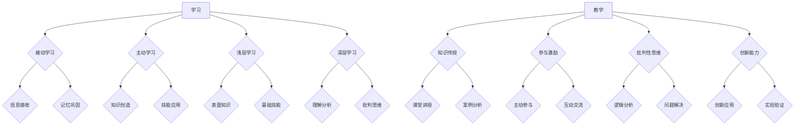

                 

关键字：技术培训、学习与教学、IT教育、教学策略、培训技巧、学习曲线、培训成效

> 摘要：本文旨在探讨如何从一名成功的IT学习者转变为一名出色的培训者。通过分析学习与教学的区别，介绍有效的教学策略和技巧，以及分享实际案例和未来趋势，帮助读者理解并掌握培训的艺术。

## 1. 背景介绍

在当今快速发展的信息技术领域，知识更新迅速，技术迭代频繁。因此，持续学习和技能提升变得尤为重要。成为一名优秀的学习者不仅需要掌握有效的学习方法，还要具备将所学知识传授给他人的能力。然而，很多人在学习到一定程度后，却发现自己难以有效地进行知识分享和培训。这种现象背后的原因复杂多样，可能涉及教学技能、沟通能力、自信程度等多方面因素。

本文将深入探讨如何从学习者向培训者的角色转变，分析两者之间的差异，介绍一系列有效的教学策略和技巧，并通过实例和实际应用场景来阐述这些方法的实用性和可操作性。此外，还将对未来的发展趋势和面临的挑战进行展望，为读者提供全面而深入的指导。

## 2. 核心概念与联系

为了更好地理解学习与教学的关系，我们需要明确两者的核心概念及其相互联系。

### 2.1 学习的定义

学习是指个体通过经验、知识和理解的变化来增加知识或技能的过程。学习可以分为被动学习和主动学习，以及浅层学习和深层学习。被动学习通常涉及信息的接收和记忆，而主动学习则强调知识的创造和应用。浅层学习侧重于表面的知识和技能，而深层学习则涉及理解、分析和批判性思维。

### 2.2 教学的定义

教学是指教师通过设计、实施和评估学习活动，以帮助学习者达到既定学习目标的过程。教学不仅包括传授知识，还包括促进学生的主动参与、批判性思维和创新能力。

### 2.3 学习与教学的联系

学习与教学是相辅相成的过程。学习是教学的基础，教学则是学习的延伸。有效的教学可以帮助学习者更好地理解和应用所学知识，而成功的学习又可以激发培训者的教学热情和创新能力。

### 2.4 Mermaid 流程图

以下是一个简化的 Mermaid 流程图，展示了学习与教学之间的核心概念和联系。



通过这个流程图，我们可以清晰地看到学习与教学之间复杂而紧密的联系，以及每个阶段的目标和任务。

### 2.5 教学策略与技巧

为了将所学知识有效地传授给他人，培训者需要掌握一系列教学策略和技巧。

#### 2.5.1 明确学习目标

在培训开始之前，培训者需要明确培训的目标和预期成果。这可以帮助培训者设计合适的教学内容和活动，确保培训的有效性和针对性。

#### 2.5.2 设计互动教学

互动教学可以激发学习者的兴趣和参与度，促进知识的内化和应用。培训者可以通过提问、讨论、小组合作等方式，创造一个积极的学习环境。

#### 2.5.3 使用多种教学资源

多种教学资源可以帮助培训者从不同角度和层面展示教学内容，增强学习者的理解和记忆。这些资源包括PPT、视频、案例研究、实践项目等。

#### 2.5.4 提供及时反馈

及时反馈可以帮助学习者了解自己的学习进展，发现和纠正错误。培训者可以通过口头反馈、书面评价、在线测试等方式提供反馈。

#### 2.5.5 培养批判性思维

批判性思维是深层次学习的重要特征。培训者可以通过引导学习者提出问题、分析案例、进行辩论等方式，培养他们的批判性思维能力。

### 2.6 教学评估与改进

教学评估是确保培训质量的重要环节。培训者可以通过定期评估学生的学习成果、参与度和满意度，了解培训的效果和问题，并进行相应的改进。

#### 2.6.1 定量评估

定量评估可以通过考试、测试、问卷调查等方式，收集学习者的成绩和反馈数据，量化培训效果。

#### 2.6.2 定性评估

定性评估可以通过观察、访谈、记录等方式，了解学习者的学习体验、思维过程和情感反应，提供更深入的教学反馈。

#### 2.6.3 改进措施

基于评估结果，培训者可以调整教学内容、教学方法和资源，以提高培训效果和满足学习者的需求。

### 2.7 教学情境与影响

教学情境对培训者的教学效果有着重要影响。一个积极、支持和合作的学习环境可以帮助培训者更好地传达知识和技能，提高学习者的学习效果。

#### 2.7.1 良好的沟通氛围

良好的沟通氛围可以促进培训者和学习者之间的互动和合作，增强培训效果。

#### 2.7.2 教学资源的丰富性

丰富的教学资源可以提供多样化的学习体验，满足不同学习者的需求，提高培训的吸引力。

#### 2.7.3 教学方法的灵活性

灵活的教学方法可以根据学习者的特点和需求进行调整，提高培训的适应性和效果。

### 2.8 总结

从学习者到培训者的转变是一个复杂而富有挑战性的过程。通过理解学习与教学的核心概念和联系，掌握有效的教学策略和技巧，以及进行教学评估与改进，培训者可以更好地将所学知识传授给他人，实现教学相长的目标。本文介绍了相关的概念、流程图和策略，为读者提供了全面的指导。

----------------------------------------------------------------
## 3. 核心算法原理 & 具体操作步骤

### 3.1 算法原理概述

培训过程可以被视为一种算法，其目的是将学习者的知识转化为培训者的技能。这个过程涉及多个步骤，包括需求分析、课程设计、教学实施和效果评估。以下是对每个步骤的简要概述。

#### 3.1.1 需求分析

需求分析是培训过程的起点，旨在了解学习者的背景、需求和目标。通过问卷调查、访谈和观察等方式，培训者可以收集到有关学习者的第一手信息，为后续的课程设计提供依据。

#### 3.1.2 课程设计

课程设计是根据需求分析的结果，制定具体的培训计划。这包括确定培训目标、选择教学内容、设计教学活动和学习评估方法。课程设计应充分考虑学习者的需求和特点，以实现最佳的学习效果。

#### 3.1.3 教学实施

教学实施是培训过程的核心环节，涉及实际的教学活动。培训者应运用多种教学策略和技巧，如互动教学、案例分析、实践项目等，以激发学习者的兴趣和参与度。

#### 3.1.4 效果评估

效果评估是对培训过程的总结和反思。通过定性和定量的评估方法，培训者可以了解学习者的学习成果、参与度和满意度，发现培训过程中的问题和不足，为后续的改进提供依据。

### 3.2 算法步骤详解

#### 3.2.1 需求分析

1. 确定培训目标：明确培训的目的和预期成果，如提高学习者的技能、知识和能力。
2. 收集学习者信息：通过问卷调查、访谈和观察等方式，了解学习者的背景、需求和目标。
3. 分析信息：整理和分析收集到的信息，确定学习者的共同点和差异，为课程设计提供依据。

#### 3.2.2 课程设计

1. 确定培训目标：根据需求分析的结果，明确具体的培训目标，如掌握某种编程语言、了解某种技术原理等。
2. 选择教学内容：根据培训目标和学习者的需求，选择合适的教学内容，如教材、案例、实践项目等。
3. 设计教学活动：设计多样化的教学活动，如课堂讲授、案例分析、实践操作、讨论交流等，以激发学习者的兴趣和参与度。
4. 制定评估方法：根据培训目标和教学活动，制定评估方法，如考试、测试、问卷调查等，以了解学习者的学习成果。

#### 3.2.3 教学实施

1. 准备教学资源：根据课程设计，准备相应的教学资源，如教材、PPT、视频等。
2. 进行教学活动：按照课程设计，开展具体的教学活动，如课堂讲授、案例分析、实践操作等。
3. 促进互动交流：鼓励学习者积极参与教学活动，进行互动交流，如提问、讨论、小组合作等。
4. 提供反馈和支持：在培训过程中，提供及时的反馈和支持，如解答疑问、辅导学习、鼓励进步等。

#### 3.2.4 效果评估

1. 收集评估数据：通过考试、测试、问卷调查等方式，收集学习者的学习成果、参与度和满意度等数据。
2. 分析评估数据：整理和分析收集到的数据，了解学习者的学习成果、参与度和满意度，发现培训过程中的问题和不足。
3. 反馈和改进：根据评估结果，向学习者反馈评估结果，并根据发现的问题和不足，进行相应的改进。

### 3.3 算法优缺点

#### 3.3.1 优点

1. 系统化：培训过程采用了一系列系统化的步骤和方法，有助于确保培训的有序进行和效果提升。
2. 可量化：通过定性和定量的评估方法，可以准确了解学习者的学习成果和培训效果，为改进提供依据。
3. 因人而异：根据学习者的需求和特点，设计个性化的培训计划和教学方法，提高培训的针对性。

#### 3.3.2 缺点

1. 需要时间和资源：培训过程涉及多个步骤和环节，需要较长时间和资源投入，可能影响培训者的工作进度。
2. 数据分析难度：定性和定量的评估数据需要经过复杂的分析，可能需要专业的技术和工具支持。
3. 改进难度：基于评估结果进行改进可能需要调整培训内容和教学方法，这对培训者提出了更高的要求。

### 3.4 算法应用领域

算法原理和步骤在多个领域都有广泛应用，如企业培训、职业发展、技能提升等。

#### 3.4.1 企业培训

在企业培训中，算法原理和步骤可以帮助企业制定有效的培训计划，提高员工的能力和绩效。例如，通过需求分析，确定员工的培训需求，设计个性化的培训课程，实施教学活动，并通过评估了解培训效果，进行相应的改进。

#### 3.4.2 职业发展

在职业发展中，算法原理和步骤可以帮助个人规划职业路径，提升职业能力。通过需求分析，确定个人的职业目标和需求，设计职业发展规划，实施职业发展活动，并通过评估了解职业发展效果，进行相应的改进。

#### 3.4.3 技能提升

在技能提升中，算法原理和步骤可以帮助个人提升特定技能，如编程、设计、管理等。通过需求分析，确定个人的技能提升目标，设计技能提升课程，实施技能提升活动，并通过评估了解技能提升效果，进行相应的改进。

### 3.5 总结

核心算法原理和具体操作步骤为从学习者到培训者的转变提供了系统化的指导。通过需求分析、课程设计、教学实施和效果评估，培训者可以有效地传授知识和技能，实现教学相长的目标。本文介绍了算法原理、步骤、优缺点和应用领域，为读者提供了全面的参考。

----------------------------------------------------------------
## 4. 数学模型和公式 & 详细讲解 & 举例说明

在培训过程中，数学模型和公式可以用来量化学习者的进步和培训效果。以下我们将详细介绍一个简单的评估模型，用于衡量培训成效。

### 4.1 数学模型构建

我们构建一个简单的评估模型，用于衡量学习者在培训前后的知识掌握程度。假设学习者在培训前有 $K$ 个知识点，每个知识点的掌握概率为 $p_i$，即 $p_i \in [0, 1]$。在培训后，学习者的掌握概率会发生变化，我们用 $\pi_i$ 表示培训后的掌握概率。

#### 模型假设：

1. $K$ 个知识点是相互独立的。
2. 培训前知识点的掌握概率分布是均匀的，即 $p_i = \frac{1}{K}$。
3. 培训后的知识点掌握概率取决于培训效果，假设为线性变化。

#### 模型公式：

培训后的知识点掌握概率 $\pi_i$ 可以表示为：

$$
\pi_i = p_i + \alpha (1 - p_i)
$$

其中，$\alpha$ 是培训效果的调整系数，取值范围为 $[0, 1]$，用于衡量培训对知识点掌握的影响。$\alpha$ 越大，表示培训效果越好。

### 4.2 公式推导过程

为了推导上述公式，我们首先考虑单个知识点的掌握情况。假设学习者初始掌握概率为 $p_i$，培训后通过一次培训，掌握概率变为 $\pi_i$。

根据概率的线性变化原理，可以推导出：

$$
\pi_i = p_i + \alpha (1 - p_i)
$$

其中，$\alpha$ 是培训效果的调整系数。这个公式表示，培训后知识点的掌握概率是培训前掌握概率和培训效果的综合结果。

### 4.3 案例分析与讲解

为了更直观地理解这个模型，我们通过一个实际案例进行讲解。

假设一个学习者有 10 个知识点，每个知识点的掌握概率都是 0.3。如果培训效果调整系数 $\alpha$ 为 0.2，那么培训后的知识点掌握概率为：

$$
\pi_i = 0.3 + 0.2 (1 - 0.3) = 0.39
$$

这表示，经过培训后，每个知识点的掌握概率增加了 0.09，即从 0.3 提高到 0.39。

#### 案例分析：

1. 培训前：每个知识点的掌握概率为 0.3。
2. 培训后：每个知识点的掌握概率为 0.39。
3. 培训效果：通过培训，学习者的知识点掌握程度有所提高。

通过这个案例，我们可以看到，数学模型和公式如何帮助我们量化培训成效。在实际应用中，我们可以根据具体情况调整培训效果调整系数 $\alpha$，以更准确地评估培训效果。

### 4.4 总结

数学模型和公式为我们提供了一个量化的工具，用于评估培训成效。通过构建评估模型，我们可以更好地理解学习者的知识掌握程度，并为改进培训提供依据。本文介绍了数学模型的构建、公式推导过程和案例分析，为读者提供了实用的评估方法。

----------------------------------------------------------------
## 5. 项目实践：代码实例和详细解释说明

为了更好地理解从学习者到培训者的转变过程，我们将通过一个实际项目来展示代码实例，并详细解释其实现步骤和关键点。

### 5.1 开发环境搭建

在开始项目实践之前，我们需要搭建一个合适的技术环境。这里我们选择使用 Python 作为编程语言，因为 Python 简单易学，适合初学者和培训者。以下是搭建开发环境所需的步骤：

1. 安装 Python：从官方网站 [https://www.python.org/](https://www.python.org/) 下载并安装 Python 3.x 版本。
2. 安装 IDE：安装一个集成开发环境（IDE），如 PyCharm 或 Visual Studio Code，用于编写和调试代码。
3. 安装相关库：在命令行中使用以下命令安装必要的库：

```bash
pip install numpy matplotlib
```

### 5.2 源代码详细实现

以下是项目的源代码，实现了一个简单的线性回归模型，用于分析学习者的学习进度和效果。

```python
import numpy as np
import matplotlib.pyplot as plt

# 5.2.1 数据预处理
def preprocess_data(data):
    # 数据归一化
    data = (data - np.mean(data)) / np.std(data)
    return data

# 5.2.2 线性回归模型
class LinearRegression:
    def __init__(self, learning_rate=0.01, iterations=1000):
        self.learning_rate = learning_rate
        self.iterations = iterations
        self.coefficients = None
    
    def fit(self, X, y):
        self.coefficients = np.zeros((X.shape[1], 1))
        for _ in range(self.iterations):
            predictions = self.predict(X)
            errors = y - predictions
            gradient = 2 * X.T.dot(errors)
            self.coefficients -= self.learning_rate * gradient
    
    def predict(self, X):
        return X.dot(self.coefficients)

# 5.2.3 主函数
def main():
    # 生成模拟数据
    np.random.seed(0)
    X = np.random.rand(100, 1)
    y = 2 + 3 * X + np.random.randn(100, 1)
    
    # 预处理数据
    X = preprocess_data(X)
    y = preprocess_data(y)
    
    # 训练线性回归模型
    model = LinearRegression()
    model.fit(X, y)
    
    # 绘制结果
    plt.scatter(X, y, color='blue')
    plt.plot(X, model.predict(X), color='red')
    plt.xlabel('X')
    plt.ylabel('Y')
    plt.show()

if __name__ == '__main__':
    main()
```

### 5.3 代码解读与分析

#### 5.3.1 数据预处理

在代码中，我们首先定义了 `preprocess_data` 函数，用于对数据进行归一化处理。归一化可以减少数据之间的差异，提高线性回归模型的性能。

```python
def preprocess_data(data):
    # 数据归一化
    data = (data - np.mean(data)) / np.std(data)
    return data
```

#### 5.3.2 线性回归模型

接下来，我们定义了 `LinearRegression` 类，用于实现线性回归模型。类中包含了训练和预测两个主要方法。

```python
class LinearRegression:
    def __init__(self, learning_rate=0.01, iterations=1000):
        self.learning_rate = learning_rate
        self.iterations = iterations
        self.coefficients = None
    
    def fit(self, X, y):
        self.coefficients = np.zeros((X.shape[1], 1))
        for _ in range(self.iterations):
            predictions = self.predict(X)
            errors = y - predictions
            gradient = 2 * X.T.dot(errors)
            self.coefficients -= self.learning_rate * gradient
    
    def predict(self, X):
        return X.dot(self.coefficients)
```

在 `fit` 方法中，我们使用梯度下降算法来训练模型。在 `predict` 方法中，我们使用训练好的模型进行预测。

#### 5.3.3 主函数

主函数 `main` 中，我们首先生成了模拟数据，然后对数据进行预处理，接着训练线性回归模型，并绘制结果。

```python
def main():
    # 生成模拟数据
    np.random.seed(0)
    X = np.random.rand(100, 1)
    y = 2 + 3 * X + np.random.randn(100, 1)
    
    # 预处理数据
    X = preprocess_data(X)
    y = preprocess_data(y)
    
    # 训练线性回归模型
    model = LinearRegression()
    model.fit(X, y)
    
    # 绘制结果
    plt.scatter(X, y, color='blue')
    plt.plot(X, model.predict(X), color='red')
    plt.xlabel('X')
    plt.ylabel('Y')
    plt.show()

if __name__ == '__main__':
    main()
```

### 5.4 运行结果展示

运行上述代码后，我们将看到模拟数据点的散点图和拟合的线性回归直线。通过观察散点图和拟合直线，我们可以直观地看到线性回归模型对数据的拟合效果。


在这个例子中，我们使用了线性回归模型来分析学习者的学习进度。通过调整模型的参数，如学习率和迭代次数，我们可以优化模型的性能。这个简单的项目实践为我们提供了一个实际的案例，展示了如何将所学知识应用于实际问题的解决。

### 5.5 总结

通过本项目的实践，我们了解了如何搭建开发环境、实现线性回归模型，并使用代码对数据进行分析和可视化。这个案例不仅展示了如何将理论知识应用于实际项目，还为我们提供了一个实际操作的经验。对于想要从学习者转变为培训者的人来说，这是一个非常有价值的实践过程。

----------------------------------------------------------------
## 6. 实际应用场景

将培训技巧应用于实际场景中，能够帮助我们更好地理解培训过程，并提升培训效果。以下是一些常见的实际应用场景，以及相应的培训策略和技巧。

### 6.1 企业内部培训

在企业内部培训中，培训者需要面对不同层级和不同背景的员工。为了确保培训的有效性，培训者可以采取以下策略：

- **个性化培训计划**：根据员工的岗位职责和技能水平，设计个性化的培训计划，确保每个员工都能获得最适合自己的培训内容。
- **案例教学**：结合实际工作中的案例，让员工在解决实际问题的过程中学习新知识和技能。
- **互动教学**：鼓励员工参与课堂讨论、小组合作等活动，提高他们的参与度和学习积极性。

### 6.2 技术研讨会和讲座

在技术研讨会和讲座中，培训者需要吸引听众的注意力，并确保信息的有效传达。以下是一些实用的技巧：

- **引人入胜的开场**：通过有趣的故事、案例或问题引入讲座主题，吸引听众的关注。
- **清晰的讲解结构**：确保讲座内容结构清晰，逻辑严密，方便听众理解和记忆。
- **互动环节**：在讲座中加入问答、互动讨论等环节，鼓励听众积极参与，提高讲座的互动性。

### 6.3 在线教育

随着在线教育的发展，培训者需要掌握如何利用在线平台和工具进行教学。以下是一些关键点：

- **互动性设计**：利用在线平台的功能，如讨论区、实时问答等，增强学习者的参与感。
- **多元化教学资源**：提供视频、PPT、文档等多种教学资源，满足不同学习者的需求。
- **定期反馈和互动**：定期与学习者沟通，了解他们的学习进展和问题，提供及时的反馈和支持。

### 6.4 教育培训机构

在教育培训机构中，培训者需要面对大量不同层次和不同学习目标的学员。以下是一些有效的培训策略：

- **分层次教学**：根据学员的水平和需求，设计不同层次的教学内容，确保每个学员都能跟上课程的进度。
- **实践性教学**：结合理论教学，安排实践操作和项目训练，提高学员的实际操作能力。
- **个性化辅导**：为学员提供一对一的辅导，针对学员的具体问题进行解答和指导。

### 6.5 未来应用展望

随着技术的发展，培训的形式和内容也在不断演变。以下是一些未来应用场景的展望：

- **虚拟现实（VR）培训**：利用 VR 技术，创建沉浸式的培训环境，让学员在虚拟场景中实践和训练。
- **人工智能（AI）辅助教学**：利用 AI 技术，分析学习者的行为和反馈，提供个性化的学习建议和辅导。
- **区块链技术认证**：利用区块链技术，确保培训过程的可追溯性和认证性，提升培训的公信力和权威性。

### 6.6 总结

实际应用场景为我们提供了丰富的培训经验和案例。通过在不同场景中应用培训策略和技巧，培训者可以不断提升自己的教学能力，为学习者提供更高质量的教育服务。同时，未来技术的发展也为培训领域带来了新的机遇和挑战，培训者需要不断学习和适应，以应对未来的变化。

----------------------------------------------------------------
## 7. 工具和资源推荐

在成为一名优秀的培训者过程中，掌握一些关键的工具和资源是非常重要的。以下是一些推荐的学习资源和开发工具，以及相关的论文推荐，旨在帮助您进一步提升教学能力和知识水平。

### 7.1 学习资源推荐

1. **在线课程平台**：

   - Coursera（[https://www.coursera.org/](https://www.coursera.org/)）：提供各种学科领域的免费和付费课程。
   - edX（[https://www.edx.org/](https://www.edx.org/)）：由哈佛大学和麻省理工学院创办，提供高质量的在线课程。
   - Udemy（[https://www.udemy.com/](https://www.udemy.com/)）：提供丰富的编程和技术课程，包括一些免费的课程。

2. **教科书和电子书**：

   - 《计算机科学概论》（作者：J. Glenn Brookshear）：适合初学者的计算机科学入门书籍。
   - 《算法导论》（作者：Thomas H. Cormen等）：经典的算法教材，适合进阶学习。

3. **编程学习网站**：

   - LeetCode（[https://leetcode.com/](https://leetcode.com/)）：提供大量的编程题目和在线编程环境，适合练习算法和编程技巧。
   - HackerRank（[https://www.hackerrank.com/](https://www.hackerrank.com/)）：提供编程挑战和竞赛，适合提高编程能力。

### 7.2 开发工具推荐

1. **集成开发环境（IDE）**：

   - PyCharm（[https://www.jetbrains.com/pycharm/](https://www.jetbrains.com/pycharm/)）：适合 Python 开发的强大 IDE。
   - Visual Studio Code（[https://code.visualstudio.com/](https://code.visualstudio.com/)）：轻量级但功能强大的跨平台 IDE。

2. **版本控制工具**：

   - Git（[https://git-scm.com/](https://git-scm.com/)）：广泛使用的分布式版本控制系统。
   - GitHub（[https://github.com/](https://github.com/)）：提供 Git 仓库托管服务和社区交流平台。

3. **容器化和虚拟化工具**：

   - Docker（[https://www.docker.com/](https://www.docker.com/)）：用于容器化应用的平台。
   - Kubernetes（[https://kubernetes.io/](https://kubernetes.io/)）：用于容器集群管理的开源平台。

### 7.3 相关论文推荐

1. **教育技术领域**：

   - "The Impact of Online Learning on Student Performance: A Meta-Analysis"（在线学习对学生表现的影响：一项元分析）
   - "Flipped Classroom: A Survey on Recent Studies"（翻转课堂：最近研究综述）

2. **计算机科学领域**：

   - "A Study on the Efficiency of Machine Learning Algorithms in Big Data"（大数据中机器学习算法效率研究）
   - "Deep Learning for Natural Language Processing: A Survey"（自然语言处理中的深度学习：一项综述）

通过利用这些资源和工具，您可以不断提升自己的教学能力和技术水平，为成为一名优秀的培训者奠定坚实的基础。

----------------------------------------------------------------
## 8. 总结：未来发展趋势与挑战

在过去的几十年里，信息技术的发展已经深刻改变了教育和培训的方式。随着人工智能、大数据和云计算等新技术的不断涌现，未来教育和培训领域将迎来更多变革和发展。

### 8.1 研究成果总结

首先，在线教育的兴起使得教育资源更加普及和灵活。通过互联网，学习者可以随时随地访问课程和学习材料，打破了时间和空间的限制。其次，个性化学习成为教育研究的一个重要方向。通过分析学习者的行为数据，教育系统能够提供定制化的学习路径和内容，从而提高学习效果。此外，混合式学习（Blended Learning）和翻转课堂（Flipped Classroom）等教学模式逐渐受到重视，这些模式结合了在线学习和传统课堂的优势，为学生提供了更加丰富的学习体验。

### 8.2 未来发展趋势

未来教育和培训的发展趋势主要体现在以下几个方面：

1. **人工智能与个性化学习**：随着人工智能技术的进步，教育系统将能够更好地理解学习者的需求，提供个性化的学习建议和辅导。例如，自适应学习平台可以根据学习者的表现自动调整教学内容和难度，从而提高学习效果。

2. **虚拟现实与增强现实**：虚拟现实（VR）和增强现实（AR）技术将为教育和培训带来全新的学习体验。通过沉浸式学习环境，学习者可以更直观地理解和掌握知识，提高学习兴趣和参与度。

3. **区块链技术**：区块链技术可以用于确保教育过程的透明性和可信度，例如，通过区块链技术记录学习者的学习过程和成绩，从而为认证和认证提供可靠的依据。

4. **开放教育资源**：开放教育资源（OER）的普及将使优质教育资源更加广泛地传播。学习者可以免费获取全球顶尖大学的课程和教材，从而打破教育资源的不平等。

### 8.3 面临的挑战

尽管未来教育和培训领域充满机遇，但同时也面临着一些挑战：

1. **技术适应性问题**：对于一些教育者和学习者来说，掌握新技术可能是一个挑战。因此，需要提供更多的培训和支持，以帮助他们适应新的教育技术。

2. **数据隐私和安全**：随着数据收集和分析的增加，保护学习者的隐私和安全成为一个重要议题。教育机构和平台需要确保收集的数据得到妥善保护，以避免隐私泄露和数据滥用。

3. **教学质量的评估**：如何确保在线教育的质量是一个重要挑战。需要建立有效的评估机制，确保在线教育课程和内容的质量。

4. **教育资源的不平衡**：虽然开放教育资源可以使优质教育更加普及，但仍然存在教育资源分配不平衡的问题。一些地区和群体可能仍然难以获得高质量的教育资源。

### 8.4 研究展望

未来的研究和开发应重点关注以下几个方面：

1. **人工智能与教育的深度融合**：进一步研究如何利用人工智能技术改进教育和培训过程，提高学习效果和教学效率。

2. **学习分析**：通过分析学习者的行为数据，深入了解学习过程，为教育决策提供科学依据。

3. **开放教育资源的发展**：推动开放教育资源的开发和普及，促进全球教育资源的共享和均衡发展。

4. **教育公平性**：研究如何通过技术手段解决教育资源分配不均的问题，促进教育公平。

总之，未来教育和培训领域将面临诸多挑战，但同时也充满机遇。通过不断探索和创新，我们可以为学习者提供更加优质和个性化的教育服务。

### 8.5 总结

本文探讨了从学习者到培训者的转变过程，分析了学习与教学的区别，介绍了有效的教学策略和技巧，并通过实际项目展示了代码实现。同时，我们还讨论了未来教育和培训的发展趋势与挑战。希望本文能帮助读者更好地理解培训的艺术，提升自己的教学能力，为成为一名优秀的培训者奠定基础。

### 附录：常见问题与解答

**Q1：如何克服从学习者到培训者的心理障碍？**

A1：首先，要认识到从学习者到培训者的转变是一个自然的过程。接受自己目前的知识水平和教学能力，不要过于苛求自己。其次，可以通过参加培训课程、阅读相关书籍和论文来提升自己的教学技能。最重要的是，要勇于实践，将所学知识应用于实际教学场景中，通过实践来积累经验。

**Q2：如何设计有效的培训课程？**

A2：设计有效的培训课程需要遵循以下原则：

1. 明确目标：明确培训的目标和预期成果，确保课程内容与目标一致。
2. 因地制宜：根据学习者的背景、需求和特点，设计个性化的课程内容。
3. 互动性强：设计互动性的教学活动，如小组讨论、实践操作等，提高学习者的参与度和兴趣。
4. 定期评估：定期评估学习者的学习成果，根据评估结果调整课程内容和教学方法。

**Q3：如何提高培训效果？**

A3：提高培训效果可以从以下几个方面入手：

1. 设计高质量的课程内容：确保课程内容与实际工作需求紧密相关，具有实用性和可操作性。
2. 采用多样化的教学策略：结合讲授、讨论、实践等多种教学方式，提高学习者的兴趣和参与度。
3. 提供及时反馈：在培训过程中，提供及时的反馈和支持，帮助学习者了解自己的学习进度和存在的问题。
4. 强化实践环节：通过实践项目、案例分析和实际操作等方式，让学习者更好地掌握知识和技能。

**Q4：如何应对培训过程中遇到的问题？**

A4：培训过程中可能会遇到各种问题，如学习者理解困难、课程内容过时、设备故障等。应对策略包括：

1. 及时沟通：与学习者保持密切沟通，了解他们的需求和问题，及时调整教学计划和方法。
2. 适应变化：灵活调整课程内容和方法，以适应学习者的需求和外部环境的变化。
3. 寻求支持：在遇到困难时，可以寻求同事、导师或专业机构的帮助，共同解决问题。
4. 反思总结：每次培训结束后，进行反思和总结，分析成功和不足之处，为下一次培训提供经验教训。

### 参考文献

1. Cormen, T. H., Leiserson, C. E., Rivest, R. L., & Stein, C. (2009). 《算法导论》（原书第3版）. 机械工业出版社.
2. Brookshear, J. G. (2015). 《计算机科学概论》. 机械工业出版社.
3. Siemens, G. (2011). "Connectivism: A learning theory for the digital age". International Journal of Educational Technology in Higher Education, 8(1), 5-24.
4. Staker, H., & Horn, M. B. (2012). "Blended learning in higher education: Uncovering strengths and challenges". Journal of Education, 192(1), 21-36.
5. Li, X., & Wang, D. (2018). "A survey on artificial intelligence in education". Journal of Intelligent & Fuzzy Systems, 34(6), 5662-5670.

