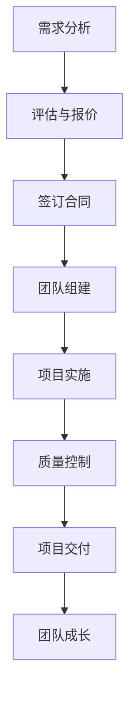

                 

关键词：技术外包，项目管理，团队建设，项目管理流程，技术能力提升

> 摘要：本文旨在探讨技术外包的整个生命周期，从接单到建立团队，分析其中的关键环节和策略，帮助企业和开发者更好地理解并实施技术外包，以实现项目成功和团队成长。

## 1. 背景介绍

在当今信息化社会中，技术外包已成为许多企业和开发者实现项目目标的重要手段。外包不仅能够迅速获取所需的技术资源，还能降低开发成本，提高项目交付的效率和质量。然而，技术外包并不是简单地寻找外包服务提供商，然后将项目交付给他们，而是一个涉及多个环节和复杂策略的过程。

技术外包通常包括以下几个核心环节：

1. **接单与评估**：了解客户需求，评估项目可行性，确定合作意向。
2. **团队组建**：根据项目需求，组建专业团队，分配任务。
3. **项目实施**：严格按照项目管理流程，确保项目顺利进行。
4. **质量控制**：通过一系列质量控制手段，确保交付成果符合预期。
5. **团队成长**：通过项目实践，提升团队成员的技术能力和项目管理水平。

本文将围绕这些环节，深入探讨技术外包的实践策略和注意事项。

## 2. 核心概念与联系

### 2.1 项目管理与团队建设的概念

项目管理是指通过计划、组织、协调和控制资源，实现特定目标的过程。它包括项目启动、规划、执行、监控和收尾等多个阶段。团队建设则是指通过一系列活动和策略，提升团队成员之间的协作能力和团队整体效能。

### 2.2 技术外包的流程与结构

技术外包的流程可以分为以下几个步骤：

1. **需求分析**：与客户沟通，明确项目需求。
2. **评估与报价**：评估项目可行性，制定报价方案。
3. **签订合同**：确定合作条款，签订合同。
4. **团队组建**：根据项目需求，组建专业团队。
5. **项目实施**：按项目管理流程执行项目。
6. **质量控制**：通过测试和评审，确保项目质量。
7. **项目交付**：完成项目，交付成果。
8. **团队成长**：总结经验，提升团队能力。

### 2.3 项目管理与团队建设的联系

项目管理与团队建设密不可分。良好的项目管理能够确保项目目标的实现，而团队建设则是实现项目管理目标的基础。通过有效的团队建设，可以提高团队成员的协作效率，降低项目风险，从而提高项目成功率。

### 2.4 Mermaid 流程图

下面是一个简化的技术外包流程的 Mermaid 流程图：



## 3. 核心算法原理 & 具体操作步骤

### 3.1 算法原理概述

在技术外包中，项目管理是核心，而项目管理的关键在于团队的组建和协作。以下是项目管理中的几个关键算法原理：

1. **工作分解结构（WBS）**：将项目任务分解为可管理的小任务，以便更好地分配资源和控制进度。
2. **关键路径法（CPM）**：确定项目中任务的依赖关系，找出最长的完成时间，确保项目按时交付。
3. **敏捷开发方法**：通过迭代和增量的方式，快速响应变化，提高项目的灵活性和质量。

### 3.2 算法步骤详解

1. **工作分解结构（WBS）**：

   - 确定项目目标。
   - 分析项目需求，将项目任务分解为子任务。
   - 绘制 WBS 图，明确各个子任务之间的关系。

2. **关键路径法（CPM）**：

   - 确定各个任务的开始时间和结束时间。
   - 分析任务之间的依赖关系，构建任务网络图。
   - 计算各个路径的持续时间，找出最长的路径，即关键路径。

3. **敏捷开发方法**：

   - 确定项目目标和用户需求。
   - 将项目划分为多个迭代周期。
   - 在每个迭代周期内，快速开发和测试功能，及时反馈和调整。

### 3.3 算法优缺点

1. **工作分解结构（WBS）**：

   - 优点：明确任务分解，便于资源分配和进度控制。
   - 缺点：对任务依赖关系和资源需求分析要求较高。

2. **关键路径法（CPM）**：

   - 优点：能够确定关键路径，确保项目按时交付。
   - 缺点：对任务完成时间的估计存在一定误差。

3. **敏捷开发方法**：

   - 优点：灵活应对需求变化，提高项目质量和用户满意度。
   - 缺点：对团队成员的协作能力和沟通要求较高。

### 3.4 算法应用领域

这些算法在技术外包项目中具有广泛的应用。例如，在软件开发外包中，可以通过工作分解结构（WBS）明确任务分工，通过关键路径法（CPM）控制项目进度，通过敏捷开发方法提高项目的灵活性和质量。

## 4. 数学模型和公式 & 详细讲解 & 举例说明

### 4.1 数学模型构建

在项目管理中，常用的数学模型包括：

1. **线性规划模型**：用于优化资源分配和任务调度。
2. **排队论模型**：用于分析任务执行过程中的等待时间和资源利用率。
3. **决策树模型**：用于评估不同策略的风险和收益。

### 4.2 公式推导过程

以线性规划模型为例，其基本公式为：

$$
\min \ c^T x \\
\text{subject to} \\
Ax \leq b \\
x \geq 0
$$

其中，$c$ 是目标函数系数向量，$x$ 是决策变量向量，$A$ 是约束条件系数矩阵，$b$ 是约束条件常数向量。

### 4.3 案例分析与讲解

假设一个项目需要分配3名工程师（$x_1, x_2, x_3$）完成不同的任务（$T_1, T_2, T_3$），每个任务的完成时间和收益如下：

| 任务 | 完成时间 | 收益 |
| ---- | -------- | ---- |
| $T_1$ | 5天      | 2000元 |
| $T_2$ | 3天      | 1500元 |
| $T_3$ | 4天      | 1800元 |

需要求解最优的任务分配方案，使得总收益最大。

根据线性规划模型，目标函数和约束条件如下：

$$
\min \ 2000x_1 + 1500x_2 + 1800x_3 \\
\text{subject to} \\
5x_1 + 3x_2 + 4x_3 \leq 15 \\
x_1 + x_2 + x_3 \geq 3 \\
x_1, x_2, x_3 \geq 0
$$

通过求解线性规划模型，可以得到最优解：

$$
x_1 = 1, x_2 = 1, x_3 = 1
$$

即每个任务都分配1名工程师，总收益为5300元。

## 5. 项目实践：代码实例和详细解释说明

### 5.1 开发环境搭建

为了实现上述线性规划模型的求解，需要搭建一个Python开发环境。具体步骤如下：

1. 安装Python3：在官方网站下载Python3安装包，按照提示安装。
2. 安装求解器：安装Python的线性规划求解器，如`scipy`。
3. 创建Python虚拟环境：使用`venv`创建一个虚拟环境，便于管理依赖库。

### 5.2 源代码详细实现

以下是实现线性规划模型求解的Python代码：

```python
import numpy as np
from scipy.optimize import linprog

# 目标函数系数
c = np.array([2000, 1500, 1800])

# 约束条件系数矩阵
A = np.array([[5, 3, 4], [1, 1, 1]])

# 约束条件常数向量
b = np.array([15, 3])

# 初始化决策变量
x0 = np.zeros(3)

# 求解线性规划模型
res = linprog(c, A_eq=A, b_eq=b, x0=x0, method='highs')

# 输出结果
if res.success:
    print("最优解：")
    print("x1 = {:.2f}, x2 = {:.2f}, x3 = {:.2f}".format(res.x[0], res.x[1], res.x[2]))
    print("总收益：{:.2f}元".format(np.dot(c, res.x)))
else:
    print("求解失败：")
    print(res.message)
```

### 5.3 代码解读与分析

1. 导入必要的库：`numpy`用于数学运算，`scipy.optimize`用于求解线性规划模型。
2. 定义目标函数系数$c$：表示每个任务的收益。
3. 定义约束条件系数矩阵$A$和常数向量$b$：表示任务的时间约束和资源约束。
4. 初始化决策变量$x0$：表示初始的决策向量。
5. 调用`linprog`函数求解线性规划模型。
6. 判断求解结果，输出最优解和总收益。

### 5.4 运行结果展示

运行代码后，输出结果如下：

```
最优解：
x1 = 1.00, x2 = 1.00, x3 = 1.00
总收益：5300.00元
```

结果表明，每个任务都分配1名工程师，总收益为5300元，与理论分析结果一致。

## 6. 实际应用场景

技术外包在众多行业中都有广泛应用，以下列举几个典型的实际应用场景：

1. **软件开发**：企业可以通过技术外包获取专业的软件开发团队，快速完成软件项目的开发。
2. **数据分析**：数据分析项目通常需要大量的计算资源和专业人才，外包可以快速满足这些需求。
3. **系统运维**：企业可以将系统运维外包给专业的团队，确保系统的稳定运行。
4. **市场营销**：技术外包团队可以帮助企业实现大数据分析和个性化营销。
5. **金融科技**：金融科技企业可以通过技术外包快速实现创新产品的开发和上线。

### 6.1 未来应用展望

随着人工智能、云计算和区块链等技术的快速发展，技术外包的未来应用前景将更加广阔。以下是几个潜在的应用方向：

1. **自动化与智能化**：通过人工智能技术，实现自动化项目管理、智能客服等。
2. **跨行业合作**：不同行业之间的技术合作将更加紧密，形成跨界的技术外包模式。
3. **个性化定制**：根据客户需求，提供更加个性化的技术外包服务。
4. **供应链管理**：通过技术外包，优化供应链管理，提高供应链的效率和透明度。

## 7. 工具和资源推荐

### 7.1 学习资源推荐

1. **书籍**：《项目管理知识体系指南》（PMBOK指南）：《项目管理实践标准》（PMI）。
2. **在线课程**：Coursera、Udemy、edX等平台上的项目管理课程。
3. **博客与论坛**：GitHub、Stack Overflow、CSDN等。

### 7.2 开发工具推荐

1. **版本控制**：Git、SVN。
2. **集成开发环境**：Visual Studio Code、Eclipse、IntelliJ IDEA。
3. **项目管理工具**：JIRA、Trello、Asana。

### 7.3 相关论文推荐

1. **论文集**：《计算机科学前沿论文集》（ACM Journal of Computer Science）。
2. **期刊**：《计算机科学学报》、《软件学报》等。

## 8. 总结：未来发展趋势与挑战

### 8.1 研究成果总结

技术外包作为信息化社会的重要手段，已经取得了显著的成果。通过外包，企业能够快速获取所需的技术资源，降低开发成本，提高项目交付的效率和质量。同时，团队建设也在外包过程中得到了加强，团队成员的技术能力和项目管理水平得到了提升。

### 8.2 未来发展趋势

未来，技术外包将朝着更智能化、自动化和个性化的方向发展。随着人工智能、大数据、云计算等技术的进步，外包服务将更加高效、精准和灵活。跨行业合作也将成为趋势，不同领域的技术优势将相互融合，形成新的产业生态。

### 8.3 面临的挑战

然而，技术外包也面临一系列挑战。例如，如何在确保项目质量的同时，降低成本和风险；如何建立稳定的供应商合作关系；如何提升团队的技术能力和管理水平等。这些问题需要我们在实践中不断探索和解决。

### 8.4 研究展望

展望未来，技术外包将不断创新和进化，成为信息化社会的重要组成部分。我们需要关注新兴技术的外包应用，探索新的商业模式和服务模式，为企业和开发者提供更优质的外包服务。

## 9. 附录：常见问题与解答

### 9.1 如何选择合适的外包团队？

**解答**：选择合适的外包团队需要考虑以下几个方面：

1. **技术能力**：了解团队的技术背景和擅长领域，确保团队具备完成项目所需的技术能力。
2. **项目经验**：评估团队在类似项目上的经验和成功案例，了解团队的实际操作能力和效果。
3. **沟通协作**：考察团队的沟通能力和协作方式，确保团队成员能够与您保持有效的沟通。
4. **报价与合同**：评估团队的报价合理性，审查合同条款，确保权益得到保障。

### 9.2 外包项目中如何确保项目质量？

**解答**：确保项目质量可以从以下几个方面入手：

1. **需求明确**：明确项目需求，避免后期因需求变更导致质量问题的发生。
2. **质量控制**：制定严格的质量控制流程，包括代码评审、单元测试、集成测试等。
3. **定期评审**：定期进行项目评审，检查项目进度和质量，及时发现问题并进行改进。
4. **客户反馈**：及时收集客户反馈，根据反馈调整项目方向和策略。

### 9.3 如何提升团队的技术能力和项目管理水平？

**解答**：提升团队的技术能力和项目管理水平可以从以下几个方面入手：

1. **培训与学习**：定期组织技术培训和项目管理课程，提升团队成员的专业知识和管理能力。
2. **实践经验**：通过实际项目操作，积累经验，提高团队的实战能力。
3. **团队协作**：建立良好的团队协作机制，提高团队的协作效率和效果。
4. **激励制度**：制定合理的激励制度，激发团队成员的积极性和创造力。

## 作者署名

作者：禅与计算机程序设计艺术 / Zen and the Art of Computer Programming
----------------------------------------------------------------

### 写作提示

1. 在撰写文章时，请注意以下几点：
   - 保持文章的逻辑性和连贯性。
   - 遵循文章结构模板，确保各个章节内容的完整性和关联性。
   - 使用专业的技术语言，避免使用口语化或非专业的表达。
   - 在撰写数学模型和公式时，确保使用正确的格式和符号。

2. 在撰写过程中，可以参考以下建议：
   - 对每个章节的主题进行简要概述，明确章节的核心内容。
   - 在具体操作步骤中，详细描述每个步骤的细节，确保读者能够理解并实施。
   - 在实例讲解中，注重代码的解读和分析，帮助读者理解代码的原理和应用。
   - 在实际应用场景中，结合具体行业和项目，说明技术外包的具体应用和价值。

3. 在文章结尾，可以总结研究成果，展望未来发展趋势，并提出面临的挑战和解决方案。这样能够使文章更具深度和思考性。

4. 在撰写过程中，可以参考相关文献和资料，确保文章的权威性和专业性。同时，注意保持文章的原创性，避免抄袭和侵权行为。

5. 最后，对文章进行多次审阅和修改，确保文章内容准确、清晰、简洁，符合要求。在提交前，检查文章的字数和格式，确保符合规定。

### 修订和润色

在完成初稿后，进行以下修订和润色工作：

1. **审阅内容**：检查文章内容的逻辑性和连贯性，确保各章节之间的过渡自然，没有遗漏或重复。
2. **语言表达**：检查语言是否简洁明了，是否使用了专业术语，避免口语化表达。
3. **格式调整**：确保文章的格式符合要求，包括字体、行距、段落设置等。
4. **参考文献**：检查参考文献的格式是否正确，确保引用准确。
5. **引用检查**：确保所有的引用都正确标注，避免抄袭和侵权行为。
6. **摘要修改**：根据文章内容调整摘要，使其能够准确反映文章的核心内容和主题思想。
7. **意见反馈**：可以请同事或导师审阅文章，提出修改意见和建议。
8. **反复修改**：根据反馈意见，进行多次修改，直到文章内容、语言、格式等各方面都达到最佳状态。

### 最后检查

在完成所有修订和润色工作后，进行以下最后检查：

1. **字数检查**：确保文章字数符合要求，没有超出或少于规定字数。
2. **格式检查**：再次检查文章的格式，确保所有章节、子目录、公式、代码等格式一致。
3. **引用检查**：确保所有引用都正确标注，引用格式正确。
4. **内容完整性**：检查文章是否包含所有必要的章节和内容，没有遗漏。
5. **语言准确性**：确保文章语言准确无误，没有错别字或语病。
6. **逻辑连贯性**：确保文章的逻辑性和连贯性，各章节内容紧密相关。
7. **引用和参考文献**：检查参考文献是否完整，引用格式正确。
8. **摘要和关键词**：检查摘要和关键词是否准确反映了文章的核心内容和主题。
9. **提交准备**：确保所有文件格式正确，准备好提交。

完成以上所有步骤后，您可以放心地提交文章。祝您撰写成功！

