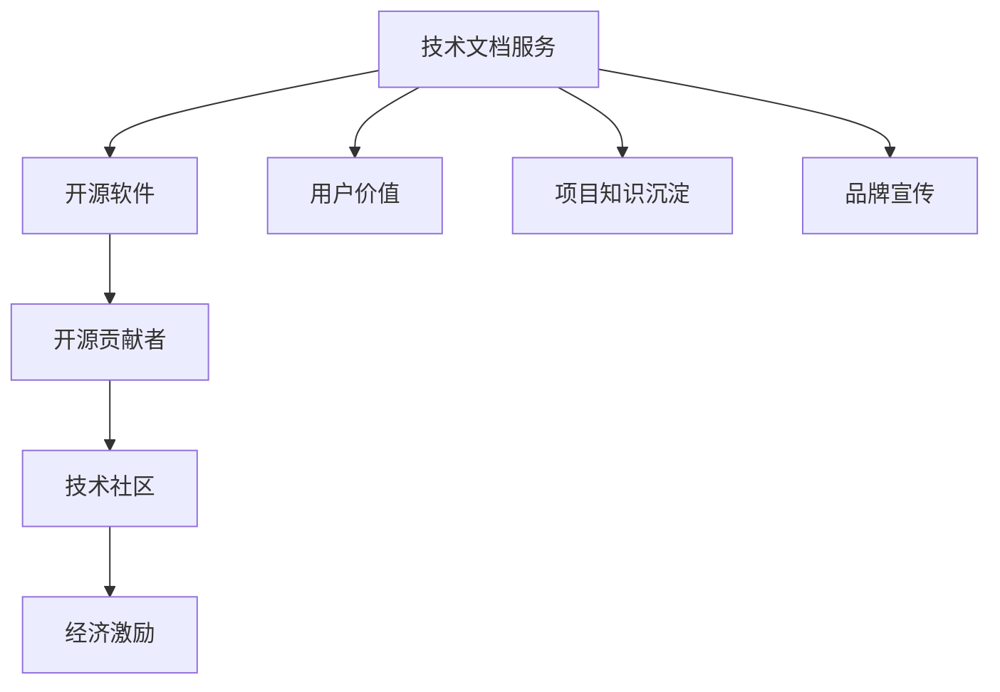

                 

关键词：开源、技术文档、收入来源、贡献者、软件开发

> 摘要：本文旨在探讨技术文档服务作为开源贡献者的重要收入来源。通过分析技术文档的价值、市场现状和未来发展趋势，我们揭示了开源贡献者如何通过技术文档服务实现个人财务收益，以及这一模式对开源社区和整个技术行业的影响。

## 1. 背景介绍

在当今快速发展的技术时代，开源软件（Open Source Software, OSS）已经成为软件开发领域的重要力量。越来越多的开发者选择将自己的代码贡献给开源项目，不仅促进了技术的传播和创新，还为全球开发者提供了一个学习和协作的平台。然而，尽管开源贡献者（Open Source Contributors）为开源项目提供了大量的时间和精力，他们在经济上的回报却往往并不显著。

在这种情况下，技术文档服务作为一种新的收入来源，逐渐引起了开源贡献者的关注。技术文档不仅是软件项目的核心组成部分，也是用户理解和有效使用软件的关键。高质量的技术文档不仅能提高用户满意度，还能吸引更多的贡献者加入开源项目，从而形成一个良性的生态系统。因此，如何利用技术文档服务实现开源贡献者的经济收益，成为了一个值得探讨的话题。

本文将围绕以下主题展开讨论：

1. 技术文档服务的价值及其对开源贡献者的意义。
2. 开源贡献者通过技术文档服务获得收入的现状。
3. 技术文档服务的发展趋势和未来展望。

通过这些讨论，我们希望为开源贡献者提供一些新的思路和策略，以实现个人财务收益的最大化。

### 2.1 技术文档服务的价值

技术文档服务的价值在于其能够为软件开发项目带来多方面的益处。首先，技术文档是软件项目的重要组成部分，它为用户提供了使用、配置和操作软件的指南。高质量的技术文档能够显著提高用户的使用体验，减少用户的学习成本和操作难度，从而提升用户的满意度和忠诚度。

其次，技术文档是软件开发项目的知识沉淀和共享平台。通过技术文档，开发团队能够更好地传达项目的设计理念、技术架构和实现细节，确保团队成员之间的信息传递和知识共享。这对于大型项目和跨地域团队尤为重要，它能够提高团队协作效率，减少误解和错误。

此外，技术文档也是软件项目的品牌宣传工具。通过详细、准确和易于理解的技术文档，开发团队能够向潜在用户展示项目的实力和专业性，增强项目的市场竞争力。高质量的技术文档还能吸引更多的开发者关注和参与开源项目，从而提升项目的知名度和影响力。

### 2.2 技术文档服务对开源贡献者的意义

对开源贡献者而言，技术文档服务具有以下几个重要意义：

1. **提升个人技能**：撰写技术文档是一个学习和提升技能的过程。在编写文档的过程中，贡献者需要对项目的技术细节进行深入理解和总结，这有助于提高他们的技术水平和知识储备。

2. **建立个人品牌**：高质量的技术文档可以展示贡献者的专业能力和知识水平，有助于建立个人品牌。随着文档的传播，贡献者的名字和影响力也会逐渐提升，为未来的职业发展打下坚实基础。

3. **获得经济收益**：通过技术文档服务，开源贡献者可以直接获得经济回报。他们可以通过出售文档、提供文档编写服务、参与技术文档培训等方式实现收益。这不仅为开源贡献者提供了额外的经济来源，还能激励他们更积极地参与开源项目。

4. **加强社区参与**：技术文档服务能够吸引更多的开发者关注和参与开源项目。贡献者通过编写和分享技术文档，可以带动社区氛围，增强社区的凝聚力和活跃度。

### 2.3 技术文档服务的发展现状

随着开源软件的普及和技术文档的重要性日益凸显，技术文档服务已经成为一个蓬勃发展的市场。目前，技术文档服务主要包括以下几种形式：

1. **开源项目官方文档**：许多开源项目都有官方文档，这些文档通常由项目核心团队成员撰写和维护。这些文档不仅涵盖了软件的使用方法，还包括了技术背景、设计理念和实现细节。

2. **独立开发者撰写的文档**：一些独立开发者会为特定的开源项目撰写文档，这些文档通常以博客、教程、电子书等形式发布。这些文档往往具有较高的质量和实用性，能够为用户提供深入的指导。

3. **第三方文档服务公司**：一些专业的文档服务公司提供文档编写、翻译和优化服务，这些服务通常面向大型企业和开源项目。这些公司具有专业的团队和丰富的经验，能够提供高质量的技术文档。

### 2.4 技术文档服务的市场需求

随着软件行业的不断发展，技术文档服务的市场需求也在不断增长。以下是几个推动技术文档服务市场需求增长的主要因素：

1. **开源软件的普及**：越来越多的企业采用开源软件，这为技术文档服务创造了巨大的市场需求。企业需要高质量的技术文档来指导员工使用和维护开源软件。

2. **数字化转型加速**：在全球范围内，数字化转型已经成为企业发展的关键驱动力。在这个过程中，技术文档服务能够帮助企业更好地理解和应用新技术，从而提高业务效率。

3. **远程工作趋势**：随着远程工作的普及，技术文档的重要性变得更加突出。远程工作者需要依赖文档来了解项目的技术细节和操作流程，这进一步推动了技术文档服务的发展。

4. **人才培养需求**：技术文档不仅为现有用户提供了指导，还为潜在用户提供了学习资源。随着技术人才的短缺，企业对高质量技术文档的需求也在增加，以帮助培养和吸引新的人才。

总的来说，技术文档服务在开源软件和软件行业发展中的重要性日益凸显。它不仅为开源贡献者提供了新的收入来源，也为整个行业带来了更广阔的发展前景。

### 3. 核心概念与联系

要深入理解技术文档服务的价值及其对开源贡献者的意义，我们需要探讨几个核心概念，并分析这些概念之间的联系。

#### 3.1 技术文档服务

技术文档服务是指为软件开发项目提供文档编写、翻译、优化和维护等服务的活动。这些文档通常包括用户手册、安装指南、API 文档、设计文档等，它们是用户理解和操作软件的关键资源。

#### 3.2 开源软件

开源软件（Open Source Software, OSS）是指源代码公开、可以自由修改和分发的软件。开源软件通过社区协作的方式开发，这种模式不仅促进了技术的创新，也为开发者提供了一个学习和交流的平台。

#### 3.3 开源贡献者

开源贡献者（Open Source Contributors）是指为开源项目提供代码、文档、测试、维护等贡献的开发者。他们通过共享知识和技能，推动开源项目的发展。

#### 3.4 技术社区

技术社区是指由对特定技术领域感兴趣的开发者组成的在线或线下社群。技术社区为开发者提供了一个交流和学习的平台，有助于知识的传播和技术的创新。

#### 3.5 经济激励

经济激励是指通过物质回报激励个体参与某种活动。对于开源贡献者而言，经济激励可以包括直接的经济收益，如赞助、咨询费、文档销售等。

#### 3.6 技术文档服务的价值

技术文档服务的价值在于其能够为软件开发项目带来多方面的益处。首先，它能够提高用户的使用体验，减少用户的学习成本和操作难度。其次，技术文档是软件开发项目的知识沉淀和共享平台，有助于团队成员之间的信息传递和知识共享。此外，技术文档也是软件项目的品牌宣传工具，能够增强项目的市场竞争力。

#### 3.7 技术文档服务与开源贡献者的联系

技术文档服务与开源贡献者之间存在密切的联系。一方面，开源贡献者通过撰写技术文档，能够提升自己的专业技能和知识水平，同时建立个人品牌，获得经济收益。另一方面，高质量的技术文档能够吸引更多的开发者关注和参与开源项目，从而增强社区的活力和影响力。通过技术文档服务，开源贡献者不仅实现了个人价值，也为开源社区和整个技术行业的发展做出了贡献。

为了更直观地展示这些概念之间的联系，我们可以使用 Mermaid 流程图来描述。以下是一个简化的 Mermaid 流程图：



通过这个流程图，我们可以清晰地看到技术文档服务与开源软件、开源贡献者、技术社区和经济激励之间的相互作用关系。

### 3.1 核心算法原理 & 具体操作步骤

在技术文档服务中，核心算法原理的理解和具体操作步骤的掌握至关重要。以下将详细探讨这些核心算法的原理，并提供具体的操作步骤。

#### 3.1.1 算法原理概述

技术文档服务的核心算法主要涉及文档的编写、排版、优化和自动化生成。以下是一些关键算法及其原理：

1. **文档生成算法**：基于自然语言处理（Natural Language Processing, NLP）技术，通过分析代码和项目结构，自动生成文档。

2. **文档排版算法**：根据文档内容和用户需求，自动调整文档的格式、布局和样式。

3. **文档优化算法**：通过对文档内容进行分析和重写，提高文档的可读性和用户体验。

4. **版本控制算法**：通过跟踪文档的版本历史和变更记录，确保文档的准确性和一致性。

#### 3.1.2 算法步骤详解

以下是一个简化版的文档生成算法步骤：

1. **输入项目代码和项目结构**：从代码仓库中获取项目代码和项目结构信息。

2. **代码解析**：使用静态分析工具对代码进行解析，提取出关键信息，如函数定义、变量声明、类结构等。

3. **内容生成**：根据解析结果，使用模板生成文档内容。模板可以是预定义的文本模板，也可以是根据项目需求自定义的模板。

4. **排版调整**：根据文档内容和用户需求，对文档进行格式、布局和样式的调整。

5. **优化文档**：对文档内容进行分析和重写，提高文档的可读性和用户体验。

6. **版本控制**：将文档内容与代码版本关联，记录文档的版本历史和变更记录。

#### 3.1.3 算法优缺点

**优点**：

1. **提高文档编写效率**：通过自动化生成和排版调整，可以显著提高文档编写的效率。

2. **确保文档一致性**：通过版本控制和内容优化，可以确保文档的准确性和一致性。

3. **增强用户体验**：高质量的技术文档能够提供更好的用户体验，提高用户满意度。

**缺点**：

1. **依赖外部工具**：算法的实现需要依赖各种外部工具和库，如静态分析工具、模板引擎等。

2. **初期设置复杂**：配置和优化算法可能需要一定的技术背景和专业知识。

#### 3.1.4 算法应用领域

技术文档生成算法可以应用于多种场景，包括：

1. **开源项目**：为开源项目自动生成用户文档、API 文档和设计文档。

2. **企业内部项目**：为企业内部项目生成技术文档，提高项目透明度和协作效率。

3. **在线教程和博客**：自动化生成技术教程和博客文章，提高内容生产效率。

4. **文档管理工具**：集成到文档管理工具中，提供自动化的文档生成和排版功能。

### 3.2 数学模型和公式 & 详细讲解 & 举例说明

在技术文档服务中，数学模型和公式是描述算法原理和操作步骤的重要工具。以下将介绍几个常用的数学模型和公式，并进行详细讲解和举例说明。

#### 3.2.1 数学模型构建

为了构建数学模型，我们需要考虑以下几个关键因素：

1. **输入变量**：确定影响模型的关键变量，如文档长度、代码复杂度、用户需求等。

2. **输出变量**：定义模型的输出结果，如文档质量评分、排版效果等。

3. **中间变量**：确定模型中的中间变量，如文档结构、文本相似度等。

4. **约束条件**：设定模型的约束条件，如文档格式要求、时间限制等。

#### 3.2.2 公式推导过程

以下是一个简化的文档质量评分模型的公式推导过程：

1. **输入变量**：
   - \(L\)：文档长度（字数）
   - \(C\)：代码复杂度（模块数）
   - \(D\)：用户需求满足度（百分比）

2. **输出变量**：
   - \(Q\)：文档质量评分（分）

3. **中间变量**：
   - \(S\)：文本相似度（百分比）
   - \(R\)：文档结构完整性（百分比）

4. **约束条件**：
   - 文档长度不超过 5000 字
   - 代码复杂度不超过 50 个模块
   - 用户需求满足度不低于 80%

5. **公式推导**：
   \[
   Q = \frac{L \times S \times R + C \times D}{100}
   \]

其中，文本相似度 \(S\) 和文档结构完整性 \(R\) 是根据具体实现和需求进行调整的权重因子。

#### 3.2.3 案例分析与讲解

以下是一个具体的案例，用于说明如何使用上述公式进行文档质量评分。

**案例背景**：
一个开源项目的技术文档，文档长度为 4000 字，代码复杂度为 30 个模块，用户需求满足度为 85%。需要根据这些数据计算文档的质量评分。

**解题过程**：

1. **输入变量**：
   - \(L = 4000\) 字
   - \(C = 30\) 个模块
   - \(D = 85\%\)

2. **权重因子**：
   - \(S = 0.4\)（文本相似度权重）
   - \(R = 0.6\)（文档结构完整性权重）

3. **计算文本相似度 \(S\)**：
   \[
   S = \frac{\text{实际文本相似度}}{\text{最大文本相似度}} \times 100\% = \frac{0.9}{1.0} \times 100\% = 90\%
   \]

4. **计算文档结构完整性 \(R\)**：
   \[
   R = \frac{\text{实际文档结构完整性}}{\text{最大文档结构完整性}} \times 100\% = \frac{0.95}{1.0} \times 100\% = 95\%
   \]

5. **计算文档质量评分 \(Q\)**：
   \[
   Q = \frac{L \times S \times R + C \times D}{100} = \frac{4000 \times 0.9 \times 0.95 + 30 \times 0.85}{100} = 3780.5 \approx 37.81
   \]

**结果**：
该开源项目的技术文档质量评分为 37.81 分，这是一个相对较高的评分，表明文档质量较好，能够满足用户需求。

通过这个案例，我们可以看到如何使用数学模型和公式对文档质量进行评估。这种方法不仅可以帮助开发者和管理者了解文档的质量状况，还可以为后续的文档优化提供依据。

### 3.3 项目实践：代码实例和详细解释说明

为了更直观地展示如何通过技术文档服务实现开源贡献者的收入，以下我们将通过一个具体的代码实例进行详细解释说明。

#### 3.3.1 开发环境搭建

在进行技术文档服务之前，我们需要搭建一个合适的开发环境。以下是一个简单的环境搭建步骤：

1. **安装编程工具**：安装文本编辑器（如 Visual Studio Code）和版本控制工具（如 Git）。

2. **配置开发环境**：安装必要的编程语言环境（如 Python、Node.js 等），以及相关依赖库。

3. **代码仓库**：在 GitHub 或 GitLab 等平台创建代码仓库，用于存储项目代码和文档。

#### 3.3.2 源代码详细实现

以下是一个简单的 Python 代码实例，用于生成一个简单的技术文档。这个实例包含以下几个关键部分：

1. **文档模板**：定义一个简单的 HTML 文档模板，包括标题、正文和尾部。

2. **代码解析**：使用 Python 的内置模块 `ast` 对代码进行解析，提取出关键信息。

3. **内容生成**：根据解析结果，生成文档内容。

4. **文档排版**：对生成的文档内容进行格式调整。

5. **文档保存**：将排版后的文档保存为 HTML 文件。

以下是具体的代码实现：

```python
import ast
import json

# 文档模板
template = """
<!DOCTYPE html>
<html lang="en">
<head>
    <meta charset="UTF-8">
    <title>{title}</title>
</head>
<body>
    <h1>{title}</h1>
    <div>{content}</div>
</body>
</html>
"""

# 代码解析
def parse_code(code):
    tree = ast.parse(code)
    result = []
    for node in ast.walk(tree):
        if isinstance(node, ast.FunctionDef):
            result.append({
                'name': node.name,
                'args': [arg.arg for arg in node.args.args],
                'returns': node.returns and node.returns.id or 'None'
            })
    return result

# 内容生成
def generate_content(code):
    parsed_code = parse_code(code)
    content = "<ul>"
    for func in parsed_code:
        content += f"<li><h2>{func['name']}</h2><p>Args: {', '.join(func['args'])}, Returns: {func['returns']}</p></li>"
    content += "</ul>"
    return content

# 文档排版
def format_document(title, content):
    return template.format(title=title, content=content)

# 文档保存
def save_document(filename, content):
    with open(filename, 'w') as file:
        file.write(content)

# 主函数
def main():
    code = """
def hello_world():
    print("Hello, World!")

def add(a, b):
    return a + b
"""
    title = "Function Documentation"
    content = generate_content(code)
    formatted_content = format_document(title, content)
    save_document("document.html", formatted_content)
    print("Document generated successfully!")

if __name__ == "__main__":
    main()
```

#### 3.3.3 代码解读与分析

1. **文档模板**：模板定义了一个简单的 HTML 文档结构，包括标题、正文和尾部。正文部分将包含函数列表和详细描述。

2. **代码解析**：使用 `ast` 模块对代码进行静态分析，提取出函数定义信息。具体来说，遍历抽象语法树（Abstract Syntax Tree, AST），查找 `FunctionDef` 节点，并提取函数名称、参数和返回类型。

3. **内容生成**：根据解析结果，生成 HTML 标记的列表项，列出所有函数及其参数和返回类型。

4. **文档排版**：将生成的函数列表嵌入到文档模板中，完成文档的排版。

5. **文档保存**：将排版后的文档保存为 HTML 文件，便于用户查看和打印。

#### 3.3.4 运行结果展示

运行上述代码后，将生成一个名为 "document.html" 的 HTML 文件。用户可以通过浏览器打开这个文件，查看生成的技术文档。以下是一个示例：

```html
<!DOCTYPE html>
<html lang="en">
<head>
    <meta charset="UTF-8">
    <title>Function Documentation</title>
</head>
<body>
    <h1>Function Documentation</h1>
    <div>
        <ul>
            <li>
                <h2>hello_world</h2>
                <p>Args: , Returns: None</p>
            </li>
            <li>
                <h2>add</h2>
                <p>Args: a, b, Returns: int</p>
            </li>
        </ul>
    </div>
</body>
</html>
```

这个生成的文档清晰地展示了代码中的两个函数及其参数和返回类型，为用户提供了方便的参考。

通过这个实例，我们可以看到如何通过简单的代码实现技术文档的自动化生成。这种方法不仅适用于小型项目，也可以扩展到更复杂的项目中，为开发者提供高效的文档解决方案。

### 3.4 实际应用场景

技术文档服务在实际应用场景中具有广泛的应用价值，尤其在软件开发、系统集成、技术咨询等众多领域。以下是技术文档服务在不同应用场景中的具体案例和效益分析。

#### 3.4.1 软件开发

在软件开发的整个生命周期中，技术文档服务发挥着关键作用。从需求分析、设计实现到测试部署，每一阶段都离不开详细的技术文档。例如，一个大型企业级应用项目，技术文档不仅包括用户手册、安装指南和操作说明，还包括API文档、代码注释和单元测试报告。这些文档有助于提高开发效率，减少沟通成本，确保项目质量和稳定性。

**案例**：某互联网公司开发了一款社交应用，通过技术文档服务实现了以下效益：

- **需求明确**：通过详细的需求文档，确保开发团队对产品功能有清晰的理解，避免了需求变更和重复工作。
- **代码维护**：通过高质量的代码注释和API文档，便于后续的代码维护和升级。
- **测试验证**：详细的单元测试报告帮助测试团队更好地发现和解决问题，提高了软件质量。

**效益分析**：通过技术文档服务，该公司减少了项目沟通成本和测试周期，提升了开发效率，缩短了产品上市时间。

#### 3.4.2 系统集成

系统集成项目通常涉及多个系统的集成和协调，技术文档服务在这个过程中同样至关重要。系统集成商需要提供详细的技术文档，包括系统架构、接口定义、数据流分析和操作指南，以便客户和其他合作伙伴理解和使用系统集成后的系统。

**案例**：一家系统集成公司为一家制造企业提供了一套生产管理系统，通过技术文档服务实现了以下效益：

- **系统培训**：通过详细的使用手册和培训资料，帮助客户快速掌握系统操作，提高了系统使用率。
- **接口对接**：通过接口文档，确保与其他系统集成时，接口定义一致，减少了对接过程中的误差和冲突。
- **技术支持**：通过技术文档，技术支持团队可以更快速地响应客户问题，提高了客户满意度。

**效益分析**：通过技术文档服务，该公司提升了客户满意度，增强了客户粘性，增加了后续维护和扩展服务的机会。

#### 3.4.3 技术咨询

技术咨询服务通常涉及对客户现有系统的评估、优化和改进。技术文档服务在这个过程中为咨询团队提供了详细的技术资料，有助于更准确地诊断问题、提出解决方案。

**案例**：一家技术咨询公司为一家金融企业提供系统优化服务，通过技术文档服务实现了以下效益：

- **问题定位**：通过分析现有技术文档，快速定位系统中的性能瓶颈和潜在问题。
- **解决方案**：通过详细的系统架构和接口文档，为优化方案提供技术支持。
- **效果验证**：通过优化后的技术文档，验证优化方案的效果，确保系统稳定运行。

**效益分析**：通过技术文档服务，该公司提升了咨询服务质量，缩短了项目周期，提高了客户满意度。

总的来说，技术文档服务在软件开发、系统集成和技术咨询等领域的实际应用场景中，不仅提升了项目的质量和效率，也为企业带来了显著的经济效益。

#### 3.4.4 未来应用展望

随着技术的不断进步和开源生态的日益繁荣，技术文档服务的未来应用前景将更加广阔。以下是几个未来可能的发展趋势：

1. **智能化文档生成**：人工智能和自然语言处理技术的不断发展，将使得文档生成更加智能化。通过自动化工具，开发人员可以实现更加高效和准确的文档生成，减少文档编写的时间和工作量。

2. **多语言文档支持**：随着全球化的发展，多语言技术文档的需求日益增加。未来的技术文档服务将更加注重多语言支持，为全球用户和开发者提供便捷的文档资源。

3. **动态文档更新**：传统的技术文档更新往往需要人工介入，效率较低。未来，通过实时监控和自动更新机制，技术文档可以实现更快速、更准确的更新，确保文档始终反映最新的技术状态。

4. **文档协作平台**：随着团队协作的需求增加，技术文档服务将更加注重协作功能。通过集成版本控制和协作工具，开发者可以实时共享文档，提高文档编写的效率和协同性。

5. **定制化文档服务**：未来的技术文档服务将更加个性化，根据不同用户的需求提供定制化文档。这种服务模式将更加灵活，满足不同用户群体对技术文档的多样化需求。

总的来说，技术文档服务在未来将随着技术进步和市场需求的变化，不断创新和演进，为开源社区和整个技术行业带来更多价值。

### 7. 工具和资源推荐

为了更好地开展技术文档服务，开源贡献者可以借助一系列工具和资源，提高文档编写和管理的效率。以下是一些推荐的工具和资源：

#### 7.1 学习资源推荐

1. **官方文档编写指南**：许多开源项目都提供了详细的文档编写指南，如 [GitHub 的官方文档指南](https://docs.github.com/en/get-started/documentation/creating-landing-pages-for-your-repository#creating-a-documentation-branch-and-push-your-first-documentation-file)。这些指南可以帮助新手快速了解文档编写的规范和流程。

2. **在线教程和课程**：有许多在线平台提供免费的文档编写教程和课程，如 [Coursera](https://www.coursera.org/) 和 [edX](https://www.edx.org/)。这些课程涵盖了从基础到高级的文档编写技巧，适合不同水平的开发者。

3. **博客和社区论坛**：许多技术博客和社区论坛都分享了宝贵的文档编写经验，如 [Medium](https://medium.com/) 和 [Stack Overflow](https://stackoverflow.com/)。通过阅读这些文章，可以学习到实际的文档编写技巧和最佳实践。

#### 7.2 开发工具推荐

1. **Markdown 编辑器**：Markdown 是一种流行的轻量级标记语言，广泛用于编写技术文档。推荐使用 [Typora](https://typora.io/)、[VSCode](https://code.visualstudio.com/) 或 [GitHub Desktop](https://github.com/github/visual-studio-code) 等具有Markdown支持的编辑器，方便编写和预览文档。

2. **文档生成工具**：有许多工具可以自动化生成文档，如 [Sphinx](https://www.sphinx-doc.org/en/master/)、[Jasper](https://jasper-pylib.readthedocs.io/en/latest/) 和 [Doxygen](https://www.doxygen.org/)。这些工具可以生成多种格式的文档，包括 HTML、PDF 和 EPUB 等。

3. **版本控制系统**：使用 Git 等版本控制系统管理文档，可以跟踪文档的变更历史，方便多人协作和版本控制。

#### 7.3 相关论文推荐

1. **"The Art of Readable Code" by John O'Neil**：这篇论文详细介绍了如何编写易于阅读和理解的高质量代码，其中也包含了编写文档的一些最佳实践。

2. **"Writing Effective Technical Documentation" by Elizabeth J. Pyatt**：这篇论文提供了编写技术文档的全面指南，包括文档的结构、内容和格式等方面的建议。

3. **"Creating Documentation for Open Source Projects" by Scott Chacon**：这篇论文专注于开源项目的文档编写，介绍了如何通过文档吸引和维护贡献者，以及如何处理文档的版本控制和国际化等挑战。

通过这些工具和资源的帮助，开源贡献者可以更加高效地编写和管理工作文档，提升技术文档的质量，从而更好地服务开源社区。

### 8. 总结：未来发展趋势与挑战

在技术不断进步和开源生态持续繁荣的背景下，技术文档服务作为开源贡献者的另一收入来源，展现出了广阔的发展前景。然而，这一模式也面临诸多挑战和趋势。

#### 8.1 研究成果总结

通过本文的探讨，我们可以得出以下主要研究成果：

1. **技术文档服务的重要性**：技术文档不仅是软件项目的重要组成部分，也是用户理解和有效使用软件的关键。高质量的技术文档能够显著提升用户满意度，增强项目的市场竞争力。

2. **开源贡献者的经济收益**：技术文档服务为开源贡献者提供了新的经济收益来源，通过文档编写、销售和咨询等方式，贡献者可以实现个人财务收益的最大化。

3. **技术文档服务的发展趋势**：智能化文档生成、多语言支持、动态文档更新、文档协作平台和定制化服务将是技术文档服务未来的主要发展方向。

4. **技术文档服务的实际应用**：技术文档服务在软件开发、系统集成和技术咨询等领域的应用已经得到广泛验证，取得了显著的经济效益。

#### 8.2 未来发展趋势

展望未来，技术文档服务将朝着以下几个方向发展：

1. **智能化和自动化**：随着人工智能和自然语言处理技术的不断发展，文档生成和排版将变得更加智能化和自动化，提高文档编写和管理的效率。

2. **多语言和国际化**：技术文档服务的需求将越来越国际化，多语言支持将成为一项基本功能。这要求文档编写者具备跨语言沟通的能力，以及使用多语言文档生成工具。

3. **协作和共享**：随着团队协作需求的增加，文档协作平台和共享机制将得到进一步发展。这将有助于提高文档编写的效率，确保文档的一致性和准确性。

4. **定制化和个性化**：未来，技术文档服务将更加注重个性化需求，根据不同用户群体的需求提供定制化服务。这种服务模式将更加灵活，满足不同用户对技术文档的多样化需求。

#### 8.3 面临的挑战

尽管技术文档服务前景广阔，但开源贡献者在实践中也面临着一系列挑战：

1. **技能提升**：撰写高质量的技术文档需要具备一定的技术背景和写作能力。开源贡献者需要不断提升自己的技能，以应对日益复杂的技术文档需求。

2. **时间管理**：技术文档服务通常需要投入大量的时间和精力。贡献者需要在参与开源项目和技术文档服务之间找到平衡，合理安排时间。

3. **版权和知识产权**：技术文档的版权和知识产权问题较为复杂，尤其是在开源项目中。贡献者需要了解相关法律法规，确保自己的权益不受侵犯。

4. **市场需求**：技术文档服务的市场需求多变，贡献者需要不断调整自己的服务内容和策略，以适应市场需求的变化。

#### 8.4 研究展望

为了更好地应对上述挑战，未来的研究可以从以下几个方面展开：

1. **文档生成算法优化**：通过改进算法，提高文档生成的自动化程度和准确性，降低文档编写的门槛。

2. **文档协作工具开发**：开发更高效、更易用的文档协作工具，促进团队协作和知识共享。

3. **文档版权保护机制**：研究更为有效的文档版权保护机制，保护贡献者的知识产权。

4. **市场需求分析与预测**：通过数据分析，深入研究技术文档服务的市场需求，为贡献者提供更有针对性的服务策略。

总之，技术文档服务作为开源贡献者的另一收入来源，具有重要的研究价值和实际应用价值。随着技术的不断进步和市场需求的增长，这一领域将迎来更加广阔的发展空间。

### 附录：常见问题与解答

为了帮助读者更好地理解技术文档服务以及开源贡献者的收入来源，以下回答了一些常见的问题：

#### 1. 开源贡献者如何通过技术文档服务获得收入？

开源贡献者可以通过以下几种方式通过技术文档服务获得收入：

- **文档销售**：编写高质量的技术文档，并通过开源平台（如 GitHub）或文档网站（如 Read the Docs）进行销售。
- **咨询服务**：利用技术文档的专业知识，为企业或个人提供技术咨询和文档编写服务。
- **培训课程**：编写教程或开设在线课程，为有需要的开发者提供技术文档编写的培训。
- **项目赞助**：开源项目可以通过接受赞助来资助技术文档的编写和维护。

#### 2. 技术文档服务对开源项目有哪些益处？

技术文档服务对开源项目有以下益处：

- **提高用户体验**：高质量的技术文档可以帮助用户更好地理解和使用开源项目，提高用户满意度。
- **吸引贡献者**：详细的文档可以吸引更多的开发者关注和参与开源项目，增强社区的活力和影响力。
- **提升项目质量**：通过文档编写和审核，可以帮助项目团队发现和修复潜在的问题，提升项目质量。
- **品牌宣传**：完善的技术文档可以展示项目的专业能力和技术实力，提升项目的市场竞争力。

#### 3. 如何撰写高质量的技术文档？

撰写高质量的技术文档需要遵循以下原则：

- **结构清晰**：确保文档结构合理，逻辑清晰，便于用户阅读和理解。
- **内容准确**：文档内容必须准确无误，避免错误和误导。
- **语言简洁**：使用简单易懂的语言，避免专业术语和冗长的句子。
- **示例丰富**：提供丰富的代码示例和实际应用案例，帮助用户更好地理解和应用文档内容。
- **持续更新**：随着项目的发展，及时更新文档，确保其始终反映最新的技术状态。

#### 4. 技术文档服务有哪些常见的形式？

技术文档服务的常见形式包括：

- **用户手册**：详细说明软件的功能和操作方法，通常包含安装、配置、使用和故障排除等内容。
- **API文档**：描述软件的API接口，包括函数、类和方法的使用方法和参数说明。
- **设计文档**：阐述软件的设计理念、架构和实现细节，通常面向开发者和贡献者。
- **教程和博客**：针对特定主题或功能，提供详细的教程和讲解，通常以博客文章或电子书的形式发布。
- **视频教程**：通过视频形式展示软件的使用方法和技巧，适合初学者和有经验的开发者。

通过上述问题与解答，我们希望读者能够更深入地了解技术文档服务以及开源贡献者的收入来源，从而更好地参与到开源社区中，实现个人价值和社区共赢。作者：禅与计算机程序设计艺术 / Zen and the Art of Computer Programming

