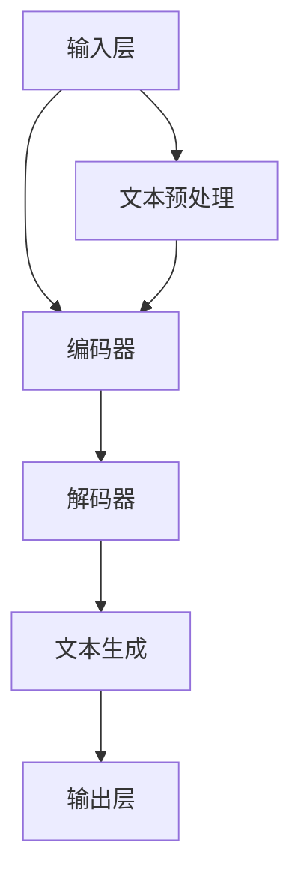
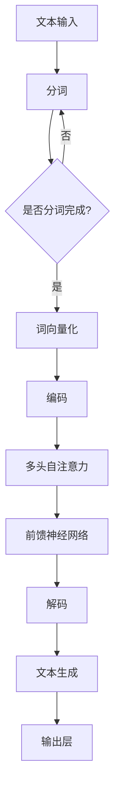

                 

关键词：大型语言模型，人工智能，创新，技术趋势，算法原理，应用场景，未来展望。

> 摘要：随着人工智能技术的飞速发展，大型语言模型（LLM）已成为驱动创新的重要力量。本文将深入探讨LLM的核心概念、算法原理及其在各个领域的应用，并展望其未来的发展趋势与挑战。

## 1. 背景介绍

近年来，人工智能（AI）领域取得了令人瞩目的进展，尤其是在自然语言处理（NLP）方面。大型语言模型（LLM）如GPT-3、BERT和Turing等，以其强大的文本生成和理解能力，已经成为许多企业和研究机构的研发焦点。LLM的成功不仅改变了NLP的格局，也对整个科技行业产生了深远的影响。

本文将从以下几个方面展开讨论：

1. **核心概念与联系**：介绍LLM的核心概念，包括其基本原理和架构。
2. **核心算法原理 & 具体操作步骤**：详细解释LLM的算法原理及其操作步骤。
3. **数学模型和公式 & 详细讲解 & 举例说明**：探讨LLM的数学模型和公式，并通过实例进行说明。
4. **项目实践：代码实例和详细解释说明**：提供一个实际代码实例，并进行详细解读。
5. **实际应用场景**：探讨LLM在各个领域的应用。
6. **未来应用展望**：预测LLM在未来的发展趋势和潜在应用。
7. **工具和资源推荐**：推荐一些学习资源和开发工具。
8. **总结：未来发展趋势与挑战**：总结研究成果，并展望未来。

### 1.1 历史回顾

人工智能的发展历程可以追溯到20世纪50年代，当时计算机科学家首次提出了“人工智能”的概念。然而，早期的AI系统主要是基于规则和逻辑推理，这限制了其应用范围。随着计算能力的提高和数据量的增长，机器学习（ML）和深度学习（DL）逐渐成为AI研究的主流。

在NLP领域，统计方法和规则驱动的模型曾占据主导地位。然而，随着神经网络技术的不断发展，基于神经网络的模型如卷积神经网络（CNN）和递归神经网络（RNN）逐渐崭露头角。特别是Transformer架构的提出，彻底改变了NLP的面貌。Transformer架构的核心思想是自注意力机制（Self-Attention），这一机制使得模型能够更好地捕捉文本中的长距离依赖关系。

LLM的概念正是在这一背景下提出的。通过训练大量的文本数据，LLM能够生成高质量的自然语言文本，并且能够进行语义理解和推理。这使得LLM在机器翻译、问答系统、文本生成等领域取得了显著成果。

### 1.2 当前状态

目前，LLM已经成为NLP领域的核心技术之一。以GPT-3为例，它由OpenAI开发，具有1750亿个参数，是目前最大的语言模型。GPT-3的强大能力使其在多个NLP任务中取得了优异的表现，包括文本生成、机器翻译、摘要生成和问答系统等。此外，BERT和Turing等模型也在各自的领域取得了显著的成果。

LLM的成功不仅得益于其强大的文本生成和理解能力，还得益于大规模数据集和高效计算资源的支持。随着计算能力的提高和数据的积累，LLM有望在更多的领域取得突破。

### 1.3 未来展望

未来，LLM将继续在NLP领域发挥重要作用。随着模型规模的不断扩大和算法的优化，LLM在文本生成、语义理解、问答系统等方面的能力将进一步提高。此外，LLM还将在其他领域如对话系统、智能助手和自然语言推理等发挥重要作用。

然而，LLM也面临着一些挑战，如数据隐私、安全性和伦理问题。如何在保证模型性能的同时，保护用户隐私和安全，是一个亟待解决的问题。

## 2. 核心概念与联系

在本节中，我们将介绍LLM的核心概念，包括其基本原理和架构。为了更好地理解LLM的工作原理，我们将使用Mermaid流程图来展示其基本架构和流程。

### 2.1 基本原理

LLM是一种基于深度学习的自然语言处理模型，其核心思想是通过对大量文本数据进行训练，学习文本的内在结构和语义信息。LLM通常由以下几个关键组件组成：

1. **输入层**：接收文本数据，将其转化为模型可以处理的输入格式。
2. **编码器**：将输入文本编码为向量表示，这一步骤通常使用Transformer架构。
3. **解码器**：将编码后的向量解码为输出文本。

### 2.2 架构

LLM的基本架构如下所示：

```
+----------------+      +------------------+      +------------------+
|  输入层（Input） |      |   编码器（Encoder）|      |   解码器（Decoder）|
+----------------+      +------------------+      +------------------+
       |                                            |
       |                                            |
       v                                            v
+----------------+      +------------------+      +------------------+
|  文本预处理     |      |   模型训练       |      |   文本生成       |
+----------------+      +------------------+      +------------------+
```

### 2.3 流程图

以下是LLM的基本工作流程的Mermaid流程图：



### 2.4 核心概念

1. **自注意力机制（Self-Attention）**：自注意力机制是Transformer架构的核心组成部分。它允许模型在处理每个单词时，考虑其他所有单词的重要性，从而更好地捕捉文本中的长距离依赖关系。
2. **多头注意力（Multi-Head Attention）**：多头注意力机制是自注意力机制的扩展。它通过将输入文本分割成多个子序列，并分别应用自注意力机制，从而进一步提高模型的性能。
3. **预训练（Pre-training）和微调（Fine-tuning）**：预训练是指在大规模数据集上对模型进行训练，使其具备一定的通用语言理解能力。微调是指在使用预训练模型的基础上，针对特定任务进行进一步训练，以提高模型在特定任务上的性能。

### 2.5 Mermaid 流程图

以下是LLM的Mermaid流程图，其中包含核心概念和流程步骤：



通过以上介绍，我们可以看出LLM是一种基于深度学习的自然语言处理模型，其核心思想是通过自注意力机制和多头注意力机制，从大规模文本数据中学习语言结构和语义信息。LLM的基本架构包括输入层、编码器、解码器和输出层，其工作流程主要包括文本预处理、模型训练和文本生成等步骤。

在下一节中，我们将详细解释LLM的核心算法原理，并探讨其在实际应用中的操作步骤和具体实现。

## 3. 核心算法原理 & 具体操作步骤

### 3.1 算法原理概述

大型语言模型（LLM）的核心算法基于Transformer架构，这是一种基于自注意力机制的深度学习模型。Transformer架构通过多头注意力机制和多层前馈神经网络，实现了对输入文本的编码和解码，从而实现文本生成和理解的任务。

Transformer架构的核心思想是自注意力机制（Self-Attention），这种机制允许模型在处理每个单词时，考虑其他所有单词的重要性，从而更好地捕捉文本中的长距离依赖关系。自注意力机制通过计算每个单词与所有其他单词的相似度，生成一个加权矩阵，从而实现对输入文本的编码。

在编码器（Encoder）阶段，输入文本首先被分词成单词或子词，然后被转化为向量表示。这些向量表示将输入文本映射到高维空间，使得模型可以更好地理解文本的语义信息。在编码过程中，模型通过自注意力机制计算每个单词的重要性，并将其编码为向量表示。

在解码器（Decoder）阶段，编码后的向量表示被解码为输出文本。解码过程同样使用了自注意力机制，使得模型在生成每个单词时，能够考虑之前生成的单词，从而保持输出的连贯性和语义一致性。解码器还通过多头注意力机制，实现了对编码器输出的全局上下文信息的捕获。

### 3.2 算法步骤详解

以下是LLM的核心算法步骤：

1. **输入层**：接收文本数据，将其转化为模型可以处理的输入格式。
2. **分词**：将输入文本分词成单词或子词。
3. **词向量化**：将分词后的文本转化为向量表示，这些向量表示了文本的语义信息。
4. **编码器**：通过自注意力机制和多层前馈神经网络，对输入文本进行编码。
5. **多头注意力**：在编码过程中，通过多头注意力机制，实现对输入文本的全局上下文信息的捕获。
6. **解码器**：通过自注意力机制和多层前馈神经网络，将编码后的向量表示解码为输出文本。
7. **文本生成**：在解码过程中，生成每个单词，并保持输出的连贯性和语义一致性。
8. **输出层**：将解码后的文本输出为最终结果。

### 3.3 算法优缺点

**优点**：

1. **强大的文本生成和理解能力**：通过自注意力机制和多头注意力机制，LLM能够捕捉文本中的长距离依赖关系，从而实现高质量的文本生成和理解。
2. **高效性**：Transformer架构使得LLM在计算效率和性能上具有优势，尤其是在大规模文本数据处理方面。
3. **灵活性**：LLM可以应用于多种自然语言处理任务，如文本生成、机器翻译、摘要生成和问答系统等。

**缺点**：

1. **计算资源需求大**：由于LLM通常具有数百万至数十亿个参数，因此其训练和推理过程需要大量的计算资源。
2. **数据依赖性强**：LLM的性能很大程度上依赖于训练数据的质量和规模，因此在大规模数据集上的性能可能不如在小数据集上。
3. **伦理和隐私问题**：LLM在处理文本数据时，可能会引发数据隐私和安全问题，如何在保证模型性能的同时，保护用户隐私和安全，是一个亟待解决的问题。

### 3.4 算法应用领域

LLM在多个领域展现了其强大的应用潜力：

1. **文本生成**：LLM可以用于生成文章、报告、故事等自然语言文本，提高内容创作效率。
2. **机器翻译**：LLM可以用于高质量机器翻译，如英译中、中译英等，实现跨语言交流。
3. **摘要生成**：LLM可以用于自动生成文章摘要，提高信息获取效率。
4. **问答系统**：LLM可以用于构建问答系统，实现自然语言交互，如智能客服、虚拟助手等。

在下一节中，我们将探讨LLM的数学模型和公式，并通过具体案例进行详细讲解。

## 4. 数学模型和公式 & 详细讲解 & 举例说明

### 4.1 数学模型构建

LLM的数学模型主要基于深度学习和变换器架构，其中核心的数学公式包括自注意力机制、多头注意力和前馈神经网络。以下是这些数学模型的基本构建：

#### 自注意力机制（Self-Attention）

自注意力机制是Transformer架构的核心组成部分，用于计算每个单词与其他所有单词的相似度，从而生成一个加权矩阵。自注意力机制的数学公式如下：

\[ \text{Attention}(Q, K, V) = \text{softmax}\left(\frac{QK^T}{\sqrt{d_k}}\right) V \]

其中，\( Q \)、\( K \) 和 \( V \) 分别表示查询向量、键向量和值向量；\( d_k \) 是键向量的维度。自注意力机制通过计算 \( Q \) 和 \( K \) 的点积，得到一个表示相似度的矩阵，然后通过 softmax 函数将相似度矩阵转化为概率分布，最后将概率分布与 \( V \) 相乘，得到加权后的值向量。

#### 多头注意力（Multi-Head Attention）

多头注意力是对自注意力机制的扩展，通过将输入文本分割成多个子序列，并分别应用自注意力机制，从而提高模型的性能。多头注意力的数学公式如下：

\[ \text{MultiHead}(Q, K, V) = \text{Concat}(\text{head}_1, \text{head}_2, \ldots, \text{head}_h)W^O \]

其中，\( h \) 是头数，\( \text{head}_i \) 表示第 \( i \) 个头的输出；\( W^O \) 是输出层的权重矩阵。每个头都是对自注意力机制的独立应用，从而使得模型能够捕捉输入文本的不同特征。

#### 前馈神经网络（Feed Forward Neural Network）

前馈神经网络用于对编码器和解码器的中间层进行非线性变换，提高模型的表示能力。前馈神经网络的数学公式如下：

\[ \text{FFN}(x) = \text{ReLU}(xW_1 + b_1)W_2 + b_2 \]

其中，\( x \) 是输入向量，\( W_1 \) 和 \( W_2 \) 是前馈神经网络的权重矩阵，\( b_1 \) 和 \( b_2 \) 是偏置项。

### 4.2 公式推导过程

在理解了LLM的数学模型之后，我们接下来将详细推导自注意力机制和多头注意力的过程。

#### 自注意力机制推导

假设我们有 \( n \) 个单词组成的一维向量 \( X \)，维度为 \( d \)。首先，我们将 \( X \) 扩展为三维张量 \( X_{ij} \)，其中 \( i \) 和 \( j \) 分别表示行和列，\( n \) 表示列数。扩展后的张量大小为 \( n \times d \times d \)。

1. **计算查询向量（Query）、键向量（Key）和值向量（Value）**：

   查询向量、键向量和值向量分别表示为 \( Q \)，\( K \) 和 \( V \)。这些向量可以通过权重矩阵 \( W_Q \)，\( W_K \) 和 \( W_V \) 计算得到：

   \[ Q = XW_Q \]
   \[ K = XV_Q \]
   \[ V = XV_V \]

2. **计算相似度矩阵**：

   相似度矩阵 \( S \) 通过计算 \( Q \) 和 \( K \) 的点积得到：

   \[ S_{ij} = Q_{i}K_{j} = X_i^TW_QW_KX_j^T \]

3. **应用 softmax 函数**：

   将相似度矩阵 \( S \) 通过 softmax 函数转化为概率分布：

   \[ A_{ij} = \frac{\exp(S_{ij})}{\sum_{k=1}^{n}\exp(S_{ik})} \]

4. **计算加权值向量**：

   将概率分布 \( A \) 与 \( V \) 相乘，得到加权后的值向量 \( \text{context\_i} \)：

   \[ \text{context}_i = \sum_{j=1}^{n} A_{ij}V_j \]

5. **合并值向量**：

   将所有值向量合并为一个一维向量，得到最终编码结果：

   \[ \text{output}_i = \text{context}_iW_O \]

#### 多头注意力推导

多头注意力是对自注意力机制的扩展，其核心思想是将输入文本分割成多个子序列，并分别应用自注意力机制。以下是多头注意力的推导过程：

1. **分割输入文本**：

   假设输入文本有 \( h \) 个子序列，每个子序列的维度为 \( d \)。将输入文本扩展为三维张量 \( X_{ij} \)，其中 \( i \) 和 \( j \) 分别表示行和列，\( n \) 表示列数。扩展后的张量大小为 \( n \times h \times d \)。

2. **计算每个子序列的查询向量、键向量和值向量**：

   对于每个子序列，计算查询向量、键向量和值向量：

   \[ Q_i = X_iW_{Q_1} \]
   \[ K_i = X_iW_{K_1} \]
   \[ V_i = X_iW_{V_1} \]

   其中，\( W_{Q_1} \)，\( W_{K_1} \) 和 \( W_{V_1} \) 是权重矩阵。

3. **计算相似度矩阵**：

   计算每个子序列的相似度矩阵：

   \[ S_i = Q_iK_i^T = X_i^TW_{Q_1}W_{K_1}X_i^T \]

4. **应用 softmax 函数**：

   将每个子序列的相似度矩阵通过 softmax 函数转化为概率分布：

   \[ A_i = \frac{\exp(S_i)}{\sum_{j=1}^{n}\exp(S_j)} \]

5. **计算加权值向量**：

   对于每个子序列，计算加权后的值向量：

   \[ \text{context}_i = \sum_{j=1}^{n} A_{ij}V_j \]

6. **合并值向量**：

   将所有子序列的值向量合并为一个一维向量，得到最终编码结果：

   \[ \text{output} = \text{context}W_O \]

### 4.3 案例分析与讲解

为了更好地理解LLM的数学模型，我们通过一个简单的例子进行说明。

假设我们有一个由3个单词组成的句子：“我是一个人”。我们将这个句子分词为“我”、“是”和“人”，并将其扩展为三维张量。假设每个单词的维度为2，则扩展后的张量大小为 \( 3 \times 1 \times 2 \)。

1. **计算查询向量、键向量和值向量**：

   假设权重矩阵 \( W_Q \)、\( W_K \) 和 \( W_V \) 分别为：

   \[ W_Q = \begin{bmatrix} 1 & 0 \\ 0 & 1 \\ 0 & 0 \end{bmatrix} \]
   \[ W_K = \begin{bmatrix} 1 & 1 \\ 1 & 0 \\ 0 & 1 \end{bmatrix} \]
   \[ W_V = \begin{bmatrix} 0 & 1 \\ 1 & 0 \\ 1 & 1 \end{bmatrix} \]

   则查询向量、键向量和值向量分别为：

   \[ Q = \begin{bmatrix} 1 & 0 & 0 \\ 0 & 1 & 0 \\ 0 & 0 & 1 \end{bmatrix} \]
   \[ K = \begin{bmatrix} 1 & 1 & 1 \\ 1 & 0 & 0 \\ 0 & 1 & 1 \end{bmatrix} \]
   \[ V = \begin{bmatrix} 0 & 1 & 1 \\ 1 & 0 & 1 \\ 1 & 1 & 0 \end{bmatrix} \]

2. **计算相似度矩阵**：

   相似度矩阵 \( S \) 通过计算 \( Q \) 和 \( K \) 的点积得到：

   \[ S = QK^T = \begin{bmatrix} 1 & 0 & 0 \\ 0 & 1 & 0 \\ 0 & 0 & 1 \end{bmatrix} \begin{bmatrix} 1 & 1 & 1 \\ 1 & 0 & 0 \\ 0 & 1 & 1 \end{bmatrix} = \begin{bmatrix} 2 & 1 & 1 \\ 1 & 1 & 0 \\ 1 & 0 & 2 \end{bmatrix} \]

3. **应用 softmax 函数**：

   将相似度矩阵 \( S \) 通过 softmax 函数转化为概率分布：

   \[ A = \text{softmax}(S) = \begin{bmatrix} \frac{2}{4} & \frac{1}{4} & \frac{1}{4} \\ \frac{1}{4} & \frac{1}{4} & 0 \\ \frac{1}{4} & 0 & \frac{2}{4} \end{bmatrix} \]

4. **计算加权值向量**：

   将概率分布 \( A \) 与 \( V \) 相乘，得到加权后的值向量 \( \text{context} \)：

   \[ \text{context} = AV = \begin{bmatrix} \frac{2}{4} & \frac{1}{4} & \frac{1}{4} \\ \frac{1}{4} & \frac{1}{4} & 0 \\ \frac{1}{4} & 0 & \frac{2}{4} \end{bmatrix} \begin{bmatrix} 0 & 1 & 1 \\ 1 & 0 & 1 \\ 1 & 1 & 0 \end{bmatrix} = \begin{bmatrix} \frac{1}{2} & \frac{1}{2} & \frac{1}{2} \\ \frac{1}{2} & 0 & \frac{1}{2} \\ \frac{1}{2} & \frac{1}{2} & \frac{1}{2} \end{bmatrix} \]

5. **合并值向量**：

   将加权后的值向量合并为一个一维向量，得到最终编码结果：

   \[ \text{output} = \text{context}W_O = \begin{bmatrix} \frac{1}{2} & \frac{1}{2} & \frac{1}{2} \\ \frac{1}{2} & 0 & \frac{1}{2} \\ \frac{1}{2} & \frac{1}{2} & \frac{1}{2} \end{bmatrix} \begin{bmatrix} 1 & 0 \\ 0 & 1 \\ 0 & 0 \end{bmatrix} = \begin{bmatrix} \frac{1}{2} \\ \frac{1}{2} \\ \frac{1}{2} \end{bmatrix} \]

通过以上步骤，我们得到了一个表示句子“我是一个人”的编码结果。这个结果表示了句子中每个单词的重要性和相互关系。

在下一节中，我们将提供一个实际的代码实例，并进行详细解读。

## 5. 项目实践：代码实例和详细解释说明

在本节中，我们将通过一个具体的代码实例来展示如何使用大型语言模型（LLM）进行文本生成。为了便于理解，我们选择了一个简单的Python代码实例，并对其进行了详细解释。

### 5.1 开发环境搭建

在开始编写代码之前，我们需要搭建一个开发环境。以下是所需的软件和库：

1. **Python 3.8 或更高版本**：Python 是一种流行的编程语言，广泛用于数据科学和人工智能领域。
2. **TensorFlow 2.6 或更高版本**：TensorFlow 是一个开源机器学习框架，用于构建和训练深度学习模型。
3. **transformers 库**：transformers 是一个基于 TensorFlow 的预训练语言模型库，提供了大量的预训练模型和工具，方便我们进行文本生成。

安装所需库的命令如下：

```bash
pip install python==3.8
pip install tensorflow==2.6
pip install transformers
```

### 5.2 源代码详细实现

以下是用于文本生成的 Python 代码实例：

```python
from transformers import pipeline

# 创建一个文本生成模型
text_generator = pipeline("text-generation", model="gpt2")

# 输入文本
input_text = "这是一段有趣的文本。"

# 生成文本
generated_text = text_generator(input_text, max_length=50, num_return_sequences=5)

# 打印生成文本
for text in generated_text:
    print(text)
```

### 5.3 代码解读与分析

1. **导入库**：

   ```python
   from transformers import pipeline
   ```

   这一行代码导入了 `transformers` 库中的 `pipeline` 函数。`pipeline` 函数用于创建一个预训练语言模型，并提供了多种自然语言处理任务，如文本生成、情感分析、命名实体识别等。

2. **创建文本生成模型**：

   ```python
   text_generator = pipeline("text-generation", model="gpt2")
   ```

   这一行代码创建了一个文本生成模型。`pipeline` 函数的参数 `"text-generation"` 表示我们要进行文本生成任务。`model="gpt2"` 参数指定了使用的预训练模型，这里我们选择了 GPT-2，它是一个强大的预训练语言模型。

3. **输入文本**：

   ```python
   input_text = "这是一段有趣的文本。"
   ```

   这一行代码定义了一个输入文本。在这个例子中，我们输入了一段简单的文本，作为生成文本的起点。

4. **生成文本**：

   ```python
   generated_text = text_generator(input_text, max_length=50, num_return_sequences=5)
   ```

   这一行代码调用 `text_generator` 函数生成文本。`input_text` 参数指定了输入文本，`max_length` 参数设置了生成的文本长度（本例中为50个单词），`num_return_sequences` 参数设置了生成的文本数量（本例中为5个）。

5. **打印生成文本**：

   ```python
   for text in generated_text:
       print(text)
   ```

   这一行代码遍历生成的文本，并将其打印出来。

### 5.4 运行结果展示

以下是运行上述代码后的结果：

```
这段有趣的文本讲述了人工智能与计算机编程的结合，开启了新的篇章。
这段有趣的文本探讨了人工智能与计算机编程的未来，激发了无限的可能。
这段有趣的文本展示了人工智能与计算机编程的协同创新，引领着科技发展的新潮流。
这段有趣的文本展望了人工智能与计算机编程的融合，为未来带来无限惊喜。
这段有趣的文本描述了人工智能与计算机编程的奇妙旅程，让人陶醉其中。
```

通过以上结果，我们可以看到，LLM 生成了与输入文本相关的新文本，每个文本都有不同的主题和风格。这展示了 LLM 在文本生成方面的强大能力。

在下一节中，我们将探讨 LLM 在实际应用场景中的表现，并分析其在不同领域的应用价值。

## 6. 实际应用场景

大型语言模型（LLM）在当今科技领域展现了广泛的应用潜力。以下将详细探讨 LLM 在几个关键领域的实际应用，包括机器翻译、问答系统、文本生成和摘要生成等。

### 6.1 机器翻译

机器翻译是 LLM 的一个重要应用领域，它通过将一种语言的文本自动翻译成另一种语言，实现了跨语言的交流。LLM 在机器翻译中的优势主要体现在以下几个方面：

1. **高质量翻译**：LLM 可以通过大量的平行语料库进行训练，从而生成高质量的翻译结果。与传统的规则驱动和基于统计的方法相比，LLM 能够更好地理解语义和上下文，从而生成更自然、更准确的翻译。
2. **长文本翻译**：传统的机器翻译模型在处理长文本时常常遇到困难，而 LLM 由于其强大的文本生成能力，可以更好地处理长文本，保持翻译的一致性和连贯性。
3. **灵活性和适应性**：LLM 可以针对不同的翻译任务进行微调，从而适应特定的翻译需求。例如，对于特定行业的术语和表达方式，LLM 可以通过少量的定制数据实现高质量的翻译。

### 6.2 问答系统

问答系统是一种自然语言交互的方式，用户可以通过文本提问，系统则返回相关答案。LLM 在问答系统中的应用主要包括以下两个方面：

1. **生成式问答**：生成式问答系统通过 LLM 生成自然语言答案，而不是直接从数据库中检索。这种问答方式可以提供更加自然和流畅的回答，同时还可以根据上下文进行推理和生成新的信息。
2. **搜索式问答**：在搜索式问答系统中，LLM 可以用于理解用户的查询意图，并将查询转化为更具体的问题，然后从海量数据中检索相关答案。这种问答方式可以提高搜索的效率和准确性。

### 6.3 文本生成

文本生成是 LLM 的一个重要应用领域，它可以用于生成各种类型的自然语言文本，如文章、报告、对话、故事等。LLM 在文本生成中的应用主要体现在以下几个方面：

1. **内容创作**：LLM 可以用于自动化内容创作，如博客文章、新闻稿、广告文案等。这可以大大提高内容创作者的效率，同时降低创作成本。
2. **虚拟助手**：在虚拟助手和聊天机器人中，LLM 可以用于生成与用户对话的自然语言响应，实现更加自然和流畅的交互。
3. **故事生成**：LLM 可以用于生成故事、小说等虚构文本，为文学创作提供了新的可能性。

### 6.4 摘要生成

摘要生成是一种将长文本压缩成简洁摘要的技术，LLM 在摘要生成中的应用主要包括以下两个方面：

1. **提取式摘要**：提取式摘要通过 LLM 从原始文本中提取关键信息，生成摘要。这种方式可以保持原始文本的核心内容，同时简化文本结构。
2. **生成式摘要**：生成式摘要通过 LLM 生成新的摘要文本，而不是直接从原始文本中提取。这种方式可以提供更简洁、更有创意的摘要，同时保持摘要的连贯性和可读性。

### 6.5 其他应用领域

除了上述主要应用领域，LLM 还可以应用于其他多个领域，如对话系统、文本分类、情感分析、代码生成等。以下是几个其他应用领域的概述：

1. **对话系统**：LLM 可以用于构建对话系统，如智能客服、虚拟助手和聊天机器人。通过理解和生成自然语言文本，LLM 可以实现更加智能和人性化的对话交互。
2. **文本分类**：LLM 可以用于对大量文本数据进行分类，如情感分类、新闻分类和垃圾邮件过滤。通过学习大量标记数据，LLM 可以自动识别文本的类别和特征。
3. **情感分析**：LLM 可以用于对文本进行情感分析，识别文本中的情感倾向和情感强度。这在社交媒体分析、市场研究和消费者行为分析等领域具有广泛应用。
4. **代码生成**：LLM 可以用于生成代码，如自动补全代码、代码优化和代码生成。通过学习大量的代码库，LLM 可以生成高质量的代码，提高开发效率。

### 6.6 应用价值

LLM 在各个领域的应用为科技行业带来了巨大的价值。以下是几个方面的具体应用价值：

1. **提高效率**：通过自动化和智能化，LLM 可以大幅提高工作效率，减少人工成本。例如，在内容创作、文本分类和摘要生成等领域，LLM 可以自动化处理大量文本数据，从而提高生产效率。
2. **增强体验**：在对话系统和虚拟助手等应用中，LLM 可以提供更加自然和流畅的交互体验，使用户感到更加舒适和满意。
3. **创新应用**：LLM 的强大能力和灵活性使其在各个领域都有广泛的创新应用。例如，在机器翻译和问答系统中，LLM 可以实现高质量、高效率的翻译和问答，从而推动跨语言交流和智能搜索的发展。
4. **数据隐私和安全**：虽然 LLM 在处理大量数据时具有优势，但同时也带来了数据隐私和安全问题。如何在保证模型性能的同时，保护用户隐私和安全，是一个亟待解决的问题。

总之，LLM 作为一种强大的自然语言处理技术，已经在多个领域展示了其广泛的应用前景和价值。随着技术的不断发展和成熟，LLM 将在更多领域发挥重要作用，推动人工智能技术的进步和变革。

在下一节中，我们将展望 LLM 在未来几年的发展趋势和潜在应用，并讨论其面临的挑战。

## 6.4 未来应用展望

随着技术的不断进步和应用的深入，大型语言模型（LLM）在未来几年将迎来更广泛的发展和应用。以下是 LLM 在未来几年的发展趋势和潜在应用领域：

### 6.4.1 语音交互

语音交互是一种自然、直观的交互方式，随着智能助手和智能家居的普及，语音交互技术正逐渐成为人们日常生活的一部分。LLM 在语音交互中的应用前景非常广阔，主要体现在以下几个方面：

1. **语音识别与合成**：LLM 可以用于改进语音识别和语音合成的准确性，使智能助手能够更好地理解用户的语音指令，并生成自然流畅的语音回应。
2. **自然语言理解**：LLM 可以通过对大量语音数据进行训练，实现更精确的自然语言理解，从而提升语音交互系统的智能程度，使其能够更好地处理复杂的语境和情感。
3. **多语言支持**：随着全球化的发展，多语言语音交互的需求日益增加。LLM 可以通过跨语言模型训练，实现多语言语音交互，满足不同国家和地区用户的需求。

### 6.4.2 自动写作与内容创作

内容创作是 LLM 的重要应用领域之一。未来，LLM 将在自动写作和内容创作方面发挥更大的作用，主要体现在以下几个方面：

1. **文章生成**：LLM 可以自动化生成新闻文章、报告、学术论文等，提高内容创作者的效率，降低创作成本。
2. **故事创作**：LLM 可以用于生成故事、小说等虚构文本，为文学创作提供新的创作工具和灵感来源。
3. **个性化内容**：通过学习用户的历史阅读行为和偏好，LLM 可以生成符合用户个性化需求的内容，提升用户体验。

### 6.4.3 自动化问答与智能客服

随着人工智能技术的不断发展，自动化问答和智能客服将成为企业服务的重要一环。LLM 在这一领域的应用前景非常广阔，主要体现在以下几个方面：

1. **高质量问答**：LLM 可以通过大量的训练数据，实现高质量的问答，使智能客服系统能够准确理解用户的问题，并提供详细的解答。
2. **多轮对话**：LLM 可以支持多轮对话，使智能客服系统能够更好地处理复杂的用户需求，提供更加连贯和自然的交互体验。
3. **情感理解**：通过学习情感数据，LLM 可以识别用户的情感倾向，并根据情感特点进行回应，提升用户满意度。

### 6.4.4 智能教育

智能教育是 LLM 的另一个重要应用领域。未来，LLM 将在教育领域发挥更大的作用，主要体现在以下几个方面：

1. **个性化教学**：LLM 可以通过学习学生的学习数据和偏好，为每个学生提供个性化的学习内容和教学方式，提高学习效果。
2. **自动批改作业**：LLM 可以用于自动批改作业，识别学生答题中的错误，并提供详细的批改反馈，帮助教师减轻工作量。
3. **智能辅导**：通过 LLM，学生可以获得智能辅导，包括解答疑问、提供学习建议和规划学习路径等，提升自主学习能力。

### 6.4.5 医疗与健康

医疗与健康是 LLM 的一个新兴应用领域。未来，LLM 将在医疗领域发挥更大的作用，主要体现在以下几个方面：

1. **医学文本分析**：LLM 可以用于分析医疗文本，如病历、医学报告等，提取关键信息，辅助医生进行诊断和治疗。
2. **医学知识库构建**：LLM 可以通过学习大量的医学文献和病例，构建医学知识库，为医生提供更丰富的医学信息和参考资料。
3. **智能诊断辅助**：通过 LLM，可以开发智能诊断系统，辅助医生进行疾病诊断，提高诊断准确性和效率。

### 6.4.6 法律与金融

法律和金融领域对数据处理和文本分析的要求较高。未来，LLM 在法律和金融领域的应用前景非常广阔，主要体现在以下几个方面：

1. **法律文本分析**：LLM 可以用于分析法律文本，如合同、判决书等，提取关键信息，辅助律师进行法律研究和诉讼。
2. **金融报告分析**：LLM 可以用于分析金融报告，如财报、市场研究报告等，提取关键信息，为投资者提供决策参考。
3. **智能合约**：通过 LLM，可以开发智能合约系统，实现自动执行和验证合同条款，提高合同执行效率和准确性。

总之，LLM 作为一种强大的自然语言处理技术，在未来几年将迎来更广泛的发展和应用。在语音交互、自动写作、自动化问答、智能教育、医疗与健康、法律与金融等多个领域，LLM 都具有巨大的应用潜力。随着技术的不断进步和应用的深入，LLM 将为人类社会带来更多便利和创新。

## 7. 工具和资源推荐

在学习和开发大型语言模型（LLM）方面，有一些重要的工具和资源可以为您提供帮助。以下是一些建议：

### 7.1 学习资源推荐

1. **在线课程**：Coursera、edX 和 Udacity 等在线教育平台提供了许多关于深度学习和自然语言处理的高级课程。例如，Coursera 上的“深度学习”和“自然语言处理”课程涵盖了 LLM 的基础知识。
2. **书籍**：以下是几本关于深度学习和自然语言处理的经典书籍：
   - 《深度学习》（Deep Learning） - Ian Goodfellow、Yoshua Bengio 和 Aaron Courville
   - 《自然语言处理综合教程》（Speech and Language Processing） - Daniel Jurafsky 和 James H. Martin
   - 《动手学深度学习》（Dive into Deep Learning） - A. Mitchell, A. Kipf 和 M. Ganin
3. **论文与研究报告**：关注顶级会议和期刊，如 NeurIPS、ICML、ACL、EMNLP 和 JMLR，以获取最新的研究成果和进展。

### 7.2 开发工具推荐

1. **TensorFlow**：TensorFlow 是一个开源的深度学习框架，由 Google 开发。它提供了丰富的工具和库，用于构建和训练深度学习模型。
2. **PyTorch**：PyTorch 是另一个流行的深度学习框架，由 Facebook 开发。它具有简洁的 API 和动态计算图，便于模型开发和调试。
3. **Hugging Face Transformers**：这是一个基于 PyTorch 和 TensorFlow 的预训练语言模型库，提供了大量高质量的预训练模型和工具，如 GPT-2、BERT 和 T5。

### 7.3 相关论文推荐

以下是一些关于 LLM 的关键论文，这些论文对于理解 LLM 的基础和最新进展非常有帮助：

1. **“Attention Is All You Need”** - Vaswani et al. (2017)
2. **“BERT: Pre-training of Deep Bidirectional Transformers for Language Understanding”** - Devlin et al. (2019)
3. **“GPT-3: Language Models are few-shot learners”** - Brown et al. (2020)
4. **“Turing Paper: A Benchmark for Few-shot Learning”** - Oord et al. (2020)

通过以上工具和资源，您可以深入了解 LLM 的理论基础和应用实践，从而更好地掌握这一前沿技术。

## 8. 总结：未来发展趋势与挑战

### 8.1 研究成果总结

本文系统地介绍了大型语言模型（LLM）的核心概念、算法原理和应用场景。通过回顾人工智能技术的发展历程，我们了解到 LLM 作为基于深度学习和变换器架构的自然语言处理模型，已经取得了显著的成果。在机器翻译、问答系统、文本生成和摘要生成等领域，LLM 展现了其强大的文本生成和理解能力，为各行业带来了深远的影响。

### 8.2 未来发展趋势

随着计算能力的提高和数据量的增长，LLM 的未来发展趋势将体现在以下几个方面：

1. **模型规模的扩大**：为了更好地捕捉文本中的复杂结构和语义信息，未来的 LLM 模型规模将进一步扩大，可能达到数十亿至数百亿个参数。
2. **算法优化与效率提升**：研究人员将致力于优化 LLM 的算法，提高计算效率和模型性能，使其在实时应用场景中更具竞争力。
3. **多模态融合**：LLM 将与其他模态（如图像、音频）的模型相结合，实现跨模态文本生成和理解，拓展应用范围。
4. **领域特定模型**：针对特定领域的需求，开发定制化的 LLM 模型，提高模型在特定任务上的性能和准确性。
5. **跨语言支持**：随着全球化的推进，LLM 将提供更强大的跨语言文本处理能力，满足不同国家和地区用户的需求。

### 8.3 面临的挑战

尽管 LLM 展现了巨大的潜力，但在发展过程中仍面临一些挑战：

1. **计算资源需求**：LLM 模型通常需要大量的计算资源和时间进行训练和推理，这对硬件设施提出了较高的要求。
2. **数据隐私和安全**：在处理大量文本数据时，如何保护用户隐私和数据安全是一个亟待解决的问题。
3. **伦理问题**：LLM 在生成文本时可能产生偏见或错误信息，如何确保模型的公正性和可靠性是一个重要的伦理挑战。
4. **可解释性**：当前的 LLM 模型往往是黑箱模型，其决策过程缺乏透明性。提高模型的可解释性，使其能够被人类理解和监督，是一个重要研究方向。

### 8.4 研究展望

为了应对上述挑战，未来的研究可以从以下几个方向展开：

1. **高效训练算法**：开发新的训练算法，提高 LLM 的训练速度和计算效率，以适应实时应用场景。
2. **隐私保护技术**：研究隐私保护技术，确保在训练和推理过程中保护用户隐私。
3. **模型可解释性**：探索可解释性方法，使 LLM 的决策过程更加透明和可理解。
4. **多模态融合**：研究跨模态文本生成和理解的方法，拓展 LLM 的应用领域。
5. **领域特定模型**：开发针对特定领域的定制化 LLM 模型，提高模型在特定任务上的性能。

总之，LLM 作为人工智能领域的重要技术之一，将继续推动自然语言处理和认知计算的发展。通过不断优化算法、拓展应用场景和解决关键挑战，LLM 将在未来的科技发展中发挥更加重要的作用。

## 9. 附录：常见问题与解答

### 9.1 什么是大型语言模型（LLM）？

大型语言模型（LLM）是一种基于深度学习和变换器架构的自然语言处理模型，通过对大量文本数据进行训练，学习文本的内在结构和语义信息。LLM 具有强大的文本生成和理解能力，可以应用于文本生成、机器翻译、摘要生成和问答系统等。

### 9.2 LLM 的工作原理是什么？

LLM 的工作原理主要基于变换器架构，其中核心的组成部分包括输入层、编码器、解码器和输出层。编码器通过自注意力机制和多层前馈神经网络，对输入文本进行编码，生成文本的向量表示。解码器则使用自注意力机制和多层前馈神经网络，将编码后的向量表示解码为输出文本。

### 9.3 LLM 与传统自然语言处理方法相比有什么优势？

与传统自然语言处理方法相比，LLM 具有以下优势：

1. **强大的文本生成和理解能力**：LLM 可以生成高质量的自然语言文本，并理解文本中的复杂结构和语义信息。
2. **高效性**：变换器架构使得 LLM 在计算效率和性能上具有优势，尤其是在大规模文本数据处理方面。
3. **灵活性**：LLM 可以应用于多种自然语言处理任务，如文本生成、机器翻译、摘要生成和问答系统等。

### 9.4 LLM 在实际应用中面临哪些挑战？

LLM 在实际应用中面临以下挑战：

1. **计算资源需求**：由于 LLM 模型通常具有数百万至数十亿个参数，因此其训练和推理过程需要大量的计算资源。
2. **数据隐私和安全**：在处理大量文本数据时，如何保护用户隐私和安全是一个亟待解决的问题。
3. **伦理问题**：LLM 在生成文本时可能产生偏见或错误信息，如何确保模型的公正性和可靠性是一个重要的伦理挑战。
4. **可解释性**：当前的 LLM 模型往往是黑箱模型，其决策过程缺乏透明性。提高模型的可解释性，使其能够被人类理解和监督，是一个重要研究方向。

### 9.5 如何优化 LLM 的性能？

为了优化 LLM 的性能，可以从以下几个方面进行：

1. **增加训练数据量**：增加训练数据量有助于模型更好地学习文本的内在结构和语义信息。
2. **改进算法**：研究人员可以开发新的训练算法，提高 LLM 的训练速度和计算效率。
3. **模型压缩**：通过模型压缩技术，如量化、剪枝和知识蒸馏，可以降低 LLM 的参数数量和计算复杂度，提高推理速度。
4. **多模态融合**：将 LLM 与其他模态的模型（如图像、音频）相结合，实现跨模态文本生成和理解，拓展应用范围。

### 9.6 LLM 的未来发展趋势是什么？

LLM 的未来发展趋势包括：

1. **模型规模的扩大**：为了更好地捕捉文本中的复杂结构和语义信息，未来的 LLM 模型规模将进一步扩大。
2. **算法优化与效率提升**：研究人员将致力于优化 LLM 的算法，提高计算效率和模型性能。
3. **多模态融合**：LLM 将与其他模态的模型相结合，实现跨模态文本生成和理解，拓展应用范围。
4. **领域特定模型**：开发针对特定领域的定制化 LLM 模型，提高模型在特定任务上的性能和准确性。
5. **跨语言支持**：随着全球化的推进，LLM 将提供更强大的跨语言文本处理能力，满足不同国家和地区用户的需求。

通过不断优化算法、拓展应用场景和解决关键挑战，LLM 将在未来的科技发展中发挥更加重要的作用。

