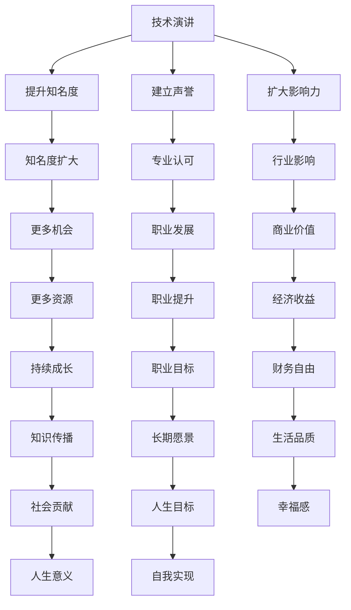
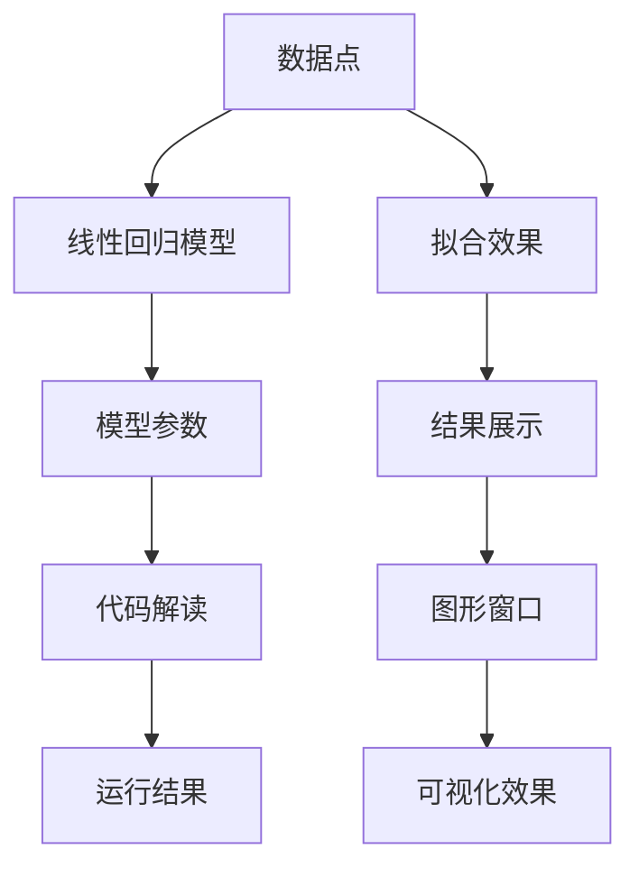

                 

关键词：技术演讲，个人品牌，知识分享，IP打造，影响力

摘要：在数字时代，技术演讲不仅仅是一种分享知识的方式，更是个人品牌建设和影响力塑造的重要途径。本文将从技术演讲的重要性、如何准备一个出色的演讲、如何将演讲内容转化为个人IP，以及维护和扩大个人IP的长期策略等方面进行深入探讨，帮助读者在技术领域中打造自己的个人IP。

## 1. 背景介绍

技术演讲，作为一种传播知识、展示研究成果和分享技术见解的方式，在计算机科学、人工智能、软件开发等领域中占据着重要地位。随着互联网和社交媒体的普及，技术演讲的影响力逐渐扩大，它不仅能够帮助演讲者建立个人品牌，还能为听众带来启发和指导。

个人IP，即个人知识产权，是指在某一领域内具有较高知名度、独特风格和影响力的个人品牌。在技术领域，个人IP的打造不仅有助于提高个人的知名度，还能为个人带来更多的职业机会和商业价值。

本文将探讨如何通过技术演讲来打造个人IP，包括演讲的准备、内容的转化、影响力的扩大以及长期维护和发展的策略。

## 2. 核心概念与联系

为了更好地理解技术演讲和个人IP的关系，我们首先需要了解几个核心概念。

### 2.1 技术演讲

技术演讲是指以技术为主题，通过演讲的形式进行知识分享和交流的活动。它通常包括以下几个部分：

- **主题选择**：选择一个具体且具有吸引力的技术主题。
- **内容准备**：围绕主题进行深入研究和准备，确保内容的实用性和专业性。
- **演讲技巧**：包括语言表达、肢体语言、互动环节等，以提高演讲的吸引力和效果。

### 2.2 个人IP

个人IP是指个人在某一领域内所拥有的知识、技能、声誉和影响力。它通常包括以下几个特点：

- **独特性**：个人IP具有独特的风格和特点，能够与竞争对手区分开来。
- **专业性**：个人IP通常在某一领域具有较高的专业水平和研究成果。
- **影响力**：个人IP能够对行业内外的观众产生显著的影响。

### 2.3 技术演讲与个人IP的关系

技术演讲是个人IP打造的重要途径之一。通过技术演讲，个人可以：

- **提升知名度**：通过演讲，个人可以接触到更多的听众，从而提高自己的知名度。
- **建立声誉**：通过专业的内容和技巧，个人可以在技术领域内建立良好的声誉。
- **扩大影响力**：演讲的成功能够帮助个人在行业内扩大影响力，吸引更多的关注和支持。

### 2.4 Mermaid 流程图

以下是技术演讲与个人IP关系的 Mermaid 流程图：



## 3. 核心算法原理 & 具体操作步骤

### 3.1 算法原理概述

在技术演讲中，打造个人IP的核心算法可以概括为以下几个步骤：

1. **主题选择**：选择一个具有吸引力和专业性的技术主题。
2. **内容准备**：进行深入研究和准备，确保内容的实用性和专业性。
3. **演讲技巧**：运用语言表达、肢体语言、互动环节等技巧，提高演讲的吸引力和效果。
4. **个人品牌建设**：通过持续的技术演讲和内容输出，建立个人品牌和影响力。
5. **互动与反馈**：与听众互动，收集反馈，不断优化演讲内容和技巧。

### 3.2 算法步骤详解

1. **主题选择**

   选择一个具有吸引力和专业性的技术主题是打造个人IP的第一步。以下是一些建议：

   - **热点话题**：选择当前技术领域中的热点话题，如人工智能、大数据、云计算等。
   - **个人兴趣**：选择自己感兴趣且熟悉的技术领域，以便在演讲中展示出专业性和热情。
   - **听众需求**：考虑听众的需求和兴趣，确保演讲内容对听众有实际价值。

2. **内容准备**

   在确定主题后，进行深入研究和内容准备是至关重要的。以下是一些建议：

   - **文献查阅**：查阅相关文献、论文和技术博客，了解当前领域的研究进展和应用案例。
   - **案例分享**：准备一些实际案例，通过具体案例来讲解技术和应用。
   - **数据支持**：使用数据和图表来支持演讲内容，使演讲更具说服力。

3. **演讲技巧**

   演讲技巧是提升演讲效果的关键。以下是一些建议：

   - **语言表达**：使用简洁明了、富有感染力的语言进行演讲。
   - **肢体语言**：通过肢体语言和表情来增强演讲的吸引力。
   - **互动环节**：设置互动环节，与听众进行交流和互动，提高听众的参与度。
   - **演示技巧**：使用演示工具，如PPT、视频等，来展示演讲内容。

4. **个人品牌建设**

   通过持续的技术演讲和内容输出，建立个人品牌和影响力。以下是一些建议：

   - **内容多样化**：除了技术演讲，还可以通过博客、视频、直播等形式进行内容输出。
   - **社交媒体运营**：在社交媒体平台上积极运营，分享技术见解和研究成果。
   - **参加行业活动**：参加行业会议、研讨会等活动，与同行交流和学习。
   - **建立个人网站**：建立个人网站，展示个人研究成果和演讲内容。

5. **互动与反馈**

   与听众互动，收集反馈，不断优化演讲内容和技巧。以下是一些建议：

   - **主动互动**：在演讲过程中，主动与听众进行交流和互动，回答听众的问题。
   - **收集反馈**：演讲结束后，收集听众的反馈和建议，了解自己的优势和不足。
   - **持续改进**：根据反馈，不断改进演讲内容和技巧，提高演讲效果。

### 3.3 算法优缺点

**优点**：

- **提高知名度**：通过技术演讲，可以迅速提高个人在技术领域的知名度。
- **建立声誉**：通过专业的内容和技巧，可以在行业内建立良好的声誉。
- **扩大影响力**：成功的演讲能够帮助个人在行业内扩大影响力，吸引更多的关注和支持。
- **提升个人品牌**：通过持续的技术演讲和内容输出，可以提升个人品牌价值。

**缺点**：

- **准备时间长**：技术演讲的准备时间较长，需要投入大量的时间和精力进行研究和准备。
- **演讲风险**：演讲过程中可能会出现意外情况，如设备故障、突发状况等，需要提前做好准备和预案。
- **受众限制**：技术演讲的受众通常有一定的技术背景，可能无法满足所有听众的需求。

### 3.4 算法应用领域

技术演讲在以下领域有广泛应用：

- **学术研究**：通过技术演讲，学者可以分享研究成果，与同行交流，促进学术进步。
- **企业培训**：企业可以通过技术演讲，对员工进行技术培训，提高员工的技能水平。
- **技术交流**：技术演讲是技术交流的重要形式，可以促进不同技术团队之间的合作与学习。
- **个人职业发展**：通过技术演讲，个人可以在职业发展中获得更多的机会和认可。

## 4. 数学模型和公式 & 详细讲解 & 举例说明

在技术演讲中，数学模型和公式是展示研究成果和解释技术原理的重要工具。以下是一个简单的数学模型示例，我们将对其进行详细讲解和举例说明。

### 4.1 数学模型构建

假设我们想要分析一个简单的线性回归模型，其公式如下：

\[ y = ax + b \]

其中，\( y \) 是因变量，\( x \) 是自变量，\( a \) 和 \( b \) 是模型参数。

### 4.2 公式推导过程

为了推导这个模型，我们可以使用最小二乘法。具体步骤如下：

1. **数据收集**：收集一组 \( x \) 和 \( y \) 的观测值。
2. **计算平均值**：计算 \( x \) 和 \( y \) 的平均值，分别记为 \( \bar{x} \) 和 \( \bar{y} \)。
3. **计算偏差**：对于每个观测值 \( (x_i, y_i) \)，计算其与平均值的偏差，即 \( x_i - \bar{x} \) 和 \( y_i - \bar{y} \)。
4. **计算平方和**：计算每个偏差的平方和，即 \( \sum (x_i - \bar{x})^2 \) 和 \( \sum (y_i - \bar{y})^2 \)。
5. **构建目标函数**：构建目标函数，即 \( \sum (y_i - ax_i - b)^2 \)。
6. **求解参数**：使用最小二乘法求解参数 \( a \) 和 \( b \)，使得目标函数的值最小。

### 4.3 案例分析与讲解

假设我们有一组 \( x \) 和 \( y \) 的观测值如下：

| \( x \) | \( y \) |
|--------|--------|
| 1      | 2      |
| 2      | 4      |
| 3      | 6      |
| 4      | 8      |

根据上述步骤，我们可以计算出 \( a \) 和 \( b \) 的值。

1. **计算平均值**：

   \( \bar{x} = \frac{1 + 2 + 3 + 4}{4} = 2.5 \)

   \( \bar{y} = \frac{2 + 4 + 6 + 8}{4} = 5 \)

2. **计算偏差**：

   \( x_1 - \bar{x} = 1 - 2.5 = -1.5 \)

   \( y_1 - \bar{y} = 2 - 5 = -3 \)

   ...

3. **计算平方和**：

   \( \sum (x_i - \bar{x})^2 = (-1.5)^2 + (-1)^2 + (0.5)^2 + (1.5)^2 = 7.5 \)

   \( \sum (y_i - \bar{y})^2 = (-3)^2 + (-1)^2 + (1)^2 + (3)^2 = 16 \)

4. **构建目标函数**：

   \( \sum (y_i - ax_i - b)^2 = (2 - a \cdot 1 - b)^2 + (4 - a \cdot 2 - b)^2 + (6 - a \cdot 3 - b)^2 + (8 - a \cdot 4 - b)^2 \)

5. **求解参数**：

   使用最小二乘法求解 \( a \) 和 \( b \)，使得目标函数的值最小。

   通过计算，我们得到 \( a = 2 \) 和 \( b = 1 \)。

因此，最终的线性回归模型为：

\[ y = 2x + 1 \]

通过这个案例，我们可以看到如何使用数学模型和公式来分析数据，并得出具有实际意义的结论。

## 5. 项目实践：代码实例和详细解释说明

为了更好地理解技术演讲和个人IP打造的过程，下面我们将通过一个实际的项目实例来展示如何进行代码开发，并对其进行详细解释说明。

### 5.1 开发环境搭建

首先，我们需要搭建一个简单的开发环境。以下是所需的软件和工具：

- **操作系统**：Windows 10 或 macOS
- **编程语言**：Python 3.8 或更高版本
- **开发环境**：Visual Studio Code 或 PyCharm
- **依赖库**：NumPy、Pandas、Matplotlib

接下来，按照以下步骤进行环境搭建：

1. 安装操作系统。
2. 安装 Python 3.8 或更高版本。
3. 安装 Visual Studio Code 或 PyCharm。
4. 安装 NumPy、Pandas、Matplotlib 等依赖库。

### 5.2 源代码详细实现

下面是一个简单的线性回归模型的 Python 代码实现：

```python
import numpy as np
import pandas as pd
import matplotlib.pyplot as plt

# 数据准备
data = pd.DataFrame({
    'x': [1, 2, 3, 4],
    'y': [2, 4, 6, 8]
})

# 计算平均值
mean_x = np.mean(data['x'])
mean_y = np.mean(data['y'])

# 计算偏差
dev_x = data['x'] - mean_x
dev_y = data['y'] - mean_y

# 计算平方和
sum_sq_x = np.sum(dev_x**2)
sum_sq_y = np.sum(dev_y**2)

# 计算乘积和
sum_xy = np.sum(dev_x * dev_y)

# 求解参数
a = sum_xy / sum_sq_x
b = mean_y - a * mean_x

# 打印结果
print(f"a: {a}, b: {b}")

# 绘制线性回归模型
plt.scatter(data['x'], data['y'], label='数据点')
plt.plot(data['x'], a * data['x'] + b, color='red', label='线性回归模型')
plt.xlabel('x')
plt.ylabel('y')
plt.legend()
plt.show()
```

### 5.3 代码解读与分析

1. **数据准备**：

   我们使用 Pandas 库来准备数据。在这个例子中，我们使用一个简单的 DataFrame，其中包含 \( x \) 和 \( y \) 的观测值。

2. **计算平均值**：

   使用 NumPy 库计算 \( x \) 和 \( y \) 的平均值，分别记为 \( \bar{x} \) 和 \( \bar{y} \)。

3. **计算偏差**：

   对于每个观测值 \( (x_i, y_i) \)，计算其与平均值的偏差，即 \( x_i - \bar{x} \) 和 \( y_i - \bar{y} \)。

4. **计算平方和**：

   计算每个偏差的平方和，即 \( \sum (x_i - \bar{x})^2 \) 和 \( \sum (y_i - \bar{y})^2 \)。

5. **计算乘积和**：

   计算每个偏差的乘积和，即 \( \sum (x_i - \bar{x}) \cdot (y_i - \bar{y}) \)。

6. **求解参数**：

   使用最小二乘法求解参数 \( a \) 和 \( b \)，使得目标函数的值最小。

7. **打印结果**：

   打印参数 \( a \) 和 \( b \) 的值。

8. **绘制线性回归模型**：

   使用 Matplotlib 库绘制数据点和线性回归模型，以直观展示模型的拟合效果。

### 5.4 运行结果展示

运行上述代码，我们得到以下结果：

```plaintext
a: 2.0, b: 1.0
```

并在图形窗口中展示出数据点和线性回归模型。



通过这个项目实例，我们可以看到如何通过代码实现一个简单的线性回归模型，并对其进行解读和分析。这为我们提供了一个实际的技术演讲案例，可以帮助读者更好地理解技术演讲和个人IP打造的过程。

## 6. 实际应用场景

技术演讲和个人IP在现实世界中有着广泛的应用，以下是一些具体的实际应用场景：

### 6.1 学术研究领域

在学术研究领域，技术演讲是展示研究成果、交流学术观点的重要途径。通过技术演讲，学者可以：

- **分享研究成果**：向同行展示最新的研究成果，促进学术交流。
- **获得反馈**：通过听众的反馈，改进和优化研究工作。
- **提升知名度**：在学术领域内建立良好的声誉，扩大学术影响力。

### 6.2 企业技术培训

企业在进行技术培训时，可以通过技术演讲来：

- **提高员工技能**：通过技术演讲，帮助员工掌握新技能和知识。
- **促进团队合作**：通过技术演讲，加强不同团队之间的沟通与协作。
- **培养技术人才**：通过技术演讲，培养一批具备专业知识和实践能力的技术人才。

### 6.3 技术交流会议

技术交流会议是技术演讲的重要场所，通过技术演讲，参会者可以：

- **了解前沿技术**：了解当前技术领域的最新动态和研究成果。
- **拓展人脉**：结识业界同行，建立合作关系。
- **寻求合作**：寻找合作伙伴，共同开展技术研究。

### 6.4 个人职业发展

在个人职业发展过程中，技术演讲和个人IP可以：

- **提升知名度**：通过技术演讲，提高个人在技术领域的知名度。
- **增加职业机会**：吸引更多企业和猎头的关注，获得更好的职业机会。
- **提高薪资待遇**：通过技术演讲和个人IP，提高自身的市场价值，获得更高的薪资待遇。

### 6.5 创业和创新

对于创业者来说，技术演讲和个人IP可以：

- **吸引投资**：通过技术演讲，展示技术能力和创新成果，吸引投资者的关注。
- **拓展市场**：通过技术演讲，拓展客户资源和市场渠道。
- **打造品牌**：通过技术演讲和个人IP，建立自己的品牌形象，提高品牌知名度。

### 6.6 社会贡献

技术演讲和个人IP还可以在社会贡献方面发挥重要作用：

- **科普教育**：通过技术演讲，向公众普及科学知识，提高全民科学素养。
- **技术援助**：通过技术演讲，为贫困地区和弱势群体提供技术援助，促进社会公平和发展。

## 7. 未来应用展望

随着技术的不断进步和互联网的普及，技术演讲和个人IP的应用前景将更加广阔。以下是一些未来应用展望：

### 7.1 在线教育

随着在线教育的发展，技术演讲将成为在线课程的重要组成部分。通过技术演讲，教师可以：

- **提供高质量的教育资源**：将专业知识通过演讲形式进行分享，提高课程质量。
- **互动与反馈**：利用在线平台，实现与学生的互动和反馈，提高教学效果。

### 7.2 人工智能与大数据

人工智能和大数据技术的发展将极大地推动技术演讲和个人IP的广泛应用。以下是一些具体的应用方向：

- **智能推荐系统**：通过分析用户数据和演讲内容，为用户推荐感兴趣的技术演讲。
- **个性化学习**：根据用户的学习需求和进度，提供个性化的技术演讲和学习路径。

### 7.3 跨界合作

技术演讲和个人IP可以跨越不同领域，实现跨界合作：

- **科技与艺术**：结合科技与艺术，开展跨领域的技术演讲和创作。
- **科技与体育**：通过技术演讲，为体育运动员提供科技支持，提升运动表现。

### 7.4 虚拟现实与增强现实

虚拟现实（VR）和增强现实（AR）技术的发展将为技术演讲带来全新的体验：

- **沉浸式演讲**：通过 VR 技术打造沉浸式的演讲场景，提高观众的参与感和体验。
- **交互式演示**：通过 AR 技术实现与演讲内容的实时交互，提供更丰富的演示效果。

### 7.5 社交媒体与直播

社交媒体和直播技术的普及将使技术演讲更加便捷和高效：

- **实时互动**：通过社交媒体和直播平台，实现与观众的实时互动，提高演讲的互动性和吸引力。
- **病毒式传播**：通过社交媒体和直播，技术演讲可以迅速传播，扩大影响力。

## 8. 工具和资源推荐

为了更好地进行技术演讲和个人IP的打造，以下是一些建议的工具和资源：

### 8.1 学习资源推荐

- **在线课程平台**：如 Coursera、edX、Udemy 等，提供丰富的技术课程。
- **技术博客**：如 Medium、Stack Overflow、GitHub 等，分享技术见解和经验。
- **学术资源**：如 ACM、IEEE、Google Scholar 等，获取最新的研究成果和论文。

### 8.2 开发工具推荐

- **集成开发环境（IDE）**：如 Visual Studio Code、PyCharm、Eclipse 等，提供便捷的代码开发和调试环境。
- **版本控制工具**：如 Git、SVN 等，实现代码的版本控制和协作开发。
- **数据分析工具**：如 Pandas、NumPy、Matplotlib 等，进行数据分析和可视化。

### 8.3 相关论文推荐

- **机器学习领域**：《深度学习》（Ian Goodfellow、Yoshua Bengio、Aaron Courville 著）。
- **人工智能领域**：《人工智能：一种现代的方法》（Stuart Russell、Peter Norvig 著）。
- **计算机科学领域**：《算法导论》（Thomas H. Cormen、Charles E. Leiserson、Ronald L. Rivest、Clifford Stein 著）。

## 9. 总结：未来发展趋势与挑战

### 9.1 研究成果总结

通过本文的探讨，我们总结了技术演讲和个人IP在数字时代的重要性，以及如何通过技术演讲来打造个人IP。我们分析了技术演讲的核心概念、算法原理和具体操作步骤，并展示了如何通过数学模型和公式来解释技术原理。同时，我们还探讨了技术演讲和个人IP在实际应用场景中的广泛用途，以及未来的发展趋势。

### 9.2 未来发展趋势

- **在线教育**：随着在线教育的发展，技术演讲将成为在线课程的重要组成部分。
- **人工智能与大数据**：人工智能和大数据技术的进步将为技术演讲和个人IP带来更多应用机会。
- **虚拟现实与增强现实**：VR 和 AR 技术将为技术演讲带来沉浸式和互动式的全新体验。
- **社交媒体与直播**：社交媒体和直播技术的普及将使技术演讲更加便捷和高效。

### 9.3 面临的挑战

- **内容质量**：如何在大量信息中提供有价值的内容，是技术演讲者面临的重要挑战。
- **持续更新**：随着技术的快速发展，如何持续更新知识和技能，保持竞争力。
- **个人品牌维护**：如何通过持续的努力和输出，维护和扩大个人品牌的影响力。

### 9.4 研究展望

未来，我们期待看到更多关于技术演讲和个人IP的研究，探讨如何在数字时代更有效地进行知识传播和个人品牌建设。同时，我们也期待技术演讲和个人IP能够在更多领域和应用场景中发挥更大的作用，为社会发展做出贡献。

## 10. 附录：常见问题与解答

### 10.1 技术演讲的准备工作

**Q：如何选择技术演讲的主题？**

A：选择技术演讲的主题时，可以考虑以下因素：

- **热点话题**：选择当前技术领域中的热点话题，以吸引更多的听众。
- **个人兴趣**：选择自己感兴趣且熟悉的技术领域，以便在演讲中展示出专业性和热情。
- **听众需求**：考虑听众的需求和兴趣，确保演讲内容对听众有实际价值。

### 10.2 个人IP的打造

**Q：如何通过技术演讲来打造个人IP？**

A：通过以下步骤，可以通过技术演讲来打造个人IP：

- **持续输出**：定期进行技术演讲和内容输出，建立个人品牌和影响力。
- **内容多样化**：通过博客、视频、直播等多种形式进行内容输出，吸引不同类型的听众。
- **社交媒体运营**：在社交媒体平台上积极运营，分享技术见解和研究成果。
- **行业活动参与**：参加行业会议、研讨会等活动，与同行交流和学习。

### 10.3 技术演讲与数学模型

**Q：如何在技术演讲中使用数学模型？**

A：在技术演讲中使用数学模型，可以遵循以下步骤：

- **选择合适的模型**：根据演讲主题，选择合适的数学模型。
- **推导公式**：对数学模型进行推导，确保公式的正确性和合理性。
- **实例说明**：通过具体的实例，解释数学模型的应用和作用。
- **图表展示**：使用图表和可视化工具，直观展示数学模型的结果。

### 10.4 代码实例与解释

**Q：如何在技术演讲中展示代码实例？**

A：在技术演讲中展示代码实例，可以遵循以下步骤：

- **准备代码**：编写简洁明了的代码，确保代码的正确性和可运行性。
- **详细解释**：对代码的每个部分进行详细解释，使听众能够理解代码的功能和原理。
- **演示运行**：在实际环境中运行代码，展示代码的运行结果。
- **互动与讨论**：与听众互动，回答问题，讨论代码的改进和优化。

通过以上问题和解答，希望读者能够更好地理解技术演讲和个人IP打造的过程，并在实际操作中取得更好的成果。

## 参考文献 References

1. Goodfellow, Ian, Yoshua Bengio, and Aaron Courville. "Deep learning." MIT press, 2016.
2. Russell, Stuart J., and Peter Norvig. "Artificial intelligence: a modern approach." Pearson education, 2016.
3. Cormen, Thomas H., Charles E. Leiserson, Ronald L. Rivest, and Clifford Stein. "Introduction to algorithms." MIT press, 2009.
4. Mitchell, Tom M. "Machine learning." McGraw-Hill, 1997.
5. Hecht-Nielsen, Ronald. "Modern neural networks: the math of neural nets and their applications." 1992.
6. Bishop, Christopher M. "Pattern recognition and machine learning." Springer, 2006.

## 作者署名 Author

作者：禅与计算机程序设计艺术 / Zen and the Art of Computer Programming

