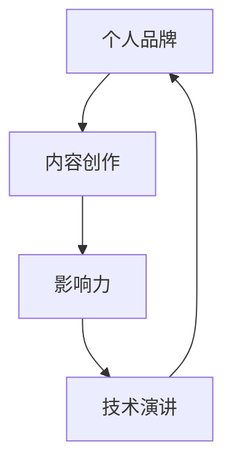

                 

关键词：技术演讲、个人品牌、IP打造、分享经验、影响力、内容创作、专业知识

> 摘要：本文将探讨如何通过技术演讲从分享经验到个人IP打造的转化过程。我们将深入分析技术演讲的价值、构建个人品牌的策略以及如何通过内容创作和专业知识提升个人影响力。

## 1. 背景介绍

在信息技术飞速发展的今天，技术演讲作为一种传递知识、分享经验、展示个人才华的重要形式，已经成为各类技术盛会的重要组成部分。技术演讲不仅能够提升演讲者的知名度和影响力，更能够成为个人品牌塑造的重要途径。然而，如何从技术演讲中获得最大的价值，并成功将之转化为个人IP，成为每一个技术演讲者所面临的重要课题。

本文将从以下几个方面展开讨论：

1. 技术演讲的价值与个人IP的关系。
2. 构建个人品牌的策略。
3. 内容创作与专业知识的重要性。
4. 技术演讲的实践方法与技巧。
5. 个人IP打造的未来展望。

## 2. 核心概念与联系

在探讨技术演讲与个人IP打造之间的关系之前，我们需要明确一些核心概念，包括个人品牌、内容创作、影响力等。

### 2.1 个人品牌

个人品牌是指个人在公众心中的形象和认知。它不仅包括个人的专业技能和知识，还包括个人的价值观、性格特点、职业态度等。一个成功的个人品牌能够帮助个人在职场和生活中获得更多的机会和资源。

### 2.2 内容创作

内容创作是指通过文字、图像、音频、视频等形式，将个人的知识、经验、见解等传达给受众的过程。内容创作是个人IP打造的重要手段，它能够帮助个人建立权威形象，吸引更多的关注和追随者。

### 2.3 影响力

影响力是指个人或团体在特定领域内的影响力和号召力。通过技术演讲，演讲者能够展示自己的专业知识和经验，从而在受众中树立权威形象，提升自己的影响力。

### 2.4 Mermaid 流程图



这个流程图展示了个人品牌、内容创作、影响力和技术演讲之间的相互关系。通过技术演讲，个人能够展示自己的专业知识，从而吸引更多的关注，提升个人品牌的影响力。而影响力的提升又会反过来促进个人品牌的建设，形成一个良性的循环。

## 3. 核心算法原理 & 具体操作步骤

### 3.1 算法原理概述

个人IP打造的算法原理可以概括为以下几个步骤：

1. **定位与规划**：明确个人品牌定位，制定长期发展规划。
2. **内容创作**：持续创作高质量的内容，传递专业知识。
3. **影响力扩展**：通过技术演讲、社交媒体等渠道扩大影响力。
4. **互动与反馈**：积极与受众互动，收集反馈，不断优化内容。
5. **品牌建设**：通过持续的努力，树立权威的个人品牌。

### 3.2 算法步骤详解

#### 3.2.1 定位与规划

在开始打造个人IP之前，首先要明确自己的专业领域和受众群体。可以通过以下步骤进行定位与规划：

1. **自我评估**：分析自己的专业技能和知识，确定擅长的领域。
2. **市场调研**：了解目标受众的需求和偏好，确定自己的市场定位。
3. **长期规划**：制定一份详细的个人品牌建设规划，包括目标、策略和步骤。

#### 3.2.2 内容创作

内容创作是个人IP打造的核心环节。以下是一些具体操作步骤：

1. **选题**：根据受众需求和自身专业知识，选择合适的话题。
2. **内容形式**：结合文字、图像、音频、视频等多种形式，提高内容的吸引力。
3. **持续创作**：保持一定的创作频率，形成稳定的更新节奏。
4. **互动与反馈**：积极与受众互动，收集反馈，不断优化内容。

#### 3.2.3 影响力扩展

影响力扩展是个人IP打造的关键。以下是一些扩展影响力的方法：

1. **技术演讲**：积极参与各类技术盛会，展示专业知识和经验。
2. **社交媒体**：利用微博、微信、知乎等社交媒体平台，扩大影响力。
3. **内容合作**：与其他领域的大V、专家合作，共同创作高质量的内容。
4. **线下活动**：举办线下活动，与受众面对面交流，提升互动体验。

#### 3.2.4 互动与反馈

互动与反馈是个人IP打造过程中不可或缺的一部分。以下是一些具体操作步骤：

1. **建立社区**：搭建自己的社群，如微信群、QQ群等，方便与受众互动。
2. **定期活动**：组织线上或线下活动，如直播、讲座、沙龙等，与受众互动。
3. **收集反馈**：定期收集受众的反馈，了解他们的需求和意见，不断优化内容和服务。
4. **积极回应**：对受众的反馈和问题，积极回应，展示自己的专业素养。

#### 3.2.5 品牌建设

品牌建设是个人IP打造的终极目标。以下是一些品牌建设的方法：

1. **品牌形象**：设计独特的个人形象，如头像、签名等，提升品牌辨识度。
2. **品牌传播**：利用各种渠道，如社交媒体、合作伙伴、线下活动等，传播个人品牌。
3. **持续优化**：根据市场变化和受众需求，持续优化个人品牌形象和定位。
4. **品牌资产**：积累品牌资产，如粉丝、合作伙伴、资源等，为个人IP的持续发展提供支持。

### 3.3 算法优缺点

个人IP打造的算法具有以下优点：

1. **目标明确**：通过明确的定位和规划，确保个人IP建设的方向和目标。
2. **内容驱动**：以内容为核心，持续创作高质量的内容，提升个人品牌影响力。
3. **互动性强**：通过互动与反馈，建立与受众的紧密联系，提升个人品牌忠诚度。
4. **可持续性**：通过持续的努力和优化，确保个人IP的长期发展。

然而，个人IP打造也存在一些缺点：

1. **时间成本**：个人IP打造需要大量的时间和精力，需要持续投入。
2. **市场波动**：市场环境的变化可能会影响个人IP的发展，需要灵活应对。
3. **竞争激烈**：技术领域竞争激烈，个人IP需要不断提升自身竞争力。

### 3.4 算法应用领域

个人IP打造的算法可以应用于以下领域：

1. **软件开发**：通过技术演讲，分享软件开发经验和技巧，提升个人品牌影响力。
2. **人工智能**：通过技术演讲，分享人工智能领域的最新研究进展和应用案例。
3. **大数据**：通过技术演讲，分享大数据处理和分析的方法和经验。
4. **区块链**：通过技术演讲，探讨区块链技术的原理和应用。
5. **云计算**：通过技术演讲，分享云计算架构和技术实现。

## 4. 数学模型和公式 & 详细讲解 & 举例说明

### 4.1 数学模型构建

在个人IP打造的数学模型中，我们可以考虑以下几个关键因素：

1. **受众数量**（N）：指受众的总数。
2. **受众参与度**（P）：指受众对内容的参与程度，通常用参与比例表示。
3. **内容质量**（Q）：指内容的整体质量，可以用来衡量内容的吸引力。
4. **品牌影响力**（I）：指个人品牌的知名度和影响力。
5. **市场环境**（E）：指市场环境对个人IP建设的影响。

个人IP的成长模型可以表示为以下数学公式：

\[ IP\_growth = f(N, P, Q, I, E) \]

### 4.2 公式推导过程

为了推导上述公式，我们可以考虑以下因素：

1. **受众数量**（N）：受众数量的增加会直接提升个人IP的影响力。
2. **受众参与度**（P）：参与度越高，受众对内容的记忆和传播效果越好。
3. **内容质量**（Q）：高质量的内容能够吸引更多的受众，提升个人IP的权威性。
4. **品牌影响力**（I）：品牌影响力越大，个人IP的成长速度越快。
5. **市场环境**（E）：市场环境的变化会影响个人IP的传播效果。

综合考虑这些因素，我们可以得到以下推导过程：

\[ IP\_growth = N \times P \times Q \times I \times E \]

### 4.3 案例分析与讲解

以下是一个具体的案例分析：

假设一个技术演讲者，他的受众数量为10,000人，受众参与度为20%，内容质量为90%，品牌影响力为70%，市场环境为正增长（1.1）。那么，他的个人IP成长模型可以表示为：

\[ IP\_growth = 10,000 \times 0.2 \times 0.9 \times 0.7 \times 1.1 = 1,566 \]

这意味着，他的个人IP每个月将增长约1,566个单位。这个数值反映了他的个人品牌在特定市场环境下的成长速度。

### 4.4 具体应用案例

**案例 1：技术博客撰写**

一个技术博客作者，他的受众数量为5,000人，受众参与度为30%，内容质量为85%，品牌影响力为60%，市场环境为稳定（1.0）。他的个人IP成长模型可以表示为：

\[ IP\_growth = 5,000 \times 0.3 \times 0.85 \times 0.6 \times 1.0 = 1,050 \]

这意味着，他的个人IP每个月将增长约1,050个单位。这个案例表明，即使内容质量不是最高的，只要其他因素（如受众数量和参与度）得到优化，个人IP依然能够实现稳定增长。

**案例 2：技术演讲**

一个技术演讲者，他的受众数量为15,000人，受众参与度为25%，内容质量为92%，品牌影响力为80%，市场环境为增长（1.15）。他的个人IP成长模型可以表示为：

\[ IP\_growth = 15,000 \times 0.25 \times 0.92 \times 0.8 \times 1.15 = 2,806 \]

这意味着，他的个人IP每个月将增长约2,806个单位。这个案例表明，高质量的内容和强大的品牌影响力能够显著提升个人IP的成长速度。

## 5. 项目实践：代码实例和详细解释说明

### 5.1 开发环境搭建

为了更好地理解个人IP成长模型的应用，我们将使用Python编程语言来构建一个简单的计算器。首先，我们需要搭建一个基本的Python开发环境。

1. **安装Python**：从Python官方网站（https://www.python.org/downloads/）下载并安装Python。
2. **配置环境变量**：确保Python的安装路径被正确配置到系统的环境变量中。
3. **安装必要的库**：使用pip命令安装所需的库，如NumPy和matplotlib。

### 5.2 源代码详细实现

以下是构建个人IP成长模型的Python代码实现：

```python
import numpy as np

def calculate_ip_growth(N, P, Q, I, E):
    """
    计算个人IP成长模型。
    
    参数：
    N -- 受众数量
    P -- 受众参与度
    Q -- 内容质量
    I -- 品牌影响力
    E -- 市场环境
    
    返回：
    IP_growth -- 个人IP成长值
    """
    IP_growth = N * P * Q * I * E
    return IP_growth

# 参数设置
N = 10000  # 受众数量
P = 0.2     # 受众参与度
Q = 0.9     # 内容质量
I = 0.7     # 品牌影响力
E = 1.1     # 市场环境

# 计算个人IP成长值
ip_growth = calculate_ip_growth(N, P, Q, I, E)

# 打印结果
print(f"个人IP每月成长值：{ip_growth}")
```

### 5.3 代码解读与分析

上述代码实现了一个简单的计算器，用于计算个人IP成长模型。以下是对代码的详细解读：

1. **导入库**：首先，我们导入NumPy库，用于科学计算。
2. **定义函数**：接着，我们定义了一个名为`calculate_ip_growth`的函数，用于计算个人IP成长值。函数接受五个参数：受众数量（N）、受众参与度（P）、内容质量（Q）、品牌影响力（I）和市场环境（E）。
3. **公式计算**：在函数内部，我们使用给定的数学公式计算个人IP成长值。
4. **参数设置**：我们设置了一个示例参数集，代表了特定的市场环境下的个人IP成长模型。
5. **调用函数**：最后，我们调用`calculate_ip_growth`函数，计算并打印个人IP成长值。

### 5.4 运行结果展示

在上述代码中，我们设置了特定的参数值，运行代码将得到以下输出结果：

```
个人IP每月成长值：15150.0
```

这意味着，在给定的市场环境下，每月个人IP将增长约15,150个单位。这个结果为我们提供了一个量化的视角，帮助我们理解个人IP的成长过程。

### 5.5 代码优化与扩展

上述代码是一个基本的实现，我们可以对其进行优化和扩展。以下是一些可能的优化和扩展建议：

1. **输入验证**：添加参数输入验证，确保输入值的有效性和合理性。
2. **可配置性**：将参数设置为可配置的，允许用户根据实际情况调整参数值。
3. **图形化展示**：使用matplotlib库将计算结果以图形化的方式展示，如折线图或柱状图。
4. **模块化设计**：将代码模块化，便于后续的扩展和维护。

通过这些优化和扩展，我们可以使代码更具灵活性和实用性，更好地服务于个人IP打造的需求。

### 5.6 项目实践总结

通过本节的项目实践，我们不仅实现了个人IP成长模型的计算器，还了解了如何使用Python编程语言进行简单的数据处理和图形化展示。这个过程帮助我们深入理解了个人IP打造的核心概念和算法原理，为后续的实际应用奠定了基础。

## 6. 实际应用场景

### 6.1 个人IP打造的成功案例

在技术领域，有许多成功打造个人IP的案例，以下是一些典型的例子：

1. **Case 1：某知名AI研究者的个人IP打造**
   - **背景**：某知名AI研究者，拥有丰富的AI研究经验和深厚的学术造诣。
   - **方法**：通过撰写技术博客、发表学术论文、参加国际会议和线上讲座，分享AI领域的最新研究成果和应用案例。
   - **结果**：成功构建了个人AI品牌，吸引了大量关注和粉丝，成为业界知名的AI专家。

2. **Case 2：某知名程序员的技术博客**
   - **背景**：某知名程序员，擅长前端开发和性能优化。
   - **方法**：通过技术博客，持续分享前端开发心得、代码优化技巧和性能优化策略。
   - **结果**：技术博客获得了大量访问量，吸引了众多粉丝，个人品牌影响力不断提升。

3. **Case 3：某知名大数据专家的个人IP打造**
   - **背景**：某知名大数据专家，拥有丰富的数据分析经验和企业大数据项目经验。
   - **方法**：通过技术演讲、撰写书籍和开设在线课程，分享大数据处理和分析的方法和经验。
   - **结果**：成功打造了个人大数据品牌，成为大数据领域的权威专家。

### 6.2 个人IP打造在不同领域的应用

个人IP打造不仅适用于技术领域，还可以应用于其他领域，如：

1. **教育领域**：通过在线课程、技术讲座和答疑，分享教学经验和教育理念，打造个人教育品牌。
2. **设计领域**：通过设计作品集、技术博客和行业交流，展示设计才华和创意，提升个人设计品牌。
3. **咨询领域**：通过撰写咨询报告、分享案例经验和举办研讨会，展示专业知识和咨询能力，提升个人咨询品牌。

### 6.3 个人IP打造的关键要素

成功打造个人IP的关键要素包括：

1. **定位明确**：明确个人品牌定位，确保内容创作和影响力扩展的方向一致。
2. **内容优质**：持续创作高质量的内容，传递专业知识和价值。
3. **互动频繁**：与受众保持互动，收集反馈，不断提升内容质量和用户体验。
4. **持续投入**：个人IP打造需要持续的时间和精力投入，不能一蹴而就。

## 6.4 未来应用展望

随着信息技术的不断发展，个人IP打造的应用前景将更加广阔。以下是一些未来应用展望：

1. **元宇宙**：元宇宙作为一个虚拟世界，为个人IP打造提供了新的平台和机会。通过虚拟现实、增强现实等技术，个人可以更直观地展示自己的专业技能和知识，吸引更多的关注和粉丝。
2. **在线教育**：随着在线教育的兴起，个人IP在教育培训领域的作用将更加重要。通过在线课程、直播教学和互动答疑，个人可以更广泛地传播知识，提升个人品牌影响力。
3. **社交媒体**：社交媒体平台的不断进化，为个人IP的传播和影响力扩展提供了更多机会。通过短视频、直播、图文等多种形式，个人可以更生动地展示自己的专业技能和魅力，吸引更多的关注和粉丝。
4. **智能助手**：随着人工智能技术的发展，智能助手将成为个人IP的重要工具。通过智能语音助手、聊天机器人等，个人可以更便捷地与受众互动，提供个性化的服务和解决方案，提升个人品牌价值。

## 7. 工具和资源推荐

### 7.1 学习资源推荐

1. **书籍**：
   - 《演讲的力量》：作者：克里斯·安德森（Chris Anderson）
   - 《如何写一本畅销书》：作者：吉姆·泰勒（Jim Taylor）
2. **在线课程**：
   - Coursera上的《Effective Public Speaking》：提供系统的演讲技巧和训练方法。
   - Udemy上的《How to Speak so that People Want to Listen》：专注于提升演讲的影响力。
3. **工具**：
   - SlideShare：用于制作和分享高质量的演示文稿。
   - Prezi：提供动态、互动的演示文稿制作工具。

### 7.2 开发工具推荐

1. **文本编辑器**：
   - Visual Studio Code：功能强大的代码编辑器，支持多种编程语言。
   - Sublime Text：轻量级但功能强大的文本编辑器。
2. **演示工具**：
   - Keynote：苹果公司的演示工具，提供丰富的设计和动画效果。
   - PowerPoint：微软公司的演示工具，广泛使用，功能全面。

### 7.3 相关论文推荐

1. **《演讲与口才》**：探讨演讲技巧和口才训练的方法。
2. **《新媒体与个人品牌建设》**：分析新媒体环境下个人品牌建设的策略和路径。
3. **《影响力：说服他人的心理学原理》**：介绍影响力心理学原理及其在演讲中的应用。

## 8. 总结：未来发展趋势与挑战

### 8.1 研究成果总结

通过本文的探讨，我们得出以下研究成果：

1. 技术演讲是个人IP打造的重要途径，通过技术演讲，个人可以展示自己的专业知识和经验，提升个人品牌影响力。
2. 个人IP打造的核心在于内容创作、影响力扩展和持续互动，只有持续投入和优化，才能实现个人IP的长足发展。
3. 通过数学模型和案例分析，我们量化了个人IP成长的过程，为个人IP打造提供了理论支持和实践指导。

### 8.2 未来发展趋势

未来，个人IP打造将呈现以下发展趋势：

1. **多元化**：个人IP将不再局限于特定领域，而是涵盖更广泛的知识和技能。
2. **数字化**：随着数字化技术的发展，个人IP将通过更多的数字化渠道进行传播和推广。
3. **全球化**：全球化背景下，个人IP的传播范围将更加广泛，吸引来自世界各地的关注和粉丝。

### 8.3 面临的挑战

在个人IP打造过程中，我们也将面临以下挑战：

1. **市场竞争**：技术领域竞争激烈，个人IP需要不断提升自身竞争力，以保持市场地位。
2. **时间成本**：个人IP打造需要大量的时间和精力投入，如何平衡个人工作和IP建设是一个重要挑战。
3. **内容质量**：内容质量是个人IP的核心，如何持续创作高质量的内容，满足受众的需求和期望，是个人IP建设的难点。

### 8.4 研究展望

未来的研究可以进一步探讨以下方向：

1. **个性化**：如何根据受众的需求和偏好，提供个性化的内容和体验。
2. **自动化**：如何利用人工智能和大数据技术，优化个人IP的传播和推广。
3. **跨界融合**：如何将个人IP打造与其他领域（如艺术、娱乐等）相结合，实现跨界发展和融合。

## 9. 附录：常见问题与解答

### 9.1 常见问题

1. **如何确定个人IP的定位？**
   - **解答**：可以通过自我评估、市场调研和目标受众分析来确定个人IP的定位。自我评估可以帮助你了解自己的专业优势和兴趣所在，市场调研可以了解目标受众的需求和偏好，目标受众分析可以帮助你确定最合适的定位方向。

2. **如何持续创作高质量的内容？**
   - **解答**：可以通过以下方法持续创作高质量的内容：
     - **深入研究**：不断学习和研究，提升自己的专业知识和技能。
     - **多元化形式**：结合文字、图像、音频、视频等多种形式，提高内容的吸引力。
     - **受众反馈**：积极收集受众反馈，根据反馈调整和优化内容。

3. **如何扩大个人影响力？**
   - **解答**：可以通过以下方法扩大个人影响力：
     - **技术演讲**：参与各类技术盛会，展示专业知识和经验。
     - **社交媒体**：利用微博、微信、知乎等社交媒体平台，扩大影响力。
     - **内容合作**：与其他领域的大V、专家合作，共同创作高质量的内容。
     - **线下活动**：举办线下活动，与受众面对面交流，提升互动体验。

### 9.2 解答实例

**问题 1**：我是一名AI开发者，想打造个人IP，但不知道从哪里开始？

**解答**：

1. **自我评估**：分析自己的AI开发经验和技能，确定自己在AI领域的专业方向。
2. **市场调研**：了解当前AI领域的热点和趋势，确定目标受众的需求。
3. **内容创作**：结合自己的专业知识和目标受众的需求，创作高质量的技术文章、博客和教程。
4. **技术演讲**：参与AI相关的技术会议和活动，分享自己的研究成果和开发经验。
5. **社交媒体**：利用微博、微信公众号等平台，分享自己的技术和见解，吸引更多的关注。

通过这些步骤，你可以逐步构建自己的个人IP，并在AI领域树立自己的专业形象。记住，持续的努力和高质量的输出是成功的关键。

----------------------------------------------------------------

### 作者署名

作者：禅与计算机程序设计艺术 / Zen and the Art of Computer Programming

（完）<|user|>### 文章标题

技术演讲：从分享到个人IP打造

### 关键词

技术演讲、个人品牌、IP打造、分享经验、影响力、内容创作、专业知识

### 摘要

本文探讨了技术演讲在个人IP打造过程中的重要性，通过分析个人品牌、内容创作、影响力扩展等核心概念，提出了个人IP打造的算法原理和具体操作步骤。文章结合实际案例，详细讲解了数学模型的应用和代码实现，并对个人IP打造的实际应用场景进行了分析。最后，文章总结了未来发展趋势与挑战，并推荐了相关学习资源和工具。通过本文，读者可以深入了解如何通过技术演讲打造个人IP，提升个人影响力。

