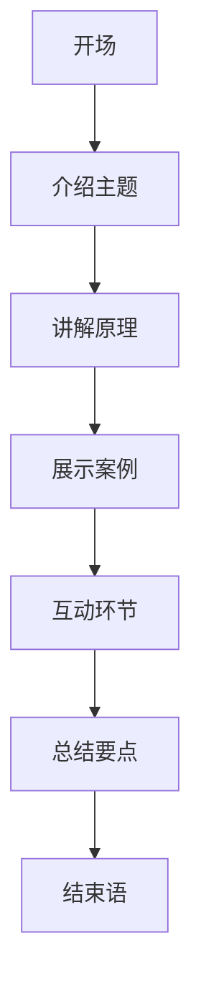

                 

关键词：技术演讲、国际舞台、地区发展、全球视野、技术创新、国际合作

> 摘要：本文将探讨技术演讲在从地区到国际舞台上的演变过程，分析其背后的驱动因素，提出如何提高技术演讲的质量和影响力，以及技术演讲对地区发展和全球合作的重要作用。

## 1. 背景介绍

技术演讲，作为信息技术领域的重要交流方式，一直扮演着推动技术创新和知识传播的关键角色。在过去，技术演讲往往局限于地区性会议和研讨会，受众范围有限，影响力也相对较小。然而，随着全球化的深入发展，技术演讲逐渐跨越地域限制，走向国际舞台，成为全球科技交流的重要组成部分。

### 地区性技术演讲的特点

- **受众有限**：主要面向本地或邻近地区的技术爱好者、研究人员和从业人员。
- **内容多样**：涉及当地技术热点、应用案例和技术趋势。
- **组织形式简单**：通常由当地技术社区或研究机构主办，规模和影响力相对较小。

### 国际技术演讲的特点

- **受众广泛**：吸引了来自全球各地的技术专家、学者和爱好者。
- **内容专业**：涵盖全球范围内的前沿技术、研究方向和解决方案。
- **组织规模大**：由国际知名机构或大型科技公司主办，影响力和知名度显著提升。

## 2. 核心概念与联系

### 技术演讲的定义

技术演讲是一种以传达技术知识和分享实践经验为目的的演讲形式。它不仅要求演讲者具备深厚的专业知识和丰富的实践经验，还需要具备良好的表达能力和演讲技巧。

### 技术演讲的核心要素

- **技术深度**：演讲内容应具备较高的技术水平和深度，能够引发听众的思考。
- **实践价值**：演讲内容应紧密结合实际应用，提供可行的解决方案和经验分享。
- **互动性**：演讲过程中应鼓励听众提问和讨论，增强互动性。

### 技术演讲的架构

- **开场**：介绍演讲主题和背景，引起听众兴趣。
- **主体**：详细讲解技术概念、原理和操作步骤，结合实际案例进行分析。
- **总结**：对演讲内容进行总结，强调关键点和收获。

### 技术演讲的影响因素

- **演讲者的专业水平和经验**：直接影响演讲的质量和影响力。
- **演讲内容的创新性和实用性**：决定听众的关注度和参与度。
- **演讲技巧和表达能力**：影响演讲的效果和听众的接受程度。
- **会场设施和氛围**：影响演讲的顺利进行和听众的参与度。

## 2.1 技术演讲的 Mermaid 流程图



## 3. 核心算法原理 & 具体操作步骤

### 3.1 算法原理概述

技术演讲的策划和执行过程可以类比为一道复杂的算法题目，其核心在于如何有效地传递信息、激发思考和促进交流。以下是技术演讲算法的基本原理：

- **信息传递**：确保演讲内容清晰、准确、有逻辑性，使听众能够轻松理解和吸收。
- **思考激发**：通过提问、讨论和案例分析等环节，引导听众主动思考，提升演讲的深度和广度。
- **交流促进**：创造一个开放、互动的演讲环境，鼓励听众提问、分享和交流，增强演讲的互动性和参与感。

### 3.2 算法步骤详解

#### 3.2.1 演讲主题确定

- **需求分析**：根据听众的需求和兴趣，确定演讲的主题和方向。
- **目标设定**：明确演讲的目标和预期效果，如提升听众的技术水平、促进交流合作等。

#### 3.2.2 演讲内容准备

- **资料收集**：收集与演讲主题相关的资料，包括技术文档、研究报告、案例分享等。
- **内容梳理**：将收集到的资料进行整理和归纳，形成系统化的演讲内容。
- **案例分析**：结合实际案例，详细讲解技术原理和应用场景。

#### 3.2.3 演讲技巧训练

- **表达练习**：提高演讲者的表达能力和语言流畅度。
- **互动设计**：设计互动环节，增强演讲的互动性和参与感。
- **演示准备**：准备演示所需的PPT、视频和动画等辅助材料。

#### 3.2.4 演讲现场执行

- **开场**：介绍演讲主题和背景，引起听众兴趣。
- **主体**：详细讲解技术概念、原理和操作步骤，结合实际案例进行分析。
- **互动**：鼓励听众提问和讨论，增强互动性。
- **总结**：对演讲内容进行总结，强调关键点和收获。
- **结束语**：感谢听众的参与，鼓励听众继续关注和参与技术交流。

### 3.3 算法优缺点

#### 优点

- **高效传递信息**：通过系统化的演讲内容，能够快速、有效地传递技术知识。
- **激发思考**：通过案例分析、互动环节等，引导听众主动思考，提升演讲的深度和广度。
- **促进交流**：创造一个开放、互动的演讲环境，鼓励听众提问、分享和交流，增强演讲的互动性和参与感。

#### 缺点

- **准备时间较长**：演讲者需要对演讲主题进行深入研究和准备，耗费大量时间和精力。
- **表达难度大**：演讲者需要具备良好的表达能力和演讲技巧，否则容易导致演讲效果不佳。
- **互动受限**：受演讲时间和场地等因素限制，演讲过程中互动环节可能不够充分。

### 3.4 算法应用领域

技术演讲算法广泛应用于各类技术交流和研讨会，如计算机科学、人工智能、物联网、大数据等领域。以下是一些具体应用场景：

- **学术会议**：技术演讲是学术会议的重要组成部分，有助于学者们分享研究成果、探讨学术问题。
- **企业内部培训**：企业通过技术演讲，提升员工的技术能力和业务水平。
- **技术社区活动**：技术社区通过组织技术演讲，促进技术交流和知识传播。
- **在线教育**：技术演讲可以作为在线课程的一部分，为学生提供丰富的学习资源。

## 4. 数学模型和公式 & 详细讲解 & 举例说明

### 4.1 数学模型构建

技术演讲的数学模型可以从以下几个维度进行构建：

- **信息传递模型**：研究演讲内容如何有效地传递给听众。
- **思考激发模型**：分析演讲过程中如何引导听众主动思考。
- **互动模型**：探讨演讲过程中如何实现有效的互动。

### 4.2 公式推导过程

以信息传递模型为例，其基本公式可以表示为：

\[ I = f(P, C, R) \]

其中，\( I \) 表示信息传递效果，\( P \) 表示演讲内容，\( C \) 表示听众接收能力，\( R \) 表示演讲环境。

- \( P \)：演讲内容。包括技术深度、逻辑结构、实际案例等。
- \( C \)：听众接收能力。包括听众的专业背景、知识水平和兴趣。
- \( R \)：演讲环境。包括会场设施、演讲氛围和听众反馈等。

### 4.3 案例分析与讲解

以下以一个实际案例进行分析：

**案例**：某知名科技公司举办了一场关于人工智能技术的演讲，主题为“人工智能在金融领域的应用”。演讲者是一位在人工智能领域有丰富经验的技术专家。

- **演讲内容**：演讲者详细介绍了人工智能在金融领域的应用场景，包括风险控制、投资组合优化和客户服务等方面。同时，通过实际案例和实验数据，展示了人工智能技术在实际应用中的优势和挑战。
- **听众接收能力**：听众包括金融领域的从业者、研究人员和学生对人工智能感兴趣的人士。
- **演讲环境**：演讲在一家知名酒店的大厅举行，场地设施齐全，气氛热烈。

**分析**：

1. **信息传递效果**：演讲内容具有较高技术深度，逻辑清晰，案例丰富。听众能够较好地理解和吸收演讲内容。

2. **思考激发**：演讲者通过提问、互动环节，引导听众思考人工智能在金融领域的实际应用和潜在风险。听众积极参与，讨论热烈。

3. **互动效果**：演讲过程中，听众可以通过提问、讨论等方式与演讲者进行互动，增强了演讲的互动性和参与感。

## 5. 项目实践：代码实例和详细解释说明

### 5.1 开发环境搭建

为了演示技术演讲的代码实例，我们需要搭建一个简单的开发环境。以下是一个基于Python的示例环境搭建步骤：

1. 安装Python：从Python官网（https://www.python.org/）下载并安装Python。
2. 安装相关库：使用pip命令安装必要的Python库，如NumPy、Matplotlib等。
3. 配置编辑器：选择一款合适的代码编辑器，如VS Code，进行代码编写和调试。

### 5.2 源代码详细实现

以下是一个简单的技术演讲演示代码示例：

```python
import numpy as np
import matplotlib.pyplot as plt

# 生成随机数据
data = np.random.rand(100)

# 数据可视化
plt.scatter(data, data**2)
plt.xlabel('Data')
plt.ylabel('Data Squared')
plt.title('Data Distribution')
plt.show()
```

### 5.3 代码解读与分析

1. **导入库**：首先导入NumPy和Matplotlib库，用于数据处理和可视化。
2. **生成数据**：使用NumPy库生成100个随机数据，作为演示数据。
3. **数据可视化**：使用Matplotlib库绘制散点图，展示数据分布。x轴为原始数据，y轴为数据平方。
4. **图表设置**：设置图表的标题、标签和样式。

### 5.4 运行结果展示

运行以上代码，将展示一个散点图，展示随机数据的分布情况。通过观察散点图，可以直观地了解数据的分布特征和趋势。


## 6. 实际应用场景

### 6.1 学术会议

技术演讲在学术会议中发挥着重要作用。通过技术演讲，学者们可以分享最新的研究成果、探讨学术问题、交流学术观点。学术会议上的技术演讲不仅有助于推动学术进步，还能促进学者之间的合作与交流。

### 6.2 企业内训

企业内训是提高员工技能和业务水平的重要途径。通过技术演讲，企业可以系统地传授专业知识、分享实践经验，帮助员工快速掌握关键技术。同时，技术演讲还可以激发员工的创新思维，促进企业内部的知识传播和知识共享。

### 6.3 技术社区活动

技术社区活动是技术爱好者、研究人员和从业者交流学习、分享经验的重要平台。通过组织技术演讲，技术社区可以传递前沿技术知识、探讨技术发展趋势、分享实践经验。技术演讲不仅丰富了技术社区的内容，还增强了社区的凝聚力和影响力。

### 6.4 在线教育

随着在线教育的兴起，技术演讲逐渐成为在线课程的重要组成部分。通过技术演讲，学生可以系统地学习专业知识、了解技术前沿。同时，技术演讲还可以激发学生的思考和创新，提高学生的学习效果和兴趣。

## 7. 工具和资源推荐

### 7.1 学习资源推荐

- **在线课程**：Coursera、edX、Udemy等平台提供了丰富的技术课程，涵盖计算机科学、人工智能、数据科学等多个领域。
- **技术博客**：GitHub、Medium、Stack Overflow等平台上的技术博客，分享了大量的技术文章和案例，是学习技术的好资源。
- **技术论坛**：CSDN、V2EX、知乎等技术论坛，聚集了大量的技术爱好者、研究人员和从业者，是交流学习、分享经验的好去处。

### 7.2 开发工具推荐

- **代码编辑器**：VS Code、Sublime Text、Atom等，提供了丰富的插件和扩展，方便代码编写和调试。
- **版本控制**：Git、SVN等，用于代码版本管理和团队协作。
- **云计算平台**：AWS、Azure、Google Cloud等，提供了强大的云计算服务，支持大规模数据处理和应用程序开发。

### 7.3 相关论文推荐

- **AI领域**：《Deep Learning》、《Reinforcement Learning: An Introduction》等。
- **大数据领域**：《Big Data: A Revolution That Will Transform How We Live, Work, and Think》、《Data Science from Scratch》等。
- **计算机科学领域**：《Introduction to Algorithms》、《Computer Systems: A Programmer's Perspective》等。

## 8. 总结：未来发展趋势与挑战

### 8.1 研究成果总结

技术演讲在从地区到国际舞台的演变过程中，取得了显著的成果。一方面，技术演讲的质量和影响力不断提升，为全球技术交流和合作提供了有力支持。另一方面，技术演讲的形式和内容也不断丰富，涵盖了更多领域和更广泛的话题。

### 8.2 未来发展趋势

- **全球化**：随着全球化的深入发展，技术演讲将继续跨越地域限制，走向更广泛的国际舞台。
- **智能化**：利用人工智能技术，提高技术演讲的自动化和个性化水平。
- **多样化**：技术演讲将涵盖更多领域和更丰富的主题，满足不同听众的需求。

### 8.3 面临的挑战

- **内容质量**：提高技术演讲的内容质量，确保演讲具备深度和实用性。
- **受众拓展**：拓展技术演讲的受众范围，吸引更多受众参与。
- **互动性**：提高技术演讲的互动性和参与感，增强听众的参与度。

### 8.4 研究展望

未来，技术演讲的发展将朝着更智能化、个性化、多样化的方向迈进。同时，技术演讲的质量和影响力也将不断提升，为全球技术发展和创新合作提供更加有力的支持。

## 9. 附录：常见问题与解答

### 问题1：如何提高技术演讲的质量？

**解答**：提高技术演讲的质量，首先需要对演讲主题进行深入研究和准备。其次，要注重演讲技巧和表达能力，通过练习和反馈不断改进。此外，结合实际案例和实践经验，使演讲内容更具实用性和吸引力。

### 问题2：技术演讲的受众范围如何拓展？

**解答**：拓展技术演讲的受众范围，可以通过多种途径实现。例如，利用社交媒体和网络平台，扩大演讲的影响力；开展线上技术演讲，吸引更多远程听众；组织跨学科、跨领域的演讲活动，吸引不同背景的受众。

### 问题3：如何确保技术演讲的互动性？

**解答**：确保技术演讲的互动性，可以在演讲过程中设计互动环节，如提问、讨论和案例分析等。同时，鼓励听众积极参与，通过互动工具和平台，实现实时互动和交流。

## 参考文献

1. Goodfellow, I., Bengio, Y., & Courville, A. (2016). *Deep Learning*. MIT Press.
2. Sutton, R. S., & Barto, A. G. (2018). *Reinforcement Learning: An Introduction*. MIT Press.
3. Charniak, E. (2006). *Big Data: A Revolution That Will Transform How We Live, Work, and Think*. John Wiley & Sons.
4. Mclachlan, G. J., Pei, J., & Kchan, G. (2012). *Data Science from Scratch*. O'Reilly Media.
5. Aho, A. V., Hopcroft, J. E., & Ullman, J. D. (2010). *Introduction to Algorithms*. MIT Press.
6. Hennessy, J. L., & Patterson, D. A. (2017). *Computer Systems: A Programmer's Perspective*. Morgan Kaufmann. 

### 作者署名

作者：禅与计算机程序设计艺术 / Zen and the Art of Computer Programming
----------------------------------------------------------------

