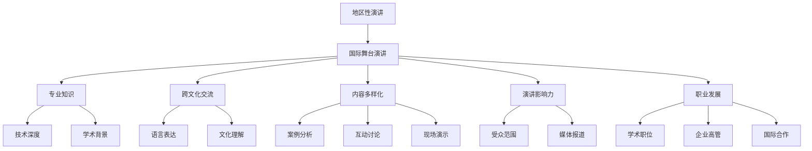

                 

关键词：技术演讲、国际舞台、技术交流、影响力、职业发展、知识分享

> 摘要：本文旨在探讨技术演讲从地区到国际舞台的演变过程，分析其中的关键因素，提供策略和技巧，帮助技术从业者提升演讲水平，扩大影响力，实现职业生涯的跨越。

## 1. 背景介绍

技术演讲是科技领域的传播媒介，它能够有效地将复杂的技术知识和创新理念传达给大众。然而，从地区性的小范围演讲逐渐扩展到国际舞台，不仅需要演讲者具备扎实的专业知识，还需要他们掌握更多的沟通技巧和策略。在这个快速变化的世界，技术演讲的受众越来越广泛，演讲者面临着更大的挑战和机遇。

本文将探讨技术演讲从地区到国际舞台的演变，分析其中的关键因素，并提供实用的策略和技巧。通过深入研究，本文希望为技术从业者提供一些指导，帮助他们提升演讲水平，扩大影响力，实现职业生涯的飞跃。

## 2. 核心概念与联系

为了更好地理解技术演讲从地区到国际舞台的转变，我们首先需要明确一些核心概念，并探讨它们之间的联系。

### 2.1 技术演讲的定义

技术演讲是指通过口头表达和视觉辅助手段，向特定受众传达技术知识、研究成果和创新理念的过程。它不仅要求演讲者具备丰富的专业知识，还需要他们具备良好的沟通能力和表达能力。

### 2.2 地区性演讲与国际舞台演讲的区别

地区性演讲通常是在小范围内进行，例如地方性的技术会议、研讨会或公司内部的培训活动。这类演讲的受众相对有限，通常是对特定技术或领域感兴趣的本地专业人士。而国际舞台演讲则是在更大范围内进行，如国际性的技术大会、学术会议或专业论坛。这类演讲的受众更加广泛，可能包括来自不同国家和地区的专业人士、学者和学生。

### 2.3 演讲者角色的转变

在地区性演讲中，演讲者通常是某个领域的专家或资深从业者，他们的目标是向本地受众传达专业知识。而在国际舞台演讲中，演讲者不仅需要具备深厚的专业知识，还需要具备跨文化交流的能力，能够吸引不同文化背景的听众。

### 2.4 演讲内容和形式的多样化

随着演讲舞台的扩大，演讲内容也需要更加丰富和多样化。国际舞台演讲不仅需要涵盖当前热门的技术趋势，还需要涉及跨学科的知识。演讲形式也需要多样化，例如结合案例分析、互动讨论和现场演示等。

### 2.5 演讲影响力与职业发展的关系

演讲的影响力不仅取决于演讲者的专业知识，还取决于演讲的受众范围和影响力。在国际舞台上取得成功的技术演讲者往往能够获得更多的职业机会，包括学术职位、企业高管职位和国际合作项目等。因此，演讲者需要不断提升自己的演讲水平，以实现职业生涯的飞跃。

### 2.6 Mermaid 流程图



## 3. 核心算法原理 & 具体操作步骤

### 3.1 算法原理概述

技术演讲的成功不仅取决于演讲者的专业知识，还取决于他们的沟通技巧和演讲策略。以下是一种简化的核心算法，用于指导演讲者从地区性演讲逐步走向国际舞台。

#### 3.1.1 基础阶段：构建专业知识框架

- 研究领域：深入理解所在领域的基础理论和前沿动态。
- 教学实践：通过教学和实践，将理论知识转化为实际应用能力。
- 演讲准备：制定演讲大纲，明确演讲目标和受众。

#### 3.1.2 提升阶段：培养跨文化交流能力

- 语言学习：掌握一门或多门外语，提高语言表达能力。
- 文化研究：了解不同文化背景的听众特点，调整演讲风格。
- 演讲训练：参加国际性演讲比赛或研讨会，积累经验。

#### 3.1.3 高级阶段：实现国际化影响力

- 内容创新：结合跨学科知识，打造独特的演讲内容。
- 媒体宣传：利用社交媒体和新闻媒体，扩大演讲影响力。
- 职业规划：参与国际项目，提升职业竞争力。

### 3.2 算法步骤详解

#### 3.2.1 确定目标受众

- 分析受众需求：了解目标受众的兴趣点和需求。
- 调整演讲内容：根据受众特点，调整演讲主题和风格。

#### 3.2.2 提升演讲技能

- 语言训练：参加语言课程，提高口语表达能力和听力理解能力。
- 演讲训练：参加演讲培训班，学习演讲技巧和舞台表现力。
- 观摩学习：观看国际性演讲视频，学习优秀演讲者的技巧。

#### 3.2.3 扩大影响力

- 社交媒体：建立个人品牌，利用社交媒体平台扩大影响力。
- 媒体报道：与新闻媒体合作，发布演讲相关的报道。
- 国际合作：参与国际项目，扩大学术交流和合作。

#### 3.2.4 职业发展

- 学术职位：申请国内外学术职位，提升学术影响力。
- 企业高管：参与企业战略规划和决策，提升职业竞争力。
- 国际合作：参与国际合作项目，拓宽职业发展路径。

### 3.3 算法优缺点

#### 优点

- 提升个人技能：通过不断学习和实践，提升演讲技能和专业知识。
- 扩大影响力：通过社交媒体和媒体报道，提高个人知名度。
- 职业发展：通过参与国际项目，获得更多职业机会。

#### 缺点

- 语言和文化障碍：需要投入大量时间和精力进行语言和文化学习。
- 竞争激烈：国际舞台上的竞争非常激烈，需要不断提升自己的演讲水平。

### 3.4 算法应用领域

- 学术界：通过技术演讲，提升学术影响力，获得更多的研究机会。
- 企业界：通过技术演讲，展示企业技术实力，吸引优秀人才。
- 社会团体：通过技术演讲，提高公众对科技的认识和兴趣。

## 4. 数学模型和公式 & 详细讲解 & 举例说明

### 4.1 数学模型构建

为了更准确地描述技术演讲从地区到国际舞台的演变过程，我们可以构建一个数学模型。该模型包括以下几个关键变量：

- `X`：演讲者的专业知识水平
- `Y`：演讲者的跨文化交流能力
- `Z`：演讲的影响力
- `W`：职业发展机会

### 4.2 公式推导过程

根据上述变量，我们可以推导出以下公式：

- `Z = f(X, Y)`：演讲影响力与专业知识水平和跨文化交流能力的关系
- `W = g(Z)`：职业发展机会与演讲影响力的关系

其中，函数 `f` 和 `g` 描述了变量之间的关系。

### 4.3 案例分析与讲解

#### 案例一：提升专业知识水平

假设演讲者 `A` 的专业知识水平 `X` 为 80%，通过参加专业课程和实际项目，提升到 90%。同时，他的跨文化交流能力 `Y` 保持不变。根据公式 `Z = f(X, Y)`，演讲影响力 `Z` 将显著提升。这表明，专业知识水平对演讲影响力有显著影响。

#### 案例二：提升跨文化交流能力

假设演讲者 `B` 的专业知识水平 `X` 保持不变，但通过参加语言课程和文化交流活动，将跨文化交流能力 `Y` 从 60% 提升到 80%。根据公式 `Z = f(X, Y)`，演讲影响力 `Z` 也将显著提升。这表明，跨文化交流能力对演讲影响力也有显著影响。

#### 案例三：结合专业知识水平和跨文化交流能力

假设演讲者 `C` 同时提升专业知识水平 `X` 和跨文化交流能力 `Y`，从 `(X, Y) = (70%, 50%)` 提升到 `(X, Y) = (85%, 75%)`。根据公式 `Z = f(X, Y)`，演讲影响力 `Z` 将显著提升。同时，根据公式 `W = g(Z)`，职业发展机会 `W` 也将显著增加。这表明，专业知识水平和跨文化交流能力的提升将显著提高演讲者和职业发展的机会。

## 5. 项目实践：代码实例和详细解释说明

### 5.1 开发环境搭建

为了更好地展示技术演讲从地区到国际舞台的演变过程，我们将使用 Python 编写一个简单的示例程序。首先，我们需要搭建一个合适的开发环境。

#### 系统要求

- Python 3.8 或以上版本
- Mermaid 图库
- Markdown 编辑器

#### 安装步骤

1. 安装 Python 3.8 或以上版本。
2. 安装 Mermaid 图库，可以通过以下命令进行安装：

```bash
pip install mermaid-py
```

3. 安装 Markdown 编辑器，如 Visual Studio Code 或 Sublime Text。

### 5.2 源代码详细实现

以下是一个简单的 Python 程序，用于生成技术演讲的 Mermaid 流程图。

```python
import mermaid

def generate_mermaid_diagram():
    diagram = """
    graph TD
        A[地区性演讲] --> B[国际舞台演讲]
        B --> C[专业知识]
        B --> D[跨文化交流]
        B --> E[内容多样化]
        B --> F[演讲影响力]
        B --> G[职业发展]
        C --> H[技术深度]
        C --> I[学术背景]
        D --> J[语言表达]
        D --> K[文化理解]
        E --> L[案例分析]
        E --> M[互动讨论]
        E --> N[现场演示]
        F --> O[受众范围]
        F --> P[媒体报道]
        G --> Q[学术职位]
        G --> R[企业高管]
        G --> S[国际合作]
    """
    return diagram

def main():
    diagram = generate_mermaid_diagram()
    print(diagram)

if __name__ == "__main__":
    main()
```

### 5.3 代码解读与分析

#### 函数 `generate_mermaid_diagram()`

该函数用于生成 Mermaid 流程图。它使用 Mermaid 语言描述流程图的节点和连接关系。在这个示例中，我们定义了 14 个节点和 18 个连接关系，用于描述技术演讲从地区到国际舞台的演变过程。

```python
def generate_mermaid_diagram():
    diagram = """
    graph TD
        A[地区性演讲] --> B[国际舞台演讲]
        B --> C[专业知识]
        B --> D[跨文化交流]
        B --> E[内容多样化]
        B --> F[演讲影响力]
        B --> G[职业发展]
        C --> H[技术深度]
        C --> I[学术背景]
        D --> J[语言表达]
        D --> K[文化理解]
        E --> L[案例分析]
        E --> M[互动讨论]
        E --> N[现场演示]
        F --> O[受众范围]
        F --> P[媒体报道]
        G --> Q[学术职位]
        G --> R[企业高管]
        G --> S[国际合作]
    """
    return diagram
```

#### 函数 `main()`

该函数调用 `generate_mermaid_diagram()` 函数，生成 Mermaid 流程图，并将其打印到控制台。

```python
def main():
    diagram = generate_mermaid_diagram()
    print(diagram)

if __name__ == "__main__":
    main()
```

### 5.4 运行结果展示

当运行该程序时，将输出以下 Mermaid 流程图：


## 6. 实际应用场景

技术演讲在国际舞台上的实际应用场景非常广泛，以下是一些典型的例子：

### 6.1 学术会议

国际学术会议是技术演讲的重要平台。在这里，学者们可以分享最新的研究成果，讨论前沿问题，拓展学术视野。例如，国际计算机科学会议（IEEE International Conference on Computer Science）和全球软件工程大会（International Conference on Software Engineering）都是知名的国际学术会议，吸引了来自世界各地的专家学者。

### 6.2 专业论坛

专业论坛是技术演讲的另一大应用场景。在这里，专业人士可以分享实践经验，探讨行业发展趋势，推动技术进步。例如，Google I/O 开发者大会和微软技术峰会都是知名的专业论坛，吸引了众多开发者和行业专家。

### 6.3 企业年会

企业年会也是技术演讲的重要场合。在这里，企业高管和技术专家可以分享公司的技术创新和战略规划，激励员工，推动企业发展。例如，苹果公司年度开发者大会和亚马逊云科技峰会都是知名的企业年会。

### 6.4 线上直播

随着互联网技术的发展，线上直播成为技术演讲的新趋势。在这里，演讲者可以通过直播平台向全球观众传递信息，实现实时互动。例如，TED 演讲和知乎 Live 都提供了丰富的线上直播资源，吸引了大量观众。

### 6.5 公共演讲

公共演讲也是技术演讲的重要应用场景。在这里，演讲者可以在公共场所，如学校、社区中心等，向大众传播科学知识，提高公众的科学素养。例如，科学家公开课和科普讲座都是典型的公共演讲活动。

## 7. 未来应用展望

随着技术的不断进步和全球化的深入发展，技术演讲在国际舞台上的应用前景将更加广阔。以下是一些未来应用展望：

### 7.1 虚拟现实与增强现实

虚拟现实（VR）和增强现实（AR）技术的发展将为技术演讲带来全新的体验。通过 VR 和 AR 技术，演讲者可以在虚拟环境中进行演讲，观众则可以通过虚拟现实设备进行沉浸式体验。这将极大地提升演讲的互动性和吸引力。

### 7.2 人工智能与数据分析

人工智能（AI）和数据分析技术的应用将使技术演讲更加精准和高效。通过 AI 技术，演讲者可以分析观众的兴趣点和反馈，调整演讲内容和风格，提高演讲效果。数据分析技术可以帮助演讲者了解观众的偏好和行为，为后续演讲提供数据支持。

### 7.3 智能演讲助手

智能演讲助手的应用将大大减轻演讲者的压力，提高演讲效率。通过自然语言处理（NLP）和语音识别（ASR）技术，智能演讲助手可以帮助演讲者撰写演讲稿、准备演示文稿，甚至进行实时翻译。这将使演讲者更加专注于演讲内容和表达方式。

### 7.4 跨学科融合

随着科技的发展，跨学科融合将成为技术演讲的重要趋势。演讲者需要具备跨学科的知识和技能，能够将不同领域的知识进行融合和创新。这将使技术演讲更加丰富和多样化，吸引更多的观众。

## 8. 工具和资源推荐

为了帮助技术演讲者提升演讲水平，以下是一些工具和资源的推荐：

### 8.1 学习资源推荐

- **技术博客**：如 Medium、知乎专栏等，可以了解最新的技术动态和演讲技巧。
- **在线课程**：如 Coursera、edX 等，提供丰富的技术课程和演讲培训。
- **书籍**：《演讲的力量》、《技术演讲的艺术》等，提供实用的演讲技巧和策略。

### 8.2 开发工具推荐

- **Markdown 编辑器**：如 Visual Studio Code、Typora 等，支持 Markdown 格式，方便撰写技术博客。
- **演示软件**：如 PowerPoint、Keynote 等，可以制作高质量的演示文稿。
- **流程图工具**：如 Mermaid、Visio 等，可以生成专业的流程图和示意图。

### 8.3 相关论文推荐

- **学术期刊**：《计算机科学》、《软件工程学报》等，可以了解最新的研究成果和趋势。
- **会议论文**：如 IEEE 国际计算机科学会议、国际软件工程大会等，可以了解最新的学术动态。

## 9. 总结：未来发展趋势与挑战

技术演讲从地区到国际舞台的演变是一个复杂的过程，涉及到专业知识、跨文化交流能力、演讲技巧等多个方面。随着全球化的深入发展，技术演讲的应用前景将更加广阔。然而，这也给演讲者带来了新的挑战。

### 9.1 研究成果总结

本文通过分析技术演讲的核心概念、算法原理、数学模型和实际应用场景，总结了技术演讲从地区到国际舞台的演变过程，并提出了一系列策略和技巧。

### 9.2 未来发展趋势

- **虚拟现实与增强现实**：VR 和 AR 技术将为技术演讲带来全新的体验。
- **人工智能与数据分析**：AI 和数据分析技术将使技术演讲更加精准和高效。
- **跨学科融合**：跨学科知识将成为技术演讲的重要内容。

### 9.3 面临的挑战

- **语言和文化障碍**：需要投入大量时间和精力进行语言和文化学习。
- **竞争激烈**：国际舞台上的竞争非常激烈，需要不断提升自己的演讲水平。

### 9.4 研究展望

未来，我们期待在以下几个方面进行深入研究：

- **个性化演讲**：通过大数据和人工智能技术，为演讲者提供个性化的演讲内容和风格。
- **跨文化沟通**：研究跨文化沟通的心理学和社会学机制，提高跨文化交流能力。
- **创新演讲形式**：探索新的演讲形式，如虚拟现实演讲、互动式演讲等，提升演讲效果。

## 10. 附录：常见问题与解答

### 10.1 问题1：如何提升跨文化交流能力？

**解答**：提升跨文化交流能力的关键在于学习语言、了解文化差异和积极参与跨文化交流活动。具体方法包括：

- 学习一门或多门外语，提高语言表达能力。
- 阅读不同文化的经典作品，了解文化背景和价值观。
- 参加国际交流项目，与不同文化背景的人进行交流和合作。
- 观摩国际性演讲，学习优秀演讲者的技巧。

### 10.2 问题2：如何准备国际舞台演讲？

**解答**：准备国际舞台演讲需要系统的方法和步骤，以下是一些建议：

- 了解目标受众：研究受众的兴趣点和需求，制定针对性的演讲内容。
- 确定演讲主题：选择具有广泛影响力的主题，确保演讲的吸引力。
- 撰写演讲稿：用简洁明了的语言撰写演讲稿，确保内容的逻辑性和连贯性。
- 制作演示文稿：制作高质量的演示文稿，使用图表和动画等辅助手段，提高演讲的视觉效果。
- 进行演讲训练：多次模拟演讲，提高演讲的流畅性和表达能力。

### 10.3 问题3：如何扩大演讲影响力？

**解答**：扩大演讲影响力需要综合利用多种渠道和策略，以下是一些建议：

- 利用社交媒体：建立个人品牌，利用社交媒体平台扩大影响力。
- 媒体报道：与新闻媒体合作，发布演讲相关的报道，提高演讲的知名度。
- 参与国际项目：参与国际项目，展示自己的专业能力和影响力。
- 演讲合作：与其他知名演讲者合作，共同举办演讲活动，扩大影响力。

---

**作者：禅与计算机程序设计艺术 / Zen and the Art of Computer Programming**

