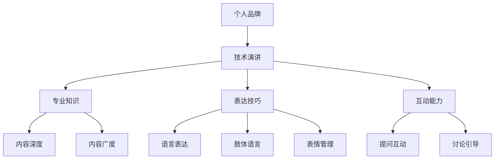

                 

关键词：个人品牌、影响力、技术演讲、专业发展、职业提升

> 摘要：在信息技术飞速发展的今天，个人品牌的价值愈发凸显。通过技术演讲，不仅可以展示专业技能，还能有效提升个人影响力。本文将探讨如何通过技术演讲来提升个人品牌价值，分享实战经验和策略。

## 1. 背景介绍

个人品牌，是指个人在专业领域内的声誉和影响力。随着社交媒体和在线平台的普及，个人品牌的重要性日益增加。技术演讲作为一种高效的展示方式，不仅能让专业人士展示自己的技术能力，还能在行业内建立权威形象，扩大影响力。

### 1.1 技术演讲的定义

技术演讲是指专业人士在某个技术领域内，通过讲解、演示等形式，与听众分享知识、经验和见解。这种形式的技术交流，有助于快速传播技术理念，促进技术创新。

### 1.2 个人品牌的重要性

在竞争激烈的职场环境中，个人品牌的价值不言而喻。一个强大的个人品牌，不仅能为个人带来更多的机会，还能提升职业地位，增加收入。

## 2. 核心概念与联系

### 2.1 技术演讲的三个核心要素

- **内容**：技术演讲的核心在于内容的深度和广度。一个优秀的演讲者需要具备扎实的专业知识，并能将其生动地呈现给听众。
- **表达**：表达是指演讲者在演讲过程中，如何将内容准确地传达给听众。这包括语言、肢体语言、表情等方面的技巧。
- **互动**：互动是指演讲者与听众之间的互动。通过提问、讨论等方式，可以有效提高演讲的吸引力和参与度。

### 2.2 个人品牌与技术演讲的联系

- **个人品牌提升**：通过技术演讲，可以展示个人的专业能力和技术见解，从而提升个人品牌价值。
- **影响力扩大**：技术演讲是一种高效的传播方式，可以帮助演讲者扩大在行业内的知名度，提高影响力。

### 2.3 Mermaid 流程图



## 3. 核心算法原理 & 具体操作步骤

### 3.1 算法原理概述

技术演讲的成功离不开以下几个关键步骤：

1. **选题**：选择一个具有吸引力和实际价值的话题。
2. **准备**：充分准备演讲内容，包括讲解、演示、案例等。
3. **演讲**：在演讲过程中，注重内容、表达和互动。
4. **反馈**：演讲结束后，收集听众反馈，进行总结和改进。

### 3.2 算法步骤详解

1. **选题**：
    - **需求分析**：了解目标听众的需求，选择一个具有吸引力和实际价值的话题。
    - **热点追踪**：关注行业热点，选择与当前趋势相关的话题。

2. **准备**：
    - **内容梳理**：将知识点进行系统化梳理，确保内容的逻辑性和连贯性。
    - **演示制作**：制作高质量的演示PPT，突出重点，提高视觉冲击力。
    - **案例准备**：准备相关的案例，以实际应用来支撑理论。

3. **演讲**：
    - **开场吸引**：通过引人入胜的开场白，吸引听众的注意力。
    - **内容传达**：运用专业的语言和表达技巧，将知识点传达给听众。
    - **互动引导**：通过提问、讨论等方式，引导听众参与，提高演讲的互动性。

4. **反馈**：
    - **听众反馈**：收集听众的反馈，了解演讲的优缺点。
    - **总结改进**：根据反馈进行总结和改进，为下一次演讲做好准备。

### 3.3 算法优缺点

1. **优点**：
    - **提升个人品牌**：通过技术演讲，可以展示个人的专业能力和技术见解，提升个人品牌价值。
    - **扩大影响力**：技术演讲是一种高效的传播方式，可以帮助演讲者扩大在行业内的知名度，提高影响力。

2. **缺点**：
    - **准备时间较长**：技术演讲需要充分准备，包括选题、内容梳理、演示制作等，需要耗费较长时间。
    - **演讲技巧要求高**：技术演讲不仅需要专业的知识，还需要具备一定的表达技巧和互动能力。

### 3.4 算法应用领域

技术演讲的应用领域非常广泛，包括但不限于以下几个方面：

1. **学术交流**：在学术会议上，通过技术演讲，可以展示研究成果，与同行进行交流。
2. **企业内训**：在企业内训中，通过技术演讲，可以提升员工的专业能力，促进团队协作。
3. **公开课程**：在公开课程中，通过技术演讲，可以传授专业知识，帮助学员提升技能。

## 4. 数学模型和公式 & 详细讲解 & 举例说明

### 4.1 数学模型构建

技术演讲的成功，离不开有效的信息传递。我们可以使用信息熵的概念来构建一个简单的数学模型，以衡量演讲的信息传递效率。

#### 信息熵

信息熵（Entropy）是衡量信息不确定性的一种度量。在技术演讲中，信息熵可以用来衡量演讲内容的复杂度和听众接收信息的效果。

信息熵的数学定义如下：

\[ H(X) = -\sum_{i} p(x_i) \log_2 p(x_i) \]

其中，\( X \) 是演讲内容，\( x_i \) 是演讲内容中的每个元素，\( p(x_i) \) 是 \( x_i \) 出现的概率。

#### 信息传递效率

信息传递效率可以用信息增益（Information Gain）来衡量。信息增益是指通过一个属性 \( A \) 来减少目标属性 \( B \) 的不确定性。

信息增益的数学定义如下：

\[ IG(A, B) = H(B) - H(B|A) \]

其中，\( H(B) \) 是目标属性 \( B \) 的信息熵，\( H(B|A) \) 是在已知属性 \( A \) 的情况下，目标属性 \( B \) 的条件信息熵。

### 4.2 公式推导过程

1. **信息熵的推导**：

假设我们有一个演讲内容集合 \( X = \{ x_1, x_2, ..., x_n \} \)，其中每个元素 \( x_i \) 的概率为 \( p(x_i) \)。

根据信息熵的定义，我们可以计算演讲内容 \( X \) 的信息熵：

\[ H(X) = -\sum_{i} p(x_i) \log_2 p(x_i) \]

2. **信息增益的推导**：

假设我们有一个属性集合 \( A = \{ a_1, a_2, ..., a_m \} \)，以及一个目标属性 \( B \)。

首先，我们计算目标属性 \( B \) 的信息熵 \( H(B) \)：

\[ H(B) = -\sum_{i} p(b_i) \log_2 p(b_i) \]

然后，我们计算在已知属性 \( A \) 的情况下，目标属性 \( B \) 的条件信息熵 \( H(B|A) \)：

\[ H(B|A) = -\sum_{i} \sum_{j} p(a_i, b_j) \log_2 p(a_i, b_j) \]

最后，我们计算信息增益 \( IG(A, B) \)：

\[ IG(A, B) = H(B) - H(B|A) \]

### 4.3 案例分析与讲解

假设我们有一个演讲内容集合 \( X \)，其中包含 5 个元素：\( \{ x_1, x_2, x_3, x_4, x_5 \} \)。每个元素出现的概率如下：

\[ p(x_1) = 0.2, p(x_2) = 0.3, p(x_3) = 0.1, p(x_4) = 0.2, p(x_5) = 0.2 \]

根据信息熵的公式，我们可以计算演讲内容 \( X \) 的信息熵：

\[ H(X) = -\sum_{i} p(x_i) \log_2 p(x_i) \]
\[ H(X) = -[0.2 \log_2 0.2 + 0.3 \log_2 0.3 + 0.1 \log_2 0.1 + 0.2 \log_2 0.2 + 0.2 \log_2 0.2] \]
\[ H(X) = 1.73 \]

现在，假设我们有一个属性集合 \( A \)，包含 2 个元素：\( \{ a_1, a_2 \} \)。每个元素出现的概率如下：

\[ p(a_1) = 0.6, p(a_2) = 0.4 \]

在已知属性 \( A \) 的情况下，目标属性 \( B \) 的条件概率如下：

\[ p(b_1|a_1) = 0.8, p(b_1|a_2) = 0.2 \]
\[ p(b_2|a_1) = 0.2, p(b_2|a_2) = 0.8 \]

根据条件信息熵的公式，我们可以计算在已知属性 \( A \) 的情况下，目标属性 \( B \) 的条件信息熵：

\[ H(B|A) = -\sum_{i} \sum_{j} p(a_i, b_j) \log_2 p(a_i, b_j) \]
\[ H(B|A) = -[0.6 \times 0.8 \log_2 0.6 \times 0.8 + 0.6 \times 0.2 \log_2 0.6 \times 0.2 + 0.4 \times 0.2 \log_2 0.4 \times 0.2 + 0.4 \times 0.8 \log_2 0.4 \times 0.8] \]
\[ H(B|A) = 1.09 \]

最后，我们可以计算信息增益 \( IG(A, B) \)：

\[ IG(A, B) = H(B) - H(B|A) \]
\[ IG(A, B) = 1.73 - 1.09 \]
\[ IG(A, B) = 0.64 \]

通过这个例子，我们可以看到，信息增益 \( IG(A, B) \) 反映了属性 \( A \) 对目标属性 \( B \) 的信息传递效率。信息增益越高，说明属性 \( A \) 对目标属性 \( B \) 的信息传递效果越好。

## 5. 项目实践：代码实例和详细解释说明

### 5.1 开发环境搭建

在进行技术演讲的准备过程中，选择合适的开发环境非常重要。以下是一个简单的示例，说明如何在 Windows 系统上搭建一个基础的 Python 开发环境。

#### 安装 Python

1. 访问 [Python 官网](https://www.python.org/) 下载最新版本的 Python。
2. 运行安装程序，选择默认选项进行安装。

#### 安装 PyCharm

1. 访问 [PyCharm 官网](https://www.jetbrains.com/pycharm/) 下载社区版。
2. 运行安装程序，选择默认选项进行安装。

#### 安装必要的库

1. 打开 PyCharm，创建一个新的 Python 项目。
2. 在终端中运行以下命令，安装必要的库：

```bash
pip install numpy matplotlib
```

### 5.2 源代码详细实现

以下是一个简单的 Python 代码示例，用于演示如何使用 Matplotlib 库绘制信息熵和信息增益的图表。

```python
import numpy as np
import matplotlib.pyplot as plt

# 信息熵计算函数
def entropy(p):
    return -sum(p * np.log2(p)) if not np.isclose(p, 0) else 0

# 信息增益计算函数
def information_gain(p_b, p_b_given_a):
    return entropy(p_b) - entropy(p_b_given_a)

# 示例数据
p_b = np.array([0.8, 0.2])
p_b_given_a1 = np.array([0.8, 0.2])
p_b_given_a2 = np.array([0.2, 0.8])

# 计算信息熵和信息增益
h_b = entropy(p_b)
h_b_given_a1 = entropy(p_b_given_a1)
h_b_given_a2 = entropy(p_b_given_a2)
ig = information_gain(p_b, p_b_given_a1)

# 绘制图表
fig, ax = plt.subplots()
ax.bar(['B', 'B'], [h_b, h_b_given_a1], label='H(B)')
ax.bar(['A1', 'A2'], [h_b_given_a1, h_b_given_a2], label='H(B|A)')
ax.bar(['A1', 'A2'], [ig, 0], label='IG(A, B)')
ax.set_ylabel('信息熵')
ax.set_xlabel('属性')
ax.legend()
plt.show()
```

### 5.3 代码解读与分析

1. **信息熵计算**：`entropy` 函数用于计算信息熵。这里使用了 NumPy 库的 `log2` 函数来计算对数。

2. **信息增益计算**：`information_gain` 函数用于计算信息增益。它首先计算目标属性 \( B \) 的信息熵 \( H(B) \)，然后计算在已知属性 \( A \) 的情况下，目标属性 \( B \) 的条件信息熵 \( H(B|A) \)，最后计算两者的差值，即信息增益 \( IG(A, B) \)。

3. **图表绘制**：使用 Matplotlib 库绘制信息熵和信息增益的图表。这里使用 `bar` 函数来绘制条形图，并通过 `legend` 函数添加图例。

### 5.4 运行结果展示

运行上述代码后，会显示一个包含三个条形的图表。第一个条形表示目标属性 \( B \) 的信息熵 \( H(B) \)，第二个条形表示在已知属性 \( A1 \) 的情况下，目标属性 \( B \) 的条件信息熵 \( H(B|A1) \)，第三个条形表示信息增益 \( IG(A, B) \)。

## 6. 实际应用场景

### 6.1 学术会议

在学术会议上，技术演讲是一种常见的形式。通过技术演讲，研究者可以展示自己的研究成果，与同行进行交流，提高个人在学术领域的知名度。

### 6.2 企业内训

在企业内训中，技术演讲可以帮助员工提升专业技能，促进团队协作。通过技术演讲，企业可以培养内部技术专家，提高整体技术实力。

### 6.3 公开课程

在公开课程中，技术演讲可以帮助学员快速掌握专业知识，提高学习效果。通过技术演讲，讲师可以吸引学员的注意力，提高课程的互动性和吸引力。

### 6.4 未来应用展望

随着技术的不断进步，技术演讲的应用场景将越来越广泛。未来，技术演讲可能会在以下几个方面得到进一步发展：

1. **虚拟现实**：通过虚拟现实技术，技术演讲可以更加生动和互动，提高观众的参与度。
2. **在线教育**：随着在线教育的普及，技术演讲将成为在线教育的重要组成部分，为学习者提供更多的学习资源。
3. **跨领域合作**：技术演讲可以促进不同领域之间的交流与合作，推动技术创新和发展。

## 7. 工具和资源推荐

### 7.1 学习资源推荐

1. **《演讲的力量》**：这本书提供了许多关于如何提升演讲技巧的实用建议。
2. **TED 演讲**：通过观看 TED 演讲，可以学习到许多优秀的演讲技巧和内容呈现方法。

### 7.2 开发工具推荐

1. **PyCharm**：PyCharm 是一款功能强大的 Python 集成开发环境，适用于技术演讲的代码编写和调试。
2. **Matplotlib**：Matplotlib 是一款强大的 Python 数据可视化库，适用于绘制各种图表。

### 7.3 相关论文推荐

1. **《信息熵及其在信息论中的应用》**：这篇论文详细介绍了信息熵的概念及其在信息论中的应用。
2. **《信息增益在数据挖掘中的应用》**：这篇论文探讨了信息增益在数据挖掘中的重要性及其应用。

## 8. 总结：未来发展趋势与挑战

### 8.1 研究成果总结

本文通过详细探讨技术演讲的各个方面，总结了如何通过技术演讲提升个人品牌价值和影响力的方法。主要包括以下几个关键点：

1. **选题与内容准备**：选择具有吸引力和实际价值的话题，并进行充分的准备。
2. **演讲技巧**：注重内容、表达和互动，提高演讲的质量和效果。
3. **反馈与改进**：收集听众反馈，进行总结和改进，不断提升演讲水平。

### 8.2 未来发展趋势

1. **技术进步**：随着虚拟现实、在线教育等技术的发展，技术演讲的形式和内容将更加多样化和互动化。
2. **跨领域交流**：技术演讲将促进不同领域之间的交流与合作，推动技术创新和发展。

### 8.3 面临的挑战

1. **时间与精力**：技术演讲需要充分准备，耗费时间和精力。
2. **演讲技巧**：演讲技巧的提高需要不断地学习和实践。

### 8.4 研究展望

未来，我们可以在以下几个方面进行深入研究：

1. **技术演讲的自动化工具**：开发自动化工具，帮助演讲者进行内容准备和演讲优化。
2. **跨领域技术演讲**：探索跨领域的技术演讲，促进不同领域之间的交流与合作。

## 9. 附录：常见问题与解答

### 9.1 如何选择演讲话题？

**回答**：选择演讲话题时，可以考虑以下几个因素：

1. **兴趣与专长**：选择自己感兴趣且擅长的领域。
2. **听众需求**：考虑目标听众的需求和兴趣。
3. **实际应用**：选择具有实际应用价值的话题。

### 9.2 如何提升演讲技巧？

**回答**：以下是一些提升演讲技巧的方法：

1. **学习优秀演讲**：观看并学习优秀的演讲，了解其内容结构和表达方式。
2. **模拟练习**：通过模拟练习，提高演讲的表达和互动能力。
3. **反馈与改进**：收集听众反馈，不断进行总结和改进。

### 9.3 如何进行有效的互动？

**回答**：以下是一些进行有效互动的方法：

1. **提出问题**：在演讲过程中，适时提出问题，引导听众思考和参与。
2. **讨论引导**：在讨论中，引导听众深入思考，促进观点的交流和碰撞。
3. **尊重听众**：尊重听众的意见和观点，营造一个平等、开放的讨论氛围。

作者：禅与计算机程序设计艺术 / Zen and the Art of Computer Programming
----------------------------------------------------------------

文章结束。您可以根据上述内容，进行相应的排版和格式调整，确保文章的整体结构和内容符合要求。在完成文章后，请再次检查字数是否达到要求，并确保所有章节和子目录都包含在文章中。祝您撰写顺利！

