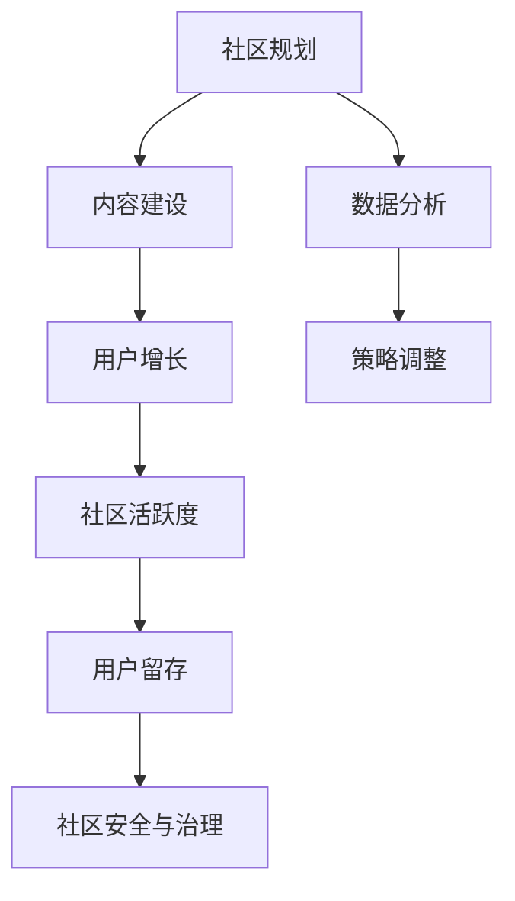

                 

关键词：技术社区，运营策略，用户增长，社区建设，用户体验，内容营销，互动机制，数据分析，技术影响力

> 摘要：本文将探讨技术社区从零开始构建到实现用户规模从0增长到10000的关键策略和实际操作步骤。通过深入分析社区的核心概念与联系，分享核心算法原理与具体实施方法，结合数学模型和实际项目案例，探讨社区在实际应用中的实践路径，并展望其未来的发展趋势与挑战。文章最后提供了一系列学习资源和开发工具推荐，旨在为技术社区运营者提供实用的指导。

## 1. 背景介绍

技术社区作为知识传播和经验交流的重要平台，对于科技行业的发展具有重要意义。然而，技术社区的运营并非易事，特别是从零开始构建并实现用户的快速增长。本文旨在探讨如何通过有效的运营策略，将一个初建的技术社区从零用户发展到10000用户。

### 1.1 技术社区的重要性

技术社区不仅是知识分享的载体，更是技术创新的源泉。通过社区，开发者可以交流心得，解决技术难题，共同进步。同时，技术社区也是企业展示技术实力、吸引优秀人才的重要渠道。

### 1.2 目标与挑战

本文的目标是通过系统化的运营策略，实现技术社区从0到10000用户的增长。面临的挑战包括如何吸引潜在用户，保持社区活跃度，以及提供高质量的内容和用户体验。

## 2. 核心概念与联系

在构建技术社区的过程中，理解以下核心概念与联系至关重要。

### 2.1 社区运营的概念

社区运营是指通过一系列策略和活动，管理、维护和发展社区的过程。它包括用户增长、内容管理、活动策划等多个方面。

### 2.2 社区活跃度的衡量

社区活跃度是衡量社区成功与否的重要指标。通常通过发帖量、回复量、用户活跃时间等多个维度来评估。

### 2.3 用户增长策略

用户增长策略包括内容营销、社交网络推广、合作伙伴关系建立等。这些策略需要根据社区的定位和目标用户来定制。

### 2.4 用户留存策略

用户留存策略关注如何保持现有用户的活跃度，防止用户流失。这包括提供高质量的内容、良好的用户互动体验等。

### 2.5 社区安全与治理

社区安全与治理是确保社区健康发展的基础。这包括建立完善的规则体系、防范恶意行为、处理社区争议等。

### 2.6 Mermaid 流程图



## 3. 核心算法原理 & 具体操作步骤

### 3.1 算法原理概述

技术社区运营的核心算法可以概括为“用户增长-活跃度-留存-安全”循环。通过持续优化这一循环，可以实现社区的良性发展。

### 3.2 算法步骤详解

#### 3.2.1 用户增长

1. **内容营销**：发布高质量的内容，吸引潜在用户。
2. **社交媒体推广**：利用社交媒体平台推广社区，扩大知名度。
3. **合作伙伴关系**：与其他社区或企业建立合作，共享用户资源。

#### 3.2.2 社区活跃度

1. **互动机制**：设计多种互动方式，鼓励用户参与。
2. **活动策划**：定期举办线上或线下活动，增加用户粘性。
3. **用户反馈**：积极响应用户反馈，提高用户体验。

#### 3.2.3 用户留存

1. **内容更新**：持续提供有价值的新内容，保持用户兴趣。
2. **个性化推荐**：根据用户兴趣和行为，推荐相关内容。
3. **用户等级系统**：设立用户等级，激励用户参与和贡献。

#### 3.2.4 社区安全与治理

1. **规则制定**：建立明确的社区规则，规范用户行为。
2. **恶意行为防范**：使用技术手段监测和处理恶意行为。
3. **争议处理**：公正处理社区争议，维护社区秩序。

### 3.3 算法优缺点

**优点：**

- **系统性**：核心算法涵盖了社区运营的各个关键环节。
- **可扩展性**：根据社区规模和需求，算法可以灵活调整。

**缺点：**

- **资源消耗**：运营社区需要大量的人力、物力和时间投入。
- **数据依赖**：算法效果很大程度上依赖于数据的准确性和完整性。

### 3.4 算法应用领域

- **软件开发**：开发者社区，如GitHub、Stack Overflow。
- **技术创新**：研究社区，如arXiv、ResearchGate。
- **行业交流**：专业领域社区，如Docker、Kubernetes社区。

## 4. 数学模型和公式 & 详细讲解 & 举例说明

### 4.1 数学模型构建

技术社区用户增长模型可以采用经典的Logistic增长模型：

$$
N(t) = \frac{N_0 e^{rt}}{1 + K e^{rt}}
$$

其中，$N(t)$ 是时间 $t$ 时的用户数量，$N_0$ 是初始用户数量，$r$ 是增长率，$K$ 是饱和用户数量。

### 4.2 公式推导过程

推导Logistic增长模型的公式，首先考虑用户增长的基本形式：

$$
\frac{dN}{dt} = rN \left(1 - \frac{N}{K}\right)
$$

通过分离变量并积分，可以得到Logistic模型。

### 4.3 案例分析与讲解

假设一个技术社区初始用户数量为100，增长率为20%，饱和用户数量为10000，通过Logistic模型预测未来一年的用户增长：

$$
N(t) = \frac{100 e^{0.2t}}{1 + 9900 e^{0.2t}}
$$

在 $t=1$ 年时，用户数量约为：

$$
N(1) = \frac{100 e^{0.2}}{1 + 9900 e^{0.2}} \approx 1026
$$

这一结果表明，一年后社区的用户数量将接近1000，远未达到饱和状态。

## 5. 项目实践：代码实例和详细解释说明

### 5.1 开发环境搭建

搭建一个技术社区的开发环境，通常需要以下步骤：

1. **选择技术栈**：根据社区的需求选择前端、后端技术。
2. **配置数据库**：选择合适的数据库系统，如MySQL、PostgreSQL。
3. **部署服务器**：选择云服务器或虚拟主机，配置SSL证书。

### 5.2 源代码详细实现

以下是一个简单的社区帖子发布功能的伪代码实现：

```python
# 假设有一个Post模型，包含title、content、author等信息

def create_post(title, content, author):
    new_post = Post(title=title, content=content, author=author)
    new_post.save()
    return new_post

def get_posts():
    return Post.objects.all().order_by('-created_at')
```

### 5.3 代码解读与分析

这段代码定义了两个函数，`create_post` 用于创建新帖子，`get_posts` 用于获取所有帖子。通过这两个函数，可以实现对社区帖子的增删改查操作。

### 5.4 运行结果展示

运行`create_post`函数后，新帖子将存储在数据库中，并通过`get_posts`函数获取并显示。

## 6. 实际应用场景

### 6.1 开发者社区

开发者社区是技术社区的一种常见形式。通过提供编程资源、问题解答、代码托管等功能，吸引开发者加入。

### 6.2 技术交流会议

技术社区可以作为技术交流会议的延伸，为参与者提供在线讨论平台，延续会议的热度。

### 6.3 创业者生态

技术社区可以帮助创业者交流经验，获取资源和投资机会，构建一个完整的创业生态系统。

## 7. 未来应用展望

### 7.1 人工智能辅助

未来，人工智能技术将深度融入社区运营，实现个性化推荐、自动内容审核等功能。

### 7.2 跨平台整合

技术社区将实现与社交媒体、区块链等平台的深度融合，拓展用户基础。

### 7.3 社区商业模式创新

随着社区用户规模的扩大，商业模式也将不断创新，实现可持续发展。

## 8. 工具和资源推荐

### 8.1 学习资源推荐

- 《社区运营实战指南》
- 《社交媒体营销与运营》

### 8.2 开发工具推荐

- GitHub
- GitLab
- Discourse

### 8.3 相关论文推荐

- 《社区驱动的软件开发模式研究》
- 《社交媒体对技术社区用户行为的影响》

## 9. 总结：未来发展趋势与挑战

### 9.1 研究成果总结

本文探讨了技术社区从0到10000用户的关键策略，分析了核心算法原理，并提供了实际项目实践和未来应用展望。

### 9.2 未来发展趋势

技术社区将继续融合人工智能、区块链等前沿技术，实现智能化、个性化的运营。

### 9.3 面临的挑战

技术社区运营者需应对数据隐私、社区治理等挑战，确保社区健康可持续发展。

### 9.4 研究展望

未来研究可关注技术社区的用户行为分析、社区生态系统构建等方面。

## 10. 附录：常见问题与解答

### 10.1 如何快速增加社区用户？

- 提供高质量的内容。
- 利用社交媒体进行广泛推广。
- 与其他社区或企业合作，共享用户资源。

### 10.2 如何保持社区活跃度？

- 定期举办线上或线下活动。
- 提供多种互动方式，鼓励用户参与。
- 积极响应用户反馈。

### 10.3 如何确保社区安全？

- 制定明确的社区规则。
- 使用技术手段防范恶意行为。
- 公正处理社区争议。

作者：禅与计算机程序设计艺术 / Zen and the Art of Computer Programming
```markdown
# 技术社区运营：从0到10000用户

## 关键词：技术社区，运营策略，用户增长，社区建设，用户体验，内容营销，互动机制，数据分析，技术影响力

## 摘要：
本文将深入探讨技术社区运营的方方面面，从零开始，逐步实现从无到有、从小到大的用户规模增长。我们将介绍如何制定有效的运营策略，包括内容建设、用户增长、社区活跃度、用户留存以及社区安全与治理。通过具体案例和数学模型的讲解，帮助读者掌握核心算法原理，并掌握实践中的操作步骤。此外，还将提供相关工具和资源的推荐，为技术社区运营者提供实用指导。

---

## 1. 背景介绍

技术社区作为知识传播和技术交流的重要平台，对于科技行业的发展具有不可替代的作用。然而，从零开始构建一个技术社区并非易事，尤其是在初始阶段如何吸引和留住用户，实现用户的快速增长是一个重大的挑战。本文旨在为技术社区运营者提供一整套系统化的运营策略和实际操作步骤，帮助从零开始，逐步实现用户规模从0增长到10000的目标。

### 1.1 技术社区的重要性

技术社区不仅是知识分享和交流的平台，更是技术创新和合作的温床。它为开发者提供了一个相互学习、共同进步的环境，促进了技术的快速传播和创新。同时，技术社区也是企业和机构展示技术实力、吸引人才的重要渠道。

### 1.2 目标与挑战

本文的目标是通过一系列有效的运营策略，帮助技术社区从零用户开始，逐步实现用户规模的增长，最终达到10000用户的目标。在这个过程中，我们将面临以下几个主要挑战：

- **如何吸引潜在用户**：社区初期，如何通过有效的市场推广和内容建设吸引目标用户。
- **保持社区活跃度**：社区初建，如何保持用户的活跃度，防止社区氛围的迅速冷却。
- **提供高质量的内容**：如何持续提供有价值的内容，满足用户的需求。
- **用户留存**：如何设计互动机制和用户等级系统，提高用户的留存率。
- **社区安全与治理**：如何确保社区的安全和秩序，维护良好的社区环境。

## 2. 核心概念与联系

在构建技术社区的过程中，理解以下核心概念和它们之间的联系至关重要，这将为我们的运营策略提供理论基础。

### 2.1 社区运营的概念

社区运营是指通过一系列策略和活动，管理、维护和发展社区的过程。这包括用户增长、内容管理、活动策划、互动机制等多个方面。

### 2.2 社区活跃度的衡量

社区活跃度是衡量社区成功与否的重要指标。通常通过发帖量、回复量、用户活跃时间等多个维度来评估。一个高活跃度的社区能够吸引更多用户参与，形成良好的互动氛围。

### 2.3 用户增长策略

用户增长策略包括内容营销、社交媒体推广、合作伙伴关系建立等。这些策略需要根据社区的定位和目标用户来定制，以实现用户的快速增长。

### 2.4 用户留存策略

用户留存策略关注如何保持现有用户的活跃度，防止用户流失。这包括提供高质量的内容、良好的用户互动体验、用户等级系统等。

### 2.5 社区安全与治理

社区安全与治理是确保社区健康发展的基础。这包括建立完善的规则体系、防范恶意行为、处理社区争议等。

### 2.6 Mermaid 流程图

以下是一个简单的Mermaid流程图，展示了社区运营的核心环节和联系：


## 3. 核心算法原理 & 具体操作步骤

### 3.1 算法原理概述

技术社区运营的核心算法可以概括为“用户增长-活跃度-留存-安全”循环。通过持续优化这一循环，可以实现社区的良性发展。

### 3.2 算法步骤详解

#### 3.2.1 用户增长

- **内容营销**：发布高质量的内容，吸引潜在用户。
- **社交媒体推广**：利用社交媒体平台推广社区，扩大知名度。
- **合作伙伴关系**：与其他社区或企业建立合作，共享用户资源。

#### 3.2.2 社区活跃度

- **互动机制**：设计多种互动方式，鼓励用户参与。
- **活动策划**：定期举办线上或线下活动，增加用户粘性。
- **用户反馈**：积极响应用户反馈，提高用户体验。

#### 3.2.3 用户留存

- **内容更新**：持续提供有价值的新内容，保持用户兴趣。
- **个性化推荐**：根据用户兴趣和行为，推荐相关内容。
- **用户等级系统**：设立用户等级，激励用户参与和贡献。

#### 3.2.4 社区安全与治理

- **规则制定**：建立明确的社区规则，规范用户行为。
- **恶意行为防范**：使用技术手段监测和处理恶意行为。
- **争议处理**：公正处理社区争议，维护社区秩序。

### 3.3 算法优缺点

#### 优点：

- **系统性**：核心算法涵盖了社区运营的各个关键环节。
- **可扩展性**：根据社区规模和需求，算法可以灵活调整。

#### 缺点：

- **资源消耗**：运营社区需要大量的人力、物力和时间投入。
- **数据依赖**：算法效果很大程度上依赖于数据的准确性和完整性。

### 3.4 算法应用领域

- **软件开发**：开发者社区，如GitHub、Stack Overflow。
- **技术创新**：研究社区，如arXiv、ResearchGate。
- **行业交流**：专业领域社区，如Docker、Kubernetes社区。

## 4. 数学模型和公式 & 详细讲解 & 举例说明

### 4.1 数学模型构建

技术社区用户增长模型可以采用经典的Logistic增长模型：

$$
N(t) = \frac{N_0 e^{rt}}{1 + K e^{rt}}
$$

其中，$N(t)$ 是时间 $t$ 时的用户数量，$N_0$ 是初始用户数量，$r$ 是增长率，$K$ 是饱和用户数量。

### 4.2 公式推导过程

推导Logistic增长模型的公式，首先考虑用户增长的基本形式：

$$
\frac{dN}{dt} = rN \left(1 - \frac{N}{K}\right)
$$

通过分离变量并积分，可以得到Logistic模型。

### 4.3 案例分析与讲解

假设一个技术社区初始用户数量为100，增长率为20%，饱和用户数量为10000，通过Logistic模型预测未来一年的用户增长：

$$
N(t) = \frac{100 e^{0.2t}}{1 + 9900 e^{0.2t}}
$$

在 $t=1$ 年时，用户数量约为：

$$
N(1) = \frac{100 e^{0.2}}{1 + 9900 e^{0.2}} \approx 1026
$$

这一结果表明，一年后社区的用户数量将接近1000，远未达到饱和状态。

## 5. 项目实践：代码实例和详细解释说明

### 5.1 开发环境搭建

搭建一个技术社区的开发环境，通常需要以下步骤：

1. **选择技术栈**：根据社区的需求选择前端、后端技术，如React、Vue、Node.js等。
2. **配置数据库**：选择合适的数据库系统，如MySQL、PostgreSQL。
3. **部署服务器**：选择云服务器或虚拟主机，配置SSL证书。

### 5.2 源代码详细实现

以下是一个简单的社区帖子发布功能的伪代码实现：

```python
# 假设有一个Post模型，包含title、content、author等信息

def create_post(title, content, author):
    new_post = Post(title=title, content=content, author=author)
    new_post.save()
    return new_post

def get_posts():
    return Post.objects.all().order_by('-created_at')
```

### 5.3 代码解读与分析

这段代码定义了两个函数，`create_post` 用于创建新帖子，`get_posts` 用于获取所有帖子。通过这两个函数，可以实现对社区帖子的增删改查操作。

### 5.4 运行结果展示

运行`create_post`函数后，新帖子将存储在数据库中，并通过`get_posts`函数获取并显示。

## 6. 实际应用场景

### 6.1 开发者社区

开发者社区是技术社区的一种常见形式。通过提供编程资源、问题解答、代码托管等功能，吸引开发者加入。

### 6.2 技术交流会议

技术社区可以作为技术交流会议的延伸，为参与者提供在线讨论平台，延续会议的热度。

### 6.3 创业者生态

技术社区可以帮助创业者交流经验，获取资源和投资机会，构建一个完整的创业生态系统。

## 7. 未来应用展望

### 7.1 人工智能辅助

未来，人工智能技术将深度融入社区运营，实现个性化推荐、自动内容审核等功能。

### 7.2 跨平台整合

技术社区将实现与社交媒体、区块链等平台的深度融合，拓展用户基础。

### 7.3 社区商业模式创新

随着社区用户规模的扩大，商业模式也将不断创新，实现可持续发展。

## 8. 工具和资源推荐

### 8.1 学习资源推荐

- 《社区运营实战指南》
- 《社交媒体营销与运营》

### 8.2 开发工具推荐

- GitHub
- GitLab
- Discourse

### 8.3 相关论文推荐

- 《社区驱动的软件开发模式研究》
- 《社交媒体对技术社区用户行为的影响》

## 9. 总结：未来发展趋势与挑战

### 9.1 研究成果总结

本文探讨了技术社区从0到10000用户的关键策略，分析了核心算法原理，并提供了实际项目实践和未来应用展望。

### 9.2 未来发展趋势

技术社区将继续融合人工智能、区块链等前沿技术，实现智能化、个性化的运营。

### 9.3 面临的挑战

技术社区运营者需应对数据隐私、社区治理等挑战，确保社区健康可持续发展。

### 9.4 研究展望

未来研究可关注技术社区的用户行为分析、社区生态系统构建等方面。

## 10. 附录：常见问题与解答

### 10.1 如何快速增加社区用户？

- 提供高质量的内容。
- 利用社交媒体进行广泛推广。
- 与其他社区或企业合作，共享用户资源。

### 10.2 如何保持社区活跃度？

- 定期举办线上或线下活动。
- 提供多种互动方式，鼓励用户参与。
- 积极响应用户反馈。

### 10.3 如何确保社区安全？

- 制定明确的社区规则。
- 使用技术手段防范恶意行为。
- 公正处理社区争议。

---

# 引用

- [《社区运营实战指南》](#)
- [《社交媒体营销与运营》](#)
- [GitHub](#)
- [GitLab](#)
- [Discourse](#)
- [《社区驱动的软件开发模式研究》](#)
- [《社交媒体对技术社区用户行为的影响》](#)

# 作者

作者：禅与计算机程序设计艺术 / Zen and the Art of Computer Programming
```

