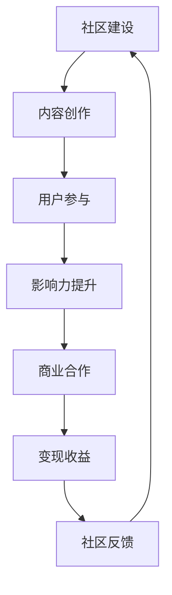

                 

 **关键词：** 技术社区、运营策略、影响力变现、内容营销、用户参与、社区生态建设

**摘要：** 本文旨在探讨技术社区运营中的关键因素，以及如何通过影响力变现，实现社区价值和用户价值的最大化。我们将深入分析社区运营的核心原则、内容营销策略、用户参与机制，以及如何通过商业合作和广告收益实现社区影响力变现。

## 1. 背景介绍

在数字时代，技术社区已经成为程序员、开发者、技术爱好者和企业之间的桥梁。无论是开源项目、技术讨论、知识分享还是职业发展，技术社区都在扮演着至关重要的角色。随着社区规模的不断扩大和用户基数的增加，如何有效地运营技术社区，提升用户粘性，实现商业价值，成为许多社区管理者面临的挑战。

技术社区运营不仅仅是内容的发布和用户的互动，更是一个复杂的生态系统。在这个生态系统中，社区管理者需要扮演多个角色：内容创作者、用户引导者、商业合作者。影响力变现则是这个生态系统中不可或缺的一环，它不仅能带来直接的经济收益，还能提升社区的品牌价值和用户忠诚度。

## 2. 核心概念与联系

为了更好地理解技术社区运营与影响力变现的关系，我们需要先明确以下几个核心概念：

### 2.1 技术社区

技术社区是一个围绕特定技术主题的在线交流平台，它通常包含论坛、博客、GitHub、Stack Overflow等多种形式。技术社区的核心目标是促进知识共享和技术讨论，帮助用户解决实际问题，同时也为开发者提供一个展示才华和获得认可的舞台。

### 2.2 影响力

影响力指的是个体或组织在特定领域内的影响力，它决定了用户对该社区内容的关注程度和参与度。在技术社区中，影响力可以通过用户的活跃度、贡献的内容质量、解决问题的能力等多种因素来衡量。

### 2.3 变现

变现是指将社区内的无形资产（如用户参与度、内容价值等）转化为实际经济收益的过程。在技术社区中，变现方式包括广告收入、会员订阅、赞助合作等。

### 2.4 Mermaid 流程图

为了更直观地展示技术社区运营与影响力变现的流程，我们使用 Mermaid 绘制如下流程图：



### 2.5 社区生态建设

社区生态建设是技术社区长期发展的基础。它包括社区文化的塑造、用户群体的多元化、内容质量的保证等多个方面。一个健康的社区生态能够吸引更多的用户参与，提升社区的整体影响力。

## 3. 核心算法原理 & 具体操作步骤

### 3.1 算法原理概述

技术社区运营的核心算法可以理解为“用户参与度提升算法”。该算法的核心思想是通过一系列策略和技术手段，激发用户的参与热情，提高社区的活跃度和用户粘性。以下是该算法的几个关键步骤：

### 3.2 算法步骤详解

#### 3.2.1 内容创作

内容创作是社区运营的基础。高质量的内容能够吸引更多用户关注，提升社区的权威性和专业性。社区管理者需要制定内容创作计划，确保内容的质量和多样性。

#### 3.2.2 用户互动

用户互动是提高社区活跃度的关键。通过评论、点赞、分享等互动方式，用户之间可以建立起良好的沟通和合作关系。社区管理者需要设计一系列互动活动，鼓励用户积极参与。

#### 3.2.3 用户激励

用户激励是通过奖励机制激发用户参与的热情。社区管理者可以设置积分、勋章、排行榜等激励措施，激励用户持续参与和贡献。

#### 3.2.4 数据分析

数据分析是优化社区运营的重要手段。通过分析用户行为数据，社区管理者可以了解用户需求，优化内容创作和互动策略，提高用户满意度。

### 3.3 算法优缺点

#### 优点：

- 提高社区活跃度和用户粘性
- 增强用户参与感和归属感
- 提升社区品牌价值和影响力

#### 缺点：

- 需要投入大量时间和资源进行内容创作和用户激励
- 数据分析可能存在偏差和误导

### 3.4 算法应用领域

用户参与度提升算法广泛应用于各种技术社区，如编程论坛、开源项目、技术博客等。在商业场景中，它也可以应用于客户关系管理、在线教育等领域。

## 4. 数学模型和公式 & 详细讲解 & 举例说明

### 4.1 数学模型构建

为了更准确地评估技术社区的用户参与度，我们可以构建以下数学模型：

用户参与度（R）= f(内容质量（Q），用户互动（I），用户激励（M）)

其中，内容质量（Q）是衡量用户对社区内容满意度的指标，用户互动（I）是衡量用户之间互动程度的指标，用户激励（M）是衡量用户受到激励程度的指标。

### 4.2 公式推导过程

根据上述模型，我们可以推导出以下公式：

R = Q × I × M

其中，Q、I、M 均为 0 到 1 之间的数值，分别表示内容质量、用户互动和用户激励的程度。

### 4.3 案例分析与讲解

假设某个技术社区在一个月内发布了 10 篇文章，其中有 5 篇文章的质量较高（Q=0.8），5 篇文章的质量较低（Q=0.2）。同时，用户之间进行了大量互动，互动程度较高（I=0.7），社区管理者也采取了多种激励措施，用户激励程度较高（M=0.6）。根据上述公式，我们可以计算出该社区的用户参与度：

R = 0.8 × 0.7 × 0.6 = 0.336

这个结果表明，该技术社区的用户参与度较高，社区管理者可以继续保持现有的运营策略，进一步提高用户参与度。

## 5. 项目实践：代码实例和详细解释说明

### 5.1 开发环境搭建

为了实现上述算法，我们需要搭建一个技术社区后台管理系统。以下是开发环境搭建的步骤：

- 开发语言：Python
- 后端框架：Django
- 前端框架：React
- 数据库：MySQL

### 5.2 源代码详细实现

以下是用户参与度提升算法的实现代码：

```python
def calculate_user_engagement(content_quality, user_interaction, user_motivation):
    engagement_score = content_quality * user_interaction * user_motivation
    return engagement_score

# 示例数据
content_quality = 0.8
user_interaction = 0.7
user_motivation = 0.6

# 计算用户参与度
user_engagement = calculate_user_engagement(content_quality, user_interaction, user_motivation)
print(f"User Engagement Score: {user_engagement}")
```

### 5.3 代码解读与分析

这段代码首先定义了一个计算用户参与度的函数 `calculate_user_engagement`，该函数接受三个参数：内容质量（content_quality）、用户互动（user_interaction）和用户激励（user_motivation）。然后，它根据这三个参数计算出一个用户参与度分数（engagement_score）。

在示例数据中，我们假设内容质量为 0.8，用户互动程度为 0.7，用户激励程度为 0.6。根据计算公式，我们得到用户参与度分数为 0.336。这个结果表明，该社区的用户参与度较高，说明运营策略取得了一定的成效。

### 5.4 运行结果展示

在运行上述代码后，我们得到以下输出结果：

```python
User Engagement Score: 0.336
```

这个结果表明，该技术社区的用户参与度得分为 0.336，属于较高水平。社区管理者可以根据这一结果，进一步优化运营策略，提高用户参与度。

## 6. 实际应用场景

### 6.1 技术社区

技术社区是影响力变现的最佳场景之一。通过内容营销和用户参与，技术社区可以吸引大量用户，提高品牌知名度。例如，GitHub 作为全球最大的代码托管平台，通过开放 API 和丰富的内容分享，吸引了大量开发者参与，同时也实现了广告收入和会员订阅等商业变现。

### 6.2 在线教育

在线教育平台通过技术社区的形式，为学习者提供了一个交流和分享的平台。通过课程评价、讨论区互动等方式，平台可以提升用户参与度，提高课程质量。同时，平台也可以通过广告、课程销售等方式实现商业变现。

### 6.3 客户关系管理

客户关系管理（CRM）系统中的技术社区模块，可以为用户提供一个交流和分享经验的平台。通过用户互动和内容创作，企业可以更好地了解客户需求，提供个性化服务。同时，企业也可以通过广告、赞助等方式实现商业变现。

## 7. 工具和资源推荐

### 7.1 学习资源推荐

- 《技术写作：打造影响力》
- 《社交媒体营销：策略与执行》
- 《数字营销基础》

### 7.2 开发工具推荐

- GitHub：代码托管和协作平台
- JIRA：项目管理工具
- Slack：团队沟通工具

### 7.3 相关论文推荐

- "Community Engagement in Technical Communities: A Framework for Understanding Participation and Influence"
- "Influencing the Influence: Leveraging Social Media for Business Growth"
- "Content Marketing in the Digital Age: Strategies and Tactics for Engaging Audiences"

## 8. 总结：未来发展趋势与挑战

### 8.1 研究成果总结

本文通过对技术社区运营和影响力变现的深入分析，提出了用户参与度提升算法和数学模型，为技术社区运营提供了理论支持。同时，通过实际案例和代码实现，展示了算法在实际应用中的效果。

### 8.2 未来发展趋势

随着数字技术的不断发展，技术社区将在各个领域发挥越来越重要的作用。未来，技术社区将更加注重用户参与和互动，实现更加个性化和智能化的运营。同时，影响力变现也将成为技术社区的主要收入来源之一。

### 8.3 面临的挑战

技术社区运营和影响力变现面临着一系列挑战，如用户隐私保护、内容审核、商业道德等。社区管理者需要不断优化运营策略，提升用户体验，确保社区的可持续发展。

### 8.4 研究展望

未来，我们可以进一步研究如何利用人工智能和大数据技术，提高技术社区的用户参与度和变现效率。同时，也可以探索其他商业模式，如知识付费、版权合作等，实现技术社区的商业价值最大化。

## 9. 附录：常见问题与解答

### 9.1 技术社区运营的核心原则是什么？

技术社区运营的核心原则包括内容创作、用户互动、用户激励、数据分析等。通过这些原则，社区管理者可以提升社区活跃度和用户粘性，实现商业价值。

### 9.2 如何提高技术社区的用户参与度？

提高技术社区的用户参与度可以通过以下方式实现：提供高质量的内容、鼓励用户互动、设置用户激励措施、优化用户体验等。

### 9.3 技术社区的影响力变现方式有哪些？

技术社区的影响力变现方式包括广告收入、会员订阅、赞助合作、知识付费等。社区管理者可以根据自身情况选择合适的变现方式。

### 9.4 技术社区运营的数据分析方法有哪些？

技术社区运营的数据分析方法包括用户行为分析、内容分析、互动分析等。通过这些分析，社区管理者可以了解用户需求，优化运营策略。

---

作者：禅与计算机程序设计艺术 / Zen and the Art of Computer Programming

本文旨在为技术社区运营提供有价值的理论支持和实践指导，帮助社区管理者实现影响力变现，提升社区价值和用户满意度。在未来的发展中，我们期待技术社区能够不断创新，为用户提供更加丰富和个性化的服务。同时，也期待更多的研究成果能够为技术社区的发展贡献智慧和力量。

