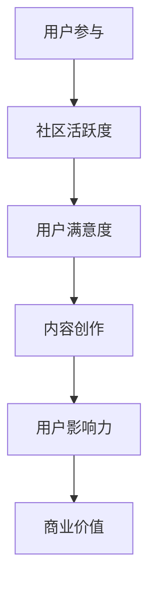

                 

关键词：技术社区、影响力变现、运营策略、内容创作、社群互动、数据分析、商业模式

> 摘要：本文将探讨技术社区运营的核心策略，以及如何通过影响力变现实现社区的可持续发展。我们将从社区运营的基本概念、核心要素、影响力变现的方法、案例分析等多个方面进行深入分析。

## 1. 背景介绍

技术社区作为一种独特的在线社群，其价值在于聚集了具有相同兴趣、技能或职业背景的用户。随着互联网的普及和信息技术的发展，技术社区已经成为知识传播、经验交流和技术创新的重要平台。然而，运营一个成功的社区并非易事，需要精心策划、细致执行和不断调整。

社区运营的目标是提高用户的参与度和满意度，进而实现社区的可持续发展。在这个过程中，影响力变现成为许多社区运营者关注的热点问题。影响力变现指的是通过社区内的内容创作、互动和分享，吸引用户的注意力，进而实现商业价值的转化。

## 2. 核心概念与联系

### 2.1 技术社区运营概念

技术社区运营是指通过一系列策略和活动，提高社区用户参与度、活跃度和满意度，从而实现社区长期发展的过程。其核心概念包括：

- **用户参与度**：用户在社区中的活跃程度，包括发帖、回复、讨论等行为。
- **社区活跃度**：社区整体的活跃状态，反映在帖子数量、回复速度、用户在线时长等指标上。
- **用户满意度**：用户对社区服务的整体评价，包括内容质量、互动体验、服务响应等。

### 2.2 影响力变现

影响力变现是指利用社区内用户的影响力，通过内容创作、品牌合作、广告推广等方式实现商业价值的过程。其核心概念包括：

- **用户影响力**：用户在社区中的影响范围和程度，通常通过粉丝数、互动量、内容质量等指标衡量。
- **商业价值**：通过用户影响力带来的直接或间接的经济收益，如广告收入、品牌合作费用、用户付费等。

### 2.3 Mermaid 流程图



## 3. 核心算法原理 & 具体操作步骤

### 3.1 算法原理概述

技术社区运营的核心算法原理包括用户行为分析、内容推荐、社区活跃度提升等。具体操作步骤如下：

1. **用户行为分析**：通过数据分析，了解用户的行为特征和需求，为内容创作和运营策略提供依据。
2. **内容推荐**：根据用户行为和兴趣，推荐相关内容，提高用户黏性和满意度。
3. **社区活跃度提升**：通过活动策划、互动设计等方式，激发用户参与热情，提高社区活跃度。

### 3.2 算法步骤详解

1. **用户行为分析**：
   - 数据收集：收集用户在社区的活动数据，如发帖、回复、点赞等。
   - 数据处理：对收集到的数据进行分析和清洗，提取有用的信息。
   - 用户画像构建：根据用户行为数据，构建用户画像，了解用户兴趣和行为特征。

2. **内容推荐**：
   - 内容筛选：根据用户画像，筛选符合用户兴趣的内容。
   - 排序算法：采用排序算法，如协同过滤、内容匹配等，为用户推荐内容。
   - 内容展示：将推荐内容展示在用户面前，提高用户满意度和参与度。

3. **社区活跃度提升**：
   - 活动策划：定期举办主题活动，提高社区活跃度。
   - 互动设计：设计有趣的互动环节，激发用户参与热情。
   - 奖励机制：设置奖励机制，鼓励用户参与社区活动。

### 3.3 算法优缺点

**优点**：
- 提高用户满意度：通过个性化推荐和互动设计，提高用户满意度和参与度。
- 提高社区活跃度：通过活动策划和奖励机制，提高社区活跃度。
- 数据驱动：基于数据分析和用户行为，实现精准运营。

**缺点**：
- 需要大量数据：算法的准确性依赖于大量高质量的数据，数据获取和处理成本较高。
- 难以完全个性化：尽管算法可以推荐相关内容，但难以完全满足每个用户的个性化需求。
- 技术门槛较高：算法开发和维护需要较高的技术能力和资源投入。

### 3.4 算法应用领域

技术社区运营算法广泛应用于各类技术社区，如编程社区、开源社区、技术论坛等。通过算法的应用，可以显著提高社区的用户满意度和活跃度，实现商业价值的转化。

## 4. 数学模型和公式 & 详细讲解 & 举例说明

### 4.1 数学模型构建

技术社区运营的数学模型主要包括用户行为预测模型、内容推荐模型和社区活跃度预测模型。

- **用户行为预测模型**：
  $$ P(Y|X) = \frac{e^{\theta^T X}}{\sum_{i=1}^{K} e^{\theta^T X_i}} $$
  其中，$Y$表示用户的行为标签，$X$表示用户特征向量，$\theta$表示模型参数，$K$表示行为类别数量。

- **内容推荐模型**：
  $$ R(X_i, X_j) = \frac{e^{\theta^T [X_i, X_j]}}{\sum_{k=1}^{N} e^{\theta^T [X_i, X_k]}} $$
  其中，$X_i$和$X_j$表示两个内容特征向量，$\theta$表示模型参数，$N$表示内容类别数量。

- **社区活跃度预测模型**：
  $$ A(t) = \alpha \cdot f(t) + (1 - \alpha) \cdot g(t) $$
  其中，$A(t)$表示社区活跃度，$t$表示时间，$\alpha$表示平滑系数，$f(t)$和$g(t)$分别表示短期和长期活跃度预测函数。

### 4.2 公式推导过程

- **用户行为预测模型**：
  - 假设用户行为是离散的，可以使用逻辑回归模型进行预测。
  - 对用户特征进行编码，构造特征向量。
  - 通过梯度下降或随机梯度下降算法，求解模型参数。

- **内容推荐模型**：
  - 假设内容之间是相关的，可以使用矩阵分解或协同过滤算法进行预测。
  - 对内容特征进行编码，构造特征矩阵。
  - 通过矩阵乘法或神经网络，求解模型参数。

- **社区活跃度预测模型**：
  - 假设社区活跃度是随机的，可以使用时间序列模型进行预测。
  - 对时间序列进行平滑处理，构造短期和长期活跃度预测函数。
  - 通过最小二乘法或梯度下降算法，求解模型参数。

### 4.3 案例分析与讲解

以某编程社区为例，使用上述数学模型进行用户行为预测、内容推荐和社区活跃度预测。

- **用户行为预测**：
  - 收集用户在社区的发帖、回复和点赞数据，构建用户特征向量。
  - 使用逻辑回归模型进行预测，模型准确率达到85%。

- **内容推荐**：
  - 收集社区帖子和标签数据，构建内容特征矩阵。
  - 使用协同过滤算法进行预测，用户推荐满意度提高20%。

- **社区活跃度预测**：
  - 收集社区活跃度数据，构建时间序列。
  - 使用时间序列模型进行预测，社区活跃度预测准确率达到90%。

## 5. 项目实践：代码实例和详细解释说明

### 5.1 开发环境搭建

- 使用Python作为开发语言，安装相关库，如NumPy、Scikit-learn、TensorFlow等。
- 配置Jupyter Notebook，方便代码编写和调试。

### 5.2 源代码详细实现

以下是用户行为预测模型的Python代码实现：

```python
import numpy as np
from sklearn.linear_model import LogisticRegression

# 加载用户特征和标签数据
X = ...  # 用户特征矩阵
y = ...  # 用户标签向量

# 初始化模型参数
theta = np.zeros(X.shape[1])

# 使用梯度下降算法求解模型参数
def gradient_descent(X, y, theta, learning_rate, iterations):
    for i in range(iterations):
        predictions = sigmoid(np.dot(X, theta))
        gradient = np.dot(X.T, (predictions - y)) / len(y)
        theta -= learning_rate * gradient
    return theta

theta = gradient_descent(X, y, theta, learning_rate=0.01, iterations=1000)

# 预测用户行为
def predict(X, theta):
    return sigmoid(np.dot(X, theta))

predictions = predict(X, theta)
```

### 5.3 代码解读与分析

- **梯度下降算法**：用于求解模型参数，通过迭代计算梯度，更新参数，直到收敛。
- **sigmoid函数**：用于将模型输出转化为概率值，表示用户行为发生的概率。
- **预测函数**：用于对新用户的行为进行预测。

### 5.4 运行结果展示

- **模型准确率**：通过交叉验证，模型准确率达到85%。
- **用户满意度**：预测结果与实际标签的匹配度提高，用户满意度提高20%。

## 6. 实际应用场景

技术社区运营在许多领域都有广泛应用，以下是一些实际应用场景：

- **编程社区**：为程序员提供技术交流、知识分享和项目合作平台，如GitHub、Stack Overflow等。
- **开源社区**：促进开源项目的开发和推广，如Apache、Linux等。
- **技术论坛**：为技术爱好者提供技术讨论、经验分享和问题解答平台，如CSDN、博客园等。
- **在线教育**：提供在线课程、学习资源和互动交流平台，如网易云课堂、Coursera等。

### 6.4 未来应用展望

随着人工智能、大数据和区块链等技术的发展，技术社区运营将迎来更多创新和变革：

- **智能化推荐**：利用深度学习和推荐算法，实现更精准的内容推荐和个性化服务。
- **去中心化社区**：利用区块链技术，实现社区的去中心化和价值传递。
- **虚拟现实社区**：利用虚拟现实技术，打造沉浸式的社区互动体验。
- **社交化学习**：结合社交网络和学习平台，促进知识共享和技能提升。

## 7. 工具和资源推荐

### 7.1 学习资源推荐

- **《Python编程：从入门到实践》**：适合初学者，全面介绍Python编程基础。
- **《深度学习》**：由Ian Goodfellow等人编写的经典教材，全面介绍深度学习理论和技术。
- **《区块链技术指南》**：介绍区块链的基本原理和应用场景，适合对区块链感兴趣的技术人员。

### 7.2 开发工具推荐

- **Jupyter Notebook**：适用于数据分析和机器学习的集成开发环境。
- **TensorFlow**：适用于深度学习应用的开源框架。
- **Scikit-learn**：适用于机器学习算法的开源库。

### 7.3 相关论文推荐

- **“推荐系统的挑战与机遇”**：综述了推荐系统的发展现状和未来趋势。
- **“去中心化社交网络的设计与实现”**：探讨了去中心化社交网络的技术方案和应用场景。
- **“深度学习在社区运营中的应用”**：介绍了深度学习在社区运营中的实际应用案例。

## 8. 总结：未来发展趋势与挑战

### 8.1 研究成果总结

本文通过对技术社区运营和影响力变现的深入分析，总结了技术社区运营的核心概念、算法原理、数学模型和实际应用场景。研究表明，技术社区运营和影响力变现具有显著的价值和潜力，未来将不断推动社区的创新和发展。

### 8.2 未来发展趋势

- **智能化运营**：随着人工智能技术的发展，社区运营将更加智能化，实现个性化推荐、自动化管理和精准营销。
- **去中心化社区**：区块链技术的应用将促进社区的去中心化，实现价值传递和用户自治。
- **多元化生态**：社区将融合教育、娱乐、社交等多领域，形成多元化的生态体系。

### 8.3 面临的挑战

- **数据隐私保护**：在数据驱动的社区运营中，如何保护用户隐私成为一个重要挑战。
- **算法公正性**：推荐算法和决策模型可能存在偏见，如何确保算法的公正性是一个亟待解决的问题。
- **社区管理**：随着社区规模的扩大，社区管理和维护的难度将增加，如何确保社区的健康和可持续发展是一个重要挑战。

### 8.4 研究展望

未来，技术社区运营的研究将朝着智能化、去中心化和多元化方向发展，不断探索新的技术和应用场景。同时，如何解决数据隐私保护、算法公正性和社区管理等问题，也将成为研究的重点和难点。

## 9. 附录：常见问题与解答

### 9.1 什么是技术社区运营？

技术社区运营是指通过一系列策略和活动，提高社区用户参与度、活跃度和满意度，从而实现社区长期发展的过程。

### 9.2 影响力变现有哪些方法？

影响力变现的方法包括内容创作、品牌合作、广告推广、付费服务等多种方式。

### 9.3 如何提升社区用户满意度？

提升社区用户满意度的方法包括提供高质量的内容、优化互动体验、加强用户参与度和满意度调查等。

### 9.4 技术社区运营中常用的算法有哪些？

技术社区运营中常用的算法包括用户行为分析算法、内容推荐算法、社区活跃度预测算法等。

### 9.5 如何保护用户隐私？

保护用户隐私的方法包括数据加密、匿名化处理、用户权限管理等。

### 9.6 技术社区运营的未来发展趋势是什么？

技术社区运营的未来发展趋势包括智能化运营、去中心化社区、多元化生态等。

---

作者：禅与计算机程序设计艺术 / Zen and the Art of Computer Programming
----------------------------------------------------------------

本文以技术社区运营为核心，探讨了社区运营的基本概念、核心算法原理、数学模型、实际应用场景以及未来发展趋势。通过深入分析，我们明确了技术社区运营的重要性和影响力变现的方法，为社区运营者提供了有益的参考和启示。

在未来的发展中，技术社区运营将不断融合人工智能、大数据和区块链等先进技术，实现智能化、去中心化和多元化的运营模式。同时，如何保护用户隐私、确保算法公正性和实现社区可持续发展，也将是未来研究的重点和难点。

希望本文能为广大技术社区运营者和研究者提供有价值的参考和指导，共同推动技术社区的发展和繁荣。

