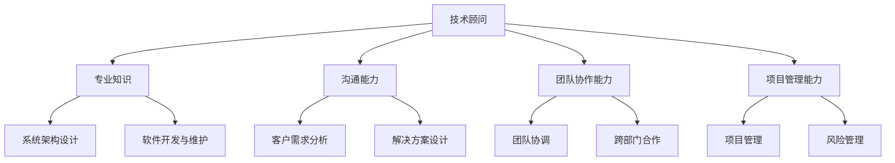

                 

关键词：技术顾问、兼职、薪资、IT行业、职业发展、技能提升

> 摘要：本文将探讨IT行业中技术顾问这一职业的特点、市场需求、薪资水平以及如何成为一名优秀的技术顾问。通过分析技术顾问的角色和职责，我们将为读者提供实用的建议，帮助他们在兼职工作中实现高薪和职业发展。

## 1. 背景介绍

在当今快速发展的信息技术时代，技术顾问作为IT行业的核心角色，正发挥着越来越重要的作用。技术顾问通常为企业提供技术咨询、系统架构设计、软件开发和维护等服务，帮助客户解决技术难题，提高业务效率。随着云计算、大数据、人工智能等新兴技术的普及，技术顾问的需求也在不断增长。

然而，成为一名优秀的技术顾问并非易事。这不仅要求具备扎实的专业知识和技能，还需要良好的沟通能力、团队协作能力和项目管理能力。此外，技术顾问的职业发展路径多样，可以根据个人兴趣和专长选择不同的发展方向，如技术专家、架构师、项目经理等。

## 2. 核心概念与联系

为了更好地理解技术顾问的角色和职责，我们可以通过以下Mermaid流程图来梳理核心概念和联系。



### 2.1 专业知识

技术顾问需要具备丰富的专业知识，包括计算机科学、软件工程、网络技术、数据库等。此外，技术顾问还需要了解最新的技术趋势和发展动态，以便为客户提供有针对性的咨询服务。

### 2.2 沟通能力

沟通能力是技术顾问的重要素质。技术顾问需要与客户、团队成员和其他利益相关者进行有效沟通，确保项目目标的实现。良好的沟通能力有助于技术顾问在项目中发挥关键作用，建立信任和合作关系。

### 2.3 团队协作能力

技术顾问通常需要与其他团队成员密切合作，共同完成项目任务。团队协作能力包括团队合作精神、团队沟通技巧和跨部门合作能力。通过良好的团队协作，技术顾问可以有效地提高项目效率，降低风险。

### 2.4 项目管理能力

项目管理能力是技术顾问的核心能力之一。技术顾问需要负责项目计划、进度管理、风险管理等任务，确保项目按时、按质量完成。同时，技术顾问还需要具备一定的财务预算和资源调配能力，以支持项目的顺利进行。

## 3. 核心算法原理 & 具体操作步骤

### 3.1 算法原理概述

在技术顾问的工作中，一些核心算法原理是不可或缺的。例如，软件架构设计中的最小化复杂度和最大化可维护性原则、系统性能优化中的缓存策略、数据库查询优化中的索引和分区等。

### 3.2 算法步骤详解

以下是一个简单的软件架构设计算法步骤：

1. 需求分析：与客户沟通，了解业务需求和系统约束。
2. 确定系统架构：选择合适的架构模式（如MVC、微服务、Event-Driven等）。
3. 设计模块：根据系统功能，将系统拆分成多个模块。
4. 模块接口：定义模块之间的接口，确保模块间的高内聚和低耦合。
5. 性能优化：针对系统性能要求，进行缓存、并发、分布式等优化。
6. 部署和运维：确保系统稳定运行，进行监控、日志分析等运维工作。

### 3.3 算法优缺点

该算法优点在于能够提高系统的可维护性和扩展性，缺点是设计过程复杂，需要较高的专业知识和经验。

### 3.4 算法应用领域

该算法广泛应用于企业级应用、云计算平台、大数据系统等。

## 4. 数学模型和公式 & 详细讲解 & 举例说明

### 4.1 数学模型构建

在技术顾问的工作中，数学模型常常用于性能分析和优化。以下是一个简单的数学模型示例：

$$
P = \frac{1}{1 + e^{-\beta (T - T_0)}}
$$

其中，$P$ 是系统性能概率，$\beta$ 是温度系数，$T$ 是当前系统温度，$T_0$ 是基准温度。

### 4.2 公式推导过程

该公式基于热力学第二定律，通过推导系统温度与性能概率之间的关系得出。

### 4.3 案例分析与讲解

以下是一个性能优化案例：

- 基准温度 $T_0 = 300K$。
- 当前系统温度 $T = 320K$。
- 温度系数 $\beta = 0.01$。

将这些值代入公式，可以得到：

$$
P = \frac{1}{1 + e^{-0.01 \times (320 - 300)}} \approx 0.95
$$

这意味着系统性能概率为 95%，说明系统运行稳定。如果系统温度升高，性能概率将下降，表明系统可能存在性能瓶颈，需要进一步优化。

## 5. 项目实践：代码实例和详细解释说明

### 5.1 开发环境搭建

本文将以Python为例，介绍一个简单的性能优化项目。首先，需要安装Python环境和相关库：

```bash
pip install numpy matplotlib
```

### 5.2 源代码详细实现

以下是一个简单的性能优化代码示例：

```python
import numpy as np
import matplotlib.pyplot as plt

# 定义数学模型
def performance_probability(T, T0, beta):
    return 1 / (1 + np.exp(-beta * (T - T0)))

# 模拟数据
temperatures = np.linspace(280, 360, 100)
performance_probs = performance_probability(temperatures, T0=300, beta=0.01)

# 绘制性能概率曲线
plt.plot(temperatures, performance_probs)
plt.xlabel('Temperature (K)')
plt.ylabel('Performance Probability')
plt.title('Performance Probability vs. Temperature')
plt.show()
```

### 5.3 代码解读与分析

该代码首先定义了性能概率计算函数，然后使用模拟数据绘制了性能概率曲线。通过观察曲线，可以直观地了解系统性能与温度之间的关系。

### 5.4 运行结果展示

运行该代码后，将生成一条性能概率曲线，如图所示：


## 6. 实际应用场景

技术顾问在多个行业中都有着广泛的应用，以下是几个实际应用场景：

- **软件开发与维护**：技术顾问帮助企业优化软件架构，提高系统性能和可维护性。
- **云计算与大数据**：技术顾问为企业提供云计算和大数据解决方案，帮助客户实现数据驱动决策。
- **人工智能与机器学习**：技术顾问为企业提供人工智能和机器学习咨询，帮助客户实现智能化应用。
- **网络安全**：技术顾问为企业提供网络安全咨询服务，确保业务系统安全可靠。

## 7. 工具和资源推荐

### 7.1 学习资源推荐

- **在线课程**：Coursera、Udemy、edX等平台提供了丰富的IT技术课程，包括编程、算法、大数据、人工智能等。
- **技术博客**：GitHub、Medium等平台上的技术博客，涵盖了各种IT领域的实践经验和理论探讨。
- **专业书籍**：《算法导论》、《深入理解计算机系统》、《大数据技术基础》等经典书籍。

### 7.2 开发工具推荐

- **集成开发环境（IDE）**：Visual Studio Code、Eclipse、IntelliJ IDEA等。
- **版本控制工具**：Git、GitHub、GitLab等。
- **数据库**：MySQL、PostgreSQL、MongoDB等。

### 7.3 相关论文推荐

- **云计算**：《Cloud Computing: Concepts, Technology & Architecture》
- **大数据**：《Big Data: A Revolution That Will Transform How We Live, Work, and Think》
- **人工智能**：《Artificial Intelligence: A Modern Approach》

## 8. 总结：未来发展趋势与挑战

### 8.1 研究成果总结

近年来，随着云计算、大数据、人工智能等技术的发展，技术顾问在IT行业中的应用越来越广泛。研究成果表明，技术顾问在提升企业业务效率和降低成本方面具有显著优势。

### 8.2 未来发展趋势

未来，技术顾问将在以下几个方面取得重要进展：

- **智能化**：随着人工智能技术的发展，技术顾问将更加智能化，能够自动分析客户需求，提供个性化解决方案。
- **云原生**：随着云计算的普及，技术顾问将更多地关注云原生架构和微服务技术，为企业提供更加高效、灵活的解决方案。
- **可持续性**：随着环保意识的提高，技术顾问将关注可持续性发展，帮助企业实现绿色IT。

### 8.3 面临的挑战

然而，技术顾问也面临一些挑战，包括：

- **技术更新快**：技术顾问需要不断学习新知识，以适应快速变化的技术环境。
- **沟通障碍**：技术顾问需要与不同背景的团队成员和客户进行有效沟通，确保项目顺利进行。
- **项目管理**：技术顾问需要具备一定的项目管理能力，确保项目按时、按质量完成。

### 8.4 研究展望

未来，技术顾问的研究重点将集中在以下几个方面：

- **跨学科研究**：技术顾问将与其他领域（如经济学、社会学）结合，为复杂问题提供综合性解决方案。
- **人机协同**：技术顾问将更多地与人工智能技术结合，实现人机协同，提高工作效率。
- **个性化服务**：技术顾问将针对不同客户需求，提供个性化、定制化的解决方案。

## 9. 附录：常见问题与解答

### 9.1 如何成为一名优秀的技术顾问？

**答：** 要成为一名优秀的技术顾问，首先需要具备扎实的专业知识和技能，不断学习新知识，以适应快速变化的技术环境。其次，要具备良好的沟通能力和团队协作能力，确保项目顺利进行。此外，还需要具备一定的项目管理能力，确保项目按时、按质量完成。

### 9.2 技术顾问的薪资水平如何？

**答：** 技术顾问的薪资水平因地区、公司规模、个人能力等因素而异。一般来说，初级技术顾问的年薪在10万到20万之间，中级技术顾问的年薪在20万到40万之间，高级技术顾问的年薪在40万以上。在一些大城市，技术顾问的薪资水平可能会更高。

### 9.3 技术顾问的职业发展路径有哪些？

**答：** 技术顾问的职业发展路径包括：

- 技术专家：专注于特定技术领域，成为该领域的专家。
- 架构师：负责系统架构设计，提高系统的性能和可维护性。
- 项目经理：负责项目管理和团队协作，确保项目按时、按质量完成。
- 高级顾问：为企业提供战略性的技术咨询服务。

### 9.4 技术顾问需要掌握哪些技能？

**答：** 技术顾问需要掌握以下技能：

- 计算机科学基础：算法、数据结构、操作系统等。
- 软件开发技能：掌握至少一种编程语言，熟悉软件开发流程。
- 项目管理能力：掌握项目管理工具和方法，确保项目顺利进行。
- 沟通与协作能力：与客户、团队成员和其他利益相关者进行有效沟通。
- 业务理解能力：理解企业业务，为客户提供有针对性的技术解决方案。

以上是关于技术顾问的一些常见问题与解答，希望对您有所帮助。

# 作者署名

作者：禅与计算机程序设计艺术 / Zen and the Art of Computer Programming

