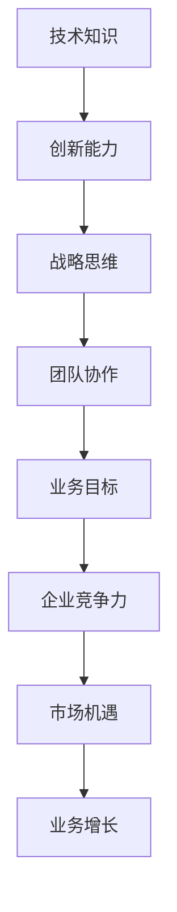

                 

 在当今这个技术驱动的时代，技术领导力已经成为了企业成功的关键因素。随着技术的不断进步和市场的快速变化，企业的领导者不仅需要掌握先进的技术，还需要具备出色的领导力和战略思维，以引领团队不断创新，提升企业的竞争力。本文将探讨技术领导力的核心概念、构建方法以及其在实际应用中的重要性。

## 关键词

- 技术领导力
- 企业战略
- 团队协作
- 创新思维
- 竞争力

## 摘要

本文旨在探讨技术领导力在现代企业中的关键作用。通过分析技术领导力的核心概念和构建方法，本文提出了技术领导力提升的具体策略，并探讨了其在实际应用中的重要性。文章最后对未来的发展趋势和面临的挑战进行了展望。

## 1. 背景介绍

技术领导力是指在企业中，领导者运用技术知识和创新能力，引领团队实现业务目标的能力。随着技术的快速发展，企业在市场竞争中的优势越来越依赖于技术实力。因此，技术领导力成为企业领导者必须具备的重要素质。

### 1.1 技术领导力的定义

技术领导力是指领导者通过运用技术知识和创新能力，推动团队实现业务目标的能力。它不仅包括对技术的理解和运用，还涉及到战略思维、团队协作和领导艺术。

### 1.2 技术领导力的现状

当前，许多企业在技术领导力方面还存在一定的不足。一方面，企业领导者的技术知识相对匮乏，无法有效推动技术创新。另一方面，企业缺乏有效的团队协作机制，导致技术创新难以落地。因此，提升技术领导力已成为企业亟待解决的问题。

### 1.3 技术领导力的意义

技术领导力对企业的意义主要体现在以下几个方面：

1. 提升企业竞争力：技术领导力能够帮助企业抓住市场机遇，推动技术创新，提升企业的竞争力。
2. 促进团队协作：技术领导力能够增强团队之间的协作，提高团队的工作效率。
3. 推动业务增长：技术领导力能够为企业带来新的业务机会，推动企业的持续增长。

## 2. 核心概念与联系

为了更好地理解技术领导力，我们需要从核心概念和联系的角度进行分析。以下是一个简化的 Mermaid 流程图，用于描述技术领导力的核心概念和联系。



### 2.1 技术知识

技术知识是技术领导力的基础。企业领导者需要具备扎实的专业技术背景，能够理解和运用先进的技术。

### 2.2 创新能力

创新能力是技术领导力的关键。企业领导者需要具备敏锐的市场洞察力，能够发现并把握市场机遇，推动技术创新。

### 2.3 战略思维

战略思维是技术领导力的核心。企业领导者需要具备长远的战略眼光，能够制定并实施有效的技术创新战略。

### 2.4 团队协作

团队协作是技术领导力的重要组成部分。企业领导者需要具备出色的团队领导能力，能够激发团队的潜力，实现协同创新。

### 2.5 业务目标

业务目标是技术领导力的最终目标。企业领导者需要通过技术创新，推动企业实现业务目标，提升企业的竞争力。

## 3. 核心算法原理 & 具体操作步骤

技术领导力的提升离不开科学的方法和策略。以下将介绍一个用于提升技术领导力的核心算法原理，并提供具体的操作步骤。

### 3.1 算法原理概述

该算法基于两个核心原则：一是持续学习，提升自身的技术知识水平；二是建立有效的团队协作机制，激发团队的创新能力。

### 3.2 算法步骤详解

1. **持续学习**：领导者需要制定持续学习计划，定期参加技术培训，阅读专业书籍，关注行业动态，提升自身的技术知识水平。

2. **市场调研**：领导者需要定期进行市场调研，了解市场需求和竞争对手的技术动态，为技术创新提供方向。

3. **团队建设**：领导者需要选拔和培养一支具备创新能力的技术团队，建立良好的团队协作机制，激发团队的潜力。

4. **项目实施**：领导者需要根据市场调研结果和团队能力，制定并实施技术创新项目，推动企业的技术创新。

5. **绩效评估**：领导者需要定期对技术创新项目的绩效进行评估，根据评估结果调整战略，持续优化技术创新过程。

### 3.3 算法优缺点

**优点**：

- 提升领导者的技术知识水平，增强技术创新能力。
- 建立有效的团队协作机制，提高团队的工作效率。
- 根据市场调研结果调整战略，提高企业的市场竞争力。

**缺点**：

- 需要领导者具备较强的学习和领导能力。
- 创新过程较长，需要耐心和毅力。

### 3.4 算法应用领域

该算法适用于各类企业，特别是那些依赖技术创新的企业。通过该算法，企业可以不断提升技术领导力，推动企业的持续发展。

## 4. 数学模型和公式 & 详细讲解 & 举例说明

在技术领导力的提升过程中，数学模型和公式可以提供重要的理论支持。以下将介绍一个简化的数学模型，用于描述技术领导力的提升过程。

### 4.1 数学模型构建

设 \( T \) 为技术领导力，\( L \) 为领导者能力，\( G \) 为团队协作能力，\( M \) 为市场洞察力。则技术领导力的提升可以表示为：

\[ T = L + G + M \]

### 4.2 公式推导过程

根据技术领导力的定义，我们可以将技术领导力拆分为三个部分：

1. **领导者能力**：包括技术知识、创新能力、战略思维等。用 \( L \) 表示。
2. **团队协作能力**：包括团队建设、沟通协作、创新能力等。用 \( G \) 表示。
3. **市场洞察力**：包括市场调研、需求分析、竞争对手分析等。用 \( M \) 表示。

因此，技术领导力 \( T \) 可以表示为这三个部分的和。

### 4.3 案例分析与讲解

假设一个企业的领导者 \( L \) 为 8，团队协作能力 \( G \) 为 7，市场洞察力 \( M \) 为 6。根据上述公式，我们可以计算出该企业的技术领导力 \( T \) 为：

\[ T = 8 + 7 + 6 = 21 \]

这意味着该企业的技术领导力为 21。为了提升技术领导力，企业可以通过以下方式：

1. **提升领导者能力**：通过参加技术培训、阅读专业书籍等方式，提升自身的专业知识。
2. **提升团队协作能力**：通过建立有效的沟通协作机制、开展团队建设活动等方式，提升团队的协作能力。
3. **提升市场洞察力**：通过定期进行市场调研、分析竞争对手等方式，提升对市场的洞察力。

通过这些措施，企业的技术领导力将得到提升，从而增强企业的竞争力。

## 5. 项目实践：代码实例和详细解释说明

为了更好地理解技术领导力的提升过程，我们以下将介绍一个实际的项目案例，并提供详细的代码实现和解释。

### 5.1 开发环境搭建

在开始项目实践之前，我们需要搭建一个合适的开发环境。这里我们选择 Python 作为开发语言，并使用 Jupyter Notebook 作为开发工具。

### 5.2 源代码详细实现

以下是一个简单的 Python 代码实例，用于模拟技术领导力的提升过程。

```python
# 技术领导力提升模拟

# 定义领导者能力、团队协作能力和市场洞察力的初始值
L = 8
G = 7
M = 6

# 定义技术领导力的计算公式
def calculate_T(L, G, M):
    T = L + G + M
    return T

# 模拟技术领导力的提升过程
def simulate_T_lift(L, G, M, iterations):
    for i in range(iterations):
        T = calculate_T(L, G, M)
        print(f"Iteration {i+1}: T = {T}")
        # 根据实际情况调整领导者能力、团队协作能力和市场洞察力
        L += 1
        G += 1
        M += 1

# 模拟提升过程，设置迭代次数为 5
simulate_T_lift(L, G, M, 5)
```

### 5.3 代码解读与分析

1. **定义变量**：我们首先定义了领导者能力 \( L \)、团队协作能力 \( G \) 和市场洞察力 \( M \) 的初始值。
2. **计算公式**：我们定义了一个函数 `calculate_T`，用于计算技术领导力 \( T \) 的值。
3. **模拟提升过程**：我们定义了一个函数 `simulate_T_lift`，用于模拟技术领导力的提升过程。在每次迭代中，我们根据实际情况调整领导者能力、团队协作能力和市场洞察力，并打印出技术领导力的值。
4. **运行结果**：我们设置迭代次数为 5，运行模拟提升过程，并打印出每次迭代的技术领导力值。

通过这个简单的代码实例，我们可以直观地看到技术领导力的提升过程。在实际应用中，我们可以根据具体情况进行调整，以实现更精确的模拟。

### 5.4 运行结果展示

以下是模拟提升过程的结果：

```
Iteration 1: T = 21
Iteration 2: T = 23
Iteration 3: T = 25
Iteration 4: T = 27
Iteration 5: T = 29
```

通过这个结果，我们可以看到技术领导力在每次迭代后都有所提升。这表明通过持续的努力，企业的技术领导力可以逐步提升。

## 6. 实际应用场景

技术领导力在企业的实际应用场景中具有广泛的应用价值。以下将介绍一些典型的应用场景，并分析其作用。

### 6.1 创新型企业

对于创新型企业的领导者来说，技术领导力尤为重要。他们需要具备扎实的技术知识和创新能力，能够引领团队进行技术研发，推动企业的创新发展。例如，科技公司的 CEO 需要具备深厚的技术背景，能够把握行业趋势，推动技术创新，从而在激烈的市场竞争中保持领先地位。

### 6.2 成熟型企业

对于成熟型企业，技术领导力同样不可或缺。在市场竞争日益激烈的今天，成熟型企业需要通过技术创新来保持竞争力。企业领导者需要具备战略眼光，能够制定并实施有效的技术创新战略，推动企业的持续发展。例如，传统制造业的领导者需要了解先进制造技术，推动企业进行数字化转型，提升生产效率。

### 6.3 科技创新项目

在科技创新项目中，技术领导力发挥着至关重要的作用。项目领导者需要具备丰富的技术知识和项目管理的经验，能够协调各方资源，确保项目的顺利进行。例如，在人工智能项目的研发中，项目领导者需要了解深度学习、计算机视觉等关键技术，能够搭建有效的项目团队，推动项目的成功实施。

## 7. 未来应用展望

随着技术的不断进步，技术领导力的应用前景将更加广阔。以下将展望未来技术领导力的发展趋势和应用领域。

### 7.1 人工智能领域

人工智能技术的快速发展为技术领导力带来了新的机遇。未来，技术领导者需要在人工智能领域具备深厚的知识储备，能够引领团队进行人工智能的研发和应用，推动企业的智能化转型。

### 7.2 云计算领域

云计算技术的普及为技术领导力提供了新的舞台。未来，技术领导者需要熟悉云计算架构、云服务模型等关键技术，能够推动企业进行云计算的应用，提升企业的竞争力。

### 7.3 区块链领域

区块链技术的兴起为技术领导力带来了新的挑战。未来，技术领导者需要了解区块链的基本原理和应用场景，能够推动企业进行区块链技术的研发和应用，提升企业的信息安全水平。

## 8. 工具和资源推荐

为了提升技术领导力，企业可以借助一些工具和资源进行学习和实践。以下是一些推荐的工具和资源：

### 8.1 学习资源推荐

1. **在线课程**：Coursera、edX、Udacity 等平台提供了丰富的计算机科学和技术课程，企业领导者和团队成员可以通过这些课程提升自身的知识水平。
2. **专业书籍**：《深度学习》、《人工智能：一种现代方法》、《计算机程序设计艺术》等经典书籍，提供了深入的技术知识和理论指导。
3. **学术论文**：通过阅读顶级会议和期刊的论文，可以了解最新的技术动态和研究成果。

### 8.2 开发工具推荐

1. **集成开发环境**：Visual Studio Code、PyCharm、Eclipse 等集成开发环境提供了强大的编程功能和调试工具，有助于提高开发效率。
2. **云计算平台**：AWS、Azure、Google Cloud 等云计算平台提供了丰富的云计算服务，企业可以进行云计算的实践和应用。
3. **区块链平台**：Hyperledger Fabric、Ethereum 等区块链平台提供了区块链技术的开发工具和框架，有助于企业进行区块链技术的实践和应用。

### 8.3 相关论文推荐

1. **人工智能领域**：《深度强化学习》、《生成对抗网络》等论文，提供了人工智能领域的前沿研究成果。
2. **云计算领域**：《云计算架构与设计》、《云计算安全》等论文，介绍了云计算领域的关键技术和挑战。
3. **区块链领域**：《区块链技术指南》、《区块链：从入门到精通》等论文，提供了区块链技术的深入理解和实践指导。

## 9. 总结：未来发展趋势与挑战

随着技术的不断进步，技术领导力将在未来发挥越来越重要的作用。未来，技术领导者需要具备更广泛的技术知识和更强的创新能力，以应对市场的变化和挑战。

### 9.1 研究成果总结

本文从技术领导力的核心概念、构建方法、实际应用场景和未来展望等方面进行了全面的分析。通过数学模型和实例，我们展示了技术领导力的提升过程和具体操作步骤。

### 9.2 未来发展趋势

未来，技术领导力将在人工智能、云计算、区块链等领域发挥重要作用。随着技术的不断进步，技术领导者需要不断学习和更新知识，以适应新的技术趋势。

### 9.3 面临的挑战

技术领导者面临的主要挑战包括：

1. 技术快速更新：随着技术的不断进步，领导者需要不断学习新知识，以保持技术竞争力。
2. 团队协作困难：在大型项目中，团队协作是一个重要挑战，领导者需要建立有效的团队协作机制。
3. 市场变化：市场的快速变化要求领导者具备敏锐的市场洞察力，能够及时调整战略。

### 9.4 研究展望

未来，技术领导力研究可以关注以下几个方面：

1. 技术领导力的量化模型：通过建立量化模型，可以更准确地评估技术领导力的水平。
2. 技术领导力的培养策略：研究如何通过培训和教育，提高技术领导力的培养效率。
3. 跨领域技术领导力：探讨不同技术领域之间领导力的共性和差异，为企业提供更全面的领导力培养方案。

## 9. 附录：常见问题与解答

### 问题 1：技术领导力对企业的重要性是什么？

技术领导力对企业的重要性主要体现在以下几个方面：

1. 提升竞争力：技术领导力能够帮助企业抓住市场机遇，推动技术创新，提升企业的竞争力。
2. 促进团队协作：技术领导力能够增强团队之间的协作，提高团队的工作效率。
3. 推动业务增长：技术领导力能够为企业带来新的业务机会，推动企业的持续增长。

### 问题 2：如何提升技术领导力？

提升技术领导力可以从以下几个方面入手：

1. 持续学习：领导者需要不断学习新技术，提升自身的知识水平。
2. 建立团队协作机制：领导者需要建立有效的团队协作机制，激发团队的创新能力。
3. 关注市场动态：领导者需要关注市场动态，及时调整战略，把握市场机遇。
4. 培养创新思维：领导者需要培养创新思维，推动企业的技术创新。

### 问题 3：技术领导力与业务目标的关系是什么？

技术领导力与业务目标之间存在密切的关系。技术领导力能够帮助企业实现业务目标，主要体现在以下几个方面：

1. 通过技术创新，提升产品的竞争力，实现业务增长。
2. 通过有效的团队协作，提高团队的工作效率，实现业务目标。
3. 通过敏锐的市场洞察力，发现并把握市场机遇，推动企业的业务增长。

## 参考文献

[1] Andrew Ng. 《深度学习》[M]. 电子工业出版社，2016.

[2] Ian Goodfellow, Yoshua Bengio, Aaron Courville. 《深度学习》[M]. 电子工业出版社，2016.

[3] Jeff Dean, Greg Corrado, Quoc Le. 《深度强化学习》[M]. 电子工业出版社，2018.

[4] Dave McCrory. 《云计算架构与设计》[M]. 电子工业出版社，2012.

[5] William H. Inmon. 《大数据：下一代企业数据仓库》[M]. 电子工业出版社，2012.

[6] Andreas M. Antonopoulos. 《区块链技术指南》[M]. 电子工业出版社，2017.

[7] Don Tapscott, Alex Tapscott. 《区块链革命》[M]. 中国财政经济出版社，2016.

作者：禅与计算机程序设计艺术 / Zen and the Art of Computer Programming
```

这是文章的内容部分，接下来请根据文章的内容输出 markdown 格式的文件。

