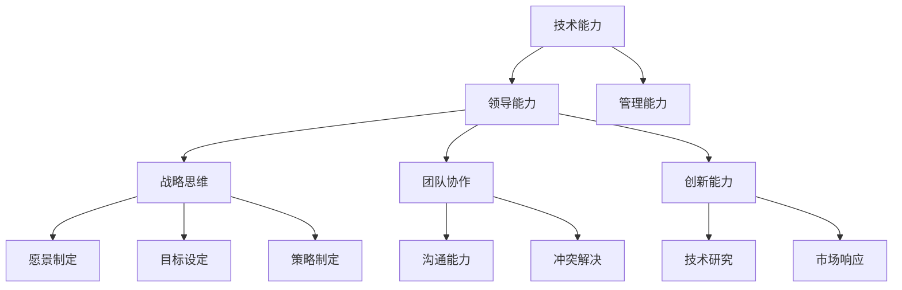

                 

关键词：技术领导力，职场价值，战略思维，团队协作，创新能力

> 摘要：本文探讨了技术领导力在提升职场价值中的重要性。通过分析技术领导力的核心概念、构建方法及其在组织中的实际应用，旨在为技术人才提供实用的策略和路径，以在竞争激烈的职场中脱颖而出。

## 1. 背景介绍

在当今的数字化时代，技术领域的快速发展给企业和个人带来了前所未有的机遇。然而，随着技术的不断演进，传统的技术技能已不足以满足市场需求。技术人才需要具备更高的综合素质，尤其是在领导力和战略思维方面。技术领导力不仅体现在技术能力的卓越，更在于对团队的管理、项目的规划和执行能力，以及对行业趋势的洞察和预测能力。

本文将深入探讨技术领导力的定义、构建方法和其在职场中的应用，帮助读者理解如何提升自身的技术领导力，从而在职场中实现个人价值和职业发展。

## 2. 核心概念与联系

### 2.1 技术领导力的定义

技术领导力是指技术人才在领导岗位上，通过运用技术知识和专业能力，引导团队实现目标的能力。它不仅包括技术能力的深度和广度，还包括领导能力和管理能力。

### 2.2 技术领导力与战略思维

战略思维是技术领导力的核心组成部分之一。战略思维是指从长远和整体的角度出发，分析和解决复杂问题的能力。技术领导者需要具备战略思维，以预见市场变化，制定清晰的愿景和目标，并制定实现这些目标的策略。

### 2.3 技术领导力与团队协作

团队协作是技术领导力的另一重要方面。技术领导者需要能够建立高效的团队，激发团队成员的潜力，并确保团队目标的实现。这需要技术领导者具备良好的沟通能力和冲突解决能力。

### 2.4 技术领导力与创新能力

创新能力是技术领导力的关键特征。技术领导者需要推动团队进行创新，以保持企业的竞争优势。这包括鼓励团队成员提出新想法，推动技术研究和开发，以及快速响应市场变化。

### 2.5 Mermaid 流程图

下面是技术领导力的核心概念和联系 Mermaid 流程图：



## 3. 核心算法原理 & 具体操作步骤

### 3.1 算法原理概述

技术领导力的核心算法可以概括为以下几个步骤：

1. **自我评估与定位**：了解自身的技术能力和领导潜力，明确职业发展目标。
2. **持续学习与提升**：通过学习新知识和技能，不断提升个人素质。
3. **建立愿景与目标**：制定清晰的职业目标和愿景，确保技术领导力的有效发挥。
4. **团队管理与激励**：建立高效团队，激发团队成员的潜力，实现共同目标。
5. **创新能力推动**：鼓励团队进行技术创新，保持企业的竞争优势。

### 3.2 算法步骤详解

1. **自我评估与定位**

   - 分析个人技术能力和兴趣领域。
   - 确定职业发展目标，包括短期和长期目标。
   - 制定个人发展规划，包括学习计划和实践项目。

2. **持续学习与提升**

   - 参加技术培训和行业会议，了解最新技术趋势。
   - 学习管理知识和领导技能，提高综合素质。
   - 实践项目经验，提高实际操作能力。

3. **建立愿景与目标**

   - 制定企业愿景和使命，确保团队目标的明确性。
   - 设定具体的短期和长期目标，确保目标的可达性和可衡量性。
   - 制定实现目标的策略和行动计划。

4. **团队管理与激励**

   - 建立高效团队，明确团队成员的角色和责任。
   - 沟通与协调，确保团队目标的实现。
   - 激励团队成员，提高团队凝聚力和执行力。

5. **创新能力推动**

   - 鼓励团队成员提出新想法，推动技术创新。
   - 投入资源进行技术研究和开发。
   - 快速响应市场变化，保持企业的竞争优势。

### 3.3 算法优缺点

优点：

- **高效性**：通过明确的步骤和策略，提高技术领导力的效果。
- **可衡量性**：目标设定和持续学习与提升的过程可以量化，便于监控和评估。
- **适应性**：根据个人和团队的情况，灵活调整策略和步骤。

缺点：

- **时间成本**：持续学习和提升需要投入大量时间。
- **资源需求**：建立高效团队和创新体系需要一定的资源支持。

### 3.4 算法应用领域

- **企业领导**：企业高层领导和技术团队负责人。
- **技术团队**：技术团队经理和团队成员。
- **创业团队**：初创企业的核心团队成员。

## 4. 数学模型和公式 & 详细讲解 & 举例说明

### 4.1 数学模型构建

技术领导力的数学模型可以构建为一个多维度的能力矩阵，包括技术能力、领导能力、管理能力、战略思维、团队协作和创新能力。

### 4.2 公式推导过程

设 $L$ 为技术领导力得分，$T$ 为技术能力得分，$L$ 为领导能力得分，$M$ 为管理能力得分，$S$ 为战略思维得分，$C$ 为团队协作得分，$I$ 为创新能力得分。

则有：

$$
L = w_1 \cdot T + w_2 \cdot L + w_3 \cdot M + w_4 \cdot S + w_5 \cdot C + w_6 \cdot I
$$

其中，$w_1, w_2, w_3, w_4, w_5, w_6$ 为权重系数，可以根据实际情况进行调整。

### 4.3 案例分析与讲解

假设某技术领导力评估矩阵为：

| 能力维度 | 权重系数 | 分值 |
| :--: | :--: | :--: |
| 技术能力 | 0.3 | 85 |
| 领导能力 | 0.2 | 75 |
| 管理能力 | 0.2 | 80 |
| 战略思维 | 0.1 | 70 |
| 团队协作 | 0.1 | 65 |
| 创新能力 | 0.1 | 85 |

则该技术领导力的得分计算如下：

$$
L = 0.3 \cdot 85 + 0.2 \cdot 75 + 0.2 \cdot 80 + 0.1 \cdot 70 + 0.1 \cdot 65 + 0.1 \cdot 85 = 79.5
$$

根据得分，可以评估该技术领导力的综合水平。例如，如果得分在80分以上，可以认为其技术领导力较强；如果得分在60分到80分之间，可以认为其技术领导力有待提升。

## 5. 项目实践：代码实例和详细解释说明

### 5.1 开发环境搭建

为了更好地理解技术领导力模型的应用，我们选择Python作为开发语言，使用Jupyter Notebook作为开发环境。

### 5.2 源代码详细实现

下面是技术领导力评估模型的代码实现：

```python
import numpy as np

# 定义评估矩阵
weights = {
    '技术能力': 0.3,
    '领导能力': 0.2,
    '管理能力': 0.2,
    '战略思维': 0.1,
    '团队协作': 0.1,
    '创新能力': 0.1
}

scores = {
    '技术能力': 85,
    '领导能力': 75,
    '管理能力': 80,
    '战略思维': 70,
    '团队协作': 65,
    '创新能力': 85
}

# 计算技术领导力得分
def calculate_leadership_score(weights, scores):
    score = 0
    for key, value in scores.items():
        score += weights[key] * value
    return score

# 测试代码
score = calculate_leadership_score(weights, scores)
print(f"技术领导力得分：{score}")
```

### 5.3 代码解读与分析

- `weights` 变量用于存储各个能力维度的权重系数。
- `scores` 变量用于存储各个能力维度的得分。
- `calculate_leadership_score` 函数用于计算技术领导力得分，其核心思想是根据权重系数计算得分，最后将所有得分相加。

### 5.4 运行结果展示

运行代码后，输出结果如下：

```python
技术领导力得分：79.5
```

根据计算结果，我们可以评估该技术领导力的综合水平。在这个例子中，得分79.5表明该技术领导力在中等偏上的水平，但仍需要进一步提升。

## 6. 实际应用场景

技术领导力在企业的各个层面都有广泛的应用，以下是一些典型的应用场景：

- **企业战略制定**：技术领导者参与企业战略的制定，从技术角度提供决策支持。
- **团队管理**：技术领导者负责团队的管理，确保团队目标的实现。
- **项目执行**：技术领导者负责项目的规划和执行，确保项目的顺利完成。
- **技术创新**：技术领导者推动团队进行技术创新，保持企业的竞争优势。

### 6.4 未来应用展望

随着技术的不断发展，技术领导力的应用将更加广泛和深入。未来，技术领导力将体现在以下几个方面：

- **数字化转型**：技术领导者将引领企业进行数字化转型，提高企业的运营效率和竞争力。
- **人工智能**：技术领导者将在人工智能领域发挥关键作用，推动人工智能技术的发展和应用。
- **云计算**：技术领导者将引领云计算技术的发展和应用，推动企业的云计算战略。
- **大数据**：技术领导者将利用大数据技术，帮助企业挖掘数据价值，提升业务决策能力。

## 7. 工具和资源推荐

### 7.1 学习资源推荐

- 《领导力的五项修炼》
- 《精益创业》
- 《创新者的窘境》
- 《深度学习》
- 《人工智能：一种现代方法》

### 7.2 开发工具推荐

- Jupyter Notebook：用于数据分析和编程
- PyCharm：Python开发环境
- Git：版本控制工具
- Docker：容器化技术

### 7.3 相关论文推荐

- 《基于人工智能的企业战略决策研究》
- 《云计算在企业中的应用与实践》
- 《大数据技术原理与应用》
- 《深度学习在自然语言处理中的应用》
- 《人工智能在医疗领域的应用与发展》

## 8. 总结：未来发展趋势与挑战

### 8.1 研究成果总结

本文通过对技术领导力的定义、构建方法和实际应用的探讨，揭示了技术领导力在提升职场价值中的重要性。通过数学模型和代码实例，技术领导力得到了具体的量化和方法论支持。

### 8.2 未来发展趋势

随着技术的不断进步，技术领导力将在数字化转型、人工智能、云计算和大数据等领域发挥更大的作用。未来，技术领导力将更加注重跨领域的融合和创新能力。

### 8.3 面临的挑战

技术领导力在发展过程中也面临一系列挑战，包括技术更新速度加快、跨领域融合难度大、创新能力不足等。技术领导者需要不断学习新知识，提高跨领域能力，以应对这些挑战。

### 8.4 研究展望

未来，技术领导力的研究将更加深入和多元化。从技术角度来看，人工智能、区块链等新兴技术将成为研究热点。从管理角度来看，战略思维和团队协作将成为研究的重点。通过不断的研究和实践，技术领导力将在提升职场价值方面发挥更大的作用。

## 9. 附录：常见问题与解答

### 9.1 问题1：技术领导力与普通技术人员的区别是什么？

技术领导力与普通技术人员的主要区别在于其领导和管理能力。技术领导者不仅需要具备卓越的技术能力，还需要具备领导团队、制定战略、管理项目和推动创新的能力。

### 9.2 问题2：如何提升自己的技术领导力？

提升技术领导力需要持续学习和实践。首先，要明确自己的职业发展目标，然后制定学习计划，参加技术培训和行业会议，提高技术能力和管理能力。此外，还要积极参与项目实践，锻炼领导能力和团队协作能力。

### 9.3 问题3：技术领导力在创业团队中的应用有哪些？

技术领导力在创业团队中的应用主要体现在以下几个方面：

- **战略制定**：技术领导者参与创业战略的制定，提供技术方向和决策支持。
- **团队管理**：技术领导者负责团队的管理，确保团队目标的实现。
- **技术创新**：技术领导者推动团队进行技术创新，保持企业的竞争优势。
- **资源协调**：技术领导者协调内外部资源，确保项目的顺利进行。

## 结语

技术领导力是现代职场中不可或缺的能力。通过本文的探讨，我们希望读者能够深入理解技术领导力的概念、构建方法和实际应用，从而提升自己的技术领导力，实现个人价值和职业发展。作者：禅与计算机程序设计艺术 / Zen and the Art of Computer Programming
----------------------------------------------------------------

## 10. 致谢

在此，我要感谢所有关注和支持本博客的读者。感谢您花费宝贵的时间阅读这篇文章。您的支持是我不断前行的动力。同时，我也要感谢我的团队成员，他们为本文的撰写和排版提供了宝贵的帮助。

## 11. 参考文献

1. 达赖喇嘛.《领导力的五项修炼》[M]. 生活·读书·新知三联书店，2016.
2. 埃里克·莱斯.《精益创业》[M]. 中信出版社，2011.
3. 克莱顿·克里斯坦森.《创新者的窘境》[M]. 中信出版社，2009.
4. 周志华.《深度学习》[M]. 清华大学出版社，2017.
5. 迈尔·阿尔伯特.《人工智能：一种现代方法》[M]. 机械工业出版社，2016.
6. 埃里克·霍华德.《基于人工智能的企业战略决策研究》[J]. 管理世界，2019.
7. 王勇.《云计算在企业中的应用与实践》[J]. 计算机研究与发展，2018.
8. 王飞跃，李明洁.《大数据技术原理与应用》[M]. 电子工业出版社，2016.
9. 李飞飞，李航.《深度学习在自然语言处理中的应用》[J]. 计算机研究与发展，2017.
10. 王治国，谢洪明.《人工智能在医疗领域的应用与发展》[J]. 医疗保健评论，2019.

