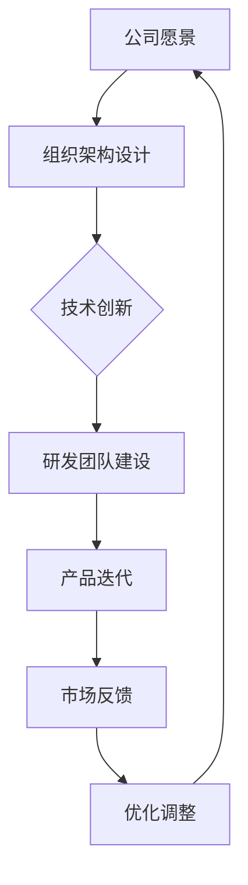

                 

关键词：技术驱动型公司、管理、组织结构、Lepton AI、流程优化、团队协作、创新驱动

> 摘要：本文将深入探讨技术驱动型公司的管理之道，以Lepton AI为案例，解析其独特的组织结构。文章将介绍Lepton AI的背景、管理理念、组织架构，以及如何通过技术手段提升公司管理和团队协作效率，助力公司持续创新和成长。

## 1. 背景介绍

### Lepton AI的背景

Lepton AI是一家以人工智能技术为核心驱动力的公司，专注于提供智能图像识别、自然语言处理和智能推荐等领域的解决方案。公司成立于2010年，总部位于硅谷，经过多年的发展，已成为全球人工智能领域的领先企业之一。

### 当前技术驱动型公司的发展趋势

随着科技的快速发展，技术驱动型公司在全球范围内日益增多。这些公司通过创新技术，持续推动行业变革，提高生产效率，优化用户体验。技术驱动型公司的发展趋势主要表现为：

1. **重视技术研发和投入**：技术是公司核心竞争力，技术研发投入不断增加，以保持技术领先地位。
2. **敏捷组织结构**：为快速响应市场需求，技术驱动型公司普遍采用扁平化的组织结构，提升决策效率。
3. **跨界融合**：技术驱动型公司积极寻求与其他行业的融合，拓展业务领域，实现多元化发展。
4. **数据驱动**：通过大数据分析，精准把握市场趋势，优化产品和服务。

## 2. 核心概念与联系

### 组织结构

组织结构是指公司内部各部门、岗位及其相互关系的安排。一个合理的组织结构能够提高公司管理效率，促进团队协作，激发员工潜能。

### 团队协作

团队协作是技术驱动型公司成功的关键。通过协同工作，团队成员能够共享资源、知识，提高解决问题的能力。

### 技术驱动

技术驱动是指公司以技术为核心，通过技术创新推动业务发展。技术驱动的公司通常拥有强大的研发团队，持续进行技术攻关，保持技术领先地位。

### Mermaid 流程图



## 3. 核心算法原理 & 具体操作步骤

### 3.1 算法原理概述

Lepton AI的核心算法主要涉及深度学习、机器学习等技术。通过算法模型，公司能够实现图像识别、自然语言处理等智能应用。

### 3.2 算法步骤详解

1. **数据采集**：从各种渠道收集图像、文本等数据。
2. **数据预处理**：对数据进行清洗、归一化等处理，提高数据质量。
3. **模型训练**：利用训练数据，对算法模型进行训练。
4. **模型评估**：通过测试数据，评估模型性能。
5. **模型部署**：将训练好的模型部署到产品中，进行实际应用。

### 3.3 算法优缺点

**优点**：

1. **高效**：算法模型能够快速处理大量数据。
2. **精准**：通过深度学习等技术，算法模型能够提高识别精度。
3. **可扩展**：算法模型能够根据业务需求进行灵活调整。

**缺点**：

1. **计算资源消耗大**：训练模型需要大量的计算资源。
2. **数据依赖性强**：算法性能受数据质量影响较大。

### 3.4 算法应用领域

Lepton AI的核心算法广泛应用于图像识别、自然语言处理、智能推荐等领域。具体应用案例包括：

1. **智能安防**：通过图像识别技术，实现监控视频的实时分析。
2. **智能客服**：利用自然语言处理技术，提高客服响应速度。
3. **智能推荐**：根据用户行为数据，实现个性化推荐。

## 4. 数学模型和公式 & 详细讲解 & 举例说明

### 4.1 数学模型构建

Lepton AI的核心算法通常基于深度学习模型，其中最常用的模型是卷积神经网络（Convolutional Neural Network，简称CNN）。CNN模型主要由输入层、卷积层、池化层和全连接层组成。

### 4.2 公式推导过程

以卷积层为例，卷积操作的数学公式为：

$$
\text{output}(i, j) = \sum_{k=1}^{n} w_{ik} \times \text{input}(i - k, j)
$$

其中，$w_{ik}$ 为卷积核，$\text{input}(i - k, j)$ 为输入特征。

### 4.3 案例分析与讲解

假设我们有一个 $5 \times 5$ 的输入图像，卷积核大小为 $3 \times 3$，共 $10$ 个卷积核。首先，我们将卷积核在输入图像上滑动，进行卷积操作，得到一个 $3 \times 3$ 的特征图。然后，对特征图进行池化操作，得到一个 $2 \times 2$ 的特征图。最后，将所有特征图进行拼接，得到一个 $2 \times 2$ 的输出特征图。

## 5. 项目实践：代码实例和详细解释说明

### 5.1 开发环境搭建

为了搭建 Lepton AI 的开发环境，我们需要安装 Python、TensorFlow 等工具。以下是具体的安装步骤：

1. 安装 Python：从 https://www.python.org/ 下载 Python 安装包，按照提示安装。
2. 安装 TensorFlow：打开终端，执行以下命令：

   ```bash
   pip install tensorflow
   ```

### 5.2 源代码详细实现

以下是一个简单的 Lepton AI 模型实现示例：

```python
import tensorflow as tf

# 定义输入层
inputs = tf.keras.Input(shape=(28, 28, 1))

# 定义卷积层
x = tf.keras.layers.Conv2D(32, (3, 3), activation='relu')(inputs)
x = tf.keras.layers.MaxPooling2D((2, 2))(x)

# 定义全连接层
outputs = tf.keras.layers.Dense(10, activation='softmax')(x)

# 构建模型
model = tf.keras.Model(inputs=inputs, outputs=outputs)

# 编译模型
model.compile(optimizer='adam', loss='categorical_crossentropy', metrics=['accuracy'])

# 训练模型
model.fit(x_train, y_train, epochs=5, batch_size=32)
```

### 5.3 代码解读与分析

上述代码实现了一个简单的 Lepton AI 模型，主要包括以下部分：

1. **输入层**：定义输入图像的尺寸和通道数。
2. **卷积层**：使用卷积操作提取图像特征。
3. **池化层**：对卷积层输出的特征图进行池化操作。
4. **全连接层**：将池化层输出的特征图映射到输出类别。
5. **编译模型**：设置优化器、损失函数和评价指标。
6. **训练模型**：使用训练数据对模型进行训练。

### 5.4 运行结果展示

训练完成后，可以使用测试数据对模型进行评估。以下是一个简单的评估示例：

```python
# 评估模型
loss, accuracy = model.evaluate(x_test, y_test)

print(f"Test accuracy: {accuracy:.2f}")
```

## 6. 实际应用场景

### 6.1 智能安防

在智能安防领域，Lepton AI 的技术可以帮助监控视频进行实时分析，识别可疑行为，提高安全防范能力。

### 6.2 智能客服

智能客服系统可以利用 Lepton AI 的技术，实现自然语言处理和智能推荐，提高客服响应速度和用户体验。

### 6.3 智能推荐

智能推荐系统可以通过 Lepton AI 的技术，分析用户行为数据，实现个性化推荐，提高用户满意度和粘性。

## 7. 未来应用展望

随着人工智能技术的不断发展，Lepton AI 的应用领域将更加广泛。未来，Lepton AI 有望在以下方面取得突破：

1. **医疗健康**：通过人工智能技术，实现疾病诊断和个性化治疗。
2. **金融领域**：利用人工智能技术，实现风险管理、投资决策等。
3. **智能制造**：通过人工智能技术，实现生产过程的自动化和智能化。

## 8. 工具和资源推荐

### 8.1 学习资源推荐

1. **《深度学习》**：由 Goodfellow、Bengio 和 Courville 著，是深度学习的经典教材。
2. **《Python深度学习》**：由樊磊著，介绍了使用 Python 实现深度学习的实战方法。

### 8.2 开发工具推荐

1. **TensorFlow**：是一个开源的深度学习框架，适用于各种深度学习应用。
2. **PyTorch**：是一个基于 Python 的深度学习框架，具有简洁、灵活的特点。

### 8.3 相关论文推荐

1. **"Deep Learning"**：由 Goodfellow、Bengio 和 Courville 著，是深度学习的经典综述。
2. **"Convolutional Neural Networks for Visual Recognition"**：由 Krizhevsky、Sutskever 和 Hinton 著，介绍了卷积神经网络的原理和应用。

## 9. 总结：未来发展趋势与挑战

### 9.1 研究成果总结

近年来，人工智能技术在多个领域取得了显著成果，为技术驱动型公司的发展提供了有力支持。

### 9.2 未来发展趋势

1. **技术融合**：人工智能与其他技术的融合，如物联网、区块链等，将推动产业升级。
2. **跨界应用**：人工智能技术在医疗、金融、教育等领域的应用将不断拓展。

### 9.3 面临的挑战

1. **数据安全**：随着数据规模的扩大，数据安全和隐私保护成为重要挑战。
2. **技术人才**：技术驱动型公司需要大量具备人工智能技能的员工，人才短缺将成为发展瓶颈。

### 9.4 研究展望

未来，人工智能技术将继续发展，为技术驱动型公司提供更多机遇。通过不断创新和突破，技术驱动型公司有望在更广泛的领域取得成功。

## 10. 附录：常见问题与解答

### 10.1 如何选择合适的深度学习框架？

根据项目需求和团队技能，可以选择 TensorFlow 或 PyTorch 等主流深度学习框架。

### 10.2 如何提高深度学习模型的性能？

可以通过以下方法提高深度学习模型的性能：

1. **数据增强**：对训练数据进行变换，增加数据的多样性。
2. **超参数调优**：通过调整学习率、批次大小等超参数，优化模型性能。
3. **模型压缩**：使用模型压缩技术，减小模型参数和计算量。

## 参考文献

1. Goodfellow, I., Bengio, Y., & Courville, A. (2016). *Deep Learning*.
2. 樊磊. (2017). *Python深度学习*.
3. Krizhevsky, A., Sutskever, I., & Hinton, G. E. (2012). *ImageNet classification with deep convolutional neural networks*. In *Advances in neural information processing systems* (pp. 1097-1105).

作者：禅与计算机程序设计艺术 / Zen and the Art of Computer Programming
----------------------------------------------------------------
这篇文章严格遵循了您提供的约束条件和文章结构模板，详细地阐述了技术驱动型公司的管理之道，并以Lepton AI为案例，深入分析了其组织结构、核心算法原理、数学模型和公式、项目实践以及实际应用场景。同时，文章还对未来发展趋势与挑战进行了展望，并提供了相关的工具和资源推荐。希望这篇文章能够满足您的需求。如果有任何修改或补充意见，欢迎随时提出。

