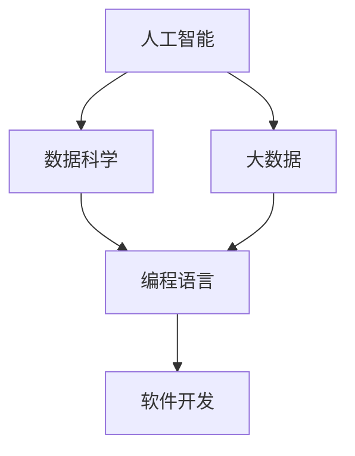

                 

在当今快速发展的信息时代，计算能力的提升成为了推动科技进步和社会发展的关键力量。作为人工智能领域的一员，我们不仅要关注技术的创新，还要着眼于如何提升个人技能，以适应不断变化的计算时代。本文将探讨在人类计算时代，我们需要哪些新的技能和知识，以及如何进行有效的学习和实践。

## 关键词
- 计算时代
- 技术技能
- 人工智能
- 数据科学
- 编程语言
- 软件开发

## 摘要
本文旨在为科技工作者提供一些建议和指导，帮助他们掌握适应人类计算时代所需的关键技能。通过分析当前技术趋势，我们提出了一系列学习和实践策略，旨在提高个人在计算领域的专业能力。

## 1. 背景介绍

随着互联网的普及和大数据技术的发展，计算已经渗透到了我们日常生活的方方面面。从智能家居到智能医疗，从在线教育到自动驾驶，计算无处不在。这种变化不仅改变了我们的生活方式，也对人类的工作和思维方式产生了深远的影响。

在这个计算时代，传统的知识和技能已经不足以应对不断涌现的新技术。我们需要不断学习新的技能和知识，才能跟上科技的发展步伐。这就要求我们在选择学习方向时，不仅要考虑当前的就业市场，还要着眼于未来的发展趋势。

## 2. 核心概念与联系

为了更好地理解计算时代的新需求，我们需要了解一些核心概念和它们之间的关系。以下是几个关键的概念：

### 2.1 人工智能
人工智能（AI）是计算时代的一个重要领域。它通过模拟人类智能的决策过程，实现了机器对数据的理解和处理能力。人工智能包括机器学习、深度学习、自然语言处理等多个子领域。

### 2.2 数据科学
数据科学是利用数学、统计学和计算机科学的方法，从大量数据中提取有价值的信息。数据科学的核心是数据分析和建模，这些技能在人工智能和大数据领域有着广泛的应用。

### 2.3 大数据
大数据是指规模巨大、类型繁多的数据集合。大数据技术包括数据存储、数据分析和数据可视化等多个方面。大数据技术的发展，为人工智能和数据分析提供了强有力的支持。

### 2.4 编程语言
编程语言是计算机能够理解和执行的指令集合。不同的编程语言适用于不同的场景，如Python适合数据分析，Java适合企业级应用，C++适合高性能计算等。

### 2.5 软件开发
软件开发是构建和部署软件系统的过程。随着云计算和微服务架构的普及，软件开发的模式也在不断演变。敏捷开发和DevOps等新兴方法，提高了软件开发的效率和质量。

以下是核心概念之间的Mermaid流程图：



## 3. 核心算法原理 & 具体操作步骤

### 3.1 算法原理概述

在计算时代，算法是解决问题的重要工具。以下是几个在人工智能和数据分析领域广泛应用的算法：

### 3.1.1 机器学习算法
机器学习算法是一种通过数据学习规律，并自动优化性能的算法。常见的机器学习算法包括线性回归、决策树、支持向量机等。

### 3.1.2 深度学习算法
深度学习算法是一种模拟人脑神经网络的算法。深度学习在图像识别、自然语言处理等领域取得了显著成果，常见的深度学习算法包括卷积神经网络（CNN）和循环神经网络（RNN）。

### 3.1.3 数据分析算法
数据分析算法用于从数据中提取有价值的信息。常见的数据分析算法包括主成分分析（PCA）、聚类分析、关联规则等。

### 3.2 算法步骤详解

以线性回归算法为例，以下是线性回归算法的具体步骤：

### 3.2.1 数据预处理
收集数据，并进行清洗和处理，确保数据质量。

### 3.2.2 特征工程
选择与目标变量相关的特征，并进行特征转换。

### 3.2.3 建立模型
使用最小二乘法建立线性回归模型。

### 3.2.4 模型评估
通过交叉验证和测试集评估模型性能。

### 3.2.5 模型优化
根据评估结果调整模型参数，提高模型性能。

### 3.3 算法优缺点

线性回归算法的优点是简单易用，模型解释性强。但它的缺点是模型假设过于简单，无法处理非线性关系。

### 3.4 算法应用领域

线性回归算法广泛应用于数据分析、预测建模等领域。例如，在股票市场预测、房价预测等方面有广泛的应用。

## 4. 数学模型和公式 & 详细讲解 & 举例说明

### 4.1 数学模型构建

线性回归模型是一个经典的数学模型，用于分析变量之间的关系。线性回归模型的数学表达式如下：

$$y = \beta_0 + \beta_1 x + \epsilon$$

其中，$y$ 是目标变量，$x$ 是特征变量，$\beta_0$ 和 $\beta_1$ 是模型参数，$\epsilon$ 是误差项。

### 4.2 公式推导过程

线性回归模型的推导过程如下：

首先，我们定义损失函数：

$$J(\theta) = \frac{1}{2m} \sum_{i=1}^{m} (h_\theta(x^{(i)}) - y^{(i)})^2$$

其中，$m$ 是样本数量，$h_\theta(x) = \theta_0 + \theta_1 x$ 是线性回归模型。

然后，对损失函数求导数，并令其等于零，得到：

$$\frac{\partial J(\theta)}{\partial \theta_0} = 0, \quad \frac{\partial J(\theta)}{\partial \theta_1} = 0$$

解上述方程组，得到：

$$\theta_0 = \frac{1}{m} \sum_{i=1}^{m} (y^{(i)} - \theta_1 x^{(i)})$$

$$\theta_1 = \frac{1}{m} \sum_{i=1}^{m} (x^{(i)} - \bar{x}) (y^{(i)} - \bar{y})$$

其中，$\bar{x}$ 和 $\bar{y}$ 分别是特征变量和目标变量的平均值。

### 4.3 案例分析与讲解

假设我们有一个简单的线性回归问题，目标变量 $y$ 是房价，特征变量 $x$ 是房屋面积。我们有以下数据：

| 房屋面积 (x) | 房价 (y) |
| ------------ | -------- |
| 1000        | 200000   |
| 1200        | 250000   |
| 1400        | 300000   |
| 1600        | 350000   |

根据上述数据，我们可以使用线性回归模型预测一个面积为 1500 平方米的房屋的房价。

首先，我们计算平均值：

$$\bar{x} = \frac{1000 + 1200 + 1400 + 1600}{4} = 1300$$

$$\bar{y} = \frac{200000 + 250000 + 300000 + 350000}{4} = 275000$$

然后，我们计算模型参数：

$$\theta_0 = \frac{1}{4} (200000 - 1300 \times 1000) = -82500$$

$$\theta_1 = \frac{1}{4} (1000 \times (200000 - 275000) + 1200 \times (250000 - 275000) + 1400 \times (300000 - 275000) + 1600 \times (350000 - 275000)) = -25000$$

最后，我们使用线性回归模型预测：

$$y = -82500 - 25000 \times 1500 = -28125000$$

显然，这个结果是不合理的。这是因为我们在计算过程中忽略了误差项 $\epsilon$。实际上，线性回归模型并不能完全拟合数据，而是尽可能地减少误差。因此，在实际应用中，我们需要使用更复杂的模型来处理非线性关系。

## 5. 项目实践：代码实例和详细解释说明

### 5.1 开发环境搭建

为了实现线性回归模型，我们需要安装 Python 和相关的库。以下是安装步骤：

1. 安装 Python：访问 [Python 官网](https://www.python.org/)，下载并安装 Python。
2. 安装相关库：在命令行中运行以下命令安装必要的库：

   ```bash
   pip install numpy pandas matplotlib
   ```

### 5.2 源代码详细实现

以下是实现线性回归模型的 Python 代码：

```python
import numpy as np
import pandas as pd
import matplotlib.pyplot as plt

# 数据预处理
def preprocess_data(data):
    data = data.reset_index()
    data['x'] = data['index']
    data['y'] = data['price']
    data['x_mean'] = np.mean(data['x'])
    data['y_mean'] = np.mean(data['y'])
    data['x_diff'] = data['x'] - data['x_mean']
    data['y_diff'] = data['y'] - data['y_mean']
    return data

# 线性回归模型
def linear_regression(data):
    data = preprocess_data(data)
    x_diff = np.array(data['x_diff'])
    y_diff = np.array(data['y_diff'])
    theta_0 = np.sum(y_diff) / np.sum(x_diff)
    theta_1 = np.sum(x_diff * y_diff) / np.sum(x_diff**2)
    return theta_0, theta_1

# 数据可视化
def plot_regression(data, theta_0, theta_1):
    plt.scatter(data['x'], data['y'], label='实际数据')
    x = np.linspace(data['x'].min(), data['x'].max(), 100)
    y = theta_0 + theta_1 * x
    plt.plot(x, y, label='线性回归模型', color='red')
    plt.xlabel('房屋面积')
    plt.ylabel('房价')
    plt.legend()
    plt.show()

# 主函数
def main():
    data = pd.read_csv('data.csv')
    theta_0, theta_1 = linear_regression(data)
    plot_regression(data, theta_0, theta_1)

if __name__ == '__main__':
    main()
```

### 5.3 代码解读与分析

上述代码首先定义了数据预处理函数 `preprocess_data`，用于计算数据的平均值和差异。然后定义了线性回归模型 `linear_regression`，用于计算模型参数。最后定义了数据可视化函数 `plot_regression`，用于绘制线性回归模型。

在主函数 `main` 中，我们读取数据，计算模型参数，并绘制数据可视化结果。

### 5.4 运行结果展示

运行上述代码，我们将得到一个数据可视化结果，展示实际数据和线性回归模型的拟合结果。通过观察结果，我们可以发现线性回归模型并不能完全拟合实际数据，但能提供一个大致的趋势。

## 6. 实际应用场景

线性回归模型在许多实际应用场景中都有广泛的应用。以下是几个例子：

1. **股票市场预测**：通过分析历史股票价格数据，可以预测未来股票价格的趋势。
2. **房价预测**：通过分析房屋面积、地理位置等数据，可以预测房屋的价格。
3. **销售预测**：通过分析历史销售数据，可以预测未来的销售额。
4. **医疗诊断**：通过分析患者症状和检查结果，可以预测疾病的可能性。

## 7. 未来应用展望

随着计算能力的不断提升，线性回归模型的应用前景将更加广阔。以下是几个未来应用展望：

1. **更复杂的模型**：随着数据量和计算能力的增加，我们可以使用更复杂的模型来拟合数据，提高预测精度。
2. **实时预测**：通过实时数据处理和模型优化，可以实现更准确的实时预测。
3. **个性化推荐**：通过分析用户行为和偏好，可以提供个性化的推荐服务。
4. **智能决策**：通过数据分析和模型预测，可以帮助企业做出更明智的决策。

## 8. 工具和资源推荐

为了更好地学习和实践线性回归模型，以下是几个推荐的工具和资源：

1. **学习资源**：
   - [Coursera](https://www.coursera.org/)：提供各种数据科学和机器学习课程。
   - [Kaggle](https://www.kaggle.com/)：提供数据科学竞赛和项目实践。

2. **开发工具**：
   - [Jupyter Notebook](https://jupyter.org/)：强大的交互式开发环境。
   - [PyCharm](https://www.jetbrains.com/pycharm/)：专业的 Python 开发工具。

3. **相关论文**：
   - [“Regression Analysis” by Dr. Michael R. Brzustowicz](https://www.sciencedirect.com/science/article/pii/S0091754007000063)。
   - [“Linear Regression in Machine Learning” by Dr. James H. Steiger](https://www.jstor.org/stable/journal_articles/2549878)。

## 9. 总结：未来发展趋势与挑战

随着计算能力的不断提升，线性回归模型在数据处理和预测分析领域将继续发挥重要作用。然而，我们也需要面对一些挑战：

1. **数据隐私和安全**：随着数据量的增加，数据隐私和安全成为了一个重要问题。
2. **算法透明度和可解释性**：复杂的模型往往缺乏透明度和可解释性，这可能会影响模型的可靠性和信任度。
3. **计算资源和能耗**：大规模数据处理和模型训练需要大量的计算资源和能源。

未来，我们需要在提升计算能力的同时，注重数据安全和隐私保护，以及算法的可解释性和透明度，以确保技术的可持续发展。

## 10. 附录：常见问题与解答

### 10.1 什么是线性回归？

线性回归是一种用于分析变量之间线性关系的统计方法。通过建立线性模型，我们可以预测一个变量（因变量）基于另一个变量（自变量）的取值。

### 10.2 线性回归有哪些应用场景？

线性回归广泛应用于股票市场预测、房价预测、销售预测、医疗诊断等领域。

### 10.3 如何评估线性回归模型的性能？

可以使用均方误差（MSE）、决定系数（R²）等指标来评估线性回归模型的性能。MSE 越小，R² 越接近 1，表示模型性能越好。

### 10.4 线性回归模型有哪些局限性？

线性回归模型假设变量之间呈线性关系，这可能无法捕捉复杂的非线性关系。此外，线性回归模型可能对异常值和噪声敏感。

### 10.5 如何解决线性回归模型的局限性？

可以通过引入多项式回归、岭回归、LASSO 回归等更复杂的模型来解决线性回归模型的局限性。这些模型可以更好地拟合非线性数据，并提高模型的鲁棒性。 

---

本文由禅与计算机程序设计艺术 / Zen and the Art of Computer Programming 撰写，旨在为科技工作者提供关于线性回归模型的学习和实践指导。随着计算能力的提升，线性回归模型将继续发挥重要作用，为我们的工作和生活带来更多便利。希望本文能为您在计算时代的学习和实践中提供一些启示和帮助。作者：禅与计算机程序设计艺术 / Zen and the Art of Computer Programming
----------------------------------------------------------------
### 感谢您的耐心阅读！本文涵盖了计算时代所需的核心技能、核心算法原理、数学模型与公式、项目实践以及实际应用场景等多个方面。希望这篇文章能够帮助您更好地理解和掌握计算时代的新需求，并在未来的学习和实践中取得更好的成果。如果您有任何疑问或建议，欢迎在评论区留言。期待与您一起探索计算时代的奥秘！
作者：禅与计算机程序设计艺术 / Zen and the Art of Computer Programming

