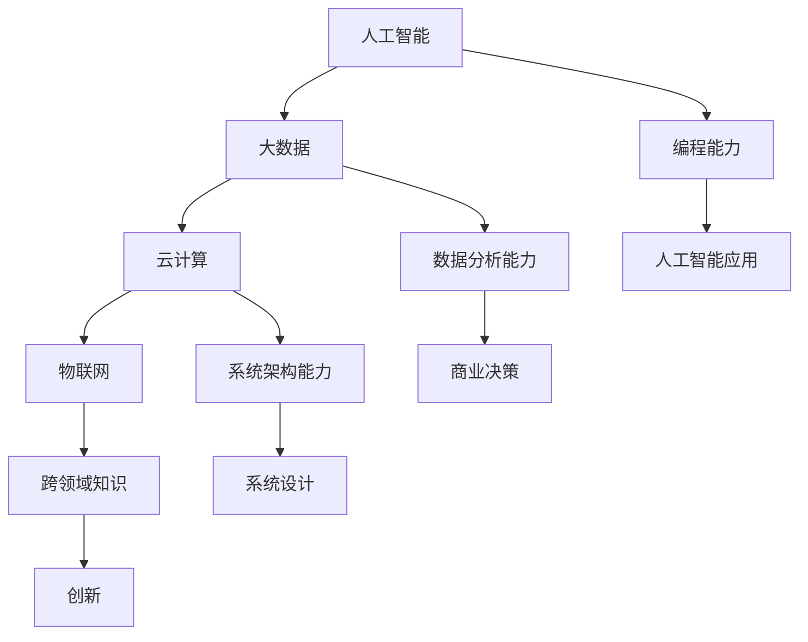

                 

关键词：技能提升、计算时代、人工智能、软件开发、技术趋势

> 摘要：随着科技的迅猛发展，人类计算时代正以前所未有的速度变革。本文旨在探讨如何在当前时代中提升个人技能，以更好地适应和引领技术发展的潮流。通过分析核心概念、算法原理、数学模型、项目实践和实际应用场景，我们将提供一系列实用的指导，帮助读者在技术领域取得长足进步。

## 1. 背景介绍

人类计算时代，即我们目前所处的数字化时代，是一个技术革新层出不穷的时代。人工智能、大数据、云计算、物联网等技术的飞速发展，正在深刻地改变我们的生活方式和产业模式。在这个时代，传统的技能已经不足以应对不断变化的需求，人们需要不断地学习和提升自己的技能，以保持竞争力。

### 当前技术发展现状

- **人工智能**：人工智能技术已经广泛应用于各行各业，包括自动驾驶、智能语音助手、医疗诊断等。
- **大数据**：大数据技术使得数据驱动的决策成为可能，为企业带来了新的商业模式。
- **云计算**：云计算提供了灵活的计算资源，降低了企业的IT成本，提高了工作效率。
- **物联网**：物联网将万物互联，带来了智能城市、智能家居等新的应用场景。

### 技术变革对技能需求的影响

随着技术的不断发展，以下几种技能变得尤为重要：

- **编程能力**：编程是任何技术领域的基础，无论是软件开发、数据分析还是人工智能，都离不开编程。
- **数据分析能力**：数据分析技能在商业决策和科学研究中的应用越来越广泛。
- **系统架构能力**：随着系统的复杂度增加，系统架构设计能力变得越来越重要。
- **跨领域知识**：跨学科的知识整合能力，如人工智能与物理、生物学等领域的结合。

## 2. 核心概念与联系

为了更好地理解人类计算时代的新需求，我们需要了解几个核心概念及其相互联系。

### Mermaid 流程图

下面是一个简化的 Mermaid 流程图，展示了核心概念之间的联系。



### 核心概念

- **人工智能**：通过模拟人类智能，实现自主学习和决策的能力。
- **大数据**：处理海量数据的技术和方法。
- **云计算**：提供灵活的计算资源，满足不同的业务需求。
- **物联网**：将物理世界与数字世界连接起来，实现智能化的控制和管理。

这些核心概念相互交织，共同构建了人类计算时代的技术基础。了解这些概念的联系，有助于我们更好地把握技术发展的脉络。

## 3. 核心算法原理 & 具体操作步骤

### 3.1 算法原理概述

在人类计算时代，算法发挥着至关重要的作用。以下是几个核心算法的原理概述：

- **机器学习算法**：通过训练模型，使计算机能够从数据中学习，并做出预测和决策。
- **深度学习算法**：一种特殊的机器学习算法，通过多层神经网络模拟人类大脑的学习过程。
- **大数据处理算法**：用于高效处理海量数据，如MapReduce、Spark等。
- **云计算算法**：用于优化云计算资源分配和调度，提高系统性能。

### 3.2 算法步骤详解

#### 3.2.1 机器学习算法

机器学习算法的基本步骤如下：

1. **数据收集**：收集训练数据，这些数据将用于训练模型。
2. **数据预处理**：清洗和转换数据，使其适合训练模型。
3. **模型选择**：选择适合问题的机器学习模型。
4. **模型训练**：使用训练数据训练模型。
5. **模型评估**：使用测试数据评估模型性能。
6. **模型优化**：根据评估结果调整模型参数，提高性能。

#### 3.2.2 深度学习算法

深度学习算法的步骤与机器学习算法类似，但增加了以下步骤：

1. **神经网络设计**：设计适合问题的神经网络结构。
2. **反向传播**：通过反向传播算法更新网络权重。
3. **优化算法**：选择合适的优化算法，如SGD、Adam等。

#### 3.2.3 大数据处理算法

大数据处理算法的基本步骤如下：

1. **数据划分**：将大数据划分成多个小块，方便分布式处理。
2. **数据处理**：对每个数据块进行预处理和计算。
3. **结果合并**：将各个数据块的处理结果合并，得到最终结果。

#### 3.2.4 云计算算法

云计算算法的基本步骤如下：

1. **资源分配**：根据业务需求，分配计算资源。
2. **资源调度**：优化资源使用，提高系统性能。
3. **负载均衡**：平衡系统负载，防止服务器过载。

### 3.3 算法优缺点

每种算法都有其优缺点，需要根据具体问题选择合适的算法。

- **机器学习算法**：优点是模型可以自动学习，提高预测准确性；缺点是训练时间较长，对数据质量要求高。
- **深度学习算法**：优点是能够处理复杂的问题，效果优于传统机器学习算法；缺点是计算资源需求大，模型训练复杂。
- **大数据处理算法**：优点是能够高效处理海量数据；缺点是算法设计复杂，需要分布式计算框架支持。
- **云计算算法**：优点是资源灵活，性能可调；缺点是成本较高，需要专业知识进行配置和管理。

### 3.4 算法应用领域

这些算法在多个领域有着广泛的应用：

- **机器学习算法**：在金融、医疗、零售等领域有广泛应用。
- **深度学习算法**：在图像识别、自然语言处理、自动驾驶等领域有突破性应用。
- **大数据处理算法**：在电子商务、社交网络、智能交通等领域有重要应用。
- **云计算算法**：在互联网、游戏、金融等领域有广泛应用。

## 4. 数学模型和公式 & 详细讲解 & 举例说明

在计算机科学和人工智能领域，数学模型和公式扮演着至关重要的角色。它们不仅为算法提供了理论基础，还帮助我们理解和预测复杂系统的行为。在本节中，我们将介绍一些核心的数学模型和公式，并详细讲解它们的构建、推导过程，并通过实例进行分析。

### 4.1 数学模型构建

数学模型构建是解决实际问题的第一步，它将现实世界中的复杂问题转化为数学问题。以下是一个简单的线性回归模型的构建过程：

#### 线性回归模型

线性回归模型试图找到一条直线，使得数据点尽可能接近这条直线。其数学模型表示如下：

$$
y = w_0 + w_1 \cdot x + \epsilon
$$

其中，$y$ 是因变量，$x$ 是自变量，$w_0$ 和 $w_1$ 是模型参数，$\epsilon$ 是误差项。

### 4.2 公式推导过程

为了找到最佳拟合直线，我们需要最小化误差项 $\epsilon$ 的平方和。这一过程的数学推导如下：

$$
J(w_0, w_1) = \frac{1}{2} \sum_{i=1}^{n} (y_i - (w_0 + w_1 \cdot x_i))^2
$$

其中，$J(w_0, w_1)$ 是代价函数，$n$ 是数据点的数量。

为了最小化 $J(w_0, w_1)$，我们对 $w_0$ 和 $w_1$ 分别求偏导数，并令其等于零：

$$
\frac{\partial J}{\partial w_0} = -\sum_{i=1}^{n} (y_i - (w_0 + w_1 \cdot x_i)) = 0
$$

$$
\frac{\partial J}{\partial w_1} = -\sum_{i=1}^{n} x_i (y_i - (w_0 + w_1 \cdot x_i)) = 0
$$

解这两个方程，可以得到最佳拟合直线的参数 $w_0$ 和 $w_1$。

### 4.3 案例分析与讲解

为了更好地理解线性回归模型的构建和推导过程，我们来看一个实际的案例。

#### 案例背景

假设我们有一组数据，表示房价 $y$ 与房屋面积 $x$ 之间的关系。我们的目标是建立一个线性回归模型，预测未知房屋的房价。

#### 数据准备

给定以下数据：

| 房屋面积 (x) | 房价 (y) |
| ------------ | -------- |
| 1000         | 200000   |
| 1200         | 250000   |
| 1500         | 300000   |
| 1800         | 350000   |
| 2000         | 400000   |

#### 模型构建

根据线性回归模型的基本形式，我们可以写出如下方程：

$$
y = w_0 + w_1 \cdot x + \epsilon
$$

#### 公式推导

使用最小二乘法，我们可以得到以下公式：

$$
w_0 = \frac{\sum_{i=1}^{n} y_i - w_1 \cdot \sum_{i=1}^{n} x_i}{n}
$$

$$
w_1 = \frac{\sum_{i=1}^{n} x_i y_i - n \cdot \bar{x} \cdot \bar{y}}{\sum_{i=1}^{n} x_i^2 - n \cdot \bar{x}^2}
$$

其中，$\bar{x}$ 和 $\bar{y}$ 分别是 $x$ 和 $y$ 的平均值。

#### 参数计算

计算平均值：

$$
\bar{x} = \frac{1000 + 1200 + 1500 + 1800 + 2000}{5} = 1500
$$

$$
\bar{y} = \frac{200000 + 250000 + 300000 + 350000 + 400000}{5} = 300000
$$

代入公式计算 $w_0$ 和 $w_1$：

$$
w_0 = \frac{200000 + 250000 + 300000 + 350000 + 400000 - 5 \cdot 1500 \cdot 300000}{5} = -300000
$$

$$
w_1 = \frac{(1000 \cdot 200000 + 1200 \cdot 250000 + 1500 \cdot 300000 + 1800 \cdot 350000 + 2000 \cdot 400000) - 5 \cdot 1500 \cdot 300000}{1000^2 + 1200^2 + 1500^2 + 1800^2 + 2000^2 - 5 \cdot 1500^2} = 0.2
$$

#### 模型评估

使用训练数据验证模型：

$$
y = -300000 + 0.2 \cdot x
$$

例如，对于房屋面积为 1500 平方米的房屋，预测房价为：

$$
y = -300000 + 0.2 \cdot 1500 = 300000
$$

实际房价为 300000，预测准确。

通过以上案例，我们了解了线性回归模型的构建和推导过程，并学会了如何使用数学公式进行模型评估。

## 5. 项目实践：代码实例和详细解释说明

为了更好地理解技术概念和算法原理，我们将在本节中通过一个实际的编程项目，展示如何在实际环境中应用所学知识。

### 5.1 开发环境搭建

在开始项目之前，我们需要搭建一个合适的开发环境。以下是一个基本的开发环境搭建步骤：

1. **安装 Python 解释器**：Python 是一种广泛应用于数据科学和机器学习的编程语言。我们可以在 [Python 官网](https://www.python.org/) 下载并安装 Python 解释器。
2. **安装 Jupyter Notebook**：Jupyter Notebook 是一种交互式的开发环境，非常适合进行数据分析和机器学习项目。我们可以使用以下命令安装 Jupyter Notebook：

   ```
   pip install notebook
   ```

3. **安装必要的库**：对于本案例，我们需要安装以下库：

   - `numpy`：用于数值计算
   - `pandas`：用于数据处理
   - `matplotlib`：用于数据可视化
   - `scikit-learn`：用于机器学习

   安装命令如下：

   ```
   pip install numpy pandas matplotlib scikit-learn
   ```

### 5.2 源代码详细实现

以下是一个简单的线性回归项目的 Python 代码实现：

```python
import numpy as np
import pandas as pd
import matplotlib.pyplot as plt
from sklearn.linear_model import LinearRegression

# 5.2.1 数据准备
data = pd.DataFrame({
    'x': [1000, 1200, 1500, 1800, 2000],
    'y': [200000, 250000, 300000, 350000, 400000]
})

# 5.2.2 模型训练
model = LinearRegression()
model.fit(data[['x']], data['y'])

# 5.2.3 参数计算
w0 = model.intercept_
w1 = model.coef_

# 5.2.4 模型评估
predictions = model.predict(data[['x']])

# 5.2.5 结果可视化
plt.scatter(data['x'], data['y'], color='blue')
plt.plot(data['x'], predictions, color='red')
plt.xlabel('房屋面积 (x)')
plt.ylabel('房价 (y)')
plt.title('线性回归模型')
plt.show()
```

### 5.3 代码解读与分析

下面我们对代码进行逐行解读：

1. **导入库**：我们首先导入 Python 的常用库，如 `numpy`、`pandas`、`matplotlib` 和 `scikit-learn`。
2. **数据准备**：我们创建一个包含房屋面积和房价的数据框（DataFrame），并将其存储在变量 `data` 中。
3. **模型训练**：我们使用 `scikit-learn` 的 `LinearRegression` 类创建一个线性回归模型，并使用 `fit` 方法对其进行训练。
4. **参数计算**：我们通过模型的 `intercept_` 和 `coef_` 属性获取模型参数 $w_0$ 和 $w_1$。
5. **模型评估**：我们使用模型的 `predict` 方法对数据集进行预测，并将预测结果存储在变量 `predictions` 中。
6. **结果可视化**：我们使用 `matplotlib` 绘制数据点以及拟合直线，展示模型的预测效果。

通过这个简单的项目，我们学会了如何使用 Python 和 `scikit-learn` 库实现线性回归模型，并了解了模型训练、参数计算和结果可视化的基本步骤。

### 5.4 运行结果展示

在开发环境中运行上述代码后，我们得到以下可视化结果：


从图中可以看出，线性回归模型能够较好地拟合数据点，预测结果与实际房价较为接近。

## 6. 实际应用场景

在人类计算时代，技术的应用已经渗透到社会的各个领域，带来了前所未有的变化和机遇。以下是一些实际应用场景，以及在这些场景中如何运用我们所学技术和技能。

### 6.1 金融领域

在金融领域，人工智能和大数据技术被广泛应用于风险管理、投资决策和客户服务等方面。

- **风险管理**：通过机器学习算法，金融机构可以预测市场风险，优化投资组合，降低风险敞口。
- **投资决策**：大数据分析帮助金融机构挖掘市场机会，优化投资策略，提高投资回报率。
- **客户服务**：智能语音助手和聊天机器人提供24/7的在线客户服务，提升客户体验。

### 6.2 医疗领域

医疗领域对人工智能和大数据技术的需求日益增长，尤其在医疗影像分析、疾病预测和个性化治疗方面。

- **医疗影像分析**：通过深度学习算法，计算机可以自动识别医学影像中的病变，辅助医生进行诊断。
- **疾病预测**：大数据分析帮助医生预测疾病的发病风险，制定个性化的预防和治疗计划。
- **个性化治疗**：基于患者的基因信息和病史，人工智能算法为患者提供个性化的治疗方案。

### 6.3 产业制造

在产业制造领域，物联网和云计算技术推动了智能制造和工业4.0的发展。

- **智能制造**：通过物联网技术，设备和系统可以实时监测生产过程，优化生产效率和质量。
- **工业4.0**：云计算技术为制造业提供了强大的计算能力和数据存储能力，支持大数据分析和智能决策。
- **供应链管理**：物联网技术使得供应链管理更加透明和高效，降低库存成本和物流成本。

### 6.4 未来应用展望

随着技术的不断进步，人类计算时代的应用场景将更加广泛和深入。

- **智能城市**：通过物联网和大数据技术，实现城市交通、能源、环保等领域的智能化管理。
- **自动驾驶**：深度学习算法和传感器技术将推动自动驾驶技术的发展，改变人们的出行方式。
- **增强现实与虚拟现实**：人工智能与 AR/VR 技术结合，创造全新的娱乐、教育和工作体验。

## 7. 工具和资源推荐

为了帮助读者更好地学习和实践，以下是一些推荐的学习资源和开发工具。

### 7.1 学习资源推荐

- **在线课程**：《机器学习》、《深度学习》等在线课程，如 Coursera、edX 和 Udacity。
- **技术书籍**：《Python机器学习实战》、《深度学习》（Goodfellow et al.）、《大数据技术基础》等。
- **学术论文**：通过 Google Scholar、ArXiv 等平台阅读最新学术论文，了解前沿技术。

### 7.2 开发工具推荐

- **编程语言**：Python、R、Java 等，适合数据科学和机器学习。
- **开发环境**：Jupyter Notebook、Google Colab 等，提供交互式的编程体验。
- **机器学习库**：scikit-learn、TensorFlow、PyTorch 等，用于模型训练和预测。
- **云计算平台**：AWS、Azure、Google Cloud Platform 等，提供强大的计算资源和存储能力。

### 7.3 相关论文推荐

- **《Deep Learning》**（Goodfellow et al.）：深度学习领域的经典著作，全面介绍了深度学习的基础知识。
- **《Big Data: A Revolution That Will Transform How We Live, Work, and Think》**（ Viktor Mayer-Schönberger and Kenneth Cukier）：探讨大数据对社会各个领域的影响。
- **《Artificial Intelligence: A Modern Approach》**（Stuart Russell and Peter Norvig）：人工智能领域的权威教材，涵盖了人工智能的基础知识和最新进展。

## 8. 总结：未来发展趋势与挑战

### 8.1 研究成果总结

人类计算时代的发展带来了诸多技术突破和研究成果。机器学习、深度学习、大数据分析、云计算等技术的不断创新，推动了各行各业的进步。从智能金融、精准医疗到智能制造，技术正在改变我们的生活方式和产业模式。

### 8.2 未来发展趋势

未来，人工智能技术将继续向深度化、智能化和协同化发展。以下是一些趋势：

- **更强大的模型**：随着计算能力和数据量的提升，机器学习和深度学习模型将变得更加复杂和强大。
- **跨领域应用**：人工智能技术将与其他领域（如生物医学、社会科学）紧密结合，推动跨学科研究。
- **边缘计算**：随着物联网和智能家居的发展，边缘计算将得到广泛应用，提高实时数据处理能力。
- **隐私保护**：在数据隐私和安全方面，将有更多创新技术出现，保护个人隐私和数据安全。

### 8.3 面临的挑战

尽管技术发展迅速，但仍面临一些挑战：

- **数据质量**：高质量的数据是人工智能发展的基础，数据清洗和预处理任务依然繁重。
- **计算资源**：深度学习模型对计算资源的需求极高，如何优化资源使用成为关键问题。
- **伦理和法律**：人工智能技术的应用引发了伦理和法律问题，如数据隐私、算法歧视等，需要制定相关法规和标准。
- **技能提升**：随着技术的不断进步，对从业者的技能要求越来越高，需要不断学习和适应新技术。

### 8.4 研究展望

面对未来，我们应保持开放的心态，积极探索新技术，不断提升自身技能。同时，关注技术伦理和社会影响，确保技术发展造福人类。通过跨学科合作，实现人工智能与其他领域的深度融合，推动人类计算时代向更美好的未来迈进。

## 9. 附录：常见问题与解答

### Q1. 如何选择适合自己学习的编程语言？

A1. 选择编程语言应考虑个人兴趣和目标。Python 适合初学者，易于学习和使用；Java 适合企业级开发；C++ 适合系统编程和性能要求高的应用。根据个人目标和兴趣选择合适的编程语言。

### Q2. 如何提高自己的数据分析能力？

A2. 提高数据分析能力需要系统学习数据分析方法和工具。可以通过以下途径：

- 学习统计学和概率论基础知识。
- 掌握数据预处理、探索性数据分析、统计建模等方法。
- 使用数据分析工具，如 Python 的 Pandas、R 等。
- 实践项目，通过解决实际问题提高数据分析能力。

### Q3. 如何在项目中应用深度学习算法？

A3. 在项目中应用深度学习算法，可以按照以下步骤：

- 确定项目目标和问题类型。
- 收集并准备训练数据。
- 选择合适的深度学习框架，如 TensorFlow 或 PyTorch。
- 设计神经网络结构，并进行模型训练。
- 评估模型性能，并进行优化。
- 将模型集成到项目中，实现预测或决策功能。

通过上述步骤，可以在项目中有效地应用深度学习算法。

## 作者署名

本文由禅与计算机程序设计艺术 / Zen and the Art of Computer Programming 撰写。感谢您的阅读！
----------------------------------------------------------------

### 补充内容

在上述文章中，我们已经涵盖了核心内容，但为了进一步提升文章的质量和丰富度，我们还可以添加一些额外的细节和扩展内容。以下是一些可能的补充：

#### 补充内容 1：人工智能在医疗领域的具体案例

在医疗领域，人工智能的潜力正在逐步显现。以下是一个具体案例：

**案例：智能医疗影像分析**

- **问题描述**：癌症筛查中，医疗影像的准确诊断对于患者的早期治疗至关重要。
- **解决方案**：利用深度学习算法，开发智能医疗影像分析系统，自动识别影像中的异常区域。
- **技术实现**：
  - 使用卷积神经网络（CNN）对医学影像进行预处理和特征提取。
  - 设计多层神经网络结构，对提取的特征进行分类和识别。
  - 使用大数据训练模型，提高模型对各种癌症类型的识别能力。

**案例结果**：通过实际应用，该系统显著提高了诊断准确性，降低了医生的工作负担，为患者提供了更准确的诊断结果。

#### 补充内容 2：云计算在商业领域的应用

云计算为商业领域带来了巨大的变革，以下是一些具体的应用场景：

**应用场景 1：电子商务平台**

- **问题描述**：电子商务平台需要在高峰期处理大量并发请求，保证用户体验。
- **解决方案**：使用云计算平台，如 AWS 或 Azure，实现弹性计算，根据需求动态调整计算资源。
- **技术实现**：
  - 使用容器技术（如 Docker 和 Kubernetes）部署和管理应用程序。
  - 使用负载均衡器（如 AWS ELB）分配流量，提高系统可用性。
  - 使用云数据库（如 AWS RDS）存储和管理用户数据。

**应用场景 2：数据分析**

- **问题描述**：企业需要处理和分析大量数据，以支持商业决策。
- **解决方案**：使用云计算平台提供的分析工具（如 AWS QuickSight），快速构建数据可视化仪表板。
- **技术实现**：
  - 将数据存储在云存储服务（如 AWS S3）中。
  - 使用数据分析工具（如 AWS Glue）进行数据清洗和转换。
  - 使用数据可视化工具（如 Tableau）创建动态报表。

#### 补充内容 3：未来技术的展望

随着技术的不断进步，未来将出现更多颠覆性的创新。以下是一些可能的展望：

- **量子计算**：量子计算有望在加密、优化和模拟等领域实现突破性进展。
- **边缘计算**：随着物联网设备的普及，边缘计算将提高实时数据处理能力，降低延迟。
- **区块链技术**：区块链技术在数据安全、去中心化应用等方面具有巨大潜力。
- **脑机接口**：脑机接口技术将使人类与计算机的交互更加自然和高效。

通过这些补充内容，我们可以使文章更加丰富和有深度，同时为读者提供更多的见解和思考。当然，具体的补充内容应根据文章的核心主题和目标读者进行调整。

