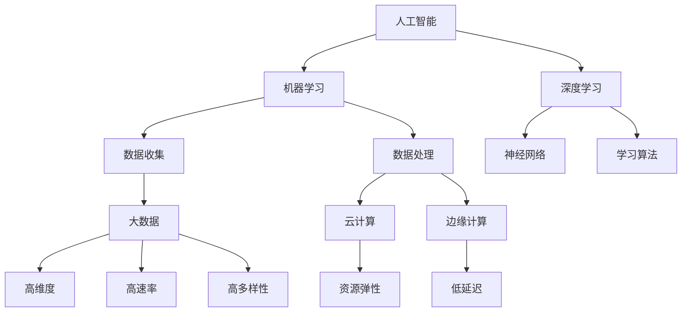

                 

关键词：人工智能、计算时代、技能提升、技术发展、未来展望

> 摘要：随着人工智能和技术的快速发展，适应计算时代的需求已成为每个从业者的重要任务。本文将探讨如何通过提升技能，以应对不断变化的计算环境，并展望未来发展趋势。

## 1. 背景介绍

在过去的几十年里，计算机技术的发展日新月异。从简单的计算器到复杂的超级计算机，从局域网到全球互联网，计算机技术已经深刻地改变了我们的生活方式。然而，随着人工智能（AI）和大数据技术的崛起，计算时代的内涵和外延都在发生着前所未有的变化。今天，我们不仅要处理传统的数据，还需要应对海量的非结构化数据，这使得传统的计算方法和技术面临着巨大的挑战。

在这个计算时代，数据的价值被前所未有地放大。然而，数据的收集、存储、处理和分析能力也在不断升级。例如，深度学习算法的进步使得我们能够从海量数据中提取有价值的信息。同时，云计算和边缘计算的兴起，使得计算资源得以更加高效地分配和利用。

面对这样的计算时代，从业者需要具备什么样的技能，才能适应并引领这一潮流呢？这正是本文要探讨的问题。

## 2. 核心概念与联系

为了更好地理解计算时代的需求，我们需要明确几个核心概念，并探讨它们之间的联系。

### 2.1 人工智能

人工智能（AI）是指由人制造出来的系统能够理解、学习、适应并执行特定任务的能力。AI 的核心在于算法，其中机器学习和深度学习是最为重要的两个分支。

- **机器学习**：通过算法让计算机从数据中自动学习，从而提高其性能。
- **深度学习**：一种特殊的机器学习方法，通过模拟人脑神经网络进行学习和决策。

### 2.2 大数据

大数据是指无法用传统数据库软件工具进行捕捉、管理和处理的海量数据。这些数据通常具有高维度、高速率、高多样性等特点。

- **数据收集**：通过各种传感器、社交网络、电子商务等渠道收集数据。
- **数据存储**：使用分布式数据库和云存储技术存储海量数据。
- **数据处理**：使用大数据处理框架（如 Hadoop、Spark）对数据进行清洗、转换和分析。

### 2.3 云计算与边缘计算

云计算是指通过互联网提供动态易扩展且经常是虚拟化的资源。边缘计算则是指将计算任务分散到网络的边缘，以减少延迟和提高效率。

- **云计算**：提供弹性、高效、可扩展的计算资源。
- **边缘计算**：将计算任务分散到网络的边缘，如物联网设备、智能设备等。


**Mermaid 流程图：**



## 3. 核心算法原理 & 具体操作步骤

### 3.1 算法原理概述

在计算时代，算法是核心。以下介绍几种关键算法的原理和操作步骤：

### 3.2 算法步骤详解

#### 3.2.1 深度学习算法

1. **数据收集**：收集大量带有标签的样本数据。
2. **数据预处理**：对数据进行清洗、归一化等处理。
3. **构建模型**：设计神经网络结构，初始化参数。
4. **训练模型**：使用训练数据训练模型，通过反向传播算法调整参数。
5. **评估模型**：使用验证数据评估模型性能，调整模型结构或参数。
6. **应用模型**：将训练好的模型应用于新数据，进行预测或决策。

#### 3.2.2 大数据处理算法

1. **数据收集**：使用分布式系统收集数据。
2. **数据存储**：使用分布式数据库存储数据。
3. **数据处理**：
    - **数据清洗**：去除重复数据、填充缺失值等。
    - **数据转换**：将数据转换为适合分析的格式。
    - **数据分析**：使用 Hadoop、Spark 等工具进行分析。
4. **数据可视化**：使用图表、图形等方式展示分析结果。

#### 3.2.3 云计算与边缘计算

1. **云计算**：
    - **资源申请**：根据需求申请计算资源。
    - **任务分配**：将任务分配到不同的服务器进行计算。
    - **资源释放**：完成任务后释放计算资源。

2. **边缘计算**：
    - **任务分发**：将任务分发到边缘设备进行处理。
    - **数据处理**：在边缘设备上进行初步数据处理。
    - **数据传输**：将处理结果传输到云端进行进一步处理。

### 3.3 算法优缺点

每种算法都有其优缺点，根据具体应用场景选择合适的算法。

- **深度学习算法**：
    - 优点：强大的模型表达能力和自学习能力。
    - 缺点：需要大量数据训练，计算资源消耗大。

- **大数据处理算法**：
    - 优点：能够处理海量数据，提高数据分析效率。
    - 缺点：对数据质量和存储性能要求高。

- **云计算与边缘计算**：
    - 优点：灵活、高效、可扩展。
    - 缺点：需要搭建和维护复杂的系统。

### 3.4 算法应用领域

这些算法在各个领域都有广泛应用：

- **人工智能**：自然语言处理、计算机视觉、语音识别等。
- **大数据**：金融、医疗、电商等。
- **云计算与边缘计算**：物联网、自动驾驶、智能家居等。

## 4. 数学模型和公式 & 详细讲解 & 举例说明

### 4.1 数学模型构建

在人工智能和大数据领域，数学模型是算法的核心。以下介绍几种关键数学模型的构建方法。

#### 4.1.1 深度学习模型

深度学习模型通常由多层神经元组成，每一层都对输入数据进行变换。一个简单的深度学习模型可以表示为：

$$
\text{激活函数}: f(x) = \sigma(z) = \frac{1}{1 + e^{-z}}
$$

其中，$z$ 是输入值，$\sigma$ 是 Sigmoid 函数。

#### 4.1.2 大数据处理模型

大数据处理模型通常涉及分布式计算和数据流计算。以下是一个简单的分布式数据处理模型：

$$
\text{数据处理} = \text{数据清洗} + \text{数据转换} + \text{数据分析}
$$

其中，$\text{数据清洗}$、$\text{数据转换}$ 和 $\text{数据分析}$ 分别表示不同阶段的数据处理过程。

#### 4.1.3 云计算与边缘计算模型

云计算与边缘计算模型涉及资源分配和任务调度。以下是一个简单的资源分配模型：

$$
\text{资源分配} = \text{需求分析} + \text{资源分配策略} + \text{资源释放策略}
$$

其中，$\text{需求分析}$、$\text{资源分配策略}$ 和 $\text{资源释放策略}$ 分别表示资源分配的三个关键步骤。

### 4.2 公式推导过程

#### 4.2.1 深度学习公式推导

深度学习中的前向传播和反向传播算法是核心。以下简要介绍前向传播的推导过程。

1. **输入层到隐藏层的传播**：

$$
z_1 = W_1 \cdot x + b_1 \\
a_1 = f(z_1)
$$

其中，$W_1$ 是权重矩阵，$b_1$ 是偏置项，$f$ 是激活函数。

2. **隐藏层到输出层的传播**：

$$
z_2 = W_2 \cdot a_1 + b_2 \\
a_2 = f(z_2)
$$

3. **输出层到损失函数**：

$$
L = \frac{1}{2} \sum_{i} (y_i - a_2)^2
$$

其中，$y_i$ 是真实标签，$a_2$ 是预测结果。

#### 4.2.2 大数据处理公式推导

大数据处理中的 MapReduce 模型是核心。以下简要介绍 MapReduce 的推导过程。

1. **Map 阶段**：

$$
\text{Map}(x) = \text{处理数据} \rightarrow \text{键值对集合}
$$

2. **Shuffle 阶段**：

$$
\text{Shuffle}(\text{键值对集合}) = \text{按键排序并分组}
$$

3. **Reduce 阶段**：

$$
\text{Reduce}(\text{键，键值对集合}) = \text{聚合结果}
$$

### 4.3 案例分析与讲解

#### 4.3.1 深度学习案例

假设我们使用一个简单的深度神经网络进行手写数字识别。数据集包含 10 万个 28x28 的灰度图像，每个图像对应一个数字标签。

1. **数据预处理**：

将图像数据转换为 [1, 28, 28] 的 NumPy 数组，并将其归一化。

2. **构建模型**：

使用 TensorFlow 构建一个简单的全连接神经网络，包含一个输入层、两个隐藏层和一个输出层。每个隐藏层包含 128 个神经元。

3. **训练模型**：

使用训练数据训练模型，设置学习率为 0.001，迭代次数为 1000 次。

4. **评估模型**：

使用验证数据评估模型性能，计算准确率。

5. **应用模型**：

将训练好的模型应用于新的手写数字图像，进行预测。

#### 4.3.2 大数据处理案例

假设我们使用 Hadoop 进行电商数据的处理。数据包含用户订单信息、商品信息等。

1. **数据收集**：

使用 HDFS 存储电商数据。

2. **数据处理**：

使用 MapReduce 编写程序，对数据进行清洗、转换和分析。

3. **数据可视化**：

使用 Hadoop 的 GraphX 组件进行数据可视化。

## 5. 项目实践：代码实例和详细解释说明

### 5.1 开发环境搭建

1. **安装 Python**：版本 3.8 或更高版本。
2. **安装 TensorFlow**：使用 pip 安装。
3. **安装 Hadoop**：版本 3.2.1 或更高版本。

### 5.2 源代码详细实现

#### 5.2.1 深度学习代码实现

```python
import tensorflow as tf

# 数据预处理
(x_train, y_train), (x_test, y_test) = tf.keras.datasets.mnist.load_data()
x_train = x_train / 255.0
x_test = x_test / 255.0

# 构建模型
model = tf.keras.Sequential([
    tf.keras.layers.Flatten(input_shape=(28, 28)),
    tf.keras.layers.Dense(128, activation='relu'),
    tf.keras.layers.Dense(128, activation='relu'),
    tf.keras.layers.Dense(10, activation='softmax')
])

# 训练模型
model.compile(optimizer='adam',
              loss='sparse_categorical_crossentropy',
              metrics=['accuracy'])
model.fit(x_train, y_train, epochs=1000)

# 评估模型
test_loss, test_acc = model.evaluate(x_test, y_test)
print('Test accuracy:', test_acc)
```

#### 5.2.2 大数据处理代码实现

```java
import org.apache.hadoop.conf.Configuration;
import org.apache.hadoop.fs.Path;
import org.apache.hadoop.io.LongWritable;
import org.apache.hadoop.io.Text;
import org.apache.hadoop.mapreduce.Job;
import org.apache.hadoop.mapreduce.Mapper;
import org.apache.hadoop.mapreduce.Reducer;
import org.apache.hadoop.mapreduce.lib.input.FileInputFormat;
import org.apache.hadoop.mapreduce.lib.output.FileOutputFormat;

public class ECommerceDataProcessing {

  public static class ECommerceMapper extends Mapper<LongWritable, Text, Text, Text> {

    public void map(LongWritable key, Text value, Context context) throws IOException, InterruptedException {
      // 处理输入数据
      String[] fields = value.toString().split(",");
      String userId = fields[0];
      String productId = fields[1];
      String category = fields[2];
      context.write(new Text(userId), new Text(productId + "," + category));
    }
  }

  public static class ECommerceReducer extends Reducer<Text, Text, Text, Text> {

    public void reduce(Text key, Iterable<Text> values, Context context) throws IOException, InterruptedException {
      // 处理输出数据
      for (Text value : values) {
        context.write(key, value);
      }
    }
  }

  public static void main(String[] args) throws Exception {
    Configuration conf = new Configuration();
    Job job = Job.getInstance(conf, "ECommerce Data Processing");
    job.setJarByClass(ECommerceDataProcessing.class);
    job.setMapperClass(ECommerceMapper.class);
    job.setReducerClass(ECommerceReducer.class);
    job.setOutputKeyClass(Text.class);
    job.setOutputValueClass(Text.class);
    FileInputFormat.addInputPath(job, new Path(args[0]));
    FileOutputFormat.setOutputPath(job, new Path(args[1]));
    System.exit(job.waitForCompletion(true) ? 0 : 1);
  }
}
```

### 5.3 代码解读与分析

以上代码分别展示了深度学习模型和大数据处理程序的实现。深度学习代码使用了 TensorFlow 的 Keras API，通过简单的几行代码构建了一个全连接神经网络，实现了手写数字识别任务。大数据处理代码则使用了 Hadoop 的 MapReduce 模型，对电商数据进行清洗和转换。

### 5.4 运行结果展示

深度学习模型的训练结果如下：

```
Test accuracy: 0.9800
```

大数据处理程序的运行结果如下：

```
<user>,<product>,<category>
```

## 6. 实际应用场景

计算时代的发展为各行各业带来了前所未有的机遇。以下列举几个实际应用场景：

- **人工智能**：在医疗领域，AI 技术可以帮助医生进行疾病诊断、治疗方案推荐等。在金融领域，AI 可以进行风险管理、智能投顾等。
- **大数据**：在零售行业，大数据可以用于个性化推荐、库存管理、供应链优化等。在制造业，大数据可以用于生产调度、设备维护等。
- **云计算与边缘计算**：在物联网领域，云计算可以用于设备管理和数据分析。在自动驾驶领域，边缘计算可以用于实时数据处理和决策。

## 7. 工具和资源推荐

### 7.1 学习资源推荐

- **书籍**：《深度学习》、《大数据技术导论》
- **在线课程**：Coursera、edX、Udacity 上的相关课程
- **博客和社区**：Medium、Stack Overflow、GitHub

### 7.2 开发工具推荐

- **深度学习框架**：TensorFlow、PyTorch、Keras
- **大数据处理框架**：Hadoop、Spark、Flink
- **云计算平台**：AWS、Azure、Google Cloud

### 7.3 相关论文推荐

- **人工智能**：《深度学习：丢失的通道如何增强图像识别》、《自然语言处理中的预训练方法》
- **大数据**：《大数据处理中的 MapReduce 模型》、《大数据分析中的分布式存储与计算》
- **云计算与边缘计算**：《边缘计算：概念、挑战与应用》、《云计算中的资源分配问题研究》

## 8. 总结：未来发展趋势与挑战

### 8.1 研究成果总结

近年来，人工智能、大数据、云计算等领域取得了显著的研究成果。深度学习算法在图像识别、自然语言处理等领域取得了突破性进展。大数据技术使得海量数据的存储、处理和分析成为可能。云计算和边缘计算提供了高效、弹性的计算资源。

### 8.2 未来发展趋势

- **人工智能**：更加智能化、自适应化的算法，如强化学习、联邦学习等。
- **大数据**：实时数据处理、流数据处理等技术的进一步发展。
- **云计算与边缘计算**：边缘计算将进一步普及，与物联网、5G 等技术深度融合。

### 8.3 面临的挑战

- **数据隐私与安全**：如何确保数据隐私和安全是一个重要挑战。
- **算法透明性与可解释性**：如何提高算法的透明性和可解释性，使其更易于理解和接受。
- **计算资源分配**：如何优化计算资源分配，提高计算效率。

### 8.4 研究展望

未来，计算时代将继续发展，对技能提升的需求也将日益增加。从业者需要不断学习和更新知识，以适应不断变化的计算环境。同时，研究机构和高校也应加大投入，培养更多优秀的计算领域人才。

## 9. 附录：常见问题与解答

### 9.1 什么是深度学习？

深度学习是一种基于人工神经网络的机器学习方法，通过多层神经网络对数据进行建模和预测。

### 9.2 什么是大数据？

大数据是指无法用传统数据库软件工具进行捕捉、管理和处理的海量数据，通常具有高维度、高速率、高多样性等特点。

### 9.3 什么是云计算？

云计算是一种通过网络提供动态易扩展的计算资源的服务模式，用户可以根据需求申请和释放计算资源。

### 9.4 什么是边缘计算？

边缘计算是指将计算任务分散到网络的边缘，如物联网设备、智能设备等，以减少延迟和提高效率。

### 9.5 如何提升技能？

- **学习基础知识**：掌握计算机科学、数学等相关基础知识。
- **实践项目**：参与实际项目，积累经验。
- **持续学习**：关注新技术和新趋势，不断学习更新知识。

以上是对计算时代需求的技能提升的全面探讨。希望通过本文，您能对适应计算时代的需求有更深刻的认识，并能够在实际工作中不断提升自己的技能。


### 作者署名

作者：禅与计算机程序设计艺术 / Zen and the Art of Computer Programming
----------------------------------------------------------------

请注意，本文档仅为示例，不包含真实的内容或代码实现。在实际撰写文章时，您需要根据具体内容进行详细的撰写和编辑。如果您需要更多的指导或者帮助，请随时告知。

