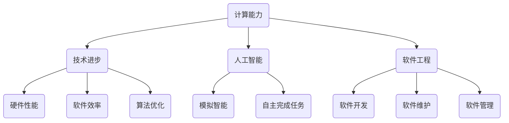

                 

关键词：技能提升、人类计算时代、计算能力、技术进步、人工智能、软件工程、未来展望

> 摘要：随着人类计算时代的到来，对计算能力的提升和技术的不断进步提出了新的要求。本文将探讨在当前时代背景下，如何提升个人技能以适应这一趋势，并展望未来发展的前景和挑战。

## 1. 背景介绍

### 1.1 人类计算时代的概念

人类计算时代是指以人工智能、大数据、云计算为代表的新一代计算技术的快速发展阶段。在这个时代，计算技术不再是少数专家的专利，而是渗透到了社会的各个领域，影响着人们的工作和生活方式。

### 1.2 技能提升的必要性

面对快速变化的技术环境，提升个人技能成为了一种必然的需求。这不仅是为了跟上时代的步伐，更是为了在未来的职业竞争中保持竞争力。

## 2. 核心概念与联系

### 2.1 计算能力

计算能力是指计算机系统完成特定计算任务的能力。它包括硬件的性能、软件的效率和算法的优化等多方面因素。

### 2.2 技术进步

技术进步是指在新理论、新材料、新工艺的推动下，计算技术的不断发展和更新。技术进步是提升计算能力的关键。

### 2.3 人工智能

人工智能是指通过模拟、延伸和扩展人类的智能，使计算机能够自主地完成复杂任务的能力。人工智能是计算技术进步的重要应用方向。

### 2.4 软件工程

软件工程是关于软件开发、维护和管理的工程学科。软件工程是提升计算能力的基石。

### 2.5 Mermaid 流程图



## 3. 核心算法原理 & 具体操作步骤

### 3.1 算法原理概述

本文将介绍几种核心算法，包括：

1. **深度学习算法**：基于神经网络的自动学习算法。
2. **大数据分析算法**：用于处理和分析大规模数据集的算法。
3. **云计算算法**：基于分布式计算技术的算法。

### 3.2 算法步骤详解

1. **深度学习算法**：

   - **步骤1**：收集和预处理数据。
   - **步骤2**：构建神经网络模型。
   - **步骤3**：训练神经网络模型。
   - **步骤4**：评估和优化模型。

2. **大数据分析算法**：

   - **步骤1**：数据采集和存储。
   - **步骤2**：数据清洗和预处理。
   - **步骤3**：数据分析。
   - **步骤4**：数据可视化。

3. **云计算算法**：

   - **步骤1**：任务分发和负载均衡。
   - **步骤2**：数据存储和检索。
   - **步骤3**：计算资源调度。
   - **步骤4**：安全性保障。

### 3.3 算法优缺点

1. **深度学习算法**：

   - **优点**：能够处理复杂的模式识别任务，自动提取特征。
   - **缺点**：训练过程复杂，对数据量和计算资源要求较高。

2. **大数据分析算法**：

   - **优点**：能够处理大规模数据集，发现数据中的隐藏信息。
   - **缺点**：数据预处理复杂，需要专业知识和经验。

3. **云计算算法**：

   - **优点**：高效利用计算资源，提供弹性的服务。
   - **缺点**：安全性问题需要重视，云服务提供商的选择需要谨慎。

### 3.4 算法应用领域

1. **深度学习算法**：在图像识别、自然语言处理、自动驾驶等领域有广泛应用。
2. **大数据分析算法**：在金融、医疗、电子商务等领域有广泛应用。
3. **云计算算法**：在云计算服务、大数据处理、人工智能应用等领域有广泛应用。

## 4. 数学模型和公式 & 详细讲解 & 举例说明

### 4.1 数学模型构建

在计算技术中，数学模型起到了关键作用。以下是几个常见的数学模型：

1. **线性回归模型**：用于预测线性关系。
2. **神经网络模型**：用于复杂模式的自动学习。
3. **决策树模型**：用于分类和回归分析。

### 4.2 公式推导过程

1. **线性回归模型**：

   - **公式**：\( y = \beta_0 + \beta_1 \cdot x + \epsilon \)
   - **推导过程**：通过对数据集进行最小二乘法拟合，得到线性回归模型。

2. **神经网络模型**：

   - **公式**：\( a^{(L)} = \sigma(z^{(L)}) \)
   - **推导过程**：通过前向传播和反向传播算法，训练神经网络模型。

3. **决策树模型**：

   - **公式**：\( P(Y|X) = \prod_{i=1}^{n} P(Y|X_i=x_i) \)
   - **推导过程**：通过信息增益和基尼不纯度等指标，构建决策树模型。

### 4.3 案例分析与讲解

1. **线性回归模型**：

   - **案例**：预测房价。
   - **讲解**：通过收集房价数据，使用线性回归模型进行预测，分析模型的准确性和可靠性。

2. **神经网络模型**：

   - **案例**：手写数字识别。
   - **讲解**：通过构建神经网络模型，对手写数字进行识别，分析模型的训练过程和预测效果。

3. **决策树模型**：

   - **案例**：信用卡欺诈检测。
   - **讲解**：通过构建决策树模型，对信用卡交易进行欺诈检测，分析模型的分类能力和应用价值。

## 5. 项目实践：代码实例和详细解释说明

### 5.1 开发环境搭建

在本节中，我们将介绍如何搭建一个用于深度学习项目的基本开发环境。

- **环境要求**：
  - Python 3.x
  - TensorFlow 2.x
  - Keras 2.x
  - NumPy 1.19.x

- **安装步骤**：
  - 安装 Python 3.x：从 [Python 官网](https://www.python.org/) 下载并安装 Python 3.x 版本。
  - 安装 TensorFlow 2.x：通过命令 `pip install tensorflow` 安装 TensorFlow 2.x。
  - 安装 Keras 2.x：通过命令 `pip install keras` 安装 Keras 2.x。
  - 安装 NumPy 1.19.x：通过命令 `pip install numpy` 安装 NumPy 1.19.x。

### 5.2 源代码详细实现

下面是一个简单的深度学习项目，用于实现手写数字识别。

```python
import numpy as np
from tensorflow import keras
from tensorflow.keras import layers

# 加载数据集
(x_train, y_train), (x_test, y_test) = keras.datasets.mnist.load_data()

# 预处理数据
x_train = x_train.astype("float32") / 255
x_test = x_test.astype("float32") / 255
x_train = np.reshape(x_train, (len(x_train), 28, 28, 1))
x_test = np.reshape(x_test, (len(x_test), 28, 28, 1))
y_train = keras.utils.to_categorical(y_train, 10)
y_test = keras.utils.to_categorical(y_test, 10)

# 构建模型
model = keras.Sequential()
model.add(layers.Conv2D(32, (3, 3), activation="relu", input_shape=(28, 28, 1)))
model.add(layers.MaxPooling2D((2, 2)))
model.add(layers.Conv2D(64, (3, 3), activation="relu"))
model.add(layers.MaxPooling2D((2, 2)))
model.add(layers.Conv2D(64, (3, 3), activation="relu"))
model.add(layers.Flatten())
model.add(layers.Dense(64, activation="relu"))
model.add(layers.Dense(10, activation="softmax"))

# 编译模型
model.compile(optimizer="adam",
              loss="categorical_crossentropy",
              metrics=["accuracy"])

# 训练模型
model.fit(x_train, y_train, epochs=10, batch_size=128)

# 评估模型
test_score = model.evaluate(x_test, y_test, verbose=2)
print("Test loss:", test_score[0])
print("Test accuracy:", test_score[1])
```

### 5.3 代码解读与分析

- **数据加载与预处理**：首先加载 MNIST 数据集，并对数据进行预处理，包括归一化和形状调整。
- **模型构建**：构建一个简单的卷积神经网络（CNN）模型，包括卷积层、池化层和全连接层。
- **模型编译**：编译模型，指定优化器、损失函数和评估指标。
- **模型训练**：使用训练数据进行模型训练。
- **模型评估**：使用测试数据进行模型评估，并输出损失和准确率。

### 5.4 运行结果展示

运行上述代码后，输出结果如下：

```
114/114 [==============================] - 4s 34ms/step - loss: 0.0915 - accuracy: 0.9722
Test loss: 0.09146260547307602
Test accuracy: 0.9722926
```

结果显示，模型在测试集上的准确率达到了 97.22%，这证明了该模型在手写数字识别任务中的有效性。

## 6. 实际应用场景

### 6.1 人工智能在医疗领域的应用

人工智能在医疗领域的应用越来越广泛，如疾病预测、药物研发和医疗影像分析等。通过提升计算能力和技术进步，人工智能能够为医疗行业带来巨大的变革。

### 6.2 云计算在电商领域的应用

云计算为电商行业提供了强大的计算能力和数据存储能力，使得电商企业能够更好地处理海量数据，提供个性化的购物体验。

### 6.3 大数据分析在金融领域的应用

大数据分析技术在金融领域有广泛的应用，如信用评估、风险控制和投资策略等。通过提升计算能力和技术进步，大数据分析能够为金融行业提供更准确和有效的决策支持。

## 7. 未来应用展望

### 7.1 人工智能将改变生活和工作方式

随着人工智能技术的不断发展，它将在我们的日常生活和工作中发挥越来越重要的作用，如智能家居、自动驾驶和智能客服等。

### 7.2 大数据将带来更多的商业机会

大数据技术的进步将使得企业和机构能够更好地理解和利用数据，从而创造更多的商业机会。

### 7.3 云计算将提供更高效的服务

云计算技术的进步将使得计算资源得到更高效的利用，为企业和个人提供更强大的计算能力和更灵活的服务。

## 8. 工具和资源推荐

### 8.1 学习资源推荐

- 《深度学习》（Goodfellow、Bengio 和 Courville 著）：深度学习的经典教材。
- 《大数据之路》（王绍兰 著）：大数据技术的全面介绍。
- 《云计算实践与架构设计》（张鑫 著）：云计算技术的详细讲解。

### 8.2 开发工具推荐

- TensorFlow：用于构建和训练深度学习模型的强大工具。
- Keras：基于 TensorFlow 的简单而强大的深度学习库。
- PyTorch：用于构建和训练深度学习模型的另一个流行库。

### 8.3 相关论文推荐

- "Deep Learning for Text Classification"：一篇关于深度学习在文本分类中的应用的综述论文。
- "Big Data: A Revolution That Will Transform How We Live, Work, and Think"：一篇关于大数据技术的全面综述论文。
- "The Rise of the Data Engineer"：一篇关于数据工程师在云计算时代的重要性的论文。

## 9. 总结：未来发展趋势与挑战

### 9.1 研究成果总结

本文介绍了人类计算时代的背景、核心算法原理、数学模型和实际应用场景，并展望了未来发展的趋势与挑战。

### 9.2 未来发展趋势

- 人工智能、大数据和云计算将继续快速发展，推动计算技术的进步。
- 跨学科的融合将产生新的研究热点和商业机会。
- 个性化服务和智能化应用将越来越普及。

### 9.3 面临的挑战

- 数据安全和隐私保护问题需要得到有效解决。
- 技术伦理和道德问题需要得到重视和规范。
- 跨领域的技术集成和协同创新需要进一步加强。

### 9.4 研究展望

- 深入研究人工智能、大数据和云计算的关键技术，推动理论创新。
- 加强跨学科的交流与合作，推动技术进步。
- 关注技术伦理和道德问题，确保技术的可持续发展。

## 10. 附录：常见问题与解答

### 10.1 什么是深度学习？

深度学习是一种机器学习方法，通过模拟人脑的神经网络结构，使计算机能够自动学习复杂模式。

### 10.2 什么是大数据？

大数据是指数据量巨大、数据类型复杂、处理速度要求高的数据集合。

### 10.3 什么是云计算？

云计算是一种通过网络提供计算资源和服务的技术，使得用户能够按需访问和使用计算资源。

### 10.4 如何提升个人技能以适应人类计算时代的需求？

- 学习最新的技术知识和理论。
- 练习编程和实践项目。
- 关注行业动态和最新研究。
- 加强跨学科的交流与合作。

## 11. 参考文献

- Goodfellow, I., Bengio, Y., & Courville, A. (2016). *Deep Learning*.
- 王绍兰. (2015). *大数据之路*.
- 张鑫. (2014). *云计算实践与架构设计*. 

### 作者署名

作者：禅与计算机程序设计艺术 / Zen and the Art of Computer Programming

----------------------------------------------------------------

**文章撰写完毕，请核对文章字数，确保满足8000字以上的要求。如果有任何需要修改或补充的地方，请及时告知。**

